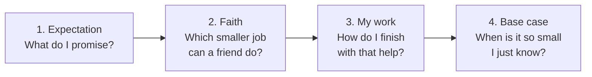
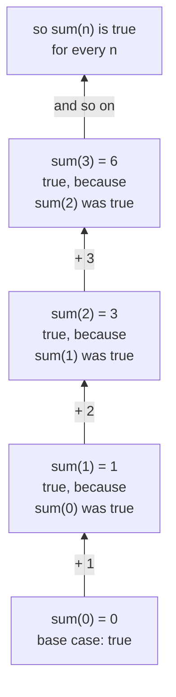

# 01 · The Big Idea

> After this part you can explain recursion with two everyday stories, answer the four questions for a simple
> problem, and say **why** trusting a smaller friend is safe.

🏠 [Guide home](README.md) · [02 · Expectation](02-expectation.md) ➡️

## Contents

1. [The story of recursion](#1-the-story-of-recursion)
2. [The four questions](#2-the-four-questions)
3. [Why faith is safe](#3-why-faith-is-safe)
4. [Exercises](#4-exercises)
5. [One-minute recap](#5-one-minute-recap)

---

## 1. The story of recursion

### The ice-cream line

🍦 You are in a long line at an ice-cream shop and want to know your place. You can't see the front.
So you ask the person in front of you: *"What is your place?"* They don't know either, so they ask the
person in front of **them** … until the question reaches the very front. That person just **knows**:
*"I am number 1!"* Then every person hears the answer, **adds 1**, and passes it back:

```text
 the question goes to the front  --->

    you        Priya      Arun       Meena      Ravi (at the front)
 "my place?" "my place?" "my place?" "my place?"  "I am number 1!"   <- base case
     5    <---   4   <---   3   <---   2   <---    1

 <--- the answers come back, and each person adds 1
```

Everybody in the line does the **same small job**: ask the person in front, add 1, tell the person behind.
Nobody needs to see the whole line. **That is recursion.** 🎉

Three things make it work:

1. The **same question** is asked again and again, each time to someone **closer to the front** —
   a smaller problem.
2. Someone can answer **without asking** — the person at the front. That is the **base case**.
3. Every person **trusts** the answer from the front and only does one tiny step: + 1.

### The Russian dolls

🪆 How many dolls are inside a set of Russian dolls? Open the biggest one. There is **1** doll (the one you
opened) **plus** however many dolls are in the smaller set inside. You don't open the smaller ones in your
head — you **trust** that "count the smaller set" works. When a doll is solid (nothing inside), the answer is
simply 1.

Here is a set of 4 dolls. Every box is one doll, and the smaller set sits **inside** it:

```text
 +------------------------------------------------------------+
 |  doll 1, the big one:   1 + 3 = 4 dolls   <- the answer    |
 |  +------------------------------------------------------+  |
 |  |  doll 2:   1 + 2 = 3                                 |  |
 |  |  +------------------------------------------------+  |  |
 |  |  |  doll 3:   1 + 1 = 2                           |  |  |
 |  |  |  +------------------------------------------+  |  |  |
 |  |  |  |  doll 4:   solid -> 1   <- base case     |  |  |  |
 |  |  |  +------------------------------------------+  |  |  |
 |  |  +------------------------------------------------+  |  |
 |  +------------------------------------------------------+  |
 +------------------------------------------------------------+
```

Read it from the inside out: the solid doll says **1** without opening anything, and every bigger doll only
adds **1** to what the smaller set inside says. Doll 1 never counts dolls 2, 3 and 4 itself — it just trusts
the answer **3** and adds itself.

Keep these two stories in mind. Every recursive idea in this guide is one of them in disguise.

---

## 2. The four questions

Before any code, answer these four questions **in plain words**, always in this order:



Here is the ice-cream line in the four questions:

```text
 EXPECTATION  place(person) tells the place of this person in the line
 FAITH        place(the person in front) tells their place correctly
 MY WORK      my place = their place + 1
 BASE CASE    the person at the very front: place 1
```

And adding up 1 + 2 + … + n:

```text
 EXPECTATION  sum(n) gives 1 + 2 + ... + n
 FAITH        sum(n - 1) already gives 1 + 2 + ... + (n - 1)
 MY WORK      add n to it:  sum(n) = sum(n - 1) + n
 BASE CASE    sum(0) = 0   (nothing to add)
```

That's it. **Four lines, no tracing.** If the four lines are right, the recursion is right. Every exercise
in this guide is answered in this exact shape. Let's look at each line closely.

---

## 3. Why faith is safe

Faith is **not** blind trust. It works for the same reason a line of dominoes falls:

1. **The first domino falls:** the base case keeps the promise.
2. **Each domino knocks over the next:** *if* the promise holds for the smaller input, **my work** makes it
   hold for my input.

So **all** dominoes fall — the promise holds for every input. (In maths this is called **proof by
induction**; see [Maths 16](../../../maths_for_dsa/16-logic-sets-and-proofs/).) The ladder of faith for
sum, climbing from the bottom:



```text
   ▲    sum(3) = sum(2) + 3 = 3 + 3 = 6     true, because sum(2) was true
   │    sum(2) = sum(1) + 2 = 1 + 2 = 3     true, because sum(1) was true
   │    sum(1) = sum(0) + 1 = 0 + 1 = 1     true, because sum(0) was true
   │    sum(0) = 0                          true: the base case
 climb up — each step stands on the one below it
```

This is why you are **allowed** to trust your friend: you never have to check the whole ladder, only two
things — the **bottom step** (base case) and **one step up** (my work, assuming the step below is fine).

---

## 4. Exercises

**No code.** Write the four lines — EXPECTATION, FAITH, MY WORK, BASE CASE — or do what the question asks,
in your own words, before you open the answer. Compare the **ideas**, not the exact words.

**1.** Think about the ice-cream line. (a) Who is the base case, and why can that person answer without asking
anyone? (b) What would happen if the person at the front did **not** just know the answer, and also waited
for an answer from someone in front of them? (c) Which part of the story is "my work"?

<details>
<summary>Answer</summary>

- **(a)** The person at the very **front**. Nobody stands in front of them, so they simply **know**: "I am
  number 1". No friend is needed.
- **(b)** The question would never get an answer, and everyone in the line would wait forever. Without a base
  case the chain of friends never ends — in a program the pile of calls keeps growing until it crashes
  ([part 05](05-the-call-stack.md)).
- **(c)** The **+ 1**: every person adds 1 to the answer from the front and passes it back.

</details>

**2.** You stand in a line and want to know how many people are **behind** you. Write the four lines.

<details>
<summary>Answer</summary>

```text
 EXPECTATION  behind(person) gives how many people stand behind this person
 FAITH        behind(the person just behind me) gives how many stand behind them
 MY WORK      1 (the person just behind me) + their answer
 BASE CASE    nobody behind me: 0
```

Check with 2 people behind you: the person just behind you says "1 behind me" (trust it) → 1 + 1 = 2 ✅.
The base case is **0**, not 1: the last person in the line has **nobody** behind them. Always check the base
case against the promise.

</details>

**3.** Russian dolls: write the four lines for "how many dolls are in this set?".

<details>
<summary>Answer</summary>

```text
 EXPECTATION  dolls(d) gives the number of dolls in the set whose biggest doll is d
              (d itself and every doll inside it)
 FAITH        dolls(the doll inside d) gives the number of dolls in the smaller set
 MY WORK      1 (for d itself) + the friend's answer
 BASE CASE    d is solid, nothing inside: 1
```

Check with the picture in section 1: for doll 1 the friend says "3 dolls inside" (trust it) → 1 + 3 = 4 ✅.

</details>

**4.** Someone hands you a pile of cards with a number on each card. Write the four lines for adding up all
the numbers, and check your plan on the cards 4, 1, 5.

<details>
<summary>Answer</summary>

```text
 EXPECTATION  total(cards) gives the sum of all the numbers on the cards
 FAITH        total(the cards without the top one) gives the sum of the rest
 MY WORK      the number on the top card + the friend's answer
 BASE CASE    no cards: 0
```

Check 4, 1, 5: the friend gives total(1, 5) = 6 (trust it, don't add it yourself!), I add 4 → 10 ✅.
Why 0 for no cards? "Nothing to add" is 0 — and then one card works too: total(7) = 7 + 0 = 7 ✅.

</details>

**5.** The domino check. A plan promises: "double(n) gives 2 × n". The plan is: double(0) = 0, and
double(n) = double(n − 1) + 2. Check the two domino rules. Is double(1000) right — without computing it?

<details>
<summary>Answer</summary>

- **The first domino falls:** double(0) = 0, and 2 × 0 = 0 ✅.
- **Each domino knocks over the next:** *if* the friend is right, double(n − 1) = 2 × (n − 1) = 2n − 2.
  My work adds 2 → 2n ✅.

Both rules hold, so **every** domino falls: double(1000) = 2000 is right, and you never had to walk through
1,000 steps. That is exactly why you may trust your friend.

</details>

**6.** A broken domino. A plan promises: "square(n) gives n × n". The plan is: square(0) = 0, and
square(n) = square(n − 1) + n. Which domino rule fails? Fix "my work".

<details>
<summary>Answer</summary>

- **The first domino falls:** square(0) = 0 = 0 × 0 ✅.
- **The next domino does not:** trust the friend for square(1) = 1, then square(2) = 1 + 2 = 3 — but
  2 × 2 = 4 ❌. Adding n builds 1 + 2 + … + n, which is the promise of *sum*, not of squares.
- **Fix:** going from (n − 1) × (n − 1) to n × n needs **2n − 1** more. So my work is
  "square(n) = square(n − 1) + 2n − 1": square(2) = 1 + 3 = 4 ✅, square(3) = 4 + 5 = 9 ✅.

**Lesson:** faith is safe only when **both** rules hold. One wrong "my work" knocks every domino after it the
wrong way.

</details>

---

## 5. One-minute recap

- Recursion = the **same small job**, handed to a friend who is **one step closer** to an easy answer.
- Before any code, answer four questions: **EXPECTATION, FAITH, MY WORK, BASE CASE.**
- Faith is safe because of **dominoes**: the base case holds, and each step makes the next one hold.

---

🏠 [Guide home](README.md) · [02 · Expectation](02-expectation.md) ➡️
