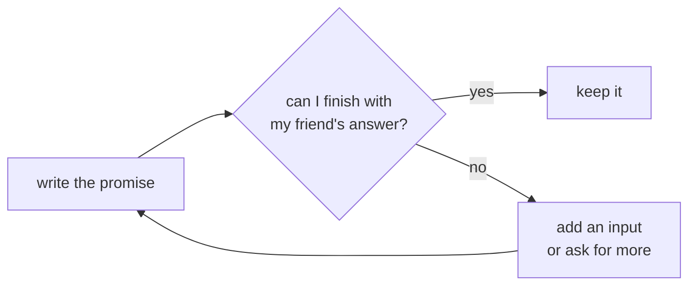

# 02 · Expectation

> After this part you can write a clear promise for any recursive function, make it general enough for every
> friend, and change it when the friend's answer is not enough.

⬅️ [01 · The Big Idea](01-the-big-idea.md) · 🏠 [Guide home](README.md) · [03 · Faith](03-faith.md) ➡️

## Contents

1. [The promise](#1-the-promise)
2. [Exercises](#2-exercises)
3. [One-minute recap](#3-one-minute-recap)

---

## 1. The promise

The expectation is a **promise**, like a contract you sign before starting work. It is the most important
line: a clear promise makes the other three lines easy; a fuzzy promise makes them impossible.

A good expectation:

1. uses the function's name and **every** input (parameter);
2. says exactly what comes **out** — the answer it gives back, or what it prints or changes;
3. works for **every** allowed input, not only the one you care about — your friends will be called with
   **smaller** inputs, and they must keep the same promise;
4. is **checkable**: you could test it on small inputs.

Think of it as a card you could pin on the wall, with one line for each rule:

```text
 +-----------------------------------------------------------------------------------+
 |  PROMISE CARD                                                                     |
 |                                                                                   |
 |  1. the name and every input:   count(a, x, i)                                    |
 |  2. exactly what comes out:     how many times x appears in a[i], a[i + 1], ...,  |
 |                                 up to the last element                            |
 |  3. for which inputs:           every i from 0 up to the length of a              |
 |  4. check it on tiny inputs:    a = 5, 1, 5 and x = 5:                            |
 |                                 count(a, x, 0) = 2,  count(a, x, 1) = 1,          |
 |                                 count(a, x, 3) = 0   (nothing left)               |
 +-----------------------------------------------------------------------------------+
```

Look at line 3: the card works for **every** i, not only for i = 0 — because your friends will be called
with i = 1, 2, 3, … and they must keep the very same promise.

| Fuzzy (bad) | Clear (good) |
|---|---|
| "sum does the adding" | "sum(n) gives 1 + 2 + … + n, for any n ≥ 0" |
| "reverse handles the string" | "reverse(s) gives the letters of s in the opposite order" |
| "count looks for x" | "count(a, x, i) gives how many times x appears in a[i], a[i + 1], …, up to the end" |
| "height finds the depth" | "height(node) gives the number of levels of the tree that starts at node; 0 for no tree" |

### The flexible friend

Sometimes your friend's job has a **slightly different shape** from yours, and the plain promise can't be
trusted. Then make the promise **more general** by adding an input, so that **every** job — yours and all your
friends' — fits the same promise:

- **Tower of Hanoi:** "move n disks from *any* pole to *any* pole using *any* helper pole" — three pole names,
  because your friends move disks between different poles.
- **Arrays and strings:** "work on the part from index i to the end" instead of "work on the whole array",
  because your friend gets the part after you.
- **Backtracking:** "the choices made so far" and "what is still allowed" ([part 08](08-backtracking.md)).

### When the friend's answer is not enough, ask for more

Sometimes you can't finish your job with what the friend gives back. Don't give up on recursion — **change
the promise** so the friend gives you more:



Example: "is this tree balanced? yes or no" is not enough, because to answer for a node you also need the
**heights** of both sides. So promise more: "give the height, or −1 if it is not balanced". That is
exercise 2 below.

🧠 **The expectation is about *what*, never about *how*.** "sum(n) gives 1 + … + n" — not "sum(n) loops" or
"sum(n) calls itself". If you catch yourself describing the steps, you are writing the plan, not the promise.

---

## 2. Exercises

**No code.** Write the four lines — EXPECTATION, FAITH, MY WORK, BASE CASE — or do what the question asks,
in your own words, before you open the answer. Compare the **ideas**, not the exact words.

**1.** Count how many times a value x appears in an array a.

<details>
<summary>Answer</summary>

The plain promise "count(a, x)" has no smaller array to give the friend, so add a start index — the
flexible friend:

```text
 EXPECTATION  count(a, x, i) gives how many times x appears in a[i], a[i + 1], ...,
              up to the last element
 FAITH        count(a, x, i + 1) gives that number for the part after position i
 MY WORK      (1 if a[i] is x, otherwise 0) + the friend's answer
 BASE CASE    i = length of a (an empty part): 0
```

The top call is count(a, x, 0).

</details>

**2.** A tree is **balanced** if, at every node, the heights of its two sides differ by at most 1. First try
the promise "isBalanced(node) says yes or no". Why is it not enough? Then write a stronger promise.

<details>
<summary>Answer</summary>

With only yes/no from the friends, you still don't know the **heights** of the two sides, so you would have to
compute heights again at every node — lots of repeated work. **Ask your friends for more:**

```text
 EXPECTATION  check(node) gives the height of the tree at node if it is balanced,
              or -1 if it is not
 FAITH        check(left child) and check(right child) keep this promise
 MY WORK      if either friend says -1: answer -1;
              if the two heights differ by more than 1: answer -1;
              otherwise: 1 + the bigger height
 BASE CASE    no node: 0 (an empty tree is balanced, with height 0)
```

The whole tree is balanced when check(root) is not −1. **Lesson:** when the friend's answer isn't enough,
change the promise so the friend gives you more.

</details>

**3.** Turn each fuzzy promise into a clear one: (a) "biggest finds the big one" (in an array);
(b) "paths does the grid" (a robot that moves only right or down); (c) "power works it out";
(d) "vowels looks at the word".

<details>
<summary>Answer</summary>

- **(a)** biggest(a, i) gives the biggest value among a[i], a[i + 1], …, the last element (there is at least
  one element from position i on).
- **(b)** paths(r, c) gives the number of different paths from cell (r, c) to the bottom-right cell, moving
  only right or down.
- **(c)** power(a, n) gives aⁿ, for every n ≥ 0.
- **(d)** vowels(s, i) gives how many letters of s, from position i to the end, are vowels.

Each one names **every** input, says **exactly** what comes out, works for the friends' inputs too, and can be
checked on a tiny input.

</details>

**4.** Promise or plan? Say which sentences are **promises** (what) and which are **plans** (how), and turn the
plans into promises. (a) "sum(n) calls sum(n − 1) and adds n." (b) "height(node) gives the number of levels
of the tree at node; 0 for no node." (c) "pal(s, i, j) checks the two ends and moves inward." (d) "reverse(s)
gives the letters of s in the opposite order." (e) "count(a, x, i) loops from i to the end."

<details>
<summary>Answer</summary>

- **(a)** A plan. Promise: "sum(n) gives 1 + 2 + … + n".
- **(b)** A promise ✅.
- **(c)** A plan. Promise: "pal(s, i, j) says yes if the letters of s from position i to j read the same both
  ways".
- **(d)** A promise ✅.
- **(e)** A plan. Promise: "count(a, x, i) gives how many times x appears from a[i] to the end".

**Tip:** words like *calls, loops, checks, moves, goes* are **how** words. A promise only says what comes out.

</details>

**5.** A student writes: EXPECTATION "printAll(a) prints every element of a, one per line, starting from a[0]";
FAITH "printAll prints the elements from a[1] on". What is wrong? Fix it.

<details>
<summary>Answer</summary>

The friend's job ("from a[1] on") does **not** fit the promise ("from a[0]"), so the friend could not keep
it. Make the promise flexible with a start index:

```text
 EXPECTATION  printFrom(a, i) prints a[i], a[i + 1], ..., the last element, one per line
 FAITH        printFrom(a, i + 1) prints everything after a[i]
 MY WORK      print a[i] FIRST, then let the friend print the rest
 BASE CASE    i = length of a: print nothing
```

The top call is printFrom(a, 0). Now you **and** every friend keep the same promise.

</details>

**6.** Tower of Hanoi: why is the promise "hanoi(n) moves n disks from pole A to pole C" not enough? Write a
promise that works for every friend, and then the four lines.

<details>
<summary>Answer</summary>

Your friends move disks from A to **B** and from **B** to C — not from A to C. With the plain promise you
could not trust them. Add the three pole names:

```text
 EXPECTATION  hanoi(n, from, to, helper) moves the top n disks from pole "from" to pole
              "to", using pole "helper", never putting a bigger disk on a smaller one
 FAITH        hanoi(n - 1, from, helper, to) moves the n - 1 small disks out of the way;
              hanoi(n - 1, helper, to, from) moves them back on top
 MY WORK      between the two friends: move disk n from "from" to "to"
 BASE CASE    n = 0: do nothing
```

The whole story is in the [Tower of Hanoi lesson](../tower-of-hanoi/).

</details>

**7.** Ask for more: the **diameter** of a binary tree is the number of edges on the longest path between any
two nodes. First try the promise "diameter(node) gives the diameter of the tree at node". Why is it not
enough? Write a stronger promise and test it on this tree (root at the bottom; A has only one child, B):

```text
        E           F
        ▲           ▲
        │           │
        │           │
        C           D
        ▲           ▲
        └─────┬─────┘
              │
              B
              ▲
              │
              │
        A (the root)
```

<details>
<summary>Answer</summary>

The longest path can go **through** a node: as deep as possible into its left side, and as deep as possible
into its right side. For that you need the **heights** of both sides — and the plain promise doesn't give
them. But the longest path can also lie completely **inside** one side. So ask your friends for two things:

```text
 EXPECTATION  info(node) gives two numbers for the tree at node: its height,
              and the longest path found anywhere inside it
 FAITH        info(left child) and info(right child) keep this promise
 MY WORK      height = 1 + the bigger of the two heights;
              longest = the biggest of: the left longest, the right longest,
                        and left height + right height (the path through node)
 BASE CASE    no node: height 0, longest 0
```

In the tree: at B, the sides C and D both have height 2, so the path through B has 2 + 2 = **4** edges
(E, C, B, D, F). At A, the path through A has only 3 + 0 = 3 edges, so the answer stays **4** — a longest
path that does **not** pass through the root. That's why the promise must also remember "the longest
anywhere inside".

</details>

**8.** Tell the friend more: in a binary tree, a node is **good** if no node on the path from the root to it
has a bigger value. You want to count the good nodes. What does a friend need to know that the plain
promise "good(node) gives the number of good nodes in the tree at node" doesn't tell it? Test it on:

```text
                4         6
                ▲         ▲
                └────┬────┘
                     │
      1              5
      ▲              ▲
      └──────┬───────┘
             │
       2 (the root)
```

<details>
<summary>Answer</summary>

A node can't know if it is good by looking at itself and below — it needs the **biggest value above it**.
So hand that to the friend as an extra input:

```text
 EXPECTATION  good(node, best) gives the number of good nodes in the tree at node,
              where best is the biggest value on the path from the root to node
              (not counting node itself)
 FAITH        good(left child, new best) and good(right child, new best) count
              their sides, where new best = the bigger of best and node's value
 MY WORK      (1 if node's value >= best, otherwise 0) + both friends' answers
 BASE CASE    no node: 0
```

The top call gives the root a very small "best", so the root is always good. In the tree: 2 ✅ (the root),
1 ❌ (2 is above it), 5 ✅, 4 ❌ (5 is above it), 6 ✅ → **3** good nodes.

Exercise 7 **asks for more** from the friends (answers coming back); this one **tells the friends more**
(an extra input going to them). Both are ways to change the promise.

</details>

**9.** Binary search: find a position of x in a **sorted** array, or say that x is not there. Write the four
lines. Why must "−1 if x is not there" be part of the promise?

<details>
<summary>Answer</summary>

```text
 EXPECTATION  find(lo, hi) gives a position of x among a[lo], ..., a[hi],
              or -1 if x is not there
 FAITH        find(lo, mid - 1) searches the left half, find(mid + 1, hi) the right half
              (mid = the middle position)
 MY WORK      if a[mid] is x: answer mid;
              if x is smaller than a[mid]: ask only the left friend;
              otherwise: ask only the right friend -- and pass its answer on
 BASE CASE    lo > hi (an empty part): -1
```

Your friends answer with the **same** promise, so they will sometimes say −1. You must understand what that
means — "x is not in my half" — to pass it on. Since the array is sorted, x can't be in the other half, so
−1 is also **your** answer. A promise without the −1 would leave you guessing.

</details>

**10.** Path sum: is there a path from the root to a **leaf** whose values add up to a target? Write a
promise your friends can use, and test it with the target 12 on this tree:

```text
      2         4
      ▲         ▲
      └────┬────┘
           │
           3              8
           ▲              ▲
           └──────┬───────┘
                  │
            5 (the root)
```

<details>
<summary>Answer</summary>

The friends don't need the same target as you — your node's value is already used up. Hand them **what is
still missing**:

```text
 EXPECTATION  has(node, rest) says yes if some path from node to a leaf
              adds up to exactly rest
 FAITH        has(each child, rest - node's value) answers that for each side
 MY WORK      if node is a leaf: yes only if node's value = rest;
              otherwise: yes if either friend says yes
 BASE CASE    no node: no
```

Target 12: the root 5 hands 12 − 5 = 7 to its children. 8 is a leaf, but 8 ≠ 7 → no. 3 hands 7 − 3 = 4 on:
the leaf 2 says no, the leaf 4 says **yes** (4 = 4). So the answer is **yes**: 5 + 3 + 4 = 12 ✅.

</details>

---

## 3. One-minute recap

- The expectation is a **promise**: it names every input and says exactly what comes out, for **every**
  allowed input.
- Make it general enough for every friend — the **flexible friend** (a start index, pole names, the path so
  far).
- If you can't finish with the friend's answer, **change the promise**: add an input or ask for more.
- The promise says **what**, never **how**.

---

⬅️ [01 · The Big Idea](01-the-big-idea.md) · 🏠 [Guide home](README.md) · [03 · Faith](03-faith.md) ➡️
