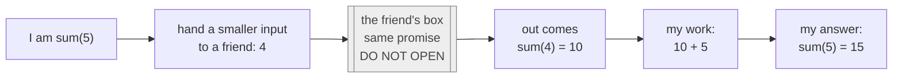

# 03 · Faith

> After this part you can find the smaller job in any problem, trust it without following it, and explain why
> tracing every call is the wrong way to think.

⬅️ [02 · Expectation](02-expectation.md) · 🏠 [Guide home](README.md) · [04 · My Work and the Base Case](04-my-work-and-base-case.md) ➡️

## Contents

1. [Trusting a smaller friend](#1-trusting-a-smaller-friend)
2. [Why you must not trace the faith](#2-why-you-must-not-trace-the-faith)
3. [Exercises](#3-exercises)
4. [One-minute recap](#4-one-minute-recap)

---

## 1. Trusting a smaller friend

Faith means: *"I will **not** think about how my friend does it. I trust that my friend keeps the **same
promise** for a **smaller** input."* 🙏

Three rules of good faith:

1. The friend's job is **the same promise** — the same function with the same expectation.
2. The friend's input is **smaller** — one step closer to the base case.
3. **You never open the friend's box.** 📦 You don't follow what happens inside it.

Here is the picture to keep in your head, for sum(5):



You only need to know **what** comes out of the box — the promise — and never **how** it was made inside.

### Where do you find the smaller job?

Almost every problem uses one of these shapes:

| Your input | The friend's smaller input | Examples |
|---|---|---|
| a number n | n − 1 | count down, sum, factorial, Tower of Hanoi |
| a number n | n / 2 (half) | fast power, binary search |
| a number n | n without its last digit | count digits, sum of digits |
| an array or string from index i | the part from index i + 1 | count x, is it sorted, first index of x |
| a string between i and j | the inside: i + 1 to j − 1 | palindrome |
| an array between lo and hi | the left half **and** the right half | biggest value, merge sort |
| a tree node | its left subtree **and** its right subtree | height, size, balanced |
| "how many ways?" | the problem after **each possible first move** | climbing stairs, grid paths |
| a partly built answer | the same answer with **one more choice** made | subsets, permutations, N-Queens |

🧠 **Two questions that find the faith for you:**

- *"If a friend had already solved a slightly smaller version, what would be **left** for me?"*
  (sum: only "+ n" is left.)
- *"What is **blocking** me from finishing right now?"* (Tower of Hanoi: the smaller disks sitting on top of
  the biggest one — so a friend moves them away first.)

---

## 2. Why you must not trace the faith

Tracing — following every call in your head — is like a manager who doesn't trust the team and does every
team member's job in their own head, plus every job of *their* teams… 🤯

- A function with two friends, 3 levels deep → 1 + 2 + 4 + 8 = **15** boxes to keep in your head.
- fib(30) → **2,692,537** boxes ([Maths 07](../../../maths_for_dsa/07-recurrences/) counts them).

Nobody can hold that. And you don't have to — [part 01](01-the-big-idea.md#3-why-faith-is-safe) showed that the four lines are enough.

| Tracer thinking ❌ | Designer thinking ✅ |
|---|---|
| "sum(3) calls sum(2) which calls sum(1) which calls…" | "sum(2) gives 3, I trust it; I add 3" |
| holds many levels in the head | thinks about **one** level only |
| gets lost for big inputs | works the same for every size |
| finds bugs by luck | finds bugs by checking the four lines |

So:

- **While designing:** think about **one level only** — your promise, your friend's promise, your work,
  your base case.
- **While checking:** test the four lines on tiny inputs (0, 1, 2), trusting the friend for the smaller one.
- **While debugging:** draw the tree and the pile on paper — but only for n = 2 or 3.

---

## 3. Exercises

**No code.** Write the four lines — EXPECTATION, FAITH, MY WORK, BASE CASE — or do what the question asks,
in your own words, before you open the answer. Compare the **ideas**, not the exact words.

**1.** Reverse a word ("abc" becomes "cba").

<details>
<summary>Answer</summary>

```text
 EXPECTATION  reverse(s) gives the letters of s in the opposite order
 FAITH        reverse(s without its first letter) gives the rest, reversed
 MY WORK      put the first letter at the END of the friend's answer
 BASE CASE    an empty word (or one letter): the word itself
```

Check "abc": the friend gives reverse("bc") = "cb", I add "a" at the end → "cba" ✅. Another correct faith:
"the last letter + reverse(everything before it)". There is often more than one good faith.

</details>

**2.** Fast power: compute aⁿ by trusting a friend with **half** the power. Why should you ask this friend
only **once**?

<details>
<summary>Answer</summary>

```text
 EXPECTATION  power(a, n) gives a^n
 FAITH        power(a, n / 2) gives a^(n / 2)   (n / 2 rounded down)
 MY WORK      half = the friend's answer;  n even: half x half;  n odd: half x half x a
 BASE CASE    n = 0: 1
```

For n = 16 the friends are 8, 4, 2, 1, 0: only **6** calls. If you asked the half-friend **twice**
(once for each "half" in half × half), both would give the same answer, but every level would double the
calls: 1 + 2 + 4 + 8 + 16 + 32 = **63** calls. Ask once, reuse the answer.

</details>

**3.** Find the biggest value in an array by splitting it into two halves.

<details>
<summary>Answer</summary>

```text
 EXPECTATION  big(lo, hi) gives the biggest value among a[lo], ..., a[hi]
              (there is at least one element)
 FAITH        big(lo, mid) and big(mid + 1, hi) give the biggest of each half
              (mid = the middle position)
 MY WORK      take the bigger of the two answers
 BASE CASE    lo = hi (one element): a[lo]
```

The tree for 4 elements, root at the bottom:

```text
      a[0]          a[1]          a[2]          a[3]
        ▲             ▲             ▲             ▲
        └──────┬──────┘             └──────┬──────┘
               │                           │
          max [0..1]                  max [2..3]
               ▲                           ▲
               └─────────────┬─────────────┘
                             │
                        max [0..3]
```

</details>

**4.** Quick fire. The friend's answer is given — finish the job, and **don't** check the friend:
(a) sum(10), and the friend says sum(9) = 45; (b) fact(6), and the friend says fact(5) = 120;
(c) digits(52,071), and the friend says digits(5,207) = 4; (d) reverse("hello"), and the friend says
reverse("ello") = "olle"; (e) height(node), and the two friends say 3 and 5; (f) count(a, x, 0) where a[0]
is x, and the friend says count(a, x, 1) = 2.

<details>
<summary>Answer</summary>

- **(a)** 45 + 10 = **55**
- **(b)** 6 × 120 = **720**
- **(c)** 4 + 1 = **5**
- **(d)** "olle" + "h" = **"olleh"**
- **(e)** 1 + the bigger one = 1 + 5 = **6**
- **(f)** 1 + 2 = **3**

Six answers, and you never opened a box. This is what faith feels like: the friend's answer arrives, you do
one small step, done.

</details>

**5.** Find the smaller job with the question *"if a friend had already solved a slightly smaller version, what
would be left for me?"*: (a) count the vowels in a word; (b) add up the digits of n; (c) find the length of a
linked list; (d) multiply a × b using only addition (b ≥ 0).

<details>
<summary>Answer</summary>

| Problem | The friend solves | Left for me | Base case |
|---|---|---|---|
| (a) vowels | the word without its first letter | + 1 if the first letter is a vowel | an empty word: 0 |
| (b) digit sum | n without its last digit | + the last digit | n = 0: 0 |
| (c) list length | the list after the first node | + 1 | an empty list: 0 |
| (d) a × b | a × (b − 1) | + a | b = 0: 0 |

In every row the friend does almost everything, and you do **one tiny step**.

</details>

**6.** What is wrong with each faith? (a) "sum(n) = sum(n + 1) − (n + 1)". (b) "height(node) = 1 +
height(left child)". (c) "fact(n) = n × fact(n − 1)", where the friend promises "fact(k) gives 1 + 2 + … + k".

<details>
<summary>Answer</summary>

- **(a)** The friend's input is **bigger**, not smaller: n + 1, n + 2, … never reaches the base case. The
  friend must be **closer** to the base case.
- **(b)** The friends don't cover the whole job: the right side is ignored, so a tree whose right side is
  taller gets a wrong height. Ask a friend for **every** part you need — here, both children.
- **(c)** The friend keeps a **different** promise (a sum, not a product): fact(3) would be 3 × (1 + 2) = 9,
  not 6. The friend must keep **the same** promise as you.

</details>

**7.** Three good faiths for the same job: add up an array. (a) A friend adds everything **after** a[0].
(b) A friend adds everything **before** the last element. (c) Two friends add each **half**. Write "my work"
for each. All three are correct — which one needs the smallest pile of plates (memory)?

<details>
<summary>Answer</summary>

- **(a)** a[0] + the friend's sum.
- **(b)** the friend's sum + the last element.
- **(c)** the left friend's sum + the right friend's sum.

(a) and (b) peel off **one** element per friend, so for 1,000,000 elements the pile grows to about
**1,000,000** plates. (c) cuts the part in **half** each time, so the pile is only about **21** plates high
(1,000,000 → 500,000 → … → 1 is about 20 halvings). Same answer, very different memory
([part 05](05-the-call-stack.md) explains the plates). Pick the faith that makes your work simple **and**
fits the job.

</details>

**8.** Test the four lines on tiny inputs — no tracing. Here is a plan for "how many digits of n are 7?":

```text
 EXPECTATION  sevens(n) gives how many digits of n are 7
 FAITH        sevens(n without its last digit) counts the 7s in the other digits
 MY WORK      (1 if the last digit is 7, otherwise 0) + the friend's answer
 BASE CASE    n = 0: 0
```

Check it on n = 0, 7, 77 and 70, trusting the friend each time. Would the same base case be right for
"how many digits does n have?"

<details>
<summary>Answer</summary>

- n = 0: the base case says 0 ✅ (the number 0 has no 7 in it).
- n = 7: the last digit is 7, the friend gets 0 and says 0 → 1 + 0 = 1 ✅.
- n = 77: the last digit is 7, the friend gets 7 and says 1 (you just checked it!) → 1 + 1 = 2 ✅.
- n = 70: the last digit is 0, the friend says sevens(7) = 1 → 0 + 1 = 1 ✅.

For "how many digits does n have?" the base case "n = 0: 0" would be **wrong**: the number 0 **has** one
digit. The same base case can be right for one promise and wrong for another — always check it against
**its own** promise ([part 04](04-my-work-and-base-case.md) has this exercise).

</details>

**9.** "What is blocking me?" A binary **search** tree keeps smaller values on the left side and bigger values
on the right side of every node. You want to print all its values from smallest to biggest. What blocks you
from printing your own value first? Write the four lines, and say what is printed for this tree:

```text
      1       3       5       7
      ▲       ▲       ▲       ▲
      └───┬───┘       └───┬───┘
          │               │
          2               6
          ▲               ▲
          └───────┬───────┘
                  │
            4 (the root)
```

<details>
<summary>Answer</summary>

Every value on my **left** side is smaller than mine, so all of them must be printed **before** me — that is
what's blocking me. So a friend prints the left side first:

```text
 EXPECTATION  inorder(node) prints every value of the tree at node, smallest first
 FAITH        inorder(left child) prints the left side in order;
              inorder(right child) prints the right side in order
 MY WORK      BETWEEN the two friends: print my own value
 BASE CASE    no node: print nothing
```

Printed: **1, 2, 3, 4, 5, 6, 7**. Check at the root with faith: the left friend prints 1, 2, 3 (trust it),
I print 4, the right friend prints 5, 6, 7 ✅.

</details>

**10.** Reverse a linked list, 1 → 2 → 3 → (end), and give back its new first node. Trust a friend with the
list that starts at the **second** node. What does the friend give back, and what is left for you?

<details>
<summary>Answer</summary>

```text
 EXPECTATION  reverse(head) reverses the list that starts at head
              and gives back its new first node
 FAITH        reverse(the second node) reverses the rest and gives back
              its new first node (the old last node)
 MY WORK      the second node is now the LAST node of the reversed rest:
              make it point back to head, make head point to nothing,
              and give back the friend's new first node
 BASE CASE    an empty list or a single node: give back head as it is
```

For 1 → 2 → 3: the friend turns 2 → 3 into 3 → 2 and gives back **3** (trust it!). Node 2 is now the end of
that list, so point 2 back to 1 and point 1 to nothing: **3 → 2 → 1** ✅. You never looked inside the
friend's box — you only used what its promise tells you.

</details>

---

## 4. One-minute recap

- Faith = the **same promise**, a **smaller** input, and you **never open the friend's box**.
- Find the smaller job by asking *"what would be left for me?"* and *"what is blocking me?"*.
- There is often more than one good faith — pick the one that makes your own work simplest.
- Never trace while designing. Check the four lines on tiny inputs instead.

---

⬅️ [02 · Expectation](02-expectation.md) · 🏠 [Guide home](README.md) · [04 · My Work and the Base Case](04-my-work-and-base-case.md) ➡️
