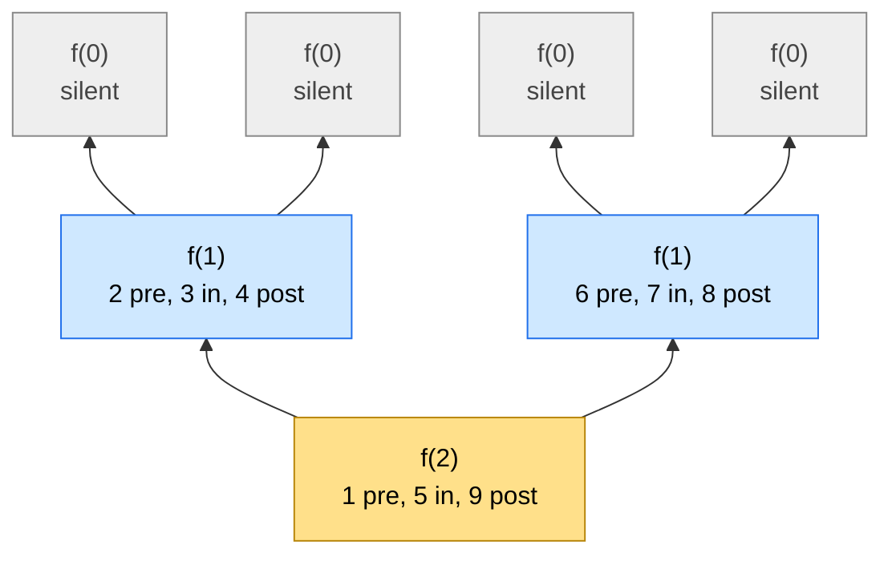
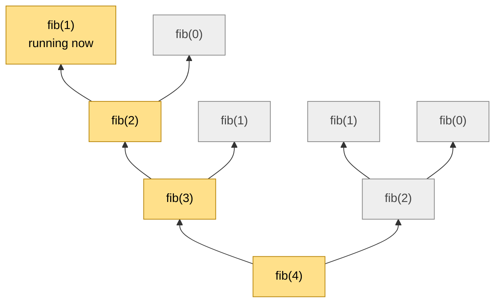

# 06 · The Recursion Tree

> After this part you can draw the recursion tree of any small call (root at the bottom), read the order in
> which things happen, and see the call stack inside the tree.

⬅️ [05 · The Call Stack](05-the-call-stack.md) · 🏠 [Guide home](README.md) · [07 · Recursion Patterns](07-patterns.md) ➡️

## Contents

1. [Deep down: the recursion tree](#1-deep-down-the-recursion-tree)
2. [The stack and the tree together](#2-the-stack-and-the-tree-together)
3. [Exercises](#3-exercises)
4. [One-minute recap](#4-one-minute-recap)

---

## 1. Deep down: the recursion tree

When a function asks **more than one** friend, a pile is not enough to see everything. Draw every call as a
box, with its friends just **above** it. The first call is the **root at the bottom**, and the base cases are
the **leaves at the top** — the tree grows upward like a real tree. 🌳

Take this function, described in words: **f(n)** says "pre n", asks the friend **f(n − 1)**, says "in n",
asks **f(n − 1)** again, and says "post n". **f(0)** is silent. Here is f(2):



The same tree in plain text — the numbers say **when** each box speaks:

```text
        f(0)                f(0)                f(0)                f(0)
       silent              silent              silent              silent
          ▲                   ▲                   ▲                   ▲
          └─────────┬─────────┘                   └─────────┬─────────┘
                    │                                       │
                  f(1)                                    f(1)
      2: pre 1  3: in 1  4: post 1            6: pre 1  7: in 1  8: post 1
                    ▲                                       ▲
                    └───────────────────┬───────────────────┘
                                        │
                                      f(2)
                          1: pre 2  5: in 2  9: post 2
```

So f(2) says: **pre 2, pre 1, in 1, post 1, in 2, pre 1, in 1, post 1, post 2.**

How to see it: an ant 🐜 walks around the tree. It **climbs up** into the left friend, comes **back down**,
climbs up into the right friend, comes back down again. A box says:

- **pre** when the ant arrives for the first time (on the way in),
- **in** when the ant comes back from the left friend (between the friends),
- **post** when the ant leaves the box for good (on the way back).

Tree facts you will use again and again:

- **Number of boxes = number of calls = the time.**
- **Height of the tree = the tallest pile of plates = the memory.**
- **Leaves = base cases.** In counting problems, every leaf that answers 1 is one complete answer
  (exercise 1 below); a leaf that answers 0 is a dead end.

---

## 2. The stack and the tree together

This is the most important picture in the whole guide:

> **At every moment, the pile of plates is exactly the path from the root (at the bottom) up to the box that
> is running now.**

Fibonacci: fib(n) asks fib(n − 1) and fib(n − 2) and adds them; fib(0) = 0 and fib(1) = 1.
The whole tree of fib(4) — 9 calls:

```text
     fib(1)        fib(0)
       = 1           = 0
        ▲             ▲
        └──────┬──────┘
               │
            fib(2)               fib(1)        fib(1)        fib(0)
              = 1                  = 1           = 1           = 0
               ▲                    ▲             ▲             ▲
               └─────────┬──────────┘             └──────┬──────┘
                         │                               │
                      fib(3)                          fib(2)
                        = 2                             = 1
                         ▲                               ▲
                         └───────────────┬───────────────┘
                                         │
                                      fib(4)
                                        = 3
```

Now freeze time at the moment the **first fib(1)** is running. The yellow boxes are the path from the root
up to it:



And the pile of plates at that same moment — exactly those four yellow boxes:

```text
 +-----------+
 |  fib(1)   |  <- running now: it will answer 1
 |  fib(2)   |  waiting: first for fib(1), then it will ask fib(0)
 |  fib(3)   |  waiting: first for fib(2), then it will ask fib(1)
 |  fib(4)   |  waiting: first for fib(3), then it will ask fib(2)   <- the first call
 +-----------+
```

What this picture teaches:

- The pile **never** holds two boxes that sit side by side in the tree — only **one path**. So the memory is
  the **height** of the tree (4 here), not the number of boxes (9).
- When the ant climbs, a plate is added; when it comes back down, a plate is removed.
- The grey boxes are either **finished** (their plates are gone) or **not started yet** (no plate yet).

---

## 3. Exercises

**No code.** Write the four lines — EXPECTATION, FAITH, MY WORK, BASE CASE — or do what the question asks,
in your own words, before you open the answer. Compare the **ideas**, not the exact words.

**1.** Climbing stairs: you can climb **1 or 2** steps at a time. In how many different ways can you climb
n steps? Draw the tree for n = 4 (root at the bottom) and count its leaves.

<details>
<summary>Answer</summary>

```text
 EXPECTATION  ways(n) gives the number of different ways to climb exactly n steps
 FAITH        ways(n - 1) counts the ways that start with a 1-step;
              ways(n - 2) counts the ways that start with a 2-step
 MY WORK      ways(n) = ways(n - 1) + ways(n - 2)
              (every way starts with a 1-step or a 2-step, never both)
 BASE CASE    ways(0) = 1 (one way: do nothing), ways(1) = 1
```

```text
     ways(1)       ways(0)
       = 1           = 1
        ▲             ▲
        └──────┬──────┘
               │
            ways(2)              ways(1)       ways(1)       ways(0)
              = 2                  = 1           = 1           = 1
               ▲                    ▲             ▲             ▲
               └─────────┬──────────┘             └──────┬──────┘
                         │                               │
                      ways(3)                         ways(2)
                        = 3                             = 2
                         ▲                               ▲
                         └───────────────┬───────────────┘
                                         │
                                      ways(4)
                                        = 5
```

**5 ways**, and the tree has **5 leaves** — every leaf is one complete way to climb. Notice ways(2) is
computed **twice**: remembering answers (memoization) would save that work.

</details>

**2.** Draw the tree of fib(3), root at the bottom, with the answer in every box. How many boxes and leaves
does it have, and how tall is it?

<details>
<summary>Answer</summary>

```text
     fib(1)        fib(0)
       = 1           = 0
        ▲             ▲
        └──────┬──────┘
               │
            fib(2)               fib(1)
              = 1                  = 1
               ▲                    ▲
               └─────────┬──────────┘
                         │
                      fib(3)
                        = 2
```

**5 boxes** (5 calls), **3 leaves** (the base cases fib(1), fib(0), fib(1)), and **3 levels** tall — so the
pile never holds more than 3 plates.

</details>

**3.** t(n) asks t(n − 1), says n, then asks t(n − 1) again; t(0) is silent. What does t(3) say? Draw its tree
(leave out the silent t(0) boxes) and number the boxes in the order they speak. Where have you seen this
order before?

<details>
<summary>Answer</summary>

**1, 2, 1, 3, 1, 2, 1.** Every box speaks **between** its two friends (the *in* spot):

```text
      t(1)            t(1)            t(1)            t(1)
    1: says 1       3: says 1       5: says 1       7: says 1
        ▲               ▲               ▲               ▲
        └───────┬───────┘               └───────┬───────┘
                │                               │
              t(2)                            t(2)
            2: says 2                       6: says 2
                ▲                               ▲
                └───────────────┬───────────────┘
                                │
                              t(3)
                            4: says 3
```

It is the order of the disks in the **Tower of Hanoi** with 3 disks: disk 1, 2, 1, 3, 1, 2, 1. Hanoi is
exactly a t(n) whose work in between is "move disk n". (With the 8 silent t(0) boxes, the tree has 15 calls.)

</details>

**4.** A function asks **three** friends, each with n − 1; f(0) is a leaf. Without drawing it, how many boxes
does the tree of f(3) have? How tall does the pile get?

<details>
<summary>Answer</summary>

Count level by level from the root: 1 + 3 + 9 + 27 = **40** boxes. The tree has 4 levels (f(3), f(2), f(1),
f(0)), so the pile holds at most **4** plates. The time grows like 3ⁿ, but the memory only like n.

</details>

**5.** The ant walk. Here is a tree of calls, root at the bottom:

```text
      D         E         F         G
      ▲         ▲         ▲         ▲
      └────┬────┘         └────┬────┘
           │                   │
           B                   C
           ▲                   ▲
           └─────────┬─────────┘
                     │
                     A
```

(a) Every box says its name when the ant **arrives** (pre). Write what is said. (b) Now every box says its
name when the ant **leaves** it for good (post). (c) Which boxes are on the pile when E speaks?

<details>
<summary>Answer</summary>

- **(a)** Pre: **A, B, D, E, C, F, G** — a box speaks before any of its friends.
- **(b)** Post: **D, E, B, F, G, C, A** — a box speaks after all of its friends; the root speaks last.
- **(c)** The path from the root up to E: **A, B, E**. D is already finished; C, F and G have not started.

</details>

**6.** In the tree of ways(5) (climbing 1 or 2 steps; ways(0) = ways(1) = 1), how many boxes are there? How
many times is ways(2) computed? What changes if every box writes its answer in a "memory book", and every
box first looks there before asking any friends?

<details>
<summary>Answer</summary>

**15 boxes.** ways(3) is computed 2 times and ways(2) **3 times** — the same work again and again. With a
memory book (**memoization**), each of ways(0), …, ways(5) is really worked out only **once**: 6 real
boxes instead of 15. For ways(40) the plain tree has over **300 million** boxes; with the memory book, about
41. ([Maths 07](../../../maths_for_dsa/07-recurrences/) counts such trees.)

</details>

**7.** In the tree of fib(4) ([section 2](#2-the-stack-and-the-tree-together)), freeze time at the moment the
**right** fib(2) is running its first friend, fib(1). Which boxes are on the pile? Which are finished, and
which have not started yet?

<details>
<summary>Answer</summary>

- **On the pile:** fib(4), the right fib(2) and its fib(1) — the path from the root to the running box.
- **Finished:** the whole left side — fib(3) and every box above it (fib(2), fib(1), fib(0), fib(1)).
- **Not started:** the last fib(0), the right fib(2)'s second friend.

</details>

**8.** The slow power asks the half-friend **twice** (once for each "half" in half × half). For n = 8, how
many boxes are in its tree, and how tall is it? Compare with the fast power, which asks only once.

<details>
<summary>Answer</summary>

- **Slow:** every box asks 2 friends, and n goes 8 → 4 → 2 → 1 → 0, so the levels hold 1, 2, 4, 8 and 16
  boxes: **31 boxes**, **5 levels** tall.
- **Fast:** one friend per box: 8, 4, 2, 1, 0 → **5 boxes**, also **5 levels** tall.

The same height (the same memory), but 31 boxes against 5 (the time). Asking a friend twice for the same
answer costs a whole extra tree.

</details>

---

## 4. One-minute recap

- Many friends make a **tree**: the first call is the **root at the bottom**, the base cases are the
  **leaves at the top**.
- The **ant walk**: *pre* on the way in, *in* between the friends, *post* on the way back.
- The pile of plates at any moment = the **path from the root** to the running box.
- Boxes = **time**, height = **memory**, leaves = **base cases** (in counting problems, every leaf worth 1 is
  one complete answer).

---

⬅️ [05 · The Call Stack](05-the-call-stack.md) · 🏠 [Guide home](README.md) · [07 · Recursion Patterns](07-patterns.md) ➡️
