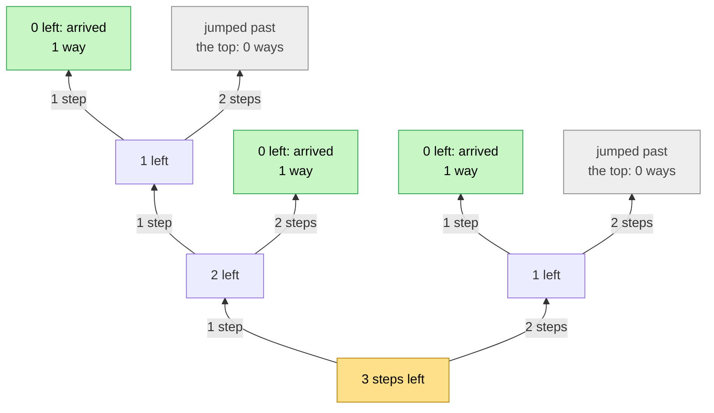
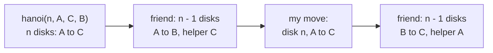

# 07 · Recursion Patterns

> After this part you can recognise the seven shapes that almost every recursive problem uses — and write the
> four lines for each shape almost without thinking.

⬅️ [06 · The Recursion Tree](06-the-recursion-tree.md) · 🏠 [Guide home](README.md) · [08 · Backtracking](08-backtracking.md) ➡️

## Contents

1. [The patterns cheat sheet](#1-the-patterns-cheat-sheet)
2. [The patterns one by one](#2-the-patterns-one-by-one)
3. [Exercises](#3-exercises)
4. [One-minute recap](#4-one-minute-recap)

---

## 1. The patterns cheat sheet

| Pattern | Expectation (the promise) | Faith (the friend) | My work | Base case |
|---|---|---|---|---|
| one step smaller | f(n) does the job for n | f(n − 1) | one small step with n | n = 0 |
| the rest of an array | f(i) does the job for a[i] to the end | f(i + 1) | combine a[i] with the friend's answer | i = length (empty) |
| two ends | f(i, j) does the job for a[i..j] | f(i + 1, j − 1) | handle a[i] and a[j] | i ≥ j |
| halves | f(lo, hi) does the job for a[lo..hi] | f(lo, mid) and f(mid + 1, hi) | combine two answers | one element |
| trees | f(node) does the job for the tree at node | f(left) and f(right) | combine with the node | no node |
| count the ways | ways(state) = number of ways from here | ways(each next state) | add them up | goal: 1, impossible: 0 |
| the flexible friend | f(n, extras) does the job for **any** extras | f(n − 1, other extras) | the step that joins the friends' jobs | smallest n |
| backtracking ([part 08](08-backtracking.md)) | explore(path) finds every answer starting with path | explore(path + c) | choose, trust, un-choose | path complete |

The first seven rows are the seven shapes of this part. Backtracking builds on them and has a part of its own.

---

## 2. The patterns one by one

Each pattern below has: **when you see it**, its **four lines** as a template, and a small **picture**.

### Pattern 1: one step smaller

**When you see it:** a number n, where the answer for n is "the answer for n − 1, plus one small step".

```text
 EXPECTATION  f(n) does the job for n
 FAITH        f(n - 1) does the job for n - 1
 MY WORK      one small step with n (before or after the friend)
 BASE CASE    n = 0 (or the smallest n the promise allows)
```

```text
   question:  sum(4) ---> sum(3) ---> sum(2) ---> sum(1) ---> sum(0)
   answer:      10   <---   6    <---   3    <---   1    <---   0    <- base case
```

Also: factorial, count down and count up, digits (n becomes "n without its last digit"), linked lists (the
list becomes "the list after the first node").

### Pattern 2: the rest of an array

**When you see it:** an array, a string or a list. You handle the **first** element and trust a friend with
**everything after it**. A start index i in the promise lets every friend keep the same promise.

```text
 EXPECTATION  f(i) does the job for a[i], a[i + 1], ..., the last element
 FAITH        f(i + 1) does the job for the part after a[i]
 MY WORK      combine a[i] with the friend's answer
 BASE CASE    i = length (an empty part)
```

```text
           i
           v
   a:  [   4   |   1   |   5   |   2   ]
           |    \_____________________/
        my part   the friend: from i + 1 to the end
```

Also: count x, the first position of x, is it sorted, the sum of an array.

### Pattern 3: two ends

**When you see it:** the first and the last element belong **together** — palindromes, reversing in place.

```text
 EXPECTATION  f(i, j) does the job for the part a[i..j]
 FAITH        f(i + 1, j - 1) does the job for the inside
 MY WORK      handle the two ends, a[i] and a[j]
 BASE CASE    i >= j (one element left, or none)
```

```text
    i                                   j
    v                                   v
    r     a     c     e     c     a     r
    |    \_________________________/    |
  same?  the inside: i + 1 .. j - 1   same?
```

### Pattern 4: halves

**When you see it:** splitting the part into a left half and a right half makes the job easy — merge sort,
the biggest value, binary search (which asks only **one** half), fast power (n / 2).

```text
 EXPECTATION  f(lo, hi) does the job for the part a[lo..hi]
 FAITH        f(lo, mid) and f(mid + 1, hi) do the job for each half
 MY WORK      combine the two answers
 BASE CASE    one element (lo = hi), or none (lo > hi)
```

Adding up 7, 2, 9, 4 by halves (root at the bottom):

```text
    a[0] = 7        a[1] = 2        a[2] = 9        a[3] = 4
        ▲               ▲               ▲               ▲
        └───────┬───────┘               └───────┬───────┘
                │                               │
           sum [0..1]                      sum [2..3]
           = 7 + 2 = 9                    = 9 + 4 = 13
                ▲                               ▲
                └───────────────┬───────────────┘
                                │
                           sum [0..3]
                          = 9 + 13 = 22
```

The tree has about 2n boxes but only about log₂ n levels, so halves are **light on memory**.

### Pattern 5: trees

**When you see it:** a binary tree. The two sides of a node are **smaller trees**, so they are your two
friends.

```text
 EXPECTATION  f(node) does the job for the tree that starts at node
 FAITH        f(left child) and f(right child) do the job for each side
 MY WORK      combine the two answers with the node itself
 BASE CASE    no node (an empty tree)
```

The height of a tree with the root R at the bottom, like every tree in this guide (the "no node" friends
answer 0 and are not drawn):

```text
          C                     D
      height 1              height 1
          ▲                     ▲
          └──────────┬──────────┘
                     │
                     A                                B
           1 + bigger(1, 1) = 2                   height 1
                     ▲                                ▲
                     └───────────────┬────────────────┘
                                     │
                               R (the root)
                           1 + bigger(2, 1) = 3
```

Here the tree of calls **is** the data tree: every node gets exactly one box.

### Pattern 6: counting the ways

**When you see it:** "in how many ways …?". Every way starts with **one** first move, and different first
moves give different ways — so ask one friend per possible first move and **add** their answers.

```text
 EXPECTATION  ways(state) gives the number of ways to reach the goal from state
 FAITH        ways(next state), for every possible first move
 MY WORK      add up all the friends' answers
 BASE CASE    at the goal: 1;  impossible (too far, off the grid): 0
```

Climbing 3 steps, 1 or 2 at a time. Green leaves are ways that arrive; grey leaves jumped past the top:



3 green leaves → **3 ways**: 1 + 1 + 1, 1 + 2 and 2 + 1.

### Pattern 7: the flexible friend

**When you see it:** your friends' jobs have a slightly different **shape** from yours — other poles, a
different target, a total so far. Add inputs to the promise until every friend's job fits it
([part 02](02-expectation.md#the-flexible-friend)).

```text
 EXPECTATION  f(n, extras) does the job for n, for ANY values of the extra inputs
 FAITH        f(n - 1, other extras) keeps the same promise with different extras
 MY WORK      the small step that joins the friends' jobs
 BASE CASE    as usual: the smallest n
```

The Tower of Hanoi, where the extras are the three pole names:



**How to choose:** look at the input. A number → pattern 1 (or 4, if halving works). An array or a string →
pattern 2, 3 or 4. A tree → pattern 5. "How many ways?" → pattern 6. The friends' jobs don't fit your
promise → pattern 7, on top of any of the others.

---

## 3. Exercises

**No code.** Write the four lines — EXPECTATION, FAITH, MY WORK, BASE CASE — or do what the question asks,
in your own words, before you open the answer. Compare the **ideas**, not the exact words.

**1.** Add up 1 + 2 + … + n.

<details>
<summary>Answer</summary>

```text
 EXPECTATION  sum(n) gives 1 + 2 + ... + n
 FAITH        sum(n - 1) gives 1 + 2 + ... + (n - 1)
 MY WORK      sum(n) = sum(n - 1) + n
 BASE CASE    sum(0) = 0
```

Check n = 3 with faith, not tracing: the friend gives sum(2) = 3, I add 3 → 6 ✅.

</details>

**2.** Power: aⁿ (a multiplied by itself n times), the simple way.

<details>
<summary>Answer</summary>

```text
 EXPECTATION  power(a, n) gives a^n, for n >= 0
 FAITH        power(a, n - 1) gives a^(n - 1)
 MY WORK      power(a, n) = a x power(a, n - 1)
 BASE CASE    power(a, 0) = 1
```

Notice: a is passed to the friend **unchanged**. An input that doesn't shrink is still part of the promise.

</details>

**3.** Is the array sorted (each element ≤ the next one)?

<details>
<summary>Answer</summary>

```text
 EXPECTATION  sorted(a, i) says yes if a[i], a[i + 1], ..., the last element are in order
 FAITH        sorted(a, i + 1) answers that for the part after position i
 MY WORK      yes only if a[i] <= a[i + 1] AND the friend says yes
 BASE CASE    zero or one element left: yes
```

Bonus: if a[i] > a[i + 1], you can say **no at once** without asking the friend.

</details>

**4.** Is a word a palindrome (the same forwards and backwards, like "racecar")?

<details>
<summary>Answer</summary>

```text
 EXPECTATION  pal(s, i, j) says yes if the letters of s from position i to j
              read the same both ways
 FAITH        pal(s, i + 1, j - 1) answers that for the inside part
 MY WORK      yes only if the letters at i and j are equal AND the inside is a palindrome
 BASE CASE    i >= j (one letter or none): yes
```

Check "racecar": r = r, and the friend says "aceca" is a palindrome → yes ✅. The single base case i ≥ j
covers both odd and even lengths.

</details>

**5.** A robot starts in the top-left cell of a grid with R rows and C columns and may only move **right** or
**down**. How many paths reach the bottom-right cell? Answer for a 3 × 3 grid.

<details>
<summary>Answer</summary>

```text
 EXPECTATION  paths(r, c) gives the number of paths from cell (r, c)
              to the bottom-right cell
 FAITH        paths(r, c + 1) counts the paths whose first move is right;
              paths(r + 1, c) counts those whose first move is down
 MY WORK      add the two answers
 BASE CASE    at the bottom-right cell: 1;  outside the grid: 0
```

For 3 × 3 the answer is **6** (it matches the counting formula C(4, 2) = 6 from
[Maths 13](../../../maths_for_dsa/13-counting-and-combinatorics/)).

</details>

**6.** The height of a binary tree: the number of levels of the tree that starts at a node.

<details>
<summary>Answer</summary>

```text
 EXPECTATION  height(node) gives the number of levels of the tree that starts at node
              (0 for no node)
 FAITH        height(left child) and height(right child) are correct
 MY WORK      1 + the bigger of the two heights
 BASE CASE    no node: 0
```

Check a node with two leaf children: the friends give 1 and 1 → 1 + 1 = 2 ✅.

</details>

**7.** Tower of Hanoi with **5** disks, using faith only (no tracing): (a) How many moves? (b) Which disk
moves on move number 16? (c) Where are the disks right after move 16?

<details>
<summary>Answer</summary>

- **(a)** Faith 1 moves 4 disks (trust: 15 moves), my move is 1, Faith 2 moves 4 disks (15 again):
  15 + 1 + 15 = **31 moves**.
- **(b)** Moves 1–15 are Faith 1, so move 16 is **my own move: the biggest disk, disk 5**.
- **(c)** Disk 5 is now on the destination pole, and disks 1–4 are all on the **helper** pole, where Faith 1
  put them. (See the [Tower of Hanoi lesson](../tower-of-hanoi/).)

</details>

**8.** Name the pattern (one step smaller, the rest of an array, two ends, halves, trees, counting the ways,
or the flexible friend): (a) add up the digits of n; (b) is a word a palindrome?; (c) merge sort; (d) count
the nodes of a binary tree; (e) in how many ways can you make 5 with coins of 1 and 2?; (f) the first
position of x in an array; (g) the Tower of Hanoi; (h) binary search.

<details>
<summary>Answer</summary>

- **(a)** One step smaller: n becomes "n without its last digit".
- **(b)** Two ends.
- **(c)** Halves.
- **(d)** Trees.
- **(e)** Counting the ways.
- **(f)** The rest of an array.
- **(g)** The flexible friend (on top of one step smaller: n − 1 disks).
- **(h)** Halves — but only **one** half is ever asked.

</details>

**9.** Remove every x from an array: give back a new list with the other elements, in the same order. Check
your plan on a = 3, 1, 3, 2 with x = 3.

<details>
<summary>Answer</summary>

```text
 EXPECTATION  keep(i) gives, in order, the elements of a[i], ..., the last element
              that are not x
 FAITH        keep(i + 1) gives that list for the part after a[i]
 MY WORK      if a[i] is x: give back the friend's list as it is;
              otherwise: put a[i] in front of the friend's list
 BASE CASE    i = length: an empty list
```

Check: the friend keep(1) gets 1, 3, 2 and gives back [1, 2] (trust it). a[0] = 3 is x, so the answer is
[1, 2] ✅.

</details>

**10.** Reverse an array **in place** (without making a new array), using the two ends. Does your swap go
before or after the friend?

<details>
<summary>Answer</summary>

```text
 EXPECTATION  flip(i, j) reverses the part a[i..j] in place
 FAITH        flip(i + 1, j - 1) reverses the inside
 MY WORK      swap a[i] and a[j]
 BASE CASE    i >= j (one element or none): nothing to do
```

The swap can go **before or after** the friend — both work, because the friend never touches positions i
and j. Check 1, 2, 3, 4: swap the ends → 4, 2, 3, 1; the friend reverses the inside → 4, 3, 2, 1 ✅.

</details>

**11.** Merge sort in words: sort an array by sorting each half. Write the four lines, and draw the tree for
5, 2, 4, 1 (root at the bottom).

<details>
<summary>Answer</summary>

```text
 EXPECTATION  sort(lo, hi) puts a[lo..hi] in increasing order
 FAITH        sort(lo, mid) and sort(mid + 1, hi) sort each half
 MY WORK      AFTER both friends: merge the two sorted halves into one sorted part
              (keep taking the smaller of the two front elements)
 BASE CASE    one element (or none): already sorted
```

```text
       [5]           [2]           [4]           [1]
        ▲             ▲             ▲             ▲
        └──────┬──────┘             └──────┬──────┘
               │                           │
          sort [5, 2]                 sort [4, 1]
        merge -> [2, 5]             merge -> [1, 4]
               ▲                           ▲
               └─────────────┬─────────────┘
                             │
                     sort [5, 2, 4, 1]
                   merge -> [1, 2, 4, 5]
```

My work goes **after** both friends: merging only works once both halves are sorted.

</details>

**12.** Two tree problems. (a) Mirror a binary tree: swap left and right everywhere. (b) Say whether two
trees are exactly the same — the same shape and the same values.

<details>
<summary>Answer</summary>

```text
 EXPECTATION  mirror(node) turns the tree at node into its mirror image
 FAITH        mirror(left child) and mirror(right child) mirror each side
 MY WORK      swap the left and the right child of node
 BASE CASE    no node: nothing to do
```

```text
 EXPECTATION  same(p, q) says yes if the trees at p and q have the same shape
              and the same values
 FAITH        same(p's left, q's left) and same(p's right, q's right) answer that
              for each pair of sides
 MY WORK      yes only if p and q hold the same value AND both friends say yes
 BASE CASE    both empty: yes;  exactly one empty: no
```

In (b) the promise talks about **two** trees at once, and every friend gets a matching pair of sides.

</details>

**13.** Coins: in how many ways can you make an amount m with coins of 1, 2 and 5? The order doesn't matter:
1 + 2 + 2 and 2 + 1 + 2 are the **same** way. Answer for m = 5.

<details>
<summary>Answer</summary>

If every friend could start with any coin, 1 + 2 + 2 and 2 + 1 + 2 would be counted twice. So make the
friend flexible with a position in the coin list: at every step, decide "use this coin (again)" or "never use
it any more".

```text
 EXPECTATION  ways(k, m) gives the number of ways to make m using only the coins
              from position k on in the list 1, 2, 5 (each as often as you like)
 FAITH        ways(k, m - coin k) counts the ways that use coin k (at least once);
              ways(k + 1, m) counts the ways that never use coin k
 MY WORK      add the two answers (a way either uses coin k or it doesn't, never both)
 BASE CASE    m = 0: 1 (done);  m < 0, or no coins left: 0
```

For m = 5: **4** ways — 5; 2 + 2 + 1; 2 + 1 + 1 + 1; 1 + 1 + 1 + 1 + 1.

</details>

**14.** Merge two sorted linked lists into one sorted list, and give back its first node.

<details>
<summary>Answer</summary>

```text
 EXPECTATION  merge(p, q) gives the first node of one sorted list made of all
              the nodes of the sorted lists p and q
 FAITH        merge(p's next, q) or merge(p, q's next) merges what is left
              after one front node is taken away
 MY WORK      take the smaller front node, attach the friend's merged list after it,
              and give back that front node
 BASE CASE    p is empty: give back q;  q is empty: give back p
```

Check 1 → 4 and 2 → 3: the smaller front is 1. The friend merges 4 and 2 → 3 into 2 → 3 → 4 (trust it);
attach it after 1 → **1 → 2 → 3 → 4** ✅. It is "one step smaller": every friend has one node fewer.

</details>

---

## 4. One-minute recap

- Seven shapes cover almost every problem: **one step smaller, the rest of an array, two ends, halves,
  trees, counting the ways,** and the **flexible friend**. Backtracking ([part 08](08-backtracking.md))
  builds on them.
- Recognise the shape first — then the four lines almost write themselves.

---

⬅️ [06 · The Recursion Tree](06-the-recursion-tree.md) · 🏠 [Guide home](README.md) · [08 · Backtracking](08-backtracking.md) ➡️
