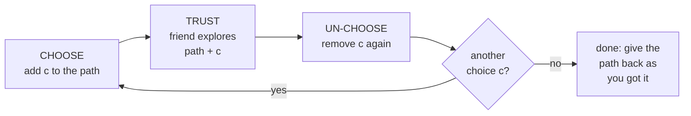
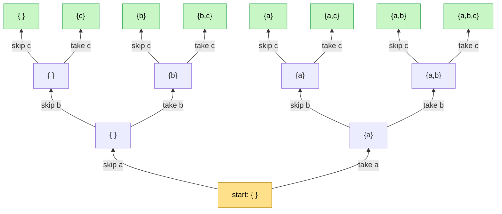
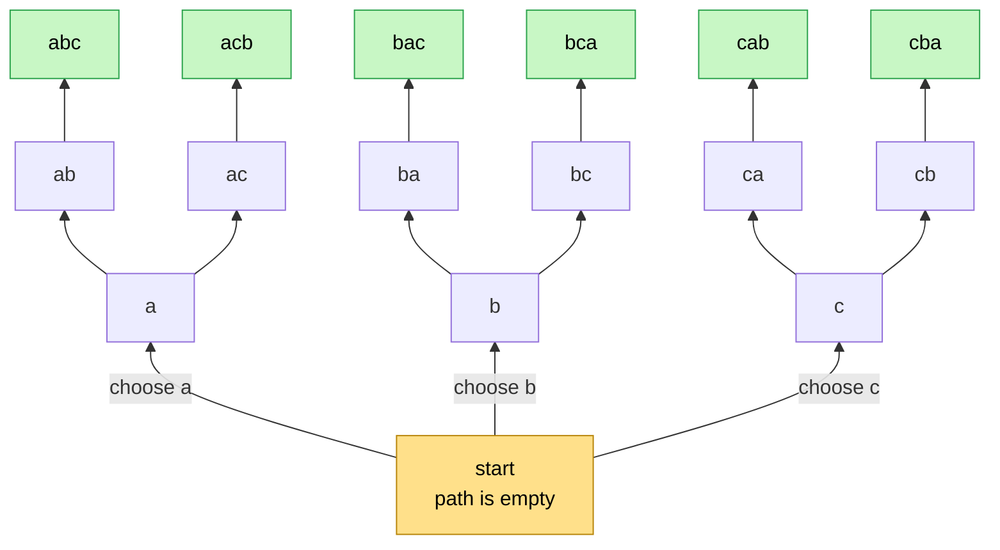
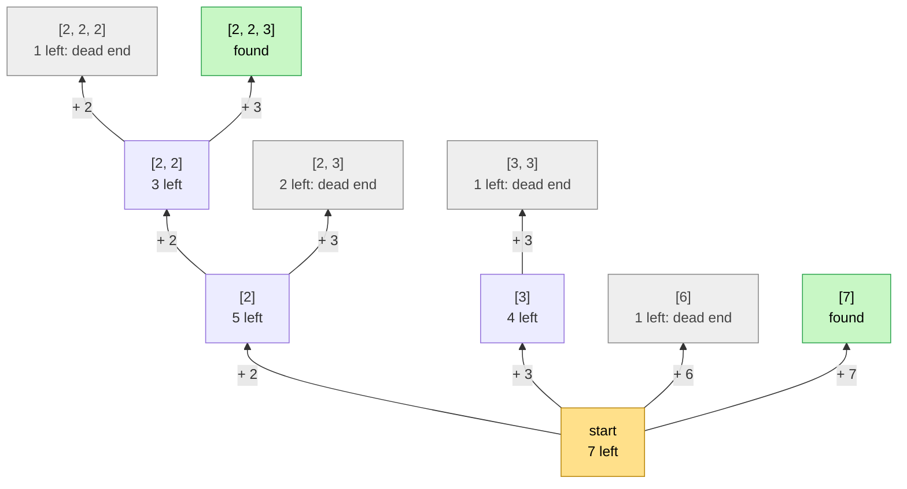
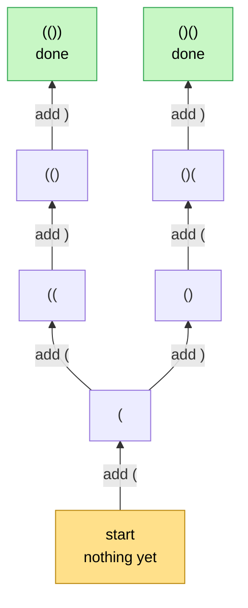

# 08 · Backtracking

> After this part you can design any "find all …" solution — subsets, orders, combinations, boards, mazes — with
> the same faith and expectation, and explain why you un-choose.

⬅️ [07 · Recursion Patterns](07-patterns.md) · 🏠 [Guide home](README.md) · [09 · Final Test](09-final-test.md) ➡️

## Contents

1. [What backtracking is](#1-what-backtracking-is)
2. [The four questions for backtracking](#2-the-four-questions-for-backtracking)
3. [Why un-choose: the shared notebook](#3-why-un-choose-the-shared-notebook)
4. [Example: all subsets of a, b, c](#4-example-all-subsets-of-a-b-c)
5. [Example: all orders of a, b, c](#5-example-all-orders-of-a-b-c)
6. [Pruning: faith only for paths that can still work](#6-pruning-faith-only-for-paths-that-can-still-work)
7. [Grids and mazes: visited marks are part of the notebook](#7-grids-and-mazes-visited-marks-are-part-of-the-notebook)
8. [Two ways to make choices](#8-two-ways-to-make-choices)
9. [Exercises](#9-exercises)
10. [One-minute recap](#10-one-minute-recap)

---

## 1. What backtracking is

**Backtracking** means building an answer **one choice at a time**, trying **every** option at each step, and
**undoing** the last choice to try the next one. It finds *all* answers: all subsets, all orders, every way to
place queens on a board, every path through a maze.

🏰 **A maze story.** At every crossing you try one path. You draw a chalk line as you walk. When you reach the
exit or a dead end, you walk **back** to the last crossing, **rub out** the chalk you drew, and try the next
path. Back, rub out, try again — that is backtracking.

---

## 2. The four questions for backtracking

```text
 EXPECTATION  explore(path, allowed) finds EVERY complete answer that starts with path,
              using only what is still allowed -- and gives the path back
              exactly as it got it
 FAITH        for each allowed next choice c, explore(path + c, allowed without c)
              finds every complete answer that starts with path + c
 MY WORK      for each allowed choice c:  CHOOSE c,  TRUST the friend,  UN-CHOOSE c
 BASE CASE    the path is complete  -> record it (a copy!) and return
              the path breaks a rule -> return at once (pruning)
```



---

## 3. Why un-choose: the shared notebook

📓 Imagine the path is written in **one notebook** that is passed from friend to friend. You write your choice
in it and hand it up. The promise says: **"give the notebook back exactly as you received it."** So when your
friend hands it back, you **erase** what *you* wrote before trying your next choice.

Forget to erase, and the next friend starts with a scribbled notebook — and every answer after that is wrong.
**Un-choose is not an extra trick; it is part of the promise.**

---

## 4. Example: all subsets of a, b, c

At each item there are two choices: **skip it** or **take it**.

```text
 EXPECTATION  subsets(i, chosen) prints every subset made of the items in chosen
              plus any mix of the items from position i to the end
 FAITH        subsets(i + 1, chosen) prints all of those without item i;
              subsets(i + 1, chosen + item i) prints all of those with item i
 MY WORK      trust the "skip" friend; then choose item i, trust the "take" friend,
              and un-choose item i
 BASE CASE    i is past the last item: print chosen
```

The decision tree, root at the bottom — every leaf is one subset:



3 items, 2 choices each → 2 × 2 × 2 = **8** subsets. The leaves are printed from left to right:
{ }, {c}, {b}, {b,c}, {a}, {a,c}, {a,b}, {a,b,c}.

---

## 5. Example: all orders of a, b, c

Now the choice is: **which unused letter comes next?**

```text
 EXPECTATION  perm(path) prints every ordering that starts with path and uses
              each letter that is not in path exactly once
 FAITH        for each unused letter x: perm(path + x) prints every ordering
              that starts with path + x
 MY WORK      for each unused letter x: choose x, trust the friend, un-choose x
 BASE CASE    path has all the letters: print it
```



3 choices, then 2, then 1 → 3 × 2 × 1 = **6** orderings. Look at the leaf "abc": the pile of plates at that
moment is the path from the root — and the notebook holds exactly those letters:

```text
 +-------------+
 | perm("abc") |  <- running: the path is complete, so it prints "abc"
 | perm("ab")  |  waiting; only "c" was left for it, so after this it is finished
 | perm("a")   |  waiting; next it will un-choose "b" and try "c" -> "ac"
 | perm("")    |  waiting; after everything that starts with "a", it tries "b", then "c"
 +-------------+
   the notebook right now:  a b c
```

---

## 6. Pruning: faith only for paths that can still work

**Pruning** means: if the path already breaks a rule, stop at once — don't ask any friend. Your promise can
then say *"the path is valid so far"*, which makes every friend's job easier.

**4-Queens:** put 4 queens on a 4 × 4 board so that no two attack each other (same row, column or diagonal).
Place one queen per row, from the top row down. Put the first queen in the top-left corner. In row 1, the
first safe square is column 2. Now row 2 has **no safe square at all**:

```text
  Q . . .        row 0: queen in column 0
  . . Q .        row 1: queen in column 2 (the first safe square)
  x x x x        row 2: every square is attacked -> dead end: go back, move row 1's queen
  . . . .
```

The search goes back, tries the other squares, and finds the only two solutions:

```text
  . Q . .          . . Q .
  . . . Q          Q . . .
  Q . . .          . . . Q
  . . Q .          . Q . .
```

---

## 7. Grids and mazes: visited marks are part of the notebook

In a maze or a word search, **choose** = mark the cell as visited, **trust** a friend to explore from the next
cell, **un-choose** = unmark the cell. The promise includes "give the grid back as you got it", so the
unmarking is not optional — without it, cells stay blocked for the other paths.

---

## 8. Two ways to make choices

| Way | The question at each step | Good for |
|---|---|---|
| **Take or skip** | "is item i in the answer?" | subsets, 0/1 choices, "each item once" |
| **Pick the next item from a start index** | "which item from position `start` onward comes next?" | combinations, combination sum — the start index stops you from making the same group twice in a different order |

---

## 9. Exercises

**No code.** Write the four lines — EXPECTATION, FAITH, MY WORK, BASE CASE — or do what the question asks,
in your own words, before you open the answer. Compare the **ideas**, not the exact words.

**1.** Print all subsets of {a, b, c}. Write the four lines, and list the subsets in the order they are printed
if you always try "skip" before "take".

<details>
<summary>Answer</summary>

```text
 EXPECTATION  subsets(i, chosen) prints every subset made of chosen plus any mix
              of the items from position i on
 FAITH        subsets(i + 1, chosen) prints those without item i;
              subsets(i + 1, chosen + item i) prints those with item i
 MY WORK      trust "skip"; then choose item i, trust "take", un-choose item i
 BASE CASE    no items left: print chosen
```

Order: **{ }, {c}, {b}, {b,c}, {a}, {a,c}, {a,b}, {a,b,c}** — the leaves of the tree in section 4 from
left to right. 2³ = 8 subsets.

</details>

**2.** Print all orderings of "abc". Why must you un-choose?

<details>
<summary>Answer</summary>

```text
 EXPECTATION  perm(path) prints every ordering that starts with path and uses
              each unused letter exactly once
 FAITH        for each unused letter x: perm(path + x) prints every ordering
              that starts with path + x
 MY WORK      for each unused letter x: choose x, trust the friend, un-choose x
 BASE CASE    all letters used: print path
```

Printed: **abc, acb, bac, bca, cab, cba** (3! = 6). You must un-choose because the path is a shared
notebook. Without un-choosing, nothing is ever erased: after "abc" is printed, the notebook still says
a, b, c and all three letters still count as used — so no friend can try anything else. Only "abc" is
printed, and the other 5 orders are lost.

</details>

**3.** Print all strings of 0s and 1s of length n that **never have two 1s next to each other**. List them for
n = 3.

<details>
<summary>Answer</summary>

```text
 EXPECTATION  build(path) prints every valid string of length n that starts with path
              (path itself is valid)
 FAITH        build(path + "0") is always allowed;
              build(path + "1") only if path does not end with 1
 MY WORK      try "0"; then try "1" when it is allowed (pruning) --
              choosing and un-choosing each time
 BASE CASE    path has length n: print it
```

For n = 3: **000, 001, 010, 100, 101** — 5 strings. The branch "011" is never even started: that's pruning.
(The counts 2, 3, 5, 8, … for n = 1, 2, 3, 4 are Fibonacci numbers again!)

</details>

**4.** Combination sum: using the numbers [2, 3, 6, 7], each as often as you like, print every group that adds
up to 7 (order inside a group doesn't matter). Why do you need a **start index**?

<details>
<summary>Answer</summary>

```text
 EXPECTATION  combo(start, left, path) prints every group with sum = left that uses
              numbers from position start onward, each added after path
 FAITH        for each position k >= start with number <= left:
              combo(k, left - number, path + number) prints every group
              that continues from there
 MY WORK      for each such k: choose the number, trust the friend, un-choose it
 BASE CASE    left = 0: print path   (a number bigger than left is skipped: pruning)
```

Answer: **[2, 2, 3] and [7]**. The friend gets k (not k + 1) because a number may repeat, and **never** a
position before start — that is what stops you from printing [2, 2, 3], [2, 3, 2] and [3, 2, 2] as three
different groups.

The tree, root at the bottom. Numbers bigger than what is left are never tried (pruning), so they are not
drawn; grey boxes are dead ends:



Look at [2, 3]: its friends may only use 3, 6 or 7 (the start index), and all of them are bigger than 2 —
so [2, 3, 2] is never even tried.

</details>

**5.** 4-Queens: place 4 queens on a 4 × 4 board, one per row, so that no two attack each other. Write the
four lines. How many solutions are there?

<details>
<summary>Answer</summary>

```text
 EXPECTATION  place(row) -- with safe queens already in rows 0 .. row - 1 --
              prints every way to finish the board with one safe queen
              in each of the rows row .. 3
 FAITH        for each column c where a queen at (row, c) is safe: place(row + 1) finishes
              every board that has this queen
 MY WORK      for each safe column: put the queen (choose), trust the friend,
              take the queen away (un-choose)
 BASE CASE    row = 4 (all rows filled): print the board
```

**2 solutions** (section 6). Unsafe columns are never tried, so every friend only ever gets a **valid**
partial board — which is exactly what its promise says.

</details>

**6.** Balanced brackets: print every string of n pairs of "(" and ")" that is **balanced** — every "(" is
closed later, and no ")" comes before its "(". Write the four lines with pruning. Draw the tree for n = 2 and
list the strings for n = 3.

<details>
<summary>Answer</summary>

```text
 EXPECTATION  build(path) prints every balanced string of n pairs that starts with
              path, where path is still fine so far (no ")" came too early, and
              there are at most n of "(")
 FAITH        build(path + one more bracket) finishes every string that starts
              with that longer path
 MY WORK      add "(" only if fewer than n are used; add ")" only if fewer ")"
              than "(" are used (pruning) -- choose, trust, un-choose each time
 BASE CASE    path has 2n brackets: print it
```

The tree for n = 2, root at the bottom. The forbidden brackets are never tried, so they are not drawn:



For n = 3 (trying "(" before ")"): **((())), (()()), (())(), ()(()), ()()()** — 5 strings. Every friend only
ever receives a path that is still fine, exactly as its promise says.

</details>

**7.** Combinations: print every group of **2** numbers chosen from 1, 2, 3, 4. A group is the same in any
order ([1, 2] and [2, 1] are one group). Use a start index.

<details>
<summary>Answer</summary>

```text
 EXPECTATION  pick(start, path) prints every group of 2 numbers that begins with path
              and continues with numbers from start up to 4
 FAITH        for each number x from start to 4: pick(x + 1, path + x) prints every
              group that begins with path + x
 MY WORK      for each such x: choose x, trust the friend, un-choose x
 BASE CASE    path has 2 numbers: print it
```

Printed: **[1, 2], [1, 3], [1, 4], [2, 3], [2, 4], [3, 4]** — 6 groups, which is C(4, 2)
([Maths 13](../../../maths_for_dsa/13-counting-and-combinatorics/)). The friend gets x + 1, so a number is
never used twice, and no group shows up again in another order.

</details>

**8.** Subsets with repeats: the numbers are 1, 2, 2. Print every **different** subset exactly once — for
example [1, 2] only once, even though there are two 2s. How do you avoid the repeats?

<details>
<summary>Answer</summary>

Use "pick the next item from a start index" (the numbers are sorted), and print the path at **every** box:

```text
 EXPECTATION  sub(start, path) prints path, and then every different subset that
              begins with path and adds numbers from position start on
 FAITH        for each position k >= start: sub(k + 1, path + a[k]) prints the
              subsets that begin with path + a[k]
 MY WORK      print path; then for each k: skip a[k] if it is the same number as
              the one just tried at this box; otherwise choose, trust, un-choose
 BASE CASE    start = length: nothing left to add (only path is printed)
```

Printed: **[ ], [1], [1, 2], [1, 2, 2], [2], [2, 2]** — 6 subsets. At the root the second 2 is skipped:
"start with the second 2" would print again everything that "start with the first 2" already printed.

</details>

**9.** Phone letters: the key 2 has the letters a, b, c and the key 3 has d, e, f. Print every word you can
type with the keys 2, 3.

<details>
<summary>Answer</summary>

```text
 EXPECTATION  type(i, path) prints every word that begins with path and has one letter
              for each key from position i to the end
 FAITH        for each letter c on key i: type(i + 1, path + c) prints every word
              that begins with path + c
 MY WORK      for each letter c on key i: choose c, trust the friend, un-choose c
 BASE CASE    i = the number of keys: print path
```

Printed: **ad, ae, af, bd, be, bf, cd, ce, cf** — 3 × 3 = 9 words.

</details>

**10.** Word search: can a word be spelled in a grid by moving up, down, left or right, using each cell at
most once? Use this grid:

```text
   A   A
   B   C
```

(a) Why must you **mark** a cell before trusting the friend? Try the word "ABA". (b) Why must you
**un-mark** it afterwards? Try the word "AAB".

<details>
<summary>Answer</summary>

```text
 EXPECTATION  find(cell, i) says yes if word[i], word[i + 1], ..., the last letter can be
              spelled starting at cell, without using a marked cell -- and gives
              the grid back with the same marks as it got it
 FAITH        find(neighbour, i + 1) answers that for each of the four neighbours
 MY WORK      if cell holds word[i] and is not marked: mark it (choose), ask the
              neighbours (trust), unmark it (un-choose); yes if any friend said yes
 BASE CASE    i = length of the word: yes;  off the grid, marked or wrong letter: no
```

- **(a)** "ABA" is **not** in the grid: the only B touches only one A. Without marks, the path top-left A →
  B → the **same** A again would "find" it. The mark stops a path from using a cell twice.
- **(b)** "AAB" **is** in the grid: top-right A → top-left A → B. But say the search starts at the top-left
  A: it marks it, marks the top-right A, and finds no B there — a dead end. If it forgets to un-mark, both
  A's stay marked, the real path from the top-right A is blocked, and the answer "no" is **wrong**. Un-marking
  gives the grid back as you got it — it is part of the promise.

</details>

**11.** Palindrome pieces: cut the word "aab" into pieces so that **every piece is a palindrome**, in every
possible way (for example a | a | b).

<details>
<summary>Answer</summary>

```text
 EXPECTATION  cut(start, path) prints every way to cut the letters from start to the
              end into palindromes, each printed after the pieces already in path
 FAITH        for each first piece that is a palindrome: cut(the position after
              the piece, path + piece) prints every way that continues from there
 MY WORK      try each first piece; if it is a palindrome (pruning): choose it,
              trust the friend, un-choose it
 BASE CASE    start = length (nothing left to cut): print path
```

Printed: **[a, a, b]** and **[aa, b]**. The first pieces tried are "a", "aa" and "aab" — and "aab" is not a
palindrome, so that branch never starts.

</details>

**12.** Orders with repeats: print every **different** order of the letters a, a, b.

<details>
<summary>Answer</summary>

```text
 EXPECTATION  perm(path) prints every different ordering that starts with path and
              uses each letter not in path exactly once
 FAITH        for each DIFFERENT unused letter x: perm(path + x) prints every
              ordering that starts with path + x
 MY WORK      at each box, try each different letter only once (skip the second a);
              choose it, trust the friend, un-choose it
 BASE CASE    all letters used: print path
```

Printed: **aab, aba, baa** — 3 orders, not 3! = 6, because swapping the two a's gives nothing new.

</details>

**13.** Combination sum, each number **once**: from the numbers 1, 1, 2, 3, print every **different** group
that adds up to 4, using each number at most once.

<details>
<summary>Answer</summary>

Two ideas together: the friend gets **k + 1** (each number at most once), and at the same box a number
equal to the one just tried is **skipped** (no repeated groups).

```text
 EXPECTATION  combo(start, left, path) prints every different group with sum left that
              uses numbers from position start on, each at most once, after path
 FAITH        for each position k >= start: combo(k + 1, left - a[k], path + a[k])
              prints every group that continues with a[k]
 MY WORK      skip a[k] if it is the same number as the one just tried at this box,
              or if it is bigger than left (pruning); otherwise choose, trust, un-choose
 BASE CASE    left = 0: print path
```

Printed: **[1, 1, 2]** and **[1, 3]**. Without the skip rule, [1, 3] would be printed twice — once with
each 1.

</details>

**14.** Find **one** answer and stop: a Sudoku solver. Write the four lines. How is the promise different
from "find every answer"?

<details>
<summary>Answer</summary>

```text
 EXPECTATION  solve(cell) fills every empty cell from this cell to the end so that
              the rules hold, and says yes -- or, if that is impossible, says no and
              gives the board back as it got it
 FAITH        solve(the next cell) keeps this promise for the rest of the board
 MY WORK      if the cell is already filled: pass the friend's answer on;
              otherwise, for each digit 1 to 9 allowed here: write it (choose) and
              trust the friend -- yes: say yes and STOP; no: erase the digit
              (un-choose) and try the next one. No digit left: say no
 BASE CASE    past the last cell: yes (every cell is filled)
```

"Find every answer" keeps going after a success. "Find one" **stops at the first yes** and never un-chooses
the winning digits — the filled board **is** the answer. "Give the board back as you got it" only has to
hold when the answer is no.

</details>

---

## 10. One-minute recap

- Backtracking = **choose, trust, un-choose**, for every allowed choice.
- The promise: find **every** complete answer that starts with the path — and give the path back exactly as
  you got it (the **shared notebook**).
- **Prune** paths that already break a rule, so friends only ever get valid partial answers.
- *Take or skip* for subsets; *pick the next item from a start index* for combinations (no repeats in a
  different order).
- **Repeats in the input?** Sort it, and at each box skip a value equal to the one just tried.
- **Only one answer needed?** Stop at the first yes.

---

⬅️ [07 · Recursion Patterns](07-patterns.md) · 🏠 [Guide home](README.md) · [09 · Final Test](09-final-test.md) ➡️
