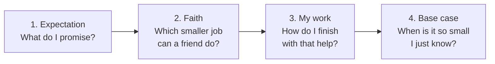
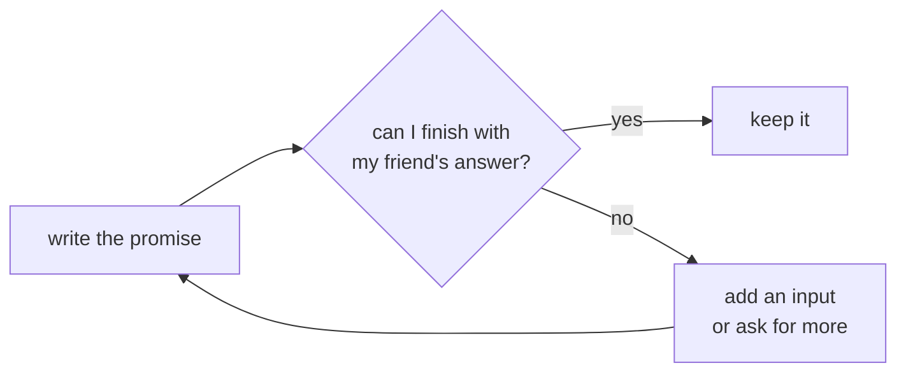
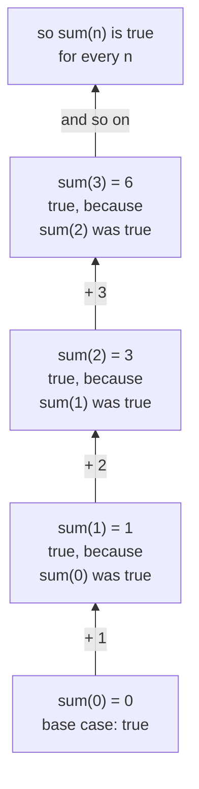
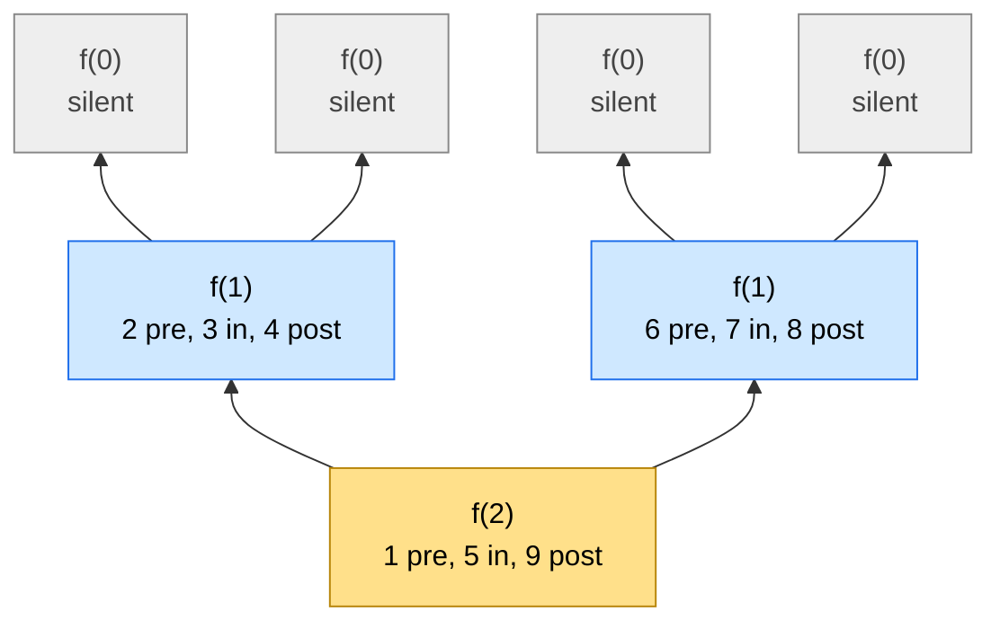
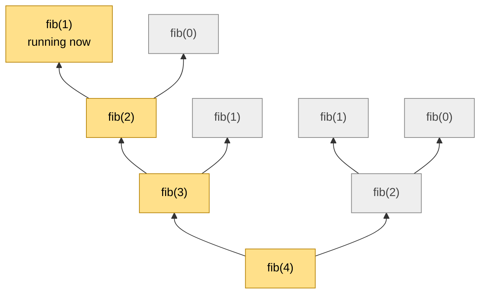
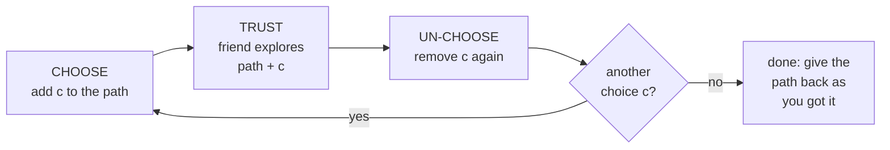
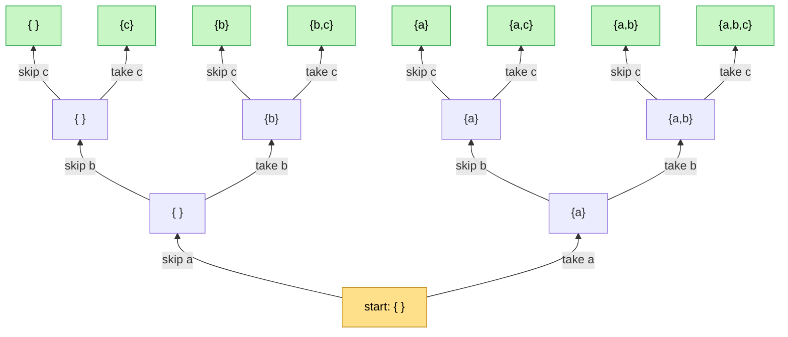
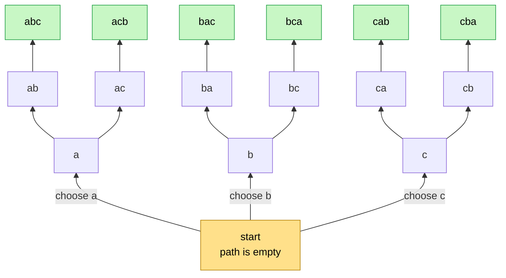
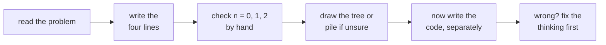
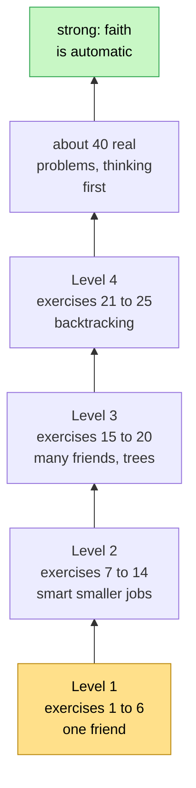

# Think Recursion — faith and expectation, from zero to strong

> After this guide you can design any recursive solution — from counting down to N-Queens and other
> backtracking problems — by answering four questions, **without tracing a single call**.
> There is **no code** here: this is pure thinking practice. Write the code separately, later.

🔗 Related: the [Tower of Hanoi lesson](../tower-of-hanoi/) (the method on one full problem) ·
[Maths 07 · Recurrences](../../../maths_for_dsa/07-recurrences/) (how fast recursion is) ·
[Maths 16 · Logic, Sets and Proofs](../../../maths_for_dsa/16-logic-sets-and-proofs/) (why faith is safe)

## Contents

1. [What this guide is for](#1-what-this-guide-is-for)
2. [The story of recursion](#2-the-story-of-recursion)
3. [The four questions](#3-the-four-questions)
4. [Expectation: the promise](#4-expectation-the-promise)
5. [Faith: trusting a smaller friend](#5-faith-trusting-a-smaller-friend)
6. [My work: meeting the expectation](#6-my-work-meeting-the-expectation)
7. [The base case: where faith stops](#7-the-base-case-where-faith-stops)
8. [Why faith is safe](#8-why-faith-is-safe)
9. [Deep down 1: the call stack](#9-deep-down-1-the-call-stack)
10. [Deep down 2: the recursion tree](#10-deep-down-2-the-recursion-tree)
11. [The stack and the tree together](#11-the-stack-and-the-tree-together)
12. [Why you must not trace the faith](#12-why-you-must-not-trace-the-faith)
13. [Backtracking with faith and expectation](#13-backtracking-with-faith-and-expectation)
14. [The patterns cheat sheet](#14-the-patterns-cheat-sheet)
15. [How much practice is enough](#15-how-much-practice-is-enough)
16. [Exercises](#16-exercises)
17. [One-minute recap](#17-one-minute-recap)

---

## 1. What this guide is for

Recursion is **20 % code and 80 % thinking**. Most people get stuck because they try to follow every call
in their head — *"this calls that, which calls that, which calls…"* — and get lost after three levels. 😵

Strong programmers think differently. They never follow the calls. They do this:

> **Promise** what the function does (the **expectation**), **trust** that a smaller copy keeps the same
> promise (the **faith**), and do only their own **small part** (meeting the expectation).

This guide trains exactly that, step by step:

- stories and pictures that make the idea feel natural;
- what really happens inside the computer — the **call stack** and the **recursion tree**;
- **backtracking**, with the same faith and expectation;
- **25 thinking exercises** from easy to hard, every one answered with the same four lines.

**How much practice is enough?** Short answer: these 25 exercises teach you the method; about 40 more real
problems, thinking first, make it automatic. The full plan is in [section 15](#15-how-much-practice-is-enough).

---

## 2. The story of recursion

### The ice-cream line

🍦 You are in a long line at an ice-cream shop and want to know your place. You can't see the front.
So you ask the person in front of you: *"What is your place?"* They don't know either, so they ask the
person in front of **them** … until the question reaches the very front. That person just **knows**:
*"I am number 1!"* Then every person hears the answer, **adds 1**, and passes it back:

```text
 the question goes to the front  --->

    you        Priya      Arun       Meena      Ravi (at the front)
 "my place?" "my place?" "my place?" "my place?"  "I am number 1!"   <- base case
     5    <---   4   <---   3   <---   2   <---    1

 <--- the answers come back, and each person adds 1
```

Everybody in the line does the **same small job**: ask the person in front, add 1, tell the person behind.
Nobody needs to see the whole line. **That is recursion.** 🎉

Three things make it work:

1. The **same question** is asked again and again, each time to someone **closer to the front** —
   a smaller problem.
2. Someone can answer **without asking** — the person at the front. That is the **base case**.
3. Every person **trusts** the answer from the front and only does one tiny step: + 1.

### The Russian dolls

🪆 How many dolls are inside a set of Russian dolls? Open the biggest one. There is **1** doll (the one you
opened) **plus** however many dolls are in the smaller set inside. You don't open the smaller ones in your
head — you **trust** that "count the smaller set" works. When a doll is solid (nothing inside), the answer is
simply 1.

Keep these two stories in mind. Every recursive idea in this guide is one of them in disguise.

---

## 3. The four questions

Before any code, answer these four questions **in plain words**, always in this order:



Here is the ice-cream line in the four questions:

```text
 EXPECTATION  place(person) tells the place of this person in the line
 FAITH        place(the person in front) tells their place correctly
 MY WORK      my place = their place + 1
 BASE CASE    the person at the very front: place 1
```

And adding up 1 + 2 + … + n:

```text
 EXPECTATION  sum(n) gives 1 + 2 + ... + n
 FAITH        sum(n - 1) already gives 1 + 2 + ... + (n - 1)
 MY WORK      add n to it:  sum(n) = sum(n - 1) + n
 BASE CASE    sum(0) = 0   (nothing to add)
```

That's it. **Four lines, no tracing.** If the four lines are right, the recursion is right. Every exercise
in section 16 is answered in this exact shape. Let's look at each line closely.

---

## 4. Expectation: the promise

The expectation is a **promise**, like a contract you sign before starting work. It is the most important
line: a clear promise makes the other three lines easy; a fuzzy promise makes them impossible.

A good expectation:

1. uses the function's name and **every** input (parameter);
2. says exactly what comes **out** — the answer it gives back, or what it prints or changes;
3. works for **every** allowed input, not only the one you care about — your friends will be called with
   **smaller** inputs, and they must keep the same promise;
4. is **checkable**: you could test it on small inputs.

| Fuzzy (bad) | Clear (good) |
|---|---|
| "sum does the adding" | "sum(n) gives 1 + 2 + … + n, for any n ≥ 0" |
| "reverse handles the string" | "reverse(s) gives the letters of s in the opposite order" |
| "count looks for x" | "count(a, x, i) gives how many times x appears in a[i], a[i + 1], …, up to the end" |
| "height finds the depth" | "height(node) gives the number of levels of the tree that starts at node; 0 for no tree" |

### The flexible friend

Sometimes your friend's job has a **slightly different shape** from yours, and the plain promise can't be
trusted. Then make the promise **more general** by adding an input, so that **every** job — yours and all your
friends' — fits the same promise:

- **Tower of Hanoi:** "move n disks from *any* pole to *any* pole using *any* helper pole" — three pole names,
  because your friends move disks between different poles.
- **Arrays and strings:** "work on the part from index i to the end" instead of "work on the whole array",
  because your friend gets the part after you.
- **Backtracking:** "the choices made so far" and "what is still allowed" (section 13).

### When the friend's answer is not enough, ask for more

Sometimes you can't finish your job with what the friend gives back. Don't give up on recursion — **change
the promise** so the friend gives you more:



Example: "is this tree balanced? yes or no" is not enough, because to answer for a node you also need the
**heights** of both sides. So promise more: "give the height, or −1 if it is not balanced". That is
exercise 19.

🧠 **The expectation is about *what*, never about *how*.** "sum(n) gives 1 + … + n" — not "sum(n) loops" or
"sum(n) calls itself". If you catch yourself describing the steps, you are writing the plan, not the promise.

---

## 5. Faith: trusting a smaller friend

Faith means: *"I will **not** think about how my friend does it. I trust that my friend keeps the **same
promise** for a **smaller** input."* 🙏

Three rules of good faith:

1. The friend's job is **the same promise** — the same function with the same expectation.
2. The friend's input is **smaller** — one step closer to the base case.
3. **You never open the friend's box.** 📦 You don't follow what happens inside it.

### Where do you find the smaller job?

Almost every problem uses one of these shapes:

| Your input | The friend's smaller input | Examples |
|---|---|---|
| a number n | n − 1 | count down, sum, factorial, Tower of Hanoi |
| a number n | n / 2 (half) | fast power, binary search |
| a number n | n without its last digit | count digits, sum of digits |
| an array or string from index i | the part from index i + 1 | count x, is it sorted, first index of x |
| a string between i and j | the inside: i + 1 to j − 1 | palindrome |
| an array between lo and hi | the left half **and** the right half | biggest value, merge sort |
| a tree node | its left subtree **and** its right subtree | height, size, balanced |
| "how many ways?" | the problem after **each possible first move** | climbing stairs, grid paths |
| a partly built answer | the same answer with **one more choice** made | subsets, permutations, N-Queens |

🧠 **Two questions that find the faith for you:**

- *"If a friend had already solved a slightly smaller version, what would be **left** for me?"*
  (sum: only "+ n" is left.)
- *"What is **blocking** me from finishing right now?"* (Tower of Hanoi: the smaller disks sitting on top of
  the biggest one — so a friend moves them away first.)

---

## 6. My work: meeting the expectation

After faith, only a small piece is left — **your own work**: the glue that turns the friend's answer into
**your** promise.

| Problem | The friend gives me | My work |
|---|---|---|
| sum(n) | 1 + … + (n − 1) | add n |
| factorial | (n − 1)! | multiply by n |
| count digits | the digits of n without its last digit | add 1 |
| palindrome | "the inside is a palindrome" | also check that the two outer letters match |
| biggest value by halves | the biggest on the left and on the right | take the bigger one |
| Tower of Hanoi | moving n − 1 disks (twice) | move the biggest disk, in between |

### The three spots: before, between, after

Your work can happen **before** asking the friend, **between** two friends, or **after** the friend
answered. The spot changes **the order** in which things happen:

```text
 one call:  [ BEFORE ] -> [ friend 1 ] -> [ BETWEEN ] -> [ friend 2 ] -> [ AFTER ]
               "pre"                         "in"                         "post"
           on the way in                                              on the way back
```

A tiny example with the same faith and the same base case:

- **Count down** — say n **before** asking the friend for n − 1 → n, n − 1, …, 1.
- **Count up** — ask the friend for n − 1 **first**, then say n **after** → 1, 2, …, n.

Only the spot of "say n" moved, and the whole output turned around. You will see why in section 9.

---

## 7. The base case: where faith stops

The base case is the input that is **so small you just know the answer** — nobody needs to be asked.
Four rules:

1. **It keeps the same promise.** Check it against the expectation, like any other input!
2. **Every chain of friends reaches it.** The input must shrink and must not jump over it.
3. **Pick the smallest input the promise allows** — usually 0, an empty string, or "no node". It often
   removes special cases (sum(0) = 0 means you never need to handle sum(1) separately).
4. **Two different shrinks may need two base cases.** Fibonacci asks for n − 1 and n − 2, so it needs
   both fib(0) and fib(1).

| Mistake | What happens | Fix |
|---|---|---|
| no base case | friends forever → the stack overflows | add the smallest case |
| a base case that is never reached (n − 2 from an odd n jumps over 0) | friends forever | use "n ≤ 0", or add a second base case |
| a base case that breaks the promise (sum(1) = 0) | every answer is wrong | check it against the expectation |
| the friend's input is not smaller (f(n) asks f(n)) | friends forever | make the input shrink |

---

## 8. Why faith is safe

Faith is **not** blind trust. It works for the same reason a line of dominoes falls:

1. **The first domino falls:** the base case keeps the promise.
2. **Each domino knocks over the next:** *if* the promise holds for the smaller input, **my work** makes it
   hold for my input.

So **all** dominoes fall — the promise holds for every input. (In maths this is called **proof by
induction**; see [Maths 16](../../../maths_for_dsa/16-logic-sets-and-proofs/).) The ladder of faith for
sum, climbing from the bottom:



```text
   ▲    sum(3) = sum(2) + 3 = 3 + 3 = 6     true, because sum(2) was true
   │    sum(2) = sum(1) + 2 = 1 + 2 = 3     true, because sum(1) was true
   │    sum(1) = sum(0) + 1 = 0 + 1 = 1     true, because sum(0) was true
   │    sum(0) = 0                          true: the base case
 climb up — each step stands on the one below it
```

This is why you are **allowed** to trust your friend: you never have to check the whole ladder, only two
things — the **bottom step** (base case) and **one step up** (my work, assuming the step below is fine).

---

## 9. Deep down 1: the call stack

So how does the computer actually do it? When a function asks a friend, the computer must **not forget**
where it was. So it puts a **plate** on a pile. 🍽️ The plate remembers: *"I am sum(3), I'm waiting for my
friend, and when the answer comes I must add 3."* The friend gets a **new plate on top**. When a friend
finishes, its plate is taken off and its answer goes to the plate below.

The pile of plates is called the **call stack**. Here is sum(3), moment by moment (time goes left to right;
the first call is the bottom plate):

```text
                                [sum(0)]
                      [sum(1)]  [sum(1)]  [sum(1)]
            [sum(2)]  [sum(2)]  [sum(2)]  [sum(2)]  [sum(2)]
  [sum(3)]  [sum(3)]  [sum(3)]  [sum(3)]  [sum(3)]  [sum(3)]  [sum(3)]
  ==============================================================================
    1         2         3         4         5         6         7         8
  call 3    call 2    call 1    call 0    0 back    1 back    3 back    6 back
```

| Moment | What happens | The pile, bottom → top |
|---|---|---|
| 1 | sum(3) starts; it needs sum(2) | sum(3) |
| 2 | sum(2) starts; it needs sum(1) | sum(3), sum(2) |
| 3 | sum(1) starts; it needs sum(0) | sum(3), sum(2), sum(1) |
| 4 | sum(0) is the base case: it answers 0 at once | sum(3), sum(2), sum(1), sum(0) |
| 5 | sum(0)'s plate is removed; sum(1) gets 0 and gives back 0 + 1 = 1 | sum(3), sum(2), sum(1) |
| 6 | sum(1)'s plate is removed; sum(2) gets 1 and gives back 1 + 2 = 3 | sum(3), sum(2) |
| 7 | sum(2)'s plate is removed; sum(3) gets 3 and gives back 3 + 3 = 6 | sum(3) |
| 8 | sum(3)'s plate is removed: the answer 6 goes to whoever asked | (empty) |

Things to notice 👀

- **Every plate has its own n.** The plate of sum(3) and the plate of sum(2) never mix up their numbers.
  That is why the same function can be "running" four times at once.
- **The way in and the way back.** While plates are being added (moments 1–4) we are on the **way in**:
  work *before* the call happens here. While plates are removed (moments 5–8) we are on the **way back**:
  work *after* the call happens here. That's why "say n before the friend" counts **down** and "say n after
  the friend" counts **up** (section 6).
- **The pile height is the memory used.** sum(n) needs n + 1 plates. That is the **space complexity** of
  recursion ([Maths 07](../../../maths_for_dsa/07-recurrences/)). Java's pile is limited — tens of thousands
  of plates — and a pile that grows forever ends in a *StackOverflowError*.

---

## 10. Deep down 2: the recursion tree

When a function asks **more than one** friend, a pile is not enough to see everything. Draw every call as a
box, with its friends just **above** it. The first call is the **root at the bottom**, and the base cases are
the **leaves at the top** — the tree grows upward like a real tree. 🌳

Take this function, described in words: **f(n)** says "pre n", asks the friend **f(n − 1)**, says "in n",
asks **f(n − 1)** again, and says "post n". **f(0)** is silent. Here is f(2):



The same tree in plain text — the numbers say **when** each box speaks:

```text
        f(0)                f(0)                f(0)                f(0)
       silent              silent              silent              silent
          ▲                   ▲                   ▲                   ▲
          └─────────┬─────────┘                   └─────────┬─────────┘
                    │                                       │
                  f(1)                                    f(1)
      2: pre 1  3: in 1  4: post 1            6: pre 1  7: in 1  8: post 1
                    ▲                                       ▲
                    └───────────────────┬───────────────────┘
                                        │
                                      f(2)
                          1: pre 2  5: in 2  9: post 2
```

So f(2) says: **pre 2, pre 1, in 1, post 1, in 2, pre 1, in 1, post 1, post 2.**

How to see it: an ant 🐜 walks around the tree. It **climbs up** into the left friend, comes **back down**,
climbs up into the right friend, comes back down again. A box says:

- **pre** when the ant arrives for the first time (on the way in),
- **in** when the ant comes back from the left friend (between the friends),
- **post** when the ant leaves the box for good (on the way back).

Tree facts you will use again and again:

- **Number of boxes = number of calls = the time.**
- **Height of the tree = the tallest pile of plates = the memory.**
- **Leaves = base cases.** In counting problems, every leaf is one complete answer (exercise 15).

---

## 11. The stack and the tree together

This is the most important picture in the whole guide:

> **At every moment, the pile of plates is exactly the path from the root (at the bottom) up to the box that
> is running now.**

Fibonacci: fib(n) asks fib(n − 1) and fib(n − 2) and adds them; fib(0) = 0 and fib(1) = 1.
The whole tree of fib(4) — 9 calls:

```text
     fib(1)        fib(0)
       = 1           = 0
        ▲             ▲
        └──────┬──────┘
               │
            fib(2)               fib(1)        fib(1)        fib(0)
              = 1                  = 1           = 1           = 0
               ▲                    ▲             ▲             ▲
               └─────────┬──────────┘             └──────┬──────┘
                         │                               │
                      fib(3)                          fib(2)
                        = 2                             = 1
                         ▲                               ▲
                         └───────────────┬───────────────┘
                                         │
                                      fib(4)
                                        = 3
```

Now freeze time at the moment the **first fib(1)** is running. The yellow boxes are the path from the root
up to it:



And the pile of plates at that same moment — exactly those four yellow boxes:

```text
 +-----------+
 |  fib(1)   |  <- running now: it will answer 1
 |  fib(2)   |  waiting: first for fib(1), then it will ask fib(0)
 |  fib(3)   |  waiting: first for fib(2), then it will ask fib(1)
 |  fib(4)   |  waiting: first for fib(3), then it will ask fib(2)   <- the first call
 +-----------+
```

What this picture teaches:

- The pile **never** holds two boxes that sit side by side in the tree — only **one path**. So the memory is
  the **height** of the tree (4 here), not the number of boxes (9).
- When the ant climbs, a plate is added; when it comes back down, a plate is removed.
- The grey boxes are either **finished** (their plates are gone) or **not started yet** (no plate yet).

---

## 12. Why you must not trace the faith

Tracing — following every call in your head — is like a manager who doesn't trust the team and does every
team member's job in their own head, plus every job of *their* teams… 🤯

- A function with two friends, 3 levels deep → 1 + 2 + 4 + 8 = **15** boxes to keep in your head.
- fib(30) → **2,692,537** boxes ([Maths 07](../../../maths_for_dsa/07-recurrences/) counts them).

Nobody can hold that. And you don't have to — section 8 showed that the four lines are enough.

| Tracer thinking ❌ | Designer thinking ✅ |
|---|---|
| "sum(3) calls sum(2) which calls sum(1) which calls…" | "sum(2) gives 3, I trust it; I add 3" |
| holds many levels in the head | thinks about **one** level only |
| gets lost for big inputs | works the same for every size |
| finds bugs by luck | finds bugs by checking the four lines |

So:

- **While designing:** think about **one level only** — your promise, your friend's promise, your work,
  your base case.
- **While checking:** test the four lines on tiny inputs (0, 1, 2), trusting the friend for the smaller one.
- **While debugging:** draw the tree and the pile on paper — but only for n = 2 or 3.

---

## 13. Backtracking with faith and expectation

### 13.1 What backtracking is

**Backtracking** means building an answer **one choice at a time**, trying **every** option at each step, and
**undoing** the last choice to try the next one. It finds *all* answers: all subsets, all orders, every way to
place queens on a board, every path through a maze.

🏰 **A maze story.** At every crossing you try one path. You draw a chalk line as you walk. When you reach the
exit or a dead end, you walk **back** to the last crossing, **rub out** the chalk you drew, and try the next
path. Back, rub out, try again — that is backtracking.

### 13.2 The four questions for backtracking

```text
 EXPECTATION  explore(path, allowed) finds EVERY complete answer that starts with path,
              using only what is still allowed -- and gives the path back
              exactly as it got it
 FAITH        for each allowed next choice c, explore(path + c, allowed without c)
              finds every complete answer that starts with path + c
 MY WORK      for each allowed choice c:  CHOOSE c,  TRUST the friend,  UN-CHOOSE c
 BASE CASE    the path is complete  -> record it (a copy!) and return
              the path breaks a rule -> return at once (pruning)
```



### 13.3 Why un-choose? The shared notebook

📓 Imagine the path is written in **one notebook** that is passed from friend to friend. You write your choice
in it and hand it up. The promise says: **"give the notebook back exactly as you received it."** So when your
friend hands it back, you **erase** what *you* wrote before trying your next choice.

Forget to erase, and the next friend starts with a scribbled notebook — and every answer after that is wrong.
**Un-choose is not an extra trick; it is part of the promise.**

### 13.4 Example: all subsets of {a, b, c}

At each item there are two choices: **skip it** or **take it**.

```text
 EXPECTATION  subsets(i, chosen) prints every subset made of the items in chosen
              plus any mix of the items from position i to the end
 FAITH        subsets(i + 1, chosen) prints all of those without item i;
              subsets(i + 1, chosen + item i) prints all of those with item i
 MY WORK      trust the "skip" friend; then choose item i, trust the "take" friend,
              and un-choose item i
 BASE CASE    i is past the last item: print chosen
```

The decision tree, root at the bottom — every leaf is one subset:



3 items, 2 choices each → 2 × 2 × 2 = **8** subsets. The leaves are printed from left to right:
{ }, {c}, {b}, {b,c}, {a}, {a,c}, {a,b}, {a,b,c}.

### 13.5 Example: all orders (permutations) of a, b, c

Now the choice is: **which unused letter comes next?**

```text
 EXPECTATION  perm(path) prints every ordering that starts with path and uses
              each letter that is not in path exactly once
 FAITH        for each unused letter x: perm(path + x) prints every ordering
              that starts with path + x
 MY WORK      for each unused letter x: choose x, trust the friend, un-choose x
 BASE CASE    path has all the letters: print it
```



3 choices, then 2, then 1 → 3 × 2 × 1 = **6** orderings. Look at the leaf "abc": the pile of plates at that
moment is the path from the root — and the notebook holds exactly those letters:

```text
 +-------------+
 | perm("abc") |  <- running: the path is complete, so it prints "abc"
 | perm("ab")  |  waiting; only "c" was left for it, so after this it is finished
 | perm("a")   |  waiting; next it will un-choose "b" and try "c" -> "ac"
 | perm("")    |  waiting; after everything that starts with "a", it tries "b", then "c"
 +-------------+
   the notebook right now:  a b c
```

### 13.6 Pruning: faith only for paths that can still work

**Pruning** means: if the path already breaks a rule, stop at once — don't ask any friend. Your promise can
then say *"the path is valid so far"*, which makes every friend's job easier.

**4-Queens:** put 4 queens on a 4 × 4 board so that no two attack each other (same row, column or diagonal).
Place one queen per row, from the top row down. Put the first queen in the top-left corner. In row 1, the
first safe square is column 2. Now row 2 has **no safe square at all**:

```text
  Q . . .        row 0: queen in column 0
  . . Q .        row 1: queen in column 2 (the first safe square)
  x x x x        row 2: every square is attacked -> dead end: go back, move row 1's queen
  . . . .
```

The search goes back, tries the other squares, and finds the only two solutions:

```text
  . Q . .          . . Q .
  . . . Q          Q . . .
  Q . . .          . . . Q
  . . Q .          . Q . .
```

### 13.7 Grids and mazes: visited marks are part of the notebook

In a maze or a word search, **choose** = mark the cell as visited, **trust** a friend to explore from the next
cell, **un-choose** = unmark the cell. The promise includes "give the grid back as you got it", so the
unmarking is not optional — without it, cells stay blocked for the other paths.

### 13.8 Two ways to make choices

| Way | The question at each step | Good for |
|---|---|---|
| **Take or skip** | "is item i in the answer?" | subsets, 0/1 choices, "each item once" |
| **Pick the next item from a start index** | "which item from position `start` onward comes next?" | combinations, combination sum — the start index stops you from making the same group twice in a different order |

---

## 14. The patterns cheat sheet

| Pattern | Expectation (the promise) | Faith (the friend) | My work | Base case |
|---|---|---|---|---|
| one step smaller | f(n) does the job for n | f(n − 1) | one small step with n | n = 0 |
| the rest of an array | f(i) does the job for a[i] to the end | f(i + 1) | combine a[i] with the friend's answer | i = length (empty) |
| two ends | f(i, j) does the job for a[i..j] | f(i + 1, j − 1) | handle a[i] and a[j] | i ≥ j |
| halves | f(lo, hi) does the job for a[lo..hi] | f(lo, mid) and f(mid + 1, hi) | combine two answers | one element |
| trees | f(node) does the job for the tree at node | f(left) and f(right) | combine with the node | no node |
| count the ways | ways(state) = number of ways from here | ways(each next state) | add them up | goal: 1, impossible: 0 |
| backtracking | explore(path) finds every answer starting with path | explore(path + c) | choose, trust, un-choose | path complete |

---

## 15. How much practice is enough

Here is an honest answer, as a rule of thumb that works for most learners:

| Stage | What you do | About how many | You will notice |
|---|---|---|---|
| Learn the method | the 25 exercises below, in order | 25 | you can write the four lines for any easy problem |
| Make it automatic | real problems, writing the four lines **before** any code | about 40 | faith stops feeling scary; you stop tracing |
| Be interview-strong | mixed problems, timed, explaining out loud | 15–20 more | new problems look like old patterns |

So about **80 problems in total**, counting these 25. Most people feel the "click" for simple recursion after
about 10–15 problems, for trees after about 25–30, and for backtracking after about 15–20 backtracking
problems. The number matters less than **how** you practise:



The climb, from the bottom:



### A 4-week plan

| Week | Exercises here | Then real problems (four lines first, code after) |
|---|---|---|
| 1 | 1 – 10 | 509 Fibonacci Number, 344 Reverse String, 206 Reverse Linked List, 21 Merge Two Sorted Lists, 50 Pow(x, n) |
| 2 | 11 – 20 | 104 Maximum Depth of Binary Tree, 226 Invert Binary Tree, 100 Same Tree, 110 Balanced Binary Tree, 112 Path Sum, 543 Diameter of Binary Tree, 70 Climbing Stairs, 62 Unique Paths |
| 3 | 21 – 25 | 78 Subsets, 46 Permutations, 77 Combinations, 39 Combination Sum, 17 Letter Combinations of a Phone Number, 22 Generate Parentheses, 79 Word Search, 51 N-Queens |
| 4 | redo the ones you got wrong | 90 Subsets II, 47 Permutations II, 40 Combination Sum II, 131 Palindrome Partitioning, 236 Lowest Common Ancestor of a Binary Tree, 124 Binary Tree Maximum Path Sum |

### You are strong when you can …

- [ ] write the **expectation in one sentence**, mentioning every input, before thinking about any steps;
- [ ] name the **smaller job** and trust it **without** following it;
- [ ] say what **your own work** is, and whether it goes before, between or after the friends;
- [ ] show that the **base case keeps the promise** and that every chain reaches it;
- [ ] **change the promise** (add an input, or ask for more) when the friend's answer is not enough;
- [ ] for backtracking, say what the friend receives, what it must find, and why you **un-choose**;
- [ ] draw the **tree** (root at the bottom) and the **pile** for a tiny input to check yourself.

**Self-test:** take 5 recursion problems you have **never** seen. Give yourself 10 minutes each to write only
the four lines. If 4 of the 5 are right, you are ready for anything recursion-shaped in an interview. 💪

---

## 16. Exercises

**No code.** For every exercise, write the four lines — EXPECTATION, FAITH, MY WORK, BASE CASE — in your own
words, then check them on a tiny input. Some exercises also ask you to draw or to predict. Only then open the
answer. There are many correct ways to phrase the lines; compare the **ideas**, not the words.

### Level 1 · Warm-up (one friend, one step smaller)

**1.** Count down: say the numbers n, n − 1, …, 2, 1.

<details>
<summary>Answer</summary>

```text
 EXPECTATION  countDown(n) says n, n - 1, ..., 1 in that order (nothing when n = 0)
 FAITH        countDown(n - 1) says n - 1, ..., 1
 MY WORK      say n FIRST, then let the friend speak
 BASE CASE    n = 0: say nothing
```

Check n = 2: I say 2, the friend says 1 → "2, 1" ✅.

</details>

**2.** Count up: say the numbers 1, 2, …, n.

<details>
<summary>Answer</summary>

```text
 EXPECTATION  countUp(n) says 1, 2, ..., n in that order (nothing when n = 0)
 FAITH        countUp(n - 1) says 1, ..., n - 1
 MY WORK      let the friend speak FIRST, then say n
 BASE CASE    n = 0: say nothing
```

The same faith and base case as exercise 1 — only the **spot** of my work moved from before to after.
That is the "way in / way back" of section 9.

</details>

**3.** Add up 1 + 2 + … + n.

<details>
<summary>Answer</summary>

```text
 EXPECTATION  sum(n) gives 1 + 2 + ... + n
 FAITH        sum(n - 1) gives 1 + 2 + ... + (n - 1)
 MY WORK      sum(n) = sum(n - 1) + n
 BASE CASE    sum(0) = 0
```

Check n = 3 with faith, not tracing: the friend gives sum(2) = 3, I add 3 → 6 ✅.

</details>

**4.** Factorial: n! = 1 × 2 × … × n.

<details>
<summary>Answer</summary>

```text
 EXPECTATION  fact(n) gives 1 x 2 x ... x n
 FAITH        fact(n - 1) gives 1 x 2 x ... x (n - 1)
 MY WORK      fact(n) = n x fact(n - 1)
 BASE CASE    fact(0) = 1
```

Why fact(0) = 1 and not 0? The base case must keep the promise **and** make the next step right:
fact(1) = 1 × fact(0) must be 1, so fact(0) must be 1 (the "empty product"). With 0, every answer would be 0.

</details>

**5.** Power: aⁿ (a multiplied by itself n times), the simple way.

<details>
<summary>Answer</summary>

```text
 EXPECTATION  power(a, n) gives a^n, for n >= 0
 FAITH        power(a, n - 1) gives a^(n - 1)
 MY WORK      power(a, n) = a x power(a, n - 1)
 BASE CASE    power(a, 0) = 1
```

Notice: a is passed to the friend **unchanged**. An input that doesn't shrink is still part of the promise.

</details>

**6.** Count the digits of a number n ≥ 0 (for example 5,207 has 4 digits).

<details>
<summary>Answer</summary>

```text
 EXPECTATION  digits(n) gives how many digits n has
 FAITH        digits(n without its last digit) counts the digits of that shorter number
 MY WORK      digits(n) = 1 + digits(n without its last digit)
 BASE CASE    n < 10 (only one digit): 1
```

Why not "digits(0) = 0" as the base case? Because 0 **has one digit** — that base case would break the
promise for n = 0. Always check the base case against the promise.

</details>

### Level 2 · Practice (choose the smaller job well)

**7.** Count how many times a value x appears in an array a.

<details>
<summary>Answer</summary>

The plain promise "count(a, x)" has no smaller array to give the friend, so add a start index — the
flexible friend:

```text
 EXPECTATION  count(a, x, i) gives how many times x appears in a[i], a[i + 1], ...,
              up to the last element
 FAITH        count(a, x, i + 1) gives that number for the part after position i
 MY WORK      (1 if a[i] is x, otherwise 0) + the friend's answer
 BASE CASE    i = length of a (an empty part): 0
```

The top call is count(a, x, 0).

</details>

**8.** Is the array sorted (each element ≤ the next one)?

<details>
<summary>Answer</summary>

```text
 EXPECTATION  sorted(a, i) says yes if a[i], a[i + 1], ..., the last element are in order
 FAITH        sorted(a, i + 1) answers that for the part after position i
 MY WORK      yes only if a[i] <= a[i + 1] AND the friend says yes
 BASE CASE    zero or one element left: yes
```

Bonus: if a[i] > a[i + 1], you can say **no at once** without asking the friend.

</details>

**9.** Is a word a palindrome (the same forwards and backwards, like "racecar")?

<details>
<summary>Answer</summary>

```text
 EXPECTATION  pal(s, i, j) says yes if the letters of s from position i to j
              read the same both ways
 FAITH        pal(s, i + 1, j - 1) answers that for the inside part
 MY WORK      yes only if the letters at i and j are equal AND the inside is a palindrome
 BASE CASE    i >= j (one letter or none): yes
```

Check "racecar": r = r, and the friend says "aceca" is a palindrome → yes ✅. The single base case i ≥ j
covers both odd and even lengths.

</details>

**10.** Reverse a word ("abc" becomes "cba").

<details>
<summary>Answer</summary>

```text
 EXPECTATION  reverse(s) gives the letters of s in the opposite order
 FAITH        reverse(s without its first letter) gives the rest, reversed
 MY WORK      put the first letter at the END of the friend's answer
 BASE CASE    an empty word (or one letter): the word itself
```

Check "abc": the friend gives reverse("bc") = "cb", I add "a" at the end → "cba" ✅. Another correct faith:
"the last letter + reverse(everything before it)". There is often more than one good faith.

</details>

**11.** Find the **first** position of x in an array, or −1 if x is not there. Then: how would you find the
**last** position instead?

<details>
<summary>Answer</summary>

```text
 EXPECTATION  first(a, x, i) gives the smallest position k >= i with a[k] = x,
              or -1 if there is none
 FAITH        first(a, x, i + 1) gives that answer for the part after position i
 MY WORK      if a[i] is x: answer i (no friend needed!);
              otherwise: pass on the friend's answer
 BASE CASE    i = length: -1
```

The "−1" must be **in the promise**, so that you understand your friend's "not found".

**Last position:** ask the friend **first** (it searches the part after i). If the friend found something,
pass it on — it is further right than i. If the friend says −1, answer i when a[i] is x, otherwise −1.
My work moved from **before** the friend to **after** it.

</details>

**12.** Fast power: compute aⁿ by trusting a friend with **half** the power. Why should you ask this friend
only **once**?

<details>
<summary>Answer</summary>

```text
 EXPECTATION  power(a, n) gives a^n
 FAITH        power(a, n / 2) gives a^(n / 2)   (n / 2 rounded down)
 MY WORK      half = the friend's answer;  n even: half x half;  n odd: half x half x a
 BASE CASE    n = 0: 1
```

For n = 16 the friends are 8, 4, 2, 1, 0: only **6** calls. If you asked the half-friend **twice**
(once for each "half" in half × half), both would give the same answer, but every level would double the
calls: 1 + 2 + 4 + 8 + 16 + 32 = **63** calls. Ask once, reuse the answer.

</details>

**13.** Find the biggest value in an array by splitting it into two halves.

<details>
<summary>Answer</summary>

```text
 EXPECTATION  big(lo, hi) gives the biggest value among a[lo], ..., a[hi]
              (there is at least one element)
 FAITH        big(lo, mid) and big(mid + 1, hi) give the biggest of each half
              (mid = the middle position)
 MY WORK      take the bigger of the two answers
 BASE CASE    lo = hi (one element): a[lo]
```

The tree for 4 elements, root at the bottom:

```text
      a[0]          a[1]          a[2]          a[3]
        ▲             ▲             ▲             ▲
        └──────┬──────┘             └──────┬──────┘
               │                           │
          max [0..1]                  max [2..3]
               ▲                           ▲
               └─────────────┬─────────────┘
                             │
                        max [0..3]
```

</details>

**14.** Find the mistake in each plan and fix it:
(a) sum(n) = sum(n − 1) + n with base case "sum(1) = 1", and someone asks for sum(0).
(b) fact(n) = n × fact(n).
(c) countDown(n): say n, then countDown(n − 1); base case "n = 0: say 0".

<details>
<summary>Answer</summary>

- **(a)** sum(0) asks sum(−1), which asks sum(−2) … the chain **never reaches** 1 → friends forever.
  Fix: use the smallest allowed input, **sum(0) = 0** — it also makes sum(0) correct.
- **(b)** The friend's input is **not smaller** — it asks itself for the same n forever. Fix: fact(n − 1).
- **(c)** The promise was "n, …, 1", but this base case says an extra "0" — the base case **breaks the
  promise**. Fix: say nothing at n = 0 (or change the promise to "n, …, 0").

</details>

### Level 3 · Interview (many friends, trees, the stack)

**15.** Climbing stairs: you can climb **1 or 2** steps at a time. In how many different ways can you climb
n steps? Draw the tree for n = 4 (root at the bottom) and count its leaves.

<details>
<summary>Answer</summary>

```text
 EXPECTATION  ways(n) gives the number of different ways to climb exactly n steps
 FAITH        ways(n - 1) counts the ways that start with a 1-step;
              ways(n - 2) counts the ways that start with a 2-step
 MY WORK      ways(n) = ways(n - 1) + ways(n - 2)
              (every way starts with a 1-step or a 2-step, never both)
 BASE CASE    ways(0) = 1 (one way: do nothing), ways(1) = 1
```

```text
     ways(1)       ways(0)
       = 1           = 1
        ▲             ▲
        └──────┬──────┘
               │
            ways(2)              ways(1)       ways(1)       ways(0)
              = 2                  = 1           = 1           = 1
               ▲                    ▲             ▲             ▲
               └─────────┬──────────┘             └──────┬──────┘
                         │                               │
                      ways(3)                         ways(2)
                        = 3                             = 2
                         ▲                               ▲
                         └───────────────┬───────────────┘
                                         │
                                      ways(4)
                                        = 5
```

**5 ways**, and the tree has **5 leaves** — every leaf is one complete way to climb. Notice ways(2) is
computed **twice**: remembering answers (memoization) would save that work.

</details>

**16.** A robot starts in the top-left cell of a grid with R rows and C columns and may only move **right** or
**down**. How many paths reach the bottom-right cell? Answer for a 3 × 3 grid.

<details>
<summary>Answer</summary>

```text
 EXPECTATION  paths(r, c) gives the number of paths from cell (r, c)
              to the bottom-right cell
 FAITH        paths(r, c + 1) counts the paths whose first move is right;
              paths(r + 1, c) counts those whose first move is down
 MY WORK      add the two answers
 BASE CASE    at the bottom-right cell: 1;  outside the grid: 0
```

For 3 × 3 the answer is **6** (it matches the counting formula C(4, 2) = 6 from
[Maths 13](../../../maths_for_dsa/13-counting-and-combinatorics/)).

</details>

**17.** Predict, without drawing the whole tree: hello(n) says "hi n", asks the friend hello(n − 1), then says
"bye n"; hello(0) is silent. What does hello(3) say? Draw the pile of plates at the moment hello(0) runs.

<details>
<summary>Answer</summary>

**hi 3, hi 2, hi 1, bye 1, bye 2, bye 3.** The "hi"s happen on the way **in**, the "bye"s on the way
**back** — the top plate finishes first, so the byes come in reverse.

```text
 +------------+
 |  hello(0)  |  <- running: silent, it returns at once
 |  hello(1)  |  said "hi 1", will say "bye 1"
 |  hello(2)  |  said "hi 2", will say "bye 2"
 |  hello(3)  |  said "hi 3", will say "bye 3"     <- the first call
 +------------+
```

</details>

**18.** The height of a binary tree: the number of levels of the tree that starts at a node.

<details>
<summary>Answer</summary>

```text
 EXPECTATION  height(node) gives the number of levels of the tree that starts at node
              (0 for no node)
 FAITH        height(left child) and height(right child) are correct
 MY WORK      1 + the bigger of the two heights
 BASE CASE    no node: 0
```

Check a node with two leaf children: the friends give 1 and 1 → 1 + 1 = 2 ✅.

</details>

**19.** A tree is **balanced** if, at every node, the heights of its two sides differ by at most 1. First try
the promise "isBalanced(node) says yes or no". Why is it not enough? Then write a stronger promise.

<details>
<summary>Answer</summary>

With only yes/no from the friends, you still don't know the **heights** of the two sides, so you would have to
compute heights again at every node — lots of repeated work. **Ask your friends for more:**

```text
 EXPECTATION  check(node) gives the height of the tree at node if it is balanced,
              or -1 if it is not
 FAITH        check(left child) and check(right child) keep this promise
 MY WORK      if either friend says -1: answer -1;
              if the two heights differ by more than 1: answer -1;
              otherwise: 1 + the bigger height
 BASE CASE    no node: 0 (an empty tree is balanced, with height 0)
```

The whole tree is balanced when check(root) is not −1. **Lesson:** when the friend's answer isn't enough,
change the promise so the friend gives you more.

</details>

**20.** Tower of Hanoi with **5** disks, using faith only (no tracing): (a) How many moves? (b) Which disk
moves on move number 16? (c) Where are the disks right after move 16?

<details>
<summary>Answer</summary>

- **(a)** Faith 1 moves 4 disks (trust: 15 moves), my move is 1, Faith 2 moves 4 disks (15 again):
  15 + 1 + 15 = **31 moves**.
- **(b)** Moves 1–15 are Faith 1, so move 16 is **my own move: the biggest disk, disk 5**.
- **(c)** Disk 5 is now on the destination pole, and disks 1–4 are all on the **helper** pole, where Faith 1
  put them. (See the [Tower of Hanoi lesson](../tower-of-hanoi/).)

</details>

### Level 4 · Backtracking (choose, trust, un-choose)

**21.** Print all subsets of {a, b, c}. Write the four lines, and list the subsets in the order they are printed
if you always try "skip" before "take".

<details>
<summary>Answer</summary>

```text
 EXPECTATION  subsets(i, chosen) prints every subset made of chosen plus any mix
              of the items from position i on
 FAITH        subsets(i + 1, chosen) prints those without item i;
              subsets(i + 1, chosen + item i) prints those with item i
 MY WORK      trust "skip"; then choose item i, trust "take", un-choose item i
 BASE CASE    no items left: print chosen
```

Order: **{ }, {c}, {b}, {b,c}, {a}, {a,c}, {a,b}, {a,b,c}** — the leaves of the tree in section 13.4 from
left to right. 2³ = 8 subsets.

</details>

**22.** Print all orderings of "abc". Why must you un-choose?

<details>
<summary>Answer</summary>

```text
 EXPECTATION  perm(path) prints every ordering that starts with path and uses
              each unused letter exactly once
 FAITH        for each unused letter x: perm(path + x) prints every ordering
              that starts with path + x
 MY WORK      for each unused letter x: choose x, trust the friend, un-choose x
 BASE CASE    all letters used: print path
```

Printed: **abc, acb, bac, bca, cab, cba** (3! = 6). You must un-choose because the path is a shared
notebook. Without un-choosing, the notebook still says "ab" (and b still counts as used) when you try "c" —
so you would print "abc" a second time instead of "acb", and every answer after that goes wrong.

</details>

**23.** Print all strings of 0s and 1s of length n that **never have two 1s next to each other**. List them for
n = 3.

<details>
<summary>Answer</summary>

```text
 EXPECTATION  build(path) prints every valid string of length n that starts with path
              (path itself is valid)
 FAITH        build(path + "0") is always allowed;
              build(path + "1") only if path does not end with 1
 MY WORK      try "0"; then try "1" when it is allowed (pruning) --
              choosing and un-choosing each time
 BASE CASE    path has length n: print it
```

For n = 3: **000, 001, 010, 100, 101** — 5 strings. The branch "011" is never even started: that's pruning.
(The counts 2, 3, 5, 8, … for n = 1, 2, 3, 4 are Fibonacci numbers again!)

</details>

**24.** Combination sum: using the numbers [2, 3, 6, 7], each as often as you like, print every group that adds
up to 7 (order inside a group doesn't matter). Why do you need a **start index**?

<details>
<summary>Answer</summary>

```text
 EXPECTATION  combo(start, left, path) prints every group with sum = left that uses
              numbers from position start onward, each added after path
 FAITH        for each position k >= start with number <= left:
              combo(k, left - number, path + number) prints every group
              that continues from there
 MY WORK      for each such k: choose the number, trust the friend, un-choose it
 BASE CASE    left = 0: print path   (a number bigger than left is skipped: pruning)
```

Answer: **[2, 2, 3] and [7]**. The friend gets k (not k + 1) because a number may repeat, and **never** a
position before start — that is what stops you from printing [2, 2, 3], [2, 3, 2] and [3, 2, 2] as three
different groups.

</details>

**25.** 4-Queens: place 4 queens on a 4 × 4 board, one per row, so that no two attack each other. Write the
four lines. How many solutions are there?

<details>
<summary>Answer</summary>

```text
 EXPECTATION  place(row) -- with safe queens already in rows 0 .. row - 1 --
              prints every way to finish the board with one safe queen
              in each of the rows row .. 3
 FAITH        for each column c where a queen at (row, c) is safe: place(row + 1) finishes
              every board that has this queen
 MY WORK      for each safe column: put the queen (choose), trust the friend,
              take the queen away (un-choose)
 BASE CASE    row = 4 (all rows filled): print the board
```

**2 solutions** (section 13.6). Unsafe columns are never tried, so every friend only ever gets a **valid**
partial board — which is exactly what its promise says.

</details>

---

## 17. One-minute recap

- Recursion = **promise, trust, small work, stop.** Four lines, written before any code:
  **EXPECTATION, FAITH, MY WORK, BASE CASE.**
- The **expectation** says *what*, for **every** input. Make it more general (the flexible friend) or ask for
  more when the friend's answer isn't enough.
- **Faith:** the same promise, a **smaller** input, and you never open the friend's box.
- **My work** goes before, between or after the friends — the spot decides the order of things.
- The **base case** keeps the promise and every chain must reach it.
- Faith is safe because of **dominoes**: the base case holds, and each step makes the next one hold.
- **Deep down:** every call is a plate on the **stack**; many friends make a **tree** (root at the bottom).
  The pile at any moment = the path from the root to the running box. Time = boxes, memory = height.
- **Backtracking:** choose, trust, **un-choose** — the path is a shared notebook you must give back as you got
  it; prune paths that already break the rules.
- **Practice:** these 25 exercises, then about 40 real problems — always the four lines first.

Now go to [exercise 1](#16-exercises) and write your first four lines. ✍️
