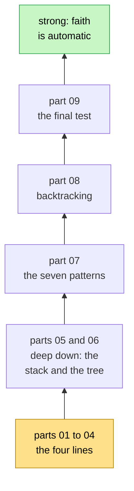
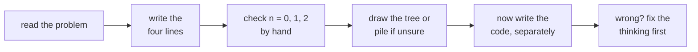

# Think Recursion — faith and expectation, from zero to strong

> After this guide you can design any recursive solution — from counting down to N-Queens and other
> backtracking problems — by answering four questions, **without tracing a single call**.
> There is **no code** here: this is pure thinking practice, in **9 parts** with **105 exercises**.
> Write the code separately, later.

🔗 Related: the [Tower of Hanoi lesson](../tower-of-hanoi/) (the method on one full problem) ·
[Maths 07 · Recurrences](../../../maths_for_dsa/07-recurrences/) (how fast recursion is) ·
[Maths 16 · Logic, Sets and Proofs](../../../maths_for_dsa/16-logic-sets-and-proofs/) (why faith is safe)

## Contents

1. [What this guide is for](#1-what-this-guide-is-for)
2. [The nine parts](#2-the-nine-parts)
3. [How to use each part](#3-how-to-use-each-part)
4. [How much practice is enough](#4-how-much-practice-is-enough)
5. [A 4-week plan](#5-a-4-week-plan)
6. [You are strong when you can](#6-you-are-strong-when-you-can)
7. [Your progress](#7-your-progress)
8. [The whole guide in one minute](#8-the-whole-guide-in-one-minute)

---

## 1. What this guide is for

Recursion is **20 % code and 80 % thinking**. Most people get stuck because they try to follow every call
in their head — *"this calls that, which calls that, which calls…"* — and get lost after three levels. 😵

Strong programmers think differently. They never follow the calls. They do this:

> **Promise** what the function does (the **expectation**), **trust** that a smaller copy keeps the same
> promise (the **faith**), and do only their own **small part** (meeting the expectation).

This guide trains exactly that, step by step:

- stories and pictures that make the idea feel natural;
- what really happens inside the computer — the **call stack** and the **recursion tree**;
- the **seven patterns** that almost every recursive problem uses;
- **backtracking**, with the same faith and expectation;
- **105 thinking exercises** from easy to hard, every one answered with the same four lines, and a
  **final test** at the end.

Every picture follows the same rules: processes go **left to right**, and trees **grow upward** — the first
call is the **root at the bottom**, the base cases are the leaves at the top.

---

## 2. The nine parts

| Part | What you learn | Exercises |
|---|---|---|
| [01 · The Big Idea](01-the-big-idea.md) | two everyday stories, the four questions, why faith is safe | 6 |
| [02 · Expectation](02-expectation.md) | writing a clear promise, the flexible friend, asking for more | 10 |
| [03 · Faith](03-faith.md) | trusting a smaller friend, finding the smaller job, why you never trace | 10 |
| [04 · My Work and the Base Case](04-my-work-and-base-case.md) | the glue, the three spots (before, between, after), base cases that always work | 10 |
| [05 · The Call Stack](05-the-call-stack.md) | the pile of plates, the way in and the way back, how much memory | 8 |
| [06 · The Recursion Tree](06-the-recursion-tree.md) | trees with the root at the bottom, the ant walk, time and memory | 8 |
| [07 · Recursion Patterns](07-patterns.md) | the seven shapes, each with its four lines and a picture | 14 |
| [08 · Backtracking](08-backtracking.md) | choose, trust, un-choose; the shared notebook; pruning; the start index | 14 |
| [09 · Final Test](09-final-test.md) | 25 mixed questions that prove you are ready | 25 |
| | **Total** | **105** |

The climb, from the bottom:

Parts 01–04 teach the **four lines** one by one. Parts 05–06 show what happens **deep down** in the computer.
Part 07 turns the method into **patterns** you recognise at a glance, and part 08 uses the very same four
lines for **backtracking**. Part 09 checks everything.

---

## 3. How to use each part

Every part has the same shape:

1. **A promise** at the top: what you can do after the part.
2. **Explanations with pictures**, like a teacher at the board.
3. **Exercises**, easy to hard. The answer is hidden — click **Answer** only after you have written your own.
4. **A one-minute recap** to read again the next day.

The rules for the exercises:

- **No code.** Write the four lines — EXPECTATION, FAITH, MY WORK, BASE CASE — in plain words, on paper.
- **Check them on a tiny input** (0, 1 or 2), trusting the friend for the smaller one.
- **Compare ideas, not words.** There are many correct ways to say the same four lines.
- **Got one wrong?** Mark it, and do it again two days later without looking.

---

## 4. How much practice is enough

Here is an honest answer, as a rule of thumb that works for most learners:

| Stage | What you do | About how many | You will notice |
|---|---|---|---|
| Learn the method | parts 01–08, every exercise, in order | 80 | you can write the four lines for any easy problem |
| Prove it | part 09, the final test | 25 | you know which parts are solid and which need another pass |
| Make it automatic | real problems, writing the four lines **before** any code | about 35–40 | faith stops feeling scary; you stop tracing |
| Be interview-strong | mixed problems, timed, explaining out loud | 15–20 more | new problems look like old patterns |

So: the **105 exercises here**, then about **35–40 real problems** (the 27 in the plan below, plus about 10 of
your own choice). Most people feel the "click" for simple recursion after about 10–15 problems, for trees
after about 25–30, and for backtracking after about 15–20 backtracking problems. The number matters less
than **how** you practise:

**Self-test:** take 5 recursion problems you have **never** seen. Give yourself 10 minutes each to write only
the four lines. If 4 of the 5 are right, you are ready for anything recursion-shaped in an interview. 💪

---

## 5. A 4-week plan

| Week | Parts here | Then real problems (four lines first, code after) |
|---|---|---|
| 1 | 01 – 04 (36 exercises) | 509 Fibonacci Number, 344 Reverse String, 206 Reverse Linked List, 21 Merge Two Sorted Lists, 50 Pow(x, n) |
| 2 | 05 – 07 (30 exercises) | 104 Maximum Depth of Binary Tree, 226 Invert Binary Tree, 100 Same Tree, 110 Balanced Binary Tree, 112 Path Sum, 543 Diameter of Binary Tree, 70 Climbing Stairs, 62 Unique Paths |
| 3 | 08 (14 exercises) | 78 Subsets, 46 Permutations, 77 Combinations, 39 Combination Sum, 17 Letter Combinations of a Phone Number, 22 Generate Parentheses, 79 Word Search, 51 N-Queens |
| 4 | 09, the final test (25 questions) — then redo every exercise you got wrong | 90 Subsets II, 47 Permutations II, 40 Combination Sum II, 131 Palindrome Partitioning, 236 Lowest Common Ancestor of a Binary Tree, 124 Binary Tree Maximum Path Sum |

About one hour a day is enough. Many of these problems already appear as thinking exercises in the parts —
when you meet one on LeetCode, you will recognise it.

---

## 6. You are strong when you can

- [ ] write the **expectation in one sentence**, mentioning every input, before thinking about any steps;
- [ ] name the **smaller job** and trust it **without** following it;
- [ ] say what **your own work** is, and whether it goes before, between or after the friends;
- [ ] show that the **base case keeps the promise** and that every chain reaches it;
- [ ] **change the promise** (add an input, or ask for more) when the friend's answer is not enough;
- [ ] for backtracking, say what the friend receives, what it must find, and why you **un-choose**;
- [ ] draw the **tree** (root at the bottom) and the **pile** for a tiny input to check yourself.

---

## 7. Your progress

- [ ] [01 · The Big Idea](01-the-big-idea.md) — 6 exercises
- [ ] [02 · Expectation](02-expectation.md) — 10 exercises
- [ ] [03 · Faith](03-faith.md) — 10 exercises
- [ ] [04 · My Work and the Base Case](04-my-work-and-base-case.md) — 10 exercises
- [ ] [05 · The Call Stack](05-the-call-stack.md) — 8 exercises
- [ ] [06 · The Recursion Tree](06-the-recursion-tree.md) — 8 exercises
- [ ] [07 · Recursion Patterns](07-patterns.md) — 14 exercises
- [ ] [08 · Backtracking](08-backtracking.md) — 14 exercises
- [ ] [09 · Final Test](09-final-test.md) — 25 questions, score 40 or more out of 50

---

## 8. The whole guide in one minute

- Recursion = **promise, trust, small work, stop.** Four lines, written before any code:
  **EXPECTATION, FAITH, MY WORK, BASE CASE.**
- The **expectation** says *what*, for **every** input. Make it more general (the flexible friend) or ask for
  more when the friend's answer isn't enough.
- **Faith:** the same promise, a **smaller** input, and you never open the friend's box.
- **My work** goes before, between or after the friends — the spot decides the order of things.
- The **base case** keeps the promise and every chain must reach it.
- Faith is safe because of **dominoes**: the base case holds, and each step makes the next one hold.
- **Deep down:** every call is a plate on the **stack**; many friends make a **tree** (root at the bottom).
  The pile at any moment = the path from the root to the running box. Time = boxes, memory = height.
- **Seven patterns** cover almost every problem: one step smaller, the rest of an array, two ends, halves,
  trees, counting the ways, and the flexible friend.
- **Backtracking:** choose, trust, **un-choose** — the path is a shared notebook you must give back as you got
  it; prune paths that already break the rules.
- **Practice:** the 105 exercises here, then about 35–40 real problems — always the four lines first.

Now open [part 01](01-the-big-idea.md) and write your first four lines. ✍️
