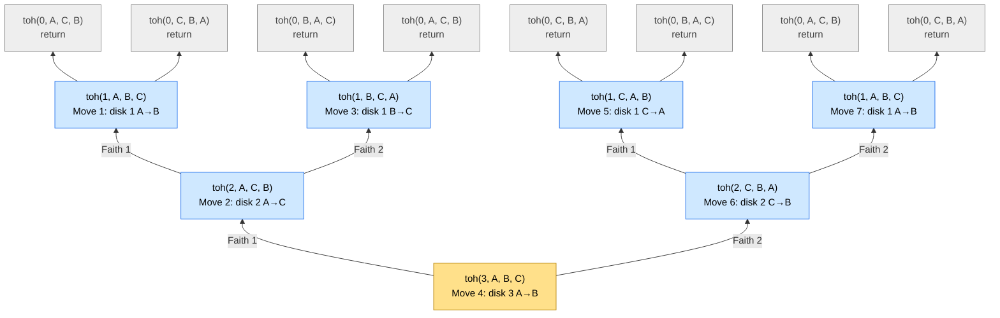
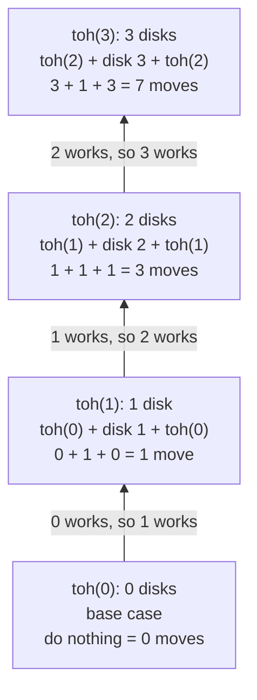

# 🗼 Tower of Hanoi — explained like you're 10

> This page does not just *solve* Tower of Hanoi.
> It teaches you **how to think** about recursion with three magic words:
> **Expectation → Faith → Meeting the expectation.**
> Learn this way of thinking once, and you can use it on almost every recursion problem.

**Code:** [`TowerOfHanoi.java`](TowerOfHanoi.java)

## Contents

1. [The game](#1-the-game)
2. [Play with tiny numbers first](#2-play-with-tiny-numbers-first)
3. [Expectation, Faith, and Meeting the expectation](#3-expectation-faith-and-meeting-the-expectation)
4. [How do you develop this faith and expectation?](#4-how-do-you-develop-this-faith-and-expectation)
5. [The Java code, line by line](#5-the-java-code-line-by-line)
6. [The complete recursion tree (3 disks)](#6-the-complete-recursion-tree-3-disks)
7. [Reading the tree from bottom to top](#7-reading-the-tree-from-bottom-to-top)
8. [Watch the poles move (dry run)](#8-watch-the-poles-move-dry-run)
9. [How many moves? Time and space](#9-how-many-moves-time-and-space)
10. [Common mistakes](#10-common-mistakes)
11. [Try it yourself](#11-try-it-yourself)
12. [One-minute recap](#12-one-minute-recap)

---

## 1. The game

Imagine **3 sticks** standing on a table. We call them **poles** and name them **A**, **B** and **C**.

On pole **A** there is a pile of **disks** (like rings or pancakes 🥞).
The biggest disk is at the bottom and the smallest is on top — like a pyramid.
We number the disks by size: **disk 1** is the smallest, **disk 3** is the biggest.

```text
       |              |              |
      [1]             |              |
     [ 2 ]            |              |
    [  3  ]           |              |
 ======A======  ======B======  ======C======
    source       destination      helper
    (start)        (goal)     (parking spot)
```

**The goal:** move the whole pile from **A** to **B**. You may use **C** to help.

**The 3 rules:**

1. Move only **one** disk at a time.
2. You can only pick up the **top** disk of a pole.
3. **Never** put a bigger disk on a smaller disk. (An elephant 🐘 can't sit on a puppy 🐶!)

---

## 2. Play with tiny numbers first

When a problem looks big, **shrink it** and play with the smallest versions first.
Small cases show you the pattern.

### 1 disk — super easy

| Move | Action |
|---|---|
| 1 | disk 1: A → B |

Done in **1 move**. ✅

### 2 disks — a tiny bit of thinking

Disk 2 (the big one) wants to go to B, but disk 1 is sitting on it.
So first, park the small one on the helper pole.

| Move | Action | Why |
|---|---|---|
| 1 | disk 1: A → C | get the small disk out of the way |
| 2 | disk 2: A → B | the big disk goes to the goal |
| 3 | disk 1: C → B | the small disk comes back on top |

Done in **3 moves**. ✅

### 3 disks — here comes the "aha!" 💡

Disk 3 (the biggest) wants to go to B, but disks 1 and 2 are sitting on it.
So we must first move **the top 2 disks** from A to C...

**Wait a second!** *Moving 2 disks* is exactly the game we just solved!
The only difference: now the goal pole is **C** (and B is the helper).

| Moves | Action |
|---|---|
| 1 – 3 | move the top **2 disks** A → C (using B) — the 2-disk game again! |
| 4 | disk 3: A → B |
| 5 – 7 | move the **2 disks** C → B (using A) — the 2-disk game again! |

Done in **7 moves**. ✅

> 💡 **The big idea:** to move **n** disks, you only need to know how to move **n − 1** disks.
> To move n − 1 disks, you only need to know how to move n − 2 disks … and so on,
> all the way down to **0 disks**, where you do nothing at all.
>
> A big problem made of **smaller copies of itself** — that is **recursion**.

---

## 3. Expectation, Faith, and Meeting the expectation

We write **one** function and give it a short name:

```java
toh(n, source, destination, helper)      // toh = Tower Of Hanoi
```

Read it aloud as: **"move n disks from source to destination, using helper."**

Now we design it in 4 small steps.

### Step 1 — Expectation 🎯 "What is my job?"

Say exactly what the function must do, in plain words — as if you were giving the job to someone else.

> **Expectation:** `toh(3, A, B, C)` prints **every move** needed to shift **3 disks** from **A** to **B**,
> using **C** as the helper, **without breaking any rule**.

Notice: we are **not** saying *how* yet. Only the promise.

### Step 2 — Faith 🙏 "Who can help me?"

Imagine you have a younger friend who plays the **same game**, but is only in charge of **one disk less**.

> **Faith:** I *believe* `toh(2, …)` correctly moves **2 disks** from **any** pole to **any** other pole,
> using the third pole as the helper.

I don't check *how* my friend does it. I don't follow it in my head. I just **trust** it.
That trust is why we call it **faith**. (Section 4 shows why this trust is 100% safe.)

### Step 3 — Meeting the expectation 🤝 "Using that help, how do I finish my job?"

I'm the boss of **3** disks. My friend can handle **2**. Here's my plan:

1. **Friend, please** move the top 2 disks from **A** to **C** (use B as helper). → `toh(2, A, C, B)`
2. **I** move the biggest disk, disk 3, from **A** to **B** — just **one** move, all by myself.
3. **Friend, please** move the 2 disks from **C** to **B** (use A as helper). → `toh(2, C, B, A)`

```text
              A          B          C          (disks listed bottom → top)
Start:        [3 2 1]    [ ]        [ ]
After step 1: [3]        [ ]        [2 1]      ← friend moved 2 disks A → C
After step 2: [ ]        [3]        [2 1]      ← I moved disk 3 A → B
After step 3: [ ]        [3 2 1]    [ ]        ← friend moved 2 disks C → B  🎉
```

The same plan works for **any** number of disks:

```text
toh(n, source, destination, helper):
    if n == 0: return                          ← BASE CASE: nothing to move
    toh(n-1, source, helper, destination)      ← FAITH 1: park n-1 disks on the helper
    move disk n: source → destination          ← MY WORK: just 1 move
    toh(n-1, helper, destination, source)      ← FAITH 2: put n-1 disks on top of disk n
```

### Step 4 — Base case 🛑 "When do I stop asking for help?"

Each friend asks an even smaller friend: 3 → 2 → 1 → 0.
With **0 disks** there is **nothing to move**, so that friend just says "done!" and goes back (`return`).

> Without a base case, friends would keep calling smaller friends forever — the computer runs out of
> memory and you get a `StackOverflowError` 💥.

*Why `n == 0` and not `n == 1`?* Both are correct. `n == 0` is the smallest possible input and keeps the
code shortest. (With `n == 1` you would print the single move and then return.)

---

## 4. How do you develop this faith and expectation?

The code is only a few lines. The **thinking** is the real skill. Here is how that thinking is built.

> 🧠 Want to train this thinking step by step, with 105 no-code exercises in 9 short parts, backtracking and a
> final test? See the [Think Recursion guide](../think_recursion/).

### 4.1 Why the faith is not blind — the domino trick

Imagine a long line of dominoes:

- if the **first** domino falls, and
- **every** domino, when it falls, knocks down the **next** one,
- then **all** the dominoes fall — no matter how many there are.

Our function works the same way:

- **First domino:** `toh(0)` is correct — it does nothing, and nothing is exactly what 0 disks need. ✅
- **Knock-on rule:** *if* `toh(k-1)` is correct, *then* `toh(k)` is correct —
  because `toh(k)` is built only from two `toh(k-1)` calls plus one legal move.
- So `toh(0)` ✅ → `toh(1)` ✅ → `toh(2)` ✅ → `toh(3)` ✅ → … → every `n` ✅

Grown-ups call this **mathematical induction**. So faith is not magic — the dominoes back it up.

There is one more reason the faith is safe **in this game**: while the friend moves the n − 1 smaller
disks, every other disk on the table is **bigger** than them. For the friend, those big disks are just
like the empty floor — so the friend is playing the normal game, and no rule can break.

### 4.2 How to *discover* the faith — a question checklist

Nobody is born knowing "use n − 1 disks". You **discover** it by asking these questions, in this order:

| # | Ask yourself | Answer for Tower of Hanoi |
|---|---|---|
| 1 | What exactly is my job? (what goes in, what comes out) | Move n disks from source to destination using helper; print every move. |
| 2 | What is the **one thing** I clearly must do? | Get the **biggest** disk to the destination. |
| 3 | What is **blocking** me from doing it? | The n − 1 smaller disks sitting on top of it. |
| 4 | Is that blocker a **smaller copy** of my own problem? | Yes! "Move n − 1 disks" is the same game, just smaller. → **Faith 1** |
| 5 | Where must the smaller problem put things so I can do my part? | On the **helper** — the destination must stay free for the big disk. |
| 6 | After my part, what is left? Is it again a smaller copy? | n − 1 disks on the helper must go onto the destination → same game → **Faith 2** |
| 7 | What is the tiniest input where the answer is obvious? | 0 disks → do nothing. → **Base case** |

> 🔑 **Golden trick:** look at what is **blocking** you, or what is **left over**.
> Very often, *that* is the smaller problem your faith should be about.

### 4.3 Habits that grow this way of thinking

1. **Say the expectation in one sentence, using every parameter.**
   "`toh(n, src, dst, hlp)` moves n disks from src to dst using hlp." If you can't say it clearly, you can't code it.
2. **Shrink the input, but keep the same *kind* of problem.** n → n − 1, a whole array → the rest of
   the array, a string → a shorter string.
3. **Never trace the faith call while designing.** Your brain will *want* to follow every call deeper and deeper — stop it!
   Think about **one level only**: "My friend has done their part. What do I do now?"
4. **Do only a tiny bit of work yourself.** The boss does a little; the friends do the rest.
   Here the boss makes just **one move**.
5. **Find the base case last.** Ask: "When does the problem become so small that it's silly?"
6. **Trace only to check, never to design.** After writing the code, dry-run a tiny input (n = 1, 2, 3)
   with a tree (section 6).
7. **Practise on easy problems first**, writing Expectation / Faith / Meeting for each one:

   | Problem | Expectation | Faith | Meeting the expectation |
   |---|---|---|---|
   | print n down to 1 | `pd(n)` prints n, n−1, …, 1 | `pd(n-1)` prints n−1, …, 1 | print n, then call `pd(n-1)` |
   | factorial | `fact(n)` returns n! | `fact(n-1)` returns (n−1)! | return n × `fact(n-1)` |
   | power | `pow(x, n)` returns xⁿ | `pow(x, n-1)` returns xⁿ⁻¹ | return x × `pow(x, n-1)` |

   After a few of these, Tower of Hanoi will feel natural.

### 4.4 The "flexible friend" — why we pass 3 pole names

Your friend can move disks from **any** pole to **any** pole. You simply **tell** the friend which pole
plays which role by passing the pole names in a different order. That is why every call **shuffles** them:

| Call | source | destination | helper | Meaning |
|---|---|---|---|---|
| `toh(n, A, B, C)` | A | B | C | my job |
| `toh(n-1, A, C, B)` | A | **C** | **B** | Faith 1: "move n − 1 disks from A to C, use B" |
| `toh(n-1, C, B, A)` | **C** | B | **A** | Faith 2: "move n − 1 disks from C to B, use A" |

> 🎵 **Memory trick:** in **Faith 1**, *destination and helper* swap places.
> In **Faith 2**, *source and helper* swap places.

---

## 5. The Java code, line by line

The heart of [`TowerOfHanoi.java`](TowerOfHanoi.java):

```java
static void toh(int n, char source, char destination, char helper) {
    // BASE CASE: 0 disks means there is nothing to move.
    if (n == 0) {
        return;
    }

    // FAITH 1: toh(n-1) moves the n-1 smaller disks off disk n: source -> helper.
    toh(n - 1, source, helper, destination);

    // MY WORK: disk n is now on top and free, so move it straight to the destination.
    moveNumber++;
    System.out.println("Move " + moveNumber + ": disk " + n + " from " + source + " to " + destination);

    // FAITH 2: toh(n-1) moves the n-1 disks from the helper onto disk n: helper -> destination.
    toh(n - 1, helper, destination, source);
}
```

| Code | Part | Kid version |
|---|---|---|
| `if (n == 0) return;` | Base case 🛑 | "No disks? Then I'm already done!" |
| `toh(n - 1, source, helper, destination);` | Faith 1 🙏 | "Friend, please park the smaller disks on the helper pole." |
| `System.out.println(...)` | My work 💪 | "Now the big disk is free — I move it to the goal." |
| `toh(n - 1, helper, destination, source);` | Faith 2 🙏 | "Friend, please put the smaller disks back on top of the big one." |

> 📍 **Where does the printing happen?** *Between* the two recursive calls.
> Code before the first call runs **before** any helper starts (the *pre* area), code between the calls runs
> **in the middle** (the *in* area), and code after the second call runs **after** both helpers are done, on
> the way back (the *post* area).
> Tower of Hanoi does its work in the **in** area.

### Run it

```shell
cd dsa/recursion/tower-of-hanoi

# Java 11+ can run a single file directly
java TowerOfHanoi.java          # 3 disks (default)
java TowerOfHanoi.java 4        # any number of disks from 0 to 20

# or the classic way: compile, then run
javac TowerOfHanoi.java
java TowerOfHanoi 3
```

Output for 3 disks:

```text
Moving 3 disks from A to B, using C as the helper:
Move 1: disk 1 from A to B
Move 2: disk 2 from A to C
Move 3: disk 1 from B to C
Move 4: disk 3 from A to B
Move 5: disk 1 from C to A
Move 6: disk 2 from C to B
Move 7: disk 1 from A to B
Done! Total moves = 7 (formula: 2^3 - 1 = 7)
```

---

## 6. The complete recursion tree (3 disks)

Every box is **one function call**. Every box (except the base cases) has **two children** — its two
faith calls. A box prints its own move **after its left child finishes and before its right child starts**.

**Read it from the bottom to the top ⬆️** — it grows like a real tree 🌳. The first call,
`toh(3, A, B, C)`, is the **root at the bottom**. Every arrow points **up** and means *"Friend, please
help me with a smaller job!"*: a box asks its two helpers just above it — **Faith 1** on the left,
**Faith 2** on the right. Keep climbing until you reach the **leaves at the top**: the 8 base cases,
`toh(0)`, which have nothing to do and just return. (Computer scientists really do call them the *root*
and the *leaves*!) When the root at the bottom finishes, all 3 disks are on B. 🎉



The same tree as plain text. Read it **from the bottom to the top** too:

```text
   toh(0)      toh(0)      toh(0)      toh(0)      toh(0)      toh(0)      toh(0)      toh(0)
   return      return      return      return      return      return      return      return
      ▲           ▲           ▲           ▲           ▲           ▲           ▲           ▲
      └─────┬─────┘           └─────┬─────┘           └─────┬─────┘           └─────┬─────┘
            │                       │                       │                       │
     toh(1, A, B, C)         toh(1, B, C, A)         toh(1, C, A, B)         toh(1, A, B, C)
   Move 1: disk 1 A→B      Move 3: disk 1 B→C      Move 5: disk 1 C→A      Move 7: disk 1 A→B
            ▲                       ▲                       ▲                       ▲
         Faith 1                 Faith 2                 Faith 1                 Faith 2
            └───────────┬───────────┘                       └───────────┬───────────┘
                        │                                               │
                 toh(2, A, C, B)                                 toh(2, C, B, A)
               Move 2: disk 2 A→C                              Move 6: disk 2 C→B
                        ▲                                               ▲
                     Faith 1                                         Faith 2
                        └───────────────────────┬───────────────────────┘
                                                │
                                         toh(3, A, B, C)
                                       Move 4: disk 3 A→B
```

🔢 **Follow the `Move` numbers 1 → 7** to see the real order of the moves. They jump up and down the tree
(Move 1 is near the top, Move 4 is at the very bottom, Move 7 is near the top again) because a box can
make its own move only after its **Faith 1** helper has completely finished.

---

## 7. Reading the tree from bottom to top

The tree in section 6 grows **up**, so the computer walks it in two directions:

- **Calls climb up ⬆️** — starting at the root at the bottom (the very first call), each box asks its
  helpers just above it, until the calls reach the **leaves at the top** (the base cases).
- **Answers come back down ⬇️** — a box is finished only when both of its helpers are finished, so the
  answers travel back down, level by level, until they reach the **root at the bottom**.

### 7.1 Level by level, from the leaves back to the root

| Level (leaves → root) | Boxes | What each box does | Moves printed at this level | Total moves by one box and its helpers |
|---|---|---|---|---|
| `toh(0)` — the leaves (top row) | 8 | nothing — just returns | — | 0 |
| `toh(1)` | 4 | nothing + **1 move** (disk 1) + nothing | 1, 3, 5, 7 | 0 + 1 + 0 = **1** |
| `toh(2)` | 2 | 1 move + **1 move** (disk 2) + 1 move | 2, 6 | 1 + 1 + 1 = **3** |
| `toh(3)` — the root (bottom row) | 1 | 3 moves + **1 move** (disk 3) + 3 moves | 4 | 3 + 1 + 3 = **7** |

Things to notice 👀

- Every box (except the base cases) makes **exactly one move by itself** — everything else comes from
  its children. So total moves = number of non-base boxes = 1 + 2 + 4 = **7**.
- **Disk 1** (the smallest) is the busiest — it moves on every odd move (1, 3, 5, 7).
  **Disk 3** (the biggest) moves only **once**, right in the middle (move 4). Bigger disks are lazier! 😄

### 7.2 The call stack — a pile of plates

Every call that is still waiting for its friends sits on a pile, like plates.
At the **deepest** moment (the very first base case), the pile looks like this:

```text
|  toh(0, A, C, B)  |  ← top of the pile = the deepest call. It finishes FIRST.
|  toh(1, A, B, C)  |
|  toh(2, A, C, B)  |
|  toh(3, A, B, C)  |  ← bottom of the pile = the first call. It finishes LAST.
+-------------------+
```

See how the pile matches the tree in section 6? The first call is at the **bottom** of both, and the
deepest call (a leaf) is at the **top** of both. The pile is simply the path from the root up to the leaf
the computer is visiting right now.

A plate is taken off only when its whole job is done, so answers always flow **from the leaves at the top
of the tree back down to the root at the bottom**. The pile is never taller than n + 1 = 4 plates — that's
why this uses very little memory.

### 7.3 The ladder of faith — from the smallest to the biggest

This is the domino idea from section 4.1, drawn **from bottom to top**. Each step stands on the step below it.
Don't mix it up with the tree in section 6: the tree shows **who asks whom for help** (the first call is at
the bottom), while this ladder shows **why the faith is safe** (the smallest case is at the bottom):



```text
   ▲    toh(3) = toh(2) + [move disk 3] + toh(2)   =  3 + 1 + 3  =  7 moves
   │    toh(2) = toh(1) + [move disk 2] + toh(1)   =  1 + 1 + 1  =  3 moves
   │    toh(1) = toh(0) + [move disk 1] + toh(0)   =  0 + 1 + 0  =  1 move
   │    toh(0) = do nothing (base case)            =  0 moves
 climb up — each step stands on the one below it
```

---

## 8. Watch the poles move (dry run)

Disks are listed **bottom → top**. Check that a bigger number is never on top of a smaller one!

| Move | Printed by | Action | A | B | C |
|---|---|---|---|---|---|
| start | — | — | 3 2 1 | — | — |
| 1 | `toh(1, A, B, C)` | disk 1: A → B | 3 2 | 1 | — |
| 2 | `toh(2, A, C, B)` | disk 2: A → C | 3 | 1 | 2 |
| 3 | `toh(1, B, C, A)` | disk 1: B → C | 3 | — | 2 1 |
| 4 | `toh(3, A, B, C)` | disk 3: A → B | — | 3 | 2 1 |
| 5 | `toh(1, C, A, B)` | disk 1: C → A | 1 | 3 | 2 |
| 6 | `toh(2, C, B, A)` | disk 2: C → B | 1 | 3 2 | — |
| 7 | `toh(1, A, B, C)` | disk 1: A → B | — | 3 2 1 | — |

- After **move 3**, disks 1 and 2 are on C → **Faith 1** of the root box (`toh(3)`, at the bottom of the tree) is done.
- **Move 4** is the root box's **own work** — the biggest disk jumps to B.
- After **move 7**, disks 1 and 2 are on B → **Faith 2** is done. 🎉

---

## 9. How many moves? Time and space

Let **T(n)** be the number of moves for n disks. Straight from the code:

- T(0) = 0
- T(n) = T(n − 1) + 1 + T(n − 1) = 2 · T(n − 1) + 1

| Disks (n) | 0 | 1 | 2 | 3 | 4 | 5 | 10 | 20 |
|---|---|---|---|---|---|---|---|---|
| Moves | 0 | 1 | 3 | 7 | 15 | 31 | 1,023 | 1,048,575 |

Each time you add one disk, the moves **double, plus one**. The pattern is **T(n) = 2ⁿ − 1** —
and that is the **smallest** number of moves possible.

> 🏛️ **The legend:** priests in a temple are moving **64** golden disks, one move per second.
> That needs 2⁶⁴ − 1 = 18,446,744,073,709,551,615 moves ≈ **585 billion years** —
> about 42 times the age of the universe. Don't wait up! 😄

| | Complexity | Why (kid version) |
|---|---|---|
| **Time** | **O(2ⁿ)** | We print 2ⁿ − 1 moves. Counting the base cases too, there are 2ⁿ⁺¹ − 1 calls (15 boxes for n = 3). |
| **Space** | **O(n)** | At most n + 1 calls wait on the call stack at the same time (the pile of plates in section 7.2). |

---

## 10. Common mistakes

1. **Tracing the whole tree while designing.** You'll get lost. Design with *faith*; trace only to *check*.
2. **Mixing up the pole order.** Faith 1 is `(source, helper, destination)`; Faith 2 is `(helper, destination, source)`.
3. **Forgetting the base case** → the calls never stop → `StackOverflowError`.
4. **Printing the wrong disk.** The disk a box moves by itself is always **disk n** — the biggest disk in *its* pile.
5. **Thinking the friend can only move A → B.** The friend can move between **any** two poles — the
   parameters decide which.

---

## 11. Try it yourself

1. Run `java TowerOfHanoi.java 2` and draw its tree on paper — put the first call at the bottom of the page
   and let the tree grow up (7 boxes: 1 + 2 + 4).
2. Before running `java TowerOfHanoi.java 4`, **predict** the number of moves. (Hint: 2⁴ − 1.)
3. Write a function `countMoves(n)` that **returns** the number of moves instead of printing them:
   - Expectation: `countMoves(n)` returns the number of moves needed for n disks.
   - Faith: `countMoves(n - 1)` returns the number of moves for n − 1 disks.
   - Meeting the expectation: `return countMoves(n - 1) + 1 + countMoves(n - 1);`
   - Base case: `if (n == 0) return 0;`
4. In your notebook, write Expectation / Faith / Meeting / Base case for `printIncreasing(n)`
   (prints 1, 2, …, n).

---

## 12. One-minute recap

```text
EXPECTATION : toh(n, src, dst, hlp) prints every move to shift n disks from src to dst using hlp
FAITH       : toh(n-1, ...) can shift n-1 disks between ANY two poles
MEET IT     : toh(n-1, src, hlp, dst)  →  move disk n: src → dst  →  toh(n-1, hlp, dst, src)
BASE CASE   : n == 0  →  nothing to move, return
MOVES       : 2^n - 1          TIME : O(2^n)          SPACE : O(n)
```

> **Remember the feeling:** *I only do my tiny part. I trust my friend with the rest.
> The dominoes make sure my trust is never wrong.* 🙂
