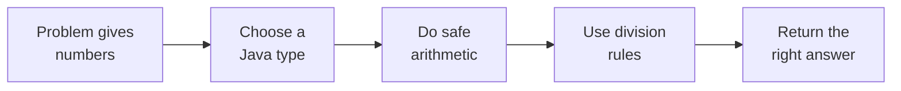
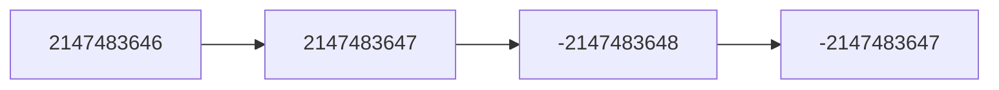
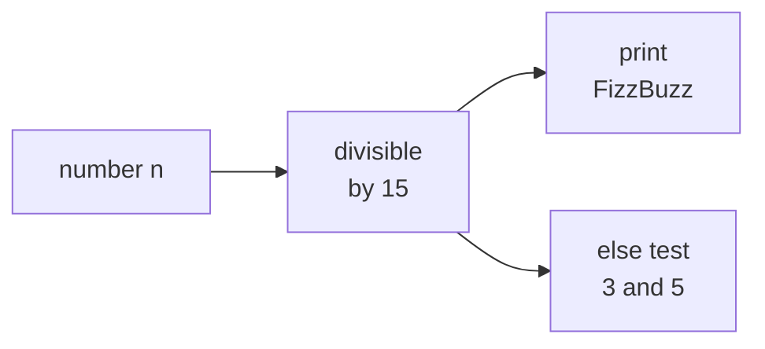

# 01 · Numbers and Integer Division

> After this chapter you can choose safe Java number types, avoid overflow, and use
> integer division without being surprised by negative numbers.

🏠 [Roadmap](../README.md) · [02 · Digits and Number Bases](../02-digits-and-number-bases/) ➡️

## Contents

1. [Why this matters for DSA](#1-why-this-matters-for-dsa)
2. [Kinds of numbers](#2-kinds-of-numbers)
3. [Java number boxes](#3-java-number-boxes)
4. [Overflow and safe arithmetic](#4-overflow-and-safe-arithmetic)
5. [Division remainder and rounding](#5-division-remainder-and-rounding)
6. [Safe middle and ranges](#6-safe-middle-and-ranges)
7. [Floating point numbers](#7-floating-point-numbers)
8. [Java code](#8-java-code)
9. [Common mistakes](#9-common-mistakes)
10. [Interview patterns](#10-interview-patterns)
11. [Exercises](#11-exercises)
12. [One-minute recap](#12-one-minute-recap)

---

## 1. Why this matters for DSA

Many interview bugs are not about a fancy algorithm. They are about a small
number rule:

- binary search fails because `(lo + hi) / 2` overflows;
- Koko Eating Bananas needs `ceil(pile / speed)`, not normal division;
- Reverse Integer must stop before the reversed value falls out of `int`;
- odd checks fail for negative numbers when you write `n % 2 == 1`;
- counting an inclusive range needs `R - L + 1`, not `R - L`.

The computer is like a very strict cashier. If the box says `int`, the cashier
will not magically make a bigger box. You must choose the box and the rule.



🧠 **How to think of it yourself:** every time a DSA problem uses numbers, ask
three quick questions: "How big can the value become?", "Can I multiply?", and
"Do I need a whole answer, a floor, or a ceiling?"

---

## 2. Kinds of numbers

Imagine a long road with mile markers. Zero is your home. Positive numbers are
to the right. Negative numbers are to the left.

```text
negative integers       zero       positive integers
      -4  -3  -2  -1     0      1   2   3   4
<------|---|---|---|-----|------|---|---|---|------>
                 fractions and decimals live between markers
                 example: 1.5 is halfway between 1 and 2
```

Small to big:

| Kind | Plain meaning | Examples |
|---|---|---|
| Natural numbers | counting numbers | 1, 2, 3, 4 |
| Whole numbers | natural numbers plus zero | 0, 1, 2, 3 |
| Integers | whole numbers plus negatives | -3, -2, -1, 0, 1 |
| Fractions and decimals | pieces between integers | 1/2, 0.25, -3.7 |
| Irrational numbers | never-ending non-repeating decimals | √2, π |

Why do these groups exist? Because each answers a different real-life question:

- "How many candies?" usually needs natural or whole numbers.
- "How far below zero?" needs negative integers.
- "How much pizza?" needs fractions or decimals.
- "How long is a diagonal?" may need √2.

### Even and odd numbers

Even numbers can be split into pairs. Odd numbers leave one lonely item.

```text
6 stars:  ** ** **      no lonely star       even
7 stars:  ** ** ** *    one lonely star      odd
```

The rule in Java is:

```java
boolean even = n % 2 == 0;
boolean odd = n % 2 != 0;
```

Why not `n % 2 == 1`? Because Java keeps the sign of the left number, called
the dividend.

```text
 n    n % 2       n % 2 == 1       n % 2 != 0
 3      1            true              true
-3     -1            false             true
```

For bits, `(n & 1) == 1` also checks oddness. It asks, "Is the last binary bit
turned on?" Negative odd numbers still have that last bit on in Java.

Worked example:

```text
n = -7
-7 % 2 = -1
-1 is not 0, so -7 is odd
```

Java:

```java
static boolean isOddSafe(int n) {
    return n % 2 != 0;
}
```

🧠 **How to think of it yourself:** if a rule must work for negatives, test
one negative example before you trust it.

---

## 3. Java number boxes

Java number types are boxes. A small box is cheap, but it cannot hold a huge
number. A big box is safer for big products.

```text
tiny box       small box       normal box            huge box
 byte           short           int                   long
 8 bits         16 bits         32 bits               64 bits
 about 100s     about 30000s    about ±2.1 × 10^9     about ±9.2 × 10^18
```

| Type | Whole or decimal | Approx range | Common DSA use |
|---|---|---|---|
| `byte` | whole | -128 to 127 | rare |
| `short` | whole | about ±3.2 × 10⁴ | rare |
| `int` | whole | about ±2.1 × 10⁹ | default counters and indexes |
| `long` | whole | about ±9.2 × 10¹⁸ | big counts, products, sums |
| `float` | decimal | about 7 decimal digits | rare in DSA |
| `double` | decimal | about 15 decimal digits | geometry and averages |

The most important choice:

> If a value or a product can pass about 2 × 10⁹, use `long`.

Why? `int` stops at 2,147,483,647. A product like 50,000 × 50,000 is
2,500,000,000, already too big for `int`.

```java
int a = 50000;
int b = 50000;
long wrong = a * b;          // int multiplication happens first
long right = (long) a * b;   // now multiplication happens in long
```

🧠 **How to think of it yourself:** multiplication grows faster than addition.
If constraints say `n ≤ 100000`, then `n * n` is about 10¹⁰, so use `long`.

### Choosing a type checklist

Use this tiny interview checklist before coding:

```text
1. Is the value an array index or a count below about 2 billion?
   yes -> int is usually fine

2. Can I add many values together?
   yes -> think about the largest possible sum

3. Can I multiply two values?
   yes -> estimate the largest possible product

4. Can the answer be a decimal?
   yes -> double, unless the problem needs exact money or exact counts
```

Examples:

| Constraint story | Biggest scary value | Safer type |
|---|---:|---|
| `n ≤ 100000`, count pairs | about `n * n = 10^10` | `long` |
| array length `n ≤ 100000` | index up to 99999 | `int` |
| coordinates up to 100000 | squared distance up to 10¹⁰ | `long` |
| probability answer allowed error | decimal | `double` |

Picture the choice like choosing a backpack:

```text
small lunch       school books             camping gear
byte or short     int                      long
rare in DSA       default backpack         when products get heavy
```

In interviews, saying this out loud helps: "The input values fit in `int`, but
their product might not, so I will cast to `long` before multiplying."

---

## 4. Overflow and safe arithmetic

Overflow is what happens when the number does not fit in its box. Java integer
arithmetic wraps around, like a car odometer.

```text
car odometer with 4 digits:

  9998
  9999
  0000    wrapped around
  0001
```

For `int`, the wrap is:

```text
Integer.MAX_VALUE      2147483647
Integer.MAX_VALUE + 1 -2147483648
```

Picture it like a clock. After the last tick, you return to the first mark.



Why is this dangerous? The answer still has a type and looks like a normal
number, but it is wrong for your story.

### Safe multiplication

Java first looks at the operands. If both are `int`, the multiplication is done
in `int`, even when the result is stored in a `long`.

```text
a = 50000, b = 50000
true product       = 2500000000
int wrapped result = -1794967296
```

Use:

```java
long product = (long) a * b;
```

### Detecting overflow

Java can throw an exception for exact arithmetic:

```java
int sum = Math.addExact(a, b);
int product = Math.multiplyExact(a, b);
```

Or check before multiplying positive integers:

```java
if (a != 0 && b > Integer.MAX_VALUE / a) {
    throw new ArithmeticException("overflow");
}
```

Why does this work? If `a * b ≤ MAX`, then dividing both sides by positive `a`
gives `b ≤ MAX / a`.

### The smallest int trap

`Integer.MIN_VALUE` is -2,147,483,648. The positive value 2,147,483,648 does
not fit in `int`, so this is still negative:

```java
Math.abs(Integer.MIN_VALUE) == Integer.MIN_VALUE
```

### Reverse Integer

LeetCode 7 asks you to reverse digits inside the `int` range. Build the result
one digit at a time, but check before `result * 10 + digit`.

```text
x = 123
result = 0
take 3 -> result = 0 * 10 + 3 = 3
take 2 -> result = 3 * 10 + 2 = 32
take 1 -> result = 32 * 10 + 1 = 321
```

Java:

```java
if (result > Integer.MAX_VALUE / 10
        || (result == Integer.MAX_VALUE / 10 && digit > 7)) {
    return 0;
}
```

The digit limit is 7 because `Integer.MAX_VALUE` ends in 7.
For the negative side, the last allowed digit is -8 because `MIN_VALUE` ends
in -8.

🧠 **How to think of it yourself:** before doing a dangerous step, ask,
"What is the biggest safe value just before this step?"

---

## 5. Division remainder and rounding

Integer division is sharing candies into equal groups and throwing away the
unfinished piece.

```text
7 candies, 3 kids

kid 1: **    kid 2: **    kid 3: **    left: *

7 / 3 = 2
7 % 3 = 1
```

In Java, integer `/` truncates toward zero. That means it cuts off the decimal
part and walks toward 0.

```text
 7 / 3 =  2     because  2.333 cuts to  2
-7 / 3 = -2     because -2.333 cuts to -2
```

`%` keeps the sign of the dividend, the left number:

```text
 7 % 3 =  1
-7 % 3 = -1
```

The identity always holds:

```text
a == (a / b) * b + a % b
```

Check it:

```text
a = -7, b = 3
-7 / 3 = -2
-7 % 3 = -1
(-2) * 3 + (-1) = -7
```

### Floor division for negatives

Sometimes you want mathematical floor, which moves left on the number line.
Use `Math.floorDiv` and `Math.floorMod`.

```text
value:       -4   -3   -2   -1    0    1    2    3
             |----|----|----|----|----|----|----|
-7 / 3 as real number is -2.333
truncate toward zero gives -2
floor gives -3
```

Java:

```java
Math.floorDiv(-7, 3) == -3
Math.floorMod(-7, 3) == 2
```

Why is `floorMod(-7, 3)` equal to 2? Because the floor identity is:

```text
-7 == (-3) * 3 + 2
```

### Division by zero

Integer division by zero throws:

```java
int x = 5 / 0;      // ArithmeticException
```

Floating division follows IEEE rules:

```java
1.0 / 0.0    // Infinity
0.0 / 0.0    // NaN
```

### Floor ceil round and truncate

Think of the number line as a hallway of integer doors.

```text
        -4        -3        -2        -1         0         1
---------|---------|---------|---------|---------|---------|
                 -2.7

floor(-2.7)    = -3   left door
ceil(-2.7)     = -2   right door
round(-2.7)    = -3   nearest door
truncate(-2.7) = -2   walk toward zero
```

For positive integers, ceiling division is:

```text
ceil(a / b) = (a + b - 1) / b       when a >= 0 and b > 0
```

Why? Adding `b - 1` gives every non-empty leftover enough padding to open one
more box.

```text
17 bananas, boxes of 5

box 1: 1 2 3 4 5
box 2: 6 7 8 9 10
box 3: 11 12 13 14 15
box 4: 16 17

(17 + 5 - 1) / 5 = 21 / 5 = 4
```

This is exactly what Koko Eating Bananas uses. If a pile has 11 bananas and
Koko eats 4 per hour, she needs `ceil(11 / 4) = 3` hours.

### Divide Two Integers

LeetCode 29 asks for division without using the normal division operator. The
math idea is still the same: division asks "how many copies of divisor fit in
dividend?"

```text
43 divided by 5

5 + 5 + 5 + 5 + 5 + 5 + 5 + 5 = 40
one more 5 would pass 43
answer = 8, remainder = 3
```

The fast version doubles chunks:

```text
5, 10, 20, 40
take 40 once, so answer gains 8 copies of 5
leftover is 3
```

Why do many solutions convert to negative numbers? Because `Integer.MIN_VALUE`
has no positive partner inside `int`. The negative side has one extra value, so
careful solutions keep numbers negative to avoid overflow.

### Sqrt by binary search

LeetCode 69 asks for the floor of √x. That means the biggest `m` with
`m * m ≤ x`.

```text
x = 8

1^2 = 1 <= 8
2^2 = 4 <= 8
3^2 = 9 > 8

answer = 2
```

Use `m <= x / m` instead of `m * m <= x` when `m * m` might overflow. Same idea
as checking multiplication before doing it.

🧠 **How to think of it yourself:** if the question asks for "pages needed",
"boxes needed", "hours needed", or "minimum full groups to cover items", think
ceiling division.

---

## 6. Safe middle and ranges

Binary search keeps two walls, `lo` and `hi`, and asks for the middle.

```text
lo                                      hi
|---------------------------------------|
                    mid
```

The obvious formula can overflow:

```java
int mid = (lo + hi) / 2;
```

If `lo` and `hi` are both near 2,000,000,000, their sum is too big for `int`.
Use:

```java
int mid = lo + (hi - lo) / 2;
```

Why it is the same when `lo` and `hi` are normal non-negative indexes:

```text
hi - lo                 = safe distance between the walls
(hi - lo) / 2           = half that distance
lo + (hi - lo) / 2      = start at lo, then walk halfway
```

The important story is simpler: first measure the safe distance `hi - lo`, then
walk half that distance from `lo`.

Java also often uses:

```java
int mid = (lo + hi) >>> 1;
```

The unsigned shift treats the wrapped sum as an unsigned 32-bit number. It is
common inside Java libraries, but `lo + (hi - lo) / 2` is easier to explain.

### Counting an inclusive range

Fence posts teach the off-by-one rule.

```text
posts from 2 to 6:

2   3   4   5   6
|---|---|---|---|

numbers = 6 - 2 + 1 = 5
gaps    = 6 - 2     = 4
```

So:

```text
count integers in [L, R] = R - L + 1
```

For odd numbers in an interval, pair the numbers like socks:

```text
[3, 11]

3  4  5  6  7  8  9  10  11
O  E  O  E  O  E  O   E   O

odd count = 5
```

A handy formula is:

```text
odd count in [L, R] = count odds up to R - count odds before L
count odds up to n  = (n + 1) / 2        for n >= 0
```

For non-negative LeetCode 1523 inputs:

```java
int answer = (high + 1) / 2 - low / 2;
```

Why does `low / 2` count odds before `low`? In `0..low-1`, every pair
`(0,1)`, `(2,3)`, `(4,5)` contributes exactly one odd number.

### Fizz Buzz as remainder decisions

Fizz Buzz is not about printing words. It is about asking divisibility questions
in the right order.

```text
n = 15

15 % 3 = 0
15 % 5 = 0

both are true, so print FizzBuzz
```

The order matters:



Why test 15 first? Because a number divisible by both 3 and 5 is divisible by
their product 15. If you test 3 first, then 15 would stop early at `Fizz`.

```java
if (n % 15 == 0) return "FizzBuzz";
if (n % 3 == 0) return "Fizz";
if (n % 5 == 0) return "Buzz";
return String.valueOf(n);
```

### Average without overflow

Do not write `(a + b) / 2` for very large `int` values. Use `long` for the
sum, then divide:

```java
int avg = (int) (((long) a + b) / 2);
```

The average of two `int` values still fits in `int`, but the temporary sum may
not.

🧠 **How to think of it yourself:** sums overflow before division can save
them. Make numbers smaller first, or move to `long`.

---

## 7. Floating point numbers

`double` is a decimal-looking number stored in binary. Some simple decimal
fractions cannot be written exactly in binary, just like 1/3 cannot be written
exactly in decimal.

```text
decimal:
1 / 3 = 0.3333333333... forever

binary has the same problem:
0.1 is a repeating binary fraction
```

So Java says:

```java
0.1 + 0.2 == 0.30000000000000004
```

Compare doubles with a tiny allowed error, called epsilon:

```java
Math.abs(a - b) <= 1e-9
```

Use `double` for geometry, averages, probabilities, and "close enough" answers.
Do not use it for exact counts or money. For money, use integer cents or
`BigDecimal`.

Casting to `int` truncates toward zero:

```text
(int)  3.9 =  3
(int) -3.9 = -3
```

🧠 **How to think of it yourself:** if the problem says "exact", avoid
floating point unless the statement explicitly accepts an error.

---

## 8. Java code

Code: [`IntegerDivision.java`](IntegerDivision.java)

Key methods in the file:

```java
static boolean isOddSafe(int n) {
    return n % 2 != 0;
}

static int safeMid(int lo, int hi) {
    return lo + (hi - lo) / 2;
}

static int ceilDivPositive(int a, int b) {
    return (a + b - 1) / b;
}
```

Run it:

```text
cd maths_for_dsa/01-numbers-and-integer-division
java IntegerDivision.java
```

Real output:

```text
Numbers and integer division demos
isOddRemainder(-3) = false
isOddSafe(-3) = true
isOddBit(-3) = true
Integer.MAX_VALUE = 2147483647
Integer.MAX_VALUE + 1 = -2147483648
50000 * 50000 as int = -1794967296
50000 * 50000 as long = 2500000000
Math.abs(Integer.MIN_VALUE) = -2147483648
7 / 3 = 2, 7 % 3 = 1
-7 / 3 = -2, -7 % 3 = -1
floorDiv(-7, 3) = -3
floorMod(-7, 3) = 2
ceilDivPositive(17, 5) = 4
safeMid(2_000_000_000, 2_100_000_000) = 2050000000
unsignedMid(2_000_000_000, 2_100_000_000) = 2050000000
reverseChecked(123) = 321
reverseChecked(-120) = -21
reverseChecked(1534236469) = 0
kokoHours([3,6,7,11], 4) = 8
countIntegersInclusive(-2, 3) = 6
averageWithoutOverflow(2_000_000_000, 2_100_000_000) = 2050000000
0.1 + 0.2 = 0.30000000000000004
almostEqual(0.1 + 0.2, 0.3) = true
(int) -3.9 = -3
```

---

## 9. Common mistakes

| Mistake | Why it hurts | Safer habit |
|---|---|---|
| `n % 2 == 1` | misses negative odd numbers | `n % 2 != 0` |
| `long p = a * b` | multiplication already overflowed in `int` | `long p = (long) a * b` |
| `(lo + hi) / 2` | sum may overflow | `lo + (hi - lo) / 2` |
| using `/` for pages | drops a needed partial page | `(a + b - 1) / b` |
| `Math.abs(Integer.MIN_VALUE)` | still negative | check before taking abs |
| `double` for exact counts | tiny representation errors | use `int` or `long` |
| forgetting `+ 1` in `[L, R]` | counts gaps, not numbers | `R - L + 1` |

---

## 10. Interview patterns

| Pattern | How to recognise it | LeetCode problems |
|---|---|---|
| Reverse digits safely | build `result * 10 + digit` inside `int` | 7 · Reverse Integer |
| Manual division | cannot use multiply, divide, or mod directly | 29 · Divide Two Integers |
| Binary search answer | monotonic yes or no, need a boundary value | 69 · Sqrt(x), 875 · Koko Eating Bananas |
| Safe midpoint | search over indexes or answer range | 374 · Guess Number Higher or Lower |
| Remainder pattern | words like multiple, divisible, odd, even | 412 · Fizz Buzz |
| Inclusive counting | asks how many numbers in `[L, R]` | 1523 · Count Odd Numbers in an Interval Range |

---

## 11. Exercises

### Level 1 · Warm-up

**1.** Which group is the smallest group containing -4: natural, whole, or
integer?

<details>
<summary>Answer</summary>

**The answer** — integer. Natural and whole numbers do not include negatives.

</details>

**2.** Is -15 odd in Java using the safe remainder test?

<details>
<summary>Answer</summary>

**The answer** — yes. `-15 % 2` is `-1`, and `-1 != 0`.

</details>

**3.** What is `17 / 5` in Java integer division?

<details>
<summary>Answer</summary>

**The answer** — 3, because Java cuts off the decimal part of 3.4.

</details>

**4.** What is `17 % 5`?

<details>
<summary>Answer</summary>

**The answer** — 2, because `17 == 3 * 5 + 2`.

</details>

**5.** What is `-17 / 5` in Java?

<details>
<summary>Answer</summary>

**The answer** — -3, because Java truncates toward zero.

</details>

**6.** What is `-17 % 5` in Java?

<details>
<summary>Answer</summary>

**The answer** — -2, because `-17 == (-3) * 5 + (-2)`.

</details>

**7.** How many integers are in `[4, 9]`?

<details>
<summary>Answer</summary>

**The answer** — 6. Use `9 - 4 + 1 = 6`.

</details>

**8.** How many pages are needed for 46 items if each page holds 10 items?

<details>
<summary>Answer</summary>

**The answer** — 5. Use `(46 + 10 - 1) / 10 = 55 / 10 = 5`.

</details>

### Level 2 · Practice

**9.** What does `Integer.MAX_VALUE + 1` become?

<details>
<summary>Answer</summary>

**The answer** — -2,147,483,648. It wraps to `Integer.MIN_VALUE`.

</details>

**10.** Compute `50000 * 50000` as a true mathematical product.

<details>
<summary>Answer</summary>

**The answer** — 2,500,000,000. This is bigger than `int`, so use `long`.

</details>

**11.** If `a = 50000` and `b = 50000`, what Java expression safely stores the
product in a `long`?

<details>
<summary>Answer</summary>

**The answer** — `long product = (long) a * b;`. Cast before multiplying.

</details>

**12.** Find the safe middle of `lo = 2,000,000,000` and `hi = 2,100,000,000`.

<details>
<summary>Answer</summary>

**The answer** — 2,050,000,000. Compute
`lo + (hi - lo) / 2 = 2,000,000,000 + 50,000,000`.

</details>

**13.** What is `Math.floorDiv(-17, 5)`?

<details>
<summary>Answer</summary>

**The answer** — -4, because floor moves left from -3.4 to -4.

</details>

**14.** What is `Math.floorMod(-17, 5)`?

<details>
<summary>Answer</summary>

**The answer** — 3, because `-17 == (-4) * 5 + 3`.

</details>

**15.** Reverse 120 by digit rules.

<details>
<summary>Answer</summary>

**The answer** — 21. The leading zero in 021 disappears.

</details>

**16.** For piles `[3, 6, 7, 11]` and speed 4, how many hours does Koko need?

<details>
<summary>Answer</summary>

**The answer** — 8. Hours are `1 + 2 + 2 + 3 = 8`.

</details>

### Level 3 · Interview

**17.** Reverse `1534236469` as a 32-bit signed integer.

<details>
<summary>Answer</summary>

**The answer** — 0. The mathematical reverse 9,646,324,351 is bigger than
`Integer.MAX_VALUE`.

</details>

**18.** For `x = 8`, what should integer square root return in Sqrt(x)?

<details>
<summary>Answer</summary>

**The answer** — 2. The real √8 is about 2.828, and the problem wants floor.

</details>

**19.** Count odd numbers in `[3, 11]`.

<details>
<summary>Answer</summary>

**The answer** — 5. They are 3, 5, 7, 9, 11.

</details>

**20.** In Fizz Buzz, what should 30 print?

<details>
<summary>Answer</summary>

**The answer** — `FizzBuzz`, because 30 is divisible by both 3 and 5.

</details>

**21.** If `guess(mid)` says the secret is higher, which binary search wall
moves?

<details>
<summary>Answer</summary>

**The answer** — `lo` moves to `mid + 1`, because all values up to `mid` are
too small.

</details>

**22.** What is `(int) -8.9`?

<details>
<summary>Answer</summary>

**The answer** — -8. Casting truncates toward zero.

</details>

**23.** Are `0.1 + 0.2` and `0.3` exactly equal as doubles?

<details>
<summary>Answer</summary>

**The answer** — no. `0.1 + 0.2` prints as `0.30000000000000004`.

</details>

**24.** What is the average of 2,000,000,000 and 2,100,000,000?

<details>
<summary>Answer</summary>

**The answer** — 2,050,000,000. Do not compute the `int` sum first.

</details>

---

## 12. One-minute recap

- Use `int` for normal indexes and counters, but use `long` when products or
  sums can pass about 2 × 10⁹.
- Java integer overflow wraps around; it does not warn you.
- Cast before multiplying: `(long) a * b`.
- Java `/` truncates toward zero, and `%` keeps the dividend sign.
- Use `Math.floorDiv` and `Math.floorMod` when you need mathematical floor.
- For positive integers, `ceil(a / b)` is `(a + b - 1) / b`.
- Safe middle is `lo + (hi - lo) / 2`.
- Compare doubles with an epsilon, not exact equality.
- Count integers in `[L, R]` with `R - L + 1`.
