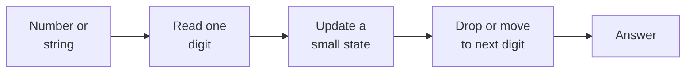
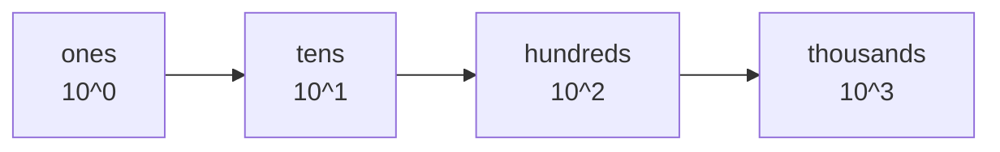
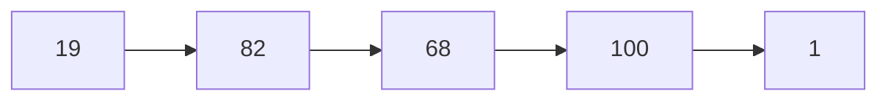
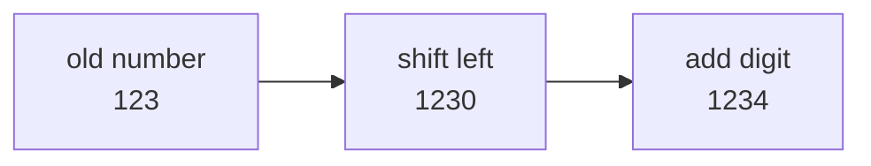
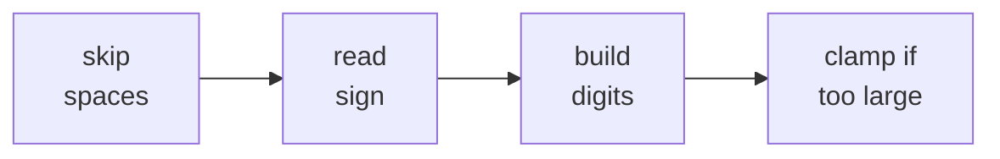
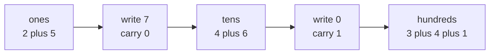
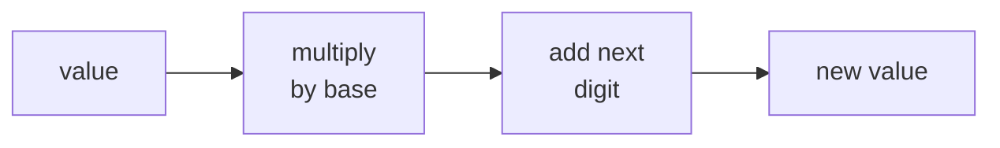
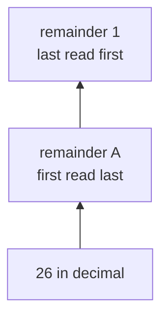

# 02 · Digits and Number Bases

> After this chapter you can take numbers apart digit by digit, build them back
> safely, add with carries, and convert between decimal, binary, hex, and Excel
> column names.

⬅️ [01 · Numbers and Integer Division](../01-numbers-and-integer-division/) · 🏠 [Roadmap](../README.md) · [03 · Powers and Roots](../03-powers-and-roots/) ➡️

## Contents

1. [Why this matters for DSA](#1-why-this-matters-for-dsa)
2. [Place value](#2-place-value)
3. [Taking digits apart](#3-taking-digits-apart)
4. [Digit tools](#4-digit-tools)
5. [Building numbers](#5-building-numbers)
6. [Addition carry and multiplication](#6-addition-carry-and-multiplication)
7. [Number bases](#7-number-bases)
8. [Excel columns](#8-excel-columns)
9. [Java code](#9-java-code)
10. [Common mistakes](#10-common-mistakes)
11. [Interview patterns](#11-interview-patterns)
12. [Exercises](#12-exercises)
13. [One-minute recap](#13-one-minute-recap)

---

## 1. Why this matters for DSA

Digits are the Lego bricks of numbers. Many interview problems ask you to pull
off one brick, inspect it, and put bricks back in a new order.

You use this chapter in:

- Palindrome Number, where the left and right digits must match;
- Add Strings and Add Binary, where you add from right to left with a carry;
- String to Integer, where `result = result * 10 + digit`;
- Happy Number, where every step replaces a number by digit squares;
- Excel Sheet Column Title, where the base is 26 but has no zero digit;
- Convert to Hexadecimal, where negative numbers show two's complement bits.



🧠 **How to think of it yourself:** if the problem talks about digits, strings
of digits, carries, bases, columns, or "without converting to integer", expect
to walk from right to left or left to right one digit at a time.

---

## 2. Place value

An odometer teaches place value. The right wheel counts ones. When it rolls
past 9, it returns to 0 and pushes the tens wheel by 1.

```text
hundreds   tens   units
   5        0       7

507 = 5 × 100 + 0 × 10 + 7 × 1
    = 5 × 10^2 + 0 × 10^1 + 7 × 10^0
```

The same idea as an abacus:

```text
10^2 column     10^1 column     10^0 column
hundreds        tens            ones
    ●●●●●           empty           ●●●●●●●
      5              0                 7
```

Why does it work? Because each step left is worth 10 times more than the step
before it.



Worked example:

```text
3842
= 3 × 1000 + 8 × 100 + 4 × 10 + 2
= 3000 + 800 + 40 + 2
= 3842
```

Java usually does not need powers for digit problems. It uses `/ 10` and
`% 10`, which are the next section.

---

## 3. Taking digits apart

Think of `n % 10` as opening the last drawer. Think of `n / 10` as removing
that drawer.

```text
n = 5070

n % 10 gives the last digit
n / 10 drops the last digit
```

Trace:

```text
step   n      n % 10   n / 10
1      5070      0       507
2       507      7        50
3        50      0         5
4         5      5         0
stop      0
```

Why does this work? In base 10, every number is `somePrefix * 10 + lastDigit`.
The remainder after dividing by 10 is the last digit.

```text
507 = 50 * 10 + 7
507 % 10 = 7
507 / 10 = 50
```

Java loop:

```java
while (n > 0) {
    int digit = n % 10;
    n /= 10;
}
```

Handling `0`: the loop would run zero times, but `0` has one digit, so treat it
as a special case.

Handling negatives: either remember the sign or use `Math.abs(n)`. For the
special `Integer.MIN_VALUE` trap, see
[01 · Numbers and Integer Division](../01-numbers-and-integer-division/).

🧠 **How to think of it yourself:** when you only need the last digit, use
`% 10`. When you are done with that digit, use `/ 10`.

---

## 4. Digit tools

Once you can peel digits, many tools become small loops.

### Count digits

Loop method:

```text
5070 -> 507 -> 50 -> 5 -> 0
four drops, so four digits
```

Java:

```java
static int countDigits(int n) {
    if (n == 0) return 1;
    int count = 0;
    long x = Math.abs((long) n);
    while (x > 0) {
        count++;
        x /= 10;
    }
    return count;
}
```

Formula method for positive `n`:

```text
digits = floor(log10 n) + 1
```

Why? Powers of 10 start new digit lengths:

```text
1 to 9          one digit
10 to 99        two digits
100 to 999      three digits
```

Logs are taught in [04 · Logarithms](../04-logarithms/).

LeetCode 1295 asks how many numbers have an even number of digits. Do the same
count for each number, then ask whether the count is even.

```text
nums = [12, 345, 2, 6, 7896]

number   digit count   even count
12            2             yes
345           3             no
2             1             no
6             1             no
7896          4             yes

answer = 2
```

Why this is a digit problem and not a string problem: the input is already an
integer array, so repeated `/ 10` works without converting every value to text.

### Sum of digits and product of digits

For LeetCode 1281, peel every digit and keep two buckets.

```text
n = 234
sum     = 2 + 3 + 4 = 9
product = 2 × 3 × 4 = 24
answer  = 24 - 9 = 15
```

### Digital root

Digital root means repeat digit sums until one digit remains.

```text
9875 -> 9 + 8 + 7 + 5 = 29
29   -> 2 + 9 = 11
11   -> 1 + 1 = 2
```

Shortcut for `n > 0`:

```text
digitalRoot(n) = 1 + (n - 1) % 9
```

Why? In decimal, 10 leaves remainder 1 when divided by 9. So 10, 100, 1000,
and all powers of 10 behave like 1 for remainder by 9.

```text
384 = 3 × 100 + 8 × 10 + 4
remainder by 9 behaves like 3 × 1 + 8 × 1 + 4
= digit sum
```

The `n - 1` trick makes multiples of 9 return 9 instead of 0.

### Reverse a number

Take the last digit and attach it to the answer's right side.

```text
n      digit    result
123      3        3
12       2        32
1        1        321
0        stop
```

The update is:

```java
result = result * 10 + digit;
```

For overflow checks, link back to
[01 · Numbers and Integer Division](../01-numbers-and-integer-division/).

### Palindrome number

A palindrome reads the same forward and backward: 1221, 7, 12321.
LeetCode 9 can reverse only half, so overflow is avoided.

```text
n = 1221

front part n       reversed half
1221               0
122                1
12                 12

stop because n <= reversedHalf
12 == 12, so palindrome
```

For odd length:

```text
12321
n becomes 12
reversedHalf becomes 123
drop middle digit: 123 / 10 = 12
```

### Happy number

Replace the number by the sum of squares of digits.

```text
19 -> 1^2 + 9^2 = 82
82 -> 8^2 + 2^2 = 68
68 -> 6^2 + 8^2 = 100
100 -> 1^2 + 0^2 + 0^2 = 1
```

If it reaches 1, it is happy. If it enters a cycle, it is not. Use a set, or
Floyd's slow and fast pointers.



🧠 **How to think of it yourself:** if a process maps one number to one next
number, it is a linked list in disguise. It either reaches an end or cycles.

For an unhappy number, a cycle appears:

```text
2 -> 4 -> 16 -> 37 -> 58 -> 89 -> 145 -> 42 -> 20 -> 4
                                             cycle returns here
```

Why a cycle must happen: after one or two steps, the value becomes small. For a
32-bit integer, the biggest digit-square sum is at most `10 * 9^2 = 810`.
After that, there are only a few hundred possible states. If you never reach 1,
some state must repeat, like walking in a small garden until you step on an old
footprint.

---

## 5. Building numbers

Taking apart goes right to left. Building often goes left to right.

```text
digits: 1, 2, 3, 4

start result = 0
read 1: result = 0 * 10 + 1 = 1
read 2: result = 1 * 10 + 2 = 12
read 3: result = 12 * 10 + 3 = 123
read 4: result = 123 * 10 + 4 = 1234
```

Why multiply by 10 first? Because every old digit must move one place left to
make room for the new digit.



This is the heart of String to Integer (atoi), LeetCode 8. Before updating, check:

```java
if (result > (Integer.MAX_VALUE - digit) / 10) {
    throw new ArithmeticException("overflow");
}
result = result * 10 + digit;
```

### String to Integer details

LeetCode 8 looks scary because of words, signs, and spaces, but the digit math
is still the same.

```text
input: "   -42abc"

skip spaces       -> "-42abc"
read sign         -> negative
read digits       -> 4 then 2
stop at letter a
answer            -> -42
```

The parsing machine has four small jobs:



Why clamp? The problem asks you to return `Integer.MAX_VALUE` or
`Integer.MIN_VALUE` when the true value is outside the 32-bit range. The same
pre-check from chapter 01 tells you before `result * 10 + digit` becomes unsafe.

🧠 **How to think of it yourself:** appending a digit means "make a zero space,
then place the digit".

---

## 6. Addition carry and multiplication

School addition works from right to left because the carry moves left.

```text
    4 5 6
+     7 7
-----------
    5 3 3

ones: 6 + 7 = 13, write 3, carry 1
tens: 5 + 7 + 1 = 13, write 3, carry 1
hundreds: 4 + 0 + 1 = 5
```

Trace table:

```text
position   a   b   carry in   sum   write   carry out
ones       6   7      0        13      3        1
tens       5   7      1        13      3        1
hundreds   4   0      1         5      5        0
```

Java idea for Add Strings:

```java
while (i >= 0 || j >= 0 || carry > 0) {
    int sum = digitA + digitB + carry;
    answer.append(sum % 10);
    carry = sum / 10;
}
```

For Add Binary, the base is 2, so write `sum % 2` and carry `sum / 2`.

For Plus One, start at the last digit:

```text
[1, 2, 9] -> [1, 3, 0]
[9, 9, 9] -> [1, 0, 0, 0]
```

Add Two Numbers stores digits in linked lists from least significant to most
significant, so it is the same carry loop without reversing.

```text
342 is stored as 2 -> 4 -> 3
465 is stored as 5 -> 6 -> 4

ones node:      2 + 5 = 7          write 7, carry 0
tens node:      4 + 6 = 10         write 0, carry 1
hundreds node:  3 + 4 + 1 = 8      write 8, carry 0

answer list: 7 -> 0 -> 8, which means 807
```

Picture the carry as a small paper note passed to the next column:



Multiply Strings uses slots. Every digit pair contributes to a place:

```text
      1 2 3
×       4 5
------------
        1 5      3 × 5
      1 0        2 × 5
    0 5          1 × 5
      1 2        3 × 4 shifted
    0 8          2 × 4 shifted
  0 4            1 × 4 shifted
------------
      5 5 3 5
```

Slot idea for `"123" * "45"`:

```text
indexes in result slots:

slot:    0   1   2   3   4
        [0,  0,  0,  0,  0]

digit i from first number and digit j from second number
contribute to slots i + j and i + j + 1
```

Why two slots? A one-digit times one-digit product can be two digits:

```text
9 × 9 = 81
8 is carry to the left slot
1 stays in the right slot
```

🧠 **How to think of it yourself:** carries are leftovers that move one column
left. Change the base, and only `% base` and `/ base` change.

---

## 7. Number bases

Base means "how many symbols before a carry?"

| Base | Name | Digits | Carry after |
|---|---|---|---|
| 2 | binary | 0, 1 | 1 |
| 8 | octal | 0 to 7 | 7 |
| 10 | decimal | 0 to 9 | 9 |
| 16 | hex | 0 to 9, A to F | F |

Base 10 has powers of 10. Base `b` has powers of `b`.

```text
"1011" in base 2
= 1 × 2^3 + 0 × 2^2 + 1 × 2^1 + 1 × 2^0
= 8 + 0 + 2 + 1
= 11
```

### Base to decimal with Horner

Instead of writing powers, scan left to right:

```text
"1A" in base 16

value = 0
read 1: value = 0 × 16 + 1  = 1
read A: value = 1 × 16 + 10 = 26
```

Why it works: multiplying by the base shifts all old digits one place left.



### Decimal to base by repeated division

Divide by the base and write down remainders. Read remainders from last to
first.

```text
convert 26 to base 16

26 / 16 = 1 remainder 10  -> A
 1 / 16 = 0 remainder 1

read bottom to top: 1A
```



Java helpers:

```java
Integer.toBinaryString(13)     // "1101"
Integer.toString(31, 16)       // "1f"
Integer.parseInt("1111", 2)    // 15
Long.toString(255L, 16)        // "ff"
Long.parseLong("ff", 16)       // 255
```

Bitwise operators come later in [12 · Bits and Binary](../12-bits-and-binary/).

LeetCode 504 asks for base 7. LeetCode 405 asks for hexadecimal. Negative hex
uses two's complement, which chapter 12 explains.

### Base 7 and hexadecimal problems

Base 7 is normal repeated division with base 7:

```text
100 to base 7

100 / 7 = 14 remainder 2
 14 / 7 =  2 remainder 0
  2 / 7 =  0 remainder 2

read upward: 202
```

For -100, keep the sign and convert 100, so the answer is `-202`.

Hexadecimal groups binary bits in fours:

```text
binary 1111 = hex F
binary 1010 = hex A
binary 0001 = hex 1
```

That is why hex is popular for bits. A 32-bit `int` has 8 hex digits because
`8 × 4 = 32`. For `-1`, all 32 bits are 1, so Java's hex string is:

```text
1111 1111 1111 1111 1111 1111 1111 1111
   f    f    f    f    f    f    f    f
```

You do not need to master negative binary yet. Just remember the bridge:
negative hex is really a bits topic, and [12 · Bits and Binary](../12-bits-and-binary/)
will explain two's complement from the start.

---

## 8. Excel columns

Excel columns look like base 26, but there is no zero digit.

```text
A = 1
B = 2
...
Z = 26
AA = 27
AB = 28
```

Title to number, LeetCode 171:

```text
"AB"
value = 0
read A: value = 0 × 26 + 1 = 1
read B: value = 1 × 26 + 2 = 28
```

Number to title, LeetCode 168, needs the `n - 1` trick.

Why? Normal base has digits 0 to 25. Excel has digits 1 to 26. Subtracting 1
temporarily moves Excel's digits into normal zero-based positions.

```text
n = 28

n-- gives 27, 27 % 26 = 1 -> B
n = 27 / 26 = 1
n-- gives 0, 0 % 26 = 0 -> A
n = 0

reverse: AB
```

🧠 **How to think of it yourself:** when a base has no zero digit, subtract 1
before taking the remainder.

---

## 9. Java code

Code: [`DigitsAndBases.java`](DigitsAndBases.java)

Key methods in the file:

```java
static int digitalRoot(int n) {
    if (n == 0) return 0;
    return 1 + (n - 1) % 9;
}

static long baseToDecimal(String text, int base) {
    long value = 0;
    for (int i = 0; i < text.length(); i++) {
        int digit = Character.digit(text.charAt(i), base);
        value = value * base + digit;
    }
    return value;
}
```

Run it:

```text
cd maths_for_dsa/02-digits-and-number-bases
java DigitsAndBases.java
```

Real output:

```text
Digits and number bases demos
digitsOf(5070) = 0, 7, 0, 5
countDigits(5070) = 4
countDigitsByLog(5070) = 4
sumDigits(-5070) = 12
subtractProductAndSum(234) = 15
digitalRoot(9875) = 2
reverseNumber(12340) = 4321
isPalindrome(1221) = true
isHappy(19) = true
buildChecked([1,2,3,4]) = 1234
plusOne([9,9,9]) = [1, 0, 0, 0]
addStrings("456", "77") = 533
addBinary("1011", "111") = 10010
multiplyStrings("123", "45") = 5535
baseToDecimal("1A", 16) = 26
decimalToBase(255, 16) = FF
Integer.toBinaryString(13) = 1101
Integer.toString(31, 16) = 1f
Integer.parseInt("1111", 2) = 15
titleToNumber("AB") = 28
numberToTitle(28) = AB
toBase7(-100) = -202
toHex(-1) = ffffffff
hasEvenDigitCount(1000) = true
```

---

## 10. Common mistakes

| Mistake | Why it hurts | Safer habit |
|---|---|---|
| forgetting `0` has one digit | loop count becomes 0 | special-case `n == 0` |
| using `Math.abs` blindly | `Integer.MIN_VALUE` stays negative | use `long` or check first |
| reversing whole palindrome | may overflow | reverse only half |
| building without overflow check | `result * 10` may wrap | check before appending |
| reading remainders top to bottom | base conversion becomes backward | read last remainder first |
| treating Excel as normal base 26 | off by one at Z and AA | subtract 1 before `% 26` |
| using decimal carry for binary | wrong carry rules | use `% 2` and `/ 2` |

---

## 11. Interview patterns

| Pattern | How to recognise it | LeetCode problems |
|---|---|---|
| Peel digits | asks for digit sum, product, count, reverse | 7 · Reverse Integer, 1281 · Subtract the Product and Sum of Digits of an Integer, 1295 · Find Numbers with Even Number of Digits |
| Palindrome by half reverse | number must read same both ways | 9 · Palindrome Number |
| Repeated digit transform | number maps to another number | 202 · Happy Number |
| Build from characters | parse or convert string to number | 8 · String to Integer (atoi) |
| Carry from right to left | add arrays, strings, binary, lists | 66 · Plus One, 67 · Add Binary, 415 · Add Strings, 2 · Add Two Numbers |
| Grade school multiplication | multiply numeric strings | 43 · Multiply Strings |
| Base conversion | decimal to base or base to decimal | 504 · Base 7, 405 · Convert a Number to Hexadecimal |
| No zero digit base | alphabet columns or 1-indexed digits | 168 · Excel Sheet Column Title, 171 · Excel Sheet Column Number |

---

## 12. Exercises

### Level 1 · Warm-up

**1.** Write 507 as a sum of digit times powers of 10.

<details>
<summary>Answer</summary>

**The answer** — `5 × 10^2 + 0 × 10^1 + 7 × 10^0`.

</details>

**2.** What is `507 % 10`?

<details>
<summary>Answer</summary>

**The answer** — 7, the last digit.

</details>

**3.** What is `507 / 10` with integer division?

<details>
<summary>Answer</summary>

**The answer** — 50, because the last digit is dropped.

</details>

**4.** How many digits does 0 have?

<details>
<summary>Answer</summary>

**The answer** — 1. The digit is `0`.

</details>

**5.** Sum the digits of 5070.

<details>
<summary>Answer</summary>

**The answer** — 12, because `5 + 0 + 7 + 0 = 12`.

</details>

**6.** Find the digital root of 9875.

<details>
<summary>Answer</summary>

**The answer** — 2. Digit sums go `9875 -> 29 -> 11 -> 2`.

</details>

**7.** Reverse 12340 as an integer.

<details>
<summary>Answer</summary>

**The answer** — 4321. The leading zero disappears.

</details>

**8.** Is 1221 a palindrome number?

<details>
<summary>Answer</summary>

**The answer** — yes. It reads the same left to right and right to left.

</details>

### Level 2 · Practice

**9.** Compute product minus sum of digits for 234.

<details>
<summary>Answer</summary>

**The answer** — 15. Product is `2 × 3 × 4 = 24`; sum is 9; `24 - 9 = 15`.

</details>

**10.** Does 1000 have an even number of digits?

<details>
<summary>Answer</summary>

**The answer** — yes. It has 4 digits, and 4 is even.

</details>

**11.** Build the number from digits `[1, 2, 3, 4]`.

<details>
<summary>Answer</summary>

**The answer** — 1234. The updates are 1, 12, 123, 1234.

</details>

**12.** Add one to `[9, 9, 9]`.

<details>
<summary>Answer</summary>

**The answer** — `[1, 0, 0, 0]`. Every 9 becomes 0 and a new leading 1 is added.

</details>

**13.** Add strings `"456"` and `"77"`.

<details>
<summary>Answer</summary>

**The answer** — `"533"`. The column sums are 13, 13, then 5.

</details>

**14.** Add binary strings `"1011"` and `"111"`.

<details>
<summary>Answer</summary>

**The answer** — `"10010"`. Decimal check: 11 + 7 = 18, and 18 is 10010 in binary.

</details>

**15.** Multiply strings `"123"` and `"45"`.

<details>
<summary>Answer</summary>

**The answer** — `"5535"`, because 123 × 45 = 5535.

</details>

**16.** Convert `"1A"` from base 16 to decimal.

<details>
<summary>Answer</summary>

**The answer** — 26. Compute `1 × 16 + 10 = 26`.

</details>

### Level 3 · Interview

**17.** Convert decimal 255 to hexadecimal.

<details>
<summary>Answer</summary>

**The answer** — `FF`. 255 / 16 gives remainder 15 and then remainder 15.

</details>

**18.** Convert decimal -100 to base 7 with a sign.

<details>
<summary>Answer</summary>

**The answer** — `-202`. Since 100 = 2 × 49 + 0 × 7 + 2.

</details>

**19.** What does Java's `Integer.toBinaryString(13)` return?

<details>
<summary>Answer</summary>

**The answer** — `1101`, because 13 = 8 + 4 + 1.

</details>

**20.** Convert Excel title `"AB"` to a number.

<details>
<summary>Answer</summary>

**The answer** — 28. `A` is 1, so `1 × 26 + 2 = 28`.

</details>

**21.** Convert Excel number 28 to a title.

<details>
<summary>Answer</summary>

**The answer** — `AB`. Use the `n - 1` trick before each remainder.

</details>

**22.** Is 19 a happy number?

<details>
<summary>Answer</summary>

**The answer** — yes. It reaches `19 -> 82 -> 68 -> 100 -> 1`.

</details>

**23.** What is the hexadecimal form of -1 in Java's 32-bit two's complement?

<details>
<summary>Answer</summary>

**The answer** — `ffffffff`. All 32 bits are 1.

</details>

**24.** For `n = 38`, use the digital root shortcut.

<details>
<summary>Answer</summary>

**The answer** — 2. `1 + (38 - 1) % 9 = 1 + 37 % 9 = 1 + 1 = 2`.

</details>

---

## 13. One-minute recap

- Place value means each step left is worth 10 times more in decimal.
- `n % 10` gives the last digit, and `n / 10` drops it.
- Special-case 0, and be careful with negative numbers.
- To append a digit, use `result = result * 10 + digit`.
- Digital root for `n > 0` is `1 + (n - 1) % 9`.
- Addition with strings or arrays is the school carry algorithm.
- In base `b`, scan with `value = value * b + digit`.
- To convert decimal to base `b`, divide repeatedly and read remainders upward.
- Excel columns are base 26 with no zero digit, so number to title uses `n - 1`.
- Bit tricks and two's complement are continued in
  [12 · Bits and Binary](../12-bits-and-binary/).
