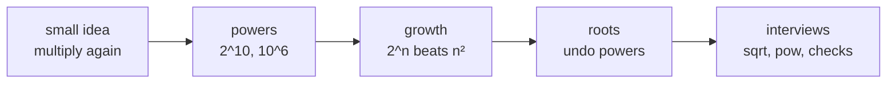
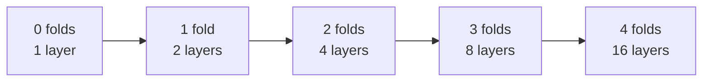
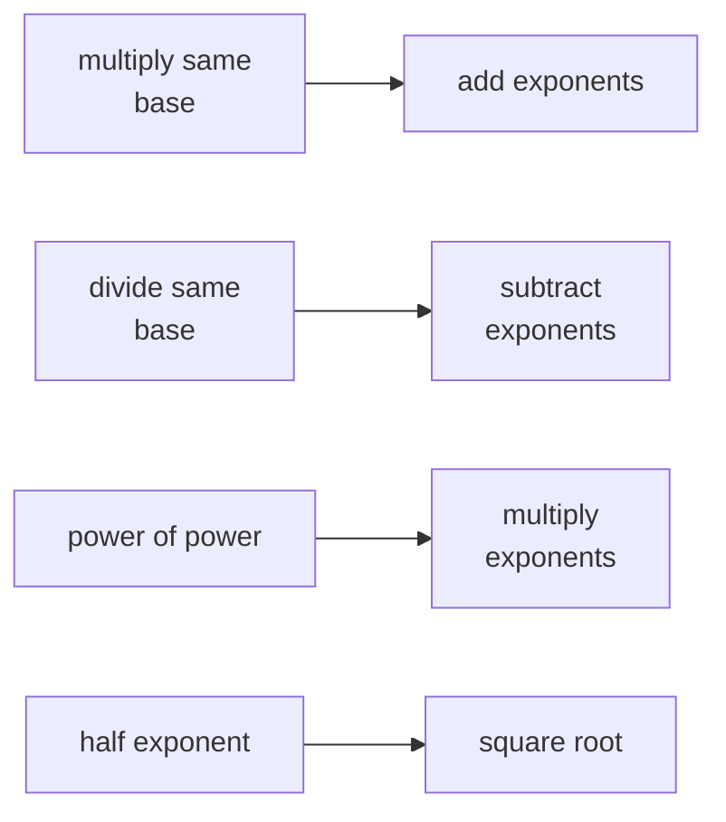
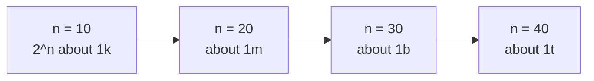
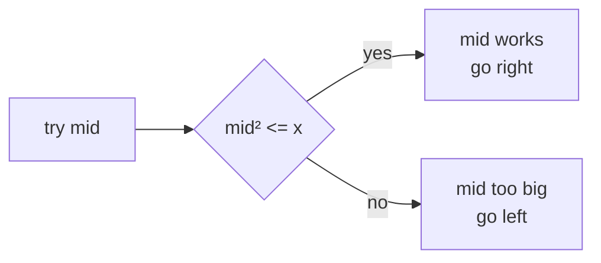
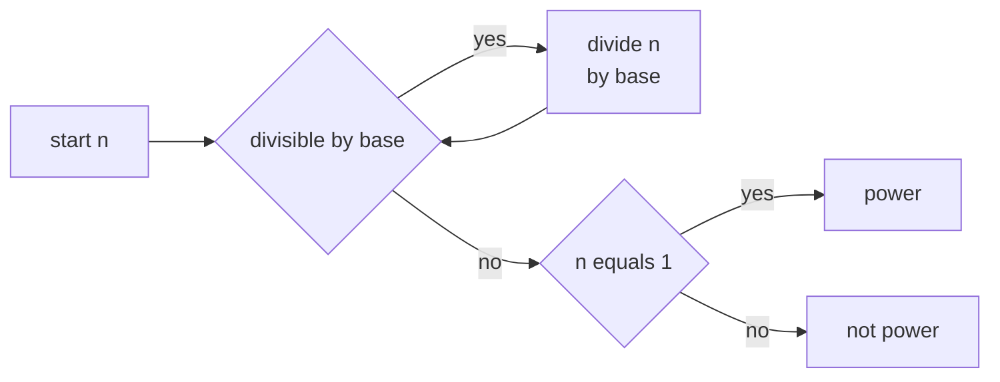
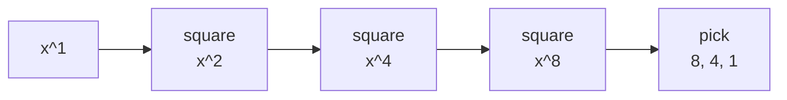

# 03 · Powers and Roots

> After this chapter you can understand fast growth, square roots, integer roots, and the power
> checks that appear again and again in DSA interviews.

⬅️ [02 · Digits and Number Bases](../02-digits-and-number-bases/) · 🏠 [Roadmap](../README.md) · [04 · Logarithms](../04-logarithms/) ➡️

## Contents

1. [Why this matters for DSA](#1-why-this-matters-for-dsa)
2. [Exponent means repeated multiplication](#2-exponent-means-repeated-multiplication)
3. [Powers of two and ten](#3-powers-of-two-and-ten)
4. [Exponent rules](#4-exponent-rules)
5. [Growth that explodes](#5-growth-that-explodes)
6. [Squares and roots](#6-squares-and-roots)
7. [Integer square root by binary search](#7-integer-square-root-by-binary-search)
8. [Perfect squares and precise roots](#8-perfect-squares-and-precise-roots)
9. [Checking powers](#9-checking-powers)
10. [Fast power by squaring](#10-fast-power-by-squaring)
11. [Java code](#11-java-code)
12. [Common mistakes](#12-common-mistakes)
13. [Interview patterns](#13-interview-patterns)
14. [Exercises](#14-exercises)
15. [One-minute recap](#15-one-minute-recap)

---

## 1. Why this matters for DSA

Powers and roots are the maths words behind many interview phrases:

- "This brute force tries every subset" usually means **2^n** choices.
- "This number is too big for `int`" often means it crossed **2^31 − 1**.
- "Only check divisors up to √n" is the key idea of the
  [Divisors and the Square Root Trick](../08-divisors-and-sqrt-trick/).
- "Use binary search for `sqrt(x)`" is LeetCode 69.
- "Use fast exponentiation" is LeetCode 50 and later
  [Modular Arithmetic](../11-modular-arithmetic/).

Think of this chapter as a set of measuring tools. Powers measure **doubling** and roots undo
powers, just like subtraction undoes addition.



Plain picture:

```text
repeated adding      repeated multiplying        undo squaring
3 + 3 + 3 + 3   ->   3 x 3 x 3 x 3 = 3^4   ->   sqrt(81) = 9
```

🧠 **How to think of it yourself:** whenever something keeps **doubling**, **squaring**,
or **splitting in half**, stop and ask: "Is this a power, a root, or later a log?"

---

## 2. Exponent means repeated multiplication

An exponent is a small note that says: **multiply by the same number again and again**.

`2^5` means:

```text
2^5 = 2 x 2 x 2 x 2 x 2 = 32
      five copies of 2
```

The bottom number, **2**, is the **base**. The top number, **5**, is the **exponent**.

### The folding paper story

Fold paper once, and it has 2 layers. Fold again, and every old layer splits into two
new layers.

```text
folds:     0     1     2     3     4
layers:    1     2     4     8    16
           |     |     |     |     |
          2^0   2^1   2^2   2^3   2^4
```



### The rice on a chessboard story

Put 1 grain of rice on the first square. Double it on every next square.
The first few squares look tiny, then suddenly the numbers become huge.

```text
square:  1   2   3   4    5     6      7       8
rice:    1   2   4   8   16    32     64     128
power: 2^0 2^1 2^2 2^3 2^4   2^5    2^6    2^7
```

### The bacteria doubling story

One bacterium becomes two. Two become four. Four become eight.

```text
minute:        0       1       2       3       4       5
bacteria:      1       2       4       8      16      32
```

This is why exponential growth feels sneaky. At first it looks sleepy. Then it jumps.

### Worked example by hand

Compute `3^4`.

```text
3^4 = 3 x 3 x 3 x 3
    = 9 x 3 x 3
    = 27 x 3
    = 81
```

Java:

```java
long answer = 1;
for (int i = 0; i < 4; i++) {
    answer *= 3;
}
System.out.println(answer); // 81
```

---

## 3. Powers of two and ten

Computers love powers of two because bits have two choices: 0 or 1.

| Power | Value | Memory hook |
|---:|---:|---|
| 2^0 | 1 | one empty choice |
| 2^1 | 2 | one bit |
| 2^2 | 4 | two bits |
| 2^3 | 8 | small byte pieces |
| 2^4 | 16 | hex digit choices |
| 2^5 | 32 | |
| 2^6 | 64 | |
| 2^7 | 128 | |
| 2^8 | 256 | byte values |
| 2^9 | 512 | |
| 2^10 | 1,024 | about one thousand |
| 2^11 | 2,048 | |
| 2^12 | 4,096 | |
| 2^13 | 8,192 | |
| 2^14 | 16,384 | |
| 2^15 | 32,768 | |
| 2^16 | 65,536 | char-sized count |
| 2^17 | 131,072 | |
| 2^18 | 262,144 | |
| 2^19 | 524,288 | |
| 2^20 | 1,048,576 | about one million |
| 2^30 | 1,073,741,824 | about one billion |
| 2^31 | 2,147,483,648 | just past `int` max |
| 2^32 | 4,294,967,296 | unsigned int size |
| 2^60 | 1,152,921,504,606,846,976 | about 10^18 |
| 2^63 | 9,223,372,036,854,775,808 | just past `long` max |

Powers of 10 are the place values from [Digits and Number Bases](../02-digits-and-number-bases/):

```text
10^0 = 1
10^1 = 10
10^2 = 100
10^3 = 1,000
10^6 = 1,000,000
10^9 = 1,000,000,000
10^18 = 1,000,000,000,000,000,000
```

The most useful estimate:

```text
2^10 = 1024 ≈ 1000 = 10^3

So:
2^20 = (2^10)^2  ≈ (10^3)^2 = 10^6
2^30 = (2^10)^3  ≈ (10^3)^3 = 10^9
2^60 = (2^10)^6  ≈ (10^3)^6 = 10^18
```

This estimate helps you read constraints quickly:

```text
2^30 choices  -> about 1 billion choices       usually too slow
2^20 choices  -> about 1 million choices       maybe okay
2^63          -> long boundary                 overflow danger
```

🧠 **How to think of it yourself:** learn `2^10 ≈ 10^3`. Then jump by tens:
`2^40 ≈ 10^12`, `2^50 ≈ 10^15`, `2^60 ≈ 10^18`.

---

## 4. Exponent rules

Exponent rules are not magic. They are just **counting copies of the same factor**.

### Multiplying same bases

Rule:

```text
a^m x a^n = a^(m+n)
```

Why:

```text
a^3 x a^2 = (a x a x a) x (a x a)
          = a x a x a x a x a
          = a^5
```

Picture:

```text
left pile has 3 a's     right pile has 2 a's
[a][a][a]        x      [a][a]

put piles together:
[a][a][a][a][a]  = a^5
```

### Dividing same bases

Rule:

```text
a^m / a^n = a^(m-n)       when a is not 0
```

Why:

```text
a^5 / a^2 = (a x a x a x a x a) / (a x a)
          = a x a x a
          = a^3
```

Two bottom factors cancel with two top factors.

### Power of a power

Rule:

```text
(a^m)^n = a^(m x n)
```

Why:

```text
(a^2)^3 = (a x a) x (a x a) x (a x a)
        = a^6
```

You made `n` groups, and each group has `m` copies.

### Power of a product

Rule:

```text
(ab)^n = a^n x b^n
```

Why:

```text
(ab)^3 = (ab)(ab)(ab)
       = a x b x a x b x a x b
       = a x a x a x b x b x b
       = a^3 x b^3
```

### Why a to the zero is one

Look at the halving pattern for powers of 2:

```text
2^5 = 32
2^4 = 16
2^3 =  8
2^2 =  4
2^1 =  2
2^0 =  1
```

Every step down divides by 2, so after `2^1 = 2`, the next one must be `1`.
Also, the rule `a^m / a^m = a^(m-m) = a^0` says the left side is `1`.
So `a^0 = 1` for any non-zero `a`.

### Why negative powers are fractions

Keep the same divide-by-2 pattern:

```text
2^2  = 4
2^1  = 2
2^0  = 1
2^-1 = 1/2
2^-2 = 1/4
2^-3 = 1/8
```

Rule:

```text
a^(-n) = 1 / a^n       when a is not 0
```

### Why one half power is square root

We want exponent rules to stay true:

```text
(a^(1/2))^2 = a^((1/2) x 2) = a^1 = a
```

So `a^(1/2)` is the number that becomes `a` when squared. That is `√a`.

```text
9^(1/2) = 3, because 3^2 = 9
```



Java snippets:

```java
System.out.println(Math.pow(2, 5));   // 32.0, a double
System.out.println(Math.sqrt(49));    // 7.0, a double
```

For exact integer powers, prefer an integer loop when the answer fits in `long`.
`Math.pow` returns a `double`, and `double` can round large integers.

---

## 5. Growth that explodes

Polynomial growth like `n²` is fast. Exponential growth like `2^n` is much faster.

| n | n² | 2^n |
|---:|---:|---:|
| 1 | 1 | 2 |
| 5 | 25 | 32 |
| 10 | 100 | 1,024 |
| 20 | 400 | 1,048,576 |
| 30 | 900 | 1,073,741,824 |
| 40 | 1,600 | 1,099,511,627,776 |
| 50 | 2,500 | 1,125,899,906,842,624 |

Picture:

```text
n grows:        10          20             30              40
n^2:            100         400            900             1600
2^n:            1024        1 million      1 billion       1 trillion
```



Why `2^n` algorithms die around `n = 30` to `40`:

- `2^30` is about 1 billion steps. That can already be seconds or more.
- `2^40` is about 1 trillion steps. That is usually hopeless.
- Every extra `+1` in `n` doubles the work.

This shows up when you try all subsets, all choose-or-skip decisions, or all binary strings.
You will meet this again in [Bits and Binary](../12-bits-and-binary/) and
[Counting and Combinatorics](../13-counting-and-combinatorics/).

🧠 **How to think of it yourself:** if each item has two independent choices, whisper
"choose or skip" and write `2^n`.

---

## 6. Squares and roots

A **square number** is made by multiplying a number by itself.

```text
1^2 = 1
2^2 = 4
3^2 = 9
4^2 = 16
5^2 = 25
6^2 = 36
7^2 = 49
8^2 = 64
9^2 = 81
10^2 = 100
```

Why do we call them squares? Because `5² = 25` dots can make a 5 by 5 square.

```text
5 x 5 square

* * * * *
* * * * *
* * * * *
* * * * *
* * * * *
```

The square root asks the reverse question:

```text
If the area is 25, what side length made the square?

side x side = area
5    x 5    = 25
sqrt(25) = 5
```

`√50` is not a whole number, but it is between 7 and 8:

```text
7^2 = 49
8^2 = 64

49 < 50 < 64
so
7 < sqrt(50) < 8
```

The **integer square root** means the floor:

```text
floor(sqrt(50)) = 7
floor(sqrt(64)) = 8
```

Cube roots are the same idea in 3D:

```text
3^3 = 3 x 3 x 3 = 27
cube root of 27 = 3
```

🧠 **How to think of it yourself:** roots ask, "What equal side length made this?"
Square root is a square side. Cube root is a cube edge.

---

## 7. Integer square root by binary search

LeetCode 69 asks for `floor(√x)`. We can binary search the answer.

For `x = 50`, possible integer roots are `0..50`, but the answer is small.
Try a middle number. If `mid² <= x`, `mid` is possible. If `mid² > x`, it is too big.



Plain dry run for `x = 50`:

```text
low  high  mid  check       action
0    50    25   25^2 > 50   too big, high = 24
0    24    12   12^2 > 50   too big, high = 11
0    11     5    5^2 <= 50  works, answer = 5, low = 6
6    11     8    8^2 > 50   too big, high = 7
6     7     6    6^2 <= 50  works, answer = 6, low = 7
7     7     7    7^2 <= 50  works, answer = 7, low = 8
stop, answer = 7
```

Overflow-safe check:

```java
if (mid <= n / mid) {
    answer = mid;
}
```

This avoids `mid * mid` overflowing an `int`. Another safe choice is:

```java
long square = (long) mid * mid;
```

Key method:

```java
public static int integerSqrt(int n) {
    int low = 0;
    int high = n;
    int answer = 0;

    while (low <= high) {
        int mid = low + (high - low) / 2;
        if (mid == 0 || mid <= n / mid) {
            answer = mid;
            low = mid + 1;
        } else {
            high = mid - 1;
        }
    }
    return answer;
}
```

This is `O(log n)` because every check cuts the search space in half. Chapter
[04 · Logarithms](../04-logarithms/) explains why "halving until one" becomes log.

---

## 8. Perfect squares and precise roots

LeetCode 367 asks: is `n` a perfect square?

Use integer square root:

```text
root = floor(sqrt(n))
n is a perfect square if root x root == n
```

Examples:

```text
n = 49
root = 7
7 x 7 = 49, true

n = 50
root = 7
7 x 7 = 49, false
```

For very large `long` values, `Math.sqrt` returns a `double`. A `double` is fast, but it
can round near huge numbers. A safe pattern is:

```java
if (n == 0) {
    return 0;
}
long root = (long) Math.sqrt(n);
while ((root + 1) <= n / (root + 1)) {
    root++;
}
while (root > n / root) {
    root--;
}
```

The two tiny loops adjust by `+1` or `-1` if the floating-point guess was a little off.

Newton's method is another way to find roots. It starts with a guess, then improves it:

```text
new guess = (old guess + n / old guess) / 2
```

For `n = 50`:

```text
guess 50        too high
guess 25.5      still high
guess 13.73     still high
guess 8.69      closer
guess 7.22      closer
guess 7.07      very close
```

Newton's method is beautiful, but for LeetCode 69 the binary search answer is simpler
and avoids precision worries.

---

## 9. Checking powers

LeetCode 231, 326 and 342 ask whether a number is a power of two, three or four.

The beginner-friendly way is repeated division.

```text
64 is a power of 2:
64 -> 32 -> 16 -> 8 -> 4 -> 2 -> 1     true

48 is not a power of 2:
48 -> 24 -> 12 -> 6 -> 3               stuck at 3, false
```



Java:

```java
public static boolean isPowerOfThree(int n) {
    if (n < 1) {
        return false;
    }
    while (n % 3 == 0) {
        n /= 3;
    }
    return n == 1;
}
```

For power of four, divide by 4 each time. Bit tricks come later in
[Bits and Binary](../12-bits-and-binary/). Here we keep the picture simple.

### Largest power of three trick

Inside a signed Java `int`, the largest power of 3 is:

```text
3^19 = 1,162,261,467
3^20 = 3,486,784,401, too big for int
```

Every smaller positive power of 3 divides `3^19`. So:

```java
int largest = 1162261467;
return n > 0 && largest % n == 0;
```

This is a neat interview trick for LeetCode 326. Use it only when you know the type limit.

---

## 10. Fast power by squaring

The slow way to compute `x^n` multiplies `n` times. For `n = 1,000,000,000`, that is too
many multiplications.

Fast power uses squaring:

```text
x^8 = ((x^2)^2)^2
```

So instead of 8 multiplications, we square only 3 times.

For `x^13`:

```text
13 = 8 + 4 + 1
x^13 = x^8 x x^4 x x
```

```text
power table:
x^1
x^2
x^4
x^8

choose x^8, x^4, x^1 because 13 = 8 + 4 + 1
```



LeetCode 50 has two important edges:

1. If `n` is negative, compute `1 / x^(-n)`.
2. If `n == Integer.MIN_VALUE`, `-n` overflows an `int`.

Fix: copy `n` into a `long` before negating.

```java
public static double fastPower(double x, int n) {
    long exponent = n;
    if (exponent < 0) {
        x = 1.0 / x;
        exponent = -exponent;
    }

    double answer = 1.0;
    while (exponent > 0) {
        if (exponent % 2 == 1) {
            answer *= x;
        }
        x *= x;
        exponent /= 2;
    }
    return answer;
}
```

The modular version, where every multiplication is followed by `% mod`, belongs in
[Modular Arithmetic](../11-modular-arithmetic/). LeetCode 372, Super Pow, also belongs there.

### Math dot pow returns a double

`Math.pow(3, 34)` returns a `double`. A `double` cannot represent every large integer exactly.
This claim was verified by running the Java file:

```text
3^34 exact loop = 16677181699666569
(long)Math.pow(3, 34) = 16677181699666568
They match: false
```

So for exact integer powers that fit in `long`, use an integer loop or integer fast power.
Use `Math.pow` when a floating-point answer is okay.

### Sum of Square Numbers

LeetCode 633 asks whether `c = a² + b²`.

Use two pointers:

```text
left = 0
right = floor(sqrt(c))

if left^2 + right^2 is too small, move left up
if it is too big, move right down
```

For `c = 65`:

```text
left  right  sum
0     8      64     too small, left++
1     8      65     found: 1^2 + 8^2
```

LeetCode 279, Perfect Squares, asks for the fewest perfect squares that add to `n`.
That is a dynamic programming problem, so here we only remember that perfect squares are
the building blocks.

---

## 11. Java code

Code file: [`PowersAndRoots.java`](PowersAndRoots.java)

Key methods:

- `exactPower(base, exponent)` — exact integer multiplication loop for non-negative exponents.
- `integerSqrt(n)` — LeetCode 69 with binary search and no overflow.
- `isPerfectSquare(n)` — LeetCode 367 using integer square root.
- `isPowerOfTwo`, `isPowerOfThree`, `isPowerOfFour` — repeated division.
- `isPowerOfThreeByLargestPower(n)` — uses `1162261467`.
- `fastPower(x, n)` — LeetCode 50 with negative `n` and `Integer.MIN_VALUE`.
- `judgeSquareSum(c)` — LeetCode 633 with two pointers.

Run it:

```text
cd maths_for_dsa/03-powers-and-roots
java PowersAndRoots.java
```

Real output:

```text
Powers and roots demos
2^10 = 1024
10^6 = 1000000
2^30 = 1073741824
2^10 is close to 10^3: 1024 vs 1000

Exponent rules
2^3 * 2^4 = 128
(2^3)^4 = 4096
5^0 = 1
2^-3 = 0.125

Integer square root
floor(sqrt(50)) = 7
floor(sqrt(2147395600)) = 46340
49 is a perfect square: true
50 is a perfect square: false
sqrt by Newton, n = 50: 7.0710678118654755

Power checks
64 is power of two: true
45 is power of three: false
81 is power of three: true
81 by largest int power trick: true
256 is power of four: true

Fast power
fastPower(2, 13) = 8192.0
fastPower(2, -3) = 0.125
fastPower(2, Integer.MIN_VALUE) = 0.0

Math.pow precision
3^20 exact loop = 3486784401
(long)Math.pow(3, 20) = 3486784401
They match: true
3^34 exact loop = 16677181699666569
(long)Math.pow(3, 34) = 16677181699666568
They match: false

Sum of Square Numbers
c = 65: true
c = 3: false
```

---

## 12. Common mistakes

| Mistake | Why it hurts | Fix |
|---|---|---|
| Writing `mid * mid <= n` with `int` | `mid * mid` can overflow | use `(long) mid * mid` or `mid <= n / mid` |
| Forgetting `n <= 0` in power checks | 0 and negatives are not powers | return `false` first |
| Negating `Integer.MIN_VALUE` as an `int` | it overflows back to itself | copy to `long` before negating |
| Trusting `Math.pow` for exact integers | it returns `double` and can round | use an integer loop when exactness matters |
| Saying `2^n` is "almost n²" | exponential growth wins very fast | remember `2^30 ≈ 10^9` |
| Using bit tricks too early | they feel like magic before bits | repeated division is clearer here |
| Forgetting `a^0 = 1` | empty product has one way to do nothing | remember the halving pattern |

---

## 13. Interview patterns

| Pattern | How to recognise it | LeetCode problems |
|---|---|---|
| Fast power | asks for `x^n`, maybe `n` is negative | 50 · Pow(x, n) |
| Integer square root | asks for `floor(√x)` without decimals | 69 · Sqrt(x) |
| Perfect square | asks whether a number is exactly `k²` | 367 · Valid Perfect Square |
| Repeated division power check | asks if `n` is a power of a small base | 231 · Power of Two, 326 · Power of Three, 342 · Power of Four |
| Largest power divisibility trick | power of 3 inside `int` | 326 · Power of Three |
| Two squares | asks whether `c = a² + b²` | 633 · Sum of Square Numbers |
| Perfect squares as building blocks | asks minimum count of square numbers | 279 · Perfect Squares |
| Modular fast power | exponent is huge or answer needs `% mod` | 372 · Super Pow, see ../11-modular-arithmetic/ |

---

## 14. Exercises

### Level 1 · Warm-up

**1.** Compute `2^8`.

<details>
<summary>Answer</summary>

**256** — doubling eight times from `2^0 = 1` gives `256`.

</details>

**2.** Compute `3^5`.

<details>
<summary>Answer</summary>

**243** — `3 x 3 x 3 x 3 x 3 = 243`.

</details>

**3.** Fill in the blank: `2^10 ≈ 10^?`.

<details>
<summary>Answer</summary>

**3** — `2^10 = 1024`, which is about `1000 = 10^3`.

</details>

**4.** Compute `2^20` exactly.

<details>
<summary>Answer</summary>

**1,048,576** — it is `2^10 x 2^10 = 1024 x 1024`.

</details>

**5.** Simplify `a^4 x a^7`.

<details>
<summary>Answer</summary>

**a^11** — put the 4 copies and 7 copies together: `4 + 7 = 11`.

</details>

**6.** Simplify `a^9 / a^3`.

<details>
<summary>Answer</summary>

**a^6** — cancel 3 copies from the top and bottom: `9 − 3 = 6`.

</details>

**7.** Simplify `(x^3)^4`.

<details>
<summary>Answer</summary>

**x^12** — 4 groups of 3 copies means `3 x 4 = 12`.

</details>

**8.** What is `5^0`?

<details>
<summary>Answer</summary>

**1** — the halving or dividing pattern reaches 1 at exponent 0.

</details>

**9.** What is `2^-4`?

<details>
<summary>Answer</summary>

**1/16** — `2^-4 = 1 / 2^4 = 1 / 16`.

</details>

**10.** Between which two integers is `√50`?

<details>
<summary>Answer</summary>

**Between 7 and 8** — `7² = 49` and `8² = 64`, and `50` is between them.

</details>

### Level 2 · Practice

**11.** What is `floor(√999)`?

<details>
<summary>Answer</summary>

**31** — `31² = 961` and `32² = 1024`, so `√999` is between 31 and 32.

</details>

**12.** Is `1024` a power of two?

<details>
<summary>Answer</summary>

**Yes** — `1024 = 2^10`.

</details>

**13.** Is `729` a power of three?

<details>
<summary>Answer</summary>

**Yes** — `729 = 3^6`.

</details>

**14.** Is `128` a power of four?

<details>
<summary>Answer</summary>

**No** — powers of four go `1, 4, 16, 64, 256`; `128` is not on the list.

</details>

**15.** For LeetCode 69, why is `mid <= n / mid` safer than `mid * mid <= n`?

<details>
<summary>Answer</summary>

**It avoids overflow** — `mid * mid` may become bigger than `int` can hold, but `n / mid`
stays inside the range.

</details>

**16.** Use fast power pieces to write `x^13`.

<details>
<summary>Answer</summary>

**x^13 = x^8 x x^4 x x** — `13 = 8 + 4 + 1`.

</details>

**17.** How many subset choices are there for `n = 15` items?

<details>
<summary>Answer</summary>

**32,768** — every item has choose-or-skip, so the count is `2^15`.

</details>

**18.** Is `65` a sum of two square numbers?

<details>
<summary>Answer</summary>

**Yes** — `65 = 1² + 8² = 1 + 64`.

</details>

### Level 3 · Interview

**19.** In `myPow(x, n)`, why should you copy `n` into a `long` before negating it?

<details>
<summary>Answer</summary>

**Because `Integer.MIN_VALUE` cannot be negated as an `int`** — `-(-2147483648)` is too
large for `int`, so it overflows. A `long` can hold `2147483648`.

</details>

**20.** A brute-force algorithm tries all binary strings of length 30. About how many choices is that?

<details>
<summary>Answer</summary>

**About 1 billion** — `2^30 = 1,073,741,824`.

</details>

**21.** For LeetCode 326, why does `1162261467 % n == 0` work for positive `int` powers of 3?

<details>
<summary>Answer</summary>

**Because `1162261467 = 3^19` is the largest power of 3 inside `int`**. Every smaller
positive power of 3 divides it exactly.

</details>

**22.** Find `floor(√2147395600)`.

<details>
<summary>Answer</summary>

**46,340** — `46340² = 2,147,395,600`, and `46341²` is too large.

</details>

**23.** Why can `Math.pow(3, 34)` be dangerous for exact integer work?

<details>
<summary>Answer</summary>

**Because it returns a `double` and can round**. In the Java demo, exact `3^34` is
`16677181699666569`, but `(long)Math.pow(3, 34)` becomes `16677181699666568`.

</details>

**24.** LeetCode 633 with `c = 3`: should it return true or false?

<details>
<summary>Answer</summary>

**False** — the only square numbers not bigger than 3 are `0` and `1`, and no pair from
`0²` and `1²` adds to 3.

</details>

---

## 15. One-minute recap

- `a^n` means multiply `n` copies of `a`.
- `2^10 = 1024 ≈ 10^3`, so `2^30 ≈ 10^9` and `2^60 ≈ 10^18`.
- Exponent rules work because you count factors.
- `2^n` grows so fast that `n = 30..40` can already kill brute force.
- `√n` asks for the side of a square with area `n`.
- Integer square root uses binary search and an overflow-safe square check.
- Power checks can be done by repeated division; bit tricks wait until chapter 12.
- Fast power squares the base and uses the binary pieces of the exponent.
- `Math.pow` returns a `double`; use integer code when exact integer answers matter.
