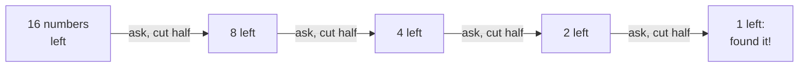
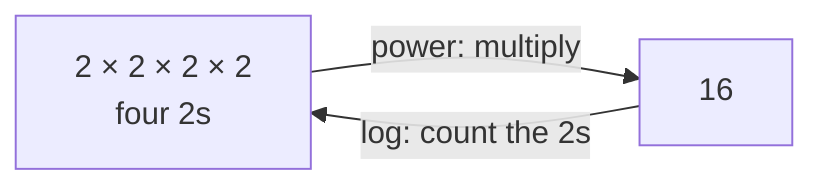
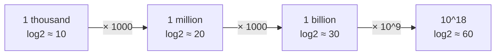
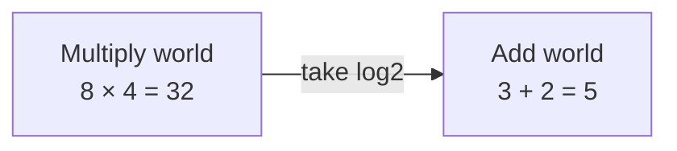
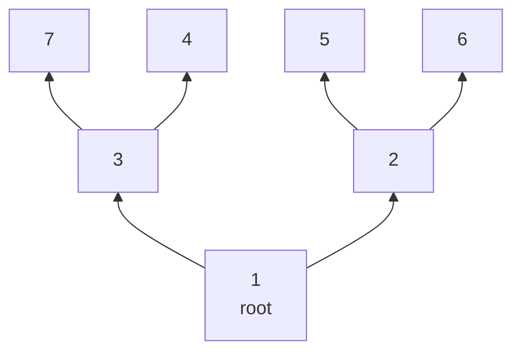

# 04 · Logarithms

> After this chapter you can look at a loop, a search or a tree and say *"that's log n"* — and explain **why**.

⬅️ [03 · Powers and Roots](../03-powers-and-roots/) · 🏠 [Roadmap](../README.md) · [05 · Sums and Series](../05-sums-and-series/) ➡️

## Contents

1. [Why this matters for DSA](#1-why-this-matters-for-dsa)
2. [The big idea: a log counts halvings](#2-the-big-idea-a-log-counts-halvings)
3. [Log is the opposite of power](#3-log-is-the-opposite-of-power)
4. [The log table to know by heart](#4-the-log-table-to-know-by-heart)
5. [Logs of numbers that are not powers](#5-logs-of-numbers-that-are-not-powers)
6. [Digits and bits are logs in disguise](#6-digits-and-bits-are-logs-in-disguise)
7. [The log rules and why they work](#7-the-log-rules-and-why-they-work)
8. [Changing the base, and why Big-O ignores it](#8-changing-the-base-and-why-big-o-ignores-it)
9. [Where log n comes from in code](#9-where-log-n-comes-from-in-code)
10. [How slowly log n grows](#10-how-slowly-log-n-grows)
11. [Logs in Java](#11-logs-in-java)
12. [Java code](#12-java-code)
13. [Common mistakes](#13-common-mistakes)
14. [Interview patterns](#14-interview-patterns)
15. [Exercises](#15-exercises)
16. [One-minute recap](#16-one-minute-recap)

---

## 1. Why this matters for DSA

Logarithms are everywhere in DSA — usually hiding behind the words **"log n"**:

- **Binary search** takes O(log n) steps — that's why it can search a billion items in about 30 steps.
- A **balanced binary tree** or a **heap** with n items is only about log₂ n levels tall, so insert and
  delete cost O(log n).
- **Merge sort** and other divide-and-conquer algorithms are O(n log n): log n levels of n work each.
- **Fast power** computes aⁿ with only about log₂ n multiplications (chapter [11](../11-modular-arithmetic/)).
- The number of **digits** or **bits** of a number is a log.
- Interviewers expect you to *feel* that O(log n) is tiny and O(n log n) is almost as fast as O(n).

If you understand one single sentence, you understand logs:

> **log₂(n) = how many times you can cut n in half before you reach 1.**

---

## 2. The big idea: a log counts halvings

🎮 **A game.** I think of a secret number between 1 and 16. You may ask *"Is it bigger than x?"*.
Each answer throws away **half** of the numbers that are left:



Four questions always find the number. We write this as **log₂(16) = 4**.

The same idea with a pile of 16 cards — every round you tear the pile in half and throw one half away:

```text
 start    ################   16 cards
 cut 1    ########            8 cards
 cut 2    ####                4 cards
 cut 3    ##                  2 cards
 cut 4    #                   1 card    <- 4 cuts, so log2(16) = 4
```

With 1,024 cards you need only **10** cuts. With a million cards only **20**. With a billion cards
only **30**. Halving is *super* powerful — and the log is simply the **counter of halvings**.

🧠 **How to think of it yourself:** whenever something gets **cut by the same factor again and again**
(halved, divided by 10, divided by 3…), ask *"how many cuts until it is tiny?"* That count is a log.

---

## 3. Log is the opposite of power

Now play the game backwards. Start with 1 and **double**: 1 → 2 → 4 → 8 → 16. Four doublings reach 16.
From chapter [03](../03-powers-and-roots/) you know that is 2⁴ = 16.

- A **power** answers: *"multiply 2 by itself 4 times — what do you get?"* → **16**
- A **log** answers the opposite: *"how many 2s must I multiply to get 16?"* → **4**



**log_b(x) = y** is read *"log base b of x is y"* and means exactly **bʸ = x**.
The **base** b is the number you keep multiplying by (or dividing by).

| Power form | Log form | In kid words |
|---|---|---|
| 2⁴ = 16 | log₂(16) = 4 | 16 halves down to 1 in 4 steps |
| 10³ = 1000 | log₁₀(1000) = 3 | 1000 is "1 followed by 3 zeros" |
| 3² = 9 | log₃(9) = 2 | 9 → 3 → 1 is two "divide by 3" steps |
| 5³ = 125 | log₅(125) = 3 | 125 → 25 → 5 → 1 |
| 2⁰ = 1 | log₂(1) = 0 | 1 is already 1 — zero steps |
| 2¹ = 2 | log₂(2) = 1 | one halving |

Two special facts fall straight out of the table:

- **log_b(1) = 0** for every base — you are already at 1.
- **log_b(b) = 1** — one step.

And one warning ⚠️: **log(0) and log of a negative number do not exist.** You can halve forever and never
reach 0. In Java, `Math.log(0)` gives `-Infinity` and `Math.log(-1)` gives `NaN` ("not a number").

📌 In computer science, **"log n" means log₂ n** unless someone says otherwise — because computers love
halving (binary search, binary trees, bits).

---

## 4. The log table to know by heart

These rows are worth memorising. You will use them in *every* complexity estimate.

```text
  n                           log2(n)   say it like this
  1                           0         "already 1: no halving needed"
  2                           1
  4                           2
  8                           3
  16                          4
  32                          5
  64                          6
  128                         7
  256                         8
  512                         9
  1,024         ≈ 10^3        10        "a thousand is about 10 halvings"
  1,048,576     ≈ 10^6        20        "a million is about 20 halvings"
  1,073,741,824 ≈ 10^9        30        "a billion is about 30 halvings"
  about 1.15 × 10^18          60        "a billion billion is about 60 halvings"
```

The magic shortcut: **2¹⁰ = 1024 ≈ 1000**. So every time n gets **1000 times bigger**, log₂ n grows by
only about **10**.



Two more facts you will use all the time:

- An `int` goes up to 2³¹ − 1, so any `int` can be halved **at most 30 times** before reaching 1.
- A `long` goes up to 2⁶³ − 1, so any `long` can be halved **at most 62 times**. Logs of real inputs are
  *small* numbers.

---

## 5. Logs of numbers that are not powers

What is log₂(10)? 10 is not a power of 2. But 8 < 10 < 16, so log₂(10) is **between 3 and 4**
(it is about 3.32).

Think of a **log ruler**: every tick doubles the value.

```text
  value:   1      2      4      8     16     32     64    128
           |------|------|------|------|------|------|------|
  log2:    0      1      2      3      4      5      6      7
                                                         ^ log2(100) ≈ 6.64
                                  ^ log2(10) ≈ 3.32
```

In code we usually need a **whole number** of steps, so we round:

- **floor(log₂ n)** = how many times you can halve n with integer division before it reaches 1.
- **ceil(log₂ n)** = how many times you must double 1 to reach **at least** n.

```text
 halving 10 (integer division):  10 → 5 → 2 → 1         3 steps = floor(3.32)
 doubling 1 until it is >= 10:    1 → 2 → 4 → 8 → 16    4 steps = ceil(3.32)
```

For a power of two both answers agree (16: 4 halvings and 4 doublings). For other numbers the ceil is
one more than the floor.

🧠 **How to think of it yourself:** to estimate log₂ of any number, find the two powers of 2 around it.
100 sits between 64 = 2⁶ and 128 = 2⁷, so log₂(100) is "6 point something".

---

## 6. Digits and bits are logs in disguise

### Decimal digits

How many digits does a number have? Look at where the numbers with d digits live:

```text
 digits   the numbers        log10 of them
 1        1 .. 9             0    .. 0.95
 2        10 .. 99           1    .. 1.99
 3        100 .. 999         2    .. 2.99
 4        1000 .. 9999       3    .. 3.99
 d        10^(d-1) .. ...    d-1  .. just under d
```

So for n ≥ 1: **digits(n) = floor(log₁₀ n) + 1**.

*Why?* A d-digit number n satisfies 10^(d−1) ≤ n < 10^d. Taking log₁₀ of every part gives
d − 1 ≤ log₁₀ n < d, so the floor of log₁₀ n is exactly d − 1.

Example: 12,345 → log₁₀ ≈ 4.09 → floor 4 → 4 + 1 = **5 digits** ✅.

A loop that strips the last digit (`n = n / 10`) runs once per digit — so it runs about log₁₀ n times.
That is why "loop over the digits of n" is **O(log n)**.

### Binary digits (bits)

Exactly the same with base 2: for n ≥ 1, **bits(n) = floor(log₂ n) + 1**.

Example: 13 = `1101` in binary. 8 ≤ 13 < 16, so floor(log₂ 13) = 3 → 3 + 1 = **4 bits** ✅.

Java can read floor(log₂ n) straight from the bits — count the zeros in front of the highest 1:

```text
 13 as a 32-bit int:   0000 0000 0000 0000 0000 0000 0000 1101
                       |<------ 28 leading zeros ------>| ^ highest 1-bit = bit 3
 floor(log2 13) = 31 - 28 = 3          (31 - Integer.numberOfLeadingZeros(13))
```

---

## 7. The log rules and why they work

Logs turn **multiplying into adding**. That single idea gives all the rules.



*Why does 8 × 4 = 32 become 3 + 2 = 5?* 8 is three 2s multiplied, 4 is two 2s multiplied, so 8 × 4 is
**five** 2s multiplied: 2³ × 2² = 2⁵. Counting the 2s is exactly what a log does.

| Rule | Example | Why it is true |
|---|---|---|
| log(a × b) = log a + log b | log₂(8 × 4) = 3 + 2 = 5 | the 2s of a and the 2s of b add up |
| log(a / b) = log a − log b | log₂(32 / 4) = 5 − 2 = 3 | dividing cancels some of the 2s |
| log(aᵏ) = k × log a | log₂(8²) = 2 × 3 = 6 | aᵏ is a × a × … × a, so add log a, k times |
| log_b(1) = 0 | log₂(1) = 0 | b⁰ = 1 |
| log_b(b) = 1 | log₁₀(10) = 1 | b¹ = b |
| b^(log_b x) = x | 2^(log₂ 16) = 16 | power and log undo each other |

⚠️ There is **no** rule for adding: **log(a + b) ≠ log a + log b**.
Check: log₂(4 + 4) = log₂(8) = 3, but log₂ 4 + log₂ 4 = 2 + 2 = 4.

Handy consequences you will meet in complexity analysis:

- **log(n²) = 2 log n** — so O(log n²) is just O(log n). Squaring the input only doubles the log.
- **log(√n) = ½ log n** — a square root halves the log.
- **log(nᵏ) = k log n** — any fixed power only multiplies the log by a constant.
- **log(n!) ≈ n log n** — because n! = 1 × 2 × … × n, its log is log 1 + log 2 + … + log n, which is
  at most n × log n. (This is why sorting by comparisons needs about n log n steps.)

🧠 **How to think of it yourself:** you never need to memorise these rules. Write the numbers as powers
of 2 and count the 2s — the rule appears by itself.

---

## 8. Changing the base, and why Big-O ignores it

You can switch between bases with one formula:

> **log_b(x) = log_c(x) / log_c(b)**

*Why?* Say y = log_b(x). Then bʸ = x. Take log_c of both sides: y × log_c(b) = log_c(x).
Divide by log_c(b) and you get the formula.

Example: log₂(1,000,000) = log₁₀(1,000,000) / log₁₀(2) = 6 / 0.30103 ≈ **19.93**.

Look what that means: **log₂ n = log₁₀ n × 3.32…** for *every* n. Switching the base only multiplies by
a fixed number:

```text
 n                    log2(n)    log10(n)    log2(n) / log10(n)
 100                  6.64       2.00        3.32
 1,000,000            19.93      6.00        3.32
 1,000,000,000,000    39.86      12.00       3.32      <- always the same!
```

Big-O throws away constant factors (chapter [06](../06-big-o-time-complexity/)), so
**O(log₂ n) = O(log₁₀ n) = O(ln n)**. That is why people just write **O(log n)** without a base.

📌 **ln** is the *natural log*, with base e ≈ 2.718. You meet it in maths books and in Java:
`Math.log(x)` is **ln x**, not log₂ x!

---

## 9. Where log n comes from in code

There are only a few ways a log sneaks into your code. Learn to spot them.

### 9.1 A loop variable that doubles or halves

```java
for (int i = 1; i < n; i *= 2) { ... }     // i = 1, 2, 4, 8, ... : about log2(n) rounds
for (int i = n; i > 0; i /= 2) { ... }     // i = n, n/2, n/4, ... : about log2(n) rounds
```

Trace for n = 100:

```text
 i *= 2 loop:   i = 1, 2, 4, 8, 16, 32, 64          -> 7 rounds  (ceil(log2 100) = 7)
 i /= 2 loop:   i = 100, 50, 25, 12, 6, 3, 1        -> 7 rounds  (floor(log2 100) + 1 = 7)
```

Multiplying by 3 instead of 2 gives log₃ n rounds; by 10 gives log₁₀ n rounds. All of them are O(log n).

### 9.2 Binary search

Each check looks at the middle and **throws away half**. Searching for 41 in 16 sorted numbers:

```text
 index:     0  1  2  3  4  5  6  7  8  9 10 11 12 13 14 15
 value:     3  7 11 15 19 23 27 31 35 37 41 45 49 53 57 61
 check 1:  [=====================^=======================]   mid 7 = 31 < 41, go right
 check 2:                          [=========^===========]   mid 11 = 45 > 41, go left
 check 3:                          [===^==]                  mid 9 = 37 < 41, go right
 check 4:                                [^]                 mid 10 = 41, found it!
```

The window went 16 → 8 → 3 → 1. In the worst case binary search makes **floor(log₂ n) + 1** checks:

| n sorted items | worst-case checks |
|---|---|
| 16 | 5 |
| 1,000 | 10 |
| 1,000,000 | 20 |
| 1,000,000,000 | 30 |

### 9.3 Trees and heaps

In a full binary tree every level holds **twice** as many nodes as the level below it:
1, 2, 4, 8, … So n nodes fit in only about **log₂ n levels**. (Trees in this course grow from the bottom,
like real trees 🌳: the root is at the bottom.)

A small min-heap — every walk from a leaf down to the root is only 2 steps:



The same shape with 15 nodes:

```text
 level 3   o   o   o   o   o   o   o   o      8 nodes
           └─┬─┘   └─┬─┘   └─┬─┘   └─┬─┘
 level 2     o       o       o       o        4 nodes
             └───┬───┘       └───┬───┘
 level 1         o               o            2 nodes
                 └───────┬───────┘
 level 0                 o                    1 node: the root, at the bottom
```

| Levels | Nodes that fit |
|---|---|
| 1 | 1 |
| 4 | 15 (the picture above) |
| 10 | 1,023 |
| 20 | 1,048,575 — a million nodes in just 20 levels! |

A heap insert or delete walks **one path** between a leaf and the root, so it costs O(log n).

### 9.4 Divide and conquer

Merge sort cuts the array in half, then cuts each half in half, until pieces have size 1:

```text
 level 3   1   1   1   1   1   1   1   1      8 pieces of size 1
           └─┬─┘   └─┬─┘   └─┬─┘   └─┬─┘
 level 2     2       2       2       2        4 pieces of size 2
             └───┬───┘       └───┬───┘
 level 1         4               4            2 pieces of size 4
                 └───────┬───────┘
 level 0                 8                    the whole array (the root, at the bottom)
```

8 → 4 → 2 → 1 is log₂ 8 = 3 cuts, so there are 3 levels of splitting. Each level does n work when it
merges, so merge sort is **n × log n**. Chapter [07](../07-recurrences/) does this properly.

🧠 **How to think of it yourself:** ask *"does something get multiplied or divided by a constant every
step?"* — a loop counter, the size of the search window, the size of the pieces. If yes, count the steps
with a log.

---

## 10. How slowly log n grows

This is the real output of the Java file (one `#` = 2 steps):

```text
   n = 10                            3.3  ##
   n = 1,000                        10.0  #####
   n = 1,000,000                    19.9  ##########
   n = 1,000,000,000                29.9  ###############
   n = 1,000,000,000,000,000,000    59.8  ##############################
```

n grew by a factor of 100,000,000,000,000,000 — and log₂ n grew from 3 to 60. 🐢

Compare the growth of n and n log n:

| n | log₂ n | n × log₂ n | how much bigger than n |
|---|---|---|---|
| 1,000 | ≈ 10 | ≈ 10,000 | 10 × |
| 1,000,000 | ≈ 20 | ≈ 20,000,000 | 20 × |
| 1,000,000,000 | ≈ 30 | ≈ 30,000,000,000 | 30 × |

So O(n log n) is only a little slower than O(n) — sorting a million numbers takes about 20 million steps,
which a computer does in a fraction of a second.

---

## 11. Logs in Java

| You want | Write | Watch out |
|---|---|---|
| ln x (base e) | `Math.log(x)` | this is **not** log₂ |
| log₁₀ x | `Math.log10(x)` | exact for powers of 10 |
| log₂ x as a double | `Math.log(x) / Math.log(2)` | tiny rounding errors |
| floor(log₂ n), n ≥ 1 | `31 - Integer.numberOfLeadingZeros(n)` | exact; use `63 - Long.numberOfLeadingZeros(n)` for `long` |
| number of digits, n ≥ 1 | a loop with `n /= 10`, or `String.valueOf(n).length()` | exact |

⚠️ **The floating-point trap.** Doubles are *almost* exact, and "almost" can break a `floor`:

```text
   Math.log(1000) / Math.log(10) = 2.9999999999999996
   (int) that + 1                = 3   <- wrong: 1000 has 4 digits
   Math.log10(1000)              = 3.0
   digitCount(1000)              = 4   <- the loop is always right
```

Rule: **when you need an exact whole number** (digits, bits, loop counts), use integers, bit methods or a
loop — not `Math.log`.

---

## 12. Java code

The file [`Logarithms.java`](Logarithms.java) shows every idea of this chapter. The key methods:

```java
// How many times can n be halved (integer division) before it becomes 1?
static int halvingsToOne(long n) {
    int steps = 0;
    while (n > 1) {
        n = n / 2;
        steps++;
    }
    return steps;                     // floor(log2 n)
}

// How many doublings take 1 up to at least n?
static int doublingsToReach(long n) {
    int steps = 0;
    long value = 1;
    while (value < n) {
        value = value * 2;
        steps++;
    }
    return steps;                     // ceil(log2 n)
}

// floor(log2 n), read from the position of the highest 1-bit.
static int floorLog2(long n) {
    return 63 - Long.numberOfLeadingZeros(n);
}

// Worst-case checks of binary search on n sorted items.
static int binarySearchWorstChecks(long n) {
    int checks = 0;
    long size = n;
    while (size > 0) {
        checks++;
        size = size / 2;              // at most size / 2 items are left
    }
    return checks;                    // floor(log2 n) + 1
}
```

### Run it

```text
cd maths_for_dsa/04-logarithms
java Logarithms.java
```

Output:

```text
1) Halvings, doublings, bits and digits
   n                            halvings doublings  bits  digits
   1                                   0         0     1       1
   2                                   1         1     2       1
   8                                   3         3     4       1
   10                                  3         4     4       2
   16                                  4         4     5       2
   100                                 6         7     7       3
   1,000                               9        10    10       4
   1,000,000                          19        20    20       7
   1,000,000,000                      29        30    30      10
   1,000,000,000,000,000,000          59        60    60      19
   halvings = floor(log2 n), doublings = ceil(log2 n)

2) Log rules, checked with exact powers of 2
   log2(8 * 32)    = 8   log2(8) + log2(32)    = 3 + 5  = 8
   log2(1024 / 16) = 6   log2(1024) - log2(16) = 10 - 4 = 6
   log2(8^3)       = 9   3 * log2(8)           = 3 * 3  = 9

3) Change of base: log2(n) / log10(n) is always the same number
   n = 100                log2 =   6.64   log10 =  2.00   ratio = 3.32
   n = 1,000,000          log2 =  19.93   log10 =  6.00   ratio = 3.32
   n = 1,000,000,000,000  log2 =  39.86   log10 = 12.00   ratio = 3.32

4) Rounds of  for (i = 1; i < n; i *= k)  with n = 1000
   k =  2: 10 rounds
   k =  3:  7 rounds
   k = 10:  3 rounds

5) Binary search, worst-case number of checks
   n = 16             ->  5 checks
   n = 1,000          -> 10 checks
   n = 1,000,000      -> 20 checks
   n = 1,000,000,000  -> 30 checks

6) The floating-point trap
   Math.log(1000) / Math.log(10) = 2.9999999999999996
   (int) that + 1                = 3   <- wrong: 1000 has 4 digits
   Math.log10(1000)              = 3.0
   digitCount(1000)              = 4   <- the loop is always right
   Math.log(0) = -Infinity,  Math.log(-1) = NaN

7) log2(n!) grows like n * log2(n)
   n = 10         log2(n!) =            21.8   n*log2(n) =            33.2
   n = 1,000      log2(n!) =         8,529.4   n*log2(n) =         9,965.8
   n = 1,000,000  log2(n!) =    18,488,884.8   n*log2(n) =    19,931,568.6

8) How slowly log2(n) grows  (one # = 2 steps)
   n = 10                            3.3  ##
   n = 1,000                        10.0  #####
   n = 1,000,000                    19.9  ##########
   n = 1,000,000,000                29.9  ###############
   n = 1,000,000,000,000,000,000    59.8  ##############################
```

Notice in part 1: for 10 and 100 the doublings are one more than the halvings (they are not powers of 2),
and **bits = halvings + 1** every time.

---

## 13. Common mistakes

1. **Thinking log n is big.** For any `long` it is at most 63. O(log n) is *tiny*.
2. **Using `Math.log` for exact answers.** `Math.log(1000) / Math.log(10)` is 2.9999999999999996, so
   `(int)` of it is 2. Use loops or bit methods for whole numbers.
3. **Forgetting that `Math.log` is ln.** log₂ x is `Math.log(x) / Math.log(2)`.
4. **A doubling loop that starts at 0.** `for (int i = 0; i < n; i *= 2)` never ends: 0 × 2 = 0. Start at 1.
5. **Overflow in a doubling loop.** `for (int i = 1; i <= n; i *= 2)` with n = `Integer.MAX_VALUE` never ends:
   i jumps from 2³⁰ to a negative number, then to 0. Use a `long` counter.
6. **log(a + b) = log a + log b.** False! Only multiplication turns into addition.
7. **Mixing up floor and ceil.** Halving n needs floor(log₂ n) steps; doubling 1 up to n needs
   ceil(log₂ n) steps; binary search needs up to floor(log₂ n) + 1 checks.
8. **Worrying about the base in Big-O.** O(log₂ n) and O(log₁₀ n) are the same class.

---

## 14. Interview patterns

| Pattern | How to recognise it | LeetCode problems |
|---|---|---|
| Binary search on a sorted array | "sorted", "find the position", "O(log n) required" | 704 Binary Search, 35 Search Insert Position, 34 Find First and Last Position of Element in Sorted Array, 33 Search in Rotated Sorted Array |
| Binary search on the answer | "minimum/maximum value such that …", a huge answer range like 1 to 10⁹ | 278 First Bad Version, 69 Sqrt(x), 875 Koko Eating Bananas, 1011 Capacity To Ship Packages Within D Days |
| Halving or doubling loops | a variable is multiplied or divided by 2 each step | 50 Pow(x, n), 29 Divide Two Integers |
| Heaps and balanced trees | "k-th largest", "top k", "stream" — O(log n) per operation | 215 Kth Largest Element in an Array, 703 Kth Largest Element in a Stream, 295 Find Median from Data Stream |
| Digits and bits of a number | "number of digits", "binary representation" | 9 Palindrome Number, 191 Number of 1 Bits, 338 Counting Bits |
| Divide and conquer | split the input in halves again and again | 912 Sort an Array, 4 Median of Two Sorted Arrays |

---

## 15. Exercises

Try each one **before** opening the answer. Pen and paper are your best friends. ✏️

### Level 1 · Warm-up

**1.** What is log₂(32)?

<details>
<summary>Answer</summary>

**5** — 32 → 16 → 8 → 4 → 2 → 1 is five halvings (2⁵ = 32).

</details>

**2.** What is log₂(1)?

<details>
<summary>Answer</summary>

**0** — 1 is already 1, so no halving is needed (2⁰ = 1).

</details>

**3.** What is log₁₀(1,000,000)?

<details>
<summary>Answer</summary>

**6** — a million is 1 followed by six zeros (10⁶).

</details>

**4.** What is log₃(81)?

<details>
<summary>Answer</summary>

**4** — 81 → 27 → 9 → 3 → 1 is four "divide by 3" steps (3⁴ = 81).

</details>

**5.** Write 2⁷ = 128 as a log.

<details>
<summary>Answer</summary>

**log₂(128) = 7** — "how many 2s multiply to 128? Seven."

</details>

**6.** Write log₅(125) = 3 as a power.

<details>
<summary>Answer</summary>

**5³ = 125.**

</details>

**7.** How many times can you halve 64 before you reach 1?

<details>
<summary>Answer</summary>

**6** — 64 → 32 → 16 → 8 → 4 → 2 → 1. That is log₂(64) = 6.

</details>

**8.** Between which two whole numbers does log₂(100) lie?

<details>
<summary>Answer</summary>

**Between 6 and 7** — 64 = 2⁶ < 100 < 128 = 2⁷. (It is about 6.64.)

</details>

### Level 2 · Practice

**9.** Estimate log₂(1,000,000,000) without a calculator.

<details>
<summary>Answer</summary>

**About 30** — 10⁹ = 1000 × 1000 × 1000 ≈ 2¹⁰ × 2¹⁰ × 2¹⁰ = 2³⁰. (The exact value is 29.9.)

</details>

**10.** How many decimal digits does 2³⁰ = 1,073,741,824 have? Use the log formula, then count to check.

<details>
<summary>Answer</summary>

**10 digits** — log₁₀(1,073,741,824) ≈ 9.03, floor 9, plus 1 = 10. Counting: 1,073,741,824 has 10 digits ✅.

</details>

**11.** How many bits does 1000 need in binary?

<details>
<summary>Answer</summary>

**10 bits** — 512 = 2⁹ ≤ 1000 < 1024 = 2¹⁰, so floor(log₂ 1000) = 9 and 9 + 1 = 10.
Indeed 1000 = `1111101000` in binary.

</details>

**12.** Simplify log₂(8 × 64) without multiplying first.

<details>
<summary>Answer</summary>

**9** — log₂ 8 + log₂ 64 = 3 + 6 = 9. (Check: 8 × 64 = 512 = 2⁹.)

</details>

**13.** Simplify log₂(2¹⁰ / 2⁴).

<details>
<summary>Answer</summary>

**6** — log₂(2¹⁰) − log₂(2⁴) = 10 − 4 = 6.

</details>

**14.** Write log₂(n³) using log₂ n.

<details>
<summary>Answer</summary>

**3 × log₂ n** — the power rule: log(aᵏ) = k × log a.

</details>

**15.** How many rounds does this loop run for n = 100?

```java
for (int i = 1; i < n; i *= 2) { count++; }
```

<details>
<summary>Answer</summary>

**7** — i takes the values 1, 2, 4, 8, 16, 32, 64. The next value, 128, is not < 100.
That is ceil(log₂ 100) = 7.

</details>

**16.** How many rounds does this loop run for n = 100?

```java
for (int i = n; i >= 1; i /= 2) { count++; }
```

<details>
<summary>Answer</summary>

**7** — i = 100, 50, 25, 12, 6, 3, 1, then 0 stops the loop. That is floor(log₂ 100) + 1 = 6 + 1 = 7.

</details>

**17.** How many rounds does `for (int i = 1; i < n; i *= 3)` run for n = 100?

<details>
<summary>Answer</summary>

**5** — i = 1, 3, 9, 27, 81; the next value 243 is too big. log₃(100) ≈ 4.19, rounded up to 5.

</details>

**18.** Is log₂(a + b) = log₂ a + log₂ b? Test it with a = b = 4.

<details>
<summary>Answer</summary>

**No.** log₂(4 + 4) = log₂ 8 = 3, but log₂ 4 + log₂ 4 = 2 + 2 = 4. Only *multiplication* becomes
addition: log₂(4 × 4) = log₂ 16 = 4 ✅.

</details>

**19.** Put these in order from smallest to biggest for n = 1,000,000: log₂ n, √n, n, n log₂ n.

<details>
<summary>Answer</summary>

**log₂ n ≈ 20 < √n = 1,000 < n = 1,000,000 < n log₂ n ≈ 20,000,000.**

</details>

### Level 3 · Interview

**20.** You binary-search a sorted array of 1,000,000 numbers. What is the largest number of checks you
might need?

<details>
<summary>Answer</summary>

**20** — floor(log₂ 1,000,000) + 1 = 19 + 1 = 20 (2¹⁹ = 524,288 ≤ 1,000,000 < 2²⁰).

</details>

**21.** "Binary search on the answer": the answer is some integer from 1 to 10⁹. About how many
iterations does the search need?

<details>
<summary>Answer</summary>

**About 30** — each iteration halves a range of 10⁹ ≈ 2³⁰ numbers.

</details>

**22.** A binary heap holds 1,000,000 items. At most how many swaps can one insert cause?

<details>
<summary>Answer</summary>

**19** — the new item can move up at most the height of the tree, which is floor(log₂ 1,000,000) = 19
edges.

</details>

**23.** Your friend says "O(log₂ n) is faster than O(log₁₀ n)". Explain why, in Big-O, they are the same.

<details>
<summary>Answer</summary>

By the change-of-base rule, log₂ n = log₁₀ n / log₁₀ 2 ≈ **3.32 × log₁₀ n** for every n. They differ only
by a constant factor, and Big-O ignores constant factors. So both are O(log n).

</details>

**24.** What is the time complexity?

```java
for (int i = 0; i < n; i++) {
    for (int j = 1; j < n; j *= 2) {
        work();
    }
}
```

<details>
<summary>Answer</summary>

**O(n log n)** — the outer loop runs n times, and each time the inner doubling loop runs about log₂ n
times: n × log₂ n.

</details>

**25.** What is the time complexity of this loop, in terms of the number n?

```java
while (n > 0) {
    n = n / 10;
}
```

<details>
<summary>Answer</summary>

**O(log n)** — it runs once per decimal digit, that is floor(log₁₀ n) + 1 times, and a log in any base
is O(log n).

</details>

**26.** Find the bug: `for (int i = 0; i < n; i *= 2) { ... }`

<details>
<summary>Answer</summary>

**It never ends.** i starts at 0 and 0 × 2 = 0, so i stays 0 < n forever. A doubling loop must start
at 1.

</details>

**27.** What happens with `for (int i = 1; i <= n; i *= 2)` when n = `Integer.MAX_VALUE`?

<details>
<summary>Answer</summary>

**An infinite loop.** Every `int` is ≤ `Integer.MAX_VALUE`, so the condition is always true. i goes
1, 2, 4, …, 2³⁰, then 2³¹ overflows to −2,147,483,648, then doubling that gives 0, and 0 stays 0 forever.
Fix: use a `long` counter, or stop when `i > n / 2`.

</details>

**28.** Show that log₂(n!) ≤ n log₂ n. Why does this matter for sorting?

<details>
<summary>Answer</summary>

n! = 1 × 2 × … × n, and every factor is at most n, so **n! ≤ nⁿ**. Take log₂ of both sides:
log₂(n!) ≤ log₂(nⁿ) = n log₂ n. (It is also at least about (n/2) log₂(n/2), so log₂(n!) grows like
n log n.) A comparison sort must tell apart all n! orders, and each comparison gives one yes/no answer,
so it needs about log₂(n!) ≈ n log n comparisons — that is why good sorts are O(n log n).

</details>

**29.** Merge sort splits 1,024 items in half again and again until the pieces have size 1. How many
levels of splitting are there? How much work is done in total if every level costs n?

<details>
<summary>Answer</summary>

**10 levels** (1024 → 512 → … → 1 is log₂ 1024 = 10 halvings), so the total is about
**10 × 1024 = 10,240 steps**, which is n log₂ n.

</details>

---

## 16. One-minute recap

- **log₂ n = how many times n can be halved before it reaches 1.** It is the opposite of 2ⁿ.
- log_b(x) = y means bʸ = x. log_b(1) = 0 and log_b(b) = 1. log(0) does not exist.
- Memorise: 2¹⁰ ≈ 10³, so a thousand ≈ 10, a million ≈ 20, a billion ≈ 30, 10¹⁸ ≈ 60 halvings.
- digits(n) = floor(log₁₀ n) + 1 and bits(n) = floor(log₂ n) + 1.
- Logs turn × into +: log(ab) = log a + log b, log(aᵏ) = k log a. There is no rule for log(a + b).
- Changing the base only multiplies by a constant, so Big-O just says **O(log n)**.
- log n appears when something is **cut by a constant factor every step**: doubling/halving loops,
  binary search, tree heights, divide and conquer.
- In Java, `Math.log` is ln and doubles can be off by a hair — use integers or bit methods for exact counts.

Next: [05 · Sums and Series](../05-sums-and-series/) ➡️
