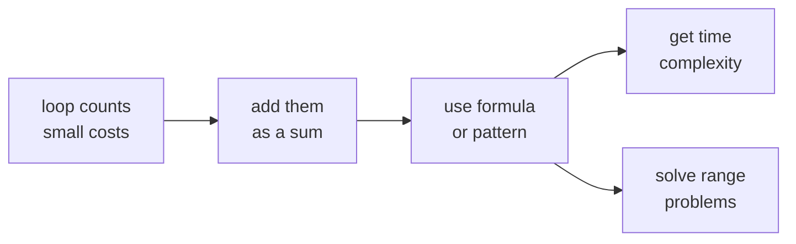
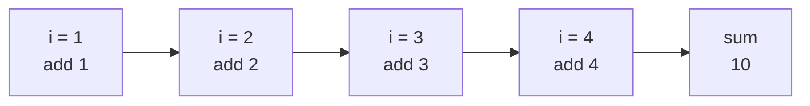
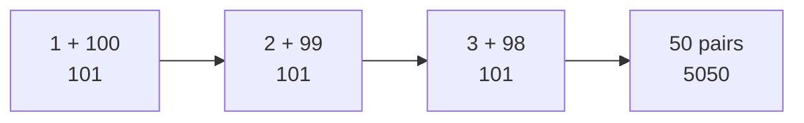
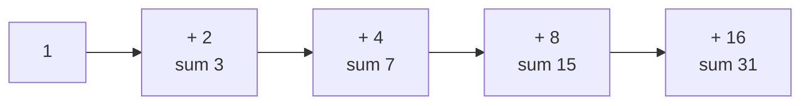
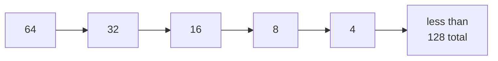
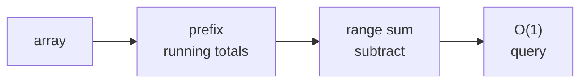
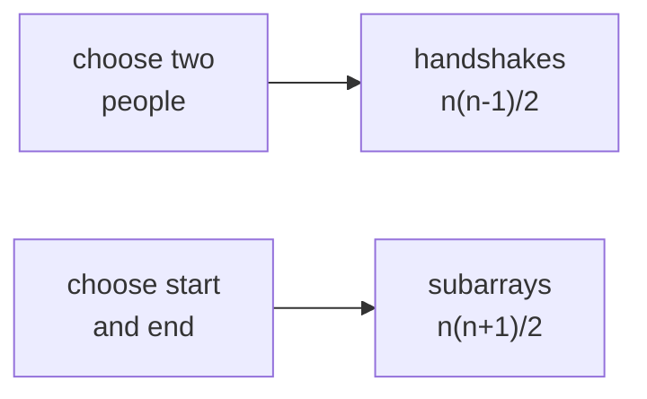

# 05 · Sums and Series

> After this chapter you can turn loops into sums, turn sums into formulas, and use prefix sums
> to answer range questions quickly.

⬅️ [04 · Logarithms](../04-logarithms/) · 🏠 [Roadmap](../README.md) · [06 · Big-O and Time Complexity](../06-big-o-time-complexity/) ➡️

## Contents

1. [Why this matters for DSA](#1-why-this-matters-for-dsa)
2. [Sigma means add a list](#2-sigma-means-add-a-list)
3. [Gauss and arithmetic series](#3-gauss-and-arithmetic-series)
4. [Odd and even sums](#4-odd-and-even-sums)
5. [Squares and cubes](#5-squares-and-cubes)
6. [Geometric series](#6-geometric-series)
7. [Halving series](#7-halving-series)
8. [Harmonic series](#8-harmonic-series)
9. [Telescoping sums](#9-telescoping-sums)
10. [Prefix sums and difference arrays](#10-prefix-sums-and-difference-arrays)
11. [Counting pairs and subarrays](#11-counting-pairs-and-subarrays)
12. [Turning loops into sums](#12-turning-loops-into-sums)
13. [Java code](#13-java-code)
14. [Common mistakes](#14-common-mistakes)
15. [Interview patterns](#15-interview-patterns)
16. [Exercises](#16-exercises)
17. [One-minute recap](#17-one-minute-recap)

---

## 1. Why this matters for DSA

A loop is often just a sum wearing a costume.

```java
for (int i = 1; i <= n; i++) {
    work(i);
}
```

If `work(i)` takes `i` steps, the loop costs:

```text
1 + 2 + 3 + ... + n
```

That is why sums are the bridge to [Big-O and Time Complexity](../06-big-o-time-complexity/).
They also power many real interview techniques:

- prefix sums for fast range sums;
- hash maps with prefix sums for subarray sums;
- difference arrays for many range updates;
- geometric sums for doubling arrays;
- harmonic sums for divisor loops and sieve-like loops;
- `n(n − 1)/2` for pairs and `n(n + 1)/2` for subarrays.



🧠 **How to think of it yourself:** when a loop's work changes each round, write the work
as a list first. Then ask, "Do I know this list?"

---

## 2. Sigma means add a list

The symbol `Σ` is just a fancy "add all these terms" sign.

```text
Σ from i = 1 to 5 of i
= 1 + 2 + 3 + 4 + 5
= 15
```

Side by side with a loop:

| Maths | Java |
|---|---|
| `Σ i, from i = 1 to n` | `for (int i = 1; i <= n; i++) sum += i;` |
| start at 1 | `int i = 1` |
| stop at n | `i <= n` |
| add current term | `sum += i` |

Plain picture:

```text
sigma is a basket:

term 1   term 2   term 3   term 4
  1   +    2   +    3   +    4    = 10
```



Worked example:

```text
Σ from i = 2 to 6 of i
= 2 + 3 + 4 + 5 + 6
= 20
```

Java:

```java
int sum = 0;
for (int i = 2; i <= 6; i++) {
    sum += i;
}
```

---

## 3. Gauss and arithmetic series

The story says young Gauss was asked to add:

```text
1 + 2 + 3 + ... + 100
```

Instead of adding one by one, he paired the ends:

```text
1   + 100 = 101
2   +  99 = 101
3   +  98 = 101
...
50  +  51 = 101
```

There are 50 pairs, so:

```text
50 x 101 = 5050
```



### The staircase picture

Imagine blocks in a staircase:

```text
1 + 2 + 3 + 4

      []
    [][]
  [][][]
[][][][]
```

Put two same staircases together, one flipped:

```text
staircase + flipped staircase = rectangle

height = n
width  = n + 1

two staircases = n x (n + 1)
one staircase  = n x (n + 1) / 2
```

So:

```text
1 + 2 + ... + n = n(n + 1) / 2
```

For `n = 100`:

```text
100 x 101 / 2 = 5050
```

### Arithmetic series in general

An arithmetic series adds numbers with the same step:

```text
5 + 8 + 11 + 14
```

Formula:

```text
(first + last) x count / 2
```

Count:

```text
count = (last - first) / step + 1
```

Example:

```text
first = 5, last = 14, step = 3
count = (14 - 5) / 3 + 1 = 4
sum = (5 + 14) x 4 / 2 = 38
```

🧠 **How to think of it yourself:** if the list climbs by a fixed step, pair small with big.
Every pair has the same total.

---

## 4. Odd and even sums

The first `n` odd numbers add to `n²`.

```text
1 = 1
1 + 3 = 4
1 + 3 + 5 = 9
1 + 3 + 5 + 7 = 16
```

Why? Each new odd number makes an L-shape around the old square.

```text
start with 3 x 3 square:

* * *
* * *
* * *

add 7 dots as an L-shape to make 4 x 4:

* * * +
* * * +
* * * +
+ + + +
```

So:

```text
1 + 3 + 5 + ... + (2n - 1) = n²
```

The first `n` even numbers are:

```text
2 + 4 + 6 + ... + 2n
= 2(1 + 2 + 3 + ... + n)
= 2 x n(n + 1) / 2
= n(n + 1)
```

Worked examples:

```text
first 5 odds:  1 + 3 + 5 + 7 + 9 = 25 = 5²
first 5 evens: 2 + 4 + 6 + 8 + 10 = 30 = 5 x 6
```

Java:

```java
long oddSum = n * n;
long evenSum = n * (n + 1);
```

---

## 5. Squares and cubes

Some loops do `i²` work on the `i`th round. Then you need:

```text
1² + 2² + 3² + ... + n² = n(n + 1)(2n + 1) / 6
```

Small check for `n = 5`:

```text
1² + 2² + 3² + 4² + 5²
= 1 + 4 + 9 + 16 + 25
= 55

formula = 5 x 6 x 11 / 6 = 55
```

Cubes have a surprising pattern:

```text
1³ + 2³ + 3³ + ... + n³ = (n(n + 1) / 2)²
```

Small check for `n = 5`:

```text
1³ + 2³ + 3³ + 4³ + 5³
= 1 + 8 + 27 + 64 + 125
= 225

1 + 2 + 3 + 4 + 5 = 15
15² = 225
```

Where they appear:

```java
for (int i = 1; i <= n; i++) {
    for (int j = 1; j <= i * i; j++) {
        // total work is 1^2 + 2^2 + ... + n^2
    }
}
```

This is not `n²`; the sum of squares grows like `n³`. Chapter
[06 · Big-O and Time Complexity](../06-big-o-time-complexity/) uses this idea often.

---

## 6. Geometric series

A geometric series multiplies by the same ratio each time.

```text
1 + 2 + 4 + 8 + 16
```

For powers of two:

```text
1 + 2 + 4 + ... + 2^k = 2^(k+1) − 1
```

Why? Each term is one more than everything before it.

```text
1                         = 1
1 + 2                     = 3
1 + 2 + 4                 = 7
1 + 2 + 4 + 8             = 15
1 + 2 + 4 + 8 + 16        = 31
```

Binary picture:

```text
1 + 2 + 4 + 8 + 16 = 11111 in binary = 31
2^5               = 100000 in binary = 32
so the sum is one less
```



General formula:

```text
a + ar + ar² + ... + ar^k = a(r^(k+1) − 1) / (r − 1)
```

Example:

```text
3 + 6 + 12 + 24
a = 3, r = 2, k = 3
sum = 3(2^4 − 1) / (2 − 1)
    = 3 x 15
    = 45
```

🧠 **How to think of it yourself:** if every term is made by multiplying the previous term,
look for a geometric series.

---

## 7. Halving series

A very important geometric series goes downward:

```text
n + n/2 + n/4 + n/8 + ...
```

Pizza picture:

```text
whole pizza      n
half pizza       n/2
quarter pizza    n/4
tiny pieces      n/8 ...

all together is less than 2 whole pizzas
```

Formula idea:

```text
n + n/2 + n/4 + n/8 + ... < 2n
```

For `n = 64` until 1:

```text
64 + 32 + 16 + 8 + 4 + 2 + 1 = 127
2n = 128
```



Where this appears:

- Dynamic arrays double in size. Copying costs `1 + 2 + 4 + ...`, which is still `O(n)`.
- Divide-and-conquer levels may do `n + n/2 + n/4 + ...`, which is `O(n)`.
- Recurrences in [Recurrences](../07-recurrences/) draw these level costs.

This is why "halving work" loops and "doubling arrays" are often not as scary as they look.

---

## 8. Harmonic series

The harmonic series is:

```text
1 + 1/2 + 1/3 + 1/4 + ... + 1/n
```

It grows very slowly:

```text
H_10      ≈ 2.929
H_100     ≈ 5.187
H_1000    ≈ 7.485
H_1000000 ≈ 14.393
```

More exactly:

```text
1 + 1/2 + ... + 1/n ≈ ln n + 0.577
```

Block grouping picture:

```text
1
1/2
1/3 + 1/4                 > 2 x 1/4 = 1/2
1/5 + 1/6 + 1/7 + 1/8     > 4 x 1/8 = 1/2
1/9 ... 1/16              > 8 x 1/16 = 1/2
```

Every time the denominator range doubles, we add about another half. That is why harmonic
growth behaves like a logarithm.

Where it appears:

```java
for (int i = 1; i <= n; i++) {
    for (int j = i; j <= n; j += i) {
        // visits multiples of i
    }
}
```

The inner loop runs about `n / i` times, so total work is:

```text
n/1 + n/2 + n/3 + ... + n/n
= n(1 + 1/2 + 1/3 + ... + 1/n)
≈ n ln n
```

This appears in divisor counting and sieve-style work, which connect to
[Divisors and the Square Root Trick](../08-divisors-and-sqrt-trick/). Coupon collector
belongs later in [Probability and Randomness](../14-probability-and-randomness/).

---

## 9. Telescoping sums

Some sums collapse like a toy telescope.

Example:

```text
1/(1 x 2) + 1/(2 x 3) + 1/(3 x 4) + ... + 1/(n x (n + 1))
```

Difference trick:

```text
1/(k x (k + 1)) = 1/k − 1/(k + 1)
```

Now write the terms:

```text
(1/1 - 1/2)
    + (1/2 - 1/3)
        + (1/3 - 1/4)
            + ...
                + (1/n - 1/(n+1))
```

Everything in the middle cancels:

```text
answer = 1 − 1/(n + 1)
```

For `n = 5`:

```text
1 − 1/6 = 5/6 = 0.8333...
```

🧠 **How to think of it yourself:** if a fraction has nearby numbers like `k` and `k + 1`,
try splitting it into "one over the first minus one over the second."

---

## 10. Prefix sums and difference arrays

Prefix sums are running totals with one extra zero at the start.

For array:

```text
index:       0   1   2   3   4
a:           2  -1   3   4  -2
```

Build:

```text
pre[0] = 0
pre[1] = a[0]
pre[2] = a[0] + a[1]
pre[3] = a[0] + a[1] + a[2]
```

So:

```text
pre:         0   2   1   4   8   6
             |   |   |   |   |   |
position:    0   1   2   3   4   5
```

Range sum from `l` to `r`:

```text
sum(l..r) = pre[r + 1] − pre[l]
```

Picture for `l = 1`, `r = 3`:

```text
pre[4] = a[0] + a[1] + a[2] + a[3]
pre[1] = a[0]

subtract:
pre[4] - pre[1] = a[1] + a[2] + a[3]
```



LeetCode uses:

- 303 · Range Sum Query - Immutable: build prefix, answer each range in `O(1)`.
- 304 · Range Sum Query 2D - Immutable: same idea on a grid.
- 1480 · Running Sum of 1d Array: prefix without the extra zero.
- 724 · Find Pivot Index: compare left sum and right sum.

Pivot index example for `[1, 7, 3, 6, 5, 6]`:

```text
total sum = 28

index  value  left sum  right sum
0      1      0         27
1      7      1         20
2      3      8         17
3      6      11        11   found
```

The trick is not to recompute the right side every time. Keep `leftSum`, and use:

```text
rightSum = totalSum - leftSum - nums[i]
```

Then after checking index `i`, add `nums[i]` into `leftSum`.

### Two dimensional prefix sums

For a grid, a 2D prefix sum stores the sum of the rectangle from the top-left corner
to the current cell.

Small grid:

```text
grid:
1 2 3
4 5 6

prefix idea:
sum rectangle above me
+ sum rectangle left of me
- overlap counted twice
+ current cell
```

Formula words for cell `(r, c)`:

```text
pre[r+1][c+1] =
    grid[r][c]
  + pre[r][c+1]
  + pre[r+1][c]
  - pre[r][c]
```

The subtraction is the important part. The top rectangle and left rectangle overlap in
the corner, so that corner was counted twice. We subtract it once.

To query a rectangle, use the same add-and-subtract idea:

```text
wanted rectangle
= big prefix down to bottom-right
- area above it
- area left of it
+ overlap removed twice
```

This is exactly LeetCode 304. It looks scary at first, but it is just the 1D idea with
"subtract what came before" done in two directions.

### Subarray Sum Equals K

LeetCode 560 asks how many subarrays sum to `k`.

If:

```text
prefix[right] - prefix[left] = k
```

then:

```text
prefix[left] = prefix[right] - k
```

So as we scan, keep a hash map of old prefix sums and their counts.

### Prefix products

LeetCode 238, Product of Array Except Self, is like prefix sums but with multiplication:

```text
answer[i] = product of everything left of i x product of everything right of i
```

### Difference arrays

Difference arrays are the reverse tool for many range updates.

To add `x` to range `[l, r]`:

```text
diff[l] += x
diff[r + 1] -= x
```

Then prefix the `diff` array to recover final values.

Dry run: start with five zeros and add 10 to range `[1, 3]`.

```text
start array:  0   0   0   0   0
diff marks:   0  10   0   0 -10

prefix diff:
index        0   1   2   3   4
running      0  10  10  10   0
final        0  10  10  10   0
```

Why it works: `+10` says "start adding here." `-10` says "stop adding after the range."
The final prefix pass carries the value through the range like a paint roller, then turns
it off.

This solves:

- 1109 · Corporate Flight Bookings;
- 370 · Range Addition.

---

## 11. Counting pairs and subarrays

Handshakes among `n` people:

```text
person 1 shakes hands with n - 1 people
person 2 shakes hands with n - 2 new people
...
```

Total:

```text
(n - 1) + (n - 2) + ... + 1 = n(n - 1) / 2
```

For 6 people:

```text
6 x 5 / 2 = 15
```

Subarrays in an array of length `n`:

```text
start at index 0: n choices
start at index 1: n - 1 choices
start at index 2: n - 2 choices
...
```

Total:

```text
n + (n - 1) + ... + 1 = n(n + 1) / 2
```

For length 5:

```text
5 + 4 + 3 + 2 + 1 = 15
```



LeetCode 268, Missing Number:

```text
expected sum = 0 + 1 + ... + n = n(n + 1) / 2
missing = expected sum - actual sum
```

Use `long` for the formula if `n` can be large, because `n(n + 1)` can overflow `int`.

LeetCode 441, Arranging Coins, asks for the biggest `k` with:

```text
1 + 2 + ... + k <= n
```

That is:

```text
k(k + 1) / 2 <= n
```

You can binary search `k`, just like integer square root.

---

## 12. Turning loops into sums

This is the bridge to chapter 06.

Step by step:

1. Find how many times each loop runs.
2. Write the cost as a list.
3. Recognise the list as a known sum.
4. Keep the biggest growth term for Big-O.

Example 1:

```java
for (int i = 1; i <= n; i++) {
    for (int j = 1; j <= i; j++) {
        work();
    }
}
```

Cost list:

```text
1 + 2 + 3 + ... + n = n(n + 1) / 2
```

So the time is `O(n²)`.

Example 2:

```java
for (int i = 1; i <= n; i *= 2) {
    for (int j = 1; j <= i; j++) {
        work();
    }
}
```

Cost list:

```text
1 + 2 + 4 + 8 + ... + n < 2n
```

So the time is `O(n)`.

Example 3:

```java
for (int i = 1; i <= n; i++) {
    for (int j = i; j <= n; j += i) {
        work();
    }
}
```

Cost list:

```text
n/1 + n/2 + n/3 + ... + n/n ≈ n ln n
```

So the time is `O(n log n)`.

🧠 **How to think of it yourself:** do not guess from the number of loops. Write the work
per outer-loop round. Two nested loops can be `O(n²)`, `O(n log n)`, or even `O(n)`.

---

## 13. Java code

Code file: [`SumsAndSeries.java`](SumsAndSeries.java)

Key methods:

- `triangular(n)` — `1 + 2 + ... + n`.
- `arithmeticSeries(first, last, step)` — fixed-step series.
- `sumFirstOddNumbers(n)` and `sumFirstEvenNumbers(n)`.
- `sumOfSquares(n)` and `sumOfCubes(n)`.
- `powersOfTwoSeries(k)`, `geometricSeries(a, r, k)`, `halvingUntilOne(n)`.
- `harmonic(n)` and `telescoping(n)`.
- `prefixSums(nums)`, `rangeSum(prefix, left, right)`, `runningSum(nums)`.
- `subarraySumEqualsK(nums, k)`, `productExceptSelf(nums)`.
- `corpFlightBookings(bookings, n)` — difference array.
- `missingNumber(nums)`, `handshakes(n)`, `subarrayCount(n)`, `arrangeCoins(n)`.

Run it:

```text
cd maths_for_dsa/05-sums-and-series
java SumsAndSeries.java
```

Real output:

```text
Sums and series demos
1 + 2 + ... + 100 = 5050
5 + 8 + 11 + 14 = 38
first 5 odd numbers sum = 25
first 5 even numbers sum = 30
1^2 + ... + 5^2 = 55
1^3 + ... + 5^3 = 225

Geometric, halving and harmonic
1 + 2 + 4 + ... + 2^5 = 63
3 + 6 + 12 + 24 = 45
64 + 32 + ... + 1 = 127
H_10 rounded to 4 decimals = 2.9290
telescoping n = 5 gives 0.8333

Prefix sums
array = [2, -1, 3, 4, -2]
prefix = [0, 2, 1, 4, 8, 6]
range sum index 1..3 = 6
running sum = [2, 1, 4, 8, 6]
subarrays with sum 5 = 1
product except self = [24, 12, 8, 6]

Difference arrays and counting
flight bookings = [10, 55, 45, 25, 25]
missing number in [3, 0, 1] = 2
handshakes among 6 people = 15
subarrays in length 5 array = 15
arranging 8 coins makes rows = 3
```

---

## 14. Common mistakes

| Mistake | Why it hurts | Fix |
|---|---|---|
| Forgetting the extra zero in prefix sums | ranges become off by one | use `pre.length = n + 1` |
| Using `pre[r] - pre[l]` for inclusive ranges | misses `a[r]` | use `pre[r + 1] - pre[l]` |
| Guessing nested loops are always `n²` | harmonic and geometric loops differ | write the work list first |
| Overflowing `n(n + 1)` in `int` | formula can wrap around | cast to `long` before multiplying |
| Forgetting count in arithmetic series | last value alone is not enough | `count = (last - first) / step + 1` |
| Using division too early | integer division can cut fractions | multiply first when safe, or use `long` |
| In difference arrays, missing `r + 1` subtraction | update leaks past the range | subtract at `r + 1` if it exists |

---

## 15. Interview patterns

| Pattern | How to recognise it | LeetCode problems |
|---|---|---|
| Triangular sum | missing one number from `0..n`, handshakes, coins | 268 · Missing Number, 441 · Arranging Coins |
| Running total | asks for each prefix total | 1480 · Running Sum of 1d Array |
| Static range sums | many sum queries, array does not change | 303 · Range Sum Query - Immutable |
| 2D range sums | many rectangle sum queries | 304 · Range Sum Query 2D - Immutable |
| Prefix sum plus hash map | count subarrays with exact sum | 560 · Subarray Sum Equals K |
| Prefix products | product except current index without division | 238 · Product of Array Except Self |
| Difference array | many range increments, final array needed | 1109 · Corporate Flight Bookings, 370 · Range Addition |
| Pivot by left and right sums | asks for index where sides balance | 724 · Find Pivot Index |
| Prefix sum with modulo | subarrays divisible by `k` | 974 · Subarray Sums Divisible by K, see ../11-modular-arithmetic/ |

---

## 16. Exercises

### Level 1 · Warm-up

**1.** Compute `1 + 2 + ... + 10`.

<details>
<summary>Answer</summary>

**55** — `10 x 11 / 2 = 55`.

</details>

**2.** Compute `1 + 2 + ... + 100`.

<details>
<summary>Answer</summary>

**5050** — pair ends: 50 pairs of 101.

</details>

**3.** Compute `5 + 8 + 11 + 14`.

<details>
<summary>Answer</summary>

**38** — `(5 + 14) x 4 / 2 = 38`.

</details>

**4.** What is the sum of the first 7 odd numbers?

<details>
<summary>Answer</summary>

**49** — first `n` odd numbers sum to `n²`, so `7² = 49`.

</details>

**5.** What is the sum of the first 6 even numbers?

<details>
<summary>Answer</summary>

**42** — first `n` even numbers sum to `n(n + 1)`, so `6 x 7 = 42`.

</details>

**6.** Compute `1² + 2² + 3² + 4²`.

<details>
<summary>Answer</summary>

**30** — `1 + 4 + 9 + 16 = 30`.

</details>

**7.** Compute `1³ + 2³ + 3³ + 4³`.

<details>
<summary>Answer</summary>

**100** — `1 + 8 + 27 + 64 = 100`; also `(4 x 5 / 2)² = 10²`.

</details>

**8.** Compute `1 + 2 + 4 + 8 + 16`.

<details>
<summary>Answer</summary>

**31** — this is `2^5 − 1 = 32 − 1`.

</details>

**9.** Compute `64 + 32 + 16 + 8 + 4 + 2 + 1`.

<details>
<summary>Answer</summary>

**127** — it is one less than `128`, or `2 x 64 − 1`.

</details>

**10.** Compute `1/(1 x 2) + 1/(2 x 3) + 1/(3 x 4)`.

<details>
<summary>Answer</summary>

**3/4** — telescoping gives `1 − 1/4 = 3/4`.

</details>

### Level 2 · Practice

**11.** For `first = 3`, `last = 21`, `step = 3`, find the arithmetic series sum.

<details>
<summary>Answer</summary>

**84** — the terms are `3, 6, 9, 12, 15, 18, 21`; count is 7, so
`(3 + 21) x 7 / 2 = 84`.

</details>

**12.** How many handshakes happen among 12 people if each pair shakes once?

<details>
<summary>Answer</summary>

**66** — `12 x 11 / 2 = 66`.

</details>

**13.** How many subarrays does an array of length 8 have?

<details>
<summary>Answer</summary>

**36** — `8 x 9 / 2 = 36`.

</details>

**14.** Build prefix sums for `[4, -2, 7, 1]` using an extra zero.

<details>
<summary>Answer</summary>

**[0, 4, 2, 9, 10]** — keep a running total: `0`, then `4`, `2`, `9`, `10`.

</details>

**15.** With prefix `[0, 4, 2, 9, 10]`, what is the range sum from index 1 to 3?

<details>
<summary>Answer</summary>

**6** — use `pre[4] − pre[1] = 10 − 4 = 6`, which is `-2 + 7 + 1`.

</details>

**16.** In Missing Number, array `[0, 1, 3, 4]` has numbers from `0..4` with one missing. Which one?

<details>
<summary>Answer</summary>

**2** — expected sum is `4 x 5 / 2 = 10`, actual sum is `8`, missing is `2`.

</details>

**17.** For arranging 15 coins into full staircase rows, how many full rows can you make?

<details>
<summary>Answer</summary>

**5** — `1 + 2 + 3 + 4 + 5 = 15`.

</details>

**18.** How many times total does this loop run?

```java
for (int i = 1; i <= n; i *= 2) {
    for (int j = 1; j <= i; j++) {
        work();
    }
}
```

when `n = 16`.

<details>
<summary>Answer</summary>

**31** — the costs are `1 + 2 + 4 + 8 + 16 = 31`.

</details>

### Level 3 · Interview

**19.** For the loop `for (i = 1; i <= n; i++) for (j = 1; j <= i; j++)`, write the sum and Big-O.

<details>
<summary>Answer</summary>

**Sum:** `1 + 2 + ... + n = n(n + 1)/2`. **Big-O:** `O(n²)`.

</details>

**20.** For the multiples loop `for (i = 1..n) for (j = i; j <= n; j += i)`, what is the total work approximately?

<details>
<summary>Answer</summary>

**About `n ln n`** — the inner loop counts are `n/1 + n/2 + ... + n/n`,
which is `n` times the harmonic series.

</details>

**21.** In LeetCode 560, if current prefix sum is 17 and `k = 5`, what old prefix sum do we need?

<details>
<summary>Answer</summary>

**12** — we need `old = current − k = 17 − 5 = 12`.

</details>

**22.** For Product of Array Except Self on `[1, 2, 3, 4]`, what is the answer?

<details>
<summary>Answer</summary>

**[24, 12, 8, 6]** — multiply everything except the current index.

</details>

**23.** Difference array question: start with five zeros and add 10 to range `[1, 3]`.
What final array do you get?

<details>
<summary>Answer</summary>

**[0, 10, 10, 10, 0]** — mark `diff[1] += 10` and `diff[4] -= 10`, then prefix it.

</details>

**24.** Why can `n(n + 1) / 2` overflow even when the final answer would fit in `int`?

<details>
<summary>Answer</summary>

**Because the multiplication happens first**. `n(n + 1)` may overflow before `/ 2`
shrinks it. Cast to `long` before multiplying or divide one factor by 2 first.

</details>

---

## 17. One-minute recap

- `Σ` means "add this list."
- `1 + 2 + ... + n = n(n + 1)/2`.
- Arithmetic series pair first with last: `(first + last) x count / 2`.
- First `n` odd numbers sum to `n²`; first `n` even numbers sum to `n(n + 1)`.
- `1² + ... + n²` grows like `n³`; `1³ + ... + n³` equals a triangular number squared.
- `1 + 2 + 4 + ... + 2^k = 2^(k+1) − 1`.
- `n + n/2 + n/4 + ... < 2n`.
- Harmonic sums grow like `ln n` and appear in divisor and sieve-like loops.
- Prefix sums answer range sums by subtraction.
- Difference arrays turn many range updates into two marks plus one prefix pass.
- Pair counts use `n(n − 1)/2`; subarray counts use `n(n + 1)/2`.
