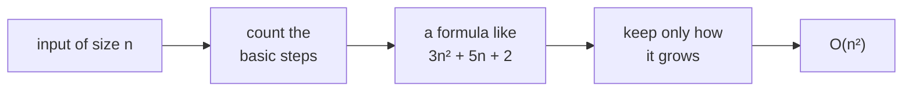
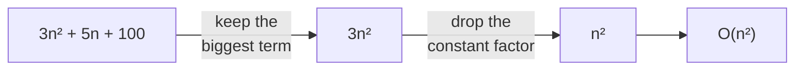
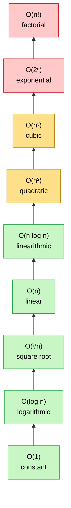
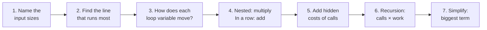
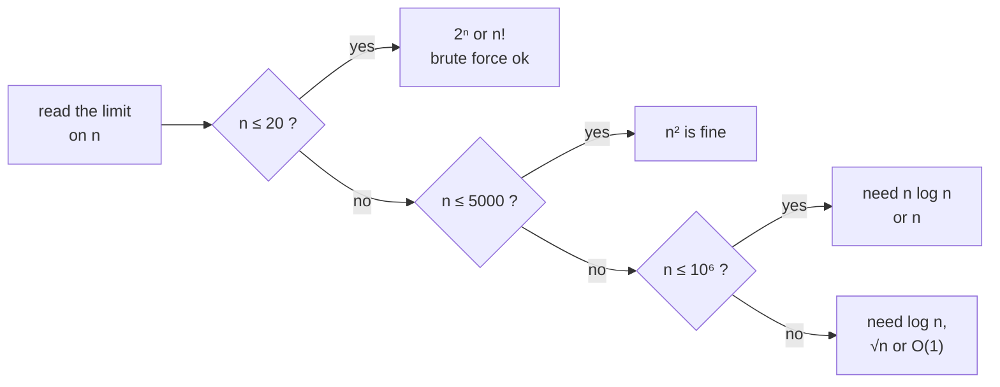

# 06 · Big-O and Time Complexity

> After this chapter you can look at any piece of code and **find its time and space complexity step by
> step** — and explain it to an interviewer in two sentences.

⬅️ [05 · Sums and Series](../05-sums-and-series/) · 🏠 [Roadmap](../README.md) · [07 · Recurrences](../07-recurrences/) ➡️

## Contents

1. [Why this matters for DSA](#1-why-this-matters-for-dsa)
2. [Count steps, not seconds](#2-count-steps-not-seconds)
3. [What Big-O means](#3-what-big-o-means)
4. [The simplification rules](#4-the-simplification-rules)
5. [The growth ladder](#5-the-growth-ladder)
6. [The 7-step recipe to find time complexity](#6-the-7-step-recipe-to-find-time-complexity)
7. [Loop pattern gallery](#7-loop-pattern-gallery)
8. [Hidden costs in Java](#8-hidden-costs-in-java)
9. [Space complexity](#9-space-complexity)
10. [Best, average and worst case](#10-best-average-and-worst-case)
11. [Amortized analysis](#11-amortized-analysis)
12. [From constraints to complexity](#12-from-constraints-to-complexity)
13. [How to say it in an interview](#13-how-to-say-it-in-an-interview)
14. [Java code](#14-java-code)
15. [Common mistakes](#15-common-mistakes)
16. [Interview patterns](#16-interview-patterns)
17. [Exercises](#17-exercises)
18. [One-minute recap](#18-one-minute-recap)

---

## 1. Why this matters for DSA

Almost every coding interview ends with the same question:

> *"What is the time and space complexity of your solution?"*

- It decides whether your code **passes** or gets "Time Limit Exceeded".
- It is how you **compare** two ideas before writing any code ("the brute force is O(n²), the hash map
  makes it O(n)").
- FAANG interviewers want the answer **and the reason**, in a sentence or two.

The good news: finding the complexity is a **skill with a recipe**, not magic. This chapter gives you that
recipe (section 6), a gallery of the loop shapes you will meet again and again (section 7), and the tools
from the last two chapters — logs ([04](../04-logarithms/)) and sums ([05](../05-sums-and-series/)).

---

## 2. Count steps, not seconds

🔍 **A story.** Ravi and Priya must find the name "Zara" in a list of students sorted alphabetically.

- **Ravi** reads the names one by one from the top.
- **Priya** opens the list in the middle, sees whether "Zara" comes before or after, throws away the wrong
  half, and repeats (binary search, chapter [04](../04-logarithms/)).

| students in the list | Ravi's steps (worst case) | Priya's steps (worst case) |
|---|---|---|
| 30 | 30 | 5 |
| 3,000 | 3,000 | 12 |
| 3,000,000 | 3,000,000 | 22 |

Ravi's work grows **as fast as the list**; Priya's barely grows. That is what we care about.

A faster laptop makes both of them faster, but it cannot change **how the work grows**. So we don't
measure seconds — we count **steps as a function of the input size n**. That function, simplified, is the
**time complexity**.



A **basic step** is anything that takes a fixed, small time: `+`, `*`, a comparison, reading `a[i]`,
assigning a variable. We don't care whether a step takes 1 or 3 nanoseconds.

---

## 3. What Big-O means

Big-O is the **family name** of a growth formula. 3n + 5, n / 2 and 100n are different formulas, but they
all belong to the **n family**: double n and they (roughly) double. We write them all as **O(n)**.

> f(n) is **O(g(n))** if, for all big enough n, f(n) ≤ c × g(n) for some fixed number c.

In kid words: *"from some point on, g (times a constant) is a ceiling that f never goes above."*
Example: 3n + 5 ≤ 4n as soon as n ≥ 5, so 3n + 5 is O(n):

```text
 n        1    2    3    4    5    6    7    8
 3n + 5   8   11   14   17   20   23   26   29
 4n       4    8   12   16   20   24   28   32     <- from n = 5 on, 4n is on top forever
```

Two cousins of Big-O that you may hear:

| Symbol | Meaning | Kid words |
|---|---|---|
| O (Big-O) | upper bound | "at most this fast-growing" (a ceiling) |
| Ω (Big-Omega) | lower bound | "at least this fast-growing" (a floor) |
| Θ (Big-Theta) | tight bound | both at once — "exactly this family" |

📌 In interviews people say "Big-O" but mean the **tight** answer. Saying bubble sort is O(n³) is
technically true (n³ is a ceiling) but useless — say **O(n²)**.

---

## 4. The simplification rules

Once you have a step-count formula, simplify it with these rules:



1. **Drop constant factors.** 3n → n, n / 2 → n, 100 → 1. *Why?* A constant is just a faster or slower
   computer; it does not change the shape of the growth.
2. **Keep only the biggest term.** n² + 100n + 5000 → n². *Why?* For big n the biggest term swallows the
   rest:

   | n | n² | 100n | 5000 | share of n² |
   |---|---|---|---|---|
   | 10 | 100 | 1,000 | 5,000 | 2 % |
   | 1,000 | 1,000,000 | 100,000 | 5,000 | 90 % |
   | 1,000,000 | 10¹² | 10⁸ | 5,000 | 99.99 % |

3. **Steps one after another → add.** A loop of n, then a loop of n² → O(n + n²) = O(n²).
4. **Steps inside each other → multiply.** A loop of n that runs a loop of m inside → O(n × m).
5. **Different inputs get different letters.** Two arrays of sizes a and b: looping over both one after
   another is **O(a + b)**, nesting them is **O(a × b)**. Don't call both "n".
6. **The base of a log does not matter.** O(log₂ n) = O(log₁₀ n) = O(log n) (chapter
   [04](../04-logarithms/)).

---

## 5. The growth ladder

The common complexities, from the fastest (bottom) to the slowest (top). Climbing one step up makes big
inputs **much** slower:



What happens when the input **doubles** (real numbers from the Java file, n = 1,000 → 2,000):

```text
   O(1): 1.00   O(log n): 1.10   O(n): 2.00   O(n log n): 2.20
   O(n^2): 4.00   O(n^3): 8.00   O(2^n): 2^1000 (a 302-digit number!)
```

And the number of steps for typical sizes (`huge` = more than 10¹⁸):

```text
   n        log n   sqrt n        n  n log n      n^2      n^3      2^n       n!
   10           3        3       10       33      100    1,000    1,024  3.6e+06
   20           4        4       20       86      400    8,000  1.0e+06     huge
   500          9       22      500    4,483  250,000  1.3e+08     huge     huge
   5,000       12       71    5,000   61,439  2.5e+07  1.3e+11     huge     huge
   10^6        20    1,000  1.0e+06  2.0e+07  1.0e+12  1.0e+18     huge     huge
   10^12       40  1.0e+06  1.0e+12  4.0e+13     huge     huge     huge     huge
```

A computer does roughly **10⁸ simple steps per second**. So for n = 10⁶, O(n log n) (2 × 10⁷ steps) is
instant, but O(n²) (10¹² steps) takes about **3 hours**. 😱

---

## 6. The 7-step recipe to find time complexity

This is the heart of the chapter. Use it on **every** piece of code until it becomes automatic.



1. **Name the input sizes.** n = length of the array, m = length of the string, and so on.
2. **Find the line that runs the most** — usually the innermost statement of the deepest loop.
3. **For every loop, ask how its variable moves.** This decides how many times it runs:

   | The loop variable … | the loop runs about … | example |
   |---|---|---|
   | goes up or down by 1 (or any constant) | n times | `i++`, `i += 2`, `i--` |
   | is multiplied or divided by a constant | log n times | `i *= 2`, `i /= 2` |
   | stops when `i * i` passes n | √n times | `i * i <= n` |
   | jumps by the outer variable `i` | n / i times | `j += i` |
   | stops at the outer variable | depends on the outer loop → write a **sum** | `j < i` |

4. **Combine.** Nested loops → multiply (or add up the sum when the inner loop depends on the outer one).
   Loops one after another → add.
5. **Add hidden costs** of every method call inside a loop (section 8): `list.contains`, `substring`,
   `s + t`, sorting …
6. **Recursion:** number of calls × work per call, or write a recurrence (chapter
   [07](../07-recurrences/)).
7. **Simplify** with the rules of section 4.

### Worked example 1

```java
int countPairs(int[] a, int k) {                   // step 1: n = a.length
    Arrays.sort(a);                                 // hidden cost: n log n
    int count = 0;
    for (int i = 0; i < a.length; i++) {            // runs n times
        for (int j = i + 1; j < a.length; j++) {    // runs n - 1 - i times
            if (a[i] + a[j] == k) {                 // step 2: the line that runs most
                count++;
            }
        }
    }
    return count;
}
```

- Step 3–4: the inner loop runs (n − 1) + (n − 2) + … + 1 + 0 = n(n − 1) / 2 times in total
  (chapter [05](../05-sums-and-series/)).
- Step 5: the sort adds n log n.
- Step 7: n log n + n(n − 1)/2 → the biggest term is n²/2 → **O(n²)**.

### Worked example 2 — don't multiply blindly!

```java
for (int size = n; size > 0; size /= 2) {   // about log n rounds
    for (int i = 0; i < size; i++) {        // but this loop runs "size" times, not n
        work();
    }
}
```

"log n rounds × n" would say O(n log n) — **wrong**. The inner loop runs n, then n/2, then n/4 …:
n + n/2 + n/4 + … < **2n**, so the whole thing is **O(n)** (the halving series from chapter
[05](../05-sums-and-series/)).

🧠 **How to think of it yourself:** multiplying "outer count × inner count" is only allowed when the inner
loop runs the **same** number of times in every round. If it changes, **add up the rounds** instead.

---

## 7. Loop pattern gallery

Almost every loop you will ever analyse is one of these shapes. Learn to recognise them at a glance.

### 7.1 Straight loops — O(n)

```java
for (int i = 0; i < n; i++) { ... }            // P1: n steps
for (int i = 0; i < n; i++) { ... }            // P2: a second loop after the first:
for (int j = 0; j < n; j++) { ... }            //     n + n = 2n steps -> still O(n)
for (int i = 0; i < n; i += 2) { ... }         // n / 2 steps -> O(n)
for (int i = 0; i < n; i++)                    // P14: the inner loop has a FIXED size:
    for (int j = 0; j < 100; j++) { ... }      //     100n steps -> O(n)
```

### 7.2 Nested loops — O(n²) and O(n³)

```java
for (int i = 0; i < n; i++)                    // P3: n × n = n² steps
    for (int j = 0; j < n; j++) { ... }

for (int i = 0; i < n; i++)                    // P4: every pair (i, j) with i < j once
    for (int j = i + 1; j < n; j++) { ... }    //     n(n - 1)/2 steps -> still O(n²)
```

P4 is a **triangle** — half of the n × n square, and half of n² is still in the n² family:

```text
 n = 5
 i = 0:  j = 1 2 3 4      4 steps   ####
 i = 1:  j = 2 3 4        3 steps   ###
 i = 2:  j = 3 4          2 steps   ##
 i = 3:  j = 4            1 step    #
 i = 4:  (none)           0 steps
                         10 steps = 5 × 4 / 2
```

Three nested loops that each go to n (P13) give n³ steps.

### 7.3 Halving and doubling — O(log n)

```java
for (int i = n; i > 0; i /= 2) { ... }         // P5: n, n/2, n/4, ..., 1 -> log2(n) + 1
for (int i = 1; i < n; i *= 2) { ... }         // P6: 1, 2, 4, ..., n -> about log2(n)
for (int i = 0; i < n; i++)                    // P7: n rounds of a log loop
    for (int j = 1; j < n; j *= 2) { ... }     //     -> n log n
```

### 7.4 Loops that look slow but are O(n)

```java
for (int i = 1; i < n; i *= 2)                 // P8: the outer loop doubles and
    for (int j = 0; j < i; j++) { ... }        //     the inner one runs i times:
                                               //     1 + 2 + 4 + ... < 2n -> O(n)
```

```text
 n = 32
 i = 1:   #                                 1
 i = 2:   ##                                2
 i = 4:   ####                              4
 i = 8:   ########                          8
 i = 16:  ################                 16
                                   total:  31  <  2 × 32
```

**Two pointers** (P11): the gap between `left` and `right` shrinks by one every step, so there are at most
n − 1 steps, even though it is a `while` loop:

```java
int left = 0, right = n - 1;
while (left < right) {
    if (a[left] + a[right] < target) left++;   // every step moves ONE pointer inward
    else right--;
}
```

**Sliding window** (P12): a `while` inside a `for` — but `left` only moves **forward**, so across the
**whole** run it moves at most n times. Total ≤ n (right moves) + n (left moves) = **2n**:

```java
for (int right = 0; right < n; right++) {      // n steps in total
    add(a[right]);
    while (windowIsBad()) {                    // at most n steps in TOTAL, not per round
        remove(a[left]);
        left++;
    }
}
```

### 7.5 Square root and harmonic loops

```java
for (int i = 1; (long) i * i <= n; i++) { ... }   // P9: about √n steps (chapter 08)

for (int i = 1; i <= n; i++)                   // P10: j jumps by i:
    for (int j = i; j <= n; j += i) { ... }    //      n/1 + n/2 + n/3 + ... + n/n
                                               //      ≈ n ln n -> O(n log n)
```

P10 is the harmonic series (chapter [05](../05-sums-and-series/)) — it is the secret behind the fast
divisor loops of chapter [08](../08-divisors-and-sqrt-trick/) and the sieve of chapter
[09](../09-prime-numbers/).

### 7.6 The gallery in real numbers

The Java file actually runs every pattern and counts the steps (`*` = too slow to run, taken from the
formula):

```text
       loop pattern               formula      n=16         n=1,024       n=1,000,000
   P1  one loop                   n              16           1,024         1,000,000
   P2  two loops in a row         2n             32           2,048         2,000,000
   P3  nested, both to n          n^2           256       1,048,576          1.0e+12*
   P4  nested, j starts at i+1    n(n-1)/2      120         523,776  499,999,500,000*
   P5  i = i / 2 until 0          log2(n)+1       5              11                20
   P6  i = i * 2 while i < n      log2(n)         4              10                20
   P7  doubling loop inside loop  n log2(n)      64          10,240        20,000,000
   P8  outer doubles, inner to i  < 2n           15           1,023         1,048,575
   P9  while i * i <= n           sqrt(n)         4              32             1,000
   P10 harmonic: j += i           ~ n ln n       50           7,262        13,970,034
   P11 two pointers               n - 1          15           1,023           999,999
   P12 sliding window             <= 2n          26           2,042         1,999,994
   P13 three nested loops         n^3         4,096  1,073,741,824*          1.0e+18*
   P14 inner loop of 100          100n        1,600         102,400       100,000,000
```

Look at the last column: P5, P6 and P9 are tiny; P1, P2, P8, P11, P12 and P14 are in the millions;
P7 and P10 are a bit bigger (n log n); P3, P4 and P13 are hopeless for n = 10⁶.

---

## 8. Hidden costs in Java

One line of code is **not** always one step. A method call inside a loop can hide a whole loop of its own.

| Operation | Cost | Why |
|---|---|---|
| `a[i]`, `list.get(i)` on an `ArrayList`, `s.charAt(i)`, `s.length()` | O(1) | direct access |
| `list.add(x)` at the end of an `ArrayList` | O(1) amortized | section 11 |
| `list.add(0, x)`, `list.remove(0)` on an `ArrayList` | O(n) | every element shifts |
| `list.contains(x)`, `list.indexOf(x)`, `list.remove(x)` | O(n) | scans the list |
| `linkedList.get(i)` | O(n) | walks from one end |
| `HashMap` / `HashSet`: `get`, `put`, `contains`, `remove` | O(1) average | O(n) worst case with bad hashing |
| `TreeMap` / `TreeSet`: `get`, `put`, `remove`, `floorKey` | O(log n) | balanced tree |
| `PriorityQueue`: `offer`, `poll` / `peek` | O(log n) / O(1) | heap |
| `ArrayDeque`: `push`, `pop`, `offer`, `poll` | O(1) | |
| `Arrays.sort`, `Collections.sort`, `list.sort` | O(n log n) | |
| `s.substring(a, b)`, `s + t`, `String.valueOf(x)` | O(length of the result) | builds a new string |
| `s.equals(t)`, `s.compareTo(t)` | O(length) | compares characters |
| `s.indexOf(t)`, `s.contains(t)` | up to O(len(s) × len(t)) | tries every start |
| `sb.append(x)` on a `StringBuilder` | O(1) amortized per char | section 11 |
| `Arrays.fill`, `clone()`, `new ArrayList<>(other)`, `toArray()` | O(n) | touches every element |
| `Math.sqrt`, `Math.abs`, `Math.max`, `Math.pow` | O(1) | |

**The classic trap: building a string with `+`.** Strings in Java never change, so `s = s + "x"` makes a
**brand-new** string and copies all old characters. Building n characters copies 1 + 2 + … + n ≈ n²/2
characters:

```text
   n =   1,000   s = s + "x" copies       500,500 chars
                   StringBuilder copies       2,023 chars
   n = 100,000   s = s + "x" copies 5,000,050,000 chars
                   StringBuilder copies     231,071 chars
```

That is **O(n²)** vs **O(n)**. Always use a `StringBuilder` in loops.

---

## 9. Space complexity

**Space complexity** is how much **extra** memory your code needs as n grows (the input itself is usually
not counted). Count:

- new arrays, lists, maps, sets, strings you create;
- the **call stack** of recursion: every call waiting for its helpers is a plate on the pile (see the
  call stack in the [Tower of Hanoi lesson](../../dsa/recursion/tower-of-hanoi/)).

| Code | Extra space |
|---|---|
| swap elements to reverse an array in place | O(1) |
| copy the array, or build a `HashMap` of all elements | O(n) |
| a 2D table `dp[n][m]` | O(n × m) |
| recursion that goes n levels deep (like `factorial(n)`) | O(n) — the stack |
| binary search written with recursion | O(log n) — the stack |
| merge sort | O(n) for the helper arrays |

📌 A recursive function uses stack space even if it creates no arrays. `fib(n)` with plain recursion takes
O(2ⁿ) time but only **O(n)** space: at any moment, only one path of calls is on the pile.

---

## 10. Best, average and worst case

The same code can take different amounts of work on different inputs of the **same size**. Linear search in
1,000 numbers (real output):

```text
   target at the front  : 1
   target in the middle : 501
   target at the end    : 1000
   target missing       : 1000
```

| Case | Linear search | Quicksort | HashMap get |
|---|---|---|---|
| best | O(1) — found at once | O(n log n) | O(1) |
| average | O(n) — about n / 2 | O(n log n) | O(1) |
| worst | O(n) — at the end or missing | O(n²) — very bad pivots | O(n) — every key collides |

In interviews, give the **worst case** unless you say otherwise. For hash maps it is normal to say
"O(1) on average".

---

## 11. Amortized analysis

`ArrayList.add` is usually instant, but **sometimes** the internal array is full: Java makes a bigger array
(about 1.5 × in real Java; we use 2 × here to keep the picture simple) and copies everything. Is `add`
slow?

```text
 capacity 1: [a]                      add b -> full! copy 1 element, capacity 2
 capacity 2: [a b]                    add c -> full! copy 2 elements, capacity 4
 capacity 4: [a b c _]                add d -> fits
             [a b c d]                add e -> full! copy 4 elements, capacity 8
 capacity 8: [a b c d e _ _ _]        add f, g, h -> fit ...

 copies for n adds: 1 + 2 + 4 + 8 + ... < 2n
```

The expensive copies are **rare** and their sizes double, so the total is a geometric series below 2n
(chapter [05](../05-sums-and-series/)). Spread over n adds, that is less than **2 copies per add**:

```text
          16 adds ->        15 copies in total = 0.94 copies per add
       1,000 adds ->     1,023 copies in total = 1.02 copies per add
   1,000,000 adds -> 1,048,575 copies in total = 1.05 copies per add
   growing by just 1 each time instead: 499,999,500,000 copies for 1,000,000 adds
```

We say `add` is **O(1) amortized**: a single call may be slow, but **any sequence** of n calls costs O(n).
The sliding window of section 7.4 is amortized in the same way.

---

## 12. From constraints to complexity

This is a secret weapon in interviews and contests. The **input limits tell you which complexity the
problem wants**. Aim for about 10⁸ steps or fewer:

| If n is up to … | aim for | typical ideas |
|---|---|---|
| 10 – 12 | O(n!) | try all permutations |
| 20 – 25 | O(2ⁿ) or O(2ⁿ × n) | all subsets, bitmasks (chapter [12](../12-bits-and-binary/)) |
| 100 – 500 | O(n³) | three nested loops, interval DP |
| 1,000 – 5,000 | O(n²) | two nested loops, 2D DP |
| 10⁵ – 10⁶ | O(n log n) or O(n) | sorting, heaps, binary search, two pointers, hashing, prefix sums |
| 10⁷ – 10⁸ | O(n) with a tiny constant | one simple pass, a sieve |
| 10⁹ – 10¹⁸ | O(log n), O(√n) (for about 10¹²), O(1) | binary search on the answer, maths formulas, fast power |



🧠 **How to think of it yourself:** before designing anything, read the constraints and say out loud:
*"n is up to 10⁵, so O(n²) = 10¹⁰ is too slow — I need O(n log n)."* It tells you which tools to reach for.

---

## 13. How to say it in an interview

Use this template: **"Time O(…) because …; space O(…) because …."** Give the reason in terms of the code.

- *"Time is **O(n log n)**: sorting costs n log n and the scan after it is O(n). Space is **O(1)** extra,
  apart from the sort."*
- *"Time is **O(n)**: each element enters and leaves the window at most once. Space is **O(k)** for the
  map of the characters in the window."*
- *"Time is **O(2ⁿ × n)**: there are 2ⁿ subsets and copying each one costs up to n. Space is O(n) for the
  recursion depth, not counting the output."*

Also mention the **brute force first** ("checking every pair is O(n²)"), then the improvement. It shows you
understand *why* your solution is better.

---

## 14. Java code

The file [`ComplexityDemo.java`](ComplexityDemo.java) has one method per loop pattern (P1 to P14). Each one
simply counts how many times its body runs. For example:

```java
// P8: the outer loop doubles, the inner loop runs i times: 1 + 2 + 4 + ... < 2n
static long doublingOuterLinearInner(long n) {
    long count = 0;
    for (long i = 1; i < n; i *= 2) {
        for (long j = 0; j < i; j++) {
            count++;
        }
    }
    return count;
}

// P10: harmonic loop: j jumps by i, so n/1 + n/2 + ... + n/n steps
static long harmonic(long n) {
    long count = 0;
    for (long i = 1; i <= n; i++) {
        for (long j = i; j <= n; j += i) {
            count++;
        }
    }
    return count;
}

// Elements copied by a growable array that doubles its capacity when full.
static long doublingArrayCopies(long n) {
    long copies = 0;
    long capacity = 1;
    for (long size = 0; size < n; size++) {
        if (size == capacity) {
            copies += size;              // move everything into a bigger array
            capacity *= 2;
        }
    }
    return copies;
}
```

### Run it

```text
cd maths_for_dsa/06-big-o-time-complexity
java ComplexityDemo.java
```

Output:

```text
1) How many times does the body run?  (* = too slow to run: formula)
       loop pattern               formula      n=16         n=1,024       n=1,000,000
   P1  one loop                   n              16           1,024         1,000,000
   P2  two loops in a row         2n             32           2,048         2,000,000
   P3  nested, both to n          n^2           256       1,048,576          1.0e+12*
   P4  nested, j starts at i+1    n(n-1)/2      120         523,776  499,999,500,000*
   P5  i = i / 2 until 0          log2(n)+1       5              11                20
   P6  i = i * 2 while i < n      log2(n)         4              10                20
   P7  doubling loop inside loop  n log2(n)      64          10,240        20,000,000
   P8  outer doubles, inner to i  < 2n           15           1,023         1,048,575
   P9  while i * i <= n           sqrt(n)         4              32             1,000
   P10 harmonic: j += i           ~ n ln n       50           7,262        13,970,034
   P11 two pointers               n - 1          15           1,023           999,999
   P12 sliding window             <= 2n          26           2,042         1,999,994
   P13 three nested loops         n^3         4,096  1,073,741,824*          1.0e+18*
   P14 inner loop of 100          100n        1,600         102,400       100,000,000

2) When n doubles from 1,000 to 2,000, the work is multiplied by:
   O(1): 1.00   O(log n): 1.10   O(n): 2.00   O(n log n): 2.20
   O(n^2): 4.00   O(n^3): 8.00   O(2^n): 2^1000 (a 302-digit number!)

3) Steps for typical input sizes (a computer does about 10^8 per second)
   n        log n   sqrt n        n  n log n      n^2      n^3      2^n       n!
   10           3        3       10       33      100    1,000    1,024  3.6e+06
   20           4        4       20       86      400    8,000  1.0e+06     huge
   500          9       22      500    4,483  250,000  1.3e+08     huge     huge
   5,000       12       71    5,000   61,439  2.5e+07  1.3e+11     huge     huge
   10^6        20    1,000  1.0e+06  2.0e+07  1.0e+12  1.0e+18     huge     huge
   10^12       40  1.0e+06  1.0e+12  4.0e+13     huge     huge     huge     huge

4) Hidden costs: building a string of n characters
   n =   1,000   s = s + "x" copies       500,500 chars
                   StringBuilder copies       2,023 chars
   n = 100,000   s = s + "x" copies 5,000,050,000 chars
                   StringBuilder copies     231,071 chars

5) Amortized O(1): an array that doubles when full (like ArrayList)
          16 adds ->        15 copies in total = 0.94 copies per add
       1,000 adds ->     1,023 copies in total = 1.02 copies per add
   1,000,000 adds -> 1,048,575 copies in total = 1.05 copies per add
   growing by just 1 each time instead: 499,999,500,000 copies for 1,000,000 adds

6) Linear search in 1,000 numbers: comparisons, best to worst case
   target at the front  : 1
   target in the middle : 501
   target at the end    : 1000
   target missing       : 1000
```

---

## 15. Common mistakes

1. **"Two nested loops, so O(n²)."** Not always! Check how the inner loop moves: P7 is n log n, P8 and the
   sliding window are O(n).
2. **Forgetting hidden costs.** `list.contains`, `list.remove(0)`, `substring` or `s + t` inside a loop add
   a factor of n.
3. **Not simplifying.** Say O(n), not O(2n + 3); say O(n²), not O(n² + n).
4. **Calling every size "n".** A loop over a string of length m inside a loop over n words is O(n × m).
5. **Forgetting the sort.** Sorting first costs O(n log n) — it usually dominates an O(n) scan.
6. **Forgetting the recursion stack** in the space complexity.
7. **Saying HashMap is always O(1).** It is O(1) *on average*; say so.
8. **Ignoring the output size.** If you must return all n² pairs, no algorithm can beat O(n²).
9. **Mixing up the number of test cases with n.** 10⁴ test cases with n ≤ 10 each is small work.

---

## 16. Interview patterns

The most common way to impress an interviewer is to take the brute force and **drop one level** of the
growth ladder:

| From | To | Trick | LeetCode problems |
|---|---|---|---|
| O(n²) — check every pair | O(n) | a hash map remembers what you have seen | 1 Two Sum, 217 Contains Duplicate |
| O(n²) — every subarray sum | O(n) | prefix sums + a hash map (chapter [05](../05-sums-and-series/)) | 560 Subarray Sum Equals K |
| O(n²) or O(n³) — every substring | O(n) | sliding window | 3 Longest Substring Without Repeating Characters, 209 Minimum Size Subarray Sum |
| O(n) — scan a sorted array | O(log n) | binary search (chapter [04](../04-logarithms/)) | 704 Binary Search, 35 Search Insert Position |
| O(n³) — every triple | O(n²) | sort + two pointers | 15 3Sum, 167 Two Sum II |
| O(n log n) — sort everything | O(n log k) | a heap of size k | 215 Kth Largest Element in an Array, 347 Top K Frequent Elements |
| O(2ⁿ) — plain recursion | O(n) or O(n × amount) | memoization / DP (chapter [07](../07-recurrences/)) | 70 Climbing Stairs, 322 Coin Change |
| O(n) per query | O(1) per query | precompute once | 303 Range Sum Query, 304 Range Sum Query 2D |

---

## 17. Exercises

For every snippet, find the time complexity with the recipe **before** opening the answer. ✏️

### Level 1 · Warm-up

**1.** Simplify: 3n + 7.

<details>
<summary>Answer</summary>

**O(n)** — drop the constant factor 3 and the smaller term 7.

</details>

**2.** Simplify: n² + 100n + 5000.

<details>
<summary>Answer</summary>

**O(n²)** — for big n the n² term swallows the rest.

</details>

**3.** Simplify: 5 (the code does 5 steps, whatever n is).

<details>
<summary>Answer</summary>

**O(1)** — a fixed number of steps is constant time.

</details>

**4.** Simplify: n log n + n.

<details>
<summary>Answer</summary>

**O(n log n)** — n log n is bigger than n once log n > 1.

</details>

**5.** Simplify: 2ⁿ + n¹⁰.

<details>
<summary>Answer</summary>

**O(2ⁿ)** — any exponential eventually beats any polynomial (for n = 100, 2¹⁰⁰ ≈ 10³⁰ but
100¹⁰ = 10²⁰).

</details>

**6.** Sort from fastest to slowest: n, log n, n², √n, 2ⁿ, n log n, 1.

<details>
<summary>Answer</summary>

**1 < log n < √n < n < n log n < n² < 2ⁿ.**

</details>

**7.** What is the time complexity?

```java
for (int i = 0; i < n; i += 3) { sum += a[i]; }
```

<details>
<summary>Answer</summary>

**O(n)** — it runs n / 3 times, and constant factors don't count.

</details>

**8.** What is the time complexity?

```java
for (int i = 0; i < n; i++) { total += a[i]; }
for (int j = 0; j < m; j++) { total += b[j]; }
```

<details>
<summary>Answer</summary>

**O(n + m)** — two loops one after the other add up. Don't call it O(n): the arrays have different sizes.

</details>

### Level 2 · Practice

**9.** What is the time complexity?

```java
for (int i = 0; i < n; i++)
    for (int j = 0; j < m; j++)
        grid[i][j] = 0;
```

<details>
<summary>Answer</summary>

**O(n × m)** — nested loops multiply.

</details>

**10.** What is the time complexity?

```java
for (int i = 0; i < n; i++)
    for (int j = 0; j < i; j++)
        count++;
```

<details>
<summary>Answer</summary>

**O(n²)** — the inner loop runs 0 + 1 + 2 + … + (n − 1) = n(n − 1)/2 times in total.

</details>

**11.** What is the time complexity?

```java
while (n > 1) {
    n = n / 3;
    steps++;
}
```

<details>
<summary>Answer</summary>

**O(log n)** — n is divided by 3 each round, so it runs about log₃ n times.

</details>

**12.** What is the time complexity?

```java
for (int i = 0; i < n; i++)
    for (int j = 1; j < n; j *= 2)
        work();
```

<details>
<summary>Answer</summary>

**O(n log n)** — n rounds of a doubling loop that runs about log₂ n times.

</details>

**13.** What is the time complexity?

```java
for (long i = 1; i * i <= n; i++) {
    if (n % i == 0) count++;
}
```

<details>
<summary>Answer</summary>

**O(√n)** — the loop stops when i passes √n (chapter [08](../08-divisors-and-sqrt-trick/)).

</details>

**14.** What is the time complexity?

```java
for (int i = 1; i <= n; i++)
    for (int j = i; j <= n; j += i)
        work();
```

<details>
<summary>Answer</summary>

**O(n log n)** — the inner loop runs n / i times, and n/1 + n/2 + … + n/n = n × (1 + 1/2 + … + 1/n)
≈ n ln n (the harmonic series).

</details>

**15.** What is the time complexity? (`list` is an `ArrayList` that ends up with n elements.)

```java
for (int x : a) {                  // a has n elements
    if (!list.contains(x)) {
        list.add(x);
    }
}
```

<details>
<summary>Answer</summary>

**O(n²)** — `list.contains` scans the list, which is O(n) by itself. Use a `HashSet` to make it O(n).

</details>

**16.** What is the time complexity, and how do you fix it?

```java
String s = "";
for (int i = 0; i < n; i++) {
    s = s + i % 10;
}
```

<details>
<summary>Answer</summary>

**O(n²)** — every `+` copies the whole string built so far: 1 + 2 + … + n ≈ n²/2 character copies.
Fix: use a `StringBuilder` and `append`, which is **O(n)** in total.

</details>

**17.** What is the time complexity?

```java
for (int i = n; i > 0; i /= 2)
    for (int j = 0; j < i; j++)
        work();
```

<details>
<summary>Answer</summary>

**O(n)** — the inner loop runs n + n/2 + n/4 + … < 2n times. Multiplying "log n rounds × n" would be wrong,
because the inner loop gets shorter every round.

</details>

**18.** What is the time complexity?

```java
Arrays.sort(a);                    // a has n elements
for (int i = 1; i < n; i++) {
    if (a[i] == a[i - 1]) return true;
}
return false;
```

<details>
<summary>Answer</summary>

**O(n log n)** — the sort costs n log n and dominates the O(n) scan.

</details>

**19.** What is the extra space used by this function?

```java
int factorial(int n) {
    if (n <= 1) return 1;
    return n * factorial(n - 1);
}
```

<details>
<summary>Answer</summary>

**O(n)** — no arrays, but the recursion goes n levels deep, and every level waits on the call stack.

</details>

### Level 3 · Interview

**20.** What is the time complexity, and why is it not O(n²)?

```java
int left = 0, right = n - 1;
while (left < right) {
    int sum = a[left] + a[right];
    if (sum == target) return true;
    if (sum < target) left++; else right--;
}
return false;
```

<details>
<summary>Answer</summary>

**O(n)** — every round moves exactly one pointer inward, so the gap `right - left` shrinks by 1 each time.
It starts at n − 1, so there are at most n − 1 rounds.

</details>

**21.** What is the time complexity of this "longest substring without repeating characters" solution?

```java
Map<Character, Integer> count = new HashMap<>();
int left = 0, best = 0;
for (int right = 0; right < s.length(); right++) {
    char c = s.charAt(right);
    count.merge(c, 1, Integer::sum);
    while (count.get(c) > 1) {
        count.merge(s.charAt(left), -1, Integer::sum);
        left++;
    }
    best = Math.max(best, right - left + 1);
}
```

<details>
<summary>Answer</summary>

**O(n)** time (n = length of s). `right` moves n times; `left` only moves forward, so the inner `while`
runs at most n times **in total** — about 2n steps overall, each with O(1) average map work.
Space: O(size of the alphabet) for the map.

</details>

**22.** The constraints say n ≤ 2 × 10⁵. Which complexities are fine, and which are too slow?

<details>
<summary>Answer</summary>

O(n²) = 4 × 10¹⁰ steps is **too slow**. O(n log n) ≈ 2 × 10⁵ × 18 ≈ 3.6 × 10⁶ and O(n) are **fine**. So
look for sorting, a heap, binary search, two pointers, hashing or prefix sums.

</details>

**23.** The constraints say n ≤ 16. What does that hint?

<details>
<summary>Answer</summary>

Exponential is allowed: 2¹⁶ = 65,536 and even 2¹⁶ × 16 ≈ 10⁶. The problem probably wants **all subsets /
bitmasks** (chapter [12](../12-bits-and-binary/)) or backtracking.

</details>

**24.** The input is a single number n ≤ 10¹⁸. What complexity must your solution have?

<details>
<summary>Answer</summary>

Even O(n) is impossible (10¹⁸ steps ≈ 300 years). You need **O(log n)** (binary search, fast power,
digits), or **O(1)** (a formula). O(√n) = 10⁹ is also too slow here; it is fine only up to about 10¹².

</details>

**25.** What is the total cost of these two loops on an `ArrayList`, and why the difference?

```java
for (int i = 0; i < n; i++) list.add(i);       // loop A
for (int i = 0; i < n; i++) list.add(0, i);    // loop B
```

<details>
<summary>Answer</summary>

Loop A is **O(n)** in total: `add` at the end is O(1) amortized. Loop B is **O(n²)**: `add(0, x)` shifts
every element already in the list, costing 0 + 1 + … + (n − 1) ≈ n²/2. Use an `ArrayDeque` or build the
list and reverse it.

</details>

**26.** Why is this sieve-like loop much faster than O(n√n)?

```java
for (int i = 2; (long) i * i <= n; i++)
    for (int j = i * i; j <= n; j += i)
        mark[j] = true;
```

<details>
<summary>Answer</summary>

The inner loop runs at most n / i times, so the total is at most n/2 + n/3 + … ≤ n × (1 + 1/2 + … ) ≈
**n ln n** — the harmonic series, not n × √n. (If you skip non-primes `i`, it becomes the Sieve of
Eratosthenes: O(n log log n), chapter [09](../09-prime-numbers/).)

</details>

**27.** Your function must return **all** pairs (i, j) with i < j from an array of n elements. Can any
algorithm do it in O(n log n)?

<details>
<summary>Answer</summary>

**No.** There are n(n − 1)/2 pairs, and just writing them out takes that many steps. The output size is a
**lower bound**: the best possible is **Θ(n²)**.

</details>

**28.** What is the time complexity?

```java
for (int i = 0; i < n; i++) {
    for (int j = 0; j < 5; j++) {
        for (int k = 0; k < n; k *= 2) {   // careful!
            work();
        }
    }
}
```

<details>
<summary>Answer</summary>

**It never finishes!** k starts at 0 and 0 × 2 = 0, so the innermost loop is infinite (for n > 0). With
`k = 1` it would be n × 5 × log n = **O(n log n)**. Always check the start value of a doubling loop.

</details>

---

## 18. One-minute recap

- Time complexity counts **how the number of steps grows** with the input size — not seconds.
- **Big-O** is the growth "family": drop constant factors, keep the biggest term, add sequential parts,
  multiply nested parts, use different letters for different inputs.
- The ladder: 1 < log n < √n < n < n log n < n² < n³ < 2ⁿ < n!. About **10⁸ steps per second**.
- **The recipe:** name the sizes → find the busiest line → how does each loop variable move
  (+1 → n, ×2 → log n, i·i ≤ n → √n, j += i → n/i) → multiply or add → hidden costs → recursion →
  simplify.
- Don't multiply blindly: shrinking inner loops (n + n/2 + …) and moving pointers (two pointers, sliding
  window) are often **O(n)**.
- Watch hidden costs: `contains`, `remove(0)`, `substring`, `s + t`, sorting.
- Space = extra memory **plus the recursion stack**. Amortized = the average over a whole sequence.
- **Read the constraints first** — they tell you the complexity the problem expects.

Next: [07 · Recurrences](../07-recurrences/) ➡️ — the complexity of recursion.
