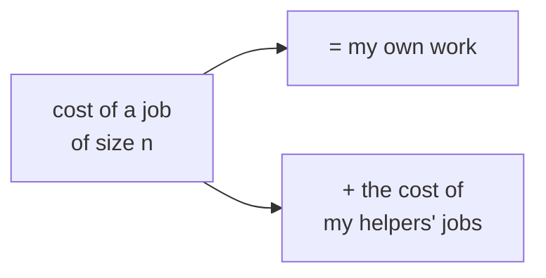
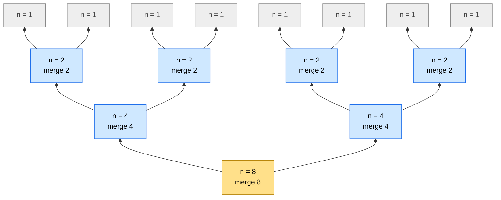
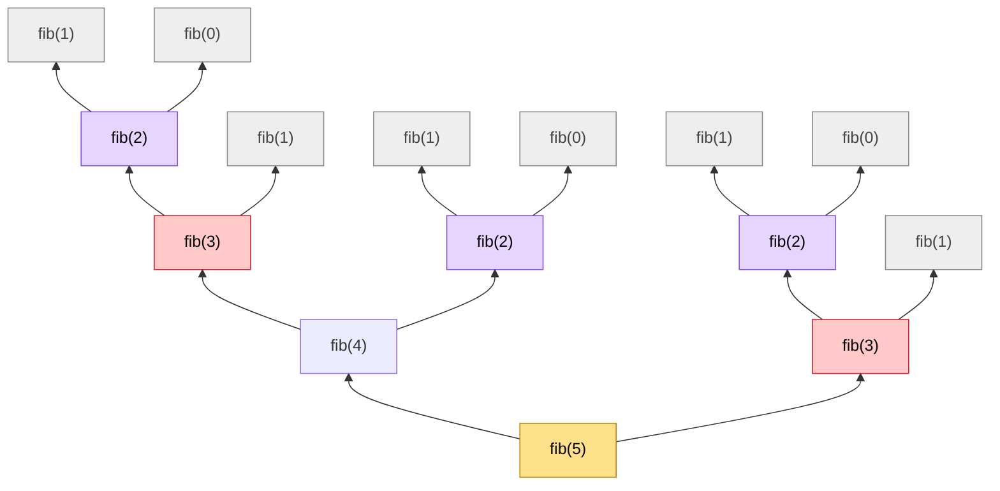
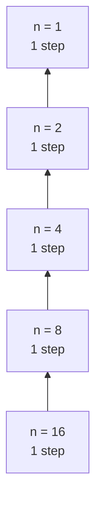
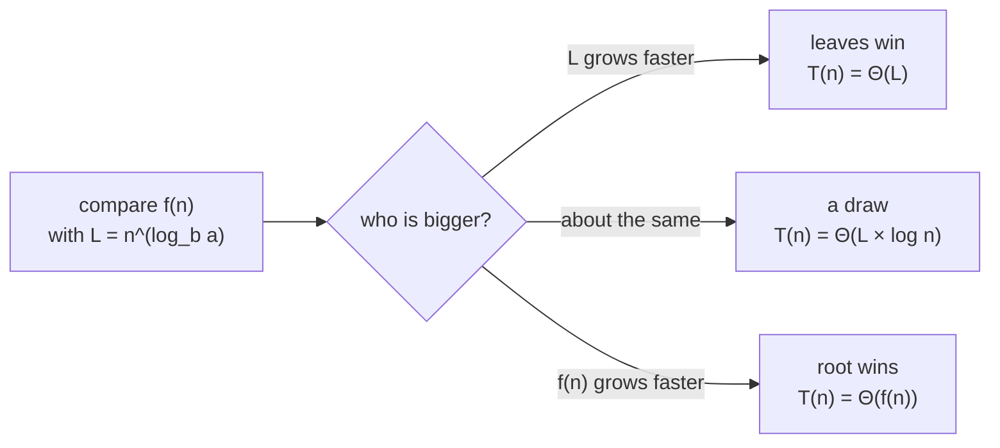
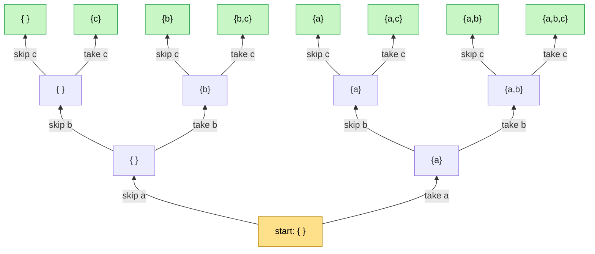
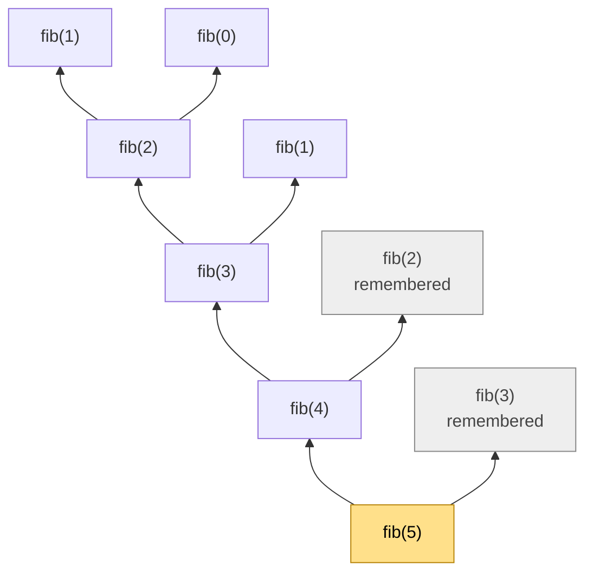

# 07 · Recurrences

> After this chapter you can find the time and space complexity of **any recursive function** — by
> unrolling it, by drawing its recursion tree, or with the Master theorem.

⬅️ [06 · Big-O and Time Complexity](../06-big-o-time-complexity/) · 🏠 [Roadmap](../README.md) · [08 · Divisors and the Square Root Trick](../08-divisors-and-sqrt-trick/) ➡️

## Contents

1. [Why this matters for DSA](#1-why-this-matters-for-dsa)
2. [What a recurrence is](#2-what-a-recurrence-is)
3. [Writing the recurrence from code](#3-writing-the-recurrence-from-code)
4. [Method 1: unrolling](#4-method-1-unrolling)
5. [Method 2: the recursion tree](#5-method-2-the-recursion-tree)
6. [Method 3: the Master theorem](#6-method-3-the-master-theorem)
7. [Many branches: branches to the power depth](#7-many-branches-branches-to-the-power-depth)
8. [Space complexity of recursion](#8-space-complexity-of-recursion)
9. [Memoization changes everything](#9-memoization-changes-everything)
10. [The recurrence cheat table](#10-the-recurrence-cheat-table)
11. [Java code](#11-java-code)
12. [Common mistakes](#12-common-mistakes)
13. [Interview patterns](#13-interview-patterns)
14. [Exercises](#14-exercises)
15. [One-minute recap](#15-one-minute-recap)

---

## 1. Why this matters for DSA

Loops are easy to count (chapter [06](../06-big-o-time-complexity/)). Recursion is harder: the function
calls **itself**, so its cost depends on its own cost. Yet recursion is everywhere in interviews:

- **divide and conquer** — merge sort, quick sort, binary search, fast power;
- **trees and graphs** — every DFS is recursive;
- **backtracking** — subsets, permutations, N-Queens, word search;
- **dynamic programming** — which starts as a recursion and becomes fast with memoization.

For all of them the interviewer will ask *"what's the complexity?"* — and "it's recursive, so … O(n²)?"
is not an answer. This chapter gives you three methods that always work.

---

## 2. What a recurrence is

Remember the **expectation and faith** of the [Tower of Hanoi lesson](../../dsa/recursion/tower-of-hanoi/):
a function does a little work itself and trusts smaller copies of itself (its "helpers") with the rest.
The **cost** works exactly the same way:



We write **T(n)** for "the number of steps for an input of size n". An equation that describes T(n) using
T of smaller sizes is a **recurrence**. For the Tower of Hanoi:

> T(n) = **2 T(n − 1)** + **1**, and T(0) = 0.
>
> Two helpers, each moving n − 1 disks, plus my own single move of the biggest disk.

Every recurrence has two parts, just like every recursive function:

- the **recursive part** — how many helpers, and how big their jobs are;
- the **base case** — the cost of the smallest job, usually a constant: T(1) = 1 or T(0) = 0.

---

## 3. Writing the recurrence from code

A three-question recipe:

1. **How many recursive calls** does one call make, and **how big** is the input of each? (n − 1? n / 2?)
2. **How much work** does one call do **outside** the recursive calls? (O(1)? a loop over n?)
3. **What is the base case**?

Then write **T(n) = (the helpers' costs) + (my own work)**.

| Code | Recurrence | Why |
|---|---|---|
| `fact(n) = n * fact(n - 1)` | T(n) = T(n − 1) + O(1) | one helper of size n − 1, one multiplication |
| binary search: look at the middle, recurse into one half | T(n) = T(n / 2) + O(1) | one helper of half the size |
| merge sort: sort both halves, then merge | T(n) = 2 T(n / 2) + O(n) | two half-size helpers, merging costs n |
| visit both children of a balanced tree | T(n) = 2 T(n / 2) + O(1) | two half-size helpers, O(1) at the node |
| `fib(n) = fib(n - 1) + fib(n - 2)` | T(n) = T(n − 1) + T(n − 2) + O(1) | two helpers of different sizes |
| Tower of Hanoi | T(n) = 2 T(n − 1) + O(1) | two helpers of size n − 1, one move |
| find the minimum with a loop, then recurse on the rest | T(n) = T(n − 1) + O(n) | one helper, but a loop over n first |

```java
// T(n) = 2T(n/2) + O(n): merge sort
void mergeSort(int[] a, int lo, int hi) {
    if (lo >= hi) return;                  // base case: 0 or 1 element, O(1)
    int mid = lo + (hi - lo) / 2;
    mergeSort(a, lo, mid);                 // helper 1: size n/2
    mergeSort(a, mid + 1, hi);             // helper 2: size n/2
    merge(a, lo, mid, hi);                 // my own work: O(n)
}
```

---

## 4. Method 1: unrolling

**Unrolling** (also called *substitution*) means: replace T(…) by its own formula again and again until you
see the pattern, then jump to the base case.

**Example A: T(n) = T(n − 1) + 1, T(0) = 0** (factorial, walking a linked list)

```text
 T(n) = T(n-1) + 1
      = T(n-2) + 1 + 1          = T(n-2) + 2
      = T(n-3) + 3
      ...
      = T(n-k) + k              <- the pattern
      = T(0) + n                <- choose k = n to reach the base case
      = n                       ->  O(n)
```

**Example B: T(n) = T(n − 1) + n, T(0) = 0** (recursive selection sort)

```text
 T(n) = n + T(n-1)
      = n + (n-1) + T(n-2)
      = n + (n-1) + (n-2) + ... + 1 + T(0)
      = n(n+1)/2                ->  O(n^2)       (the Gauss sum, chapter 05)
```

**Example C: T(n) = T(n / 2) + 1, T(1) = 1** (binary search)

```text
 T(n) = T(n/2) + 1
      = T(n/4) + 2
      = T(n/8) + 3
      ...
      = T(n/2^k) + k            <- n/2^k = 1 when k = log2(n)
      = T(1) + log2(n)
      = log2(n) + 1             ->  O(log n)
```

**Example D: T(n) = 2 T(n − 1) + 1, T(0) = 0** (Tower of Hanoi)

```text
 T(n) = 2 T(n-1) + 1
      = 2 (2 T(n-2) + 1) + 1          = 4 T(n-2) + 2 + 1
      = 8 T(n-3) + 4 + 2 + 1
      ...
      = 2^n T(0) + (2^(n-1) + ... + 4 + 2 + 1)
      = 0 + 2^n - 1                   ->  O(2^n)     (the geometric sum, chapter 05)
```

So Hanoi with 10 disks needs exactly 2¹⁰ − 1 = 1,023 moves — the Java output below confirms it.

**Example E: T(n) = T(n / 2) + n** (quickselect, on average)

```text
 T(n) = n + T(n/2)
      = n + n/2 + T(n/4)
      = n + n/2 + n/4 + n/8 + ... + 1
      < 2n                             ->  O(n)       (the halving series, chapter 05)
```

🧠 **How to think of it yourself:** unroll **three** times, then write the **k-th** line with a k in it.
Ask "which k reaches the base case?" and put it in. The leftover sum is always one of the sums from
chapter [05](../05-sums-and-series/): Gauss, geometric or halving.

---

## 5. Method 2: the recursion tree

Unrolling is algebra. The **recursion tree** is the same idea as a **picture**: draw every call as a box,
write in each box the work that call does **itself**, and add up the boxes **level by level**.
As always in this course, the tree grows **from the bottom** like a real tree 🌳: the first call is the
**root at the bottom**, and each call's helpers sit just above it.

### 5.1 Merge sort

The recurrence is **T(n) = 2 T(n / 2) + n**.

For n = 8, every box shows the size of its piece and the merging work it does:



Now add up each level (each number is the work of one call):

```text
 level 3   1   1   1   1   1   1   1   1      8 pieces of size 1: base cases
           └─┬─┘   └─┬─┘   └─┬─┘   └─┬─┘
 level 2     2       2       2       2        4 × 2 = 8
             └───┬───┘       └───┬───┘
 level 1         4               4            2 × 4 = 8
                 └───────┬───────┘
 level 0                 8                    1 × 8 = 8     (the root: the first call)
```

The magic: **every merging level costs exactly n** — twice as many calls, each half as big. There are
log₂ n merging levels (8 → 4 → 2 → 1 is 3 halvings), so the total is **n × log₂ n = O(n log n)**.
The Java file checks this for 16 numbers: 4 merging levels × 16 = 64 elements merged.

### 5.2 Fibonacci

The recurrence is **T(n) = T(n − 1) + T(n − 2) + 1**.

The plain recursive `fib(5)`:



15 calls for `fib(5)` — and look at the colours: **fib(3) is computed twice** (red) and **fib(2) three
times** (purple). The same work is repeated again and again. Every level has up to twice as many boxes as
the level below, so the number of calls grows like **φⁿ ≈ 1.618ⁿ** — exponential. The Java file counts
**2,692,537 calls for fib(30)**. Section 9 fixes this.

### 5.3 Binary search

The recurrence is **T(n) = T(n / 2) + 1**.

Only **one** helper per call, so the "tree" is a single stick:



log₂ n + 1 levels of 1 step each → **O(log n)**.

### 5.4 Who does the most work?

Compare the three pictures:

- In **merge sort** every level does the **same** work (n), so total = n × (number of levels).
- In **Fibonacci** each level does **more** work than the one below → the **top levels** (the leaves)
  dominate → exponential.
- In **T(n) = T(n / 2) + n** each level does **half** the work of the level below → the **root** dominates:
  n + n/2 + n/4 + … < 2n.

This "root versus leaves" contest is exactly what the Master theorem measures. 🏆

---

## 6. Method 3: the Master theorem

A shortcut for the very common divide-and-conquer shape:

> **T(n) = a · T(n / b) + f(n)**
>
> **a** = how many helpers, **b** = how many times smaller each helper's job is,
> **f(n)** = my own work.

In the recursion tree, the number of calls is multiplied by **a** on every level, and there are log_b n
levels, so there are **a^(log_b n) = n^(log_b a) leaves**. Let **L = n^(log_b a)** — the work of the
leaves. Then it is a **tug-of-war** between the root's work f(n) and the leaves' work L:



(For the "root wins" case, f(n) must grow faster than L by a clear power of n, like n² versus n — that is
true for every example you will meet in interviews.)

| Recurrence | a | b | f(n) | L = n^(log_b a) | winner | T(n) | Where |
|---|---|---|---|---|---|---|---|
| T(n/2) + 1 | 1 | 2 | 1 | n⁰ = 1 | draw | **log n** | binary search, fast power |
| 2T(n/2) + 1 | 2 | 2 | 1 | n | leaves | **n** | tree traversal, max by halves |
| 2T(n/2) + n | 2 | 2 | n | n | draw | **n log n** | merge sort |
| T(n/2) + n | 1 | 2 | n | 1 | root | **n** | quickselect (average) |
| 3T(n/3) + n | 3 | 3 | n | n | draw | **n log n** | three-way merge sort |
| 4T(n/2) + n | 4 | 2 | n | n² | leaves | **n²** | naive split multiplication |
| 3T(n/2) + n | 3 | 2 | n | n^1.585 | leaves | **n^1.585** | Karatsuba multiplication |
| 2T(n/2) + n² | 2 | 2 | n² | n | root | **n²** | |
| 8T(n/2) + n² | 8 | 2 | n² | n³ | leaves | **n³** | block matrix multiplication |

⚠️ **When the Master theorem does not apply:**

- the size **shrinks by subtraction**, like T(n − 1) or T(n − 2) — use unrolling or a recursion tree
  (Hanoi, Fibonacci, factorial);
- the pieces have **different sizes**, like T(n/3) + T(2n/3) + n — draw the recursion tree (every level costs
  at most n and there are about log n levels → O(n log n)).

---

## 7. Many branches: branches to the power depth

Backtracking functions call themselves several times and go many levels deep. Use this rule:

> A function that makes **b** calls per level and goes **d** levels deep makes about **bᵈ** calls at the
> bottom level (the leaves).

**Subsets** of {a, b, c}: at every level we decide one item — **skip it or take it** — so b = 2 and d = n.
The decision tree (root at the bottom!) has 2³ = 8 leaves, one for every subset:



**Permutations** of n items: n choices for the first place, n − 1 for the second, … → **n!** leaves.

| Problem | Leaves | Work per leaf | Time |
|---|---|---|---|
| all subsets (LeetCode 78) | 2ⁿ | copy up to n items | **O(2ⁿ × n)** |
| all permutations (LeetCode 46) | n! | copy n items | **O(n! × n)** |
| all combinations of size k (LeetCode 77) | C(n, k) | copy k items | **O(C(n, k) × k)** |
| N-Queens (LeetCode 51) | at most n! | check a board | about **O(n!)** |
| word search from one cell (LeetCode 79), word length L | at most 4 × 3^(L−1) | O(1) | **O(3^L)** per start cell |

Real numbers from the Java file:

```text
   function                              n        leaves         calls
   subsets: 2 branches, depth n          3             8            15
   subsets: 2 branches, depth n         10         1,024         2,047
   subsets: 2 branches, depth n         20     1,048,576     2,097,151
   permutations: n, n-1, ... choices     3             6            16
   permutations: n, n-1, ... choices     5           120           326
   permutations: n, n-1, ... choices     8        40,320       109,601
```

Notice: the total number of calls is at most about **twice** the number of leaves for subsets
(1 + 2 + 4 + … + 2ⁿ = 2ⁿ⁺¹ − 1). The leaves are the whole story. (Counting like this is the topic of
chapter [13](../13-counting-and-combinatorics/).)

---

## 8. Space complexity of recursion

Every call that is still waiting for its helpers takes a **plate** on the call stack
(see "the call stack — a pile of plates" in the [Tower of Hanoi lesson](../../dsa/recursion/tower-of-hanoi/)).
The pile is only as tall as the **longest path from the root to a leaf** — the **height** of the recursion
tree — **not** the number of calls.

| Function | Calls (time) | Height of the tree (space) |
|---|---|---|
| factorial(n) | n | **n** |
| binary search | log n | **log n** |
| merge sort | about 2n | **log n** (plus O(n) for the helper array) |
| Tower of Hanoi | 2ⁿ − 1 | **n** |
| plain fib(n) | about 1.618ⁿ | **n** |
| subsets of n items | 2ⁿ⁺¹ − 1 | **n** |

⚠️ Java's call stack is limited. Recursion that goes about 10⁴ – 10⁵ levels deep (for example DFS on a long
chain, or `factorial(100000)`) can crash with a `StackOverflowError`. For very deep recursion, use a loop
or your own stack.

---

## 9. Memoization changes everything

Plain `fib` repeats the same subproblems (section 5.2). **Memoization** = remember every answer the first
time you compute it, and look it up afterwards:

```java
static long fibMemo(int n, long[] memo) {
    if (n < 2) return n;
    if (memo[n] != 0) return memo[n];          // already known: O(1)
    memo[n] = fibMemo(n - 1, memo) + fibMemo(n - 2, memo);
    return memo[n];
}
```

Now each fib(k) is computed only **once**; every repeat becomes a quick lookup (the grey boxes):



The rule for memoized recursion (and for dynamic programming):

> **time = (number of different subproblems) × (work per subproblem)**

For fib: n different subproblems × O(1) = **O(n)**, instead of O(1.618ⁿ):

```text
   fib, plain     T(n)=T(n-1)+T(n-2)         30     2,692,537             -         30
   fib, memo      every fib(k) once          30            59             -         30
```

From 2.7 million calls down to 59. 🚀

---

## 10. The recurrence cheat table

| Recurrence | Solution | Where you meet it |
|---|---|---|
| T(n) = T(n − 1) + O(1) | O(n) | factorial, recursion on a linked list |
| T(n) = T(n − 1) + O(n) | O(n²) | recursive selection or insertion sort |
| T(n) = T(n / 2) + O(1) | O(log n) | binary search, fast power |
| T(n) = T(n / 2) + O(n) | O(n) | quickselect (average) |
| T(n) = 2 T(n / 2) + O(1) | O(n) | tree traversal, max by halves |
| T(n) = 2 T(n / 2) + O(n) | O(n log n) | merge sort, quicksort (average) |
| T(n) = 2 T(n − 1) + O(1) | O(2ⁿ) | Tower of Hanoi, subsets |
| T(n) = T(n − 1) + T(n − 2) + O(1) | O(1.618ⁿ) | plain Fibonacci |
| T(n) = n × T(n − 1) + O(1) | O(n!) | permutations |

---

## 11. Java code

The file [`Recurrences.java`](Recurrences.java) runs real recursive functions — factorial, binary search,
max by halves, merge sort, Tower of Hanoi, plain and memoized Fibonacci, subsets and permutations — and
counts their **calls**, the **extra work** outside the calls, and the **deepest stack**. Every function
starts with `enter()` and ends with `leave()`:

```java
static void enter() {
    calls++;
    depth++;
    maxDepth = Math.max(maxDepth, depth);
}

// T(n) = 2T(n - 1) + O(1): Tower of Hanoi; "work" counts the moves
static void hanoi(int n) {
    enter();
    if (n > 0) {
        hanoi(n - 1);
        work++;                 // move the biggest disk
        hanoi(n - 1);
    }
    leave();
}
```

### Run it

```text
cd maths_for_dsa/07-recurrences
java Recurrences.java
```

Output:

```text
1) Calls, extra work and stack depth of real recursive functions
   function                                   n         calls          work  max depth
   factorial      T(n)=T(n-1)+1              10            10             -         10
   factorial      T(n)=T(n-1)+1           1,000         1,000             -      1,000
   binary search  T(n)=T(n/2)+1           1,000            10             -         10
   binary search  T(n)=T(n/2)+1       1,000,000            20             -         20
   max by halves  T(n)=2T(n/2)+1              8            15             -          4
   max by halves  T(n)=2T(n/2)+1      1,000,000     1,999,999             -         21
   merge sort     T(n)=2T(n/2)+n              8            15            24          4
   merge sort     T(n)=2T(n/2)+n          1,024         2,047        10,240         11
   merge sort     T(n)=2T(n/2)+n      1,048,576     2,097,151    20,971,520         21
   Tower of Hanoi T(n)=2T(n-1)+1              3            15          7 mv          4
   Tower of Hanoi T(n)=2T(n-1)+1             10         2,047      1,023 mv         11
   Tower of Hanoi T(n)=2T(n-1)+1             20     2,097,151  1,048,575 mv         21
   fib, plain     T(n)=T(n-1)+T(n-2)         10           177             -         10
   fib, plain     T(n)=T(n-1)+T(n-2)         20        21,891             -         20
   fib, plain     T(n)=T(n-1)+T(n-2)         30     2,692,537             -         30
   fib, memo      every fib(k) once          10            19             -         10
   fib, memo      every fib(k) once          20            39             -         20
   fib, memo      every fib(k) once          30            59             -         30

2) Many branches: branches ^ depth
   function                              n        leaves         calls
   subsets: 2 branches, depth n          3             8            15
   subsets: 2 branches, depth n         10         1,024         2,047
   subsets: 2 branches, depth n         20     1,048,576     2,097,151
   permutations: n, n-1, ... choices     3             6            16
   permutations: n, n-1, ... choices     5           120           326
   permutations: n, n-1, ... choices     8        40,320       109,601

3) Merge sort of 16 numbers, level by level (the recursion tree)
   level   calls   size of each   work per level
       0       1             16      1 x 16 = 16
       1       2              8       2 x 8 = 16
       2       4              4       4 x 4 = 16
       3       8              2       8 x 2 = 16
       4      16              1     (base cases)
   4 merging levels x 16 = 64 elements merged = n log2(n)
```

Things to notice 👀

- Merge sort's work is exactly **n × log₂ n**: 8 × 3 = 24, 1,024 × 10 = 10,240, 1,048,576 × 20 = 20,971,520.
- Tower of Hanoi's moves are exactly **2ⁿ − 1**, but its stack is only n + 1 deep.
- Plain fib(30) makes 2.7 million calls with a stack only 30 deep — **time and space can be very different**.

---

## 12. Common mistakes

1. **"Two recursive calls means O(n²)."** No! Two calls on **n − 1** give O(2ⁿ); two calls on **n / 2** with
   O(1) work give O(n); with O(n) work, O(n log n). Always write the recurrence.
2. **Forgetting the work outside the calls.** Merge sort is O(n log n) *because* of the O(n) merge.
3. **Using the Master theorem on T(n − 1).** It only works when the size is **divided** by b.
4. **Saying space = number of calls.** Space is the **depth** of the recursion, not the number of calls.
5. **Missing repeated subproblems.** If the same arguments come back again and again, memoize.
6. **Calling the same helper twice by accident.** `pow(x, n/2) * pow(x, n/2)` is T(n) = 2T(n/2) + 1 = O(n);
   compute `half = pow(x, n/2)` once and use `half * half` → O(log n).
7. **Off by one in the levels.** A tree that halves n until 1 has log₂ n + 1 levels (the last one holds the
   base cases).
8. **Forgetting Java's stack limit** for recursion 10⁵ levels deep.

---

## 13. Interview patterns

| Pattern | How to recognise it | LeetCode problems |
|---|---|---|
| Divide and conquer | "split into halves", merge results | 912 Sort an Array, 53 Maximum Subarray, 169 Majority Element |
| Halving recursion | the problem size halves each call | 50 Pow(x, n), 704 Binary Search |
| Tree recursion | visit every node once → O(n) | 104 Maximum Depth of Binary Tree, 543 Diameter of Binary Tree, 110 Balanced Binary Tree |
| Overlapping subproblems | the same arguments repeat → memoize, then DP | 509 Fibonacci Number, 70 Climbing Stairs, 198 House Robber, 322 Coin Change |
| Backtracking output size | "all subsets / permutations / combinations" → count the leaves | 78 Subsets, 46 Permutations, 77 Combinations, 39 Combination Sum, 51 N-Queens, 79 Word Search |
| Quickselect | "k-th largest" in average O(n) | 215 Kth Largest Element in an Array |

---

## 14. Exercises

Write the recurrence first, then solve it. Pen and paper! ✏️

### Level 1 · Warm-up

**1.** Write the recurrence for this function and solve it.

```java
int sum(int[] a, int n) {          // sum of the first n elements
    if (n == 0) return 0;
    return a[n - 1] + sum(a, n - 1);
}
```

<details>
<summary>Answer</summary>

**T(n) = T(n − 1) + O(1), T(0) = O(1) → O(n).** One helper of size n − 1 and one addition per call.

</details>

**2.** Unroll T(n) = T(n − 1) + 1 with T(0) = 0. What is T(n)?

<details>
<summary>Answer</summary>

T(n) = T(n − 2) + 2 = … = T(0) + n = **n**.

</details>

**3.** Unroll T(n) = T(n / 2) + 1 with T(1) = 1. What is T(16)?

<details>
<summary>Answer</summary>

T(16) = T(8) + 1 = T(4) + 2 = T(2) + 3 = T(1) + 4 = **5** = log₂ 16 + 1.

</details>

**4.** How many moves does the Tower of Hanoi need for 10 disks?

<details>
<summary>Answer</summary>

T(n) = 2T(n − 1) + 1, T(0) = 0 → T(n) = 2ⁿ − 1, so **1,023 moves**.

</details>

**5.** In the recursion tree of merge sort on 8 items, how many leaves and how many levels are there?

<details>
<summary>Answer</summary>

**8 leaves** (one per item) and **4 levels** (sizes 8, 4, 2, 1 → log₂ 8 + 1).

</details>

**6.** How many calls does the plain recursive `fib(5)` make?

<details>
<summary>Answer</summary>

**15** — count the boxes in the tree of section 5.2 (1 + 2 + 4 + 6 + 2 by level).

</details>

**7.** What is the extra space (stack depth) of the plain recursive `fib(n)`?

<details>
<summary>Answer</summary>

**O(n)** — the longest chain of waiting calls is fib(n) → fib(n − 1) → … → fib(1), even though the number
of calls is exponential.

</details>

### Level 2 · Practice

**8.** Unroll T(n) = T(n − 1) + n with T(0) = 0.

<details>
<summary>Answer</summary>

T(n) = n + (n − 1) + … + 1 = n(n + 1)/2 → **O(n²)**.

</details>

**9.** Unroll T(n) = 2T(n − 1) + 1 with T(0) = 0.

<details>
<summary>Answer</summary>

T(n) = 2ᵏ T(n − k) + (2ᵏ − 1); with k = n: **T(n) = 2ⁿ − 1 → O(2ⁿ)**.

</details>

**10.** Solve T(n) = T(n / 2) + n.

<details>
<summary>Answer</summary>

**O(n)** — unrolled it is n + n/2 + n/4 + … < 2n. (Master theorem: a = 1, b = 2, L = 1, f(n) = n grows
faster → the root wins → Θ(n).)

</details>

**11.** Use the Master theorem: T(n) = 2T(n / 2) + n.

<details>
<summary>Answer</summary>

a = 2, b = 2 → L = n^(log₂ 2) = n. f(n) = n is the same → a draw → **Θ(n log n)** (merge sort).

</details>

**12.** Use the Master theorem: T(n) = 4T(n / 2) + n.

<details>
<summary>Answer</summary>

L = n^(log₂ 4) = n². f(n) = n grows slower → the leaves win → **Θ(n²)**.

</details>

**13.** Use the Master theorem: T(n) = T(n / 2) + n².

<details>
<summary>Answer</summary>

L = n^(log₂ 1) = n⁰ = 1. f(n) = n² grows faster → the root wins → **Θ(n²)**.

</details>

**14.** Use the Master theorem: T(n) = 3T(n / 3) + n.

<details>
<summary>Answer</summary>

L = n^(log₃ 3) = n = f(n) → a draw → **Θ(n log n)**.

</details>

**15.** Use the Master theorem: T(n) = 8T(n / 2) + n².

<details>
<summary>Answer</summary>

L = n^(log₂ 8) = n³. f(n) = n² grows slower → the leaves win → **Θ(n³)**.

</details>

**16.** Write the recurrence and find the complexity:

```java
void solve(int[] a, int lo, int hi) {
    if (hi - lo < 1) return;
    for (int i = lo; i <= hi; i++) { work(a[i]); }   // O(n)
    int mid = lo + (hi - lo) / 2;
    solve(a, lo, mid);
    solve(a, mid + 1, hi);
}
```

<details>
<summary>Answer</summary>

Two half-size helpers plus a loop over the current range: **T(n) = 2T(n / 2) + O(n) → O(n log n)**.

</details>

**17.** Draw the recursion tree of T(n) = 2T(n / 2) + 1 for n = 8 and count the total work.

<details>
<summary>Answer</summary>

Levels have 1, 2, 4, 8 boxes of work 1 each → 1 + 2 + 4 + 8 = **15 = 2n − 1 → O(n)**. The leaves win.
(The Java file's "max by halves" makes exactly 15 calls for n = 8.)

</details>

### Level 3 · Interview

**18.** Plain fib(30) makes 2,692,537 calls; the memoized version makes 59. Explain both numbers' growth.

<details>
<summary>Answer</summary>

Plain: T(n) = T(n − 1) + T(n − 2) + 1 grows like the Fibonacci numbers themselves, about **1.618ⁿ**
(exactly 2 × fib(n + 1) − 1 calls). Memoized: there are only n + 1 different subproblems fib(0 … n), each
computed once with O(1) extra work → **O(n)** (for n ≥ 1, exactly 2n − 1 calls, because every computed
fib(k) makes two calls and the repeats return at once).

</details>

**19.** What is the time complexity of generating **all subsets** of n items when you copy each subset into
the answer list?

<details>
<summary>Answer</summary>

There are 2ⁿ leaves, and copying a subset costs up to n → **O(2ⁿ × n)** time. The extra space (stack) is
O(n), plus the output.

</details>

**20.** What is the time complexity of generating all **permutations** of n distinct items?

<details>
<summary>Answer</summary>

n! leaves, each copied in O(n) → **O(n! × n)**. For n = 8 that is only 40,320 leaves (see the Java output),
but n = 12 already has 479,001,600.

</details>

**21.** This "is the binary tree balanced?" solution calls `height()` at every node. What is its complexity
on a perfectly balanced tree, and on a tree shaped like a chain?

```java
boolean isBalanced(Node node) {
    if (node == null) return true;
    int diff = Math.abs(height(node.left) - height(node.right));   // O(size of subtree)
    return diff <= 1 && isBalanced(node.left) && isBalanced(node.right);
}
```

<details>
<summary>Answer</summary>

Balanced tree: T(n) = 2T(n / 2) + O(n) → **O(n log n)**. Chain: T(n) = T(n − 1) + O(n) → **O(n²)**.
The fix: return the height **and** the balanced flag from one bottom-up recursion, visiting every node once
→ **O(n)**.

</details>

**22.** Compare these two ways to compute xⁿ (n ≥ 0). What are their complexities?

```java
double slow(double x, int n) {
    if (n == 0) return 1;
    double extra = (n % 2 == 1) ? x : 1;
    return slow(x, n / 2) * slow(x, n / 2) * extra;      // two calls!
}

double fast(double x, int n) {
    if (n == 0) return 1;
    double extra = (n % 2 == 1) ? x : 1;
    double half = fast(x, n / 2);                       // one call, used twice
    return half * half * extra;
}
```

<details>
<summary>Answer</summary>

`slow` makes **two** calls on n / 2: T(n) = 2T(n / 2) + 1 → **O(n)** — no better than a plain loop!
`fast` makes **one** call and reuses the result: T(n) = T(n / 2) + 1 → **O(log n)**. (This is fast power,
chapter [11](../11-modular-arithmetic/).)

</details>

**23.** Solve T(n) = T(n / 3) + T(2n / 3) + n with a recursion tree.

<details>
<summary>Answer</summary>

Every level of the tree does **at most n** work in total (the pieces of one level add up to at most n).
The longest path shrinks by a factor 3/2 each level, so there are about log₁.₅ n levels.
Total ≈ n × log n → **O(n log n)**. (The Master theorem cannot be used: the two helpers have different
sizes.)

</details>

**24.** Why can't you use the Master theorem for T(n) = 2T(n − 1) + 1? What do you use instead?

<details>
<summary>Answer</summary>

The Master theorem needs helpers of size **n / b** (division). Here the size goes down by **subtraction**
(n − 1), so the tree has n levels instead of log n. Use **unrolling** (section 4, example D) → 2ⁿ − 1.

</details>

**25.** A recursive DFS visits every cell of a 1000 × 1000 grid, and the path can be one long snake through
all cells. What could go wrong in Java, and how do you avoid it?

<details>
<summary>Answer</summary>

The time is fine — O(10⁶) cells — but the recursion can go **10⁶ levels deep**, which overflows Java's call
stack (`StackOverflowError`). Use an explicit stack (`ArrayDeque`) or BFS with a queue instead of recursion.

</details>

---

## 15. One-minute recap

- A **recurrence** writes the cost of a job as *my own work + the cost of my helpers*: T(n) = … T(smaller) …
- Read it off the code: **how many calls, how big, and how much work outside them**.
- **Unroll** three times, spot the k-th line, jump to the base case, finish with a sum from chapter 05.
- **Recursion tree** (root at the bottom): write each call's own work in its box, add level by level.
  Merge sort: n per level × log n levels = n log n.
- **Master theorem** for T(n) = aT(n/b) + f(n): compare f(n) with L = n^(log_b a) — leaves win → L,
  draw → L log n, root wins → f(n). Not for T(n − 1).
- **Backtracking:** about branches^depth leaves — subsets 2ⁿ, permutations n!.
- **Space = the depth** of the recursion, not the number of calls.
- **Memoization:** time = number of different subproblems × work per subproblem (fib: 1.618ⁿ → n).

Next: [08 · Divisors and the Square Root Trick](../08-divisors-and-sqrt-trick/) ➡️
