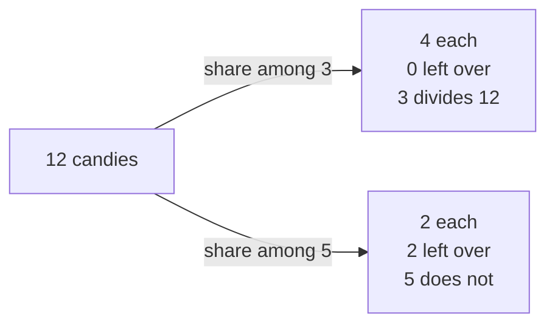
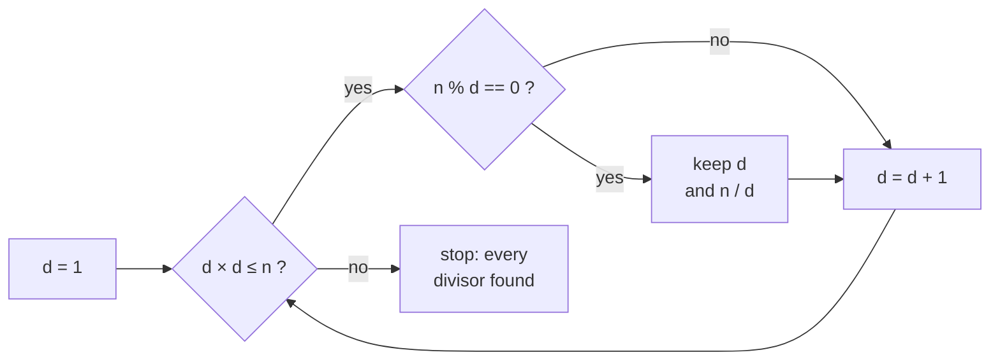
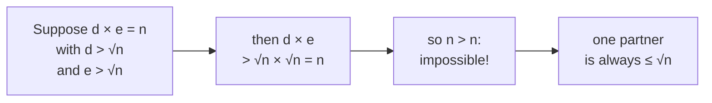

# 08 · Divisors and the Square Root Trick

> After this chapter you can find every divisor of a number as big as 10¹² in a blink — and explain
> exactly **why checking up to √n is enough**.

⬅️ [07 · Recurrences](../07-recurrences/) · 🏠 [Roadmap](../README.md) · [09 · Prime Numbers](../09-prime-numbers/) ➡️

## Contents

1. [Why this matters for DSA](#1-why-this-matters-for-dsa)
2. [What divides means](#2-what-divides-means)
3. [Quick divisibility rules](#3-quick-divisibility-rules)
4. [Finding divisors the slow way](#4-finding-divisors-the-slow-way)
5. [Divisors come in pairs](#5-divisors-come-in-pairs)
6. [The square root trick](#6-the-square-root-trick)
7. [Why the trick never misses a divisor](#7-why-the-trick-never-misses-a-divisor)
8. [Perfect squares and the middle pair](#8-perfect-squares-and-the-middle-pair)
9. [Divisors in sorted order](#9-divisors-in-sorted-order)
10. [Counting multiples without a loop](#10-counting-multiples-without-a-loop)
11. [Divisors of every number up to n](#11-divisors-of-every-number-up-to-n)
12. [Java code](#12-java-code)
13. [Common mistakes](#13-common-mistakes)
14. [Interview patterns](#14-interview-patterns)
15. [Exercises](#15-exercises)
16. [One-minute recap](#16-one-minute-recap)

---

## 1. Why this matters for DSA

"Divisors" and "factors" show up in many interview problems — and the **√n trick** is the tool behind
almost all of them:

- listing or counting the divisors of n in **O(√n)** instead of O(n) — for n = 10¹² that is
  a million steps instead of a trillion;
- **testing if a number is prime** and **breaking it into primes** (next chapter,
  [09](../09-prime-numbers/)) — both stop at √n for the same reason;
- puzzles hiding a divisor argument, like *Bulb Switcher* (the answer is just ⌊√n⌋!);
- counting multiples in a range with one division, and the "visit all multiples" loop that costs only
  O(n log n).

> **The whole chapter in one sentence:** divisors come in pairs d × (n / d), and the smaller one of every
> pair is at most √n — so you only have to look up to √n.

---

## 2. What divides means

🍬 **A story.** You have 12 candies and want to share them **equally**, with nothing left over.



With 1, 2, 3, 4, 6 or 12 friends it works perfectly. With 5 friends, 2 candies are left over.

We say **d divides n** when n can be cut into groups of exactly d with **nothing left over**. In code:

```java
boolean divides = n % d == 0;     // the remainder is 0
```

Words you will hear, all meaning the same thing for 3 and 12:

- 3 **divides** 12,
- 3 is a **divisor** (or **factor**) of 12,
- 12 is a **multiple** of 3,
- 12 is **divisible** by 3.

Another way to see divisors: they are the **rectangles** you can build with the candies.

```text
 1 × 12:  o o o o o o o o o o o o

 2 × 6:   o o o o o o
          o o o o o o

 3 × 4:   o o o o
          o o o o
          o o o o
```

Turning a rectangle on its side gives 4 × 3, 6 × 2 and 12 × 1 — **the same rectangles**. Keep that in
mind: it is the whole secret of this chapter. 🤫

Small facts that are always true (for n ≥ 1):

- **1** divides every number, and every number divides **itself**.
- A divisor of n is never bigger than n.
- Never use d = 0: `n % 0` throws an `ArithmeticException`. (Problems usually say n ≥ 1.)

---

## 3. Quick divisibility rules

In code you just use `%`. But these rules help with mental maths, with digit problems
(chapter [02](../02-digits-and-number-bases/)), and they explain *why* remainders behave the way they do
(chapter [11](../11-modular-arithmetic/)).

| Divisible by | Rule | Example | Why it works |
|---|---|---|---|
| 2 | last digit is even | 3,578 | 10 is divisible by 2, so only the last digit matters |
| 5 | last digit is 0 or 5 | 1,235 | 10 is divisible by 5 |
| 10 | last digit is 0 | 4,560 | 10 divides every "tens" part |
| 4 | last two digits divisible by 4 | 7,316 (16) | 100 is divisible by 4 |
| 8 | last three digits divisible by 8 | 5,120 (120) | 1000 is divisible by 8 |
| 3 | digit sum divisible by 3 | 123,456 (sum 21) | see below |
| 9 | digit sum divisible by 9 | 4,185 (sum 18) | see below |
| 6 | divisible by 2 **and** by 3 | 7,314 | 6 = 2 × 3 |
| 11 | alternating digit sum divisible by 11 | 918,082 | 10 = 11 − 1 |

**Why the digit-sum rule works for 3 and 9.** Write 4,185 by place value:

```text
 4185 = 4 × 1000 + 1 × 100 + 8 × 10 + 5
      = 4 × (999 + 1) + 1 × (99 + 1) + 8 × (9 + 1) + 5
      = (4 × 999 + 1 × 99 + 8 × 9)  +  (4 + 1 + 8 + 5)
        \___ always a multiple of 9 ___/    \_ digit sum = 18 _/
```

The first part is always divisible by 9 (and by 3). So 4,185 is divisible by 9 exactly when its digit sum
is. 18 is divisible by 9, so 4,185 is too: 4,185 = 9 × 465 ✅.

**Why the rule for 11 works.** 10 = 11 − 1, 100 = 99 + 1, 1000 = 1001 − 1, … so the place values are
alternately "a multiple of 11 minus 1" and "a multiple of 11 plus 1". For 918,082, from the right:
2 − 8 + 0 − 8 + 1 − 9 = −22, which is divisible by 11, so 918,082 is too (= 11 × 83,462).

🧠 **How to think of it yourself:** a divisibility rule always comes from asking *"what is 10, 100,
1000 … when I divide by d?"* If the answer is 0 (for 2, 5, 10) only the last digits matter; if it is 1
(for 3, 9) every digit counts the same.

---

## 4. Finding divisors the slow way

The obvious way: try **every** d from 1 to n.

```java
for (long d = 1; d <= n; d++) {
    if (n % d == 0) {
        // d is a divisor
    }
}
```

It is correct, but it takes **n steps**. For n = 10¹² that is a trillion steps — about **3 hours** at
10⁸ steps per second (chapter [06](../06-big-o-time-complexity/)). An interviewer will ask: *"Can you do
better?"* Yes — a **million** times better.

---

## 5. Divisors come in pairs

Here is the key observation. If d divides n, then **n / d divides n too**, because d × (n / d) = n.
Divisors hold hands in **pairs**. 🤝

For n = 36:

```text
 small partner   ×   big partner   =  36
       1         ×        36
       2         ×        18
       3         ×        12
       4         ×         9
       6         ×         6        <- the middle pair: 6 × 6 = 36
```

Put all divisors of 36 on a line and connect each pair — they mirror each other around **6 = √36**:

```text
    ┌─────────────────────── 1 × 36 ────────────────────────┐
    │      ┌──────────────── 2 × 18 ─────────────────┐      │
    │      │      ┌───────── 3 × 12 ──────────┐      │      │
    │      │      │      ┌─── 4 × 9 ───┐      │      │      │
    │      │      │      │             │      │      │      │
    1      2      3      4      6      9      12     18     36
                                ▲
                  6 × 6 = 36: 6 is its own partner (6 = √36)

 <-- small partners (<= 6) -->      <--- big partners (>= 6) --->
```

Look closely:

- Every pair has **one partner on the left of √36 and one on the right**.
- As the small partner grows (1, 2, 3, 4, 6), the big partner shrinks (36, 18, 12, 9, 6).
- They **meet in the middle** at √36 = 6.

So once you know all the small partners, you get the big ones for free: big = n / small. 🎁

---

## 6. The square root trick

Walk d upward from 1. Every time d divides n, write down **both** d and n / d. Stop as soon as d passes
√n — every pair has already been found.



```java
for (long d = 1; d * d <= n; d++) {      // same as d <= √n, but exact and fast
    if (n % d == 0) {
        small.add(d);
        if (d != n / d) {                // a perfect square's middle pair counts once
            big.add(n / d);
        }
    }
}
```

Trace for n = 36 — the loop stops after d = 6, because 7 × 7 = 49 > 36:

| d | d × d ≤ 36? | 36 % d | found |
|---|---|---|---|
| 1 | 1 ✅ | 0 | 1 and 36 |
| 2 | 4 ✅ | 0 | 2 and 18 |
| 3 | 9 ✅ | 0 | 3 and 12 |
| 4 | 16 ✅ | 0 | 4 and 9 |
| 5 | 25 ✅ | 1 | — |
| 6 | 36 ✅ | 0 | 6 (only once!) |
| 7 | 49 ❌ | — | stop |

**How much faster is it?** The loop runs about √n times instead of n times:

| n | slow way (n steps) | √n trick (√n steps) |
|---|---|---|
| 100 | 100 | 10 |
| 1,000,000 | 1,000,000 | 1,000 |
| 10¹² | 1,000,000,000,000 (hours) | 1,000,000 (a blink) |

📌 Why write `d * d <= n` instead of `d <= Math.sqrt(n)`?

- `Math.sqrt` works with doubles, which can be off by a hair for huge numbers (chapter
  [03](../03-powers-and-roots/)); `d * d <= n` is exact.
- Use a **`long`** for d: with an `int`, 46,341 × 46,341 overflows to a negative number and the loop
  goes wrong (see the Java output below). `d <= n / d` is another overflow-free way to write it.

---

## 7. Why the trick never misses a divisor

We stopped at √n. Could a pair be hiding where **both** partners are bigger than √n? Let's check with
a picture. A pair d × e = n is a rectangle of area n:

```text
 area 36 as a square          area 36 as a rectangle        both sides > 6?
 +------+                     +---------+                   +-----------+
 |      |                     |         |                   |           |
 |  36  |  6 × 6              |   36    |  4 × 9            |    49     |  7 × 7
 |      |                     |         |                   |           |
 +------+                     +---------+                   |           |
                                                            +-----------+
 both sides = 6               one side short, one long      too big: area 49, not 36!
```

If both sides were longer than 6, the area would be **more than 36**. So in every pair, at least one
partner is **≤ √n**. Here is the same argument, step by step:



This is a **proof by contradiction** (chapter [16](../16-logic-sets-and-proofs/)): we assumed the
opposite and reached nonsense.

🧠 **How to think of it yourself:** whenever two numbers **multiply** to n — divisors, factor pairs,
i × j ≤ n loops — the smaller one is at most √n. Ask *"can I just loop over the smaller one?"*

---

## 8. Perfect squares and the middle pair

When d × d = n exactly, d is its **own** partner — like 6 × 6 = 36. That pair has only **one** divisor,
so we must not count it twice (that is the `if (d != n / d)` check).

It also explains a lovely fact: **only perfect squares have an odd number of divisors.**
Every other divisor comes in a pair of two different numbers; only a square has the lonely middle one.

```text
 n:        1  2  3  4  5  6  7  8  9 10 11 12 13 14 15 16
 count:    1  2  2  3  2  4  2  4  3  4  2  6  2  4  4  5
 square:   ^        ^              ^                    ^     <- odd counts!
```

### A famous interview puzzle: Bulb Switcher (LeetCode 319)

There are n bulbs, all off. In round 1 you toggle every bulb, in round 2 every 2nd bulb, in round 3
every 3rd bulb, … up to round n. How many bulbs are on at the end?

Bulb k is toggled in round d exactly when **d divides k**. So bulb k is toggled once per divisor:

```text
 bulb:         1   2   3   4   5   6   7   8   9  10
 toggled in    1   1   1   1   1   1   1   1   1   1
 round:            2       2       2       2       2
                       3           3           3
                           4               4
                               5                   5
                                   6
                                       7
                                           8
                                               9
                                                  10
 toggles:      1   2   2   3   2   4   2   4   3   4
 at the end:  ON  ..  ..  ON  ..  ..  ..  ..  ON  ..
```

A bulb ends **on** when it was toggled an **odd** number of times — that is, when k is a **perfect
square**. So the answer is the number of squares ≤ n, which is **⌊√n⌋**: 3 for n = 10, 10 for n = 100.
No simulation needed! 💡

---

## 9. Divisors in sorted order

The small partners come out in **increasing** order (1, 2, 3, …) and the big partners in
**decreasing** order (36, 18, 12, …). So: keep two lists, reverse the big one, and glue them.

```text
 small (found in order):     [1, 2, 3, 4, 6]
 big   (found in order):     [36, 18, 12, 9]
 big reversed:               [9, 12, 18, 36]
 all divisors, sorted:       [1, 2, 3, 4, 6, 9, 12, 18, 36]
```

This solves **The kth Factor of n** (LeetCode 1492) in O(√n): build the sorted list and return
element k − 1 (or −1 if there are fewer than k divisors). For n = 36 and k = 7 the answer is **12**.

---

## 10. Counting multiples without a loop

How many multiples of 7 are there from 1 to 50?

```text
  7   14   21   28   35   42   49 | 56
  1    2    3    4    5    6    7 |  8    <- 56 is already past 50
```

The multiples are 7 × 1, 7 × 2, …, 7 × m, and the last one must be ≤ 50. So m is the biggest number with
7 × m ≤ 50, which is **⌊50 / 7⌋ = 7**. In Java, integer division does the floor for you: `50 / 7 == 7`.

> **Multiples of k in [1, n] = n / k** (integer division).
>
> **Multiples of k in [L, R] = R / k − (L − 1) / k** — all multiples up to R, minus those below L.

Example: multiples of 7 in [50, 100] = 100 / 7 − 49 / 7 = 14 − 7 = **7**
(they are 56, 63, 70, 77, 84, 91, 98 ✅).

**"Divisible by 3 or 5"** — add both counts, then subtract the numbers counted twice (multiples of both,
that is of 15):

```text
 numbers in [1, 1000] divisible by 3 or 5 = 1000/3 + 1000/5 - 1000/15
                                          =  333   +  200   -   66     = 467
```

This "add, then remove the double counts" idea is called **inclusion–exclusion**
(chapter [13](../13-counting-and-combinatorics/)).

---

## 11. Divisors of every number up to n

Sometimes you need the divisor count of **every** number from 1 to n. Doing the √ trick for each one costs
about n × √n. There is a smarter way: **flip the loops**. Instead of asking "who divides m?", let every d
visit its own multiples d, 2d, 3d, … and give each one a +1.

```java
for (int d = 1; d <= n; d++) {
    for (int m = d; m <= n; m += d) {   // m = d, 2d, 3d, ...
        count[m]++;                    // d divides m
    }
}
```

Each row marks the multiples of one d. Each **column** collects the divisors of one m:

```text
 d \ m     1  2  3  4  5  6  7  8  9 10 11 12    marks
 d = 1     x  x  x  x  x  x  x  x  x  x  x  x       12
 d = 2        x     x     x     x     x     x        6
 d = 3           x        x        x        x        4
 d = 4              x           x           x        3
 d = 5                 x              x              2
 d = 6                    x                 x        2
 d = 7                       x                       1
 d = 8                          x                    1
 d = 9                             x                 1
 d = 10                               x              1
 d = 11                                  x           1
 d = 12                                     x        1
 count:     1  2  2  3  2  4  2  4  3  4  2  6       35
```

How many marks in total? Row d has n / d marks, so the total is

> n/1 + n/2 + n/3 + … + n/n = n × (1 + 1/2 + 1/3 + … + 1/n) ≈ **n ln n**

That bracket is the **harmonic series** from chapter [05](../05-sums-and-series/). For n = 1,000,000 the
loop makes 13,970,034 steps — about 70 times fewer than n × √n = 10⁹. The same "visit all multiples"
loop powers the **Sieve of Eratosthenes** in the next chapter. 🚀

---

## 12. Java code

The file [`Divisors.java`](Divisors.java) runs every idea of this chapter. The heart of it:

```java
// Fast way: divisors come in pairs (d, n / d), so stop once d * d > n.
static List<Long> divisorsFast(long n) {
    List<Long> small = new ArrayList<>();
    List<Long> big = new ArrayList<>();
    for (long d = 1; d * d <= n; d++) {
        if (n % d == 0) {
            small.add(d);
            if (d != n / d) {        // the middle pair of a square counts once
                big.add(n / d);
            }
        }
    }
    Collections.reverse(big);        // big partners come out largest first
    small.addAll(big);
    return small;
}

// How many multiples of k lie in [left, right]? (left >= 1)
static long countMultiples(long left, long right, long k) {
    return right / k - (left - 1) / k;
}

// Divisor counts of every number 1..n: each d visits its own multiples.
static int[] divisorCountsUpTo(int n) {
    int[] count = new int[n + 1];
    for (int d = 1; d <= n; d++) {
        for (int m = d; m <= n; m += d) {
            count[m]++;
        }
    }
    return count;
}
```

### Run it

```text
cd maths_for_dsa/08-divisors-and-sqrt-trick
java Divisors.java
```

Output:

```text
1) Divisors of 36 come in pairs (d, 36 / d)
    1 x 36 = 36
    2 x 18 = 36
    3 x 12 = 36
    4 x  9 = 36
    6 x  6 = 36   <- the middle: d = 36 / d = sqrt(36)

2) Slow way (d = 1..n) vs fast way (stop when d * d > n)
   n                    divisors          slow steps   fast steps
   36                          9                  36            6
   360                        24                 360           18
   1,000,000                  49           1,000,000        1,000
   1,000,000,000,000         169  1,000,000,000,000*    1,000,000
   both ways found the same divisors: true
   * not run: at 10^8 steps a second it would take about 3 hours

3) Divisors of 360: small partners d (d * d <= 360), big partners 360 / d
   small: [1, 2, 3, 4, 5, 6, 8, 9, 10, 12, 15, 18]
   big:   [360, 180, 120, 90, 72, 60, 45, 40, 36, 30, 24, 20]
   24 divisors in total

4) Divisor counts 1..16  (perfect squares have an odd count)
   n:        1  2  3  4  5  6  7  8  9 10 11 12 13 14 15 16
   count:    1  2  2  3  2  4  2  4  3  4  2  6  2  4  4  5
   square:   ^        ^              ^                    ^

5) The int overflow trap in  d * d <= n
   int d = 46341;  d * d = -2147479015   <- negative! (really 2,147,488,281)
   (long) d * d   = 2147488281

6) Divisibility rules with digit sums
           4,185  digit sum = 18   divisible by 3: true   by 9: true
         123,456  digit sum = 21   divisible by 3: true   by 9: false
     999,999,999  digit sum = 81   divisible by 3: true   by 9: true

7) Counting multiples without a loop
   multiples of 7 in [1, 100]  = 14
   multiples of 7 in [50, 100] = 7
   numbers in [1, 1000] divisible by 3 or 5 = 333 + 200 - 66 = 467

8) k-th smallest divisor (LeetCode 1492)
   n = 12, k = 3  -> 3
   n = 36, k = 7  -> 12
   n = 4,  k = 4  -> -1

9) Perfect numbers up to 10,000 (sum of proper divisors = n)
   6 28 496 8128

10) Divisor counts of every number up to n, by visiting multiples
   counts for 1..12: 1 2 2 3 2 4 2 4 3 4 2 6   steps = 35
   n = 1,000,000: steps = 13,970,034  (about n ln n, not n * sqrt(n))
   most divisors below a million: 720,720 has 240 divisors

11) Bulb Switcher (LeetCode 319): bulbs on = perfect squares <= n
   n = 10  -> 3 bulbs on (1, 4, 9)
   n = 100 -> 10 bulbs on

12) Closest factor pair, walking down from sqrt(x) (LeetCode 1362)
      9 =   3 x 3    (difference 0)
     10 =   2 x 5    (difference 3)
    124 =   4 x 31   (difference 27)
    125 =   5 x 25   (difference 20)
   1000 =  25 x 40   (difference 15)
   1001 =  13 x 77   (difference 64)
```

---

## 13. Common mistakes

1. **Looping all the way to n.** Correct, but O(n). Stop when `d * d > n`.
2. **Looping to `d < Math.sqrt(n)`** (with `<`). You miss the middle divisor of perfect squares:
   for 36 you would never test d = 6. Use `d * d <= n`.
3. **Overflow in `d * d`.** With `int d`, 46,341 × 46,341 becomes −2,147,479,015. Use `long d`, or write
   the condition as `d <= n / d`.
4. **Counting √n twice.** For perfect squares, d and n / d are the same number — add it once.
5. **Forgetting the big partners.** The loop only walks up to √n; you must add n / d yourself.
6. **Starting at d = 0.** `n % 0` throws an `ArithmeticException`. Start at 1.
7. **Forgetting 1 and n.** They are divisors too (the pair 1 × n).
8. **Mixing up "all divisors" and "proper divisors".** Perfect numbers use the divisors *smaller* than n.
9. **Off by one when counting multiples in [L, R].** It is `R / k - (L - 1) / k`, not `R / k - L / k`.

---

## 14. Interview patterns

| Pattern | How to recognise it | LeetCode problems |
|---|---|---|
| List or count divisors | "factors", "divisors", "k-th factor" | 1492 The kth Factor of n, 507 Perfect Number, 1390 Four Divisors |
| Common divisors | "common factors of a and b" — use the divisors of gcd(a, b) (chapter [10](../10-gcd-and-lcm/)) | 2427 Number of Common Factors |
| Perfect squares | "toggle", "odd number of divisors", "is it a square?" | 319 Bulb Switcher, 367 Valid Perfect Square, 279 Perfect Squares |
| Closest factor pair | "two numbers with product n and the smallest difference" — walk down from √n | 1362 Closest Divisors, 492 Construct the Rectangle |
| Counting multiples | "how many numbers up to n are divisible by …" | 1201 Ugly Number III, 878 Nth Magical Number |
| Visit all multiples | "for every number up to n …" — the O(n log n) harmonic loop | 204 Count Primes (the sieve in chapter [09](../09-prime-numbers/)) |
| Digit sums and divisibility | "divisible by 3", "digit sum" | 258 Add Digits, 1363 Largest Multiple of Three |

---

## 15. Exercises

Do them on paper first. Open an answer only after you have tried! ✏️

### Level 1 · Warm-up

**1.** List all divisors of 12.

<details>
<summary>Answer</summary>

**1, 2, 3, 4, 6, 12** — the pairs are 1 × 12, 2 × 6 and 3 × 4.

</details>

**2.** Find all divisors of 28 using pairs.

<details>
<summary>Answer</summary>

Pairs: 1 × 28, 2 × 14, 4 × 7 (3, 5 and 6 do not divide 28, and 6 × 6 = 36 > 28, so stop).
Divisors: **1, 2, 4, 7, 14, 28**.

</details>

**3.** Is 4,185 divisible by 9? Use the digit sum.

<details>
<summary>Answer</summary>

**Yes** — 4 + 1 + 8 + 5 = 18, and 18 is divisible by 9. Indeed 4,185 = 9 × 465.

</details>

**4.** Is 123,456 divisible by 3? By 9?

<details>
<summary>Answer</summary>

The digit sum is 1 + 2 + 3 + 4 + 5 + 6 = 21. 21 is divisible by 3 but not by 9, so 123,456 is
**divisible by 3 but not by 9**.

</details>

**5.** Is 918,082 divisible by 11?

<details>
<summary>Answer</summary>

**Yes** — the alternating sum from the right is 2 − 8 + 0 − 8 + 1 − 9 = −22, which is divisible by 11.
(918,082 = 11 × 83,462.)

</details>

**6.** Which divisor of 49 is its own partner?

<details>
<summary>Answer</summary>

**7**, because 7 × 7 = 49 (7 = √49). The divisors of 49 are 1, 7, 49 — an odd count, because 49 is a
perfect square.

</details>

**7.** How many multiples of 7 are there from 1 to 100?

<details>
<summary>Answer</summary>

**14** — 100 / 7 = 14 with integer division (7 × 14 = 98 ≤ 100 < 105).

</details>

**8.** To find all divisors of 100 with the √n trick, up to which d must you test?

<details>
<summary>Answer</summary>

**d = 10**, because 10 × 10 = 100 ≤ 100, and 11 × 11 = 121 > 100.

</details>

### Level 2 · Practice

**9.** Find all divisors of 360 with the pair method. How many are there, and up to which d do you test?

<details>
<summary>Answer</summary>

Test d = 1 … 18 (18 × 18 = 324 ≤ 360 < 19 × 19 = 361). The pairs are:
1 × 360, 2 × 180, 3 × 120, 4 × 90, 5 × 72, 6 × 60, 8 × 45, 9 × 40, 10 × 36, 12 × 30, 15 × 24, 18 × 20.
That is 12 pairs, so **24 divisors**.

</details>

**10.** For n = 10¹², how many loop steps do the slow way and the √n trick take?

<details>
<summary>Answer</summary>

Slow: **10¹² steps** (hours). √n trick: **10⁶ steps** (a few milliseconds) — a million times fewer.

</details>

**11.** Why does 36 have an odd number of divisors (9) while 24 has an even number (8)?

<details>
<summary>Answer</summary>

36 is a **perfect square**: its middle pair is 6 × 6, which gives only one divisor. All other divisors
come in pairs of two different numbers. 24 is not a square, so all its divisors pair up:
1 × 24, 2 × 12, 3 × 8, 4 × 6 → 8 divisors.

</details>

**12.** How many multiples of 7 are there in [50, 100]? Check by listing them.

<details>
<summary>Answer</summary>

**7** — 100 / 7 − 49 / 7 = 14 − 7 = 7. They are 56, 63, 70, 77, 84, 91, 98.

</details>

**13.** What goes wrong with `for (int d = 1; d * d <= n; d++)` when n = 2,147,483,647
(`Integer.MAX_VALUE`)?

<details>
<summary>Answer</summary>

When d reaches 46,341, `d * d` should be 2,147,488,281, but that does not fit in an `int`, so it
**overflows** to −2,147,479,015. A negative number is ≤ n, so the loop does not stop at √n — it keeps
going and reports wrong "small" divisors. Fix: `long d`, or the condition `d <= n / d`.

</details>

**14.** Which numbers from 1 to 30 have **exactly 3** divisors? What do they have in common?

<details>
<summary>Answer</summary>

**4, 9 and 25.** They are squares of primes (2², 3², 5²): the divisors of p² are only 1, p and p².

</details>

**15.** A number is **perfect** if the sum of its divisors smaller than itself equals the number.
Is 28 perfect? Is 12?

<details>
<summary>Answer</summary>

**28 is perfect:** 1 + 2 + 4 + 7 + 14 = 28. **12 is not:** 1 + 2 + 3 + 4 + 6 = 16 ≠ 12.

</details>

**16.** How many numbers from 1 to 1000 are divisible by 3 or by 5?

<details>
<summary>Answer</summary>

**467** — 1000 / 3 + 1000 / 5 − 1000 / 15 = 333 + 200 − 66. Multiples of 15 were counted twice, so we
subtract them once.

</details>

**17.** In the "visit all multiples" loop for n = 12, how many steps are there in total?

<details>
<summary>Answer</summary>

**35** — 12/1 + 12/2 + 12/3 + … + 12/12 = 12 + 6 + 4 + 3 + 2 + 2 + 1 + 1 + 1 + 1 + 1 + 1 = 35.
It is also the sum of all divisor counts from 1 to 12.

</details>

### Level 3 · Interview

**18.** *The kth Factor of n* (LeetCode 1492): explain an O(√n) solution and run it on n = 36, k = 7.

<details>
<summary>Answer</summary>

Walk d from 1 while d × d ≤ n, collecting small divisors in one list and their partners n / d in another
(skip the partner when d = n / d). Reverse the partner list and append it — now all divisors are sorted.
Return the (k − 1)-th element, or −1 if the list is too short. For 36:
[1, 2, 3, 4, 6] + [9, 12, 18, 36] → the 7th divisor is **12**. Time O(√n), space O(number of divisors).

</details>

**19.** *Bulb Switcher* (LeetCode 319): 100 bulbs, 100 rounds. How many bulbs are on at the end, and why?

<details>
<summary>Answer</summary>

**10.** Bulb k is toggled once for every divisor of k. It ends on only if it was toggled an odd number of
times, and only perfect squares have an odd number of divisors. The squares ≤ 100 are
1, 4, 9, …, 100 → ⌊√100⌋ = 10 bulbs.

</details>

**20.** *Closest Divisors* (LeetCode 1362): find two numbers whose product is 124 or 125 and whose
difference is as small as possible. Why is it enough to walk **down** from √x?

<details>
<summary>Answer</summary>

Start at d = ⌊√x⌋ and walk down; the **first** divisor you meet gives the closest pair, because the
closer d is to √x, the closer its partner x / d is too. For 124: √124 ≈ 11.1 → 11, 10, …, 4 → 4 × 31
(difference 27). For 125: 11, 10, …, 5 → 5 × 25 (difference 20). The best pair is **5 × 25**.

</details>

**21.** What is the smallest number with exactly 6 divisors?

<details>
<summary>Answer</summary>

**12** (divisors 1, 2, 3, 4, 6, 12). Every number from 1 to 11 has at most 4 divisors.

</details>

**22.** Prove: if n is **not** a perfect square, then n has an even number of divisors.

<details>
<summary>Answer</summary>

Pair every divisor d with n / d. The two partners are equal only if d × d = n, which would make n a perfect
square. So when n is not a square, every pair contains **two different** divisors, and every divisor is in
exactly one pair. Divisors split into pairs → their number is even.

</details>

**23.** Show that the loop condition `d <= n / d` is the same as `d * d <= n` for positive integers,
and explain why it is safer.

<details>
<summary>Answer</summary>

For whole numbers, d ≤ ⌊n / d⌋ happens exactly when d ≤ n / d, which means d × d ≤ n. So both conditions
stop at the same place. `d <= n / d` never **multiplies**, so it can never overflow — even for `int`
values near 2³¹.

</details>

**24.** *Number of Common Factors* (LeetCode 2427): how many numbers divide both 12 and 18?

<details>
<summary>Answer</summary>

**4** — a common divisor of a and b is exactly a divisor of gcd(a, b) (chapter
[10](../10-gcd-and-lcm/)). gcd(12, 18) = 6, whose divisors are 1, 2, 3, 6.

</details>

**25.** You must answer 100,000 questions *"how many divisors does x have?"* with every x ≤ 1,000,000.
Which approach do you pick, and how many steps does it take?

<details>
<summary>Answer</summary>

**Precompute** all divisor counts up to 10⁶ with the "visit all multiples" loop — about
n ln n ≈ 14 million steps (13,970,034 exactly) — then answer every question in O(1) with an array lookup.
Doing the √x trick per question would cost up to 10⁵ × 10³ = 10⁸ steps.

</details>

---

## 16. One-minute recap

- **d divides n** when `n % d == 0`. Divisors are the rectangles you can build with n candies.
- Divisors come in **pairs** d × (n / d), mirrored around **√n**.
- In every pair one partner is **≤ √n** — if both were bigger, their product would be bigger than n.
- So loop `for (long d = 1; d * d <= n; d++)` and record **d and n / d**: **O(√n)** instead of O(n).
- Count the middle divisor of a perfect square **once**. Only perfect squares have an **odd** number of
  divisors (Bulb Switcher → ⌊√n⌋).
- Multiples of k in [1, n] = **n / k**; in [L, R] = **R / k − (L − 1) / k**.
- For all numbers up to n, let each d **visit its multiples**: n/1 + n/2 + … ≈ **n ln n** steps.

Next: [09 · Prime Numbers](../09-prime-numbers/) ➡️ — where the √n trick finds primes.
