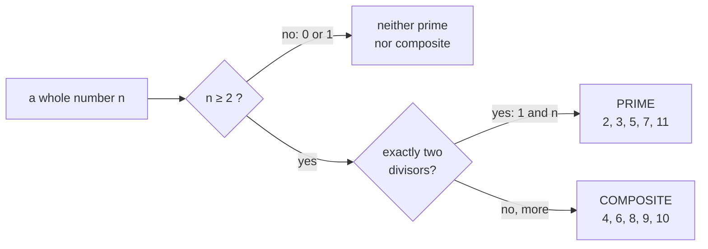
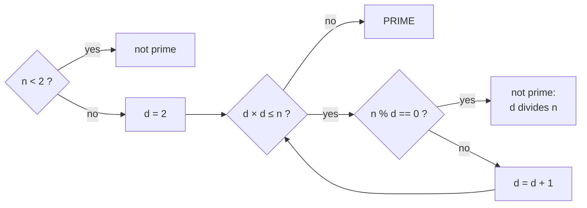
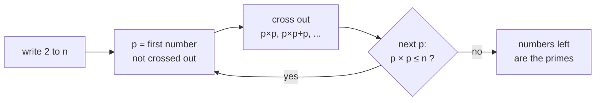
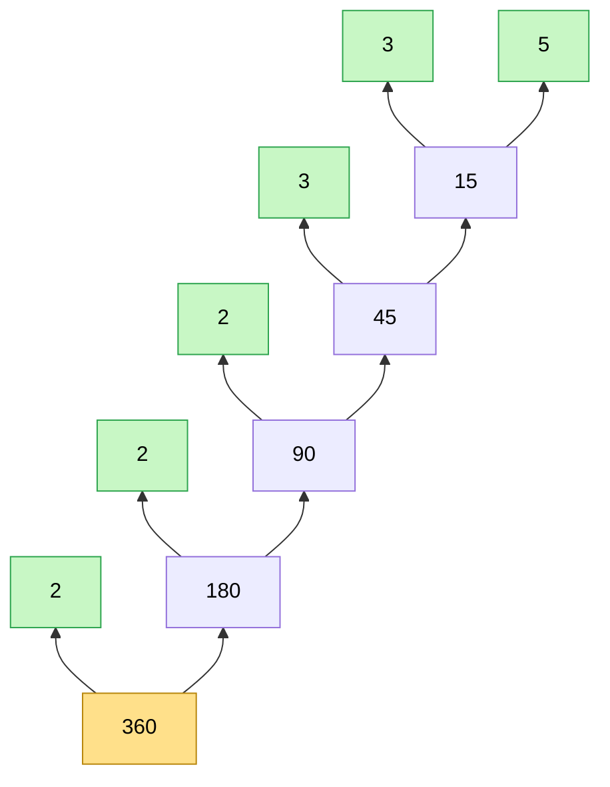
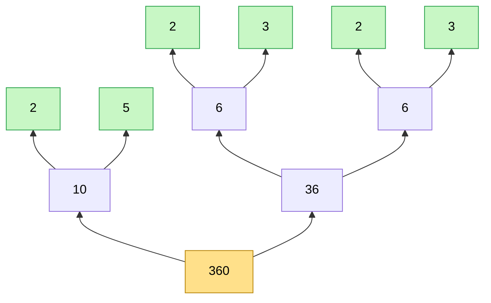
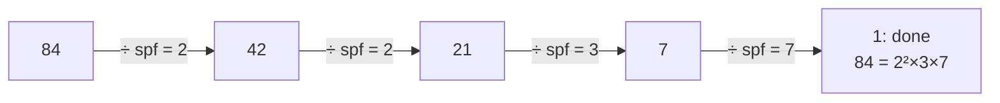
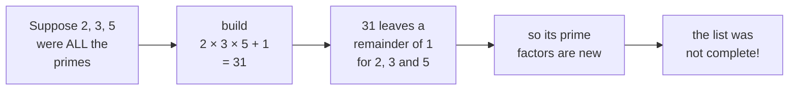

# 09 · Prime Numbers

> After this chapter you can test whether a number is prime, list every prime up to 10⁷ in a blink, and
> break any number into its prime "LEGO bricks" — and explain **why** each method is fast.

⬅️ [08 · Divisors and the Square Root Trick](../08-divisors-and-sqrt-trick/) · 🏠 [Roadmap](../README.md) · [10 · GCD and LCM](../10-gcd-and-lcm/) ➡️

## Contents

1. [Why this matters for DSA](#1-why-this-matters-for-dsa)
2. [What a prime is](#2-what-a-prime-is)
3. [Testing one number](#3-testing-one-number)
4. [Why stopping at the square root is enough](#4-why-stopping-at-the-square-root-is-enough)
5. [Skipping numbers with 6k plus or minus 1](#5-skipping-numbers-with-6k-plus-or-minus-1)
6. [The Sieve of Eratosthenes](#6-the-sieve-of-eratosthenes)
7. [Why the sieve is so fast](#7-why-the-sieve-is-so-fast)
8. [Prime factorization](#8-prime-factorization)
9. [The smallest prime factor sieve](#9-the-smallest-prime-factor-sieve)
10. [Using the prime recipe](#10-using-the-prime-recipe)
11. [How many primes are there](#11-how-many-primes-are-there)
12. [Java code](#12-java-code)
13. [Common mistakes](#13-common-mistakes)
14. [Interview patterns](#14-interview-patterns)
15. [Exercises](#15-exercises)
16. [One-minute recap](#16-one-minute-recap)

---

## 1. Why this matters for DSA

Primes are the **atoms of numbers**: every whole number is built from them. In interviews they appear as:

- **"Is n prime?"** — trial division up to √n, O(√n).
- **"Count the primes below n"** (LeetCode 204) — the Sieve of Eratosthenes, O(n log log n).
- **"Break n into prime factors"** — needed for divisor counts, GCD/LCM (chapter
  [10](../10-gcd-and-lcm/)), "ugly numbers", trailing zeros of n!, and grouping numbers by common factors.
- **Hidden primes:** the famous modulus 10⁹ + 7 is prime (chapter [11](../11-modular-arithmetic/)), and
  hash functions like prime sizes.

Everything in this chapter stands on the √n trick from chapter [08](../08-divisors-and-sqrt-trick/).

---

## 2. What a prime is

🍬 Remember the candy rectangles? Some numbers of candies can be arranged in many rectangles, others in
only **one boring line**:

```text
 6 candies: two ways            7 candies: only one way

 1 × 6:  o o o o o o            1 × 7:  o o o o o o o
 2 × 3:  o o o
         o o o                  (7 cannot make any other rectangle)
```

A **prime** is a whole number **n ≥ 2** with **exactly two divisors: 1 and itself**.
A number ≥ 2 with more divisors is **composite**.



The 25 primes below 100 (print them from the Java file!):

```text
    2  3  5  7 11 13 17 19 23 29 31 37 41 43 47
   53 59 61 67 71 73 79 83 89 97
```

Facts worth remembering:

- **1 is not prime.** It has only *one* divisor. (Also, if 1 were prime, 6 = 2 × 3 = 1 × 2 × 3 = 1 × 1 × 2 × 3 …
  and the "one recipe per number" rule of section 8 would break.)
- **2 is the only even prime.** Every other even number is divisible by 2 as well as by 1 and itself.
- Primes get **rarer** as numbers grow, but they **never run out** (section 11).

---

## 3. Testing one number

To check whether n is prime, look for a divisor between 2 and n − 1. If you find one, n is composite.
This is called **trial division**. And thanks to chapter 08, we can stop at **√n**:



```java
static boolean isPrime(long n) {
    if (n < 2) {
        return false;
    }
    for (long d = 2; d * d <= n; d++) {
        if (n % d == 0) {
            return false;          // found a divisor: composite
        }
    }
    return true;                   // no divisor up to sqrt(n): prime
}
```

Two traces. **Is 91 prime?** √91 ≈ 9.5, so try d = 2 … 9:

| d | 2 | 3 | 4 | 5 | 6 | 7 |
|---|---|---|---|---|---|---|
| 91 % d | 1 | 1 | 3 | 1 | 1 | **0** → 91 = 7 × 13, not prime |

**Is 97 prime?** √97 ≈ 9.8, so try d = 2 … 9:

| d | 2 | 3 | 4 | 5 | 6 | 7 | 8 | 9 | 10 |
|---|---|---|---|---|---|---|---|---|---|
| 97 % d | 1 | 1 | 1 | 2 | 1 | 6 | 1 | 7 | stop: 10 × 10 = 100 > 97 → **prime** |

---

## 4. Why stopping at the square root is enough

If n is composite, it can be written as n = a × b with 1 < a ≤ b. From chapter
[08](../08-divisors-and-sqrt-trick/): the smaller partner is **at most √n** (if both were bigger than √n,
a × b would be bigger than n). So:

> If n has **any** divisor between 2 and n − 1, it has one between 2 and **√n**.
> If there is none up to √n, there is none at all — **n is prime**.

For 91 the pairs are 1 × 91 and **7** × 13 — and 7 ≤ √91 ≈ 9.5 is the one the loop finds.

How much work does this save? Real numbers from the Java file:

```text
   n               prime?      slow steps   sqrt steps   6k steps
   1               no                   0            0          0
   2               yes                  0            0          0
   91              no                   6            6          4
   97              yes                 95            8          4
   7,919           yes              7,917           87         30
   1,000,000       no                   1            1          2
   1,000,000,007   yes     1,000,000,005*       31,621     10,542
   * not run: about a billion steps
```

For the prime 1,000,000,007 the √n test needs about **31 thousand** checks instead of **a billion**.
(Notice the composite numbers finish early — the loop stops at the first divisor.)

---

## 5. Skipping numbers with 6k plus or minus 1

We can skip even more. Write the numbers in **6 columns**:

```text
  6k+0   6k+1   6k+2   6k+3   6k+4   6k+5
     0      1      2      3      4      5
     6      7      8      9     10     11
    12     13     14     15     16     17
    18     19     20     21     22     23
    24     25     26     27     28     29
    30     31     32     33     34     35
  even  maybe   even  3 | n   even  maybe
```

- Columns 6k, 6k + 2 and 6k + 4 are **even** → divisible by 2.
- Column 6k + 3 is **divisible by 3** (6k + 3 = 3 × (2k + 1)).

So every prime **bigger than 3** lives in column **6k + 1** or **6k + 5** (that is, 6k − 1). The Java file
checked all primes up to 10 million:

```text
   remainder mod 6:  0: 0  1: 332,194  2: 0  3: 0  4: 0  5: 332,383
```

⚠️ The two columns hold only *candidates*: 25 and 35 are there too, and they are not prime.

So a faster test tries 2 and 3, then only d = 5, 7, 11, 13, 17, 19, … (pairs d and d + 2, jumping by 6) —
about **one third** of the work:

```java
if (n % 2 == 0 || n % 3 == 0) return n == 2 || n == 3;
for (long d = 5; d * d <= n; d += 6) {        // d = 6k - 1 and d + 2 = 6k + 1
    if (n % d == 0 || n % (d + 2) == 0) return false;
}
return true;                                  // (n >= 2 checked before)
```

It is still O(√n) — just with a smaller constant. In interviews the plain √n loop is usually enough;
mention 6k ± 1 as a bonus.

---

## 6. The Sieve of Eratosthenes

What if you need **all** primes up to n — say up to 10 million? Testing each number separately costs about
n × √n steps. The Greek mathematician Eratosthenes had a much better idea, over 2,000 years ago: instead of
**testing** numbers, **cross out** the ones that cannot be prime. 🏺

1. Write down all numbers from 2 to n.
2. The first number not crossed out is a prime p. Cross out its multiples, starting at **p × p**.
3. Move to the next number that is not crossed out and repeat — while **p × p ≤ n**.
4. Everything left standing is prime.



Sieving up to 50:

| Round | p | crosses out (from p × p) | newly crossed |
|---|---|---|---|
| 1 | 2 | 4, 6, 8, …, 50 | all 24 of them |
| 2 | 3 | 9, 12, 15, …, 48 | 9, 15, 21, 27, 33, 39, 45 |
| 3 | 5 | 25, 30, 35, 40, 45, 50 | 25, 35 |
| 4 | 7 | 49 | 49 |
| stop | — | the next candidate is 11, and 11 × 11 = 121 > 50 | — |

What is left (`-` = crossed out, `.` = 1, which is not prime):

```text
   .   2   3   -   5   -   7   -   -   -
  11   -  13   -   -   -  17   -  19   -
   -   -  23   -   -   -   -   -  29   -
  31   -   -   -   -   -  37   -   -   -
  41   -  43   -   -   -  47   -   -   -
```

15 primes below 50. ✅

**Why start at p × p?** Any smaller multiple k × p (with k < p) has a prime factor smaller than p — the
prime factors of k — so it was **already crossed out**. For p = 5: 10 (by 2), 15 (by 3), 20 (by 2) are
gone; the first new one is 25.

**Why stop when p × p > n?** Every composite number ≤ n has a prime factor ≤ √n (chapter 08), so it was
crossed out by one of those small primes.

```java
static boolean[] sieve(int n) {
    boolean[] isPrime = new boolean[n + 1];
    for (int x = 2; x <= n; x++) {
        isPrime[x] = true;
    }
    for (int p = 2; (long) p * p <= n; p++) {
        if (isPrime[p]) {
            for (int m = p * p; m <= n; m += p) {   // smaller multiples: already crossed
                isPrime[m] = false;
            }
        }
    }
    return isPrime;
}
```

---

## 7. Why the sieve is so fast

Each prime p crosses out about n / p numbers. So the total work is

> n/2 + n/3 + n/5 + n/7 + n/11 + … (only primes) ≈ **n × ln ln n**

This is like the harmonic series of chapter [05](../05-sums-and-series/), but only over primes — and it
grows **incredibly** slowly: ln ln n is only about 3 even for n = 10⁹. So the sieve is
**almost linear**: about 2 crossings per number. Real counts:

```text
   n = 100          primes =        25   marks =          104   marks / n = 1.04
   n = 10,000       primes =     1,229   marks =       16,981   marks / n = 1.70
   n = 1,000,000    primes =    78,498   marks =    2,122,048   marks / n = 2.12
   n = 10,000,000   primes =   664,579   marks =   22,850,051   marks / n = 2.29
```

| Method for all primes up to n = 10⁶ | Work |
|---|---|
| test every number with √k trial division | about 6.7 × 10⁸ steps (worst case) |
| Sieve of Eratosthenes | about 2.1 × 10⁶ crossings |

The price is **memory**: one `boolean` per number. 10⁷ booleans is about 10 MB — fine. For 10⁹ you would
need a *segmented* sieve (sieve one block at a time), which interviews rarely ask.

🧠 **How to think of it yourself:** when you need an answer for **every** number up to n, stop asking
"what divides m?" and flip it: let every small number **visit its multiples**.

---

## 8. Prime factorization

🧱 **Primes are LEGO bricks.** Every whole number ≥ 2 can be built by multiplying primes — and there is
**only one set of bricks** for each number (this is called the *Fundamental Theorem of Arithmetic*).

A **factor tree** finds the bricks: split the number into any two factors, then keep splitting until only
primes are left. Our trees grow **from the bottom**, like real trees 🌳: the number is the root at the
bottom, and the primes are the leaves at the top.



Split 360 differently — 10 × 36 — and you still get the **same leaves**:



Both trees end with three 2s, two 3s and one 5: **360 = 2³ × 3² × 5**. We call this the **prime recipe**
of 360.

### The algorithm

Try d = 2, 3, 4, … and **divide each factor out completely** before moving on:

```java
static List<long[]> factorize(long n) {           // pairs {prime, exponent}
    List<long[]> factors = new ArrayList<>();
    for (long d = 2; d * d <= n; d++) {
        if (n % d == 0) {
            int exponent = 0;
            while (n % d == 0) {                   // divide d out completely
                n /= d;
                exponent++;
            }
            factors.add(new long[] {d, exponent});
        }
    }
    if (n > 1) {
        factors.add(new long[] {n, 1});            // what is left is a prime
    }
    return factors;
}
```

Trace for 360:

| d | n before | what happens | n after | recorded |
|---|---|---|---|---|
| 2 | 360 | divide by 2 three times | 45 | 2³ |
| 3 | 45 | divide by 3 twice | 5 | 3² |
| 4 | 5 | 4 × 4 = 16 > 5 → stop the loop | 5 | — |
| end | 5 | 5 > 1, so 5 is a prime left over | | 5 |

Three questions a good interviewer may ask:

- **"Why do only primes get recorded?"** When d = 4 is tried, all the 2s are already divided out, so 4
  can't divide n anymore. A composite d is always "eaten" by its smaller prime factors first.
- **"Why is the leftover prime?"** When the loop ends, the remaining n has no divisor ≤ √n (we tried them
  all), so by section 4 it is prime.
- **"How fast is it?"** At most about √n steps (when n is prime) — and often much faster, because n
  **shrinks** as factors come out. 600,851,475,143 needs only 1,470 steps, not 775,000:

```text
                 360 = 2^3 x 3^2 x 5              divisors =  24   loop steps = 2
               1,001 = 7 x 11 x 13                divisors =   8   loop steps = 10
                 194 = 2 x 97                     divisors =   4   loop steps = 8
       2,147,483,647 = 2147483647                 divisors =   2   loop steps = 46,339
     600,851,475,143 = 71 x 839 x 1471 x 6857     divisors =  16   loop steps = 1,470
```

---

## 9. The smallest prime factor sieve

If you must factorize **many** numbers (say 10⁵ numbers, all ≤ 10⁶), even √n each adds up. Build a
table once: **spf[x] = the smallest prime factor of x**, using the sieve idea. Then factorize any x by
dividing by spf[x] again and again:



```java
int[] spf = new int[n + 1];
for (int x = 2; x <= n; x++) {
    if (spf[x] == 0) {                     // nobody marked x, so x is prime
        for (int m = x; m <= n; m += x) {
            if (spf[m] == 0) {
                spf[m] = x;                // x is the smallest prime that divides m
            }
        }
    }
}
```

Each division at least **halves** x (the smallest prime factor is ≥ 2), so one factorization takes only
**O(log x)** steps (chapter [04](../04-logarithms/)).

---

## 10. Using the prime recipe

### 10.1 Counting divisors

A divisor of 36 = 2² × 3² picks **how many 2s** (0, 1 or 2) and **how many 3s** (0, 1 or 2):

```text
          3^0   3^1   3^2
  2^0       1     3     9
  2^1       2     6    18
  2^2       4    12    36          3 choices × 3 choices = 9 divisors
```

> If n = p₁^a₁ × p₂^a₂ × …, then n has **(a₁ + 1) × (a₂ + 1) × …** divisors.

360 = 2³ × 3² × 5 → (3 + 1) × (2 + 1) × (1 + 1) = **24** — the same 24 we found by pairs in chapter 08. ✅

### 10.2 GCD and LCM in one glance

Line up the recipes. The **GCD** takes the *smaller* exponent of every prime; the **LCM** takes the *bigger*
one (chapter [10](../10-gcd-and-lcm/) does this properly):

| prime | 360 = 2³ × 3² × 5 | 84 = 2² × 3 × 7 | gcd (min) | lcm (max) |
|---|---|---|---|---|
| 2 | 3 | 2 | 2 | 3 |
| 3 | 2 | 1 | 1 | 2 |
| 5 | 1 | 0 | 0 | 1 |
| 7 | 0 | 1 | 0 | 1 |

gcd = 2² × 3 = **12** and lcm = 2³ × 3² × 5 × 7 = **2520**. (Check: 12 × 2520 = 30,240 = 360 × 84.)

### 10.3 Trailing zeros of n! (LeetCode 172)

A zero at the end of a number comes from a factor **10 = 2 × 5**. In n! = 1 × 2 × … × n there are many more
2s than 5s, so we only need to **count the 5s**:

```text
 multiples of 5 up to 30:   5   10   15   20   25   30
 how many 5s inside:        1    1    1    1    2    1      total = 7

 30/5 = 6  (every multiple of 5 gives one 5)
 30/25 = 1 (multiples of 25 give one more)       6 + 1 = 7 zeros in 30!
```

> Trailing zeros of n! = n/5 + n/25 + n/125 + … (stop when the power passes n)

100! ends with 20 + 4 = **24** zeros, 1000! with 200 + 40 + 8 + 1 = **249**. The loop runs only
log₅ n times — even 1,000,000,000! is instant (249,999,998 zeros).

### 10.4 Ugly numbers (LeetCode 263)

An "ugly number" has no prime factors other than 2, 3 and 5. Divide those out; if 1 is left, it was ugly:
30 = 2 × 3 × 5 → yes; 14 = 2 × 7 → no.

---

## 11. How many primes are there

### They never run out

About 2,300 years ago Euclid proved that there are **infinitely many** primes. Kid version:



It works for **any** finite list: multiply all the primes and add 1. The result leaves remainder 1 when
divided by every prime on the list, so its prime factors are **not** on the list. (The new number itself
need not be prime: 2 × 3 × 5 × 7 × 11 × 13 + 1 = 30,031 = 59 × 509 — but 59 and 509 are new primes.)
This is a **proof by contradiction** (chapter [16](../16-logic-sets-and-proofs/)).

### But they get rarer

Near n, roughly **one number in ln n** is prime, so there are about **n / ln n** primes below n:

```text
   n = 10          pi(n) =        4   n / ln n =        4   1 in 2.5 is prime
   n = 100         pi(n) =       25   n / ln n =       22   1 in 4.0 is prime
   n = 1,000       pi(n) =      168   n / ln n =      145   1 in 6.0 is prime
   n = 10,000      pi(n) =    1,229   n / ln n =    1,086   1 in 8.1 is prime
   n = 100,000     pi(n) =    9,592   n / ln n =    8,686   1 in 10.4 is prime
   n = 1,000,000   pi(n) =   78,498   n / ln n =   72,382   1 in 12.7 is prime
   n = 10,000,000  pi(n) =  664,579   n / ln n =  620,421   1 in 15.0 is prime
```

(π(n), "pi of n", is the usual name for "the number of primes ≤ n" — nothing to do with 3.14!)
Near 10⁹ about 1 number in 21 is prime, so if you pick random numbers of that size, you find a prime
after about 21 tries.

---

## 12. Java code

The file [`Primes.java`](Primes.java) contains `isPrimeSlow`, `isPrime`, `isPrime6k`, `sieve`,
`countPrimesBelow` (LeetCode 204), `factorize`, `divisorCount`, `smallestPrimeFactor`,
`trailingZerosOfFactorial` (LeetCode 172) and `isUgly` (LeetCode 263). The key methods are shown in
sections 3, 5, 6, 8 and 9.

### Run it

```text
cd maths_for_dsa/09-prime-numbers
java Primes.java
```

Output:

```text
1) The primes below 100 (there are 25)
    2  3  5  7 11 13 17 19 23 29 31 37 41 43 47
   53 59 61 67 71 73 79 83 89 97

2) Testing one number: slow (d < n), sqrt(n), and 6k +- 1
   n               prime?      slow steps   sqrt steps   6k steps
   1               no                   0            0          0
   2               yes                  0            0          0
   91              no                   6            6          4
   97              yes                 95            8          4
   7,919           yes              7,917           87         30
   1,000,000       no                   1            1          2
   1,000,000,007   yes     1,000,000,005*       31,621     10,542
   * not run: about a billion steps

3) Sieve of Eratosthenes: how many crossings (marks)?
   n = 100          primes =        25   marks =          104   marks / n = 1.04
   n = 10,000       primes =     1,229   marks =       16,981   marks / n = 1.70
   n = 1,000,000    primes =    78,498   marks =    2,122,048   marks / n = 2.12
   n = 10,000,000   primes =   664,579   marks =   22,850,051   marks / n = 2.29

4) How many primes? pi(n) compared with the estimate n / ln n
   n = 10          pi(n) =        4   n / ln n =        4   1 in 2.5 is prime
   n = 100         pi(n) =       25   n / ln n =       22   1 in 4.0 is prime
   n = 1,000       pi(n) =      168   n / ln n =      145   1 in 6.0 is prime
   n = 10,000      pi(n) =    1,229   n / ln n =    1,086   1 in 8.1 is prime
   n = 100,000     pi(n) =    9,592   n / ln n =    8,686   1 in 10.4 is prime
   n = 1,000,000   pi(n) =   78,498   n / ln n =   72,382   1 in 12.7 is prime
   n = 10,000,000  pi(n) =  664,579   n / ln n =  620,421   1 in 15.0 is prime
   LeetCode 204: primes below 5,000,000 = 348,513

5) Prime factorization (trial division, divide each factor out)
                 360 = 2^3 x 3^2 x 5              divisors =  24   loop steps = 2
                  84 = 2^2 x 3 x 7                divisors =  12   loop steps = 2
               1,001 = 7 x 11 x 13                divisors =   8   loop steps = 10
                 194 = 2 x 97                     divisors =   4   loop steps = 8
                  97 = 97                         divisors =   2   loop steps = 8
       2,147,483,647 = 2147483647                 divisors =   2   loop steps = 46,339
       1,234,567,890 = 2 x 3^2 x 5 x 3607 x 3803  divisors =  48   loop steps = 3,606
     600,851,475,143 = 71 x 839 x 1471 x 6857     divisors =  16   loop steps = 1,470

6) Smallest prime factor sieve: factorize 84 by dividing by spf[x]
   84 -(/2)-> 42 -(/2)-> 21 -(/3)-> 7 -(/7)-> 1

7) Trailing zeros of n! (LeetCode 172): n/5 + n/25 + n/125 + ...
               5! ends with           1 zeros
              10! ends with           2 zeros
              25! ends with           6 zeros
             100! ends with          24 zeros
           1,000! ends with         249 zeros
   1,000,000,000! ends with 249,999,998 zeros

8) Ugly numbers (LeetCode 263): only 2, 3 and 5 allowed
   1:yes 6:yes 8:yes 14:no 30:yes 49:no

9) Every prime above 3 is 6k - 1 or 6k + 1 (checked up to 10,000,000)
   remainder mod 6:  0: 0  1: 332,194  2: 0  3: 0  4: 0  5: 332,383
```

---

## 13. Common mistakes

1. **Calling 1 a prime.** Primes start at 2. Always handle `n < 2` first.
2. **`d < Math.sqrt(n)` with `<`.** For n = 49 you never test 7 and wrongly call 49 prime. Use `d * d <= n`.
3. **Overflow in `d * d` or `p * p`.** Use `long`, or write `d <= n / d`.
4. **Testing every number up to 10⁷ with `isPrime`.** Use the sieve when you need many primes.
5. **Sieve array of size n instead of n + 1** — then `isPrime[n]` does not exist.
6. **Forgetting the leftover prime** in factorization: after the loop, if n > 1 it is a prime factor
   (194 = 2 × 97 needs it).
7. **LeetCode 204 counts primes *strictly less than* n**, not ≤ n. Read the statement carefully.
8. **Multiplying big numbers to "check" factors** — for "distinct prime factors of the product" factor each
   number separately; the product would overflow.
9. **Counting trailing zeros by computing n!** — 25! already overflows a `long`. Count the 5s instead.

---

## 14. Interview patterns

| Pattern | How to recognise it | LeetCode problems |
|---|---|---|
| Test one number | "is n prime?", n up to about 10¹² | 762 Prime Number of Set Bits in Binary Representation, 866 Prime Palindrome |
| Count or list primes up to n | "how many primes below n", many prime checks | 204 Count Primes, 2523 Closest Prime Numbers in Range, 1175 Prime Arrangements |
| Prime factorization | "prime factors", "only factors 2, 3, 5" | 263 Ugly Number, 264 Ugly Number II, 2521 Distinct Prime Factors of Product of Array, 650 2 Keys Keyboard |
| Divisor counts from the recipe | "number of divisors", "exactly four divisors" | 1390 Four Divisors |
| Counting a prime inside n! | "trailing zeros of n!" | 172 Factorial Trailing Zeroes, 793 Preimage Size of Factorial Zeroes Function |
| Group numbers by prime factors | "share a common factor > 1" — smallest-prime-factor sieve + union–find | 952 Largest Component Size by Common Factor |

---

## 15. Exercises

Pen and paper first — then open the answer. ✏️

### Level 1 · Warm-up

**1.** Which of these are prime: 1, 2, 9, 11, 15, 17, 21, 29, 51?

<details>
<summary>Answer</summary>

**2, 11, 17, 29.** 1 is not prime; 9 = 3 × 3, 15 = 3 × 5, 21 = 3 × 7, and 51 = 3 × 17 (digit sum 6, so it is
divisible by 3 — a common trap!).

</details>

**2.** Why is 1 not a prime?

<details>
<summary>Answer</summary>

A prime has **exactly two** divisors (1 and itself); 1 has only **one**. Also, if 1 were prime, every
number would have endless recipes (6 = 2 × 3 = 1 × 2 × 3 = …), which breaks "one recipe per number".

</details>

**3.** List all primes below 30.

<details>
<summary>Answer</summary>

**2, 3, 5, 7, 11, 13, 17, 19, 23, 29** — ten primes.

</details>

**4.** To check whether 113 is prime, which divisors must you try?

<details>
<summary>Answer</summary>

√113 ≈ 10.6, so d = 2 … 10 (it is enough to try the primes **2, 3, 5, 7**). None divides 113, so
**113 is prime**.

</details>

**5.** Draw a factor tree for 84 (root at the bottom!) and write its prime recipe.

<details>
<summary>Answer</summary>

84 → 2 × 42 → 42 → 2 × 21 → 21 → 3 × 7. Leaves: 2, 2, 3, 7, so **84 = 2² × 3 × 7**.

</details>

**6.** Find the prime recipe of 1001.

<details>
<summary>Answer</summary>

**1001 = 7 × 11 × 13.** (Try 2, 3, 5: no. 7: yes, 1001 / 7 = 143. Then 143 = 11 × 13.)

</details>

**7.** Why is 2 the only even prime?

<details>
<summary>Answer</summary>

Every even number larger than 2 is divisible by 1, by 2 **and** by itself — at least three divisors — so
it is composite.

</details>

### Level 2 · Practice

**8.** How many divisors does 360 have? Use its prime recipe.

<details>
<summary>Answer</summary>

360 = 2³ × 3² × 5¹ → (3 + 1)(2 + 1)(1 + 1) = **24**.

</details>

**9.** How many trial divisions does the basic √n loop (d = 2, 3, 4, …) make to prove that
1,000,000,007 is prime? And if you test only 2 and then odd numbers?

<details>
<summary>Answer</summary>

√1,000,000,007 ≈ 31,622.8, so d = 2 … 31,622: **31,621 divisions**. With 2 and then only odd d:
**15,811** — about half.

</details>

**10.** Run the sieve by hand up to 30. Which numbers are crossed out by 2, by 3 and by 5? Why is there no
round for 7?

<details>
<summary>Answer</summary>

- 2 crosses 4, 6, 8, …, 30.
- 3 crosses 9, 12, 15, …, 30 (new: 9, 15, 21, 27).
- 5 crosses 25 and 30 (new: 25).

7 × 7 = 49 > 30, so every composite ≤ 30 is already crossed. The primes are 2, 3, 5, 7, 11, 13, 17, 19,
23, 29.

</details>

**11.** Sieving up to 100: when p = 7, what is the first number crossed out? Why not 14?

<details>
<summary>Answer</summary>

**49** (= 7 × 7). The smaller multiples 14, 21, 28, 35, 42 have smaller prime factors (2, 3 or 5), so they
were crossed out in earlier rounds.

</details>

**12.** How many trailing zeros do 100! and 1000! have?

<details>
<summary>Answer</summary>

100!: 100/5 + 100/25 = 20 + 4 = **24**. 1000!: 200 + 40 + 8 + 1 = **249**.

</details>

**13.** Are 14 and 30 ugly numbers (no prime factors other than 2, 3 and 5)?

<details>
<summary>Answer</summary>

**14 is not** (14 = 2 × 7). **30 is** (30 = 2 × 3 × 5).

</details>

**14.** Use the prime recipes to find gcd(360, 84) and lcm(360, 84).

<details>
<summary>Answer</summary>

360 = 2³ × 3² × 5 and 84 = 2² × 3 × 7. gcd takes the smaller exponents: 2² × 3 = **12**.
lcm takes the bigger exponents: 2³ × 3² × 5 × 7 = **2520**.

</details>

**15.** Factorize 600,851,475,143. Why does the loop finish after only about 1,470 steps, although
√600,851,475,143 ≈ 775,000?

<details>
<summary>Answer</summary>

**600,851,475,143 = 71 × 839 × 1471 × 6857.** Every time a factor is divided out, n **shrinks**, so the
condition d × d ≤ n stops the loop much earlier: after 1471 is removed only 6,857 is left, and
1472² > 6,857. The leftover 6,857 is prime.

</details>

**16.** What is the smallest number with exactly 12 divisors?

<details>
<summary>Answer</summary>

**60** = 2² × 3 × 5 → (2 + 1)(1 + 1)(1 + 1) = 12. (Checking all smaller numbers, none has 12 divisors —
48 = 2⁴ × 3 has 10.)

</details>

### Level 3 · Interview

**17.** *Count Primes* (LeetCode 204): n = 5,000,000. Which method, what complexity, and what answer?

<details>
<summary>Answer</summary>

The **Sieve of Eratosthenes** on 0 … n − 1 (primes *strictly less* than n): time **O(n log log n)**,
memory O(n) booleans. The answer is **348,513**. Testing each number with √ trial division would be far
slower.

</details>

**18.** Prove that every prime greater than 3 is of the form 6k − 1 or 6k + 1.

<details>
<summary>Answer</summary>

Every whole number is 6k, 6k + 1, 6k + 2, 6k + 3, 6k + 4 or 6k + 5. The forms 6k, 6k + 2 and 6k + 4 are
even, so they are divisible by 2; 6k + 3 = 3(2k + 1) is divisible by 3. A prime bigger than 3 is divisible
by neither 2 nor 3, so it must be **6k + 1 or 6k + 5 (= 6(k + 1) − 1)**. (The converse is false: 25 is
6 × 4 + 1 but not prime.)

</details>

**19.** You must factorize 100,000 numbers, each at most 1,000,000. Which approach do you use?

<details>
<summary>Answer</summary>

Build a **smallest-prime-factor sieve** up to 10⁶ once (almost linear time), then factorize each number by
dividing by spf[x] repeatedly — **O(log x)** per number. Total ≈ 10⁶ + 10⁵ × 20 steps, instead of up to
10⁵ × 1,000 with trial division.

</details>

**20.** Prove that there are infinitely many primes.

<details>
<summary>Answer</summary>

Suppose p₁, p₂, …, pₖ were **all** the primes. Let N = p₁ × p₂ × … × pₖ + 1. N ≥ 2, so it has a prime
factor q. Dividing N by any pᵢ leaves remainder 1, so q is none of the pᵢ — a prime **missing** from the
"complete" list. Contradiction, so the primes never run out.

</details>

**21.** Worst case: n ≤ 10¹² is prime. About how many divisions does the 6k ± 1 test make?

<details>
<summary>Answer</summary>

√10¹² = 10⁶. The test tries 2, 3 and then two candidates in every block of 6: about 2 + 2 × (10⁶ / 6)
= **333,334 divisions** (versus about 10⁶ for the plain √n loop). Both are fast enough.

</details>

**22.** With the p × p start, how many times is 30 crossed out when sieving up to 50? And 49?

<details>
<summary>Answer</summary>

30 is crossed by **p = 2, 3 and 5** (30 ≥ 4, 9 and 25) → **3 times**. 49 is crossed only by **p = 7**
→ **once**. Numbers are crossed once per prime factor p with p × p ≤ the number — that is where the
n ln ln n comes from.

</details>

**23.** *Distinct Prime Factors of Product of Array* (LeetCode 2521): nums = [2, 4, 3, 7, 10, 6].
How many distinct primes divide the product? How do you avoid overflow?

<details>
<summary>Answer</summary>

**4** — the primes are {2, 3, 5, 7}. Never compute the product (it overflows quickly); factorize **each**
number and put its primes into a `HashSet`, then return the set's size.

</details>

**24.** Roughly how many primes are there below one billion?

<details>
<summary>Answer</summary>

About n / ln n = 10⁹ / 20.7 ≈ **48 million**. (The exact count is 50,847,534 — the estimate is a bit low,
but the right size.)

</details>

---

## 16. One-minute recap

- A **prime** has exactly two divisors: 1 and itself. 1 is not prime; 2 is the only even prime.
- **Test one number** with trial division up to √n — a composite always has a divisor ≤ √n. O(√n).
- Every prime above 3 is **6k ± 1**, so you can skip two thirds of the candidates.
- **All primes up to n:** the Sieve of Eratosthenes — cross out multiples from p × p while p × p ≤ n.
  O(n log log n), almost linear.
- **Factorize** by dividing each factor out completely; a leftover > 1 is prime. For many numbers use a
  **smallest-prime-factor** sieve.
- The **prime recipe** gives the divisor count (a₁ + 1)(a₂ + 1)…, the GCD (min exponents), the LCM
  (max exponents) and the trailing zeros of n! (count the 5s).
- There are **infinitely many** primes, about n / ln n of them below n.

Next: [10 · GCD and LCM](../10-gcd-and-lcm/) ➡️
