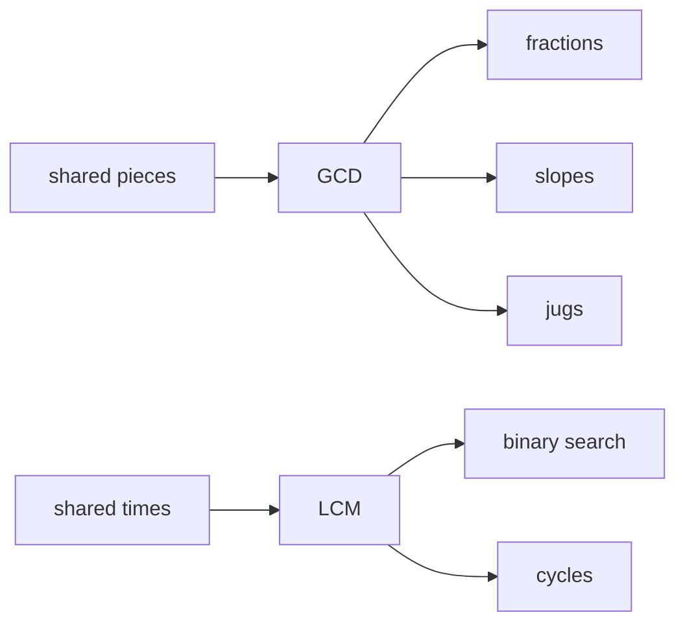
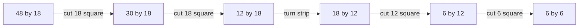
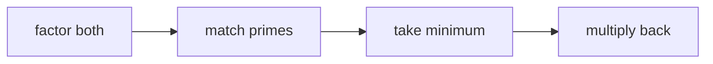
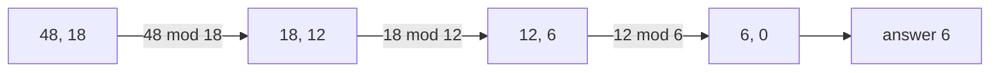
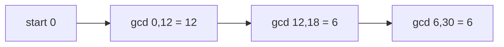
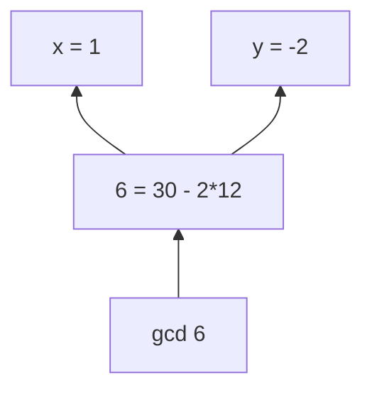

# 10 · GCD and LCM

> After this chapter you can find the biggest shared piece, the first shared meeting time, reduce fractions, normalize slopes, and use Euclid's algorithm in interviews.

⬅️ [09 · Prime Numbers](../09-prime-numbers/) · 🏠 [Roadmap](../README.md) · [11 · Modular Arithmetic](../11-modular-arithmetic/) ➡️

## Contents

1. [Why this matters for DSA](#1-why-this-matters-for-dsa)
2. [Common divisors and the biggest shared piece](#2-common-divisors-and-the-biggest-shared-piece)
3. [Slow listing and prime factors](#3-slow-listing-and-prime-factors)
4. [Euclid algorithm](#4-euclid-algorithm)
5. [LCM and meeting again](#5-lcm-and-meeting-again)
6. [Arrays signs and big numbers](#6-arrays-signs-and-big-numbers)
7. [Fractions and slopes](#7-fractions-and-slopes)
8. [Coprime numbers and extended Euclid](#8-coprime-numbers-and-extended-euclid)
9. [Famous interview tricks](#9-famous-interview-tricks)
10. [Java code](#10-java-code)
11. [Common mistakes](#11-common-mistakes)
12. [Interview patterns](#12-interview-patterns)
13. [Exercises](#13-exercises)
14. [One-minute recap](#14-one-minute-recap)

---

## 1. Why this matters for DSA

GCD means **greatest common divisor**. It is the biggest number that divides two numbers exactly.
LCM means **least common multiple**. It is the smallest positive number that both numbers can reach by
counting in jumps.

These two ideas look small, but they appear in many FAANG-style problems:

- reducing fractions after adding many tiny pieces;
- checking if two jug sizes can measure a target amount;
- grouping cards into equal piles;
- finding when two repeating events meet again;
- normalizing a line slope so equal lines get the same key;
- using the modular inverse in [11 · Modular Arithmetic](../11-modular-arithmetic/).



Think of GCD as **the biggest equal cutter**. Think of LCM as **the first shared bell ring**.

---

## 2. Common divisors and the biggest shared piece

### Ribbon story

You have two ribbons:

- one is 12 cm long;
- one is 18 cm long.

You want to cut both into equal pieces, with no leftover. If the piece length is 3, both work.
If the piece length is 6, both also work. If the piece length is 9, the 12 cm ribbon refuses.

```text
12 cm ribbon:  [------][------]             pieces of 6
18 cm ribbon:  [------][------][------]     pieces of 6

Biggest equal piece = 6 cm
```

So `gcd(12, 18) = 6`.

### Rectangle tiling story

Now draw a 48 by 18 rectangle. What is the biggest square tile that covers it exactly?
That tile side is `gcd(48, 18)`.

```text
48 by 18 rectangle

+------+------+------+------+------+------+
| 18x18| 18x18| 12 by 18 strip remains    |
+------+------+------+------+------+------+

The strip is not square, so keep cutting squares from the leftover.
```

This is the geometric view of Euclid's algorithm: keep cutting off the biggest square you can.
The side length of the final square is the GCD.



### Rule

A number `d` is a common divisor of `a` and `b` if:

```text
a % d == 0
b % d == 0
```

The GCD is the biggest such `d`.

### Java snippet

```java
static int gcdByListing(int a, int b) {
    int answer = 1;
    for (int d = 1; d <= Math.min(a, b); d++) {
        if (a % d == 0 && b % d == 0) {
            answer = d;
        }
    }
    return answer;
}
```

🧠 **How to think of it yourself:** ask, "What equal size can both numbers be broken into?"
Then try small cutters. The biggest working cutter is the GCD.

---

## 3. Slow listing and prime factors

### Slow listing method

For `gcd(24, 36)`, list divisors.

| Number | Divisors |
|---|---|
| 24 | 1, 2, 3, 4, 6, 8, 12, 24 |
| 36 | 1, 2, 3, 4, 6, 9, 12, 18, 36 |

Common divisors are `1, 2, 3, 4, 6, 12`. The biggest is **12**.

This is easy to understand, but slow when numbers are huge.

### Prime factorization method

From [09 · Prime Numbers](../09-prime-numbers/), every positive integer is built from primes.

```text
24 = 2 × 2 × 2 × 3     = 2^3 × 3^1
36 = 2 × 2 × 3 × 3     = 2^2 × 3^2
```

For the GCD, keep only primes that both numbers have, and take the **minimum exponent**.

```text
gcd(24, 36) = 2^min(3,2) × 3^min(1,2)
            = 2^2 × 3^1
            = 12
```

Picture it as two boxes of building blocks:

```text
24:  2  2  2  3
36:  2  2  3  3
GCD: 2  2  3       keep only matching blocks
```



### Java snippet

```java
// Good for learning. Euclid is better in real code.
// Factor both numbers, then multiply common prime powers.
```

Prime factorization is great when a problem already gives factors. For just finding GCD, Euclid is
shorter and much faster.

---

## 4. Euclid algorithm

Euclid's algorithm is the interview hero:

```text
gcd(a, b) = gcd(b, a % b)
gcd(a, 0) = a
```

### Why the rule is true

Suppose `d` divides both `a` and `b`. Then `a = d × x` and `b = d × y`.
So `a - b = d × x - d × y = d × (x - y)`. That means `d` also divides `a - b`.

If `d` divides `a` and `b`, it also divides:

```text
a - b
a - 2b
a - 3b
...
a % b
```

So the common divisors do not change when we replace `a` by `a % b`.
The numbers shrink, but the answer stays the same.

### Subtraction picture

```text
gcd(48, 18)

48 = 18 + 18 + 12
So common pieces of 48 and 18 are the same as common pieces of 18 and 12.

18 = 12 + 6
So common pieces of 18 and 12 are the same as common pieces of 12 and 6.

12 = 6 + 6
So common pieces of 12 and 6 are the same as common pieces of 6 and 0.
```



### Trace table

| Step | a | b | a % b | Next pair |
|---|---:|---:|---:|---|
| 1 | 48 | 18 | 12 | `(18, 12)` |
| 2 | 18 | 12 | 6 | `(12, 6)` |
| 3 | 12 | 6 | 0 | `(6, 0)` |
| stop | 6 | 0 | — | answer is 6 |

### Recursive Java

```java
static long gcdRecursiveLong(long a, long b) {
    a = Math.abs(a);
    b = Math.abs(b);
    if (b == 0) {
        return a;
    }
    return gcdRecursiveLong(b, a % b);
}
```

### Iterative Java

```java
static long gcdLong(long a, long b) {
    a = Math.abs(a);
    b = Math.abs(b);
    while (b != 0) {
        long remainder = a % b;
        a = b;
        b = remainder;
    }
    return a;
}
```

### Why it is fast

The worst case happens for consecutive Fibonacci numbers:

```text
gcd(55, 34) -> gcd(34, 21) -> gcd(21, 13) -> ...
```

Even then, the numbers shrink quickly. Every two Euclid steps, the larger number at least halves.
That is why the number of steps is `O(log min(a, b))`.

```text
If a >= b:
case 1: a % b <= a/2          the next larger number is already at most a/2
case 2: a % b > a/2           then b < a, and the next remainder is below b/2

So after at most two steps, the big number is at least cut in half.
```

🧠 **How to think of it yourself:** do not try every cutter. Keep the same cutters but make the
numbers smaller. Remainder is "what is left after cutting off many equal strips."

---

## 5. LCM and meeting again

LCM means **least common multiple**.

Story: bus A comes every 6 minutes. Bus B comes every 8 minutes. If both arrive now, when do they meet
again?

```text
Bus A: 0, 6, 12, 18, 24, 30, ...
Bus B: 0, 8, 16, 24, 32, ...

First shared time after 0 = 24
```

So `lcm(6, 8) = 24`.


### Formula

For positive `a` and `b`:

```text
gcd(a, b) × lcm(a, b) = a × b
lcm(a, b) = a / gcd(a, b) × b
```

Divide first to avoid overflow.

```java
static long lcm(int a, int b) {
    if (a == 0 || b == 0) {
        return 0;
    }
    return Math.abs((long) a / gcdLong(a, b) * b);
}
```

### Prime factorization view

For LCM, keep enough prime blocks to build both numbers. That means **maximum exponents**.

```text
24 = 2^3 × 3^1
36 = 2^2 × 3^2

lcm(24, 36) = 2^max(3,2) × 3^max(1,2)
            = 2^3 × 3^2
            = 72
```

GCD takes the overlap. LCM takes the union.

```text
24 blocks: 2 2 2 3
36 blocks: 2 2 3 3
GCD:       2 2 3
LCM:       2 2 2 3 3
```

---

## 6. Arrays signs and big numbers

### GCD of an array

Fold from left to right:

```text
gcd([12, 18, 30])
= gcd(gcd(12, 18), 30)
= gcd(6, 30)
= 6
```



Why start from 0? Because `gcd(0, x) = x`. Zero is the empty backpack: the first real number fills it.

### LCM of an array

Also fold:

```text
lcm([4, 6, 10])
= lcm(lcm(4, 6), 10)
= lcm(12, 10)
= 60
```

### Negative numbers

Divisibility is about size, so use absolute values:

```text
gcd(-48, 18) = gcd(48, 18) = 6
```

Tiny Java trap: `Math.abs(Integer.MIN_VALUE)` is still negative, because 2,147,483,648 does not fit in an
`int`. The demo file uses a `long` helper for this case; if an `int` GCD result cannot fit, it throws
instead of returning a wrong negative answer.

### BigInteger

When numbers are bigger than `long`, Java already has:

```java
BigInteger a = new BigInteger("123456789123456789");
BigInteger b = new BigInteger("987654321");
System.out.println(a.gcd(b));
```

---

## 7. Fractions and slopes

### Reduce a fraction

To reduce `42/56`, divide top and bottom by their GCD.

```text
gcd(42, 56) = 14
42/56 = (42/14)/(56/14) = 3/4
```

```java
static String reduceFraction(int numerator, int denominator) {
    int divisor = gcdIterative(numerator, denominator);
    return (numerator / divisor) + "/" + (denominator / divisor);
}
```

### Add fractions using LCM

In LeetCode 592, you add fractions and reduce the result.

```text
1/6 + 1/4
lcm(6, 4) = 12
1/6 = 2/12
1/4 = 3/12
2/12 + 3/12 = 5/12
```

### Normalize slopes

In LeetCode 149, two slopes that look different can mean the same line:

```text
dy/dx = 2/4 = 1/2
dy/dx = -2/-4 = 1/2
dy/dx = -1/2 stays -1/2
```

Rule:

1. Let `dx = x2 - x1`, `dy = y2 - y1`.
2. Divide both by `gcd(dx, dy)`.
3. Keep the sign in one place, usually `dx > 0`.
4. Use special keys for vertical and horizontal lines.

```text
Points (1, 1) and (5, 3)
dx = 4, dy = 2
gcd(4, 2) = 2
normalized slope = 1/2
```

🧠 **How to think of it yourself:** if a value is used as a map key, make equal things look exactly
the same. GCD removes the extra stretching.

---

## 8. Coprime numbers and extended Euclid

Two numbers are **coprime** if their GCD is 1.

```text
gcd(8, 15) = 1     so 8 and 15 are coprime
gcd(8, 12) = 4     so 8 and 12 are not coprime
```

### Bézout identity

Bézout's identity says:

```text
There are integers x and y such that:
a × x + b × y = gcd(a, b)
```

Example:

```text
30 × 1 + 12 × (-2) = 6
```

Extended Euclid finds those `x` and `y`.

### Trace table

First go down with Euclid:

| Step | Equation |
|---|---|
| 1 | `30 = 2 × 12 + 6` |
| 2 | `12 = 2 × 6 + 0` |

Then walk back up:

| Goal | Rewrite |
|---|---|
| gcd | `6` |
| from step 1 | `6 = 30 - 2 × 12` |
| coefficients | `6 = 30 × 1 + 12 × (-2)` |



### Java idea

```java
// returns {gcd, x, y}
static int[] extendedGcd(int a, int b) {
    if (b == 0) {
        return new int[] {a, 1, 0};
    }
    int[] next = extendedGcd(b, a % b);
    int x = next[2];
    int y = next[1] - (a / b) * next[2];
    return new int[] {next[0], x, y};
}
```

### Water and Jug Problem

LeetCode 365 asks if jugs of size `x` and `y` can measure `target`.

The answer is true exactly when:

```text
target <= x + y
target is a multiple of gcd(x, y)
```

Why? Every pouring action changes water by combinations of `x` and `y`, so every measurable amount is
a multiple of `gcd(x, y)`. Bézout tells us all multiples of the GCD are reachable within the capacity.

### Good Array and modular inverse

LeetCode 1250 asks if some integer combination of the array can make 1. That is true exactly when the
GCD of the whole array is 1.

In [11 · Modular Arithmetic](../11-modular-arithmetic/), extended Euclid also gives the modular inverse:
if `a × x + m × y = 1`, then `a × x ≡ 1 mod m`.

---

## 9. Famous interview tricks

### Greatest Common Divisor of Strings

For LeetCode 1071, first check if the two strings are made from the same repeating block.

```text
str1 + str2 must equal str2 + str1
```

If this check passes, the answer length is `gcd(str1.length(), str2.length())`.

```text
ABCABC and ABC
lengths 6 and 3
gcd(6, 3) = 3
answer = ABC
```

### X of a Kind in a Deck of Cards

For LeetCode 914, count every card value. A valid group size `X` must divide every count.
So compute the GCD of all counts and check if it is at least 2.

### Nth Magical Number

For LeetCode 878, a number is magical if divisible by `a` or `b`.

Count magical numbers up to `mid`:

```text
mid / a + mid / b - mid / lcm(a, b)
```

Subtract the overlap once. That is inclusion and exclusion from chapter 13.

### Find Greatest Common Divisor of Array

For LeetCode 1979, the answer is just `gcd(min(array), max(array))`.

### Number of Subarrays With GCD Equal to K

For LeetCode 2447, fix each start, extend the end, and keep the current GCD.
Once the current GCD is no longer a multiple of `k`, it can never come back to `k`.

---

## 10. Java code

Code: [`GcdLcm.java`](GcdLcm.java)

Key methods:

```java
static int gcdIterative(int a, int b)
static int gcdRecursive(int a, int b)
static long gcdLong(long a, long b)
static long lcm(int a, int b)
static int[] extendedGcd(int a, int b)
static String gcdOfStrings(String first, String second)
static int nthMagicalNumber(int n, int a, int b)
```

Run it:

```text
cd maths_for_dsa/10-gcd-and-lcm
java GcdLcm.java
```

Real output:

```text
gcdRecursive(48, 18) = 6
gcdIterative(-48, 18) = 6
lcm(12, 18) = 36
gcd [12, 18, 30] = 6
lcm [12, 18, 30] = 180
reduce 42/56 = 3/4
1/6 + 1/4 = 5/12
slope (1, 1) to (5, 3) = 1/2
extendedGcd(30, 12): gcd=6, x=1, y=-2
30*x + 12*y = 6
canMeasureWater(3, 5, 4) = true
gcdOfStrings(ABCABC, ABC) = ABC
hasGroupsSizeX([1,1,2,2,2,2]) = true
nthMagicalNumber(5, 2, 4) = 10
isGoodArray([12, 5, 7, 23]) = true
countSubarraysWithGcdK([9,3,1,2,6,3], 3) = 4
BigInteger gcd = 9
```

---

## 11. Common mistakes

| Mistake | Why it hurts | Fix |
|---|---|---|
| Forgetting `gcd(a, 0) = a` | The loop never knows when to stop | Make it the base case |
| Using LCM as `a * b / gcd` | `a * b` may overflow first | Use `a / gcd * b` |
| Ignoring negative numbers | Java `%` can keep a negative sign | Use absolute values for GCD |
| Reducing only the numerator | The fraction changes value | Divide top and bottom |
| Slope key keeps random signs | Same line gets many keys | Put sign in one fixed place |
| Forgetting string concat check | GCD length alone can lie | Check `str1 + str2 == str2 + str1` |
| Using listing in interviews | Too slow for large numbers | Use Euclid |

---

## 12. Interview patterns

| Pattern | How to recognise it | LeetCode problems |
|---|---|---|
| Direct GCD | asks for greatest shared divisor or min and max GCD | 1979 Find Greatest Common Divisor of Array |
| Repeating string block | two strings must share a base pattern | 1071 Greatest Common Divisor of Strings |
| Equal card groups | all frequencies need a common group size | 914 X of a Kind in a Deck of Cards |
| Pouring jugs | reachable amount using two sizes | 365 Water and Jug Problem |
| Fraction arithmetic | add, reduce, normalize signs | 592 Fraction Addition and Subtraction |
| Same slope key | points on one line need same reduced slope | 149 Max Points on a Line |
| Multiples with overlap | count numbers divisible by `a` or `b` | 878 Nth Magical Number |
| Whole array coprime | integer combination can make 1 | 1250 Check If It Is a Good Array |
| Running subarray GCD | extend a subarray and update GCD | 2447 Number of Subarrays With GCD Equal to K |

---

## 13. Exercises

### Level 1 · Warm-up

**1.** List the common divisors of 18 and 24. What is the GCD?

<details>
<summary>Answer</summary>

**Common divisors:** 1, 2, 3, 6. **GCD = 6**.

</details>

**2.** Find `gcd(48, 18)` using the Euclid trace.

<details>
<summary>Answer</summary>

**6** — `48 % 18 = 12`, `18 % 12 = 6`, `12 % 6 = 0`.

</details>

**3.** Find `gcd(0, 35)`.

<details>
<summary>Answer</summary>

**35** — `gcd(0, x) = x`.

</details>

**4.** Find `gcd(-14, 21)`.

<details>
<summary>Answer</summary>

**7** — use absolute values: `gcd(14, 21) = 7`.

</details>

**5.** Find `lcm(6, 8)`.

<details>
<summary>Answer</summary>

**24** — `gcd(6, 8) = 2`, so `6 / 2 × 8 = 24`.

</details>

**6.** Reduce `42/56`.

<details>
<summary>Answer</summary>

**3/4** — `gcd(42, 56) = 14`, then divide both parts by 14.

</details>

**7.** Are 14 and 25 coprime?

<details>
<summary>Answer</summary>

**Yes** — `gcd(14, 25) = 1`.

</details>

### Level 2 · Practice

**8.** Use prime factors to find `gcd(72, 120)`.

<details>
<summary>Answer</summary>

**24** — `72 = 2^3 × 3^2`, `120 = 2^3 × 3 × 5`, so the minimum exponents give `2^3 × 3 = 24`.

</details>

**9.** Use prime factors to find `lcm(72, 120)`.

<details>
<summary>Answer</summary>

**360** — maximum exponents give `2^3 × 3^2 × 5 = 360`.

</details>

**10.** Find the GCD of `[12, 18, 30]`.

<details>
<summary>Answer</summary>

**6** — `gcd(12, 18) = 6`, and `gcd(6, 30) = 6`.

</details>

**11.** Find the LCM of `[4, 6, 10]`.

<details>
<summary>Answer</summary>

**60** — `lcm(4, 6) = 12`, then `lcm(12, 10) = 60`.

</details>

**12.** Add `1/6 + 1/4` and reduce.

<details>
<summary>Answer</summary>

**5/12** — LCM of 6 and 4 is 12, so `2/12 + 3/12 = 5/12`.

</details>

**13.** Normalize the slope from `(1, 1)` to `(5, 3)`.

<details>
<summary>Answer</summary>

**1/2** — `dy = 2`, `dx = 4`, divide by `gcd(2, 4) = 2`.

</details>

**14.** For strings `ABCABC` and `ABC`, what is the GCD string?

<details>
<summary>Answer</summary>

**ABC** — the concatenation check passes and `gcd(6, 3) = 3`.

</details>

**15.** Counts in a deck are 2, 4 and 6. Can the deck be split into groups with equal size at least 2?

<details>
<summary>Answer</summary>

**Yes** — `gcd(2, 4, 6) = 2`, so group size 2 works.

</details>

### Level 3 · Interview

**16.** For jugs of size 3 and 5, can you measure exactly 4?

<details>
<summary>Answer</summary>

**Yes** — `gcd(3, 5) = 1`, and 4 is a multiple of 1 and is not bigger than `3 + 5`.

</details>

**17.** Find integers `x` and `y` for `30x + 12y = gcd(30, 12)`.

<details>
<summary>Answer</summary>

**x = 1, y = -2** — `30 × 1 + 12 × (-2) = 6`.

</details>

**18.** Is `[12, 5, 7, 23]` a good array in LeetCode 1250?

<details>
<summary>Answer</summary>

**Yes** — the array GCD is 1, so an integer combination can make 1.

</details>

**19.** Count magical numbers up to 20 for `a = 4`, `b = 6`.

<details>
<summary>Answer</summary>

**7** — multiples of 4: 4, 8, 12, 16, 20. Multiples of 6: 6, 12, 18. Overlap 12 is counted once.

</details>

**20.** What is the 5th magical number for `a = 2`, `b = 4`?

<details>
<summary>Answer</summary>

**10** — magical numbers are 2, 4, 6, 8, 10.

</details>

**21.** How many subarrays of `[9, 3, 1, 2, 6, 3]` have GCD exactly 3?

<details>
<summary>Answer</summary>

**4** — they are `[9, 3]`, `[3]`, `[6, 3]`, and `[3]` at the last position.

</details>

**22.** What is the worst kind of input for Euclid's algorithm?

<details>
<summary>Answer</summary>

**Consecutive Fibonacci numbers** — for example 55 and 34 shrink one Fibonacci step at a time.

</details>

**23.** Why is Euclid `O(log min(a, b))`?

<details>
<summary>Answer</summary>

**Because every two steps cut the larger number at least in half.** Repeated halving gives logarithmic steps.

</details>

**24.** Why should `lcm(a, b)` be computed as `a / gcd(a, b) × b`?

<details>
<summary>Answer</summary>

**To avoid overflow.** Dividing first makes the intermediate number smaller than `a × b`.

</details>

---

## 14. One-minute recap

- GCD is the biggest equal piece that divides two numbers.
- LCM is the first shared multiple or meeting time.
- Prime factors: GCD uses minimum exponents, LCM uses maximum exponents.
- Euclid keeps the same common divisors while shrinking the numbers.
- `gcd(a, b) = gcd(b, a % b)` and `gcd(a, 0) = a`.
- Euclid is `O(log min(a, b))`; Fibonacci pairs are the worst case.
- Use absolute values for negatives and `gcd(0, x) = x` for folding arrays.
- Fractions, slopes, strings, jugs, cards, and magical numbers all use GCD or LCM.
