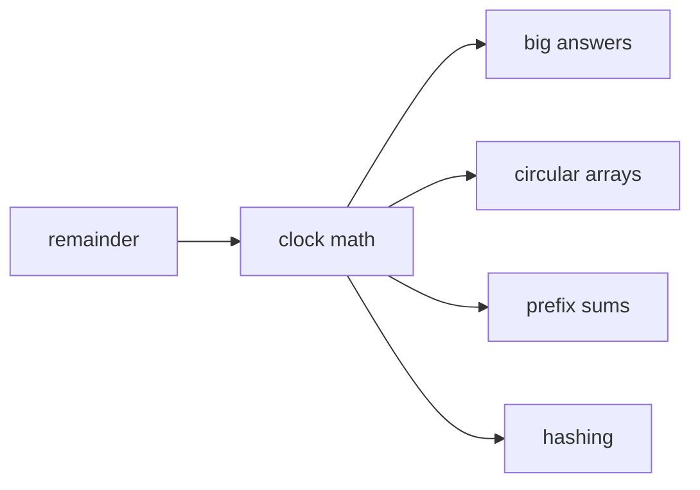
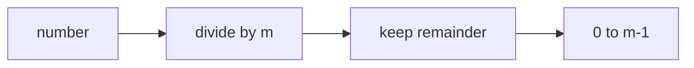
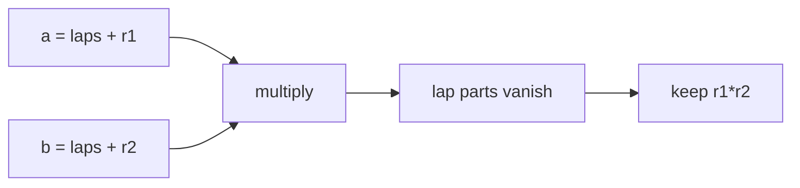
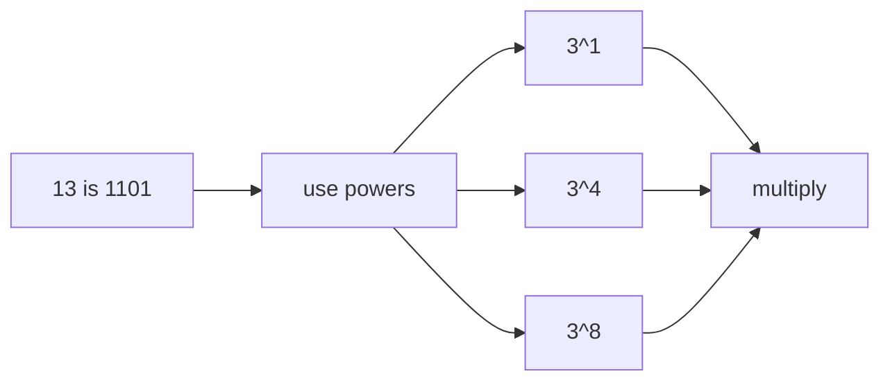
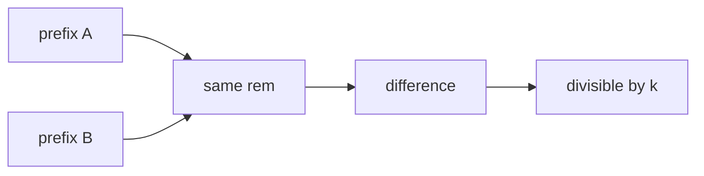
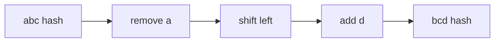
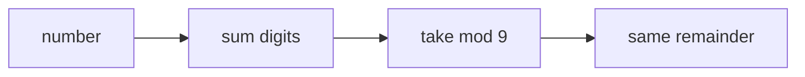

# 11 · Modular Arithmetic

> After this chapter you can make numbers wrap like clocks, keep huge answers small, use fast power, divide under a prime mod, and spot mod patterns in arrays and strings.

⬅️ [10 · GCD and LCM](../10-gcd-and-lcm/) · 🏠 [Roadmap](../README.md) · [12 · Bits and Binary](../12-bits-and-binary/) ➡️

## Contents

1. [Why this matters for DSA](#1-why-this-matters-for-dsa)
2. [Clock arithmetic](#2-clock-arithmetic)
3. [Rules for plus minus and multiply](#3-rules-for-plus-minus-and-multiply)
4. [Why answers are returned modulo a prime](#4-why-answers-are-returned-modulo-a-prime)
5. [Fast power](#5-fast-power)
6. [Fermat and modular inverse](#6-fermat-and-modular-inverse)
7. [Arrays and prefix remainders](#7-arrays-and-prefix-remainders)
8. [Hashing with remainders](#8-hashing-with-remainders)
9. [Last digits and digit sums](#9-last-digits-and-digit-sums)
10. [Java code](#10-java-code)
11. [Common mistakes](#11-common-mistakes)
12. [Interview patterns](#12-interview-patterns)
13. [Exercises](#13-exercises)
14. [One-minute recap](#14-one-minute-recap)

---

## 1. Why this matters for DSA

Modulo means "keep the remainder." It lets us turn huge numbers into small, safe numbers.

You will see it when:

- answers are too big and the problem says "return mod 10^9 + 7";
- indexes wrap around a circular array;
- prefix sums find subarrays divisible by `k`;
- fast power computes `x^n` without multiplying `n` times;
- modular inverse lets you divide under a prime mod;
- rolling hash turns a string window into one number.



Think of modulo as a fence around numbers. When a number walks past the fence, it wraps back inside.

---

## 2. Clock arithmetic

On a 12-hour clock, 10 plus 5 is not 15. The hand lands on 3.

```text
10 -> 11 -> 12 -> 1 -> 2 -> 3
```

So in clock language:

```text
10 + 5 ≡ 3 (mod 12)
```

The symbol `≡` means "has the same remainder as."

Weekdays wrap the same way:

```text
day 0 = Sunday
day 1 = Monday
...
day 6 = Saturday
day 7 wraps back to Sunday
```

### Circle picture

Here is a clock for modulo 7.

```text
          0
      6       1
    5           2
      4       3

Allowed remainders are 0, 1, 2, 3, 4, 5, 6.
```



### Definition

`a mod m` is the remainder after dividing `a` by `m`.

```text
17 mod 5 = 2        because 17 = 3 × 5 + 2
```

`a ≡ b (mod m)` means `a` and `b` have the same remainder when divided by `m`.

```text
17 ≡ 2 (mod 5)
```

🧠 **How to think of it yourself:** imagine walking around a circle with `m` spots. Every full lap
does not change where you stand. The remainder is your final spot.

---

## 3. Rules for plus minus and multiply

If `a = q × m + r`, then `r` is the only part that matters after taking mod `m`.
The full `q × m` laps disappear on the clock.

### Addition

```text
(a + b) mod m = ((a mod m) + (b mod m)) mod m
```

Example:

```text
(17 + 14) mod 5
= (2 + 4) mod 5
= 6 mod 5
= 1
```

### Subtraction

```text
(a - b) mod m = ((a mod m) - (b mod m) + m) mod m
```

We add `m` because subtraction can go negative.

```text
(3 - 8) mod 7
= -5 mod 7
= 2
```

### Multiplication

```text
(a × b) mod m = ((a mod m) × (b mod m)) mod m
```

Why? Write `a = q1 × m + r1` and `b = q2 × m + r2`.
When you multiply, every term with a full `m` disappears after mod. Only `r1 × r2` matters.



### Division warning

Division does **not** work directly:

```text
8 ≡ 3 (mod 5)
But 8 / 2 = 4 and 3 / 2 is not even an integer.
```

Under a mod, "division" means multiplying by a modular inverse. Section 6 explains it.

### Java negative remainder

Java `%` keeps the sign of the left number:

```text
-7 % 5 = -2
```

For a positive remainder, use:

```java
static int positiveMod(int a, int m) {
    return ((a % m) + m) % m;
}
```

Or use `Math.floorMod(a, m)`.

---

## 4. Why answers are returned modulo a prime

Many counting answers explode.

```text
2^10 = 1,024
2^30 ≈ 1 billion
2^100 is already huge
```

The number of paths in a grid, strings of length `n`, and arrangements can be enormous.
So problems often say:

```text
Return the answer modulo 10^9 + 7.
```

Why `10^9 + 7`?

| Reason | Meaning |
|---|---|
| It is prime | modular inverse works nicely with Fermat's little theorem |
| It fits in int | the final answer is below 1,000,000,007 |
| Products fit in long | `(MOD - 1) × (MOD - 1)` is about 10^18, below `long` limit |

Take the mod after every addition and multiplication.

```java
long answer = 0;
answer = (answer + ways) % MOD;
answer = answer * choices % MOD;
```

Use `long` for products:

```java
long product = (long) a * b % MOD;
```


---

## 5. Fast power

To compute `3^13`, do not multiply 13 times. Use the bits of 13.

```text
13 in binary = 1101
13 = 8 + 4 + 1
3^13 = 3^8 × 3^4 × 3^1
```

Build powers by squaring:

```text
3^1 = 3
3^2 = 9
3^4 = 81
3^8 = 6561
```

Use only the powers whose bits are 1.

### Trace for 3 to the 13

| Step | exponent bit | base | answer | Why |
|---|---:|---:|---:|---|
| start | — | 3 | 1 | empty product |
| 1 | 1 | 3 | 3 | use `3^1` |
| 2 | 0 | 9 | 3 | skip `3^2` |
| 3 | 1 | 81 | 243 | use `3^4` |
| 4 | 1 | 6561 | 1,594,323 | use `3^8` |

```text
3^13 = 1,594,323
```



### Complexity

Each loop cuts the exponent in half by shifting one bit away.
So fast power is `O(log n)`.

### Modular version

For modular power, take mod after every multiply.

```java
static long powerMod(long base, long exponent, long mod) {
    long answer = 1;
    base %= mod;
    while (exponent > 0) {
        if ((exponent & 1) == 1) {
            answer = answer * base % mod;
        }
        base = base * base % mod;
        exponent >>= 1;
    }
    return answer;
}
```

Problems:

- LeetCode 50 Pow(x, n);
- LeetCode 372 Super Pow;
- LeetCode 1922 Count Good Numbers.

---

## 6. Fermat and modular inverse

Fermat's little theorem says:

```text
If p is prime and a is not a multiple of p:
a^(p - 1) ≡ 1 (mod p)
```

Divide both sides by `a` in the idea sense:

```text
a^(p - 2) is the inverse of a modulo p
```

So:

```text
inverse(a) = a^(p - 2) mod p
```

### Small worked example with prime 7

Find the inverse of 3 mod 7.

```text
3^(7 - 2) = 3^5 = 243
243 mod 7 = 5
```

Check:

```text
3 × 5 = 15
15 mod 7 = 1
```

So dividing by 3 under mod 7 means multiplying by 5.

```text
4 / 3 mod 7
= 4 × inverse(3) mod 7
= 4 × 5 mod 7
= 20 mod 7
= 6
```


### nCr modulo p

For combinations in [13 · Counting and Combinatorics](../13-counting-and-combinatorics/):

```text
nCr = n! / (r! × (n-r)!)
```

Under a prime mod, precompute:

```text
fact[i] = i! mod p
invFact[i] = inverse(fact[i]) mod p

nCr mod p = fact[n] × invFact[r] × invFact[n-r] mod p
```

The inverse can be found with fast power. It can also be found with extended Euclid from
[10 · GCD and LCM](../10-gcd-and-lcm/).

---

## 7. Arrays and prefix remainders

### Circular indexes

If an array has length `n`, moving right from index `i` is:

```text
(i + 1) % n
```

Moving left is:

```text
(i - 1 + n) % n
```

For Rotate Array, use `k % n` because rotating by `n` changes nothing.

```text
[1, 2, 3, 4, 5], k = 7
k % n = 7 % 5 = 2
rotate right by 2 -> [4, 5, 1, 2, 3]
```

### Prefix sums modulo k

If two prefix sums have the same remainder, their difference is divisible by `k`.

```text
prefix[j] ≡ prefix[i] (mod k)
Then prefix[j] - prefix[i] ≡ 0 (mod k)
```

That difference is the subarray sum from `i + 1` to `j`.

```text
nums = [4, 5, 0, -2, -3, 1], k = 5

prefix sums:       0   4   9   9   7   4   5
remainders mod 5:  0   4   4   4   2   4   0
```

Every pair of equal remainders gives a subarray divisible by 5. This is the pigeonhole idea from
[13 · Counting and Combinatorics](../13-counting-and-combinatorics/).



Problems:

- LeetCode 974 Subarray Sums Divisible by K;
- LeetCode 523 Continuous Subarray Sum;
- LeetCode 1015 Smallest Integer Divisible by K.

---

## 8. Hashing with remainders

A rolling hash turns a string into a number.

For a base and a mod:

```text
hash = (hash × base + c) mod M
```

For `"cat"` with base 26:

```text
hash("cat") = ((c × 26 + a) × 26 + t) mod M
```

It is like place value from base chapters, but we keep taking mod so the number stays small.

### Sliding the window

For Rabin and Karp string search:

```text
old window: a b c
new window: b c d

remove a's contribution
multiply by base
add d
take mod
```



Collisions can happen: two different strings can have the same hash. A hash is a nickname, not the
whole person. That is why Rabin and Karp verifies the actual substring when hashes match.

The collision idea is related to the birthday paradox in
[14 · Probability and Randomness](../14-probability-and-randomness/).

Problems:

- LeetCode 28 Find the Index of the First Occurrence in a String;
- LeetCode 187 Repeated DNA Sequences;
- LeetCode 1044 Longest Duplicate Substring.

---

## 9. Last digits and digit sums

### Last digit cycles

The last digit of powers repeats.

For 7:

```text
7^1 last digit = 7
7^2 last digit = 9
7^3 last digit = 3
7^4 last digit = 1
7^5 last digit = 7 again
```

Cycle length is 4. For `7^222`, compute `222 mod 4 = 2`.
So the last digit is the 2nd item in the cycle: **9**.

### Digit sum modulo 9

Because `10 ≡ 1 (mod 9)`, every decimal place is just 1 modulo 9.

```text
538 mod 9
= (5 × 100 + 3 × 10 + 8) mod 9
= (5 × 1 + 3 × 1 + 8) mod 9
= 16 mod 9
= 7
```

This is called casting out nines. It connects back to divisibility from
[08 · Divisors and the Square Root Trick](../08-divisors-and-sqrt-trick/).



---

## 10. Java code

Code: [`ModularArithmetic.java`](ModularArithmetic.java)

Key methods:

```java
static int positiveMod(int number, int mod)
static long powerMod(long base, long exponent, long mod)
static int subarraysDivByK(int[] numbers, int k)
static boolean checkSubarraySum(int[] numbers, int k)
static int strStrRabinKarp(String haystack, String needle)
```

Run it:

```text
cd maths_for_dsa/11-modular-arithmetic
java ModularArithmetic.java
```

Real output:

```text
positiveMod(-7, 5) = 3
addMod(8, 9, 7) = 3
subtractMod(3, 8, 7) = 2
multiplyMod(123456789, 987654321, MOD) = 259106859
fastPower(2, 10) = 1024.0
powerMod(3, 13, 1_000_000_007) = 1594323
superPow(2, [1,0]) = 1024
countGoodNumbers(4) = 400
rotateRight([1,2,3,4,5], 2) = [4, 5, 1, 2, 3]
subarraysDivByK([4,5,0,-2,-3,1], 5) = 7
checkSubarraySum([23,2,4,6,7], 6) = true
smallestRepunitDivByK(3) = 3
strStrRabinKarp(mississippi, issip) = 4
repeatedDnaSequences(...) = [AAAAACCCCC, CCCCCAAAAA]
lastDigitOfPower(7, 222) = 9
digitSumMod9(9876543210) = 0
numPrimeArrangements(5) = 12
```

---

## 11. Common mistakes

| Mistake | Why it hurts | Fix |
|---|---|---|
| Using Java `%` for negatives directly | It can return a negative remainder | Use `((a % m) + m) % m` |
| Taking mod only at the end | Intermediate numbers overflow | Take mod after every plus and multiply |
| Multiplying ints | Product can overflow before mod | Cast to `long` first |
| Dividing normally under mod | Division does not preserve remainders | Multiply by modular inverse |
| Forgetting the length rule in LC 523 | Single number is not enough | Need subarray length at least 2 |
| Rotating by raw `k` | Large `k` wastes work | Use `k % n` |
| Trusting hash alone | Collisions can lie | Verify substring on hash match |

---

## 12. Interview patterns

| Pattern | How to recognise it | LeetCode problems |
|---|---|---|
| Fast power | compute `x^n` or huge powers | 50 Pow(x, n), 372 Super Pow |
| Count with big mod | answer explodes with `n` | 1922 Count Good Numbers, 1175 Prime Arrangements |
| Circular indexing | array wraps around | 189 Rotate Array |
| Prefix remainder | subarray sum divisible by `k` | 974 Subarray Sums Divisible by K, 523 Continuous Subarray Sum |
| Remainder automaton | build a number digit by digit | 1015 Smallest Integer Divisible by K |
| Rolling hash | find matching string windows | 28 Find the Index of the First Occurrence in a String, 187 Repeated DNA Sequences |
| Last digit cycle | asks for final digit of a huge power | power digit puzzles |
| Modular inverse | division appears with a prime mod | nCr mod prime, combinatorics |

---

## 13. Exercises

### Level 1 · Warm-up

**1.** Compute `17 mod 5`.

<details>
<summary>Answer</summary>

**2** — `17 = 3 × 5 + 2`.

</details>

**2.** What does `17 ≡ 2 (mod 5)` mean?

<details>
<summary>Answer</summary>

**They have the same remainder when divided by 5.** Both leave remainder 2.

</details>

**3.** Compute `(8 + 9) mod 7`.

<details>
<summary>Answer</summary>

**3** — `17 mod 7 = 3`.

</details>

**4.** Compute `(3 - 8) mod 7` as a positive remainder.

<details>
<summary>Answer</summary>

**2** — `3 - 8 = -5`, and `-5 + 7 = 2`.

</details>

**5.** What is Java's `-7 % 5`, and what is the positive remainder?

<details>
<summary>Answer</summary>

**Java gives -2**, while the positive remainder is **3**.

</details>

**6.** If an array has length 5, where does index 4 go after one step right?

<details>
<summary>Answer</summary>

**0** — `(4 + 1) % 5 = 0`.

</details>

**7.** Rotate right by `k = 7` in an array of length 5. What useful `k` remains?

<details>
<summary>Answer</summary>

**2** — `7 % 5 = 2`.

</details>

### Level 2 · Practice

**8.** Compute `3^13`.

<details>
<summary>Answer</summary>

**1,594,323** — `13 = 8 + 4 + 1`, so `3^13 = 3^8 × 3^4 × 3`.

</details>

**9.** Compute `3^13 mod 1,000,000,007`.

<details>
<summary>Answer</summary>

**1,594,323** — the number is already smaller than the mod.

</details>

**10.** Compute the inverse of 3 modulo 7 using Fermat's little theorem.

<details>
<summary>Answer</summary>

**5** — `3^(7-2) = 243`, and `243 mod 7 = 5`.

</details>

**11.** Compute `4 / 3 mod 7`.

<details>
<summary>Answer</summary>

**6** — inverse of 3 is 5, so `4 × 5 mod 7 = 20 mod 7 = 6`.

</details>

**12.** Count subarrays divisible by 5 in `[4, 5, 0, -2, -3, 1]`.

<details>
<summary>Answer</summary>

**7** — equal prefix remainders form 7 valid pairs.

</details>

**13.** Does `[23, 2, 4, 6, 7]` have a length at least 2 subarray sum divisible by 6?

<details>
<summary>Answer</summary>

**Yes** — `[2, 4]` sums to 6.

</details>

**14.** What is the smallest repunit length divisible by 3?

<details>
<summary>Answer</summary>

**3** — `111` is divisible by 3.

</details>

**15.** What is the last digit of `7^222`?

<details>
<summary>Answer</summary>

**9** — the cycle is 7, 9, 3, 1, and `222 mod 4 = 2`.

</details>

### Level 3 · Interview

**16.** Why is fast power `O(log n)`?

<details>
<summary>Answer</summary>

**The exponent is halved each loop.** Halving repeatedly takes logarithmic steps.

</details>

**17.** Why do we use `long` for `(a * b) % MOD`?

<details>
<summary>Answer</summary>

**Because int multiplication can overflow before the mod happens.** `long` safely holds the product of two residues below `10^9 + 7`.

</details>

**18.** In LC 974, why do two equal prefix remainders make a valid subarray?

<details>
<summary>Answer</summary>

**Their difference has remainder 0.** That difference is exactly the subarray sum.

</details>

**19.** In LC 523, why do we store the first index for a remainder?

<details>
<summary>Answer</summary>

**To make the subarray as long as possible and check length at least 2.** Replacing it could hide a valid earlier pair.

</details>

**20.** Compute `countGoodNumbers(4)`.

<details>
<summary>Answer</summary>

**400** — two even positions have 5 choices each and two odd positions have 4 choices each, so `5^2 × 4^2 = 400`.

</details>

**21.** Find the index of `"issip"` in `"mississippi"`.

<details>
<summary>Answer</summary>

**4** — `"mississippi".substring(4, 9)` is `"issip"`.

</details>

**22.** Which repeated DNA sequences of length 10 appear in `AAAAACCCCCAAAAACCCCCCAAAAAGGGTTT`?

<details>
<summary>Answer</summary>

**AAAAACCCCC and CCCCCAAAAA** — those two windows appear more than once.

</details>

**23.** Compute `9876543210 mod 9` using digit sums.

<details>
<summary>Answer</summary>

**0** — the digit sum is 45, and `45 mod 9 = 0`.

</details>

**24.** How many prime arrangements are there for `n = 5`?

<details>
<summary>Answer</summary>

**12** — primes are 2, 3, 5, so arrange 3 prime slots in `3!` ways and 2 non-prime slots in `2!` ways: `6 × 2 = 12`.

</details>

---

## 14. One-minute recap

- Modulo keeps the remainder, like a clock keeping the final position.
- `a ≡ b (mod m)` means the two numbers have the same remainder.
- Addition, subtraction, and multiplication work with remainders; division needs an inverse.
- Java `%` can be negative, so use `((a % m) + m) % m` or `Math.floorMod`.
- `10^9 + 7` is popular because it is prime and safe with `long` products.
- Fast power uses exponent bits and runs in `O(log n)`.
- Fermat gives `inverse(a) = a^(p-2) mod p` when `p` is prime.
- Prefix remainders solve subarray divisibility, and rolling hashes solve string windows.
