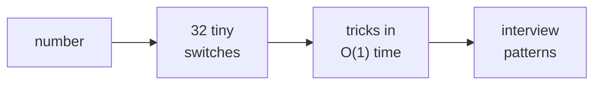
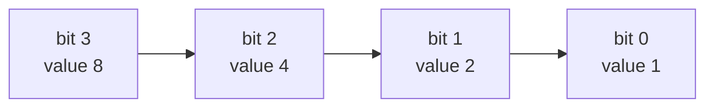
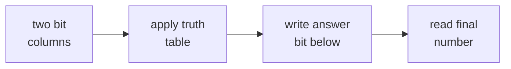
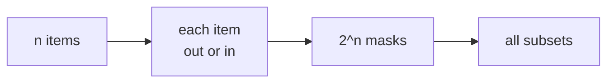
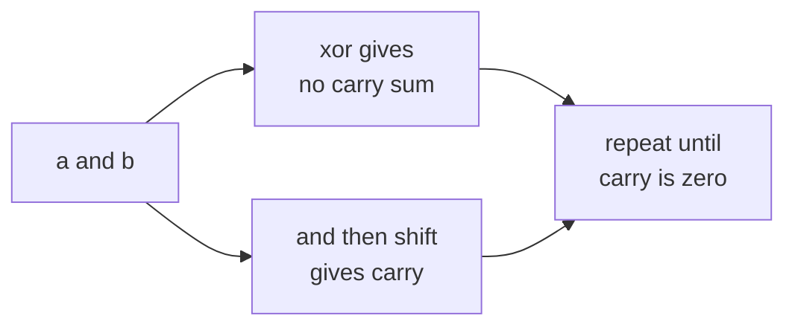

# 12 · Bits and Binary

> After this chapter you can read binary like switches, use Java bit operators safely, and solve the classic bit interview problems.

⬅️ [11 · Modular Arithmetic](../11-modular-arithmetic/) · 🏠 [Roadmap](../README.md) · [13 · Counting and Combinatorics](../13-counting-and-combinatorics/) ➡️

## Contents

1. [Why this matters for DSA](#1-why-this-matters-for-dsa)
2. [Binary as light switches](#2-binary-as-light-switches)
3. [Bitwise operators](#3-bitwise-operators)
4. [Shifts in Java](#4-shifts-in-java)
5. [Negative numbers](#5-negative-numbers)
6. [Single bit operations](#6-single-bit-operations)
7. [Classic bit tricks](#7-classic-bit-tricks)
8. [Counting and moving bits](#8-counting-and-moving-bits)
9. [Bitmasks as sets](#9-bitmasks-as-sets)
10. [Adding without plus](#10-adding-without-plus)
11. [Level 3 bit patterns](#11-level-3-bit-patterns)
12. [Java code](#12-java-code)
13. [Common mistakes](#13-common-mistakes)
14. [Interview patterns](#14-interview-patterns)
15. [Exercises](#15-exercises)
16. [One-minute recap](#16-one-minute-recap)

---

## 1. Why this matters for DSA

Bits are the tiny on/off switches inside every number. Most days you can write normal arithmetic and forget
about them. In interviews, bits suddenly become useful because they let you:

- store a whole set inside one integer;
- cancel duplicate numbers with XOR;
- test powers of two in O(1);
- count differences between two numbers quickly;
- loop over all subsets when n is small, often n ≤ 20;
- understand overflow, negative numbers and Java shifts.



Think of bits as a row of lamps. A lamp is either **off** (`0`) or **on** (`1`). A whole number is just a
row of these lamps, where each lamp has a value.

```text
value:   128  64  32  16   8   4   2   1
bit:       0   0   1   0   1   1   0   0
meaning:          32      +8  +4        = 44
```

This chapter starts with that picture and builds up to LeetCode problems like Single Number, Counting
Bits, Sum of Two Integers and Bitwise AND of Numbers Range.

---

## 2. Binary as light switches

### 2.1 Counting with only zero and one

In decimal, each digit can be 0 to 9. In binary, each digit can only be 0 or 1. When a digit cannot grow
any more, it resets to 0 and carries to the next position. This is the same idea from
[02 · Digits and Number Bases](../02-digits-and-number-bases/), just with base 2.

```text
Decimal  Binary
0        0000
1        0001
2        0010
3        0011
4        0100
5        0101
6        0110
7        0111
8        1000
9        1001
10       1010
11       1011
12       1100
13       1101
14       1110
15       1111
```

Why does this work? Because each position is worth a power of 2:

| Position k | 3 | 2 | 1 | 0 |
|---|---:|---:|---:|---:|
| Value 2^k | 8 | 4 | 2 | 1 |
| Bit in 1101 | 1 | 1 | 0 | 1 |
| Contribution | 8 | 4 | 0 | 1 |

So `1101₂ = 8 + 4 + 1 = 13`.



```text
Binary 10110:

position:   4   3   2   1   0
value:     16   8   4   2   1
bit:        1   0   1   1   0
take:      16       4   2

10110₂ = 16 + 4 + 2 = 22
```

### 2.2 How to think of it yourself

Ask: "Which powers of 2 do I need to build the number?"

For 44:

```text
44 = 32 + 8 + 4

value: 128  64  32  16   8   4   2   1
bit:     0   0   1   0   1   1   0   0

44 = 00101100₂
```

Java gives the binary string:

```java
Integer.toBinaryString(44)   // "101100"
```

It does not show leading zeros. Add them yourself when you want an 8-bit or 32-bit picture.

---

## 3. Bitwise operators

Bitwise operators work column by column, like checking two rows of lamps.

| Operator | Name | Kid picture |
|---|---|---|
| `&` | AND | lamp is on only if both lamps are on |
| `\|` | OR | lamp is on if at least one lamp is on |
| `^` | XOR | lamp is on if the lamps are different |
| `~` | NOT | flip every lamp |

### 3.1 Truth tables

| a | b | `a & b` | `a \| b` | `a ^ b` |
|---:|---:|---:|---:|---:|
| 0 | 0 | 0 | 0 | 0 |
| 0 | 1 | 0 | 1 | 1 |
| 1 | 0 | 0 | 1 | 1 |
| 1 | 1 | 1 | 1 | 0 |

For NOT:

| a | `~a` at one bit |
|---:|---:|
| 0 | 1 |
| 1 | 0 |

### 3.2 Column pictures

Use `a = 44` and `b = 21`.

```text
a        = 00101100
b        = 00010101

a & b    = 00000100   only columns where both have 1
a | b    = 00111101   columns where at least one has 1
a ^ b    = 00111001   columns where they are different
~a       = 11010011   every shown bit flips
```

Why does `a & b` equal 4? Only the value-4 column has `1` in both rows.



Java:

```java
int a = 44;         // 00101100
int b = 21;         // 00010101
int and = a & b;    // 4
int or = a | b;     // 61
int xor = a ^ b;    // 57
int not = ~a;       // all 32 bits flip, not only 8
```

The important why:

- AND is a **filter**. It keeps only 1s that are allowed by the mask.
- OR is an **adder of switches**. It turns on chosen bits.
- XOR is a **difference detector**. Same bits become 0, different bits become 1.
- NOT flips all 32 bits for `int`, so it also changes the sign.

---

## 4. Shifts in Java

Shifts move all bits left or right.

| Operator | Name | Meaning |
|---|---|---|
| `x << k` | left shift | move bits left, multiply by 2^k when no overflow |
| `x >> k` | signed right shift | move bits right, divide by 2^k and keep the sign |
| `x >>> k` | unsigned right shift | move bits right, fill left side with 0 |

### 4.1 Left shift

```text
5 = 00000101

5 << 2:

00000101
     move left 2 places
00010100 = 20
```

Why multiply by 2^k? In base 10, appending one zero multiplies by 10. In base 2, shifting left one place
multiplies by 2. Shifting left k places multiplies by 2^k.

```java
5 << 2     // 20, same as 5 × 4
1 << 5     // 32
```

### 4.2 Signed right shift

```text
20 = 00010100

20 >> 2:

00010100
  move right 2 places
00000101 = 5
```

For negative numbers, Java keeps the sign by filling new left bits with 1.

```java
-20 >> 2    // -5
```

### 4.3 Unsigned right shift

`>>>` always fills with 0. This is useful when you want to treat the bits as a raw pattern, not as a signed
number.

```java
-20 >>> 2   // 1073741819
```

```text
signed right shift:    left side copies the old sign bit
unsigned right shift:  left side always gets 0
```

🧠 How to think of it yourself: shifting changes **positions**, not the lamps themselves. Moving a `1`
from the 4s place to the 16s place makes it worth more. Moving it from the 16s place to the 4s place makes
it worth less.

---

## 5. Negative numbers

Java `int` uses 32 bits. It does not store a separate minus sign. It uses **two's complement**.

### 5.1 The odometer picture

Imagine a car odometer with only 4 binary digits. It goes from `0000` to `1111`, then wraps around.

```text
unsigned view:
0000 0001 0010 0011 0100 0101 0110 0111 1000 ... 1111
0    1    2    3    4    5    6    7    8        15

signed 4-bit view:
0000 0001 0010 0011 0100 0101 0110 0111 1000 ... 1111
0    1    2    3    4    5    6    7   -8       -1
```

Why is `1111` equal to -1? Because adding 1 wraps to 0:

```text
1111
+  1
-----
0000   with a carry that falls off the left edge
```

So `1111` behaves like "one step before zero", which is -1.

### 5.2 Flip the bits and add 1

To write `-x` in two's complement:

1. write `x`;
2. flip every bit;
3. add 1.

For an 8-bit picture of -12:

```text
12        = 00001100
flip bits = 11110011
add 1     = 11110100

So -12 is 11110100 in this 8-bit picture.
```

Why does it work? `x + (~x)` is all 1s, which is -1. So `x + (~x + 1)` becomes 0. That means `~x + 1`
is exactly `-x`.

### 5.3 Why the int range is uneven

With 32 bits there are 2³² different patterns. Half start with `0`, and half start with `1`.

```text
0xxxx...xxxx  -> non-negative numbers
1xxxx...xxxx  -> negative numbers
```

The non-negative side includes 0, so it has room for `0` to `2³¹ − 1`. The negative side has room for
`-2³¹` to `-1`.

```text
int range:
-2,147,483,648  to  2,147,483,647
-2^31           to  2^31 - 1
```

### 5.4 The rule for NOT

Because `~x` flips every bit:

```text
x + ~x = -1
```

Move `x` to the other side:

```text
~x = -x - 1
```

Example:

```java
~12 == -13       // true
```

🧠 How to think of it yourself: on a wrapping odometer, -1 is the pattern just before 0. Since `x` and
`~x` together turn on every lamp, their sum is that "just before 0" pattern.

---

## 6. Single bit operations

Bit k means the place worth 2^k. We count from the right, starting at 0.

```text
number:    44 = 00101100
position:       76543210
bits on:           5 3 2
```

### 6.1 Check bit k

Move bit k down to position 0, then ask if the last bit is 1.

```java
int bit = (x >> k) & 1;
```

For `x = 44`, `k = 3`:

```text
00101100 >> 3 = 00000101
00000101 & 1  = 00000001
answer = 1
```

### 6.2 Set bit k

Make a mask with only bit k on, then OR it in.

```java
int result = x | (1 << k);
```

```text
x          = 00101100
1 << 1     = 00000010
x | mask   = 00101110 = 46
```

### 6.3 Clear bit k

Make a mask with bit k off and every other bit on, then AND it.

```java
int result = x & ~(1 << k);
```

```text
x          = 00101100
1 << 3     = 00001000
~mask      = 11110111
x & ~mask  = 00100100 = 36
```

### 6.4 Toggle bit k

XOR with a mask. Same bits become 0, different bits become 1, so the chosen bit flips.

```java
int result = x ^ (1 << k);
```

```text
x          = 00101100
1 << 2     = 00000100
x ^ mask   = 00101000 = 40
```

For k ≥ 31, use `1L << k`, not `1 << k`, because `1` is an `int`.

```java
long bit40 = 1L << 40;
```

---

## 7. Classic bit tricks

### 7.1 Remove the lowest one bit

The trick:

```java
x & (x - 1)
```

Picture with `x = 44`:

```text
x       = 00101100
x - 1   = 00101011
x&(x-1) = 00101000
```

Why? Subtracting 1 changes the lowest `1` to `0`, and changes all bits after it to `1`. AND keeps the
shared left part and removes that lowest `1`.

```text
before:  [same left bits] 1 000...000
minus 1: [same left bits] 0 111...111
AND:     [same left bits] 0 000...000
```

Uses:

- count set bits by repeatedly removing one `1`;
- test power of two: a positive power of two has exactly one `1`.

```java
while (x != 0) {
    x = x & (x - 1);
    count++;
}

boolean power = x > 0 && (x & (x - 1)) == 0;
```

### 7.2 Keep only the lowest one bit

The trick:

```java
x & -x
```

Picture with `x = 44`:

```text
x       = 00101100
-x      = 11010100
x & -x  = 00000100
```

Why? `-x` is `~x + 1`. Everything below the lowest `1` becomes 0, the lowest `1` stays 1, and higher bits
flip. AND keeps only that shared lowest `1`.

This is the famous Fenwick tree move: `index += index & -index` or `index -= index & -index`.

### 7.3 XOR cancellation

Three tiny laws:

```text
x ^ x = 0
x ^ 0 = x
XOR is commutative and associative
```

Commutative means order does not matter. Associative means grouping does not matter.

```text
4 ^ 1 ^ 2 ^ 1 ^ 2
= 4 ^ (1 ^ 1) ^ (2 ^ 2)
= 4 ^ 0 ^ 0
= 4
```

That solves Single Number (136): every paired number cancels, and the lonely number remains.

Missing Number (268) uses the same idea. XOR all indexes `0..n` and all given numbers. Equal values
cancel, and the missing value remains.

### 7.4 Swap with XOR

```java
a = a ^ b;
b = a ^ b;
a = a ^ b;
```

Why it works:

```text
after first line: a holds oldA ^ oldB
second line:      b = oldA ^ oldB ^ oldB = oldA
third line:       a = oldA ^ oldB ^ oldA = oldB
```

Do not use this in real code. It is harder to read, can break when both variables refer to the same array
slot, and modern compilers handle a temporary variable well.

### 7.5 Odd or even

The last bit tells whether a number is odd.

```java
(x & 1) == 1    // odd
(x & 1) == 0    // even
```

Why? All powers of 2 except 2⁰ are even. Only the 1s place decides odd or even.

---

## 8. Counting and moving bits

### 8.1 Built-in counting

Java has fast library methods:

```java
Integer.bitCount(x)
Integer.highestOneBit(x)
Integer.numberOfTrailingZeros(x)
Integer.numberOfLeadingZeros(x)
```

For 44:

```text
44 = 00101100

bitCount                = 3
highestOneBit           = 32
numberOfTrailingZeros   = 2
numberOfLeadingZeros    = 26 in a 32-bit int
```

### 8.2 Counting Bits DP

LeetCode 338 asks for bit counts from 0 to n.

Rule:

```java
bits[i] = bits[i >> 1] + (i & 1);
```

Why? `i >> 1` removes the last bit. Then `(i & 1)` adds back whether the removed bit was 1.

```text
i       = 13 = 1101
i >> 1  =  6 = 0110
i & 1   =  1

bits[13] = bits[6] + 1
```

### 8.3 Hamming Distance

Hamming Distance (461) counts positions where two numbers differ.

XOR first, then count 1s:

```java
Integer.bitCount(a ^ b)
```

```text
25 = 11001
30 = 11110
XOR= 00111

3 different positions
```

### 8.4 Reverse Bits and Number of One Bits

Reverse Bits (190) moves bits one by one into the answer:

```java
int answer = 0;
for (int i = 0; i < 32; i++) {
    answer <<= 1;
    answer |= x & 1;
    x >>>= 1;
}
```

Number of 1 Bits (191) is `Integer.bitCount(x)` or Brian Kernighan's loop from section 7.

---

## 9. Bitmasks as sets

A bitmask is an integer pretending to be a set. Bit i says whether item i is inside.

For items `[A, B, C]`:

| Mask | Bits | Set |
|---:|---|---|
| 0 | 000 | `{}` |
| 1 | 001 | `{A}` |
| 2 | 010 | `{B}` |
| 3 | 011 | `{A, B}` |
| 4 | 100 | `{C}` |
| 5 | 101 | `{A, C}` |
| 6 | 110 | `{B, C}` |
| 7 | 111 | `{A, B, C}` |

There are 2^n masks for n items, because each item has two choices: out or in.



### 9.1 Basic set operations

```java
boolean hasI = ((mask >> i) & 1) == 1;
mask = mask | (1 << i);        // add i
mask = mask & ~(1 << i);       // remove i
mask = mask ^ (1 << i);        // toggle i
```

### 9.2 Enumerate all subsets

```java
for (int mask = 0; mask < (1 << n); mask++) {
    for (int i = 0; i < n; i++) {
        if (((mask >> i) & 1) == 1) {
            // item i is in this subset
        }
    }
}
```

This is the standard shape for Subsets (78).

### 9.3 Iterate submasks of a mask

```java
for (int s = m; s > 0; s = (s - 1) & m) {
    // s is a non-empty submask of m
}
```

Why does it work? `s - 1` moves to the previous number. AND with `m` throws away any bits that are not
allowed by `m`.

```text
m = 10110

s values:
10110
10100
10010
10000
00110
00100
00010
```

Bitmask DP mention: when n is small, a DP state can be `dp[mask]`, meaning "answer for this chosen set".
For n = 20, there are 2²⁰ = 1,048,576 states, which is often possible.

Gray Code (89) asks for an order of masks where only one bit changes each step. A common formula is:

```java
gray = i ^ (i >> 1);
```

---

## 10. Adding without plus

LeetCode 371 asks for sum without `+`.

Think of school addition:

- XOR gives the sum **without carry**.
- AND finds positions where both bits are 1, so a carry is born.
- Shift the carry left by 1, because carry moves to the next column.

```text
  7 = 0111
 13 = 1101

XOR        1010   sum without carry
AND        0101   carry starts here
AND << 1   1010   carry moves left
```

Then repeat until there is no carry.

```java
while (b != 0) {
    int sumWithoutCarry = a ^ b;
    int carry = (a & b) << 1;
    a = sumWithoutCarry;
    b = carry;
}
return a;
```



---

## 11. Level 3 bit patterns

### 11.1 Single Number II

Problem 137: every number appears three times except one.

Count each bit position. If a bit count is not divisible by 3, the lonely number has a 1 there.

```text
nums = [2, 2, 3, 2]

2 = 10
2 = 10
3 = 11
2 = 10

ones column count = 1  -> 1 mod 3 -> answer has bit 0
twos column count = 4  -> 1 mod 3 -> answer has bit 1

answer = 11₂ = 3
```

### 11.2 Single Number III

Problem 260: exactly two numbers are lonely.

1. XOR all numbers. Pairs cancel, leaving `a ^ b`.
2. Pick one bit where `a` and `b` differ, often `xorAll & -xorAll`.
3. Split numbers by that bit.
4. XOR inside each group.

```text
nums = [1, 2, 1, 3, 2, 5]

xorAll = 3 ^ 5 = 6 = 110
lowest set bit = 010

group bit off: 1, 1, 5 -> 5
group bit on:  2, 3, 2 -> 3
```

### 11.3 Bitwise AND of Numbers Range

Problem 201 asks for `left & (left+1) & ... & right`.

Only the common left prefix survives. Any bit that changes somewhere in the range becomes 0.

```text
5 = 101
6 = 110
7 = 111

common left prefix is 1__
answer = 100 = 4
```

Code:

```java
int shifts = 0;
while (left < right) {
    left >>= 1;
    right >>= 1;
    shifts++;
}
return left << shifts;
```

---

## 12. Java code

Code file: [`BitTricks.java`](BitTricks.java)

Key methods:

```java
static int checkBit(int x, int k) {
    return (x >> k) & 1;
}

static boolean isPowerOfTwo(int x) {
    return x > 0 && (x & (x - 1)) == 0;
}

static int sumWithoutPlus(int a, int b) {
    while (b != 0) {
        int sumWithoutCarry = a ^ b;
        int carry = (a & b) << 1;
        a = sumWithoutCarry;
        b = carry;
    }
    return a;
}
```

Run it:

```text
cd maths_for_dsa/12-bits-and-binary
java BitTricks.java
```

Real output:

```text
8-bit a = 44 -> 00101100
8-bit b = 21 -> 00010101
a & b = 4 -> 00000100
a | b = 61 -> 00111101
a ^ b = 57 -> 00111001
~a low 8 bits -> 11010011
5 << 2 = 20
-20 >> 2 = -5
-20 >>> 2 = 1073741819
-1 as 32 bits = 11111111111111111111111111111111
~12 = -13, and -12 - 1 = -13
Check bit 3 of 44 = 1
Set bit 1 of 44 = 46
Clear bit 3 of 44 = 36
Toggle bit 2 of 44 = 40
bitCount(44) = 3
Brian count(44) = 3
44 & (44 - 1) = 40 -> 00101000
44 & -44 = 4 -> 00000100
32 is power of two? true
48 is power of two? false
64 is power of four? true
Single number = 4
Missing number = 2
Counting bits to 8 = [0, 1, 1, 2, 1, 2, 2, 3, 1]
Hamming distance 25, 30 = 3
Reverse bits of 00000101 ends with = 00000000
Subsets of [A, B, C]:
[[], [A], [B], [A, B], [C], [A, C], [B, C], [A, B, C]]
Submasks of 00010110:
[00010110, 00010100, 00010010, 00010000, 00000110, 00000100, 00000010]
7 + 13 without plus = 20
Single number II = 3
Single number III = [5, 3]
Range AND 5..7 = 4
Max product word lengths = 16
XOR operation n=5, start=0 = 8
highestOneBit(44) = 32
numberOfTrailingZeros(44) = 2
numberOfLeadingZeros(44) = 26
1L << 40 = 1099511627776
```

---

## 13. Common mistakes

1. Forgetting parentheses:
   ```java
   x & 1 == 0       // does not compile in Java
   (x & 1) == 0     // correct
   ```
   Java reads the first one like `x & (1 == 0)`, and `1 == 0` is a boolean.
2. Using `1 << k` when k is large. For k ≥ 31, use `1L << k`.
3. Forgetting `x > 0` in the power-of-two test. Zero is not a power of two.
4. Expecting `~x` to flip only the bits you can see. It flips all 32 bits of an `int`.
5. Confusing `>>` and `>>>` for negative numbers.
6. Thinking bitmasks are always faster. They help when n is small enough for 2^n states.
7. XOR swapping in real code. Use a temporary variable; clarity wins.

---

## 14. Interview patterns

| Pattern | How to recognise it | LeetCode problems |
|---|---|---|
| Pair cancellation | all numbers appear twice except one | 136 Single Number, 268 Missing Number |
| Count bits | asks for number of 1s or bit counts for many values | 191 Number of 1 Bits, 338 Counting Bits |
| Differing positions | asks how many bit positions differ | 461 Hamming Distance |
| One set bit | power of two or lowest bit | 231 Power of Two, 342 Power of Four |
| Carry simulation | add without plus | 371 Sum of Two Integers |
| Small n subsets | n ≤ 20, choose any subset | 78 Subsets, 89 Gray Code |
| Split by a bit | two lonely answers among pairs | 260 Single Number III |
| Count bits mod k | numbers repeat k times | 137 Single Number II |
| Common prefix | bitwise AND over a range | 201 Bitwise AND of Numbers Range |
| Character set mask | words with no shared letters | 318 Maximum Product of Word Lengths |
| Formula XOR | repeated XOR sequence | 1486 XOR Operation in an Array |
| Reverse or shift bits | raw 32-bit pattern manipulation | 190 Reverse Bits |

---

## 15. Exercises

### Level 1 · Warm-up

**1.** Convert decimal 13 to 4-bit binary.

<details>
<summary>Answer</summary>

**The answer** — `1101`, because 13 = 8 + 4 + 1.

</details>

**2.** Convert binary `10110` to decimal.

<details>
<summary>Answer</summary>

**The answer** — 22, because `10110₂ = 16 + 4 + 2`.

</details>

**3.** What is `44 & 21`? Use 8-bit columns.

<details>
<summary>Answer</summary>

**The answer** — 4.

```text
44 = 00101100
21 = 00010101
&  = 00000100
```

</details>

**4.** What is `44 | 21`?

<details>
<summary>Answer</summary>

**The answer** — 61.

```text
00101100
00010101
--------
00111101 = 61
```

</details>

**5.** What is `44 ^ 21`?

<details>
<summary>Answer</summary>

**The answer** — 57, because XOR keeps columns that differ.

</details>

**6.** What is `5 << 3`?

<details>
<summary>Answer</summary>

**The answer** — 40. Left shift by 3 multiplies by 2³ = 8, so 5 × 8 = 40.

</details>

**7.** What is `(44 >> 2) & 1`?

<details>
<summary>Answer</summary>

**The answer** — 1. `44 = 00101100`; bit 2 is on.

</details>

**8.** Set bit 1 of 44. What number do you get?

<details>
<summary>Answer</summary>

**The answer** — 46.

```text
44       = 00101100
1 << 1   = 00000010
OR       = 00101110 = 46
```

</details>

**9.** Clear bit 3 of 44. What number do you get?

<details>
<summary>Answer</summary>

**The answer** — 36.

```text
44       = 00101100
clear 8s = 00100100 = 36
```

</details>

**10.** Is 64 a power of two using the bit trick?

<details>
<summary>Answer</summary>

**The answer** — yes. `64 = 01000000`, so `64 & 63 = 0`, and 64 is positive.

</details>

### Level 2 · Practice

**11.** Count the 1-bits in 44 using `x & (x - 1)`.

<details>
<summary>Answer</summary>

**The answer** — 3.

```text
44 -> 40 -> 32 -> 0
```

Each step removes one 1-bit.

</details>

**12.** What is `44 & -44`?

<details>
<summary>Answer</summary>

**The answer** — 4, the lowest set bit of 44.

</details>

**13.** Find the single number in `[4, 1, 2, 1, 2]`.

<details>
<summary>Answer</summary>

**The answer** — 4. The two 1s cancel and the two 2s cancel under XOR.

</details>

**14.** Find the missing number from `[3, 0, 1]`, where the full range is 0..3.

<details>
<summary>Answer</summary>

**The answer** — 2. XOR all indexes and values; equal numbers cancel.

</details>

**15.** Compute the Hamming distance between 25 and 30.

<details>
<summary>Answer</summary>

**The answer** — 3.

```text
25  = 11001
30  = 11110
XOR = 00111
```

</details>

**16.** List the subsets represented by masks 0 to 7 for items `[A, B, C]`.

<details>
<summary>Answer</summary>

**The answer** — `{}`, `{A}`, `{B}`, `{A,B}`, `{C}`, `{A,C}`, `{B,C}`, `{A,B,C}`.

</details>

**17.** What are the non-empty submasks of `10110₂` using `(s - 1) & m`?

<details>
<summary>Answer</summary>

**The answer** — `10110`, `10100`, `10010`, `10000`, `00110`, `00100`, `00010`.

</details>

**18.** Use Counting Bits DP to find counts for 0..8.

<details>
<summary>Answer</summary>

**The answer** — `[0, 1, 1, 2, 1, 2, 2, 3, 1]`.

</details>

**19.** What is `7 + 13` using the XOR and carry idea?

<details>
<summary>Answer</summary>

**The answer** — 20. Repeating `sum = a ^ b` and `carry = (a & b) << 1` eventually gives carry 0 and sum 20.

</details>

**20.** In Java, why should you write `((x & 1) == 0)` and not `x & 1 == 0`?

<details>
<summary>Answer</summary>

**The answer** — `x & 1 == 0` does not compile. Java parses it like `x & (1 == 0)`, mixing an int and a boolean.

</details>

### Level 3 · Interview

**21.** Single Number II: find the lonely number in `[2, 2, 3, 2]`.

<details>
<summary>Answer</summary>

**The answer** — 3. Count every bit modulo 3. The bit counts not divisible by 3 form `11₂`.

</details>

**22.** Single Number III: find the two lonely numbers in `[1, 2, 1, 3, 2, 5]`.

<details>
<summary>Answer</summary>

**The answer** — 5 and 3. XOR all gives `6 = 110₂`; split by lowest set bit `010₂`; each group XORs to one lonely number.

</details>

**23.** What is the bitwise AND of every number from 5 to 7?

<details>
<summary>Answer</summary>

**The answer** — 4.

```text
5 = 101
6 = 110
7 = 111
common prefix = 1__
answer = 100
```

</details>

**24.** Maximum Product of Word Lengths for `["abcw","baz","foo","bar","xtfn"]`.

<details>
<summary>Answer</summary>

**The answer** — 16. `"abcw"` and `"xtfn"` share no letters, so 4 × 4 = 16.

</details>

**25.** XOR Operation in an Array with `n = 5`, `start = 0`.

<details>
<summary>Answer</summary>

**The answer** — 8. The values are 0, 2, 4, 6, 8, and `0 ^ 2 ^ 4 ^ 6 ^ 8 = 8`.

</details>

**26.** Is 0 a power of two under `(x & (x - 1)) == 0`?

<details>
<summary>Answer</summary>

**The answer** — no. The expression is true for 0, so the full test must be `x > 0 && (x & (x - 1)) == 0`.

</details>

**27.** Reverse the 8-bit picture `00000101`. What are the last 8 bits of the 32-bit reversed result?

<details>
<summary>Answer</summary>

**The answer** — `00000000`. The two 1s move to the far left of the 32-bit result, so the low 8 bits are zero.

</details>

**28.** Why does `x & -x` help a Fenwick tree move to the next responsible block?

<details>
<summary>Answer</summary>

**The answer** — it gives the size of the block controlled by that index: the value of the lowest set bit.
Adding it jumps to the next larger block; subtracting it moves to the parent block.

</details>

---

## 16. One-minute recap

- Binary is base 2: each bit position k is worth 2^k.
- `&` filters, `|` turns on, `^` detects differences, `~` flips all bits.
- `<< k` multiplies by 2^k when it does not overflow.
- `>>` keeps the sign; `>>>` fills with zero.
- Two's complement means `-x = ~x + 1`, so `~x = -x - 1`.
- Check, set, clear and toggle one bit with masks.
- `x & (x - 1)` removes the lowest 1-bit.
- `x & -x` keeps only the lowest 1-bit.
- XOR cancels equal pairs, which powers Single Number and Missing Number.
- Bitmasks store sets and enumerate subsets when n is small.
- In Java, use parentheses around bit expressions in comparisons.
