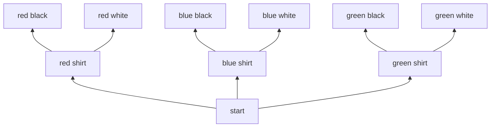
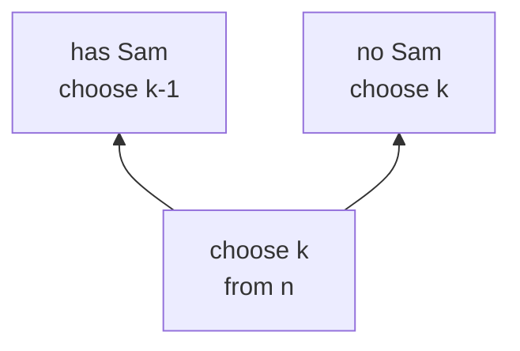
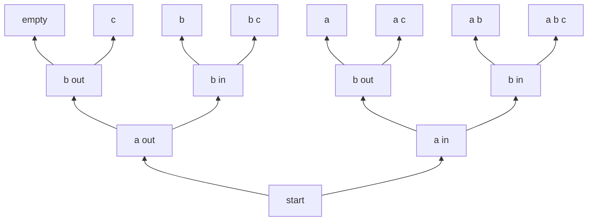
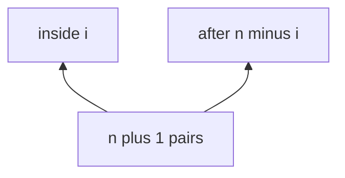

# 13 · Counting and Combinatorics

> After this chapter you can count choices, arrangements, subsets, grid paths and common
> interview output sizes without listing everything one by one.

⬅️ [12 · Bits and Binary](../12-bits-and-binary/) · 🏠 [Roadmap](../README.md) · [14 · Probability and Randomness](../14-probability-and-randomness/) ➡️

## Contents

1. [Why this matters for DSA](#1-why-this-matters-for-dsa)
2. [Sum and product rules](#2-sum-and-product-rules)
3. [Factorial](#3-factorial)
4. [Permutations](#4-permutations)
5. [Combinations](#5-combinations)
6. [Pascal triangle](#6-pascal-triangle)
7. [Subsets](#7-subsets)
8. [Grid paths](#8-grid-paths)
9. [Stars and bars](#9-stars-and-bars)
10. [Pigeonhole principle](#10-pigeonhole-principle)
11. [Inclusion exclusion](#11-inclusion-exclusion)
12. [Catalan numbers](#12-catalan-numbers)
13. [Counting output size](#13-counting-output-size)
14. [Java code](#14-java-code)
15. [Common mistakes](#15-common-mistakes)
16. [Interview patterns](#16-interview-patterns)
17. [Exercises](#17-exercises)
18. [One-minute recap](#18-one-minute-recap)

---

## 1. Why this matters for DSA

Counting is the maths of "how many choices are possible?"

In DSA, this appears everywhere:

- Backtracking asks, "How many answers can my recursion print?"
- Dynamic programming asks, "How many ways can I reach this state?"
- Probability asks, "How many favourable outcomes out of all outcomes?"
- Big-O asks, "How much work is unavoidable?"

If a problem says **choose**, **arrange**, **subsets**, **paths**, **parentheses**,
**permutations**, **teams**, **ways**, or **random**, your counting brain should wake up.


Think of counting like counting lunch boxes. If you can choose a sandwich, a drink
and a fruit, you do not open every possible box. You multiply the choices.

---

## 2. Sum and product rules

### Story first

You are getting dressed.

- Shirts: red, blue, green. That is 3 choices.
- Pants: black, white. That is 2 choices.

If you choose **one shirt and then one pant**, every shirt can pair with every pant:
3 × 2 = 6 outfits.

```text
              outfits
       red-black  red-white
      blue-black  blue-white
     green-black  green-white

3 shirts, and for each shirt there are 2 pants.
```

### Rule of product

Use multiplication when the story says **this and then that**.

If step 1 has a choices and step 2 has b choices, total choices = a × b.



The root is at the bottom. The choice tree grows upward. First choose a shirt, then
choose pants.

### Rule of sum

Use addition when the story says **either this or that**, and the groups do not overlap.

If you may drink tea or juice:

- 4 teas
- 3 juices

Total drink choices = 4 + 3 = 7.

```text
Either tea or juice:

tea choices:    T1 T2 T3 T4
juice choices:  J1 J2 J3

total:          T1 T2 T3 T4 J1 J2 J3
```

### How it looks in Java

```java
int outfits = shirts * pants;
int drinks = teaChoices + juiceChoices;
```

🧠 **How to think of it yourself:** ask, "Am I doing both jobs, or choosing one
of two doors?" Both jobs means multiply. One door means add.

---

## 3. Factorial

### Arranging books on a shelf

Suppose you have 4 different books: A, B, C, D.

To arrange them on a shelf:

```text
slot 1: 4 choices
slot 2: 3 choices left
slot 3: 2 choices left
slot 4: 1 choice left

total arrangements = 4 × 3 × 2 × 1 = 24
```

This is called **4 factorial**, written 4!.

n! = n × (n − 1) × (n − 2) × ... × 2 × 1.

### Why 0 factorial is 1

0! feels strange. "How many ways can I arrange no books?"

There is exactly **one** way: do nothing. The empty shelf arrangement is one valid
arrangement.

It also keeps formulas smooth:

P(n, n) = n! / (n − n)! = n! / 0!, so 0! must be 1.

### Factorial grows very fast

```text
n      n!
0      1
1      1
2      2
3      6
4      24
5      120
10     3,628,800
13     6,227,020,800
20     2,432,902,008,176,640,000
21     too big for long
```

Java limits matter:

- `int` max is 2,147,483,647, so 13! overflows `int`.
- `long` max is about 9.22 × 10¹⁸, so 21! overflows `long`.

The demo verifies this:

```text
13! stored in int overflows to 1932053504
21! stored in long overflows to -4249290049419214848
```

### Java snippet

```java
static long factorialLong(int n) {
    long answer = 1;
    for (int number = 2; number <= n; number++) {
        answer *= number;
    }
    return answer;
}
```

🧠 **How to think of it yourself:** when every next slot has one fewer choice,
you are probably seeing a factorial.

---

## 4. Permutations

Permutation means **order matters**.

### Podium places

Five runners race. You need gold, silver and bronze.

```text
gold:    5 choices
silver:  4 choices left
bronze:  3 choices left

total = 5 × 4 × 3 = 60
```

This is P(5, 3).

P(n, k) = n! / (n − k)!.

Why? n! arranges all n people. Dividing by (n − k)! erases the unused tail that we
do not care about.

### With repetition

A 4-digit PIN can reuse digits.

```text
digit 1: 10 choices
digit 2: 10 choices
digit 3: 10 choices
digit 4: 10 choices

total = 10 × 10 × 10 × 10 = 10^4 = 10000
```

With repetition: n choices for k slots gives n^k.

### Words with repeated letters

MISSISSIPPI has 11 letters:

- I appears 4 times.
- S appears 4 times.
- P appears 2 times.
- M appears 1 time.

If all letters were different, there would be 11! words. But the 4 I's can swap
among themselves and the word does not change. Same for S and P.

Distinct words = 11! / (4! × 4! × 2!) = 34,650.

```text
Pretend equal letters have name tags:

I1 I2 I3 I4

The 4! swaps of those I tags all spell the same word.
So divide by 4!.
```

### Java snippet

```java
static long permutations(int n, int k) {
    long answer = 1;
    for (int choice = 0; choice < k; choice++) {
        answer *= n - choice;
    }
    return answer;
}
```

🧠 **How to think of it yourself:** ask, "If I swap two chosen items, is it a new
answer?" If yes, order matters and you are in permutation land.

---

## 5. Combinations

Combination means **order does not matter**.

### Choosing a team

Choose 3 students from 10.

The team {A, B, C} is the same team as {C, A, B}. Order does not matter.

If we first count ordered picks:

P(10, 3) = 10 × 9 × 8.

But each team was counted 3! times:

```text
ABC  ACB  BAC  BCA  CAB  CBA

All six are the same team.
```

So:

C(10, 3) = P(10, 3) / 3! = 120.

Formula:

C(n, k) = n! / (k! × (n − k)!).

### Symmetry

C(n, k) = C(n, n − k).

Why? Choosing the 3 people who **join** the team is the same as choosing the
n − 3 people who **stay out**.

```text
10 students
choose 3 in  <== same decision ==> choose 7 out
```

Special cases:

- C(n, 0) = 1. Choose nobody.
- C(n, n) = 1. Choose everybody.

### Computing without factorial overflow

Do not compute n! first for big n. Factorials overflow too early.

Use this multiplicative formula:

```java
res = res * (n - i) / (i + 1)
```

for i = 0 to k − 1, after replacing k by min(k, n − k).

This avoids the huge factorials, but Java `long` still has a limit. If the final
answer is bigger than `long`, use `BigInteger`.

Why does the division stay exact? After step i, `res` equals C(n, i). The next
step builds C(n, i + 1):

C(n, i + 1) = C(n, i) × (n − i) / (i + 1).

Because C(n, i + 1) is an integer count of real groups, the numerator has exactly
enough factors to divide by i + 1.

```text
C(10, 3)

i = 0: res = 1 × 10 / 1 = 10
i = 1: res = 10 × 9 / 2 = 45
i = 2: res = 45 × 8 / 3 = 120
```

For C(n, k) mod p, division is not normal division. Use modular inverses from
[11 · Modular Arithmetic](../11-modular-arithmetic/).

### Java snippet

```java
static long choose(int n, int k) {
    if (n < 0 || k < 0 || k > n) {
        return 0;
    }
    int smallerSide = Math.min(k, n - k);
    long answer = 1;
    for (int i = 1; i <= smallerSide; i++) {
        long numerator = n - smallerSide + i;
        long denominator = i;
        long shared = gcd(numerator, denominator);
        numerator /= shared;
        denominator /= shared;
        shared = gcd(answer, denominator);
        answer /= shared;
        denominator /= shared;
        if (denominator != 1) {
            throw new ArithmeticException("combination step was not exact");
        }
        answer = Math.multiplyExact(answer, numerator);
    }
    return answer;
}
```

🧠 **How to think of it yourself:** first count the easy ordered version. Then ask,
"How many times did I count each real answer?" Divide by that.

---

## 6. Pascal triangle

Pascal's triangle is a wall of combination numbers.

The course draws it **upward**. Row 0 is at the bottom. Each number is the sum of
the two numbers just below it.

```text
           1    5    10   10    5    1     row 5
             1    4    6    4    1         row 4
               1    3    3    1            row 3
                 1    2    1               row 2
                   1    1                  row 1
                     1                     row 0

row 0 is the bottom row. Higher rows grow upward.
```

For example, the first 10 in row 5 comes from 4 + 6 below it.

### Why the recurrence works

C(n, k) = C(n − 1, k − 1) + C(n − 1, k).

Imagine one special student named Sam.

To choose k people from n people, every valid group is in exactly one of two boxes:

1. The group includes Sam. Then choose k − 1 more from the other n − 1 people.
2. The group does not include Sam. Then choose all k from the other n − 1 people.

Add those two boxes.



### Row sums

Row n sums to 2^n.

Why? Row n lists:

C(n, 0) + C(n, 1) + ... + C(n, n).

That counts all subsets of n items by size. All subsets together are 2^n.

### LeetCode 118 and 119

- LC 118 asks for many rows.
- LC 119 asks for one row.

For one row, use a 1D array and update from right to left, so old values are not
destroyed too early.

```java
for (int r = 1; r <= row; r++) {
    for (int c = r; c >= 1; c--) {
        values[c] += values[c - 1];
    }
}
```

---

## 7. Subsets

A subset is a group you form by saying yes or no to each item.

For {a, b, c}, each item has 2 choices: in or out.

Total subsets = 2 × 2 × 2 = 2^3 = 8.

The decision tree grows upward:



Plain-text version:

```text
      empty    c      b     bc      a     ac     ab    abc
        ▲      ▲      ▲      ▲      ▲      ▲      ▲      ▲
       c0     c1     c0     c1     c0     c1     c0     c1
        └──┬──┘      └──┬──┘      └──┬──┘      └──┬──┘
          b0            b1            b0            b1
            └─────┬─────┘               └─────┬─────┘
                 a0                          a1
                   └───────────┬────────────┘
                              start

a0 means a is out. a1 means a is in.
```

Subsets of size k are counted by C(n, k).

All subset sizes together:

Σ C(n, k) from k = 0 to n = 2^n.

LC 78 prints subsets. LC 77 prints combinations of size k.

---

## 8. Grid paths

Unique Paths, LC 62, asks:

From the top-left of an m × n grid, move only right or down. How many paths reach
the bottom-right?

For a 3 × 7 grid:

- Need 2 down moves.
- Need 6 right moves.
- Total moves = 8.

Every path is just a sequence of 8 letters with 2 D's and 6 R's.

So the answer is C(8, 2) = C(8, 6) = 28.

```text
Example path:

R R D R R R D R

Choose where the 2 D moves sit among 8 slots.
```

### DP table comparison

DP says each cell can be reached from above or from the left.

```text
3 x 4 grid of path counts

1   1   1   1
1   2   3   4
1   3   6   10
```

The bottom-right value 10 equals C(5, 2): five moves total, choose two down moves.

### Obstacles

Unique Paths II, LC 63, has blocked cells. The neat formula breaks because some
move sequences hit walls. Use DP and set blocked cells to 0.

```text
1   1   1
1   X   1
1   1   2
```

---

## 9. Stars and bars

Stars and bars counts ways to split identical things into boxes.

Example: 7 identical candies to 3 kids.

Write 7 stars and put 2 bars to split them into 3 groups:

```text
** | *** | **

kid 1 gets 2, kid 2 gets 3, kid 3 gets 2.
```

There are n stars and k − 1 bars, so n + k − 1 positions total. Choose where the
bars go:

ways = C(n + k − 1, k − 1).

For 7 candies and 3 kids:

C(9, 2) = 36.

### Count Sorted Vowel Strings

LC 1641 asks for sorted strings of length n using a, e, i, o, u.

A sorted vowel string is decided only by counts:

```text
aaeeu means:
a:2 e:2 i:0 o:0 u:1
```

So it is the same as putting n identical stars into 5 vowel boxes:

C(n + 5 − 1, 5 − 1) = C(n + 4, 4).

---

## 10. Pigeonhole principle

If more pigeons than holes are used, some hole gets at least two pigeons.

### Socks

You have 4 sock colors in a dark drawer. How many socks guarantee a matching pair?

Worst case:

```text
red  blue  green  black
 1     1      1      1
```

The 5th sock must match one of them. Answer: 5.

### Birthdays

There are 366 possible birthdays if we include February 29. With 367 people, at
least two people must share a birthday.

### Find the Duplicate Number

LC 287 has n + 1 numbers, and every value is in 1..n.

```text
numbers are pigeons: n + 1
values are holes:    n
```

At least one value appears twice.

### Prefix sums mod k

If two prefix sums have the same remainder modulo k, their difference is divisible
by k. That is pigeonhole thinking plus
[11 · Modular Arithmetic](../11-modular-arithmetic/).

---

## 11. Inclusion exclusion

When two groups overlap, adding both sizes double-counts the overlap.

|A union B| = |A| + |B| − |A intersection B|.

Venn picture:

```text
      A only     both     B only
    _________  _______  _________
   /         \/       \/         \
  |    A      |  A B  |     B     |
   \_________/\_______/\_________/

Add A and B, then subtract the middle once.
```

For three sets:

|A union B union C|
= singles − pair overlaps + triple overlap.

### Numbers at most 100 divisible by 2, 3 or 5

```text
divisible by 2:  floor(100 / 2)  = 50
divisible by 3:  floor(100 / 3)  = 33
divisible by 5:  floor(100 / 5)  = 20

subtract pairs:
divisible by 6:  16
divisible by 10: 10
divisible by 15:  6

add triple:
divisible by 30:  3

answer = 50 + 33 + 20 - 16 - 10 - 6 + 3 = 74
```

This connects to set language in
[16 · Logic, Sets and Proofs](../16-logic-sets-and-proofs/).

---

## 12. Catalan numbers

Catalan numbers count many "balanced" shapes:

1, 1, 2, 5, 14, 42, 132, ...

They show up in:

- Valid parentheses, LC 22.
- Unique binary search trees, LC 96.
- Mountain ranges that never go below ground.

Formula:

Catalan(n) = C(2n, n) / (n + 1).

### Valid parentheses

For n = 3 pairs, there are 5 valid strings:

```text
((()))
(()())
(())()
()(())
()()()
```

Many other strings are invalid because they close before they open.

```text
invalid:
())(()

At some point, closes are more than opens.
```

### Recurrence

Catalan(n + 1) = Σ Catalan(i) × Catalan(n − i), for i = 0..n.

Think of the first matching pair of parentheses:

```text
( inside ) after

inside has i pairs
after has n - i pairs
```

Choose any valid inside shape and any valid after shape, then multiply.



---

## 13. Counting output size

Counting is often the **minimum work**.

If a program must print all answers, it cannot be faster than the number of answers.

| Output | Count | Minimum work |
|---|---:|---:|
| all subsets | 2^n | Ω(2^n) |
| all permutations | n! | Ω(n!) |
| all combinations of size k | C(n, k) | Ω(C(n, k)) |
| valid parentheses | Catalan(n) | Ω(Catalan(n)) |

This links to recursion tree size in [07 · Recurrences](../07-recurrences/).

🧠 **How to think of it yourself:** before coding backtracking, count the leaves of
the choice tree. The leaves are the answers.

---

## 14. Java code

Code: [`Combinatorics.java`](Combinatorics.java)

Key methods:

- `factorialLong` multiplies 1 × 2 × ... × n.
- `permutations` counts ordered k picks.
- `choose` uses an overflow-aware multiplicative formula.
- `pascalRow` builds Pascal's triangle row in one array.
- `uniquePathsDp` and `uniquePathsWithObstacles` show grid DP.
- `catalanUpTo` uses the Catalan recurrence.

Run it:

```text
cd maths_for_dsa/13-counting-and-combinatorics
java Combinatorics.java
```

Real output:

```text
Counting and combinatorics demos
--------------------------------
Rule of product: 3 shirts x 2 pants = 6 outfits
Rule of sum: 4 teas or 3 juices = 7 drink choices

Factorials
0! = 1
5! = 120
10! = 3628800
13! exact = 6227020800
13! stored in int overflows to 1932053504
20! stored in long = 2432902008176640000
21! stored in long overflows to -4249290049419214848

Permutations
P(5, 3) podiums = 60
4-digit PINs with repetition = 10000
MISSISSIPPI distinct words = 34650

Combinations
C(10, 3) teams = 120
C(10, 7) equals C(10, 3) = 120
C(30, 15) safely in long = 155117520
Pascal row 5 = [1, 5, 10, 10, 5, 1]

Subsets and grids
Subsets of 5 items = 32
Subsets of size 2 from 5 items = 10
Unique paths 3x7 by formula = 28
Unique paths 3x7 by DP = 28
Unique paths with one obstacle = 2

Stars, pigeonholes, inclusion-exclusion, Catalan
7 identical candies to 3 kids = 36
Sorted vowel strings of length 2 = 15
Smallest socks needed for a guaranteed pair among 4 colors = 5
Numbers <= 100 divisible by 2, 3, or 5 = 74
Catalan numbers C0..C6 = [1, 1, 2, 5, 14, 42, 132]
Pickup and delivery orders for n = 3 = 90
```

---

## 15. Common mistakes

| Mistake | Why it hurts | Fix |
|---|---|---|
| Adding chained steps | Outfits become 3 + 2 | Use product |
| Multiplying either-or | Tea or juice is not tea and juice | Use sum |
| Forgetting 0! = 1 | Formulas break at k = n | Remember empty arrangement |
| Using factorials directly | Overflow happens early | Use multiplicative C(n, k) |
| Treating combinations as permutations | Teams get counted many times | Divide by k! |
| Drawing Pascal top to bottom | Breaks course style | Draw row 0 at the bottom |
| Using formulas with obstacles | Obstacles ruin simple sequences | Use DP |
| Dividing under mod normally | Modular division is different | Use chapter 11 inverses |

---

## 16. Interview patterns

| Pattern | How to recognise it | LeetCode problems |
|---|---|---|
| Grid path as moves | Only right and down, no obstacles | 62 Unique Paths |
| Grid path with blocked cells | Some cells are forbidden | 63 Unique Paths II |
| Pascal triangle | Need rows of C(n, k) | 118 Pascal's Triangle, 119 Pascal's Triangle II |
| Combinations by backtracking | Choose k numbers from n | 77 Combinations |
| Subsets by in or out | Print all groups | 78 Subsets |
| Permutations | Print all orders | 46 Permutations, 47 Permutations II |
| Catalan shapes | Balanced parentheses or BST shapes | 22 Generate Parentheses, 96 Unique Binary Search Trees |
| Pigeonhole duplicate | n + 1 values inside 1..n | 287 Find the Duplicate Number |
| Stars and bars | Sorted vowels or identical objects | 1641 Count Sorted Vowel Strings |
| Ordered pickup constraints | Pickup before delivery | 1359 Count All Valid Pickup and Delivery Options |

For LC 1359, when adding order i, there are 2i slots around old events. Pickup must
come before delivery, so valid positions are i × (2i − 1). Multiply these for all i.

---

## 17. Exercises

### Level 1 · Warm-up

**1.** You have 4 shirts and 3 pants. How many outfits?

<details>
<summary>Answer</summary>

**12** — choose one shirt and one pant, so multiply 4 × 3.

</details>

**2.** You can pick one snack from 5 fruits or 4 biscuits. How many choices?

<details>
<summary>Answer</summary>

**9** — this is either-or, so add 5 + 4.

</details>

**3.** What is 6!?

<details>
<summary>Answer</summary>

**720** — 6 × 5 × 4 × 3 × 2 × 1 = 720.

</details>

**4.** Why is 0! equal to 1?

<details>
<summary>Answer</summary>

**There is one empty arrangement** — arranging nothing can be done in exactly one
way: do nothing.

</details>

**5.** How many podiums P(6, 3) can 6 runners make?

<details>
<summary>Answer</summary>

**120** — 6 choices for gold, 5 for silver, 4 for bronze, so 6 × 5 × 4 = 120.

</details>

**6.** How many 3-digit PINs are possible if digits may repeat?

<details>
<summary>Answer</summary>

**1000** — 10 choices for each of 3 slots, so 10³ = 1000.

</details>

**7.** What is C(5, 2)?

<details>
<summary>Answer</summary>

**10** — 5 × 4 / 2 = 10 pairs.

</details>

**8.** What are the numbers in Pascal row 4?

<details>
<summary>Answer</summary>

**1, 4, 6, 4, 1** — these are C(4, 0) through C(4, 4).

</details>

### Level 2 · Practice

**9.** How many subsets does a set of 6 items have?

<details>
<summary>Answer</summary>

**64** — each item is in or out, so 2⁶ = 64.

</details>

**10.** How many subsets of size 3 can be chosen from 8 items?

<details>
<summary>Answer</summary>

**56** — C(8, 3) = 8 × 7 × 6 / (3 × 2 × 1) = 56.

</details>

**11.** How many unique paths are in a 3 × 4 grid with only right and down moves?

<details>
<summary>Answer</summary>

**10** — need 2 down and 3 right moves, so C(5, 2) = 10.

</details>

**12.** How many ways can 5 identical candies be given to 3 kids?

<details>
<summary>Answer</summary>

**21** — stars and bars gives C(5 + 3 − 1, 3 − 1) = C(7, 2) = 21.

</details>

**13.** How many sorted vowel strings have length 3?

<details>
<summary>Answer</summary>

**35** — C(3 + 4, 4) = C(7, 4) = 35.

</details>

**14.** How many socks guarantee a pair if there are 7 colors?

<details>
<summary>Answer</summary>

**8** — one sock of each color can avoid a pair, but the 8th must match.

</details>

**15.** How many numbers from 1 to 60 are divisible by 2 or 3?

<details>
<summary>Answer</summary>

**40** — floor(60 / 2) + floor(60 / 3) − floor(60 / 6)
= 30 + 20 − 10 = 40.

</details>

**16.** What is the Catalan number for n = 4?

<details>
<summary>Answer</summary>

**14** — the sequence starts 1, 1, 2, 5, 14, so Catalan(4) = 14.

</details>

### Level 3 · Interview

**17.** LC 62 has m = 4 and n = 5. How many unique paths?

<details>
<summary>Answer</summary>

**35** — need 3 down and 4 right moves, so C(7, 3) = 35.

</details>

**18.** How many distinct words can be made from BANANA?

<details>
<summary>Answer</summary>

**60** — BANANA has 6 letters, with A repeated 3 times and N repeated 2 times.
The count is 6! / (3! × 2!) = 60.

</details>

**19.** How many permutations of 4 different numbers are there?

<details>
<summary>Answer</summary>

**24** — all 4 are arranged, so 4! = 24.

</details>

**20.** How many leaves are in the subset decision tree for 10 items?

<details>
<summary>Answer</summary>

**1024** — each item has two decisions, so 2¹⁰ = 1024.

</details>

**21.** How many leaves are in the permutation backtracking tree for 5 different items?

<details>
<summary>Answer</summary>

**120** — each leaf is a full order, so 5! = 120.

</details>

**22.** Count numbers at most 100 divisible by 3 or 5.

<details>
<summary>Answer</summary>

**47** — floor(100 / 3) + floor(100 / 5) − floor(100 / 15)
= 33 + 20 − 6 = 47.

</details>

**23.** LC 96 asks for unique BSTs with n = 3. How many shapes?

<details>
<summary>Answer</summary>

**5** — this is Catalan(3), and the sequence is 1, 1, 2, 5.

</details>

**24.** LC 1359 asks for valid pickup and delivery orders. What is the answer for n = 3?

<details>
<summary>Answer</summary>

**90** — multiply i × (2i − 1): for i = 1, 2, 3 we get
1 × 1, 2 × 3, 3 × 5. Product = 90.

</details>

---

## 18. One-minute recap

- Add for **either-or** choices. Multiply for **this and then that** choices.
- n! arranges n different things, and 0! = 1 because the empty arrangement counts.
- Permutations care about order. Combinations do not.
- C(n, k) = C(n, n − k), and compute it with multiplication before division.
- Pascal's triangle grows upward here, and each number comes from the two below it.
- Subsets count to 2^n. Subsets of size k count to C(n, k).
- Grid paths without obstacles are move sequences. Obstacles need DP.
- Stars and bars splits identical things into boxes.
- Pigeonhole proves duplicates must exist.
- Inclusion-exclusion subtracts overlaps.
- Catalan numbers count balanced shapes like parentheses and BSTs.
