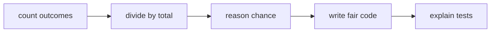
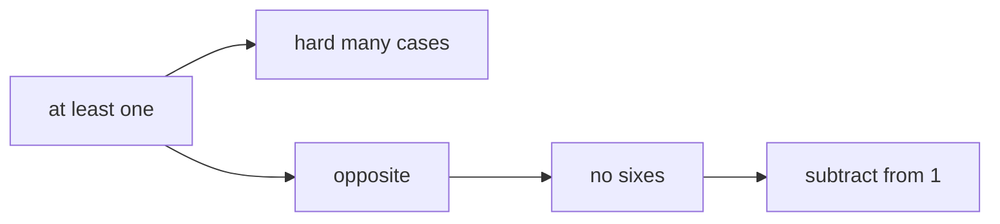
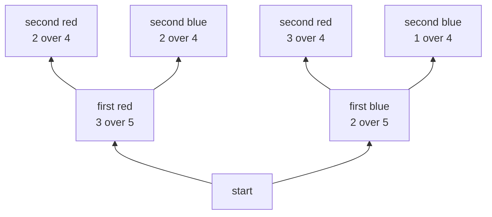
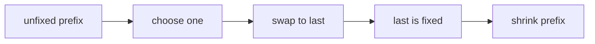
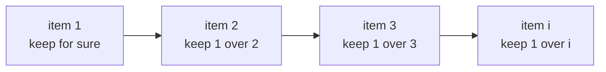
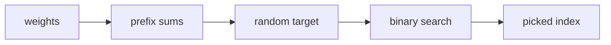

# 14 · Probability and Randomness

> After this chapter you can reason about chance, expected value and randomised
> interview problems in Java without guessing.

⬅️ [13 · Counting and Combinatorics](../13-counting-and-combinatorics/) · 🏠 [Roadmap](../README.md) · [15 · Geometry and Grids](../15-geometry-and-grids/) ➡️

## Contents

1. [Why this matters for DSA](#1-why-this-matters-for-dsa)
2. [Probability as a fraction](#2-probability-as-a-fraction)
3. [Not and at least one](#3-not-and-at-least-one)
4. [And or and conditional probability](#4-and-or-and-conditional-probability)
5. [Expected value](#5-expected-value)
6. [Randomness in Java](#6-randomness-in-java)
7. [Fisher Yates shuffle](#7-fisher-yates-shuffle)
8. [Reservoir sampling](#8-reservoir-sampling)
9. [Weighted random](#9-weighted-random)
10. [Rejection sampling](#10-rejection-sampling)
11. [Birthday paradox and collisions](#11-birthday-paradox-and-collisions)
12. [Random data structures and simulations](#12-random-data-structures-and-simulations)
13. [Java code](#13-java-code)
14. [Common mistakes](#14-common-mistakes)
15. [Interview patterns](#15-interview-patterns)
16. [Exercises](#16-exercises)
17. [One-minute recap](#17-one-minute-recap)

---

## 1. Why this matters for DSA

Probability is counting plus uncertainty.

It appears when:

- a problem asks for a random item with equal chance;
- a shuffle must make every order equally likely;
- a stream is too large to store;
- a hash table might have collisions;
- a DP state stores "chance of reaching here";
- an expected runtime or expected number of tries is needed.



Chapter [13 · Counting and Combinatorics](../13-counting-and-combinatorics/)
counted worlds. This chapter asks, "If one world is picked, how likely is it?"

---

## 2. Probability as a fraction

Probability means:

favourable outcomes / total outcomes.

It is always between 0 and 1.

- 0 means impossible.
- 1 means certain.
- 1/2 means half the time in the long run.

### Coins

A fair coin has two equally likely outcomes:

```text
H  T
```

P(head) = 1 / 2.

### Dice

A fair die has six equally likely outcomes:

```text
1  2  3  4  5  6
```

P(roll a 4) = 1 / 6.

### Marbles

A bag has 3 red marbles and 2 blue marbles.

P(red) = 3 / 5.

### Two dice grid

Two dice make 6 × 6 = 36 outcomes.

```text
       second die
        1  2  3  4  5  6
first  ------------------
  1  |  2  3  4  5  6  7
  2  |  3  4  5  6  7  8
  3  |  4  5  6  7  8  9
  4  |  5  6  7  8  9 10
  5  |  6  7  8  9 10 11
  6  |  7  8  9 10 11 12
```

Sum 7 has 6 ways:

```text
(1,6) (2,5) (3,4) (4,3) (5,2) (6,1)
```

So P(sum 7) = 6 / 36 = 1 / 6.

🧠 **How to think of it yourself:** first make the outcomes equally likely. Then
count the good ones.

---

## 3. Not and at least one

The complement rule:

P(not A) = 1 − P(A).

This is useful when "at least one" is annoying.

### At least one six in 4 rolls

Direct counting has many cases:

- exactly one six,
- exactly two sixes,
- exactly three sixes,
- exactly four sixes.

Instead count the opposite:

"At least one six" means "not zero sixes."

```text
P(no six in one roll) = 5 / 6
P(no six in four rolls) = (5 / 6)^4

P(at least one six) = 1 - (5 / 6)^4
                    ≈ 0.517747
```



The chance is a little more than 50%.

---

## 4. And or and conditional probability

### Independent and

Independent means one event does not change the other.

For two coin flips:

P(H and H) = P(H) × P(H) = 1/2 × 1/2 = 1/4.

Use multiplication for independent **and**.

### Disjoint or

Disjoint means the events cannot happen together.

On one die roll:

P(roll 1 or roll 6) = 1/6 + 1/6 = 2/6 = 1/3.

Use addition for disjoint **or**.

### General or

If events can overlap:

P(A or B) = P(A) + P(B) − P(A and B).

That is the probability version of inclusion-exclusion from
[13 · Counting and Combinatorics](../13-counting-and-combinatorics/).

### Conditional probability

Conditional probability means "after I know something, what is the chance now?"

Example: draw 2 red marbles without replacement from 3 red and 2 blue.

```text
P(first red) = 3 / 5
P(second red after first red) = 2 / 4

P(two red) = 3 / 5 × 2 / 4 = 3 / 10 = 0.3
```

Probability tree, growing upward:



The branch probabilities change because the marble is not put back.

---

## 5. Expected value

Expected value is the long-run average.

If you repeat an experiment many times, expected value is the average result you
settle near.

### Fair die

E[die] = 1 × 1/6 + 2 × 1/6 + ... + 6 × 1/6 = 3.5.

You can never roll 3.5, but over many rolls the average gets close to 3.5.

```text
values:       1   2   3   4   5   6
probability: 1/6 1/6 1/6 1/6 1/6 1/6
average:     3.5
```

### Linearity of expectation

E[X + Y] = E[X] + E[Y].

The beautiful part: this works even if X and Y are not independent.

### Hat check fixed points

Five people put hats in a box. Hats are returned randomly.

Let Xi = 1 if person i gets their own hat, else 0.

P(Xi = 1) = 1 / 5, so E[Xi] = 1 / 5.

Total fixed points = X1 + X2 + X3 + X4 + X5.

Expected total = 5 × 1/5 = 1.

This is true for any number of people: the expected number of fixed points is 1.

### First head

Expected flips until first head = 2.

One way to feel it:

```text
Half the time:  H       takes 1 flip
Quarter time:  TH      takes 2 flips
Eighth time:   TTH     takes 3 flips
...

The weighted average equals 2.
```

### Coupon collector

If there are n coupon types and each box gives a random type, expected boxes to
collect all types is about:

n × H(n), where H(n) = 1 + 1/2 + ... + 1/n.

This uses the harmonic series from [05 · Sums and Series](../05-sums-and-series/).

For n = 5:

5 × (1 + 1/2 + 1/3 + 1/4 + 1/5) ≈ 11.416667.

---

## 6. Randomness in Java

### Random with a seed

`new Random(42)` gives a repeatable random-looking sequence.

That is useful for lessons and tests:

```java
Random random = new Random(42);
System.out.println(random.nextInt(10));
```

Run it again and you get the same first number.

### nextInt bound

`random.nextInt(n)` is uniform on 0..n − 1.

To get a number in [lo, hi]:

```java
int value = lo + random.nextInt(hi - lo + 1);
```

### Math random

`Math.random()` gives a double in [0, 1). It is fine for small demos, but in
interviews `Random` is clearer because you can pass it around and seed it.

### Why modulo is wrong

Do not write:

```java
int value = random.nextInt() % n;
```

Two problems:

1. `nextInt()` can be negative, so the result can be negative.
2. The huge int range may not split evenly into n buckets, so some remainders can
   be slightly more common.

Use `nextInt(n)` instead.

---

## 7. Fisher Yates shuffle

LC 384 asks for a fair shuffle.

Fisher-Yates does this:

```text
for last from n - 1 down to 1:
    choose random index in 0..last
    swap values[last] with values[chosen]
```



Why every permutation has probability 1/n!:

- At the first step, each item has chance 1/n to be placed last.
- At the next step, each remaining item has chance 1/(n − 1) to be placed next.
- Continue until one item remains.

Probability of one exact final order:

1/n × 1/(n − 1) × ... × 1/1 = 1/n!.

### Why the naive shuffle is biased

Naive idea:

```text
for i from 0 to n - 1:
    swap i with any random index 0..n-1
```

For n = 3, this has 3³ = 27 random choice sequences. But there are 3! = 6
permutations. 27 cannot split evenly into 6 equal piles.

The Java demo counts the real frequencies:

```text
[3, 1, 2] -> 4
[2, 3, 1] -> 5
[2, 1, 3] -> 5
[3, 2, 1] -> 4
[1, 3, 2] -> 5
[1, 2, 3] -> 4
```

Some orders happen 5 ways, others 4 ways. Not fair.

---

## 8. Reservoir sampling

Reservoir sampling solves this problem:

"Pick one item uniformly from a stream, but you do not know the stream length and
you cannot store everything."

For the i-th item, keep it with probability 1/i.



Picture:

```text
stream:       10      20      30      40      50
chance:       1/1     1/2     1/3     1/4     1/5
reservoir:    one chosen value
```

### Why every item wins with probability 1 over n

For item j to survive to the end:

1. It must be chosen at step j: probability 1/j.
2. It must not be replaced at step j + 1: probability j/(j + 1).
3. It must not be replaced at step j + 2: probability (j + 1)/(j + 2).
4. Continue to n.

The product telescopes:

```text
1/j × j/(j+1) × (j+1)/(j+2) × ... × (n-1)/n = 1/n
```

So every item has the same final chance.

LC 382 Linked List Random Node and LC 398 Random Pick Index use this idea.

---

## 9. Weighted random

LC 528 asks for random index with weights.

Weights [2, 5, 3] mean:

- index 0 owns 2 tickets,
- index 1 owns 5 tickets,
- index 2 owns 3 tickets.

Total tickets = 10.

Build prefix sums:

```text
index:        0       1          2
weight:       2       5          3
prefix:       2       7          10

number line:
1 2 | 3 4 5 6 7 | 8 9 10
 0  |     1     |   2
```

Pick a random target from 1..10. Binary search the first prefix that is at least
the target.



---

## 10. Rejection sampling

LC 470 asks: implement Rand10() using Rand7().

Rand7 gives a fair number from 1 to 7. Two calls make a fair grid of 49 outcomes:

```text
number = (row - 1) × 7 + column

1  2  3  4  5  6  7
8  9 10 11 12 13 14
15 ...
...
43 44 45 46 47 48 49
```

Use only 1..40 because 40 splits evenly into 10 buckets. Reject 41..49 and try
again.

```text
1..40  accepted
41..49 rejected
```

Return:

1 + (number − 1) % 10.

Expected number of two-call attempts = 49 / 40 = 1.225.

Expected number of Rand7 calls = 2 × 49 / 40 = 2.45.

---

## 11. Birthday paradox and collisions

The birthday paradox says 23 people already have more than 50% chance that two
share a birthday.

Count the opposite: all birthdays are different.

```text
person 1: 365 / 365
person 2: 364 / 365
person 3: 363 / 365
...
person 23: 343 / 365
```

P(shared birthday) = 1 − product above ≈ 0.507297.

This matters for hashing. Hash values are like birthdays. If many keys go into a
limited number of buckets, collisions appear sooner than our gut expects.

Hashing also uses modular arithmetic, so review
[11 · Modular Arithmetic](../11-modular-arithmetic/).

---

## 12. Random data structures and simulations

### Insert Delete GetRandom in O(1)

LC 380 needs:

- insert in O(1),
- delete in O(1),
- get random item in O(1).

Use:

- an array or list to store values,
- a map from value to its index.

Delete by swapping with the last item:

```text
values: [10, 20, 30, 40]
remove 20

swap 20 with last 40:
values: [10, 40, 30, 20]

pop last:
values: [10, 40, 30]
```

Then `getRandom` picks a random list index.

### Monte Carlo estimate of pi

Monte Carlo means use random trials to estimate a number.

Drop random points in a 1 × 1 square. Count points inside the quarter circle.

```text
square area = 1
quarter circle area = pi / 4

inside / total ≈ pi / 4
pi ≈ 4 × inside / total
```

With a fixed seed, the demo gives the same estimate every run.

---

## 13. Java code

Code: [`Randomness.java`](Randomness.java)

Key methods:

- `waysToRollSum` counts dice outcomes.
- `atLeastOneSixInFourRolls` uses the complement trick.
- `fisherYatesShuffle` gives a fair shuffle.
- `reservoirPick` samples from a stream.
- `WeightedPicker` uses prefix sums and binary search.
- `rand10` uses rejection sampling.
- `RandomizedSet` uses a list plus map.
- `estimatePi` runs a fixed-seed Monte Carlo simulation.

Run it:

```text
cd maths_for_dsa/14-probability-and-randomness
java Randomness.java
```

Real output:

```text
Probability and randomness demos
--------------------------------
Two dice outcomes = 36
Ways to roll sum 7 = 6
P(sum 7) = 0.166667
P(at least one six in 4 rolls) = 0.517747
P(two red without replacement from 3 red, 2 blue) = 0.300000

Expected value
E[die] = 3.5
Expected fixed points in 5-person hat check = 1.0
Expected flips until first head = 2.0
Coupon collector for 5 coupons approx 11.416667

Java Random with seed 42
nextInt(10) samples = [0, 3, 8, 4, 0]
range [5, 9] samples = [5, 8, 8, 9, 5]

Shuffle and bias
Fisher-Yates shuffle of [1, 2, 3, 4] = [4, 2, 1, 3]
Naive shuffle frequencies for n = 3:
[3, 1, 2] -> 4
[2, 3, 1] -> 5
[2, 1, 3] -> 5
[3, 2, 1] -> 4
[1, 3, 2] -> 5
[1, 2, 3] -> 4

Sampling
Reservoir pick from [10, 20, 30, 40, 50] = 50
Weighted picks for weights [2, 5, 3] = [0, 1, 2, 1, 0, 1, 1, 2]
Rand10 samples from Rand7 = [3, 10, 1, 6, 1, 1, 6, 3]

Birthday, random set, Monte Carlo
P(shared birthday among 23 people) = 0.507297
RandomizedSet getRandom after [10, 30] = 30
Monte Carlo pi estimate with 100000 points = 3.141280
```

---

## 14. Common mistakes

| Mistake | Why it hurts | Fix |
|---|---|---|
| Treating probability as a count | Chance must be divided by total | favourable / total |
| Forgetting 0..1 | Answers like 6 are impossible | Check the range |
| Adding non-disjoint events | Overlap gets counted twice | Use inclusion-exclusion |
| Multiplying dependent events | Second chance may change | Update the chance |
| Using `nextInt() % n` | Negative and biased results | Use `nextInt(n)` |
| Naive shuffle | Some permutations are more likely | Use Fisher-Yates |
| No rejection | Rand10 from Rand7 becomes biased | Accept equal buckets |
| No seed in demos | Output changes every run | Use fixed seeds |

---

## 15. Interview patterns

| Pattern | How to recognise it | LeetCode problems |
|---|---|---|
| Fair shuffle | Need every permutation equally likely | 384 Shuffle an Array |
| Reservoir sampling | Stream or linked list random pick | 382 Linked List Random Node, 398 Random Pick Index |
| Weighted random | Probability proportional to weight | 528 Random Pick with Weight |
| Rejection sampling | Build one generator from another | 470 Implement Rand10() Using Rand7() |
| O(1) random set | Insert, delete and random O(1) | 380 Insert Delete GetRandom O(1) |
| Area weighted random | Pick point from rectangles | 497 Random Point in Non-overlapping Rectangles |
| Lazy random flips | Random cells without repeats | 519 Random Flip Matrix |
| Blacklist remapping | Pick except forbidden values | 710 Random Pick with Blacklist |
| Probability DP | Chance of staying or scoring | 688 Knight Probability, 837 New 21 Game |

---

## 16. Exercises

### Level 1 · Warm-up

**1.** A coin is fair. What is P(head)?

<details>
<summary>Answer</summary>

**1/2 = 0.5** — one favourable side out of two equally likely sides.

</details>

**2.** A fair die is rolled. What is P(roll an even number)?

<details>
<summary>Answer</summary>

**1/2** — even faces are 2, 4, 6, so 3 / 6 = 1 / 2.

</details>

**3.** A bag has 4 red and 6 blue marbles. What is P(red)?

<details>
<summary>Answer</summary>

**0.4** — 4 red out of 10 total, so 4 / 10 = 0.4.

</details>

**4.** What is P(not rolling a 6) on one fair die roll?

<details>
<summary>Answer</summary>

**5/6** — either count five non-six faces or use 1 − 1/6.

</details>

**5.** What is P(two heads in two fair coin flips)?

<details>
<summary>Answer</summary>

**1/4** — independent events multiply: 1/2 × 1/2 = 1/4.

</details>

**6.** What is P(roll 1 or 2 on one fair die)?

<details>
<summary>Answer</summary>

**1/3** — the events are disjoint, so 1/6 + 1/6 = 2/6 = 1/3.

</details>

**7.** What is the expected value of a fair die?

<details>
<summary>Answer</summary>

**3.5** — (1 + 2 + 3 + 4 + 5 + 6) / 6 = 21 / 6 = 3.5.

</details>

**8.** What values can `new Random(42).nextInt(5)` return?

<details>
<summary>Answer</summary>

**0, 1, 2, 3 or 4** — the bound is exclusive, so 5 is not possible.

</details>

### Level 2 · Practice

**9.** What is P(sum 7) when rolling two fair dice?

<details>
<summary>Answer</summary>

**1/6** — there are 6 good pairs out of 36 total pairs.

</details>

**10.** What is P(at least one head in 3 fair coin flips)?

<details>
<summary>Answer</summary>

**7/8 = 0.875** — opposite is no heads, which is TTT with chance (1/2)³ = 1/8.
So the answer is 1 − 1/8 = 7/8.

</details>

**11.** Draw 2 red marbles without replacement from 3 red and 2 blue. What is the chance?

<details>
<summary>Answer</summary>

**0.3** — 3/5 × 2/4 = 6/20 = 3/10.

</details>

**12.** What is P(roll a multiple of 2 or 3) on one fair die?

<details>
<summary>Answer</summary>

**2/3** — multiples of 2 are 2, 4, 6. Multiples of 3 are 3, 6.
Union is 2, 3, 4, 6, so 4 / 6 = 2 / 3.

</details>

**13.** For weights [2, 5, 3], what is P(pick index 1)?

<details>
<summary>Answer</summary>

**1/2** — index 1 owns 5 tickets out of 10 total, so 5 / 10 = 1 / 2.

</details>

**14.** Rand10 from Rand7 accepts numbers 1..40 out of 1..49. What is the reject chance?

<details>
<summary>Answer</summary>

**9/49 ≈ 0.183673** — numbers 41..49 are rejected.

</details>

**15.** What is the expected number of Rand7 calls for the simple Rand10 method?

<details>
<summary>Answer</summary>

**2.45** — each attempt uses 2 calls and succeeds with probability 40/49.
Expected calls = 2 / (40/49) = 2 × 49 / 40 = 2.45.

</details>

**16.** What is the birthday collision probability for 2 people?

<details>
<summary>Answer</summary>

**1/365 ≈ 0.002740** — the second person must match the first person's birthday.

</details>

### Level 3 · Interview

**17.** Why is Fisher-Yates fair for n = 4?

<details>
<summary>Answer</summary>

**Each final order has probability 1/24** — the probabilities are
1/4 × 1/3 × 1/2 × 1/1 = 1/24, and 4! = 24.

</details>

**18.** Why is the naive shuffle biased for n = 3?

<details>
<summary>Answer</summary>

**Because 27 choice sequences cannot split evenly into 6 permutations** — 3³ = 27
and 3! = 6, and 27 / 6 is not an integer.

</details>

**19.** In reservoir sampling with 5 items, what is the final chance of item 2?

<details>
<summary>Answer</summary>

**1/5** — it is chosen at step 2 with chance 1/2, then survives steps 3, 4 and 5:
1/2 × 2/3 × 3/4 × 4/5 = 1/5.

</details>

**20.** A weighted picker has weights [1, 1, 8]. What is P(index 2)?

<details>
<summary>Answer</summary>

**0.8** — index 2 owns 8 out of 10 total weight.

</details>

**21.** LC 380 stores [10, 20, 30, 40]. After removing 20 by swapping with last,
what list remains?

<details>
<summary>Answer</summary>

**[10, 40, 30]** — put 40 into 20's old slot, then remove the last slot.

</details>

**22.** What is P(shared birthday among 23 people) using the no-leap-year model?

<details>
<summary>Answer</summary>

**About 0.507297** — compute 1 minus the probability that all 23 birthdays are
different.

</details>

**23.** In the Monte Carlo pi demo, if 78,532 out of 100,000 points are inside
the quarter circle, what pi estimate is printed?

<details>
<summary>Answer</summary>

**3.14128** — pi ≈ 4 × 78,532 / 100,000 = 3.14128.

</details>

**24.** A knight probability DP returns 0.25 for a state. What does that mean?

<details>
<summary>Answer</summary>

**There is a 25% chance the knight stays on the board from that state** — DP stores
probability, not a count of paths.

</details>

---

## 17. One-minute recap

- Probability = favourable outcomes / total outcomes, and it stays between 0 and 1.
- Use complements for "at least one": 1 − P(none).
- Independent **and** multiplies. Disjoint **or** adds.
- General **or** subtracts overlap, just like inclusion-exclusion.
- Expected value is the long-run average, and linearity is very powerful.
- In Java, use `Random` with a seed for repeatable demos and `nextInt(n)` for 0..n − 1.
- Fisher-Yates is fair. The naive "swap with any index" shuffle is biased.
- Reservoir sampling keeps the i-th item with chance 1/i.
- Weighted random uses prefix sums and binary search.
- Rejection sampling throws away extra outcomes to keep buckets equal.
- Birthday collisions explain why hashing must handle collisions carefully.
