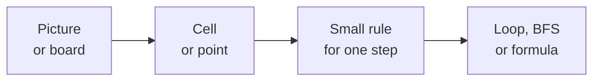
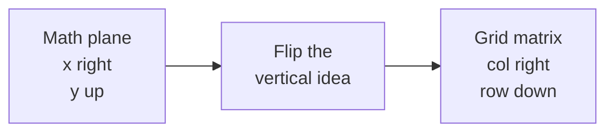
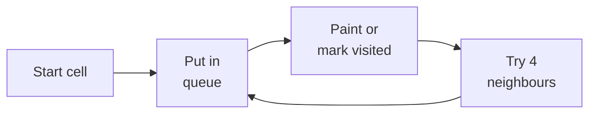
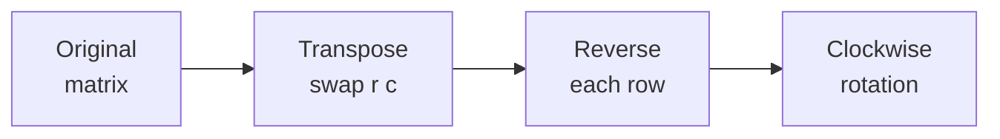
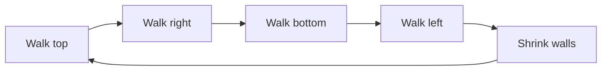
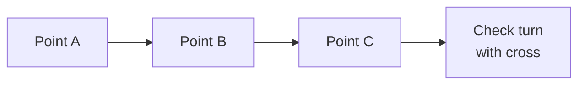

# 15 · Geometry and Grids

> After this chapter you can turn pictures, maps, boards and matrices into simple Java
> rules that an interview algorithm can use.

⬅️ [14 · Probability and Randomness](../14-probability-and-randomness/) · 🏠 [Roadmap](../README.md) · [16 · Logic, Sets and Proofs](../16-logic-sets-and-proofs/) ➡️

## Contents

1. [Why this matters for DSA](#1-why-this-matters-for-dsa)
2. [Coordinates and grid cells](#2-coordinates-and-grid-cells)
3. [Neighbours and flood fill](#3-neighbours-and-flood-fill)
4. [Flat indexes and special cell groups](#4-flat-indexes-and-special-cell-groups)
5. [Matrix transforms](#5-matrix-transforms)
6. [Distances](#6-distances)
7. [Lines slopes and area](#7-lines-slopes-and-area)
8. [Rectangles and circles](#8-rectangles-and-circles)
9. [Java code](#9-java-code)
10. [Common mistakes](#10-common-mistakes)
11. [Interview patterns](#11-interview-patterns)
12. [Exercises](#12-exercises)
13. [One-minute recap](#13-one-minute-recap)

---

## 1. Why this matters for DSA

A lot of interview problems are secretly about moving on a board:

- an island map made of `0` and `1`;
- a photo where one colour spreads to nearby pixels;
- a chessboard for queens, kings or knights;
- a matrix that must be rotated, searched or walked in a spiral;
- points on a plane, where you need distance, slope, area or overlap.

The trick is to stop seeing a scary picture and start seeing tiny rules:



Geometry in DSA is usually not school geometry with long proofs. It is more like:
"Which cell is next?", "Is this point inside?", "Do these two rectangles overlap?",
or "Can I compare distances without using slow and risky decimal numbers?"

🧠 **How to think of it yourself:** ask, "What is one object?" If the object is a
cell, you probably need row, column and neighbour arrays. If it is a point, you
probably need x, y, distance, slope or cross product.

---

## 2. Coordinates and grid cells

### Plane points grow like a graph

In normal maths, a point is `(x, y)`.

- `x` grows to the right.
- `y` grows upward.

```text
          y
          ▲
      3   |
      2   |        (3,2)
      1   |
      0   +---+---+---+---▶ x
          0   1   2   3
```

### Matrix cells grow like a screen

In Java matrices, a cell is usually `(row, col)`.

- `row` grows downward.
- `col` grows rightward.

That is the flip that surprises beginners: plane `y` goes up, but matrix `row`
goes down.

```text
           col 0   col 1   col 2   col 3
row 0      a[0][0] a[0][1] a[0][2] a[0][3]
row 1      a[1][0] a[1][1] a[1][2] a[1][3]
row 2      a[2][0] a[2][1] a[2][2] a[2][3]
  ▼
 rows grow downward
```

Here is the same idea as a picture:



An `m × n` matrix has `m` rows and `n` columns.

```text
Example: 3 x 4 matrix

        c0  c1  c2  c3
 r0     5   8   1   4
 r1     9   6   0   2
 r2     7   3   5   1

rows = 3, cols = 4
last valid row = 2
last valid col = 3
```

The in-bounds rule is:

```java
0 <= r && r < rows && 0 <= c && c < cols
```

Why it is true: row numbers start at `0`, so the last row is `rows - 1`.
The same is true for columns.

Worked example:

```text
rows = 3, cols = 4
(2,3) is inside because 0 <= 2 < 3 and 0 <= 3 < 4.
(3,1) is outside because row 3 is already past the last row 2.
```

Java helper:

```java
static boolean inBounds(int r, int c, int rows, int cols) {
    return 0 <= r && r < rows && 0 <= c && c < cols;
}
```

---

## 3. Neighbours and flood fill

Imagine standing on one tile in a game. You can walk north, east, south or west.
That is 4-direction movement.

```text
       (r-1,c)
          ^
          |
(r,c-1) < X > (r,c+1)
          |
          v
       (r+1,c)
```

Instead of writing four separate `if` blocks, store the changes in arrays:

```java
int[] dr = {-1, 0, 1, 0};
int[] dc = {0, 1, 0, -1};
```

Why it works: each direction is just "add this to row and add this to column."

| Direction | `dr[i]` | `dc[i]` | New cell |
|---|---:|---:|---|
| up | -1 | 0 | `(r - 1, c)` |
| right | 0 | 1 | `(r, c + 1)` |
| down | 1 | 0 | `(r + 1, c)` |
| left | 0 | -1 | `(r, c - 1)` |

For 8-direction movement, add the diagonals too:

```java
int[] dr8 = {-1, -1, -1, 0, 0, 1, 1, 1};
int[] dc8 = {-1, 0, 1, -1, 1, -1, 0, 1};
```

```text
(r-1,c-1)  (r-1,c)  (r-1,c+1)
(r,  c-1)     X     (r,  c+1)
(r+1,c-1)  (r+1,c)  (r+1,c+1)
```

### Flood fill and BFS on grids

Flood fill is like pouring paint on a connected patch. The paint spreads to
neighbours with the old colour. BFS is like a queue of helpers: each painted
cell invites its neighbours.



Tiny island example:

```text
1 1 0 0
1 0 0 1
0 0 1 1

Start at top-left land:
mark all connected 1s as water.

0 0 0 0
0 0 0 1
0 0 1 1

Later we find one more island on the right.
Answer = 2 islands.
```

This is the idea behind:

- LeetCode 200 Number of Islands;
- LeetCode 733 Flood Fill;
- LeetCode 994 Rotting Oranges.

Rotting oranges uses the same BFS, but each BFS layer is one minute:

```text
minute 0: rotten oranges already in the queue
minute 1: their fresh neighbours become rotten
minute 2: the next ring becomes rotten
...
```

Java shape:

```java
Queue<int[]> q = new ArrayDeque<>();
q.add(new int[] {startR, startC});

while (!q.isEmpty()) {
    int[] cell = q.remove();
    for (int i = 0; i < 4; i++) {
        int nr = cell[0] + dr[i];
        int nc = cell[1] + dc[i];
        if (inBounds(nr, nc, rows, cols)) {
            // use the neighbour
        }
    }
}
```

🧠 **How to think of it yourself:** if one cell can "infect", "paint", "visit",
or "reach" nearby cells, think BFS or DFS with direction arrays.

---

## 4. Flat indexes and special cell groups

### Two dimensional and one dimensional indexes

A matrix is drawn in rows, but memory and binary search often like one long line.
Flatten row by row:

```text
3 x 4 grid

(0,0) (0,1) (0,2) (0,3)
(1,0) (1,1) (1,2) (1,3)
(2,0) (2,1) (2,2) (2,3)

flat ids:
  0     1     2     3
  4     5     6     7
  8     9    10    11
```

Rule:

```text
id = r × cols + c
r = id / cols
c = id % cols
```

Why it is true: every full row before row `r` contributes `cols` cells. So before
cell `(r, c)` there are `r × cols` cells, then `c` more cells in the same row.

Worked example:

```text
cols = 4
(2,3) -> 2 * 4 + 3 = 11
11 / 4 = 2
11 % 4 = 3
```

LeetCode 74 Search a 2D Matrix uses this to do binary search from `0` to
`rows × cols - 1`.

```java
int value = matrix[mid / cols][mid % cols];
```

Union-find on grids also uses this trick. Each cell becomes one number, so a
parent array can store it:

```text
cell (r,c)     id
----------     ----------
(0,0)          0
(0,1)          1
(1,0)          cols
(1,1)          cols + 1
```

### Diagonals

Cells on the same main diagonal share `r - c`.

```text
r-c = 0 diagonal

(0,0)  .      .
 .    (1,1)   .
 .      .    (2,2)
```

Cells on the same anti-diagonal share `r + c`.

```text
r+c = 2 anti-diagonal

 .      .    (0,2)
 .    (1,1)   .
(2,0)  .      .
```

Why: when you move down-right, both `r` and `c` increase by 1, so `r - c` stays
the same. When you move down-left, `r` increases by 1 and `c` decreases by 1,
so `r + c` stays the same.

N-Queens, LeetCode 51, uses:

```java
colsUsed[c]
diagUsed[r - c]
antiDiagUsed[r + c]
```

### Sudoku boxes

A Sudoku board has nine `3 × 3` boxes. Integer division tells you which big row
of boxes and which big column of boxes a cell belongs to.

```text
box ids in a 9 x 9 Sudoku

0 0 0 | 1 1 1 | 2 2 2
0 0 0 | 1 1 1 | 2 2 2
0 0 0 | 1 1 1 | 2 2 2
------+-------+------
3 3 3 | 4 4 4 | 5 5 5
3 3 3 | 4 4 4 | 5 5 5
3 3 3 | 4 4 4 | 5 5 5
------+-------+------
6 6 6 | 7 7 7 | 8 8 8
6 6 6 | 7 7 7 | 8 8 8
6 6 6 | 7 7 7 | 8 8 8
```

Rule:

```text
box = (r / 3) × 3 + c / 3
```

For `(7, 8)`: `(7 / 3) × 3 + 8 / 3 = 2 × 3 + 2 = 8`.

LeetCode 36 Valid Sudoku uses row sets, column sets and box sets.

---

## 5. Matrix transforms

### Transpose

Transpose swaps rows and columns. Cell `(r, c)` swaps with `(c, r)`.

```text
before              after transpose

1 2 3               1 4 7
4 5 6       ->      2 5 8
7 8 9               3 6 9
```

Why: the first row becomes the first column, the second row becomes the second
column, and so on.

Java for a square matrix:

```java
for (int r = 0; r < n; r++) {
    for (int c = r + 1; c < n; c++) {
        swap(matrix[r][c], matrix[c][r]);
    }
}
```

### Rotate 90 degrees clockwise

LeetCode 48 Rotate Image has a beautiful two-step trick:

1. transpose;
2. reverse each row.

```text
start          transpose       reverse rows

1 2 3          1 4 7           7 4 1
4 5 6    ->    2 5 8     ->    8 5 2
7 8 9          3 6 9           9 6 3
```

Why it works: rotation sends the top row to the right column. Transpose gets the
top row into a column-like place, and reversing each row pushes it to the
clockwise side.



### Spiral order

For LeetCode 54 Spiral Matrix and LeetCode 59 Spiral Matrix II, keep four walls:
`top`, `bottom`, `left`, `right`. Walk the outside ring, then shrink the walls.

```text
1  2  3  4
12 13 14 5
11 16 15 6
10 9  8  7

walk top row, right col, bottom row, left col
then move the walls inward
```



### Set Matrix Zeroes

LeetCode 73 says: if a cell is `0`, its whole row and column become `0`.

The safe idea:

1. first remember which rows and columns must be zero;
2. then write zeroes.

The space-saving idea uses the first row and first column as the memory.

```text
1 1 1          remember row 1 and col 1       1 0 1
1 0 1    ->    must become zero          ->    0 0 0
1 1 1                                      1 0 1
```

🧠 **How to think of it yourself:** if writing too early destroys information,
split the work into "mark first" and "change later."

---

## 6. Distances

### Manhattan distance

Manhattan distance is taxi distance. A taxi cannot fly through buildings. It
drives horizontally and vertically.

```text
from (1,2) to (4,6)

horizontal steps = |1 - 4| = 3
vertical steps   = |2 - 6| = 4
total            = 7
```

Rule:

```text
|x1 - x2| + |y1 - y2|
```

### Euclidean distance

Euclidean distance is straight-line distance. It comes from Pythagoras.

```text
      *
      |\
    4 | \ 5
      |  \
      +---*
        3

3² + 4² = 9 + 16 = 25
sqrt(25) = 5
```

Rule:

```text
sqrt((x1 - x2)² + (y1 - y2)²)
```

For LeetCode 973 K Closest Points to Origin, do not compute `sqrt`. Compare
squared distances:

```text
distance A = sqrt(25)
distance B = sqrt(40)

25 < 40, so A is closer.
No sqrt needed.
```

Use `long` for squared distance:

```java
long dx = x1 - x2;
long dy = y1 - y2;
long dist2 = dx * dx + dy * dy;
```

Why `long`: if `x` is near `100000`, then `x²` is `10000000000`, bigger than
`int`.

### Chebyshev distance

Chebyshev distance is king distance on a chessboard. A king can move diagonally,
so one move can reduce row difference and column difference together.

Rule:

```text
max(|x1 - x2|, |y1 - y2|)
```

LeetCode 1266 Minimum Time Visiting All Points uses this. To go from `(1,2)` to
`(4,6)`, the differences are `3` and `4`, so the king needs `4` moves.

---

## 7. Lines slopes and area

### Slope

Slope means "rise over run":

```text
slope = dy / dx
dy = y2 - y1
dx = x2 - x1
```

But doubles can lie a little because decimals are stored approximately. For
LeetCode 149 Max Points on a Line, store a reduced pair `(dy, dx)`.

```text
(0,0) to (6,4)
dy = 4, dx = 6
gcd(4,6) = 2
reduced slope = 2/3
```

Use GCD from [10 · GCD and LCM](../10-gcd-and-lcm/). Use one sign rule, such as
"make `dx` positive." Then `-2/-3` and `2/3` become the same key.

```java
int g = gcd(Math.abs(dy), Math.abs(dx));
dy /= g;
dx /= g;
if (dx < 0) {
    dy = -dy;
    dx = -dx;
}
```

### Cross product and collinearity

Cross product tells how much one vector turns toward another.

For points `A`, `B`, `C`:

```text
AB = (bx - ax, by - ay)
AC = (cx - ax, cy - ay)
cross = ABx × ACy - ABy × ACx
```

Meaning:

```text
cross > 0   left turn
cross < 0   right turn
cross = 0   straight line
```



LeetCode 1232 Check If It Is a Straight Line uses `cross == 0` for every point.

Worked example:

```text
A = (0,0), B = (4,0), C = (4,3)
AB = (4,0)
AC = (4,3)
cross = 4 * 3 - 0 * 4 = 12
positive, so A -> B -> C is a left turn
```

### Triangle and polygon area

The absolute cross product is twice the triangle area:

```text
area = |cross| / 2
```

For the example above, area is `12 / 2 = 6`.

For a polygon, the shoelace formula adds the cross products around the fence:

```text
twice area =
|x0*y1 + x1*y2 + ... + x_last*y0
 - y0*x1 - y1*x2 - ... - y_last*x0|
```

You do not need this every day, but it is the same "walk around the points"
thinking as many geometry problems.

---

## 8. Rectangles and circles

### One dimensional interval overlap

Rectangles are easier if you first understand line segments.

Two open intervals overlap if:

```text
max(left starts) < min(right ends)
```

Example:

```text
A: [1, 5]
B: [3, 7]

max(1,3) = 3
min(5,7) = 5
3 < 5, so they overlap from 3 to 5
```

LeetCode 56 Merge Intervals grows from this base idea.

### Axis aligned rectangles

Axis-aligned means the rectangle sides are horizontal and vertical. No tilting.

Two rectangles overlap when their x-intervals overlap and their y-intervals
overlap.

LeetCode 836 Rectangle Overlap:

```text
overlap on x: max(lefts) < min(rights)
overlap on y: max(bottoms) < min(tops)
both true means rectangles overlap
```

```text
      y
      ▲
  4   |      BBB
  3   |  AA  BBB
  2   |  AAXXBB
  1   |  AAXX
  0   +-------------▶ x
        0 1 2 3 4 5

XX is the shared rectangle.
```

LeetCode 223 Rectangle Area asks for overlap area:

```text
width  = max(0, min(rights) - max(lefts))
height = max(0, min(tops) - max(bottoms))
area   = width × height
```

Worked example:

```text
A = (0,0) to (3,3)
B = (2,1) to (5,4)

width  = min(3,5) - max(0,2) = 3 - 2 = 1
height = min(3,4) - max(0,1) = 3 - 1 = 2
area   = 2
```

### Circles

A point is inside a circle centered at the origin if its squared distance is at
most `r²`.

```text
x² + y² <= r²
```

For `(3,4)` and `r = 5`:

```text
3² + 4² = 25
5² = 25
25 <= 25, so the point is on the circle and counts as inside.
```

No `sqrt` is needed.

---

## 9. Java code

Code: [`GeometryAndGrids.java`](GeometryAndGrids.java)

Key methods:

```java
private static boolean inBounds(int r, int c, int rows, int cols)
private static int toId(int r, int c, int cols)
private static boolean searchMatrix(int[][] matrix, int target)
private static void rotateClockwise(int[][] matrix)
private static long squaredDistance(long x1, long y1, long x2, long y2)
private static String slopeKey(int x1, int y1, int x2, int y2)
private static boolean rectanglesOverlap(...)
```

Run it:

```text
cd maths_for_dsa/15-geometry-and-grids
java GeometryAndGrids.java
```

Real output:

```text
Geometry and grids demos
4-neighbours of (1,1): [(0,1), (1,2), (2,1), (1,0)]
8-neighbours of (0,0): [(0,1), (1,0), (1,1)]
Number of islands: 2
Flood fill from (1,1) to 2: [[2, 2, 2], [2, 2, 0], [2, 0, 1]]
Rotting oranges minutes: 4
(2,3) in 3x4 grid -> id 11 -> [2, 3]
Search 16 in flattened matrix: true
Sudoku box of (7,8): 8
Main diagonal key r-c for (4,1): 3
Anti-diagonal key r+c for (4,1): 5
Rotate 3x3 clockwise: [[7, 4, 1], [8, 5, 2], [9, 6, 3]]
Spiral order: [7, 4, 1, 2, 3, 6, 9, 8, 5]
Generate spiral 3: [[1, 2, 3], [8, 9, 4], [7, 6, 5]]
Set matrix zeroes: [[1, 0, 1], [0, 0, 0], [1, 0, 1]]
Manhattan (1,2)-(4,6): 7
Euclidean squared (1,2)-(4,6): 25
Chebyshev (1,2)-(4,6): 4
Slope key (0,0)->(6,4): 2/3
All points on one line: true
Orientation of (0,0),(4,0),(4,3): left turn
Triangle area doubled: 12
Rectangle polygon area: 12.0
Rectangles overlap: true
Overlap area: 2
Point (3,4) inside radius 5 circle: true
```

---

## 10. Common mistakes

1. Mixing `(x, y)` with `(row, col)`. In grids, row comes first and grows down.
2. Forgetting the in-bounds check before reading `grid[nr][nc]`.
3. Marking a BFS cell as visited too late. Mark when you push it into the queue,
   or the same cell can enter many times.
4. Using `id = r * rows + c`. It must be `r * cols + c`.
5. In Sudoku, writing `(r % 3) * 3 + c % 3`. Use division, not remainder.
6. Rotating a matrix by transposing but forgetting to reverse each row.
7. Using `sqrt` and `double` for closest-points comparisons.
8. Squaring `int` coordinates into an `int` and overflowing.
9. Comparing slopes with doubles in Max Points on a Line.
10. Treating rectangle edges that only touch as positive overlap. For LeetCode
    836, use `<`, not `<=`.

---

## 11. Interview patterns

| Pattern | How to recognise it | LeetCode problems |
|---|---|---|
| Grid BFS or DFS | "connected", "spread", "island", "minutes" | 200 Number of Islands, 733 Flood Fill, 994 Rotting Oranges |
| Direction arrays | Four or eight nearby cells repeat the same logic | 200 Number of Islands, 733 Flood Fill |
| Flattened matrix | Matrix rows are sorted like one long sorted array | 74 Search a 2D Matrix |
| Diagonal keys | Same diagonal or anti-diagonal must be blocked | 51 N-Queens |
| Box or group index | A cell belongs to a fixed small region | 36 Valid Sudoku |
| Matrix transform | Rotate, transpose, spiral or mark rows and columns | 48 Rotate Image, 54 Spiral Matrix, 59 Spiral Matrix II, 73 Set Matrix Zeroes |
| Squared distance | Closest or farthest points, no exact distance needed | 973 K Closest Points to Origin |
| Reduced slope | Many points may lie on the same line | 149 Max Points on a Line |
| Cross product | Need straight line, turn direction or triangle area | 1232 Check If It Is a Straight Line |
| Interval overlap | Rectangles overlap only if both axes overlap | 836 Rectangle Overlap, 223 Rectangle Area, 56 Merge Intervals |
| King distance | Diagonal and straight moves both cost one step | 1266 Minimum Time Visiting All Points |

---

## 12. Exercises

### Level 1 · Warm-up

**1.** In a `5 × 7` matrix, is cell `(4, 6)` inside? Is `(5, 0)` inside?

<details>
<summary>Answer</summary>

`(4, 6)` is inside because rows are `0..4` and columns are `0..6`.
`(5, 0)` is outside because row `5` is one past the last row.

</details>

**2.** List the 4-direction neighbours of `(1, 1)` inside a `3 × 3` grid.

<details>
<summary>Answer</summary>

`(0,1), (1,2), (2,1), (1,0)`. All four are inside the grid.

</details>

**3.** In a grid with `cols = 6`, what is the flat id of `(3, 4)`?

<details>
<summary>Answer</summary>

`id = r × cols + c = 3 × 6 + 4 = 22`.

</details>

**4.** In a grid with `cols = 5`, convert flat id `17` back to `(r, c)`.

<details>
<summary>Answer</summary>

`r = 17 / 5 = 3`, `c = 17 % 5 = 2`, so the cell is `(3, 2)`.

</details>

**5.** What are `r - c` and `r + c` for cell `(4, 1)`?

<details>
<summary>Answer</summary>

`r - c = 4 - 1 = 3`. `r + c = 4 + 1 = 5`.

</details>

**6.** Which Sudoku box contains cell `(5, 7)`?

<details>
<summary>Answer</summary>

`(5 / 3) × 3 + 7 / 3 = 1 × 3 + 2 = 5`. The box id is `5`.

</details>

**7.** Find the Manhattan distance between `(2, 3)` and `(8, 7)`.

<details>
<summary>Answer</summary>

`|2 - 8| + |3 - 7| = 6 + 4 = 10`.

</details>

**8.** Is point `(6, 8)` inside or on a circle of radius `10` centered at the origin?

<details>
<summary>Answer</summary>

`6² + 8² = 36 + 64 = 100`, and `10² = 100`. Since `100 <= 100`,
the point is on the circle, so it counts as inside.

</details>

### Level 2 · Practice

**9.** Rotate this matrix 90 degrees clockwise:

```text
1 2
3 4
```

<details>
<summary>Answer</summary>

After transpose:

```text
1 3
2 4
```

After reversing each row:

```text
3 1
4 2
```

</details>

**10.** Write the spiral order of this matrix:

```text
1 2 3
4 5 6
7 8 9
```

<details>
<summary>Answer</summary>

`1, 2, 3, 6, 9, 8, 7, 4, 5`.

</details>

**11.** Apply Set Matrix Zeroes:

```text
1 2 3
4 0 6
7 8 9
```

<details>
<summary>Answer</summary>

Row `1` and column `1` become zero:

```text
1 0 3
0 0 0
7 0 9
```

</details>

**12.** Compare points `(3, 4)` and `(6, 1)` by squared distance from the origin.
Which is closer?

<details>
<summary>Answer</summary>

`(3,4)` has squared distance `3² + 4² = 25`.
`(6,1)` has squared distance `6² + 1² = 37`.
`(3,4)` is closer.

</details>

**13.** Reduce the slope from `(0, 0)` to `(9, 6)`.

<details>
<summary>Answer</summary>

`dy = 6`, `dx = 9`, `gcd(6, 9) = 3`, so the reduced slope is `2/3`.

</details>

**14.** Are `(0,0)`, `(2,2)` and `(5,5)` collinear? Use cross product.

<details>
<summary>Answer</summary>

`AB = (2,2)`, `AC = (5,5)`.
`cross = 2 × 5 - 2 × 5 = 0`, so the points are collinear.

</details>

**15.** Find the overlap area of rectangles `A = (0,0)` to `(4,4)` and
`B = (2,1)` to `(5,3)`.

<details>
<summary>Answer</summary>

`width = min(4,5) - max(0,2) = 4 - 2 = 2`.
`height = min(4,3) - max(0,1) = 3 - 1 = 2`.
Area is `2 × 2 = 4`.

</details>

**16.** What is the Chebyshev distance between `(2, 9)` and `(8, 4)`?

<details>
<summary>Answer</summary>

`max(|2 - 8|, |9 - 4|) = max(6, 5) = 6`.

</details>

### Level 3 · Interview

**17.** A binary grid has this shape. How many 4-direction islands are there?

```text
1 1 0 0
0 1 0 1
1 0 0 1
```

<details>
<summary>Answer</summary>

There are `3` islands. The top-left three `1`s are connected, the two right
`1`s are connected, and the bottom-left `1` is alone.

</details>

**18.** In LeetCode 74 style, the flattened sorted matrix has `rows = 3`,
`cols = 4`. If binary search checks `mid = 6`, which cell is read?

<details>
<summary>Answer</summary>

`r = 6 / 4 = 1`, `c = 6 % 4 = 2`, so binary search reads `matrix[1][2]`.

</details>

**19.** For N-Queens, do cells `(1, 3)` and `(3, 1)` attack each other by a
diagonal key?

<details>
<summary>Answer</summary>

`(1,3)` has `r + c = 4`. `(3,1)` also has `r + c = 4`.
They share an anti-diagonal, so they attack each other.

</details>

**20.** A point has coordinates `(100000, 100000)`. What squared distance from
the origin do you get, and why should Java store it in `long`?

<details>
<summary>Answer</summary>

Squared distance is `100000² + 100000² = 10000000000 + 10000000000
= 20000000000`. That is bigger than `2,147,483,647`, so `int` overflows.
Use `long`.

</details>

**21.** Points `(0,0)`, `(4,0)` and `(4,3)` form a triangle. What is its area
using cross product?

<details>
<summary>Answer</summary>

`AB = (4,0)`, `AC = (4,3)`.
`cross = 4 × 3 - 0 × 4 = 12`.
Area is `|12| / 2 = 6`.

</details>

**22.** Do rectangles `A = (0,0)` to `(2,2)` and `B = (2,0)` to `(4,2)`
overlap with positive area?

<details>
<summary>Answer</summary>

No. `max(lefts) = 2` and `min(rights) = 2`, so `2 < 2` is false.
They touch at an edge only.

</details>

**23.** In Rotting Oranges, why do we process the queue level by level instead
of just counting every popped orange as one minute?

<details>
<summary>Answer</summary>

All oranges that rot during the same minute spread together. One BFS level is
one minute. Counting each popped orange would make oranges rot one by one, which
is slower than the real simultaneous spread.

</details>

**24.** Why is reduced slope safer than `double` slope in Max Points on a Line?

<details>
<summary>Answer</summary>

Different fractions can round strangely as doubles. A reduced pair like `2/3`
is exact. With a fixed sign rule, all equal slopes get the same key.

</details>

---

## 13. One-minute recap

- Plane points are `(x, y)`, but matrix cells are `(row, col)`.
- Rows grow downward, columns grow rightward.
- Direction arrays turn grid movement into a tiny loop.
- Flood fill, islands and rotting oranges are BFS or DFS on neighbours.
- Flatten with `id = r × cols + c`; unflatten with `/` and `%`.
- Diagonals use `r - c`, anti-diagonals use `r + c`, Sudoku boxes use division.
- Rotate clockwise with transpose plus reverse rows.
- Compare squared distances and use `long`.
- Avoid double slopes; reduce `(dy, dx)` with GCD.
- Cross product tells left turn, right turn, straight line and triangle area.
- Rectangle overlap is just interval overlap on both axes.
