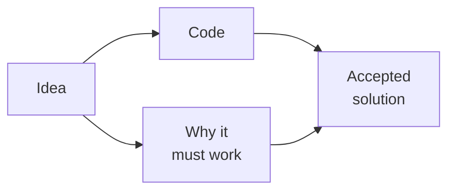
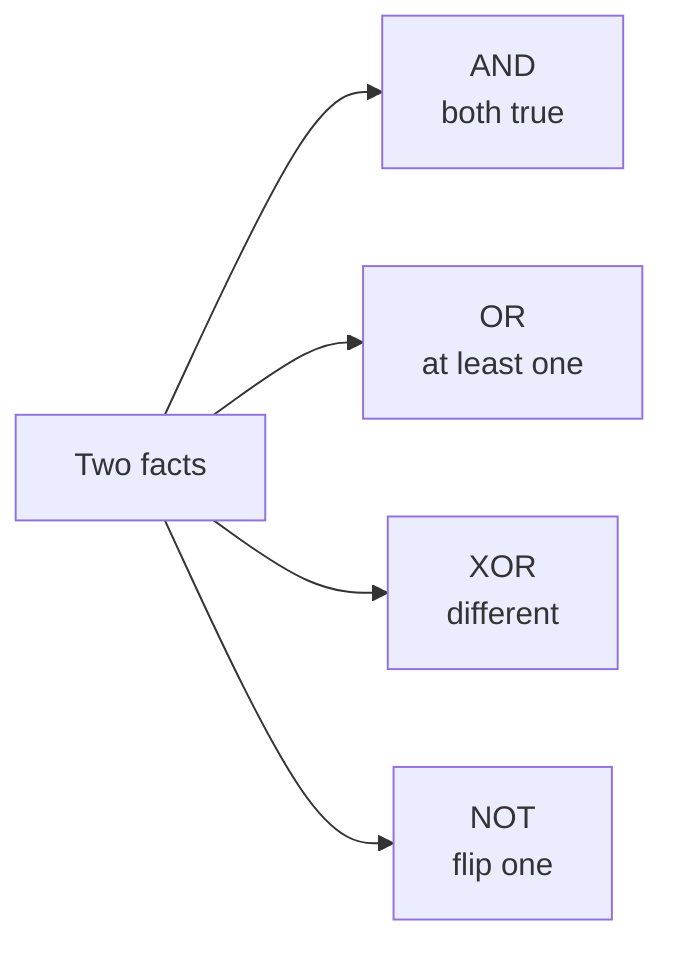
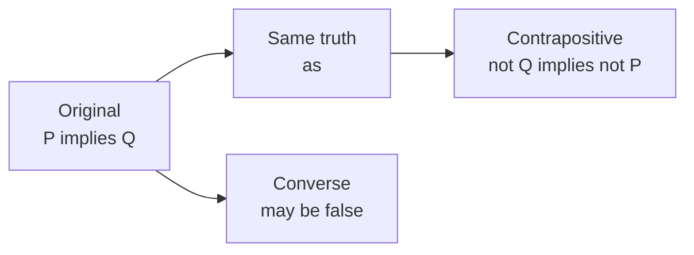
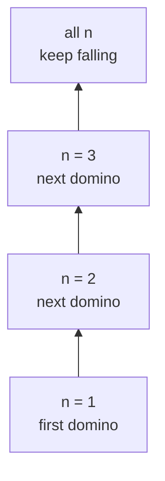
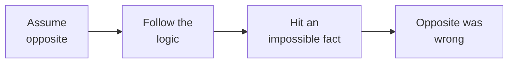
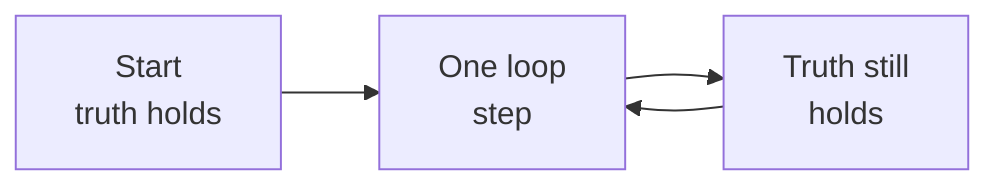
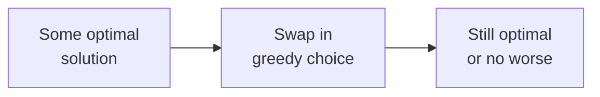

# 16 · Logic, Sets and Proofs

> After this chapter you can explain why an algorithm is correct, not just what
> the code does.

⬅️ [15 · Geometry and Grids](../15-geometry-and-grids/) · 🏠 [Roadmap](../README.md) · [17 · Mixed Practice](../17-mixed-practice/) ➡️

## Contents

1. [Why this matters for DSA](#1-why-this-matters-for-dsa)
2. [True and false logic](#2-true-and-false-logic)
3. [De Morgan laws](#3-de-morgan-laws)
4. [Implication and problem statements](#4-implication-and-problem-statements)
5. [Sets](#5-sets)
6. [Proof by induction](#6-proof-by-induction)
7. [Proof by contradiction](#7-proof-by-contradiction)
8. [Counterexamples](#8-counterexamples)
9. [Invariants](#9-invariants)
10. [Greedy proofs](#10-greedy-proofs)
11. [Java code](#11-java-code)
12. [Common mistakes](#12-common-mistakes)
13. [Interview patterns](#13-interview-patterns)
14. [Exercises](#14-exercises)
15. [One-minute recap](#15-one-minute-recap)

---

## 1. Why this matters for DSA

In an interview, code is only half the answer. The interviewer also wants to
know:

- Why does your `if` condition mean exactly what you think it means?
- Why is your loop safe?
- Why does binary search never throw away the answer?
- Why does your greedy choice not ruin the future?
- Why does the fast pointer meet the slow pointer in a cycle?

Logic is the grammar of true and false. Sets help you talk about groups of
things. Proofs help you explain correctness in a calm, short way.



🧠 **How to think of it yourself:** every time you write a loop, ask, "What is
still true after each step?" That truth is often the proof.

---

## 2. True and false logic

A statement is something that is either true or false.

```text
"5 is odd"              true
"2 + 2 = 5"             false
"array is sorted"       true or false depending on the array
```

Java stores this in `boolean`.

### AND OR NOT XOR

Logic gates are like tiny decision machines.

```text
p      q      p AND q   p OR q   p XOR q   NOT p
false  false  false     false    false     true
false  true   false     true     true      true
true   false  false     true     true      false
true   true   true      true     false     false
```

Plain meaning:

- `AND` is true only when both sides are true.
- `OR` is true when at least one side is true.
- `NOT` flips true to false and false to true.
- `XOR` is true when the two sides are different.

XOR also appears in bits. See [12 · Bits and Binary](../12-bits-and-binary/).



Java symbols:

```java
boolean both = a && b;
boolean either = a || b;
boolean flipped = !a;
boolean different = a ^ b;
```

### Short circuit evaluation

Java's `&&` and `||` are lazy in a useful way.

For `a && b`, if `a` is false, Java does not check `b`, because the whole thing
is already false.

For `a || b`, if `a` is true, Java does not check `b`, because the whole thing
is already true.

This protects array access:

```java
if (i < n && a[i] > 0) {
    // safe: a[i] is read only after i < n is true
}
```

The order matters. This is unsafe:

```java
if (a[i] > 0 && i < n) {
    // bad: a[i] may be read when i is outside the array
}
```

Why: Java reads left to right. Put the guard first, then the risky access.

---

## 3. De Morgan laws

Imagine two doors. To enter a room, you need key A and key B.

"Not allowed in" means: you are missing key A, or you are missing key B.

That is De Morgan's first law:

```text
!(a && b) == !a || !b
```

Second law:

```text
!(a || b) == !a && !b
```

### Truth table proof

```text
a      b      !(a && b)   !a || !b   !(a || b)   !a && !b
false  false  true        true       true        true
false  true   true        true       false       false
true   false  true        true       false       false
true   true   false       false      false       false
```

The matching columns prove the laws for every possible true or false input.

### Real code refactor

Suppose a loop should continue while the index is inside and the target was not
found:

```java
while (i < n && !found) {
    i++;
}
```

The stop condition is the opposite:

```text
!(i < n && !found)
```

Use De Morgan:

```text
!(i < n) || !(!found)
i >= n || found
```

Now the code can be clearer:

```java
while (true) {
    if (i >= n || found) {
        break;
    }
    i++;
}
```

🧠 **How to think of it yourself:** when a `!` covers a big condition, push the
`!` inside and flip `&&` with `||`.

---

## 4. Implication and problem statements

Implication means:

```text
if P then Q
```

Example:

```text
P: n is divisible by 4
Q: n is even

If n is divisible by 4, then n is even.
```

The original statement is not the same as the converse.

| Name | Statement | Example |
|---|---|---|
| Original | If P then Q | If divisible by 4, then even |
| Converse | If Q then P | If even, then divisible by 4 |
| Contrapositive | If not Q then not P | If not even, then not divisible by 4 |

The converse can be false. `6` is even, but not divisible by `4`.

The contrapositive is always equivalent to the original. If the original is true,
the contrapositive is true too.



Why this matters: problem statements often say "if a condition holds, return
true." Do not accidentally solve the converse.

Interview sentence:

```text
I prove the original by proving the contrapositive:
if the answer is not possible, then this required condition must be missing.
```

---

## 5. Sets

A set is a bag where duplicates do not matter.

```text
{1, 2, 3}
{3, 2, 1}        same set
{1, 1, 2, 3}     still the same set
```

Words:

- element: one thing in the set;
- union: everything in A or B;
- intersection: only things in both;
- difference: things in A but not B;
- subset: every element of A is also in B.

ASCII Venn pictures:

```text
Union A or B

   _______       _______
  /       \_____/       \
 /    A    XXXXX    B    \
 \         XXXXX         /
  \_______/     \_______/

Everything in either circle is kept.
```

```text
Intersection A and B

   _______       _______
  /       \_____/       \
 /    A      X      B    \
 \           X           /
  \_______/     \_______/

Only the shared middle is kept.
```

```text
Difference A minus B

   _______       _______
  /       \_____/       \
 /   AAAA    .      B    \
 \   AAAA    .           /
  \_______/     \_______/

Keep A's private part. Remove the shared part.
```

Java `HashSet` methods:

```java
Set<Integer> result = new HashSet<Integer>(a);
result.addAll(b);      // union
result.retainAll(b);   // intersection
result.removeAll(b);   // difference
```

LeetCode examples:

- 349 Intersection of Two Arrays uses set intersection without counts.
- 350 Intersection of Two Arrays II keeps counts or uses sorting.
- 217 Contains Duplicate checks if adding to a set fails.

### Set sizes and inclusion exclusion

If two sets overlap, adding their sizes double-counts the middle.

```text
|A union B| = |A| + |B| - |A intersection B|
```

This is inclusion-exclusion from
[13 · Counting and Combinatorics](../13-counting-and-combinatorics/).

Example:

```text
A has 7 students.
B has 5 students.
3 students are in both.

total in A or B = 7 + 5 - 3 = 9
```

### Power set

The power set is the set of all subsets. Each element gets a yes or no choice:
included or not included.

So a set with `n` elements has `2^n` subsets.

```text
{a,b,c}

choose a?  yes or no
choose b?  yes or no
choose c?  yes or no

2 * 2 * 2 = 8 subsets
```

---

## 6. Proof by induction

Induction is the domino proof.



To prove a statement for every `n`:

1. Base case: prove it for the smallest `n`.
2. Induction step: assume it works for `k`, then prove it works for `k + 1`.

This is the same idea as recursion faith in the
[Tower of Hanoi lesson](../../dsa/recursion/tower-of-hanoi/). You trust the
smaller case, then do the small extra work for the bigger case.

### Sum formula

Claim:

```text
1 + 2 + ... + n = n(n + 1) / 2
```

Base case:

```text
n = 1
left side = 1
right side = 1(2) / 2 = 1
```

Step:

```text
Assume 1 + 2 + ... + k = k(k + 1) / 2.

Then:
1 + 2 + ... + k + (k + 1)
= k(k + 1) / 2 + (k + 1)
= (k + 1)(k / 2 + 1)
= (k + 1)(k + 2) / 2
```

That is exactly the formula for `k + 1`.

### Proving 2 to the n is bigger than n

Claim: for every `n >= 1`, `2^n > n`.

Base:

```text
n = 1
2^1 = 2 > 1
```

Step:

```text
Assume 2^k > k.
2^(k+1) = 2 * 2^k
          > 2k
          >= k + 1       for k >= 1
```

So the next domino falls.

### Hanoi needs 2 to the n minus 1 moves

Let `M(n)` be the number of moves for `n` disks.

```text
M(0) = 0
M(n) = M(n-1) + 1 + M(n-1)
     = 2M(n-1) + 1
```

Claim:

```text
M(n) = 2^n - 1
```

Step:

```text
M(k+1) = 2M(k) + 1
       = 2(2^k - 1) + 1
       = 2^(k+1) - 2 + 1
       = 2^(k+1) - 1
```

### Strong induction

Strong induction lets you trust all smaller numbers, not just the previous one.

Example: every number `n >= 2` has a prime factorization.

- If `n` is prime, done.
- If `n` is not prime, `n = a × b` where `2 <= a < n` and `2 <= b < n`.
- By strong induction, `a` and `b` already have prime factorizations.
- Put those factorizations together for `n`.

This connects to [09 · Prime Numbers](../09-prime-numbers/).

---

## 7. Proof by contradiction

Contradiction means: assume the opposite, then show it crashes into something
impossible.



### Square root of 2 is irrational

Claim: `√2` cannot be written as a fraction of two integers.

Assume the opposite:

```text
√2 = a / b
```

Pick the fraction in lowest terms. Then:

```text
2 = a² / b²
a² = 2b²
```

So `a²` is even, which means `a` is even. Let `a = 2k`.

```text
(2k)² = 2b²
4k² = 2b²
b² = 2k²
```

So `b` is even too. But now both `a` and `b` are even, which contradicts
"lowest terms." Therefore `√2` is irrational.

### Infinitely many primes

Assume there are only finitely many primes:

```text
p1, p2, p3, ..., pk
```

Make this number:

```text
N = p1 × p2 × p3 × ... × pk + 1
```

When you divide `N` by any listed prime, the remainder is `1`. So `N` is either
prime itself or has a prime factor not on the list. Contradiction. There must be
infinitely many primes.

### Why the square root trick works

For divisors, if `n = a × b` and both `a` and `b` were bigger than `√n`, then
their product would be bigger than `n`. Impossible.

So at least one factor in every pair is `<= √n`. That is why checking up to
`√n` is enough. See [08 · Divisors and the Square Root Trick](../08-divisors-and-sqrt-trick/).

---

## 8. Counterexamples

A counterexample is one example that kills a "for all" claim.

Claim:

```text
n² + n + 41 is prime for every n >= 0
```

It looks true for a while:

```text
n = 0 -> 41
n = 1 -> 43
n = 2 -> 47
...
n = 39 -> 1601
```

But test `n = 40`:

```text
40² + 40 + 41 = 1600 + 40 + 41 = 1681
1681 = 41 × 41
```

So the claim is false.

🧠 **How to think of it yourself:** before proving a big claim, test small cases.
Then test the edge right after the pattern you noticed.

---

## 9. Invariants

An invariant is something that stays true after every step.



### Binary search invariant

For binary search, the invariant is:

```text
If the target exists, it is inside [lo, hi].
```

At each step:

- if `a[mid] < target`, everything at `mid` and left is too small, so move
  `lo = mid + 1`;
- if `a[mid] > target`, everything at `mid` and right is too large, so move
  `hi = mid - 1`.

The answer is never thrown away. That is LeetCode 704 Binary Search.

### Boyer Moore majority vote

LeetCode 169 Majority Element uses cancellation.

Think of every non-majority element pairing with one majority element and both
leaving the room. Since the majority appears more than half the time, it cannot
be fully cancelled.

```text
2 2 1 1 1 2 2

candidate changes when votes becomes 0
equal to candidate: votes + 1
different:          votes - 1

final candidate = 2
```

Invariant idea: after cancelling pairs of different values, the majority of the
remaining suffix is still the true majority.

### Floyd cycle detection

LeetCode 141 and 142 use a slow pointer and a fast pointer.

If there is a cycle, fast gains one node on slow each round inside the cycle.
The distance between them, measured around the cycle, changes by `1` each step.
Eventually that distance becomes `0`, so they meet.

```text
cycle length = 5
distance fast to slow around cycle:
4, 3, 2, 1, 0   meet
```

For LeetCode 287 Find the Duplicate Number, treat the array as pointers:

```text
next index = nums[index]
```

The duplicate creates a cycle entrance.

### Parity and colouring

A chessboard has alternating black and white squares. A domino always covers one
black and one white square.

If you remove two opposite corners, both removed squares have the same colour.
Now the board has unequal black and white counts. Dominoes cannot tile it.

That "colour count stays balanced" is an invariant.

```text
B W B W
W B W B
B W B W
W B W B

Remove two opposite B corners:
black count drops by 2, white count does not.
```

### Happy Number cycles

LeetCode 202 Happy Number repeatedly replaces a number by the sum of squares of
its digits. Either it reaches `1` or it loops forever.

That is a cycle detection problem:

```text
19 -> 82 -> 68 -> 100 -> 1
```

Use a set of seen numbers or Floyd's slow and fast pointers.

---

## 10. Greedy proofs

Greedy means: make the best-looking local choice now.

The proof question is:

```text
Why does this local choice not block the best final answer?
```

The light version is an exchange argument:

```text
If an optimal answer did something different first,
we can swap in our greedy choice
without making the answer worse.
```



Examples:

- LeetCode 55 Jump Game: keep the farthest reachable index. If you can stand on
  index `i`, the only important future fact is the farthest place you can reach.
- LeetCode 455 Assign Cookies: give the smallest cookie that satisfies the
  smallest greedy child. A bigger cookie would be wasted there.
- LeetCode 134 Gas Station: when your tank becomes negative at station `i`, no
  station in the failed segment can be a valid start, so restart at `i + 1`.

### Correctness in two or three sentences

In interviews, you do not need a textbook proof. Say the invariant or exchange
idea clearly:

```text
For binary search, my invariant is that the target, if present, remains inside
[lo, hi]. Each comparison removes only values that are definitely too small or
too large. When the interval is empty, no possible position remains.
```

That is enough for most interviews.

---

## 11. Java code

Code: [`LogicAndProofs.java`](LogicAndProofs.java)

Key methods:

```java
private static Set<Integer> intersection(int[] first, int[] second)
private static boolean containsDuplicate(int[] nums)
private static int binarySearch(int[] nums, int target)
private static int majorityElement(int[] nums)
private static ListNode detectCycle(ListNode head)
private static int findDuplicate(int[] nums)
private static boolean canJump(int[] nums)
private static int canCompleteCircuit(int[] gas, int[] cost)
```

Run it:

```text
cd maths_for_dsa/16-logic-sets-and-proofs
java LogicAndProofs.java
```

Real output:

```text
Logic, sets and proofs demos
p q | AND OR XOR NOT-p
false false | false false false true
false true | false true true true
true false | false true true false
true true | true true false false
Guard i < n && a[i] > 0 with i=3,n=3: false
De Morgan sample !(true && false): true equals true
Unique intersection: [2]
Intersection with counts: [2, 2]
Contains duplicate [1,2,3,1]: true
Power set size for n=5: 32
1+...+5 = 15, formula = 15
Hanoi moves for 4 disks: 15
2^10 > 10: true
n^2+n+41 at n=40: 1681
Is that value prime? false
Binary search 9 index: 3
Majority element: 2
Linked list has cycle: true
Cycle starts at value: 2
Duplicate by Floyd in [1,3,4,2,2]: 2
Happy number 19: true
Can jump [2,3,1,1,4]: true
Assign cookies: 1
Gas station start: 3
```

---

## 12. Common mistakes

1. Swapping `&&` and `||` without applying De Morgan's law.
2. Writing the risky array access before the guard in a short-circuit condition.
3. Thinking the converse is always true just because the original is true.
4. Forgetting that `HashSet` removes duplicates.
5. Using `addAll`, `retainAll` or `removeAll` on a set you still need later.
   Copy first if you need the original.
6. Saying "it works by induction" without giving the base case.
7. Proving only examples. Examples help you guess; they do not prove a "for all"
   statement.
8. Forgetting to look for counterexamples before trying a proof.
9. In binary search, losing the invariant by moving `lo` or `hi` past a possible
   answer.
10. For Floyd's algorithm, moving the fast pointer without checking it is not
    `null`.
11. In greedy problems, explaining what the code does but not why the greedy
    choice is safe.

---

## 13. Interview patterns

| Pattern | How to recognise it | LeetCode problems |
|---|---|---|
| Boolean guards | Need safe checks like `i < n && a[i] > 0` | 704 Binary Search |
| De Morgan refactor | A negated compound condition is hard to read | many loop conditions |
| Set membership | Need duplicates, intersection or quick seen check | 349 Intersection of Two Arrays, 350 Intersection of Two Arrays II, 217 Contains Duplicate |
| Induction proof | Recursive solution needs correctness explanation | Tower of Hanoi, many recursion problems |
| Counterexample search | A "for all" claim smells too strong | many maths observations |
| Binary search invariant | Sorted array, answer stays inside a range | 704 Binary Search |
| Cancellation invariant | Pairs of different values can be removed | 169 Majority Element |
| Fast and slow pointers | Linked list or array behaves like a cycle | 141 Linked List Cycle, 142 Linked List Cycle II, 287 Find the Duplicate Number |
| Cycle by repeated state | Repeated number or state means loop | 202 Happy Number |
| Greedy exchange | Local best choice should be swappable into optimum | 55 Jump Game, 455 Assign Cookies, 134 Gas Station |

---

## 14. Exercises

### Level 1 · Warm-up

**1.** Fill in `true && false`, `true || false`, and `true ^ false`.

<details>
<summary>Answer</summary>

`true && false = false`, `true || false = true`, and `true ^ false = true`.
XOR is true because the two values are different.

</details>

**2.** What is `!(true || false)`?

<details>
<summary>Answer</summary>

`true || false` is `true`, so `!(true || false)` is `false`.

</details>

**3.** Rewrite `!(a && b)` using De Morgan's law.

<details>
<summary>Answer</summary>

`!a || !b`.

</details>

**4.** Rewrite `!(x || y)` using De Morgan's law.

<details>
<summary>Answer</summary>

`!x && !y`.

</details>

**5.** If the original statement is "if a number is divisible by 6, then it is
divisible by 3", what is the converse?

<details>
<summary>Answer</summary>

The converse is: "if a number is divisible by 3, then it is divisible by 6."
It is false, because `9` is divisible by `3` but not by `6`.

</details>

**6.** For sets `A = {1,2,3}` and `B = {3,4}`, find the union and intersection.

<details>
<summary>Answer</summary>

Union is `{1,2,3,4}`. Intersection is `{3}`.

</details>

**7.** How many subsets does a set with `6` elements have?

<details>
<summary>Answer</summary>

`2^6 = 64` subsets.

</details>

**8.** What is the base case for proving `1 + 2 + ... + n = n(n + 1) / 2`
for `n >= 1`?

<details>
<summary>Answer</summary>

`n = 1`. The left side is `1`, and the right side is `1 × 2 / 2 = 1`.

</details>

### Level 2 · Practice

**9.** Use inclusion-exclusion. `|A| = 10`, `|B| = 8`, and `|A intersection B| = 3`.
What is `|A union B|`?

<details>
<summary>Answer</summary>

`|A union B| = 10 + 8 - 3 = 15`.

</details>

**10.** How many moves does Tower of Hanoi need for `5` disks?

<details>
<summary>Answer</summary>

`2^5 - 1 = 32 - 1 = 31` moves.

</details>

**11.** Prove the induction step for the sum formula in one line: if the sum up
to `k` is `k(k + 1) / 2`, what is the sum up to `k + 1`?

<details>
<summary>Answer</summary>

`k(k + 1) / 2 + (k + 1) = (k + 1)(k + 2) / 2`, which is the formula for
`k + 1`.

</details>

**12.** Check the counterexample polynomial at `n = 40`: compute `n² + n + 41`.

<details>
<summary>Answer</summary>

`40² + 40 + 41 = 1600 + 40 + 41 = 1681 = 41 × 41`, so it is not prime.

</details>

**13.** In binary search on `[2, 4, 7, 9, 12]` for `9`, what is the first
middle index and value?

<details>
<summary>Answer</summary>

`lo = 0`, `hi = 4`, so `mid = 0 + (4 - 0) / 2 = 2`.
The first middle value is `7`.

</details>

**14.** Run one Boyer-Moore trace for `[3, 3, 4]`. What candidate remains?

<details>
<summary>Answer</summary>

Start votes `0`, choose `3`, votes `1`.
Next `3` matches, votes `2`.
Next `4` differs, votes `1`.
Candidate remains `3`.

</details>

**15.** For Happy Number, compute the next value after `19`.

<details>
<summary>Answer</summary>

`1² + 9² = 1 + 81 = 82`.

</details>

**16.** In Jump Game, for `[2, 3, 1, 1, 4]`, what is the farthest reachable
index after processing index `1`?

<details>
<summary>Answer</summary>

At index `0`, farthest is `0 + 2 = 2`.
At index `1`, farthest is `max(2, 1 + 3) = 4`.

</details>

### Level 3 · Interview

**17.** Explain why `i < n && a[i] > 0` is safe but `a[i] > 0 && i < n` is not.

<details>
<summary>Answer</summary>

Java checks left to right. In the safe version, `a[i]` is read only after
`i < n` is true. In the unsafe version, Java may read `a[i]` before checking
the guard.

</details>

**18.** Give a two-sentence correctness proof for binary search.

<details>
<summary>Answer</summary>

The invariant is that if the target exists, it is always inside `[lo, hi]`.
Each comparison removes only values that are definitely too small or definitely
too large, so when the interval becomes empty, the target is not present.

</details>

**19.** Why does Floyd's fast pointer meet the slow pointer if a cycle exists?

<details>
<summary>Answer</summary>

Once both pointers are in the cycle, fast gains one node on slow each step.
The distance between them around the cycle changes by one each time, so it must
eventually become zero, which means they meet.

</details>

**20.** In Find the Duplicate Number, why can an array be viewed as a linked
list?

<details>
<summary>Answer</summary>

Treat index `i` as a node and `nums[i]` as the next pointer. Because values point
to valid indexes and one value is repeated, two nodes point into the same path,
creating a cycle entrance at the duplicate.

</details>

**21.** Why can a chessboard with two opposite corners removed not be tiled by
dominoes?

<details>
<summary>Answer</summary>

Opposite corners have the same colour. Removing them makes one colour have two
fewer squares than the other. Every domino covers one black and one white square,
so tiling is impossible.

</details>

**22.** Give the exchange idea for Assign Cookies.

<details>
<summary>Answer</summary>

Give the smallest cookie that can satisfy the least greedy child. If an optimal
solution used a bigger cookie for that child, swapping in the smaller sufficient
cookie keeps the child satisfied and leaves the bigger cookie for later.

</details>

**23.** Why does Gas Station restart after the tank becomes negative?

<details>
<summary>Answer</summary>

If starting at the current candidate cannot reach station `i + 1`, then any
station inside that failed segment starts with even less saved fuel before the
failure point. None of them can work, so the next possible start is `i + 1`.

</details>

**24.** A claim says "all numbers of the form `n² + n + 41` are prime." What
single counterexample kills it?

<details>
<summary>Answer</summary>

`n = 40` gives `40² + 40 + 41 = 1681 = 41 × 41`, which is composite.
One counterexample is enough to disprove a "for all" claim.

</details>

---

## 15. One-minute recap

- Logic turns conditions into exact true or false rules.
- Java `&&` and `||` short-circuit, so guards must come before risky reads.
- De Morgan moves `!` inside a condition and swaps AND with OR.
- The converse is not the same as the original; the contrapositive is.
- Sets model membership, duplicates, union, intersection and difference.
- Induction is the proof version of recursion faith.
- Contradiction assumes the opposite and reaches an impossible result.
- A counterexample kills a "for all" claim.
- Invariants explain why loops like binary search stay correct.
- Greedy algorithms need a reason that the local choice is safe.
