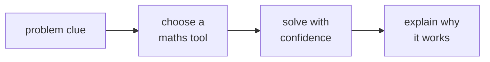
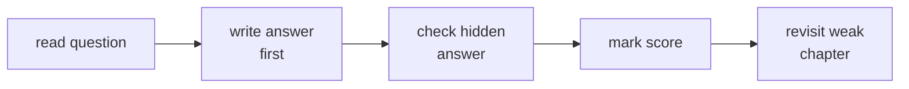
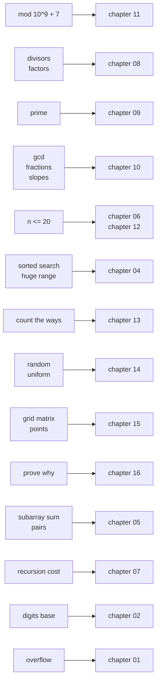
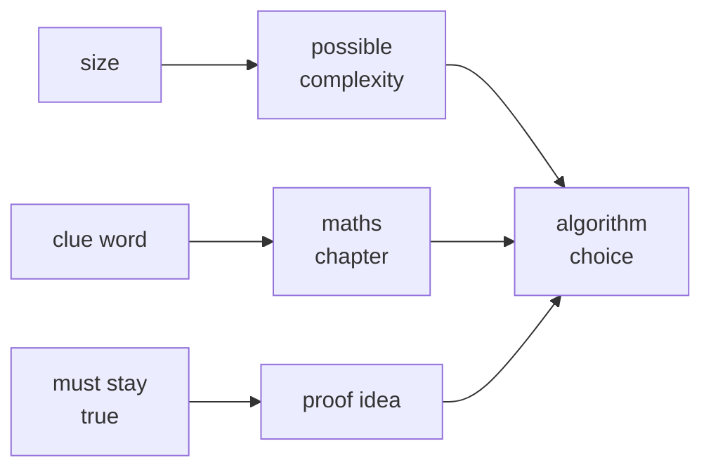
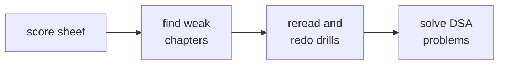

# 17 · Mixed Practice

> After this chapter you can choose the right maths tool under interview pressure and explain why it works.

⬅️ [16 · Logic, Sets and Proofs](../16-logic-sets-and-proofs/) · 🏠 [Roadmap](../README.md)

## Contents

1. [Why this matters for DSA](#1-why-this-matters-for-dsa)
2. [How to use this chapter](#2-how-to-use-this-chapter)
3. [Which tool](#3-which-tool)
4. [No Java file for this chapter](#4-no-java-file-for-this-chapter)
5. [Common mistakes](#5-common-mistakes)
6. [Interview patterns](#6-interview-patterns)
7. [Exercises](#7-exercises)
8. [Self score and what to do next](#8-self-score-and-what-to-do-next)
9. [One-minute recap](#9-one-minute-recap)

---

## 1. Why this matters for DSA

In a real interview, nobody says, "Please use chapter 08 now." You see a problem, hear a few clues, and
must pick the tool yourself. This chapter is the final gym room. It mixes everything: complexity, digits,
logs, divisors, primes, GCD, mod, bits, counting, probability, grids and proofs.



The goal is not speed first. The goal is **recognition**:

```text
clue in problem       ->  maths idea       ->  chapter to revisit
"n <= 20"             ->  subsets, masks   ->  06 and 12
"mod 10^9 + 7"        ->  clock maths      ->  11
"how many ways"       ->  counting         ->  13
"prove it works"      ->  invariant        ->  16
```

---

## 2. How to use this chapter

Use it like an interview practice sheet, not like a normal lesson.

1. **Mixed:** do not group by comfort. Let your brain switch tools.
2. **Timed:** give yourself 45 to 60 minutes for one pass.
3. **Answer first:** write your answer before opening the `<details>` block.
4. **Check the revisit note:** every answer names the chapter to review.
5. **Repeat weak zones:** if bits hurt, go back to 12; if sums hurt, go back to 05.

```text
try first  ->  open answer  ->  mark right or wrong  ->  revisit weak chapter
```



🧠 How to think of it yourself: before solving, ask, "What is the clue word?" Then ask, "Which chapter
taught that clue?"

For a 45-minute practice round, use this rhythm:

```text
minutes 0..5     scan all questions and mark easy wins
minutes 5..30    solve the ones with clear tools
minutes 30..40   attempt the hard ones out loud
minutes 40..45   check arithmetic and write revisit notes
```

If one question blocks you for more than five minutes, circle it and move on. Interviews reward calm
progress. You can return with a fresher brain after collecting the easier points.

---

## 3. Which tool

### 3.1 Clue table

| If the problem says | Think of | Revisit |
|---|---|---|
| mod 10^9 + 7 | modular arithmetic, fast power, inverse | 11 |
| divisors / factors | divisor pairs, √n trick | 08 |
| prime | primality, sieve, factorization | 09 |
| gcd / fractions / slopes | Euclid, simplify, same line | 10 |
| n ≤ 20 | 2^n, backtracking, bitmasks | 06, 12 |
| sorted / search in a huge range | log n, binary search | 04 |
| count the ways | combinations, permutations, DP counting | 13 |
| random / uniform | probability, expected value, weighted pick | 14 |
| grid / matrix / points | coordinates, directions, distances | 15 |
| prove / why does it work | induction, invariant, contradiction | 16 |
| sum of a subarray / pairs | prefix sums, arithmetic sums | 05 |
| recursion cost | recurrence tree, Master theorem | 07 |
| digits / base | place value, `% 10`, base conversion | 02 |
| overflow | int and long limits, safe arithmetic | 01 |

### 3.2 Flowchart



The same map as a plain picture:

```text
numbers and limits  ->  01
digits and bases    ->  02
logs and search     ->  04
sums and pairs      ->  05
complexity          ->  06
recursion cost      ->  07
number theory       ->  08, 09, 10, 11
bits and masks      ->  12
counting and chance ->  13, 14
grids and proofs    ->  15, 16
```

### 3.3 The three question habit

When you feel stuck, do not stare harder at the code. Ask three tiny questions:

```text
1. What is the size?
   n = 20, n = 10^5, n = 10^18, grid 1000 x 1000 ...

2. What is the clue word?
   prime, gcd, mod, subset, random, sorted, prove ...

3. What must stay true?
   sorted order, window sum, gcd value, probability total, invariant ...
```

Those questions point you to the tool:



Example 1:

```text
Problem clue:
  "n <= 20, choose a subset with maximum score"

Thinking:
  size says 2^n may fit
  clue says subset
  tool says bitmask or backtracking

Revisit:
  06 for constraints, 12 for masks
```

Example 2:

```text
Problem clue:
  "answer can be huge, return it modulo 10^9 + 7"

Thinking:
  clue says mod
  multiplication may overflow
  tool says take mod at every step

Revisit:
  01 for overflow, 11 for modular arithmetic
```

Example 3:

```text
Problem clue:
  "sorted array, find the smallest x that works"

Thinking:
  sorted or monotonic clue
  huge range means linear scan is too slow
  tool says binary search on answer

Revisit:
  04 for logs, 16 for why the condition stays monotonic
```

### 3.4 How to review a wrong answer

A wrong answer is useful only if you label the mistake. Use this small table after the timed round:

| Mistake type | What it means | Fix |
|---|---|---|
| wrong tool | you missed the clue word | reread the matching chapter intro |
| wrong arithmetic | idea was right, calculation slipped | redo by hand, then verify in Java |
| wrong complexity | loop count was misread | draw the loop as a sum |
| missing proof | answer works but you cannot defend it | write an invariant or induction step |
| overflow risk | formula is right but type is unsafe | revisit int and long limits |

The review loop:

```text
wrong answer
   |
   v
name the mistake
   |
   v
revisit one chapter
   |
   v
redo without peeking
```

---

## 4. No Java file for this chapter

This final chapter is a practice room, so it has **no Java demo file**. The code appears inside exercises.
You can still copy any snippet into a small `Scratch.java` if you want to test it.

```text
chapter 01 to 16: lesson + Java demo
chapter 17: mixed exercises + answer key
```

---

## 5. Common mistakes

1. **Solving before classifying.** First name the clue, then solve.
2. **Using O(n²) because it is easy.** Always compare n with the constraint table from 06.
3. **Ignoring hidden costs.** String concatenation in a loop is not free.
4. **Forgetting overflow.** `int` breaks near 2.1 × 10^9; multiplication can break before the final answer.
5. **Using probability by feeling.** Count outcomes or use expected value rules from 14.
6. **Not proving the greedy or two pointer move.** Use an invariant from 16.
7. **Memorising formulas without the why.** If you forget under pressure, rebuild from pictures.

Two common traps deserve a picture.

First, a nested loop is not always O(n²). Look at the total work:

```text
triangle loop:      1 + 2 + 3 + ... + n       -> O(n^2)
doubling loop:      1 + 2 + 4 + ... + n       -> O(n)
harmonic loop:      n/1 + n/2 + ... + n/n     -> O(n log n)
```

Second, "random" does not mean "pick any clever-looking formula". The probability mass must add up to 1:

```text
weights [1, 3, 2]

index 0: 1 ticket
index 1: 3 tickets
index 2: 2 tickets
total : 6 tickets

probabilities: 1/6 + 3/6 + 2/6 = 1
```

---

## 6. Interview patterns

| Pattern | How to recognise it | Chapters |
|---|---|---|
| Complexity from code | loops, recursion, hidden work | 04, 05, 06, 07 |
| Constraint picking | n is given first, asks for feasible approach | 06 |
| Number splitting | digits, carries, base conversion | 02 |
| Fast growth | powers, logs, binary search, fast power | 03, 04, 11 |
| Pair counting | subarrays, pairs, arithmetic sums | 05, 13 |
| Divisor search | factor, multiple, √n | 08 |
| Prime precompute | many prime queries, count primes | 09 |
| Reduce ratio | gcd, lcm, slopes, fractions | 10 |
| Mod answer | answer huge, says mod | 11 |
| Bitmask set | n ≤ 20, subsets, state compression | 12 |
| Count ways | permutations, combinations, paths | 13 |
| Random choice | uniform, weighted, expected | 14 |
| Grid maths | rows, columns, distance, points | 15 |
| Proof request | why true, invariant, induction | 16 |

---

## 7. Exercises

### A. Find the time complexity

**1.** What is the time complexity?

```java
for (int i = 1; i <= n; i++) {
    for (int j = 1; j <= i; j++) {
        work();
    }
}
```

<details>
<summary>Answer</summary>

**The answer** — O(n²). The work is 1 + 2 + ... + n = n(n + 1) / 2.

Revisit: 05, 06.

</details>

**2.** What is the time complexity?

```java
for (int i = 1; i <= n; i *= 2) {
    for (int j = 0; j < i; j++) {
        work();
    }
}
```

<details>
<summary>Answer</summary>

**The answer** — O(n). The inner work is 1 + 2 + 4 + ... + n, which is less than 2n.

Revisit: 03, 05, 06.

</details>

**3.** What is the time complexity?

```java
for (int i = 1; i <= n; i++) {
    for (int j = i; j <= n; j += i) {
        work();
    }
}
```

<details>
<summary>Answer</summary>

**The answer** — O(n log n). For each i, the inner loop runs about n / i times, so total work is
n(1 + 1/2 + 1/3 + ... + 1/n).

Revisit: 05, 06.

</details>

**4.** What is the time complexity?

```java
for (int i = 1; i * i <= n; i++) {
    work();
}
```

<details>
<summary>Answer</summary>

**The answer** — O(√n). The loop stops when i passes √n.

Revisit: 03, 08.

</details>

**5.** What is the time complexity?

```java
int left = 0;
int right = n - 1;
while (left < right) {
    if (a[left] + a[right] < target) {
        left++;
    } else {
        right--;
    }
}
```

<details>
<summary>Answer</summary>

**The answer** — O(n). Each step moves `left` or `right`; neither pointer moves backward.

Revisit: 06, 16.

</details>

**6.** What is the time complexity?

```java
int sum = 0;
for (int right = 0, left = 0; right < n; right++) {
    sum += a[right];
    while (sum > target) {
        sum -= a[left];
        left++;
    }
}
```

<details>
<summary>Answer</summary>

**The answer** — O(n). `right` moves n times and `left` moves at most n times.

Revisit: 05, 06.

</details>

**7.** What is the time complexity of plain recursive Fibonacci?

```java
int fib(int n) {
    if (n <= 1) return n;
    return fib(n - 1) + fib(n - 2);
}
```

<details>
<summary>Answer</summary>

**The answer** — exponential, often written O(2^n). The call tree branches again and again.

Revisit: 07.

</details>

**8.** What is the time complexity of merge sort?

```java
sort(leftHalf);
sort(rightHalf);
mergeBothHalves();
```

<details>
<summary>Answer</summary>

**The answer** — O(n log n). There are log₂ n levels, and each level merges n total items.

Revisit: 04, 07.

</details>

**9.** What is the hidden cost?

```java
String s = "";
for (int i = 0; i < n; i++) {
    s = s + i;
}
```

<details>
<summary>Answer</summary>

**The answer** — O(n²) characters copied in the common analysis. Each concatenation copies the old string.
Use `StringBuilder`.

Revisit: 06.

</details>

**10.** What is the time complexity?

```java
for (int i = 0; i < n; i++) {
    for (int j = 1; j < n; j *= 2) {
        work();
    }
}
```

<details>
<summary>Answer</summary>

**The answer** — O(n log n). The outer loop runs n times; the inner loop doubles, so it runs log₂ n times.

Revisit: 04, 06.

</details>

**11.** What is the time complexity?

```java
for (int i = n; i > 0; i /= 2) {
    for (int j = 0; j < n; j++) {
        work();
    }
}
```

<details>
<summary>Answer</summary>

**The answer** — O(n log n). The outer loop halves about log₂ n times, and the inner loop costs n each time.

Revisit: 04, 06.

</details>

**12.** What is the time complexity?

```java
void dfs(Node node) {
    if (node == null) return;
    dfs(node.left);
    dfs(node.right);
}
```

<details>
<summary>Answer</summary>

**The answer** — O(n), where n is the number of nodes. Every node is visited once.

Revisit: 06, 07.

</details>

### B. From constraints to the allowed complexity

**13.** n ≤ 20 and the problem asks for the best subset. What complexities are usually possible?

<details>
<summary>Answer</summary>

**The answer** — O(2^n · n) is often possible. 2²⁰ = 1,048,576 masks.

Revisit: 06, 12.

</details>

**14.** n ≤ 10^5. Is O(n²) usually safe?

<details>
<summary>Answer</summary>

**The answer** — no. n² = 10^10, too large. Aim for O(n log n), O(n), or O(log n) per query.

Revisit: 06.

</details>

**15.** n ≤ 500. Is O(n³) usually possible?

<details>
<summary>Answer</summary>

**The answer** — often yes. 500³ = 125,000,000, near the rough 10^8 scale, so it depends on constants.

Revisit: 06.

</details>

**16.** n ≤ 10^12 and you need to test divisors of one number. What loop shape is natural?

<details>
<summary>Answer</summary>

**The answer** — loop while `d * d <= n`, which is O(√n). √10^12 = 10^6.

Revisit: 08.

</details>

**17.** n ≤ 10^18 and the array is sorted. What clue should you hear?

<details>
<summary>Answer</summary>

**The answer** — use logarithms and binary search style decisions, O(log n).

Revisit: 04.

</details>

**18.** n ≤ 10 and the problem asks for every ordering. What complexity may be intended?

<details>
<summary>Answer</summary>

**The answer** — O(n!) may be intended. 10! = 3,628,800.

Revisit: 06, 13.

</details>

### C. Numbers, digits, powers and logs

**19.** What is 1 + 2 + ... + 100?

<details>
<summary>Answer</summary>

**The answer** — 5050, because 100 × 101 / 2 = 5050.

Revisit: 05.

</details>

**20.** How many decimal digits does 12345 have?

<details>
<summary>Answer</summary>

**The answer** — 5.

Revisit: 02.

</details>

**21.** How many bits are needed to write 1000 in binary?

<details>
<summary>Answer</summary>

**The answer** — 10, because 2⁹ = 512 and 2¹⁰ = 1024, so positions 9 down to 0 are needed.

Revisit: 04, 12.

</details>

**22.** What is 2¹⁰?

<details>
<summary>Answer</summary>

**The answer** — 1024.

Revisit: 03.

</details>

**23.** What is √2025?

<details>
<summary>Answer</summary>

**The answer** — 45, because 45 × 45 = 2025.

Revisit: 03.

</details>

**24.** What is 1 + 2 + 4 + 8 + 16 + 32 + 64?

<details>
<summary>Answer</summary>

**The answer** — 127. A geometric sum of powers of two up to 2⁶ equals 2⁷ − 1.

Revisit: 03, 05.

</details>

### D. Divisors, primes, GCD and mod

**25.** List all positive divisors of 36.

<details>
<summary>Answer</summary>

**The answer** — 1, 2, 3, 4, 6, 9, 12, 18, 36.

Revisit: 08.

</details>

**26.** What is gcd(252, 105)?

<details>
<summary>Answer</summary>

**The answer** — 21.

```text
252 = 2 * 105 + 42
105 = 2 * 42 + 21
42  = 2 * 21 + 0
```

Revisit: 10.

</details>

**27.** What is lcm(18, 24)?

<details>
<summary>Answer</summary>

**The answer** — 72, because gcd(18, 24) = 6 and 18 / 6 × 24 = 72.

Revisit: 10.

</details>

**28.** How many primes are below 30?

<details>
<summary>Answer</summary>

**The answer** — 10: 2, 3, 5, 7, 11, 13, 17, 19, 23, 29.

Revisit: 09.

</details>

**29.** What is 7¹³ mod 100?

<details>
<summary>Answer</summary>

**The answer** — 7. The powers cycle in the last two digits; fast power also gives 7.

Revisit: 11.

</details>

**30.** What is the modular inverse of 3 modulo 11?

<details>
<summary>Answer</summary>

**The answer** — 4, because 3 × 4 = 12, and 12 mod 11 = 1.

Revisit: 11.

</details>

**31.** How many trailing zeroes are in 100!?

<details>
<summary>Answer</summary>

**The answer** — 24, because ⌊100/5⌋ + ⌊100/25⌋ = 20 + 4.

Revisit: 09.

</details>

**32.** Why do divisors come in pairs?

<details>
<summary>Answer</summary>

**The answer** — if d divides n, then n / d is also a divisor, and d × (n / d) = n. That is why checking up
to √n is enough.

Revisit: 08, 16.

</details>

### E. Bits

**33.** Compute `44 & 21`, `44 | 21`, and `44 ^ 21`.

<details>
<summary>Answer</summary>

**The answer** — AND = 4, OR = 61, XOR = 57.

Revisit: 12.

</details>

**34.** How many 1-bits are in 255?

<details>
<summary>Answer</summary>

**The answer** — 8, because 255 is `11111111₂`.

Revisit: 12.

</details>

**35.** What is the bitwise AND of all numbers from 12 to 15?

<details>
<summary>Answer</summary>

**The answer** — 12.

```text
12 = 1100
13 = 1101
14 = 1110
15 = 1111
AND= 1100
```

Revisit: 12.

</details>

**36.** What is `0 ^ 1 ^ 2 ^ 3 ^ 4 ^ 5`?

<details>
<summary>Answer</summary>

**The answer** — 1.

Revisit: 12.

</details>

**37.** How many subsets does a 5-item set have?

<details>
<summary>Answer</summary>

**The answer** — 32, because each item is out or in, so 2⁵ = 32.

Revisit: 12, 13.

</details>

**38.** Why does `x & (x - 1)` help test powers of two?

<details>
<summary>Answer</summary>

**The answer** — it removes the lowest 1-bit. A positive power of two has exactly one 1-bit, so the result
becomes zero.

Revisit: 12.

</details>

### F. Counting and probability

**39.** What is C(10, 3)?

<details>
<summary>Answer</summary>

**The answer** — 120.

Revisit: 13.

</details>

**40.** How many ways are there to choose 2 people from 7?

<details>
<summary>Answer</summary>

**The answer** — 21, because C(7, 2) = 7 × 6 / 2.

Revisit: 13.

</details>

**41.** How many shortest paths go from the top-left to bottom-right of a grid needing 3 rights and 2 downs?

<details>
<summary>Answer</summary>

**The answer** — 10, because choose where the 2 downs go among 5 moves: C(5, 2) = 10.

Revisit: 13, 15.

</details>

**42.** How many ordered ways are there to pick 2 winners from 5 people?

<details>
<summary>Answer</summary>

**The answer** — 20, because 5 choices for first and 4 choices for second.

Revisit: 13.

</details>

**43.** What is the probability of two heads when flipping two fair coins?

<details>
<summary>Answer</summary>

**The answer** — 1/4. The equally likely outcomes are HH, HT, TH, TT.

Revisit: 14.

</details>

**44.** What is the expected value of one fair six-sided die?

<details>
<summary>Answer</summary>

**The answer** — 3.5, because (1 + 2 + 3 + 4 + 5 + 6) / 6 = 21 / 6.

Revisit: 14.

</details>

### G. Grids, geometry and logic

**45.** What is the Manhattan distance between (2, 3) and (7, 1)?

<details>
<summary>Answer</summary>

**The answer** — 7, because |2 − 7| + |3 − 1| = 5 + 2.

Revisit: 15.

</details>

**46.** What is the slope between (2, 3) and (6, 7)?

<details>
<summary>Answer</summary>

**The answer** — 1, because (7 − 3) / (6 − 2) = 4 / 4.

Revisit: 10, 15.

</details>

**47.** In a grid with 10 columns, what 1D index represents row 3, column 4?

<details>
<summary>Answer</summary>

**The answer** — 34, because index = row × columns + column = 3 × 10 + 4.

Revisit: 15.

</details>

**48.** You keep a variable `best` as the smallest value seen so far while scanning an array. What proof tool
explains why it is correct?

<details>
<summary>Answer</summary>

**The answer** — a loop invariant. After each step, `best` equals the smallest value in the part already scanned.

Revisit: 16.

</details>

### H. Mock 45 minute maths interview round

**49.** Count primes below n. Explain the algorithm and complexity.

<details>
<summary>Answer</summary>

**The answer** — use the Sieve of Eratosthenes.

Walkthrough:

```text
make isPrime[0..n-1] true
mark 0 and 1 false
for p from 2 while p*p < n:
    if p is still prime:
        mark p*p, p*p+p, p*p+2p, ... false
count the true values
```

Why start at p²? Smaller multiples already had a smaller prime factor. Complexity is O(n log log n), and
space is O(n). For n = 30, the answer is 10.

Revisit: 09.

</details>

**50.** Compute Pow(x, n) by fast power. Explain why it is O(log n).

<details>
<summary>Answer</summary>

**The answer** — repeatedly square the base and halve the exponent.

```text
2^13:
13 is odd -> take 2
6  is even -> skip 4
3  is odd -> take 16
1  is odd -> take 256

2^13 = 8192
```

Each loop cuts n in half, so there are O(log n) loops. Handle negative exponents by inverting x, and use
`long` for the exponent before negating `Integer.MIN_VALUE`.

Revisit: 03, 04, 11.

</details>

**51.** Find trailing zeroes of n!. Explain the reason.

<details>
<summary>Answer</summary>

**The answer** — count factors of 5:

```text
zero needs 10 = 2 * 5
there are more 2s than 5s
so count 5s

answer = floor(n/5) + floor(n/25) + floor(n/125) + ...
```

For n = 100, answer = 20 + 4 = 24.

Revisit: 09.

</details>

**52.** Random Pick with Weight: weights `[1, 3, 2]`. How do you pick fairly?

<details>
<summary>Answer</summary>

**The answer** — build prefix sums `[1, 4, 6]`, generate a uniform integer from 1 to 6, and binary search
the first prefix ≥ that integer.

```text
ticket 1       -> index 0
tickets 2..4   -> index 1
tickets 5..6   -> index 2
```

The probabilities are 1/6, 3/6 and 2/6, exactly matching the weights. Build time O(n), each pick O(log n).

Revisit: 04, 14.

</details>

**53.** Unique Paths: a robot must move 6 rights and 2 downs. Use combinations and compare with DP.

<details>
<summary>Answer</summary>

**The answer** — 28 paths, because there are 8 total moves and you choose the 2 down positions:
C(8, 2) = 28.

DP says the same thing:

```text
ways[r][c] = ways[r-1][c] + ways[r][c-1]
```

Combinations are faster for one clean rectangle. DP is better when there are obstacles or extra rules.

Revisit: 13, 15.

</details>

---

## 8. Self score and what to do next

| Score | Meaning | What to do |
|---:|---|---|
| 45+ correct | ready for mixed maths in DSA interviews | go back to [`dsa/`](../../dsa/) and solve problems |
| 35–44 correct | close, but weak spots remain | revisit the chapters you missed most |
| below 35 correct | the tools are not automatic yet | redo Levels 1–3 from the roadmap |

What to do next:

1. Redo the questions you missed without looking.
2. Revisit the named chapters.
3. Solve the matching LeetCode problems from the chapter tables.
4. Return to [`dsa/`](../../dsa/) and mix maths with full problem solving.



---

## 9. One-minute recap

- Mixed practice teaches recognition, not just calculation.
- First find the clue word, then choose the chapter tool.
- Constraints are hints: n ≤ 20 often means subsets or bitmasks; huge sorted ranges often mean log n.
- Every answer should include a reason, not only a number.
- Missed questions are not failure; they are arrows pointing to the chapter to revisit.
- After this chapter, go back to [`dsa/`](../../dsa/) and practise full interview problems.
