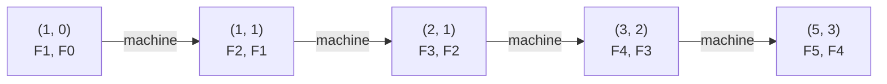
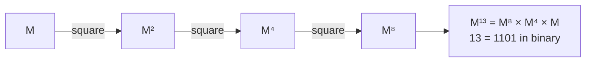
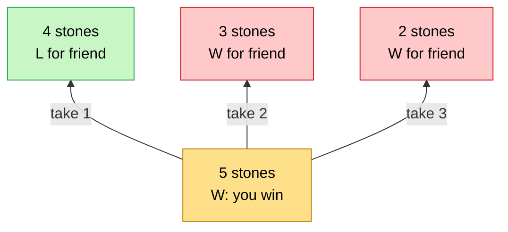
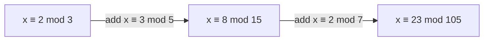
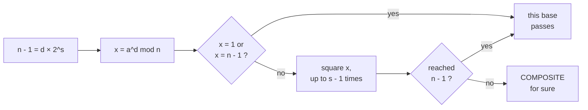
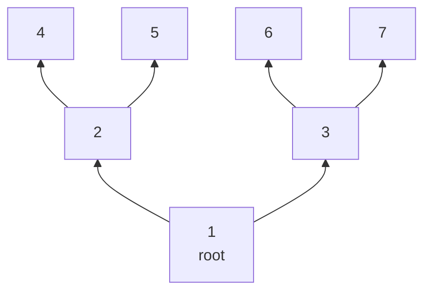

# 18 · Advanced Extras

> After this chapter you can recognise the rare "advanced maths" problems — huge-n recurrences, two-player
> games, coprime counting, remainder puzzles, prime tests for 64-bit numbers and graph counting — and know
> exactly which tool to reach for.

⬅️ [17 · Mixed Practice](../17-mixed-practice/) · 🏠 [Roadmap](../README.md)

> 🎁 **Bonus chapter.** Chapters 01–17 cover what FAANG interviews ask again and again. This chapter is
> for the rare hard problems and for follow-up questions like *"and what if n is 10¹⁸?"*.
> Do it after chapter 17.

## Contents

1. [Why this matters for DSA](#1-why-this-matters-for-dsa)
2. [Matrix power](#2-matrix-power)
3. [Game theory basics](#3-game-theory-basics)
4. [Euler's totient](#4-eulers-totient)
5. [The Chinese remainder theorem](#5-the-chinese-remainder-theorem)
6. [The Miller-Rabin prime test](#6-the-miller-rabin-prime-test)
7. [Graph counting facts](#7-graph-counting-facts)
8. [Java code](#8-java-code)
9. [Common mistakes](#9-common-mistakes)
10. [Interview patterns](#10-interview-patterns)
11. [Exercises](#11-exercises)
12. [One-minute recap](#12-one-minute-recap)

---

## 1. Why this matters for DSA

Each tool in this chapter solves a problem that the basic chapters **cannot** solve fast enough:

| Tool | The problem it solves | Without it |
|---|---|---|
| Matrix power | the n-th term of a recurrence like Fibonacci for n = 10¹⁸ | a loop of 10¹⁸ steps — centuries |
| Game theory | "both players play perfectly — who wins?" | trying every game — exponential |
| Euler's totient | "how many numbers up to n share no factor with n?", huge exponents | checking gcd one by one |
| Chinese remainder theorem | "a number leaves remainder 2 by 3, 3 by 5 and 2 by 7 — which?" | guessing |
| Miller–Rabin | "is this 18-digit number prime?" | trial division: 10⁹ steps per number |
| Graph counting facts | "is this graph a tree?", "how many edges at most?" | wrong complexity estimates |

They build directly on earlier chapters: fast power (11), GCD (10), primes (09), XOR (12), counting (13)
and induction (16).

---

## 2. Matrix power

### A machine for the next step

🏭 Think of Fibonacci as a machine. You feed it **today's pair** (F(n+1), F(n)); it gives back
**tomorrow's pair** (F(n+2), F(n+1)), because F(n+2) = F(n+1) + F(n):



The machine is a **matrix** — a small grid of numbers. Multiplying a matrix by a pair means:
**each row times the pair, multiply matching numbers and add**:

```text
 | 1  1 |     | F(n+1) |     | 1 × F(n+1) + 1 × F(n) |     | F(n+2) |
 |      |  ×  |        |  =  |                       |  =  |        |
 | 1  0 |     | F(n)   |     | 1 × F(n+1) + 0 × F(n) |     | F(n+1) |
```

Running the machine n times means multiplying by the matrix n times — that is the **matrix to the power n**.
And it turns out:

```text
 | 1  1 | ^ n       | F(n+1)   F(n)   |
 |      |       =   |                 |           for every n >= 1
 | 1  0 |           | F(n)     F(n-1) |
```

*Why?* It is true for n = 1 (the matrix itself is [[F2, F1], [F1, F0]] = [[1, 1], [1, 0]]), and multiplying
once more by the matrix moves every Fibonacci number one step forward — the domino idea of induction
(chapter [16](../16-logic-sets-and-proofs/)).

### Multiplying two matrices

Each entry of the answer is **a row of the left matrix times a column of the right matrix**:

```text
 | 1  1 |   | 1  1 |   | 1×1 + 1×1   1×1 + 1×0 |   | 2  1 |
 |      | × |      | = |                       | = |      |   = [[F3, F2], [F2, F1]]
 | 1  0 |   | 1  0 |   | 1×1 + 0×1   1×1 + 0×0 |   | 1  1 |
```

### Fast power, again

Raising a matrix to the power n uses the **same squaring trick** as fast power for numbers (chapter
[11](../11-modular-arithmetic/)): square, square, square, and multiply in the squares you need.



So F(n) needs only about **2 × log₂ n** matrix multiplications. A 2 × 2 multiplication is 8 number
multiplications, so the whole thing is **O(log n)**. For a recurrence that remembers k values you need a
k × k matrix: **O(k³ log n)**. Real counts from the Java file:

```text
   F(10) = 55   loop agrees: true   matrix multiplications: 5
   F(50) = 12,586,269,025   loop agrees: true   matrix multiplications: 8
   F(90) = 2,880,067,194,370,816,120   loop agrees: true   matrix multiplications: 10
   F(1,000,000) mod 1e9+7 = 918091266   (26 matrix multiplications)
   F(1,000,000,000,000,000,000) mod 1e9+7 = 209783453   (83 matrix multiplications)
```

The 10¹⁸-th Fibonacci number (mod 10⁹ + 7) in **83** small multiplications! 🚀 (Take the mod after every
multiplication: entries stay below 10⁹ + 7, so a product of two fits in a `long`.)

### Any recurrence with fixed coefficients

**Tribonacci** (LeetCode 1137): T(n) = T(n − 1) + T(n − 2) + T(n − 3). The state now has three numbers,
so the machine is 3 × 3:

```text
 | T(n+3) |     | 1  1  1 |     | T(n+2) |
 | T(n+2) |  =  | 1  0  0 |  ×  | T(n+1) |        the first row makes the new number,
 | T(n+1) |     | 0  1  0 |     | T(n)   |        the other rows just shift the old ones
```

In general, if G(n) = a × G(n − 1) + b × G(n − 2), the matrix is **[[a, b], [1, 0]]**.

🧠 **How to think of it yourself:** ask *"is the next value always the same **fixed** mix of the last k
values?"* If yes, and n is huge (10⁹ or more), build the k × k matrix and use fast power. For n up to
about 10⁷, a plain loop is simpler and just as good.

---

## 3. Game theory basics

Interview games are usually **fair and simple**: two perfect players take turns, both have the same moves,
there is no luck, and someone must win. The question is always *"who wins?"*

### Winning and losing positions

Call a position **W** (winning) if the player whose turn it is can force a win, and **L** (losing) if
they can't. Two golden rules decide everything:

> 1. A position is **W** if **at least one** move leads to an **L** position (give your friend a loser).
> 2. A position is **L** if **every** move leads to a **W** position — or there is no move at all.

**The take-away game:** a pile of stones; each turn you take 1, 2 or 3 stones; whoever takes the last stone
wins. With 0 stones and no move, the player to move has already lost, so 0 is L. Fill the table from the
bottom up, like DP:

```text
   stones:   0  1  2  3  4  5  6  7  8  9 10 11 12 13 14 15 16
   result:   L  W  W  W  L  W  W  W  L  W  W  W  L  W  W  W  L
```

With 5 stones, which move wins? The move tree (root at the bottom!) shows it — take 1 and leave your friend
the losing 4:



The pattern is clear: **multiples of 4 lose**. That is LeetCode 292 *Nim Game*: `return n % 4 != 0;`.
*Why?* If n is a multiple of 4 and you take t stones, your friend takes 4 − t. The pile stays a multiple
of 4 after every pair of turns, and finally you face 0.

### Nim with many piles: the XOR rule

Several piles; on your turn take any number of stones from **one** pile; the last stone wins. The rule
(using XOR from chapter [12](../12-bits-and-binary/)):

> The player to move **loses** exactly when the **XOR of all pile sizes is 0**.

```text
 piles [3, 4, 5]:        3 = 011
                         4 = 100
                         5 = 101
                       xor = 010  = 2, not 0  -> the first player wins

 winning move: change 3 into 3 xor 2 = 1  ->  [1, 4, 5]:  001 xor 100 xor 101 = 000
```

*Why does it work?*

- **From XOR 0, every move breaks it:** changing one pile changes its bits, so the XOR becomes non-zero.
- **From XOR ≠ 0, you can always fix it:** take the highest 1-bit of the XOR. Some pile has that bit;
  replace that pile p by p xor x — that removes the bit, so it is **smaller** (a legal move) and makes the
  XOR 0.
- The end (all piles empty) has XOR 0 and the player to move there has lost. So whoever faces XOR 0 keeps
  facing XOR 0 and loses.

### Two more classics

- **Divisor Game** (LeetCode 1025): replace n by n − x where x divides n, 0 < x < n. The first player wins
  **exactly when n is even**: from even n take 1 and give an odd number back; odd numbers have only odd
  divisors, so odd − odd hands an **even** number back to you; 1 is odd and has no move.
- **Stone Game** (LeetCode 877): an even number of piles in a row, take from either end. The first player
  **always** wins: colour the piles by position (odd places, even places); you can always take all piles
  of one colour, so just take the colour with the bigger sum.

When no pattern appears, compute the best **score difference** with DP (LeetCode 486 *Predict the Winner*):
`diff[i][j] = max(nums[i] - diff[i+1][j], nums[j] - diff[i][j-1])` — "my pick minus what my friend then
wins by".

📌 For sums of different games, each position gets a **Grundy number** and you XOR them (the
Sprague–Grundy theorem). That is contest territory — good to know the name.

---

## 4. Euler's totient

### Counting the strangers

**φ(n)** ("phi of n") counts the numbers from 1 to n that share **no common factor** with n —
that is, gcd(k, n) = 1 (chapter [10](../10-gcd-and-lcm/)). For n = 12:

```text
 k:          1  2  3  4  5  6  7  8  9 10 11 12
 gcd(k, 12): 1  2  3  4  1  6  1  4  3  2  1 12
 coprime:    ^           ^     ^           ^           ->  phi(12) = 4
```

### The formula, and why it works

> **φ(n) = n × (1 − 1/p₁) × (1 − 1/p₂) × …** over the **different** primes p that divide n.

For 12 = 2² × 3: half of the numbers are multiples of 2 — remove them; of what is left, a third are
multiples of 3 — remove those too: 12 × ½ × ⅔ = **4** ✅. (Removing multiples of each prime is the
inclusion–exclusion idea of chapter [13](../13-counting-and-combinatorics/).)

| n | prime recipe | φ(n) |
|---|---|---|
| a prime p | p | **p − 1** (everything below p) |
| p^k | p^k | **p^k − p^(k−1)** (remove the multiples of p) |
| 12 | 2² × 3 | 12 × ½ × ⅔ = 4 |
| 36 | 2² × 3² | 36 × ½ × ⅔ = 12 |
| 100 | 2² × 5² | 100 × ½ × ⅘ = 40 |
| 10⁹ + 7 | prime | 10⁹ + 6 |

In code: factorize n in O(√n) exactly like chapter [09](../09-prime-numbers/), and for each new prime p do
`result -= result / p`. For all numbers up to n, use a sieve that does the same for every multiple of p.

### Euler's theorem: Fermat for any modulus

> If gcd(a, m) = 1, then **a^φ(m) ≡ 1 (mod m)**.

For a prime m = p this is exactly Fermat's little theorem from chapter 11 (φ(p) = p − 1). Two uses:

- **Inverse for any modulus:** a × a^(φ(m) − 1) ≡ 1, so the inverse of a is a^(φ(m) − 1) mod m.
  Example: φ(10) = 4, so the inverse of 3 mod 10 is 3³ mod 10 = 7 (and 3 × 7 = 21 ≡ 1 ✅).
- **Shrinking huge exponents:** a^e ≡ a^(e mod φ(m)) (mod m). Example: 7²²² mod 10 → 222 mod 4 = 2 →
  7² = 49 → **9**.

### Counting fractions (LeetCode 1447)

How many fractions p/q with 0 < p < q ≤ n are already in lowest terms? For denominator q they are exactly
the numerators coprime to q — φ(q) of them:

```text
 q = 2:  1/2                  phi(2) = 1
 q = 3:  1/3  2/3             phi(3) = 2
 q = 4:  1/4  3/4             phi(4) = 2      (2/4 is not in lowest terms)
                              total for n = 4:  5
```

So the answer is φ(2) + φ(3) + … + φ(n): **5** for n = 4 and **3,043** for n = 100.

---

## 5. The Chinese remainder theorem

### An ancient puzzle

About 1,600 years ago, the Chinese mathematician Sunzi asked: *"There are some things. Counted by threes,
2 are left. Counted by fives, 3 are left. Counted by sevens, 2 are left. How many things are there?"*

The kid way: list the numbers with remainder 2 by 7 and test the others:

```text
 x = 2 (mod 7):   2    9   16   23   30   37 ...
 x mod 5:         2    4    1    3 <- need 3
 x mod 3:         2    0    1    2 <- need 2        ->  23 works!
```

### Why there is exactly one answer

Look at the numbers 0 … 14 and their remainders by 3 and by 5 — **every pair appears exactly once**:

```text
              x mod 5 = 0   1   2   3   4
   x mod 3 = 0:         0   6  12   3   9
   x mod 3 = 1:        10   1   7  13   4
   x mod 3 = 2:         5  11   2   8  14
```

*Why?* If two numbers x and y from 0 … 14 had the same remainders by 3 **and** by 5, then 3 and 5 would both
divide x − y. Because 3 and 5 share no factor, **15** would divide x − y — impossible for two different
numbers below 15. So the 15 numbers give 15 **different** pairs, which is all the 3 × 5 = 15 pairs.

> **Chinese remainder theorem:** if m₁, m₂, …, mₖ are pairwise coprime, the remainders
> x mod m₁, …, x mod mₖ fix x **exactly once** in 0 … M − 1, where M = m₁ × m₂ × … × mₖ.

### Solving it step by step

Merge one condition at a time, using a modular inverse (extended Euclid, chapter [10](../10-gcd-and-lcm/)):



```text
 step 1:  x = 2 + 3t.   2 + 3t = 3 (mod 5)   ->  3t = 1 (mod 5)   ->  t = 2  ->  x = 8
          so x = 8 (mod 15)
 step 2:  x = 8 + 15u.  8 + 15u = 2 (mod 7)  ->  15u = 1 (mod 7)  ->  u = 1  ->  x = 23
          so x = 23 (mod 105)
```

Where it helps: combining answers computed modulo different primes, and "when do these repeating cycles
line up?" puzzles. If the moduli are **not** coprime, there may be no answer — check that the gcd divides
the difference of the remainders.

---

## 6. The Miller-Rabin prime test

### The problem

Is 1,000,000,000,000,000,003 prime? Trial division needs up to √n = 10⁹ divisions (chapter
[09](../09-prime-numbers/)) — several seconds for **one** number. We need something like O(log n).

### Fermat's idea, and the liars

From chapter [11](../11-modular-arithmetic/): if n is prime, then a^(n−1) ≡ 1 (mod n) for every a that is
not a multiple of n. So if a^(n−1) mod n ≠ 1, n is **surely composite**. But some composite numbers pass
anyway — the **Carmichael numbers**. The smallest one is 561 = 3 × 11 × 17:

```text
   Fermat test with a = 2 says 561 is prime: true   (but 561 = 3 x 11 x 17)
```

### Miller–Rabin's extra check

For a prime n, the only numbers whose square is 1 (mod n) are **1** and **n − 1**. Miller–Rabin checks
that on the way to a^(n−1):

1. Write n − 1 = d × 2^s with d odd.
2. Compute x = a^d mod n. If x is 1 or n − 1, this base passes.
3. Otherwise square x up to s − 1 times. If you ever hit n − 1, it passes.
4. If not, you found a "fake square root of 1" — **n is composite**, guaranteed.



On 561: 560 = 35 × 2⁴, and 2³⁵ mod 561 = 263. Squaring gives 263 → 166 → 67 → 1: it reached 1 from 67,
not from 560, so **561 is composite**:

```text
   Miller-Rabin on 561: 560 = 35 x 2^4, so look at 2^35 mod 561 and square it:
   263 -> 166 -> 67 -> 1  (never 560)
```

**Which bases?** Testing a = 2, 3, 5, 7, 11, 13, 17, 19, 23, 29, 31 and 37 gives the **right answer for every
`long`** (every n below 3.3 × 10²⁴). That is 12 × about 64 squarings — instant.

⚠️ a × b for numbers near 10¹⁸ overflows a `long`, so the multiply-mod step needs care (the Java file uses
`BigInteger` for it). And in real Java code you can simply call `BigInteger.valueOf(n).isProbablePrime(50)`.

---

## 7. Graph counting facts

A few counting facts make graph problems (and their complexities) much easier.

### The handshake rule

Every edge has **two** ends, so adding up all degrees counts every edge twice:

> **sum of all degrees = 2 × number of edges**

So the number of nodes with an **odd** degree is always **even** (odd numbers must pair up to make an even
total). Example with 5 edges:

```text
   handshake: 5 edges, degrees [2, 2, 3, 2, 1]
   degree sum = 10 = 2 x 5, odd-degree nodes: 2
```

### How many edges can there be?

| Graph | Maximum edges | Why |
|---|---|---|
| undirected, n nodes | n(n − 1)/2 | every pair once (chapter [05](../05-sums-and-series/)) |
| directed, n nodes | n(n − 1) | every ordered pair |
| directed acyclic graph (DAG) | n(n − 1)/2 | only "left to right" in a topological order |
| grid with R rows and C columns (4 neighbours) | R(C − 1) + C(R − 1) | edges inside each row and each column |
| tree with n nodes | exactly n − 1 | see below |

A complete graph on 100,000 nodes has 4,999,950,000 edges — so an algorithm that looks at "all pairs" is too
slow, but BFS/DFS on a sparse graph is O(V + E). A 1000 × 1000 grid has only 1,998,000 edges.

### Trees have n minus 1 edges

A tree is a connected graph with no cycle. Build it one node at a time: the first node needs no edge, and
every new node needs **exactly one** edge to join. So n nodes → **n − 1 edges**. A tree with 7 nodes
(root at the bottom, like all trees in this course):



7 nodes, 6 edges. Useful consequences:

- A graph with n nodes and **n − 1 edges that is connected** is a tree (LeetCode 261 *Graph Valid Tree*).
- Adding **one** edge to a tree creates **exactly one** cycle — union–find finds that edge (LeetCode 684
  *Redundant Connection*).
- A binary tree with n nodes has **n + 1 empty child slots** (null pointers): there are 2n slots and n − 1 of
  them hold edges.
- A **perfect** binary tree with h + 1 levels has 2^(h+1) − 1 nodes (chapter [04](../04-logarithms/)).

Fun fact: there are **n^(n−2)** different trees on n labelled nodes (Cayley's formula): 1, 3, 16, 125,
1,296 for n = 2 … 6.

---

## 8. Java code

The file [`AdvancedExtras.java`](AdvancedExtras.java) has every tool of this chapter. The key methods:

```java
// Fast power for matrices: the same squaring trick as fast power for numbers.
static long[][] power(long[][] m, long exponent, long mod) {
    long[][] result = identity(m.length);
    long[][] base = m;
    while (exponent > 0) {
        if ((exponent & 1) == 1) {
            result = multiply(result, base, mod);
        }
        exponent >>= 1;
        if (exponent > 0) {                 // skip the last square: it is never used
            base = multiply(base, base, mod);
        }
    }
    return result;
}

// A winning move in Nim: make the XOR of all piles 0.
static int[] nimWinningMove(int[] piles) {
    int x = nimSum(piles);
    if (x == 0) {
        return null;
    }
    for (int i = 0; i < piles.length; i++) {
        int target = piles[i] ^ x;
        if (target < piles[i]) {
            return new int[] {i, target};
        }
    }
    return null;
}

// phi(n) = n × (1 - 1/p) for every distinct prime p of n. O(sqrt(n)).
static long phi(long n) {
    long result = n;
    for (long p = 2; p * p <= n; p++) {
        if (n % p == 0) {
            while (n % p == 0) {
                n /= p;
            }
            result -= result / p;           // result = result × (1 - 1/p)
        }
    }
    if (n > 1) {
        result -= result / n;               // one prime bigger than sqrt is left
    }
    return result;
}

// One Miller-Rabin round: false means "a proves n is composite".
static boolean passesRound(long n, long a, long d, int s) {
    long x = powMod(a, d, n);
    if (x == 1 || x == n - 1) {
        return true;
    }
    for (int r = 1; r < s; r++) {
        x = mulMod(x, x, n);
        if (x == n - 1) {
            return true;
        }
    }
    return false;
}
```

### Run it

```text
cd maths_for_dsa/18-advanced-extras
java AdvancedExtras.java
```

Output:

```text
1) Matrix power: Fibonacci with [[1,1],[1,0]]^n
   F(10) = 55   loop agrees: true   matrix multiplications: 5
   F(50) = 12,586,269,025   loop agrees: true   matrix multiplications: 8
   F(90) = 2,880,067,194,370,816,120   loop agrees: true   matrix multiplications: 10
   F(1,000,000) mod 1e9+7 = 918091266   (26 matrix multiplications)
   F(1,000,000,000,000,000,000) mod 1e9+7 = 209783453   (83 matrix multiplications)
   Tribonacci (LeetCode 1137): T(25) = 1389537, T(37) = 2082876103

2) Games: take 1, 2 or 3 stones; the last stone wins
   (W = the player to move can win, L = the player to move loses)
   stones:   0  1  2  3  4  5  6  7  8  9 10 11 12 13 14 15 16
   result:   L  W  W  W  L  W  W  W  L  W  W  W  L  W  W  W  L
   Nim [3, 4, 5]     xor =  2 -> first player WINS: make pile 1 size 1
   Nim [1, 2, 3]     xor =  0 -> every move loses: first player LOSES
   Nim [7, 7]        xor =  0 -> every move loses: first player LOSES
   Nim [1, 4, 9, 12] xor =  0 -> every move loses: first player LOSES
   Divisor Game (LeetCode 1025), n = 1..12: LWLWLWLWLWLW   (W exactly when n is even)
   Predict the Winner (LeetCode 486): [1, 5, 2] -> difference -2,  [1, 5, 233, 7] -> 222

3) Euler's totient phi(n): how many of 1..n share no factor with n
   phi(12) = 4 (counting: 4)
   phi(36) = 12 (counting: 12)
   phi(97) = 96 (counting: 96)
   phi(100) = 40 (counting: 40)
   phi(1,000) = 400 (counting: 400)
   phi(1,000,000,007) = 1,000,000,006
   Simplified Fractions (LeetCode 1447): n = 4 -> 5, n = 100 -> 3,043
   Euler's theorem: 3^phi(10) mod 10 = 3^4 mod 10 = 1
   so the inverse of 3 mod 10 = 3^(phi - 1) mod 10 = 7

4) Chinese remainder theorem
   x = 2 (mod 3), x = 3 (mod 5), x = 2 (mod 7)  ->  x = 23 (mod 105)
   every pair (x mod 3, x mod 5) happens exactly once for x = 0..14:
              x mod 5 = 0   1   2   3   4
   x mod 3 = 0:         0   6  12   3   9
   x mod 3 = 1:        10   1   7  13   4
   x mod 3 = 2:         5  11   2   8  14

5) Miller-Rabin: prime tests for huge numbers
   Fermat test with a = 2 says 561 is prime: true   (but 561 = 3 x 11 x 17)
   Miller-Rabin on 561: 560 = 35 x 2^4, so look at 2^35 mod 561 and square it:
   263 -> 166 -> 67 -> 1  (never 560)
                           561  prime: false  (Java's BigInteger agrees: true)
                 1,000,000,007  prime: true   (Java's BigInteger agrees: true)
                 4,759,123,141  prime: false  (Java's BigInteger agrees: true)
               999,999,999,989  prime: true   (Java's BigInteger agrees: true)
     1,000,000,000,000,000,003  prime: true   (Java's BigInteger agrees: true)
     2,305,843,009,213,693,951  prime: true   (Java's BigInteger agrees: true)

6) Graph counting facts
   handshake: 5 edges, degrees [2, 2, 3, 2, 1]
   degree sum = 10 = 2 x 5, odd-degree nodes: 2
   complete graph on 5 nodes: 10 edges
   complete graph on 100 nodes: 4,950 edges
   complete graph on 100,000 nodes: 4,999,950,000 edges
   tree on 3 nodes has 2 edges; the extra edge that closes a cycle: [2, 3]
   grid 3 x 4 has 17 edges, grid 1000 x 1000 has 1,998,000 edges
   labelled trees n^(n-2), n = 2..6: 1 3 16 125 1296
```

---

## 9. Common mistakes

1. **Using matrix power for small n.** For n up to about 10⁷ a loop is simpler and faster.
2. **Overflow in matrix multiplication.** Take the mod after every product; with entries below 10⁹ + 7 a
   product of two still fits in a `long`.
3. **Starting the matrix result at 0.** The starting "result" must be the **identity** matrix
   (1s on the diagonal), the matrix version of 1.
4. **Solving games top-down without memory.** Build the W/L table from the smallest position up, or memoize —
   otherwise it is exponential.
5. **Using the sum instead of the XOR in Nim.** [1, 2, 3] has sum 6 but XOR 0: the first player loses.
6. **Forgetting the leftover prime in φ(n)**, or that φ(1) = 1.
7. **Using Euler's theorem when gcd(a, m) ≠ 1.** It only holds for coprime a and m.
8. **Chinese remainder with moduli that share a factor.** Then check with the gcd; there may be no answer.
9. **Trusting the plain Fermat test.** Carmichael numbers like 561 fool it; Miller–Rabin does not.
10. **"n − 1 edges, so it's a tree."** It must also be connected (or have no cycle).

---

## 10. Interview patterns

| Pattern | How to recognise it | LeetCode problems |
|---|---|---|
| Huge-n linear recurrence | n up to 10⁹ or 10¹⁸, "mod 10⁹ + 7", the next value is a fixed mix of the last few | 509 Fibonacci Number (follow-up), 1137 N-th Tribonacci Number, 935 Knight Dialer, 552 Student Attendance Record II, 1220 Count Vowels Permutation |
| Simple two-player games | "both play optimally", "can the first player win?", a small rule | 292 Nim Game, 1025 Divisor Game, 877 Stone Game |
| General two-player games | "maximum score difference" with perfect play | 486 Predict the Winner, 1140 Stone Game II, 1406 Stone Game III |
| Coprime counting | "fractions in lowest terms", "gcd equal to 1" | 1447 Simplified Fractions |
| Huge exponents | a^b mod m with a gigantic b | 372 Super Pow |
| Trees and cycles | "n nodes and n − 1 edges", "which edge makes a cycle?" | 261 Graph Valid Tree, 684 Redundant Connection, 323 Number of Connected Components in an Undirected Graph |
| Degree counting | "degree", "every edge counts twice", "in-degree / out-degree" | 1791 Find Center of Star Graph, 997 Find the Town Judge, 1615 Maximal Network Rank |

---

## 11. Exercises

These are harder than usual — take your time. ✏️

### Level 1 · Warm-up

**1.** Multiply [[1, 1], [1, 0]] by itself.

<details>
<summary>Answer</summary>

**[[2, 1], [1, 1]]** — top-left 1×1 + 1×1 = 2, top-right 1×1 + 1×0 = 1, bottom-left 1×1 + 0×1 = 1,
bottom-right 1×1 + 0×0 = 1. That is [[F3, F2], [F2, F1]].

</details>

**2.** What is [[1, 1], [1, 0]]⁵?

<details>
<summary>Answer</summary>

**[[8, 5], [5, 3]]** — the pattern [[F(n+1), F(n)], [F(n), F(n−1)]] with n = 5: F6 = 8, F5 = 5, F4 = 3.

</details>

**3.** In the "take 1, 2 or 3 stones" game, is a pile of 8 winning or losing for the player to move?

<details>
<summary>Answer</summary>

**Losing** — 8 is a multiple of 4. Whatever you take (t), your friend takes 4 − t and leaves you 4, then 0.

</details>

**4.** Nim with piles [1, 2, 3]: does the first player win?

<details>
<summary>Answer</summary>

**No.** 1 xor 2 xor 3 = 01 xor 10 xor 11 = 00 = 0, so the player to move loses with perfect play.

</details>

**5.** What is φ(10)?

<details>
<summary>Answer</summary>

**4** — the numbers 1, 3, 7, 9 share no factor with 10. (Formula: 10 × ½ × ⅘ = 4.)

</details>

**6.** What is φ(13)?

<details>
<summary>Answer</summary>

**12** — 13 is prime, so every number from 1 to 12 is coprime with it: φ(p) = p − 1.

</details>

**7.** Find the smallest positive x with x ≡ 1 (mod 2) and x ≡ 2 (mod 3).

<details>
<summary>Answer</summary>

**5** — the odd numbers are 1, 3, 5, …; 5 mod 3 = 2. (It repeats every 2 × 3 = 6: 5, 11, 17, …)

</details>

**8.** How many edges does a tree with 10 nodes have?

<details>
<summary>Answer</summary>

**9** — a tree with n nodes always has n − 1 edges.

</details>

**9.** A graph has degrees [3, 3, 2, 2]. How many edges does it have?

<details>
<summary>Answer</summary>

**5** — the degrees add up to 10, and every edge is counted twice: 10 / 2 = 5.

</details>

### Level 2 · Practice

**10.** About how many matrix multiplications does fast power need for F(10¹⁸)?

<details>
<summary>Answer</summary>

log₂(10¹⁸) ≈ 60, so at most about 60 squarings + 60 multiplications ≈ **120**. The Java file counts
exactly **83** (59 squarings and 24 multiplications, one per 1-bit of 10¹⁸).

</details>

**11.** Write the 2 × 2 matrix for G(n) = 2 G(n − 1) + 3 G(n − 2).

<details>
<summary>Answer</summary>

**[[2, 3], [1, 0]]** — the first row makes the new value 2 × G(n−1) + 3 × G(n−2), the second row copies
G(n−1) down.

</details>

**12.** Nim with piles [3, 4, 5]: find the winning move.

<details>
<summary>Answer</summary>

The XOR is 2. Only the pile 3 gets smaller when XOR-ed with 2 (3 xor 2 = 1; 4 xor 2 = 6 and 5 xor 2 = 7
are bigger). So **take 2 stones from the first pile**, leaving [1, 4, 5] with XOR 0.

</details>

**13.** Divisor Game with n = 7: who wins?

<details>
<summary>Answer</summary>

**The second player.** 7 is odd; every divisor of an odd number is odd, so the first player must hand over
an even number, and even numbers win.

</details>

**14.** Compute φ(36) with the formula.

<details>
<summary>Answer</summary>

36 = 2² × 3², so φ(36) = 36 × ½ × ⅔ = **12**.

</details>

**15.** Compute φ(32).

<details>
<summary>Answer</summary>

32 = 2⁵, so φ(32) = 2⁵ − 2⁴ = **16** (all the odd numbers from 1 to 31).

</details>

**16.** Solve x ≡ 2 (mod 3) and x ≡ 3 (mod 5).

<details>
<summary>Answer</summary>

**x ≡ 8 (mod 15).** x = 2 + 3t; 2 + 3t ≡ 3 (mod 5) → 3t ≡ 1 → t ≡ 2 (because 3 × 2 = 6 ≡ 1) → x = 8.
Check: 8 mod 3 = 2 and 8 mod 5 = 3 ✅.

</details>

**17.** Why is 561 dangerous for the plain Fermat test?

<details>
<summary>Answer</summary>

561 = 3 × 11 × 17 is a **Carmichael number**: a⁵⁶⁰ ≡ 1 (mod 561) for **every** a coprime to 561, so the
Fermat test calls it prime although it is composite. Miller–Rabin catches it (2³⁵ → … → 1 without passing
through 560).

</details>

**18.** How many edges does a complete graph on 20 nodes have?

<details>
<summary>Answer</summary>

**190** — 20 × 19 / 2 (every pair of nodes once).

</details>

**19.** A binary tree has 50 nodes. How many of its child pointers are null?

<details>
<summary>Answer</summary>

**51** — there are 2 × 50 = 100 child slots, and 49 of them hold edges (a tree with 50 nodes has 49 edges):
100 − 49 = 51.

</details>

### Level 3 · Interview

**20.** *Nim Game* (LeetCode 292): prove that the first player loses exactly when n is a multiple of 4.

<details>
<summary>Answer</summary>

**If n = 4k:** whatever the first player takes (t = 1, 2 or 3), the second takes 4 − t. After each round the
pile is again a multiple of 4, so the second player takes the last stone. **If n is not a multiple of 4:**
the first player takes n mod 4 stones, leaving a multiple of 4 — now the first player is the one using the
"4 − t" strategy. So `return n % 4 != 0;`.

</details>

**21.** Explain both halves of the proof of the Nim XOR rule.

<details>
<summary>Answer</summary>

(1) **From XOR 0, every move gives XOR ≠ 0:** a move changes exactly one pile, and changing one number in
an XOR always changes the result. (2) **From XOR x ≠ 0, some move gives XOR 0:** take the highest 1-bit of
x; some pile p has that bit, so p xor x turns it off and is **smaller** than p — a legal move — and the new
XOR is x xor x = 0. The final position (all zeros) has XOR 0, so the player who always faces XOR 0 is the one
who faces the empty table and loses.

</details>

**22.** *Simplified Fractions* (LeetCode 1447): how many fractions in lowest terms are there for n = 6?

<details>
<summary>Answer</summary>

**11** = φ(2) + φ(3) + φ(4) + φ(5) + φ(6) = 1 + 2 + 2 + 4 + 2.

</details>

**23.** Use Euler's theorem to find 7²²² mod 10.

<details>
<summary>Answer</summary>

gcd(7, 10) = 1 and φ(10) = 4, so 7⁴ ≡ 1 (mod 10). 222 = 4 × 55 + 2, so 7²²² ≡ 7² = 49 ≡ **9**. (The same
as the "last digit cycle" 7, 9, 3, 1 from chapter 11.)

</details>

**24.** *Knight Dialer* (LeetCode 935) for n = 10⁹ jumps: why does a 10 × 10 matrix help, and what is the
complexity?

<details>
<summary>Answer</summary>

Let the state be "how many numbers end on digit 0, 1, …, 9" — 10 values. One knight jump turns this state
into the next one by a **fixed** rule (each digit collects the counts of the digits a knight can jump from),
so one jump is multiplying by a 10 × 10 matrix M. After n − 1 jumps the counts are M^(n−1) × [1, …, 1].
Fast power: **O(10³ × log n)** — about 60 matrix multiplications of 1,000 small steps each, so roughly
60,000 steps instead of 10⁹ loop rounds.

</details>

**25.** You must test 100,000 numbers, each up to 10¹⁸, for primality. Which method, and roughly how much
work?

<details>
<summary>Answer</summary>

**Miller–Rabin** with the 12 bases: each test is about 12 × 64 multiply-mods ≈ 800 steps, so the total is
about **10⁵ × 800 = 8 × 10⁷** — fine. Trial division would need up to 10⁵ × 10⁹ = 10¹⁴ divisions — impossible.

</details>

**26.** *Redundant Connection* (LeetCode 684): a tree with n nodes plus one extra edge. Why does
union–find find the extra edge?

<details>
<summary>Answer</summary>

A tree on n nodes has n − 1 edges, so with n edges exactly **one** cycle exists. Add edges one by one with
union–find: an edge whose two ends are **already connected** would close a cycle — that is the extra edge
(the problem asks for the last such edge in the input, which is the one union–find reports).

</details>

**27.** Prove that every graph has an even number of odd-degree nodes.

<details>
<summary>Answer</summary>

The degrees add up to 2 × (number of edges), which is **even**. The even degrees add up to an even number,
so the odd degrees must add up to an even number too — and a sum of odd numbers is even only when there is
an **even count** of them.

</details>

---

## 12. One-minute recap

- **Matrix power:** if the next value is a fixed mix of the last k values, put it in a k × k matrix and use
  fast power: O(k³ log n). [[1, 1], [1, 0]]ⁿ = [[F(n+1), F(n)], [F(n), F(n−1)]].
- **Games:** a position is **W** if one move reaches **L**, and **L** if every move reaches **W**. Build the
  table from the bottom. Take-1-to-3: multiples of 4 lose. Nim: the player to move loses when the **XOR** of
  the piles is 0.
- **Euler's totient:** φ(n) = n × Π(1 − 1/p). Euler's theorem a^φ(m) ≡ 1 (mod m) for coprime a, m —
  inverses for any modulus and smaller exponents.
- **Chinese remainder theorem:** pairwise coprime moduli fix x exactly once modulo their product; merge the
  conditions one by one with inverses.
- **Miller–Rabin:** n − 1 = d × 2^s, look for a fake square root of 1; the 12 bases 2 … 37 are exact for every
  `long`.
- **Graphs:** degree sum = 2E; at most n(n − 1)/2 edges; a tree has exactly n − 1 edges; a binary tree with n
  nodes has n + 1 null children.

🎉 That's the end of the course. Go back to the [roadmap](../README.md) and tick the last box — then put all
of it to work in [`dsa/`](../../dsa/).
