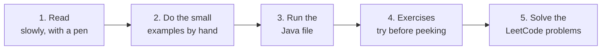
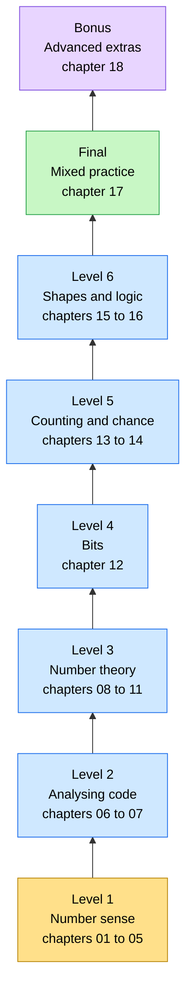
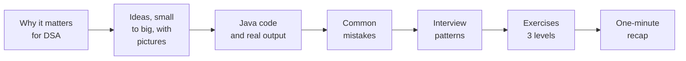

# Maths for DSA — from zero to FAANG

All the maths you need for **Data Structures & Algorithms** and **FAANG interviews**, in one place,
from the smallest idea to the biggest.

Every chapter explains the idea like you are ten years old 🧒, draws pictures 🖼️, shows Java code ☕,
and ends with lots of exercises 🏋️ — with the answers hidden, so you try first.

> 🎯 **The promise:** finish all 17 chapters *and their exercises*, and maths will never block you in a
> DSA problem or an interview again. Want to go further? The bonus chapter 18 covers the rare advanced tools.

## Contents

1. [How to use this course](#1-how-to-use-this-course)
2. [The roadmap](#2-the-roadmap)
3. [All chapters](#3-all-chapters)
4. [How every chapter looks](#4-how-every-chapter-looks)
5. [Study plan](#5-study-plan)
6. [Progress checklist](#6-progress-checklist)
7. [Cheat sheet](#7-cheat-sheet)

---

## 1. How to use this course

For **every** chapter, do these five things in order:



1. **Read** the chapter slowly. Every time you see a small example, redo it on paper.
2. **Run** the Java file and change the numbers to see what happens:
   ```text
   cd maths_for_dsa/04-logarithms
   java Logarithms.java
   ```
   (Any JDK 11 or newer works.)
3. **Exercises:** Level 1 by hand, Level 2 on paper or in code, Level 3 like a real interview —
   say your thinking out loud. Open an answer only **after** you have tried.
4. **Solve** the LeetCode problems listed in the chapter's *Interview patterns* table.
5. **Tick** the chapter in the [progress checklist](#6-progress-checklist).

🧠 **The golden rule:** don't just read — *do*. Your brain learns maths through your hands.
If an exercise feels hard, that's the feeling of your brain growing. 💪

---

## 2. The roadmap

Climb from the **bottom** to the **top** ⬆️. Every level stands on the levels below it.



The same ladder as plain text:

```text
   ▲  BONUS    18 Advanced extras (matrix power, games, totient, CRT, primes, graphs)
   │  FINAL    17 Mixed practice  (every tool together, mock interview)
   │  LEVEL 6  15 Geometry and grids · 16 Logic, sets and proofs
   │  LEVEL 5  13 Counting and combinatorics · 14 Probability and randomness
   │  LEVEL 4  12 Bits and binary
   │  LEVEL 3  08 Divisors · 09 Primes · 10 GCD and LCM · 11 Modular arithmetic
   │  LEVEL 2  06 Big-O and time complexity · 07 Recurrences
   │  LEVEL 1  01 Numbers · 02 Digits and bases · 03 Powers and roots · 04 Logs · 05 Sums
 start here — climb one step at a time
```

Why this order?

- **Level 1** gives you the words of maths: numbers, digits, powers, logs and sums.
- **Level 2** uses those words to answer the most-asked interview question:
  *"What is the time complexity of your code?"* — you need logs (04) and sums (05) for it.
- **Level 3** is classic number theory: divisors, the √n trick, primes, GCD and "mod 10⁹ + 7".
  Now you can also *prove* why the √n trick is fast, thanks to Level 2.
- **Levels 4 to 6** add bits, counting, probability, grids and proofs.
- **Final:** mixed drills, so you learn to pick the right tool by yourself.
- **Bonus:** rare advanced tools for hard problems and "what if n is 10¹⁸?" follow-ups.

---

## 3. All chapters

| # | Chapter | What you will learn | Unlocks problems like |
|---|---|---|---|
| 01 | [Numbers and Integer Division](01-numbers-and-integer-division/) | kinds of numbers, `int` and `long` limits, overflow, `/` and `%`, floor and ceil, even and odd, safe middle | Reverse Integer (7), Divide Two Integers (29) |
| 02 | [Digits and Number Bases](02-digits-and-number-bases/) | place value, taking digits apart with `% 10` and `/ 10`, reversing numbers, carries, base 2, 8, 16, base conversion, Excel columns | Palindrome Number (9), Add Binary (67), Excel Sheet Column Title (168) |
| 03 | [Powers and Roots](03-powers-and-roots/) | exponents and their rules, powers of 2 and 10, how fast doubling grows, squares, square roots, perfect squares, integer square root | Pow(x, n) (50), Sqrt(x) (69), Valid Perfect Square (367) |
| 04 | [Logarithms](04-logarithms/) | log as "how many halvings", log rules, log₂ table, digits and bits of a number, why binary search is O(log n) | Binary Search (704), First Bad Version (278) |
| 05 | [Sums and Series](05-sums-and-series/) | 1 + 2 + … + n, sum of squares, geometric and harmonic series, telescoping, prefix sums, counting pairs | Missing Number (268), Range Sum Query (303), Subarray Sum Equals K (560) |
| 06 | [Big-O and Time Complexity](06-big-o-time-complexity/) | how to **find** the time complexity of any code, step by step: loop patterns, hidden costs, space, amortized, constraints → allowed complexity | every problem you will ever solve |
| 07 | [Recurrences](07-recurrences/) | time complexity of recursion: T(n), unrolling, recursion trees (bottom to top), Master theorem, backtracking, stack space, memoization | Merge Sort (912), Climbing Stairs (70), Subsets (78) |
| 08 | [Divisors and the Square Root Trick](08-divisors-and-sqrt-trick/) | divisibility, divisors come in pairs, **why checking up to √n is enough**, perfect squares, counting multiples | The kth Factor of n (1492), Bulb Switcher (319) |
| 09 | [Prime Numbers](09-prime-numbers/) | primality test up to √n, 6k ± 1, Sieve of Eratosthenes, prime factorization, factor trees, trailing zeros of n! | Count Primes (204), Ugly Number (263), Factorial Trailing Zeroes (172) |
| 10 | [GCD and LCM](10-gcd-and-lcm/) | greatest common divisor, Euclid's algorithm and why it works, least common multiple, fractions, extended Euclid | GCD of Strings (1071), Water and Jug Problem (365) |
| 11 | [Modular Arithmetic](11-modular-arithmetic/) | clock maths, mod rules, negative mod in Java, why "mod 10⁹ + 7", fast power, modular inverse, circular arrays, hashing | Pow(x, n) (50), Subarray Sums Divisible by K (974) |
| 12 | [Bits and Binary](12-bits-and-binary/) | AND, OR, XOR, NOT, shifts, negative numbers in binary, bit tricks, XOR tricks, bitmasks for subsets | Single Number (136), Counting Bits (338), Power of Two (231) |
| 13 | [Counting and Combinatorics](13-counting-and-combinatorics/) | sum and product rules, factorial, permutations, combinations, Pascal's triangle, pigeonhole, inclusion–exclusion, Catalan numbers | Unique Paths (62), Pascal's Triangle (118), Unique BSTs (96) |
| 14 | [Probability and Randomness](14-probability-and-randomness/) | chance as a fraction, AND/OR rules, expected value, random numbers in Java, shuffling, reservoir sampling, weighted random | Shuffle an Array (384), Random Pick with Weight (528) |
| 15 | [Geometry and Grids](15-geometry-and-grids/) | coordinates, rows and columns, direction arrays, distances, slopes, rectangles, rotating and walking matrices | Number of Islands (200), Rotate Image (48), K Closest Points (973) |
| 16 | [Logic, Sets and Proofs](16-logic-sets-and-proofs/) | AND/OR/NOT, De Morgan, sets, proof by induction (the maths behind recursion faith), contradiction, invariants | Linked List Cycle (141), Majority Element (169) |
| 17 | [Mixed Practice](17-mixed-practice/) | mixed drills from every chapter, "which tool?" puzzles, and a mock maths interview round | everything together |
| 18 | [Advanced Extras](18-advanced-extras/) *(bonus)* | matrix power for huge n, game theory and Nim, Euler's totient, the Chinese remainder theorem, the Miller–Rabin prime test, graph counting facts | N-th Tribonacci Number (1137), Nim Game (292), Redundant Connection (684) |

🔗 This course pairs with the problems in [`dsa/`](../dsa/). For example, the
[Tower of Hanoi lesson](../dsa/recursion/tower-of-hanoi/) uses powers of two (03), recurrences (07)
and proof by induction (16).

---

## 4. How every chapter looks

Every chapter folder has a `README.md` (the lesson) and one Java file you can run.
Inside the lesson you always find the same parts, in the same order:



The exercises come in three levels:

| Level | What it feels like | How to do it |
|---|---|---|
| **Level 1 · Warm-up** | "I can follow the idea." | by hand, in a few minutes |
| **Level 2 · Practice** | "I can use the idea myself." | on paper or with a little code |
| **Level 3 · Interview** | "I can explain it to an interviewer." | out loud, as if on a whiteboard |

Every answer hides behind a **▶ Answer** button — click it only after you have tried. 🙈

---

## 5. Study plan

About one hour a day. Go slower if you need to — understanding beats speed.

| Week | Chapters | Goal at the end of the week |
|---|---|---|
| 1 | 01, 02, 03 | You never fear overflow, digits or big powers again. |
| 2 | 04, 05 | You can say "that's log n" or "that's n²/2" just by looking at a loop. |
| 3 | 06, 07 | You can find the time and space complexity of any loop or recursion. |
| 4 | 08, 09, 10 | You can list divisors in O(√n), test primes, sieve, and use GCD. |
| 5 | 11, 12 | You are comfortable with "mod 10⁹ + 7", fast power and bit tricks. |
| 6 | 13, 14 | You can count arrangements and reason about chance. |
| 7 | 15, 16, 17 | You can handle grids and proofs, and you pass the mixed mock round. |
| 8 (optional) | 18 | You know the rare advanced tools and when a hard problem needs them. |

💡 Keep solving `dsa/` problems at the same time — each chapter tells you which problems use its maths.

---

## 6. Progress checklist

Edit this file and change `[ ]` to `[x]` when you finish a chapter *and* its exercises.

- [ ] 01 · [Numbers and Integer Division](01-numbers-and-integer-division/)
- [ ] 02 · [Digits and Number Bases](02-digits-and-number-bases/)
- [ ] 03 · [Powers and Roots](03-powers-and-roots/)
- [ ] 04 · [Logarithms](04-logarithms/)
- [ ] 05 · [Sums and Series](05-sums-and-series/)
- [ ] 06 · [Big-O and Time Complexity](06-big-o-time-complexity/)
- [ ] 07 · [Recurrences](07-recurrences/)
- [ ] 08 · [Divisors and the Square Root Trick](08-divisors-and-sqrt-trick/)
- [ ] 09 · [Prime Numbers](09-prime-numbers/)
- [ ] 10 · [GCD and LCM](10-gcd-and-lcm/)
- [ ] 11 · [Modular Arithmetic](11-modular-arithmetic/)
- [ ] 12 · [Bits and Binary](12-bits-and-binary/)
- [ ] 13 · [Counting and Combinatorics](13-counting-and-combinatorics/)
- [ ] 14 · [Probability and Randomness](14-probability-and-randomness/)
- [ ] 15 · [Geometry and Grids](15-geometry-and-grids/)
- [ ] 16 · [Logic, Sets and Proofs](16-logic-sets-and-proofs/)
- [ ] 17 · [Mixed Practice](17-mixed-practice/)
- [ ] 18 · [Advanced Extras](18-advanced-extras/) *(bonus)*

---

## 7. Cheat sheet

The most important facts of the whole course on one page. Each line is explained in its chapter.

```text
NUMBERS (01)
  int    -2,147,483,648 .. 2,147,483,647      about ±2.1 × 10^9   (2^31 − 1)
  long   about ±9.2 × 10^18                                         (2^63 − 1)
  Java / cuts toward zero:   7 / 2 = 3     -7 / 2 = -3
  Java % keeps a's sign:    -7 % 3 = -1    Math.floorMod(-7, 3) = 2
  ceil(a / b) for a >= 0, b > 0   =  (a + b - 1) / b
  safe middle:  mid = lo + (hi - lo) / 2

DIGITS AND BASES (02)
  last digit = n % 10          remove last digit = n / 10
  digits of n (n >= 1) = floor(log10 n) + 1
  "d2 d1 d0" in base b  =  d2 × b² + d1 × b + d0

POWERS AND LOGS (03, 04)
  2^10 = 1024 ≈ 10^3     2^20 ≈ 10^6     2^30 ≈ 10^9     2^60 ≈ 10^18
  log_b(x) = y   means   b^y = x          log2(n) = how many times n halves to 1
  log(a × b) = log a + log b      log(a / b) = log a − log b      log(a^k) = k × log a
  log_b(x) = log(x) / log(b)      so the base of a log does not matter in Big-O
  bits needed for n (n >= 1) = floor(log2 n) + 1

SUMS (05)
  1 + 2 + ... + n              = n(n + 1) / 2
  1² + 2² + ... + n²           = n(n + 1)(2n + 1) / 6
  1 + 2 + 4 + ... + 2^k        = 2^(k+1) − 1        (less than twice the last term)
  1 + 1/2 + 1/3 + ... + 1/n    ≈ ln n               (grows very slowly)
  pairs among n things         = n(n − 1) / 2

COMPLEXITY (06, 07)
  O(1) < O(log n) < O(√n) < O(n) < O(n log n) < O(n²) < O(n³) < O(2^n) < O(n!)
  a computer does about 10^8 simple steps per second
  n <= 10: n!    n <= 20: 2^n    n <= 500: n³    n <= 5000: n²
  n <= 10^6: n log n    n <= 10^12: √n    n <= 10^18: log n
  T(n) = T(n/2) + 1  → log n       T(n) = 2T(n/2) + n → n log n
  T(n) = T(n-1) + n  → n²          T(n) = 2T(n-1) + 1 → 2^n

NUMBER THEORY (08 - 11)
  divisors come in pairs (d, n/d)  →  only try d while d × d <= n   →  O(√n)
  n is prime  ⇔  n >= 2 and no d from 2 to √n divides n
  sieve of Eratosthenes: all primes up to n in O(n log log n)
  n = p1^a1 × p2^a2 × ...   →   number of divisors = (a1 + 1)(a2 + 1)...
  gcd(a, b) = gcd(b, a % b),  gcd(a, 0) = a         O(log min(a, b)) steps
  lcm(a, b) = a / gcd(a, b) × b                      (divide first: no overflow)
  (a + b) % m = (a % m + b % m) % m       the same works for × (and for − if you add m)
  inverse of a mod a prime p  =  a^(p − 2) % p       (fast power: O(log p))

BITS (12)
  x & (x - 1)   removes the lowest 1-bit        x & -x   keeps only the lowest 1-bit
  x is a power of two  ⇔  x > 0 and (x & (x - 1)) == 0
  a ^ a = 0     a ^ 0 = a     → equal pairs cancel out
  all subsets of n items  ↔  masks 0 .. 2^n − 1

COUNTING AND CHANCE (13, 14)
  arrange n things: n!           choose k of n: C(n, k) = n! / (k! × (n − k)!)
  subsets: 2^n                   grid paths with r rights and d downs: C(r + d, r)
  Catalan numbers 1, 1, 2, 5, 14, 42, 132 ...  =  C(2n, n) / (n + 1)
  P(not A) = 1 − P(A)            independent:  P(A and B) = P(A) × P(B)
  expected value  E[X] = Σ value × probability,      E[X + Y] = E[X] + E[Y]

GEOMETRY (15)
  Manhattan distance = |x1 − x2| + |y1 − y2|
  Euclidean distance = sqrt((x1 − x2)² + (y1 − y2)²)   → compare squared distances instead
  cell (r, c) in a grid with C columns  ↔  index r × C + c

ADVANCED EXTRAS (18, bonus)
  [[1,1],[1,0]]^n = [[F(n+1), F(n)], [F(n), F(n-1)]]    k x k matrix power: O(k^3 log n)
  game: W if some move reaches L, L if every move reaches W     Nim: lose  ⇔  xor = 0
  phi(n) = n × (1 - 1/p) for each prime p of n      a^phi(m) = 1 (mod m) if gcd(a, m) = 1
  coprime moduli: x mod m1, ..., x mod mk fix x exactly once modulo m1 × ... × mk
  Miller-Rabin with bases 2, 3, 5, ..., 37 is exact for every long
  degree sum = 2 × edges      tree: n - 1 edges      at most n(n - 1)/2 edges
```

Now go to [chapter 01](01-numbers-and-integer-division/) and start climbing! 🚀
