# FO559 · Neuroscientist's Guide To 10X Your Focus and Memory

> Dr Sahar Yousef (cognitive neuroscientist, UC Berkeley) talks with Raj Shamani on the *Figuring Out* podcast.
> The **whole conversation as it happens in the video**, with the important parts in 🟡 **yellow** and my own
> research notes in 🔵 **blue**.

🏠 [All podcast notes](../README.md) · ▶️ [Watch on YouTube](https://www.youtube.com/watch?v=4Vz6L8B73i4) · ⏱️ 2 h 55 min

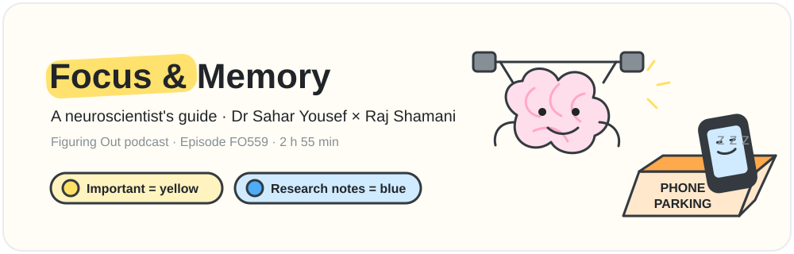

## Contents

- [How to read this page](#how-to-read-this-page)
- [The episode at a glance](#the-episode-at-a-glance)
- **The conversation**
  - [1. Intro](#1-intro) · 0:00
  - [2. Who is Dr Sahar Yousef](#2-who-is-dr-sahar-yousef) · 3:16
  - [3. The biology of brain focus and motivation](#3-the-biology-of-brain-focus-and-motivation) · 5:50
  - [4. The billionaire brain and why ultra-achievers feel limitless](#4-the-billionaire-brain-and-why-ultra-achievers-feel-limitless) · 9:19
  - [5. How to rewire your identity and change your beliefs](#5-how-to-rewire-your-identity-and-change-your-beliefs) · 14:09
  - [6. Why vague goals fail and how if-then plans and tiny habits help](#6-why-vague-goals-fail-and-how-if-then-plans-and-tiny-habits-help) · 26:59
  - [7. The psychology of addiction and breaking bad habits](#7-the-psychology-of-addiction-and-breaking-bad-habits) · 32:12
  - [8. The science of breaks and how to rest and recover](#8-the-science-of-breaks-and-how-to-rest-and-recover) · 42:13
  - [9. Digital hygiene and why your phone kills productivity](#9-digital-hygiene-and-why-your-phone-kills-productivity) · 50:32
  - [10. Why your brain cannot multitask](#10-why-your-brain-cannot-multitask) · 1:03:53
  - [11. Mind-wandering creativity and shower thoughts](#11-mind-wandering-creativity-and-shower-thoughts) · 1:18:42
  - [12. Long-form vs short-form and how content affects your brain](#12-long-form-vs-short-form-and-how-content-affects-your-brain) · 1:28:42
  - [13. Why scrolling makes you forget and feel lonely](#13-why-scrolling-makes-you-forget-and-feel-lonely) · 1:37:21
  - [14. The brain chemistry behind social media addiction](#14-the-brain-chemistry-behind-social-media-addiction) · 1:48:35
  - [15. Brain map 101 with CEN DMN amygdala and hippocampus](#15-brain-map-101-with-cen-dmn-amygdala-and-hippocampus) · 1:53:45
  - [16. The truth about the 5 AM club and your body clock](#16-the-truth-about-the-5-am-club-and-your-body-clock) · 2:03:33
  - [17. Chronotypes and finding your peak performance hours](#17-chronotypes-and-finding-your-peak-performance-hours) · 2:11:32
  - [18. Burnout vs stress and how to complete the stress cycle](#18-burnout-vs-stress-and-how-to-complete-the-stress-cycle) · 2:23:03
  - [19. The 3M framework of micro meso and macro breaks](#19-the-3m-framework-of-micro-meso-and-macro-breaks) · 2:28:03
  - [20. Her 9-week study on reversing loneliness and attention loss](#20-her-9-week-study-on-reversing-loneliness-and-attention-loss) · 2:35:00
  - [21. Can cognitive results be faked](#21-can-cognitive-results-be-faked) · 2:43:45
  - [22. When she felt the most powerless](#22-when-she-felt-the-most-powerless) · 2:47:00
  - [23. The cost she paid to become Sahar Yousef](#23-the-cost-she-paid-to-become-sahar-yousef) · 2:51:01
  - [24. Behind the scenes](#24-behind-the-scenes) · 2:54:17
  - [25. Outro](#25-outro) · 2:54:38
- [Try it this week](#try-it-this-week)
- [References](#references)
- [About this transcript](#about-this-transcript)

## How to read this page

| You see | It means |
|---|---|
| 🎙️ **Raj:** / 🧠 **Sahar:** | Who is speaking. The words are exactly what is said in the video. |
| [12:03](#how-to-read-this-page) | Timestamp. Click it to jump to that moment in the video. |
| <mark>yellow highlight</mark> | An important line inside the conversation. |
| 🟡 **Key points** box | The important ideas of the chapter, written separately below the conversation. |
| 🔵 blue **Note** box | My research notes: the studies she mentions, fact-checks, and extra context. |
| pictures and diagrams | Cartoons and Mermaid diagrams that explain an idea at a glance. |

> [!NOTE]
> 🔵 **Research note boxes look like this.** Each one has a verdict (for example *Accurate* or *Partly accurate*),
> a short explanation in simple words, and links to the sources.

## The episode at a glance

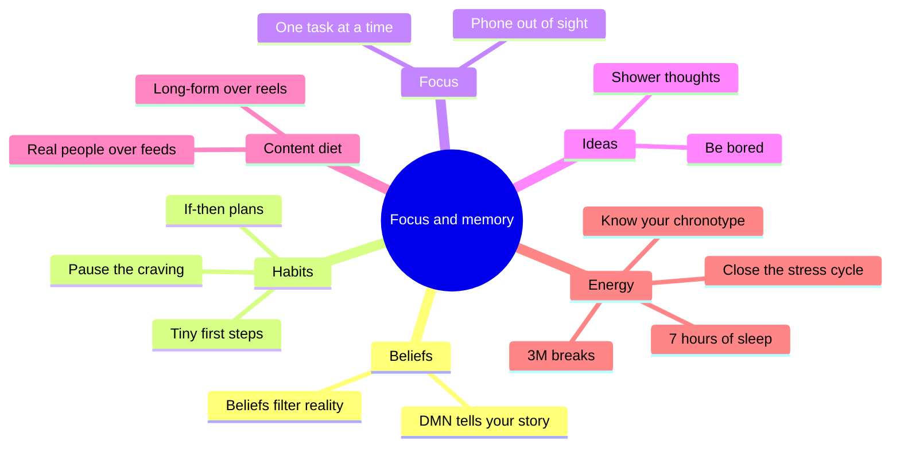

**Ten ideas to remember**

1. <mark>Your brain follows **biological laws**. Work with them, not against them.</mark>
2. <mark>**Beliefs are a filter**: the brain looks for proof of what you already believe, so write the story you want and review it daily.</mark>
3. <mark>Replace vague goals with **"when X, I will do Y"** plans and make the first step tiny.</mark>
4. <mark>Break a habit where it starts, at the **feeling**: pause, name it, then do something tiny instead.</mark>
5. <mark>**Scrolling is a poor break.** Nature, a walk, or 60 seconds with your eyes closed recharge you better.</mark>
6. <mark>Keep your phone **out of sight** during deep work, even when it is off.</mark>
7. <mark>**Multitasking is task switching**, and every switch costs time and energy.</mark>
8. <mark>Ideas come when you are **bored**: load up the problem, then walk away.</mark>
9. <mark>Short-form feeds are **candy**: little memory, more loneliness. Choose long-form and real people.</mark>
10. <mark>Sleep **7+ hours**, learn your **chronotype**, close your **stress cycles**, and take **micro, meso and macro breaks**.</mark>

---

## 1. Intro

⏱️ [0:00](https://www.youtube.com/watch?v=4Vz6L8B73i4&t=0s) · Video chapter: “Intro” · [⬆️ Contents](#contents)

*A teaser of clips from later in the episode, then Raj asks you to subscribe and reads the sponsor message.*

[0:00](https://www.youtube.com/watch?v=4Vz6L8B73i4&t=0s) 🧠 **Sahar:** If you let people have their phones out, the IQ of your employees is lower. Cuz there was a study done when the phone was visible to you. Scores were significantly decreased.

🎙️ **Raj:** Like my attention decreased.

🧠 **Sahar:** Yes, Raj. It was also general fluid intelligence. That means you're dumber. This is the scary reality of how attention works in the brain. people who hold their phone or put their phone out on the table when they're talking to people and they first meet you. You seem less trustworthy, less capable, less intelligent, all of these different things. I'm a cognitive neuroscientist. Study how we can train the brain to be better. Every single time you switch your attention, you pay for it in time and you pay for it in energy. And if you don't believe me, we can test it out. Grab a piece of paper. You have some paper and a pen. Now, on the top line, I want you to write, "I am a great multitasker."

And then on the bottom line, I want you to write the numbers 1 through 20. I want you to go as fast as you can. Okay? Go. 17.72. Now, turn this paper around. Draw two more lines. You're going to do this one more time, but the way in which you will arrive will be very different.

[1:13](https://www.youtube.com/watch?v=4Vz6L8B73i4&t=73s) 🎙️ **Raj:** Okay?

🧠 **Sahar:** You're going to alternate. You're going to go back and forth until you finish both lines.

🎙️ **Raj:** Okay?

🧠 **Sahar:** Go.

🎙️ **Raj:** Done.

🧠 **Sahar:** So you went from 17.72 to 41.35 more than double. Every single time you switch your attention, there's a payment, a biological payment. This is what makes the people that are ultra successful different from everybody else. They just choose differently.

🎙️ **Raj:** A lot of people think that ultra successful people have better ideas.

🧠 **Sahar:** They have more ideas.

🎙️ **Raj:** So what should I do? How can someone become a person who gets incredible ideas all the time?

🧠 **Sahar:** Be bored and do nothing and you get ideas. You have to let those ideas come to you by cultivating the space for them. I'm going to show you a city map.

🎙️ **Raj:** Explain me how my brain works as if it was a city.

🧠 **Sahar:** We're here to learn about getting done and being productive. Yeah.

🎙️ **Raj:** How do I become this person who ends up achieving all the goals? Yes.

🧠 **Sahar:** Yes. Okay.

🎙️ **Raj:** I have a small favor to ask you. I need you to subscribe to our channel. The more subscribers we have, the better and bigger guests we can bring and provide you more value through these conversations. And the full audio experience of this show is also available on Spotify where you can follow us and listen to the new episodes as well. We usually think about how food affects our body, but we rarely think about how it affects our brain. What you eat impacts your focus, your energy, and your ability to think clearly. That's why the ingredients used in your food matter so much. Urban Platter understands this, and that's why they make better for you products that deliver on both taste and quality, so you don't have to choose between the two.

Every ingredient is thoughtfully sourced, giving you cleaner alternatives for your everyday meals. Because when you eat clean, your body feels better and your brain thinks better. To know more about Urban Platter, check the link in the description below. If

> 🟡 **Key points · Intro**
>
> - <mark>The teaser previews the big moments: the phone study, the multitasking test, why ultra-achievers have **more** ideas, and the brain drawn as a city.</mark>

---

## 2. Who is Dr Sahar Yousef

⏱️ [3:16](https://www.youtube.com/watch?v=4Vz6L8B73i4&t=196s) · Video chapter: “Who Is Dr. Sahar Yousef?” · [⬆️ Contents](#contents)

[3:16](https://www.youtube.com/watch?v=4Vz6L8B73i4&t=196s) 🎙️ **Raj:** Yeah, someone's watching you for the first time.

🧠 **Sahar:** Yes.

🎙️ **Raj:** They have no clue who you are. Then how would you explain what do you do and why they should watch it?

🧠 **Sahar:** So I'm a cognitive neuroscientist and my research is focused on cognitive neuroplasticity and also cognitive training. So I in particular <mark>study how we can train the brain to be better, better, faster, stronger</mark>.

🎙️ **Raj:** Okay?

🧠 **Sahar:** Which is why my lab colloquially is kind of called the becoming superhuman lab because that's what I study. I study how to make superhumans. And I'm obsessed with this topic. I have been for a very very long time. When I learned early on in my career that the brain is capable of change, that it's dynamic, that we can we're not born with a certain brain or it doesn't crystallize, that <mark>based on training, based on what you think, what you feel, what you do, the habits that you have, your brain can completely change and become different</mark>.

> [!NOTE]
> 🔵 **Research note · Neuroplasticity is real, but brain-training games are not magic**
>
> Adult brains do change with practice. London taxi drivers who memorised the city had a larger rear hippocampus (a memory area), and adults who learned to juggle for three months grew grey matter in a motion-processing area that shrank back after they stopped. But a large review of commercial "brain-training" apps found they mostly make you better at the trained game itself, with little proof of gains in everyday thinking. Real-life habits (sleep, focus, learning hard skills) are the better training.
>
> **Sources:**
> - Maguire, E. A., et al. (2000). Navigation-related structural change in the hippocampi of taxi drivers. *PNAS*. [link](https://doi.org/10.1073/pnas.070039597)
> - Draganski, B., et al. (2004). Neuroplasticity: Changes in grey matter induced by training. *Nature*. [link](https://doi.org/10.1038/427311a)
> - Simons, D. J., et al. (2016). Do "brain-training" programs work? *Psychological Science in the Public Interest*. [link](https://doi.org/10.1177/1529100616661983)

🧠 **Sahar** *(continued)*: Then my question became that means that people can be become smarter. That means that your ability to focus can increase. That means your memory can get better. like you can get better at that just like any other muscle, right? Like with fitness. And then of course now a huge part of what I do is really focused on minds and machines,

[4:36](https://www.youtube.com/watch?v=4Vz6L8B73i4&t=276s) 🎙️ **Raj:** Okay?

🧠 **Sahar:** And how they interact together. If you ignore the fact that we are human and by that, by the way, I mean the biological laws that dictate how our brains and our bodies actually work. Like the laws of physics, right? Like if I like I always say gravity.

🎙️ **Raj:** Yeah,

🧠 **Sahar:** There it is. Laws of physics. Nobody's questioning the laws of gravity. Like, oh, today, never mind. It's not for me. I don't want to do that. Right? This is how our universe works. Well, <mark>there are also biological laws that dictate how our brains work best, how our bodies work best</mark>. And my goal is for people to learn these biological laws so that they can work more in line with their biology instead of against it. Right now I feel and I say this all of the time that the way in which we as a society, human global society are living and working goes against our biology. It goes against the laws of biology and we can feel it. People have brain fog.

They're exhausted. They're burning out. They're not reaching their goals. Everybody I always talk to says, "Oh, I'm busy all of the time. I'm working non-stop. I'm busy busy busy busy." And it's like, "Do you actually meet your goals consistently?" Oh, no. I'm busy all of the time. I'm like, how could that be possible?

[5:49](https://www.youtube.com/watch?v=4Vz6L8B73i4&t=349s) 🎙️ **Raj:** But then do you see the difference between people who are achieving their goals all the time versus people who are not?

> 🟡 **Key points · Who is Dr Sahar Yousef**
>
> - <mark>Dr Yousef is a cognitive neuroscientist at **UC Berkeley**. Her lab, nicknamed the **"Becoming Superhuman" lab**, studies cognitive neuroplasticity and cognitive training: how to train the brain to be "better, faster, stronger".</mark>
> - <mark>**Neuroplasticity**: the brain is not fixed. What you think, feel, do and repeat changes it, so focus and memory can be trained like a muscle.</mark>
> - <mark>Her big idea: brains and bodies follow **biological laws**, like gravity. Modern life works against them, which is why so many people feel brain fog, exhaustion and burnout, and still miss their goals while being "busy all the time".</mark>

---

## 3. The biology of brain focus and motivation

⏱️ [5:50](https://www.youtube.com/watch?v=4Vz6L8B73i4&t=350s) · Video chapter: “The Biology of Brain, Focus & Motivation” · [⬆️ Contents](#contents)

[5:57](https://www.youtube.com/watch?v=4Vz6L8B73i4&t=357s) 🧠 **Sahar:** Yes.

🎙️ **Raj:** And is it the all the difference is in the brain and the biological laws they're following.

🧠 **Sahar:** The most important word you just said was following. We all have very similar brains. The laws are the same. Physics is physics no matter where you go. The difference between me and let's say like an Elon Musk is for the laws of physics is I'm not sending rockets into space, right? It's about am I learning the laws and am I leveraging the laws and my big push to every person in the world is <mark>you have to learn the laws of your brain and your body so that you can follow them and leverage them</mark> meaning actually get more done. That's the concept of becoming superhuman is if you can learn those laws then you can do amazing things with this brain and body that other people often times they ignore those laws.

They're exhausted again they're burned out. They're working all of the time but they're working inefficiently. These are the issues you know they say they have these dreams and they have these goals but they find it difficult to actually do those things. But the so the difference is between the people who consistently meet their goals is if they're following the actual laws of like it's it's like almost like a a cheat sheet. It's like a blueprint for how to live well.

[7:21](https://www.youtube.com/watch?v=4Vz6L8B73i4&t=441s) 🎙️ **Raj:** So you're telling me if I follow my biological laws

🧠 **Sahar:** Mhm.

🎙️ **Raj:** Which is how like let's say if my brain is supposed to function in a certain way and I follow those laws then my likelihood of achieving my goals increases than normal people like other people do not follow

🧠 **Sahar:** But also I will say you're like I don't buy it

🎙️ **Raj:** Okay yeah

🧠 **Sahar:** Well you have to remember the a lot of biological laws the laws I'm hopefully we're going to talk about uh that I'm obsessed with are also laws around what's the science behind motivation, what's the science behind goal achievement, what's the science behind focus, what's the science behind distraction management, energy management, you realize you can have all these amazing goals in life, but if you mess up on those things, you're not going to meet those goals. Imagine like an Olympic athlete, right? Somebody wants to go to the Olympics, but they say, "I'm not focused on my training." Okay? I am not doing a good job managing my energy. Okay. Um I'm not motivated.

[8:29](https://www.youtube.com/watch?v=4Vz6L8B73i4&t=509s) 🎙️ **Raj:** Yeah.

🧠 **Sahar:** I'm motivated for 3 weeks and then I give up. Do you think they're going to go to the Olympics? No. That means you have to figure out, <mark>you have to hack the science of motivation. You have to hack the science of focus.</mark> You have to hack the science of managing your time, your energy, all of these things in order to meet any goals, whatever your goals are. You know, you could have any goals in the whole world. But yeah, that's these are what I mean by the laws of biology. I don't mean like take a blood test necessarily. I mean learn how does the brain motivate like what is dopamine really for example, right? How does it really work? Because the people that say like oh I want to whatever I don't know get fit.

I want to raise a certain amount of money. I want to start a company. I want to do these things. That's great. But what's the first step? And do you lose hope after 3 weeks, 3 months, 3 years?

🎙️ **Raj:** True. with we'll come to biological laws but for

> 🟡 **Key points · The biology of brain focus and motivation**
>
> - <mark>We all have very similar brains and the laws are the same for everyone. The difference is whether you **learn the laws and use them**.</mark>
> - <mark>Every goal depends on the "science of" **motivation, focus, distraction, time and energy**. An Olympic athlete who is unfocused, poorly rested and motivated for only 3 weeks will not make it, and neither will your goals.</mark>

---

## 4. The billionaire brain and why ultra-achievers feel limitless

⏱️ [9:19](https://www.youtube.com/watch?v=4Vz6L8B73i4&t=559s) · Video chapter: “The "Billionaire Brain": Why Ultra-Achievers Feel Limitless” · [⬆️ Contents](#contents)

[9:23](https://www.youtube.com/watch?v=4Vz6L8B73i4&t=563s) 🎙️ **Raj:** For simple average human being okay super human could mean a billionaire who looks like he's killing it in life right so you have also trained a lot of people from lot of these large companies you've worked with people from Nvidia Google you teach a lot of people you research about ultra achievers all of these things you do right so you have you've You've dealt with a lot of people who look like superhumans from the outside. What is one fundamental difference between a brain of, let's say, a billionaire and a broke person?

🧠 **Sahar:** I've worked with some pretty amazing people that have achieved amazing things. Truly superhuman things. And I'm always the most curious about people that achieve great things that come from nothing. If you started at zero and you achieved something close to 100, that's interesting. That's worth studying, right?

[10:24](https://www.youtube.com/watch?v=4Vz6L8B73i4&t=624s) 🎙️ **Raj:** Yeah, absolutely.

🧠 **Sahar:** And I've been very lucky, you know, being especially in Silicon, I've had access to a lot of some of these amazing people because of the work that I do. Um, it also helps that the lab is called Becoming Superhuman, and everybody wants to be superhuman. So, it's it's a it's it's it's popular for for a few different reasons, but some of these amazing people that I've met, I'll tell you something that is wildly different from a lot of folks that I see who struggle. And that is belief. Belief about how the world works. Belief about who it is that they are. These people, these the the billionaire's brain, they don't think there are limits. They really don't.

These people don't think there are any obstacles in their way. <mark>When something looks like a brick wall to the average person, that person sees a door.</mark> They know that they can open and create doors anywhere. They believe it. Truly, they believe it. And this is the fascinating thing again going back to those biological laws. <mark>The power of belief is so strong in the human brain</mark> when you believe something.

> [!NOTE]
> 🔵 **Research note · What research says about belief**
>
> Psychologists call belief in your own ability **self-efficacy**; it predicts how much effort people put in and how long they keep going after setbacks. Growth-mindset studies ("ability can grow") show real but **small** average effects, largest for students who were struggling. So belief helps most when it drives action and practice, not as a replacement for them.
>
> **Sources:**
> - Bandura, A. (1977). Self-efficacy: Toward a unifying theory of behavioral change. *Psychological Review*. [link](https://doi.org/10.1037/0033-295X.84.2.191)
> - Sisk, V. F., et al. (2018). To what extent and under which circumstances are growth mind-sets important to academic achievement? Two meta-analyses. *Psychological Science*. [link](https://doi.org/10.1177/0956797617739704)
> - Yeager, D. S., et al. (2019). A national experiment reveals where a growth mindset improves achievement. *Nature*. [link](https://doi.org/10.1038/s41586-019-1466-y)

🧠 **Sahar** *(continued)*: And these are again the stories that we tell ourselves. Who am I? How powerful am I? What am I capable of? It's like imagine you're a character in a movie. These people like really I don't know. Have you heard of the phrase main character energy?

[12:00](https://www.youtube.com/watch?v=4Vz6L8B73i4&t=720s) 🎙️ **Raj:** Yeah. *(laughter)*

🧠 **Sahar:** They have main character energy for real. Truly. And but everybody can have main character energy. You should be the main character of your life. Everybody should be. And I say that not just be to be like romantic cuz it's fun because this is how you can train the brain. If you convince yourself, I'm going to make it. This is going to be my life. This is going to be the door that I'm going to open. This is going to happen for me. And I know it's going to happen because it's possible because people like me have done. You know it. It's it's not you don't have the victim mindset. You don't have the oh these are these obstacles in my way that oh I have nothing blah blah blah.

All these other people they have this help they have that's going to keep you stuck. So many amazing examples of people again Olympic athletes people that have just crushed it physically that didn't start out fit at all but they make it happen through training. I think it's the same thing with mindset. All you have to do is So, here's here's my recommendation because I I do this for a living. This is what I do. I I help people train their brains. Every single time inside of your mind, your brain starts telling you that story. I'm a victim. I come from nothing. Look at my background. I'm not going to make it. You have to tell your brain to shut up.

Zip it. Be like, "Uh-uh. Don't do that." And then you have I call that by the way that's called redirection redirection. <mark>It's attentional redirection in the brain.</mark>

> [!NOTE]
> 🔵 **Research note · Redirect, do not just suppress**
>
> Simply ordering yourself "don't think about it" can backfire: in the classic "white bear" experiments, people told not to think of a white bear later thought about it **more**. What works better is what she describes next: move your attention to a specific replacement thought or story.
>
> **Sources:**
> - Wegner, D. M., Schneider, D. J., Carter, S. R., & White, T. L. (1987). Paradoxical effects of thought suppression. *Journal of Personality and Social Psychology*. [link](https://doi.org/10.1037/0022-3514.53.1.5)

🧠 **Sahar** *(continued)*: So if your attention is somewhere like oh I'm a victim. Oh I'm the oh it's not going to work out. Oh what if I fail? Oh redirect. You say uh I'm not going to move my attention. I'm moving my attention. I'm redirecting it back to what's the story you want. And you then you repeat it. And you got to get obsessive about this. Like every day you repeat the story, who am I? What's possible? One of my favorite quotes is <mark>anything is possible because nothing is real</mark>. All of this is man-made. All of this is made up. We can make anything happen.

🎙️ **Raj:** But then if someone was never believed in themselves ever, they've never thought that they can ever become better, achieve their goals, have a dreamy life, become financially free, billionaire, millionaire, whatever, etc., etc., right? If someone never believed, how can someone build a main character energy?

> 🟡 **Key points · The billionaire brain and why ultra-achievers feel limitless**
>
> - <mark>The biggest difference she sees in people who achieved huge things from nothing is **belief**: about how the world works and who they are. They do not see limits. **Where others see a brick wall, they see a door.**</mark>
> - <mark>**"Main character energy"** is trainable. A victim story ("I come from nothing, it won't work for people like me") keeps you stuck.</mark>
> - <mark>Tool: **attentional redirection**. When the negative story starts, tell your brain to stop, move your attention back to the story you want, and repeat it every day, almost obsessively.</mark>

---

## 5. How to rewire your identity and change your beliefs

⏱️ [14:09](https://www.youtube.com/watch?v=4Vz6L8B73i4&t=849s) · Video chapter: “How to Rewire Your Identity & Change Your Beliefs” · [⬆️ Contents](#contents)

[14:33](https://www.youtube.com/watch?v=4Vz6L8B73i4&t=873s) 🧠 **Sahar:** <mark>Write the story down.</mark> Take a piece of paper and you don't have to believe it in the beginning. Just trust me. Get a piece of paper and a pen and write out. Even if in the beginning you have to say this is this would be believed and this would be written by a version of me that doesn't exist that does believe in themselves and they are successful and they're amazing. Write from that person's perspective.

🎙️ **Raj:** What do you write? Like you take a piece of paper and what do you write?

🧠 **Sahar:** You can write well it depends on the your goals. It depends on your vision. So for example I might say I can I can come up with any scientific question related to the things that I am obsessed with and I will find the resources. I will find the people. I will find the funding. I will find the doors. I will make the doors open so that I can figure out what those answers are because I'm obsessed with finding out those answers. And I'm going to keep telling myself that. And when you do that, by the way, let me tell you the science of how this works. What's going to happen if you write that down, whatever story, but because it depends on the person, right? Your story is going to be different than mine. There's a network in the brain, okay? It's a neural network,

[15:51](https://www.youtube.com/watch?v=4Vz6L8B73i4&t=951s) 🎙️ **Raj:** Okay?

🧠 **Sahar:** Which is a pattern of electrical activation. So a neural network is a collection of different brain areas that in unison like an orchestra activate together. So they're they're they're connected electrically and they activate together. Okay, we have many different neural networks in the brain, but an important one is called the DMN or the default mode network.

🎙️ **Raj:** Okay,

🧠 **Sahar:** Now <mark>the DMN is the brain's storyteller</mark>.

> [!NOTE]
> 🔵 **Research note · The brain's three networks: storyteller, executive, spotlight** · *Mostly accurate*
>
> Real neuroscience backs this up, even if "storyteller" is a simplification. Raichle and colleagues (2001) discovered the brain has an organized baseline pattern — the default mode network (DMN) — that quiets down during focused, effortful tasks; Fox et al. (2005) showed this DMN runs opposite an attention/executive network, rising when the other falls. Buckner et al. (2008) describe the DMN as active during self-reflection, remembering your own past, and imagining the future — a fair basis for calling it a "storyteller." Menon's influential 2011 "triple network" model describes a third network, the salience network, whose job includes switching control between the DMN and the executive network based on what's important right now — matching "decides where attention goes."
>
> **Sources:**
> - Raichle, M. E., MacLeod, A. M., Snyder, A. Z., Powers, W. J., Gusnard, D. A., & Shulman, G. L. (2001). A default mode of brain function. Proceedings of the National Academy of Sciences, 98(2), 676–682. [link](https://doi.org/10.1073/pnas.98.2.676)
> - Fox, M. D., Snyder, A. Z., Vincent, J. L., Corbetta, M., Van Essen, D. C., & Raichle, M. E. (2005). The human brain is intrinsically organized into dynamic, anticorrelated functional networks. Proceedings of the National Academy of Sciences, 102(27), 9673–9678. [link](https://doi.org/10.1073/pnas.0504136102)
> - Buckner, R. L., Andrews-Hanna, J. R., & Schacter, D. L. (2008). The Brain's Default Network: Anatomy, Function, and Relevance to Disease. Annals of the New York Academy of Sciences, 1124(1), 1–38. [link](https://doi.org/10.1196/annals.1440.011)
> - Menon, V. (2011). Large-scale brain networks and psychopathology: a unifying triple network model. Trends in Cognitive Sciences, 15(10), 483–506. [link](https://doi.org/10.1016/j.tics.2011.08.003)

🎙️ **Raj:** Interesting. M

🧠 **Sahar:** This is the brain's narrator autobiographical narration who am I what's my identity what am I what are the stories and you know when people talk about trauma when people talk about bag all this it's stories and I you collect these stories like in a bag and you're carrying it around like baggage so you got to ask yourself <mark>which stories am I still carrying and are they serving me</mark> and when I say serving me like are they actually helping you achieve your goals are they making you happier? Are they making you healthier? Are they giving you an opportunity to live the life that you want? Because if they're not, get rid of that story. Rip that story up.

And you have to write your own story. Make up a new story. And then that DMN every single time, every day, you review the story. Yeah. Yeah. Yeah. You're going to get every guest you want, you know, whatever it may be. You're going to review the story over and over and over again. And guess what's going to happen? that DMN, the default mode network, the pattern of electrical activation that it has, it will influence other brain areas that are related to your attention. Now, we're talking about exciting executive function because that your beliefs, your stories. You asked me about the billionaire's brain and I told you the number one trait they have that's different is they have crazy beliefs.

Crazy beliefs. They don't see limits. anything is possible and anything they they're capable of anything and if you believe that that DMN and those beliefs will impact different brain areas that are related to what you see what you pay attention to and what you notice have you heard of like priming

[18:04](https://www.youtube.com/watch?v=4Vz6L8B73i4&t=1084s) 🎙️ **Raj:** Yeah it's explain me let's say explain everybody okay what priming is

🧠 **Sahar:** It this is the science behind priming that if you can have information teed up so that you review that story. That's why I said like it's not enough just to write it down one time and put it in your journal and put it away. No, no, no, no. You're working on this is training. You got to hit the gym every single day. Be like, "Uh-uh. This is what's going to happen. This is what I'm going to do. This is my goals. This is how I'm going to get there. This is the plan. This is the plan." You keep writing every day. You keep reviewing and keep writing. What's going to end up happening is you're going to notice opportunities. The opportunities are everywhere.

The possibilities are all right in front of us, but people don't see them. <mark>You will only see what the brain is primed to see.</mark>

> [!NOTE]
> 🔵 **Research note · Believing you're lucky helps you notice opportunities** · *Mostly accurate*
>
> Richard Wiseman's famous experiment is real: he had "lucky" and "unlucky" volunteers count photos in a newspaper that secretly contained a giant message reading "stop counting — there are 43 photographs in this newspaper," and relaxed "lucky" people noticed it far faster than tense, narrowly-focused "unlucky" people. Worth knowing: this comes from his popular book and a magazine article, not a peer-reviewed journal study. The broader mechanism is real and well documented as "confirmation bias" — believing something primes you to notice and act on things that confirm it. But "opportunities become statistically more likely" oversells it a bit: the accurate version is that your beliefs change what you notice and act on, not the actual odds of opportunities existing in the world.
>
> **Sources:**
> - Wiseman, R. (2003). The Luck Factor. Skeptical Inquirer, 27(3) [May/June 2003] — popular-science magazine summary of his book "The Luck Factor" (Miramax Books, 2003), not a peer-reviewed article. [link](http://web.archive.org/web/20090709203800/http://www.richardwiseman.com/resources/The_Luck_Factor.pdf)
> - Nickerson, R. S. (1998). Confirmation bias: A ubiquitous phenomenon in many guises. Review of General Psychology, 2(2), 175–220. [link](https://doi.org/10.1037/1089-2680.2.2.175)

🧠 **Sahar** *(continued)*: You will see what it is that you truly your beliefs and the data behind your beliefs are priming you to attend to in the world. So when you do that, all of a sudden so many success stories, I know you've heard these two. People will say, "Oh, and then I met this person randomly." magic right

[19:13](https://www.youtube.com/watch?v=4Vz6L8B73i4&t=1153s) 🎙️ **Raj:** They opened the door I had oh one conversation it just idea came to me I then all random things they start talking about

🧠 **Sahar:** It's it's not that random you can make you can increase the likelihood the statistical likelihood of these things that feel random

🎙️ **Raj:** If you reset your DMN

🧠 **Sahar:** If you reset your DMN that's a beautiful way to put it re literally design use your DMN to design your beliefs about yourself design your DMN so that you can choose what are the stories I'm telling myself about myself what's possible and what I'm going to accomplish and who I am and that is going to influence your behavior because the brain is going to it's designed this way this is what I mean by biological laws this is everybody's brain yours mine everybody's <mark>our brains are designed they're designed to look for data that confirms your beliefs</mark>.

[20:14](https://www.youtube.com/watch?v=4Vz6L8B73i4&t=1214s) 🎙️ **Raj:** Yeah, true. It happens with all the negative things as well.

🧠 **Sahar:** Bingo. Bingo. Which is why I'm like, if it's not helping you, get it out of there. Throw it away. Get it out. Like, you don't need it. Because people are like, "Oh, I'm a victim. Everybody blah blah blah. Everybody hates me. I don't get what I want." And guess what? They always see they're always complaining, right? Yeah. this happened, then this other thing happened. No, no, no. What's happening is your beliefs because that's how the brain works. That's a biological law. The brain is going to find and look for data to confirm its own beliefs. <mark>So, choose your beliefs, design your beliefs.</mark>

🎙️ **Raj:** Yeah, this this is so fascinating. It happens with me all the time, right? I I have an irrational belief when it comes to my work. And even if I'm sitting on a random afternoon, I start spotting opportunities out of thin air and they end up becoming opportunities worth millions of dollars and I end up just getting them. And I'm like this like 5 days ago this was not even the real thing. And at the same time I always play a victim card that because of my life, because of my schedule, because of work, I'm I never I I'm never able to sleep properly, you know, I'm not this guy who'll ever be able to get sleep, etc., etc. Every little thing just confirms that belief and I always just find out new reasons why I can't sleep.

And like just two different aspects, same person business, work-wise, opportunities just keep getting them. Healthwise, I just keep falling, falling, falling. And I just keep confirming the even if I have like 10 hours to sleep, I end up confirming some belief and be like, "Oh, why didn't I sleep that day?" Because, you know, this happened and that happened and just

[22:08](https://www.youtube.com/watch?v=4Vz6L8B73i4&t=1328s) 🧠 **Sahar:** It happens.

🎙️ **Raj:** There's excuses in my head.

🧠 **Sahar:** Yeah.

🎙️ **Raj:** But but I love this. Okay. You said main character energy. Okay. If someone's watching this and we have to make this make main character energy exercise sort of stuff.

🧠 **Sahar:** Okay.

🎙️ **Raj:** Okay. Okay. So what would you want me to write in this story? So let's say I today I decide that from right now I'm going to have the main character energy in my life.

🧠 **Sahar:** Yeah.

🎙️ **Raj:** Okay. And I am going to write take a piece of paper and write my story.

🧠 **Sahar:** Yeah.

🎙️ **Raj:** What should I have in this story? Identity, goal, what all did you you just threw a bunch of words. Let's make it simplest. Let's make it simpler for people to have like a template to start doing it right now.

🧠 **Sahar:** Beautiful. First begin with what we call identity based beliefs.

🎙️ **Raj:** Okay.

🧠 **Sahar:** Okay. Identity based beliefs. Now, I actually think we should totally do this on you related to your sleep.

[23:08](https://www.youtube.com/watch?v=4Vz6L8B73i4&t=1388s) 🎙️ **Raj:** Wow. Okay.

🧠 **Sahar:** Cuz you brought it up yourself, right? You said, "Okay, you've got some beliefs in there that sleep is hard for you."

🎙️ **Raj:** Yeah.

🧠 **Sahar:** Is not easy, but it's totally not helping you. I'm sure.

🎙️ **Raj:** Not at all.

🧠 **Sahar:** Okay. So, let's get rid of it. Let's make a new belief. You write a new one. So, what you're going to want to do, so the identity based beliefs, the the way that they work is that you need to write a belief that you have that Raj has about sleep that's based on your values. So, I'll give you a few examples just to like get you inspired. You might write, "I prioritize my health because I know how important it is for my performance and my business." You might just write that sentence down. Do you believe that?

🎙️ **Raj:** Yeah.

🧠 **Sahar:** Totally right.

🎙️ **Raj:** Absolutely.

🧠 **Sahar:** Okay. Absolutely. So, you might write something like that down. Then you're going to stack the next one. You're going to say, "I know the data on sleep and health." Do you feel like that's true?

[24:12](https://www.youtube.com/watch?v=4Vz6L8B73i4&t=1452s) 🎙️ **Raj:** Yeah.

🧠 **Sahar:** Yeah. *(laughter)* Have you had some sleep experts on the pod?

🎙️ **Raj:** Still, it has not helped me. A lot of people have benefited from it, not me.

🧠 **Sahar:** Okay. We can bond about this. I'm not an easy sleeper either. We should talk about your sleep. Seriously. Um, so first is identity. Second is data. Second is well I should say identity and then you're you're still mixing your identity with facts that you know. Yeah, pretty much your data because we're going to try to bridge all of these together, right? What else do you believe about sleep? What is it that you know for sure about sleep?

🎙️ **Raj:** It's going to make me better.

🧠 **Sahar:** It's going to make you even better. So would you maybe could I even push this a little further and say I could be a smarter, better looking and happier version of self if I slept a little bit more.

🎙️ **Raj:** Yeah, I'll ask better questions if I'm I'll be more focused. Yeah, there are so many things that I'll I'll achieve by just sleeping better.

[25:17](https://www.youtube.com/watch?v=4Vz6L8B73i4&t=1517s) 🧠 **Sahar:** Yeah. So you might you'd write all of these things down and then you would start writing bringing it all together into an identity based belief and even though it's not true yet you would say something like I make sure that I wind down for bed that's at an early enough time to make sure I at least get 6 to 7 hours a night. You write what the you essentially you're designing the habit

🎙️ **Raj:** Like this is the part I don't believe *(laughter)*

🧠 **Sahar:** I know you don't believe it now but you have to write it down and this is the process of fake it till you make it right

> [!NOTE]
> 🔵 **Research note · Visualizing success vs. actually planning for it** · *Partly accurate*
>
> The real research here is more surprising than the podcast lets on. Gabriele Oettingen found that people who enjoy more positive daydreams about an idealized future actually put in less effort and get worse real-world results — job-seekers who fantasized more about getting hired sent fewer applications and earned less money over the following two years, because the mind relaxes as if the goal were already achieved. Her own recommended technique isn't pure visualization — it's "WOOP" (Wish, Outcome, Obstacle, Plan): picture the goal, then deliberately picture the real obstacle and make an if-then plan to get past it. Separately, the famous "mental practice" research (like the classic piano study) shows imagining a skill can help you learn it a little, but a large review of many studies found mental practice is only moderately effective and clearly weaker than physically practicing — so "the brain can barely tell the difference" overstates the real evidence.
>
> **Sources:**
> - Oettingen, G., & Mayer, D. (2002). The motivating function of thinking about the future: Expectations versus fantasies. Journal of Personality and Social Psychology, 83(5), 1198–1212. [link](https://doi.org/10.1037/0022-3514.83.5.1198)
> - Kappes, A., & Oettingen, G. (2011). Positive fantasies about idealized futures sap energy. Journal of Experimental Social Psychology, 47(4), 719–729. [link](https://doi.org/10.1016/j.jesp.2011.02.003)
> - Pascual-Leone, A., Nguyet, D., Cohen, L. G., Brasil-Neto, J. P., Cammarota, A., & Hallett, M. (1995). Modulation of muscle responses evoked by transcranial magnetic stimulation during the acquisition of new fine motor skills. Journal of Neurophysiology, 74(3), 1037–1045. [link](https://doi.org/10.1152/jn.1995.74.3.1037)
> - Driskell, J. E., Copper, C., & Moran, A. (1994). Does mental practice enhance performance? Journal of Applied Psychology, 79(4), 481–492. [link](https://doi.org/10.1037/0021-9010.79.4.481)

🎙️ **Raj:** Got it *(laughter)*

🧠 **Sahar:** Yeah you got to like you got to be like yep I do that

🎙️ **Raj:** Okay

🧠 **Sahar:** Because why because you prioritize your health and your performance you know

🎙️ **Raj:** So it's like first was identity second was data third is what better will happen after this and fourth is new habit.

🧠 **Sahar:** Yeah. And this is where you bring in I would say still even one full sentence all together. I'll give you an example actually from one of my um MBA students, one of my business students. I'm the type of person Oh, now we're talking about what kind of person are you versus what kind of person is someone else, your competitor. M m <mark>I'm the type of person who makes sure that I sleep at least 6 to 7 hours a night because I know what an edge it's going to give me in my business.</mark> You're just going to write that down and you're like, "Oh, I don't do that every night." That's okay. You're But do you believe you can get there?

[26:54](https://www.youtube.com/watch?v=4Vz6L8B73i4&t=1614s) 🎙️ **Raj:** Yeah.

🧠 **Sahar:** And do you believe it's true all the other things you've written?

🎙️ **Raj:** Yeah.

🧠 **Sahar:** Okay. Once you've done this work and you've written down that identity, I'm the type of person who does this,

> 🟡 **Key points · How to rewire your identity and change your beliefs**
>
> - <mark>The **default mode network (DMN)** is the brain's **storyteller**: "Who am I? What am I capable of?" We carry old stories like baggage. Ask which ones still **serve you** (make you happier, healthier, closer to your goals); rip up the rest and write new ones.</mark>
> - <mark>Beliefs work like a filter (**priming**): the brain looks for data that confirms what it already believes. So you start to notice the opportunities your story primes you to see, and "random" lucky breaks become more likely.</mark>
> - <mark>It cuts both ways. Raj's beliefs about work find him opportunities; his belief that he "can never sleep" keeps finding excuses.</mark>
> - <mark>**Exercise: write an identity-based belief** (shown for Raj's sleep): 1) a value ("I prioritise my health because it drives my performance"), 2) the data you know, 3) the benefits, 4) the new habit. Then join them into one sentence: **"I'm the type of person who sleeps at least 6–7 hours because I know the edge it gives me."**</mark>
> - <mark>Write it even before you believe it ("fake it till you make it"), and **review it every day**. It is training, like going to the gym.</mark>

**Picture it: building an identity sentence**

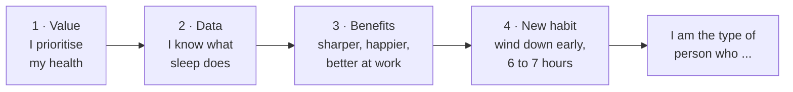

---

## 6. Why vague goals fail and how if-then plans and tiny habits help

⏱️ [26:59](https://www.youtube.com/watch?v=4Vz6L8B73i4&t=1619s) · Video chapter: “Why Vague Goals Fail: If-Then Plans & Tiny Habits” · [⬆️ Contents](#contents)

[27:06](https://www.youtube.com/watch?v=4Vz6L8B73i4&t=1626s) 🧠 **Sahar:** Then we start going into something that we call implementation intentions. And this is from research from Peter Gollwitzer. Now, <mark>implementation intentions are essentially situation action plans</mark>.

> [!NOTE]
> 🔵 **Research note · If-then plans beat vague goals** · *Accurate*
>
> This is well supported. Psychologist Peter Gollwitzer's "implementation intentions" are exactly if-then plans — deciding in advance "when X happens, I will do Y" — so the response can fire automatically instead of relying on in-the-moment willpower. A major 2006 meta-analysis with Paschal Sheeran, pooling 94 independent studies, found these if-then plans had a medium-to-large effect (d = 0.65) on actually reaching a goal, clearly beating people who had only a general goal in mind.
>
> **Sources:**
> - Gollwitzer, P. M. (1999). Implementation intentions: Strong effects of simple plans. American Psychologist, 54(7), 493–503. [link](https://doi.org/10.1037/0003-066X.54.7.493)
> - Gollwitzer, P. M., & Sheeran, P. (2006). Implementation intentions and goal achievement: A meta-analysis of effects and processes. Advances in Experimental Social Psychology, 38, 69–119. [link](https://doi.org/10.1016/S0065-2601%2806%2938002-1)

🧠 **Sahar** *(continued)*: For those who do computer science, it's like an old school if then statement.

🎙️ **Raj:** Yeah. Okay.

🧠 **Sahar:** If this then that. If then, when is probably a more apt way to describe it. Okay. So, a situation action plan would be like this. When my alarm goes off every night at 11 p.m., I begin my designed routine. I start my windown music playlist, you know, then I make my herbal tea. I do this. I start doing my physical therapy, you know, whatever it may be. You you go through your routine. The difference between I'm going to try to go to bed earlier or I have this new routine, I'm just going to do it before bed. The difference here is <mark>an implementation intention describes in crazy detail what does it look like when you do the thing</mark> you describe like a movie.

I want to see you in your house, Raj. Like at and it's like 11:00 p.m. the alarm goes off and you're like, uh, where are you? What is it? What does it look like? What are you wearing? Where in the house are you? What are you doing? Phone's in your hand. It's truly describe it in detail. I'll give you another example of the difference between having an implementation intention versus having a goal. Because a goal is

[28:49](https://www.youtube.com/watch?v=4Vz6L8B73i4&t=1729s) 🎙️ **Raj:** Wake random.

🧠 **Sahar:** Yeah. It's <mark>it's like a prayer, you know.</mark> It's like that's cute. It's nice, but there's no plan, right? There's no way to make it to execute the thing, right? We got to have a plan. So, uh, let's say I've heard a lot of people say, "I'm going to try to go to sleep earlier. I want to try to get more sleep." Adorable. How are you going to do that? Right. We actually have to get serious about what this looks like. Yeah. So usually for people unless your body is waking you up super you know usually we have what we have to do is go to bed earlier not uh keep sleeping the other way.

🎙️ **Raj:** Yeah.

🧠 **Sahar:** So the question becomes what kind of implementation intention can you design that's going to get you to do that. So you don't say I'm going to try to get to bed earlier. It's not going to work. So you describe the situation when this happens then I will do this when then

🎙️ **Raj:** Okay so when 11 let's say when whenever my alarm goes around 11 p.m. this is what I'm going to do. That's exactly what you you want me to design.

[30:00](https://www.youtube.com/watch?v=4Vz6L8B73i4&t=1800s) 🧠 **Sahar:** Yes.

🎙️ **Raj:** And like I'm on the right side of the bed. I have my laptop on. and I'm doing this like all of this and like I'll shut this down. I'll be doing like stuff like that like that minute detail.

🧠 **Sahar:** Yes.

🎙️ **Raj:** Okay. And then

🧠 **Sahar:** Once you visualize it and you've written it down, then you begin the habit, you attempt to actually do the habit and you tr and here are some other tips here. <mark>Make it as easy and small as possible.</mark> As easy and small as possible. For example, <mark>a lot of people benefit from going to bed earlier just by brushing their teeth earlier</mark>.

> [!NOTE]
> 🔵 **Research note · Tiny habits, identity, and the "66 days" number** · *Accurate*
>
> Both books check out: BJ Fogg's "Tiny Habits" (2019) argues for shrinking a new habit down to something almost trivially small and anchoring it to an existing routine; James Clear's "Atomic Habits" (2018) argues lasting change comes from identity ("I'm the type of person who...") rather than chasing outcomes alone. The famous "66 days to form a habit" figure comes from a real 2010 study (Lally et al.) that tracked 96 people building a new daily habit over 12 weeks — but the study's actual headline result is a huge range of 18 to 254 days for people to reach their habit "ceiling," not a fixed 66. Sixty-six days is simply the average from that same dataset, so it's a real number, but on its own it hides just how much habit-forming time varies from person to person.
>
> **Sources:**
> - Fogg, B. J. (2019). Tiny Habits: The Small Changes That Change Everything. Houghton Mifflin Harcourt.
> - Clear, J. (2018). Atomic Habits: Tiny Changes, Remarkable Results. Avery.
> - Lally, P., van Jaarsveld, C. H. M., Potts, H. W. W., & Wardle, J. (2010). How are habits formed: Modelling habit formation in the real world. European Journal of Social Psychology, 40(6), 998–1009. [link](https://doi.org/10.1002/ejsp.674)

🎙️ **Raj:** Interesting.

🧠 **Sahar:** That's it. You could just say, "Listen, I'm I don't know when I'm going to go to sleep, but I told myself I have to brush my teeth at 11:00." Once you brush your teeth, that means you're probably not going to eat or drink anything anymore. Now you have at least the kitchen is cut off. You just start cutting everything off. You're like, "And then I'm going to get in my pajamas." Okay, now we're even one step closer. You just have to figure out what behaviors that you want to design out. Commit to it. Make it as small as possible, but really make the when part, the if part, the beginning, the situation should be as clear as humanly possible. Truly clear.

People really skip this step. They say things like, um, I'll give you an example of when people want to stop doing something because it's possible your viewers want to cut a habit.

[31:26](https://www.youtube.com/watch?v=4Vz6L8B73i4&t=1886s) 🎙️ **Raj:** Yeah.

🧠 **Sahar:** Stop smoking. stop eating sweets, whatever it may be.

🎙️ **Raj:** Start binging on their reels overnight.

🧠 **Sahar:** Tricky one, but yeah, totally. Totally. You could say, "When I have a craving for another piece of chocolate, when I have a craving for a cigarette, then I will do this instead." And I'll tell you, this is a version of an implementation intention for a negative behavior, meaning a behavior you want to cut. Okay? Not a positive behavior. and a behavior you want to add. Say add like positive and negative or add a behavior or remove a behavior. <mark>Removing a behavior is insanely difficult.</mark> Super super difficult.

🎙️ **Raj:** Way more than adding.

🧠 **Sahar:** Yes.

> 🟡 **Key points · Why vague goals fail and how if-then plans and tiny habits help**
>
> - <mark>A vague goal like "I'll try to sleep earlier" is **"like a prayer"**: nice, but there is no plan.</mark>
> - <mark>Use an **implementation intention** (Peter Gollwitzer's research): a situation-action **"when X happens, I will do Y"** plan. Describe it like a movie: the time, the room, what you are wearing, what is in your hand.</mark>
> - <mark>Make the first step **as small and easy as possible**. Example: brush your teeth at 11 PM. The kitchen is now "closed", then pyjamas, then bed.</mark>
> - <mark>To stop a habit: "When I crave X, I will do Y instead." **Removing a behaviour is much harder than adding one.**</mark>

**Picture it: an if-then bedtime plan**

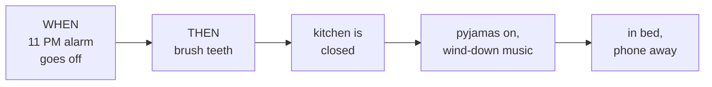

---

## 7. The psychology of addiction and breaking bad habits

⏱️ [32:12](https://www.youtube.com/watch?v=4Vz6L8B73i4&t=1932s) · Video chapter: “The Psychology of Addiction & Breaking Bad Habits” · [⬆️ Contents](#contents)

[32:12](https://www.youtube.com/watch?v=4Vz6L8B73i4&t=1932s) 🎙️ **Raj:** Why? Why cutting off an habit is more difficult than making a new habit?

🧠 **Sahar:** Do you have a whiteboard?

🎙️ **Raj:** Yeah.

🧠 **Sahar:** All right. All right. Okay. So we were talking about neural networks before, right? So neural networks again are patterns of electrical activation. So let's say for example, you have some pattern of electrical activation here in the brain. And let's say this represents your craving for something you don't want to crave anymore.

🎙️ **Raj:** Yeah. Watching reels, let's like binge watching random stuff. Yeah.

🧠 **Sahar:** Oh wow. Binge watching. Okay. So

🎙️ **Raj:** Mindless scrolling, whatever you want to call Yeah,

🧠 **Sahar:** Great. I'll even draw a little phone, you know. Okay, there you go. All right. So, this is this is the craving for it, though.

🎙️ **Raj:** Okay.

🧠 **Sahar:** This is not the behavior. This is the craving. So if this dot here represents the the actual craving for it, what that let's say ends up getting connected to is a set of patterns of electrical activation here that represents the complex behavior that ends up being you grab the phone and you start scrolling.

[33:23](https://www.youtube.com/watch?v=4Vz6L8B73i4&t=2003s) 🎙️ **Raj:** Okay.

🧠 **Sahar:** Okay. So it starts with a craving. The craving is not by the way usually to binge watch. Usually the craving is something else. Usually, and this is where we can get a little more emotional here, it's a feeling.

🎙️ **Raj:** Okay. What do you mean by that?

🧠 **Sahar:** Well, let's let's

🎙️ **Raj:** The craving is not for binge watching.

🧠 **Sahar:** Well, that ends up becoming the behavior for you to satisfy a craving. The craving you think is actually for binge watching, but it's it's a craving to binge watch in order to satisfy some feeling. That's usually what's happening.

🎙️ **Raj:** Like something I'm missing.

🧠 **Sahar:** Something you're missing or something that you want to disassociate from, numb from usually. <mark>Usually the feeling that people have is overwhelm, stress</mark>, let's say.

🎙️ **Raj:** Okay,

🧠 **Sahar:** If you're overwhelmed, you're stressed out, you're tired, you lack motivation, right? M you're looking to solve for these feelings and your brain has decided a nice thing to do if you have these feelings. You're like, I don't nobody wants to feel this by the way, right? These are bad feelings. So if you have these feelings, your brain goes, let's get out of this. How do I solve this? There's a few different things you can do. But let's say you accidentally develop this addiction, this habit. Because by the way, the word habit is a common one. We're all interested in habits.

[35:04](https://www.youtube.com/watch?v=4Vz6L8B73i4&t=2104s) 🎙️ **Raj:** Yeah.

🧠 **Sahar:** <mark>It's pretty much the same thing as addiction.</mark>

> [!NOTE]
> 🔵 **Research note · Is addiction just a habit?** · *Partly accurate*
>
> This blurs an important line. Habit researchers (e.g., Wendy Wood) define a "habit" as simply an automatic response you've learned to a repeated situation — no harm required, like always grabbing your keys the same way. The DSM-5 defines addiction around impaired control and continued use despite real harm — that's the defining feature, not an optional extra. Where the claim gets something right: neuroscience (Everitt & Robbins) shows addiction genuinely grows out of habit-forming brain circuits, sliding from a deliberate choice into an automatic and eventually compulsive one, with a real shift in which brain regions are in charge. So habit and addiction share machinery, but addiction is habit-formation pushed to a compulsive, harmful extreme — not simply "the same thing" as an everyday habit.
>
> **Sources:**
> - American Psychiatric Association. What Is Addiction?. [link](https://www.psychiatry.org/patients-families/addiction/what-is-addiction)
> - Wood, W., & Neal, D. T. (2007). A new look at habits and the habit-goal interface. Psychological Review, 114(4), 843–863. [link](https://doi.org/10.1037/0033-295X.114.4.843)
> - Wood, W., & Rünger, D. (2016). Psychology of Habit. Annual Review of Psychology, 67, 289–314. [link](https://doi.org/10.1146/annurev-psych-122414-033417)
> - Everitt, B. J., & Robbins, T. W. (2005). Neural systems of reinforcement for drug addiction: from actions to habits to compulsion. Nature Neuroscience, 8(11), 1481–1489. [link](https://doi.org/10.1038/nn1579)

🧠 **Sahar** *(continued)*: It's the same thing. People hear the word addiction and they think it's like scary, like it's some moral, you know.

🎙️ **Raj:** Yeah. It's a bad thing.

🧠 **Sahar:** It's a bad thing. What about when people are addicted to exercise or addicted to feeling healthy or addicted to being kind, right? Cuz you can you've I've met people who definitely are addicted to those things and I know you probably have met lots of these kinds of people because these are the people you collect. People addicted to their own success.

🎙️ **Raj:** Absolutely. Yeah.

🧠 **Sahar:** Yeah. So, it's not a bad thing. Addiction just means habit. That's it.

🎙️ **Raj:** Okay.

🧠 **Sahar:** So, we can demystify, dethrone, you know, uh uh these words really. They're coupled together. They're the same thing. They're the same thing. So, what is a habit? What is also an addiction? It's also the same thing as just a behavior that you do over and over. I would just say that you do a lot, right? So what ends up happening is you have a feeling there is some brain state, some cognitive or emotional brain state and then what ends up happening is you want to move away from that feeling. If it's a if it's a bad feeling like this, right? You want to move away from it. Your your brain wants to help you solve it. It doesn't want to let you sit in that in that bad feeling.

So whatever it is that you did, let's say you did binge watching one time when you felt that way. You're like, "Let me distract myself, you know, go somewhere else. We don't need to think that. We don't need to feel that." So then you start binge watching and what's going to happen in the beginning? In the beginning you're distracted, right? So it feels good.

[36:50](https://www.youtube.com/watch?v=4Vz6L8B73i4&t=2210s) 🎙️ **Raj:** Yeah.

🧠 **Sahar:** Okay. So what you ended up doing is you ended up doing the actual binge watching. So you scrolled and then what happens uh uh at the at the very end. Let's say now you're done scrolling and you put the phone away. This is a bit of a trick question because let's say you were overwhelmed about a work deadline and then you started binge watching for 45 minutes in the evening instead of working on the thing that's overwhelming you. So then you did the binge watching and then afterwards you put the phone down. Did you deal with the thing that you were actually stressed about?

🎙️ **Raj:** No, I get guilty.

🧠 **Sahar:** Yeah. So now you have this, <mark>you have the overwhelm and you have shame</mark>. Yeah. So the person is super sad now. We're we're just super sad. So now that you have overwhelm and shame, you know that's even worse than before. No.

🎙️ **Raj:** Yeah.

🧠 **Sahar:** So guess what I want to do again?

🎙️ **Raj:** Watch again.

🧠 **Sahar:** Go around the circle again. So okay, let's say you've done this one night. But come on, let's be honest. I've done this even like at least 100 times. Do you know what I mean? Here's the answer to your your original question. Every single time you do this, you go through this path. <mark>Every time you traverse this road and you do it again and again and again</mark>, do you see what's happening here? We're making it darker. No, we're making it maybe even bigger, stronger, deeper. This neural network starts to become like a tree trunk, like the roots of a tree. That is how a behavior. If you do it one time, that's fine. You do it 100 times, 1,000 times, a million times, that's a behavior that you do a lot, that's the same thing as addiction.

It's the same thing as a habit. It's all the same. So habits, addictions, and behaviors that you do a lot are just really entrenched and strong associations between a feeling, a craving, and a behavior.

[38:54](https://www.youtube.com/watch?v=4Vz6L8B73i4&t=2334s) 🎙️ **Raj:** So how do we break this?

🧠 **Sahar:** One, tip number one, don't wait for it to get so strong. You know, ideally,

🎙️ **Raj:** What if it's so strong already?

🧠 **Sahar:** Okay, let's assume it's strong

🎙️ **Raj:** Because there I'm sure there must be hundreds of bad behaviors which are strong in my head. Obviously hundreds of good behaviors as well.

🧠 **Sahar:** Yes.

🎙️ **Raj:** But the bad behaviors, let's talk about them. Let's get rid of them first.

🧠 **Sahar:** Okay. <mark>Step one, awareness.</mark> You have to understand and see the loop for yourself. <mark>You cannot change something that you do not understand</mark> that you don't have data on. Right? You have to understand a system if you want to change the system. So you need knowledge. Okay? Self-knowledge in this case. So you need to be aware. You need to be able to see your own behavior as it's happening. That means you actually have to answer the question, what's the feeling? So step one is you got to identify the emotions and the feelings that cause you to go down the loop in the first place.

[39:56](https://www.youtube.com/watch?v=4Vz6L8B73i4&t=2396s) 🎙️ **Raj:** How do I identify this? Because I don't know if I'm if I'm falling into this trap of feeling like I I want to crave something. That craving can be dessert at midnight. It can be binge watching. It can be just doing all sorts of bad habits. Some for some people it can be alcohol, smoking weed, uh smoking, you know, like a cigarette.

🧠 **Sahar:** Mhm.

🎙️ **Raj:** For some a lot of young people it can be porn like all of these behaviors are stem from feeling, right?

🧠 **Sahar:** Yes.

🎙️ **Raj:** But we don't know why are they occurring. Yeah. Like it it can be overwhelm, it can be stress, it can be anxiety, it can be tired, it can be all it can be just pure shame or maybe lack of ability to turn around my life or the feeling like a victim. How do I find out which one is it?

🧠 **Sahar:** <mark>You have to have what's called a cognitive pause.</mark> So that means when you before you go grab the chocolate at midnight, before you grab the phone and maybe you've already grabbed it, by the way, you just you've grabbed the phone, you've opened up Instagram, whatever it is that your app of choice, you know, you grabbed it, you opened it, and you just were about to start scrolling and you go, you have to start to build the awareness. You go, hold on, hold on, hold on. I'm not saying you can't have it. By the way, in the beginning, we just want to know why. So you go, okay, hold on. What am I feeling right now? What is it that Why do I want to go and binge watch right now?

[41:27](https://www.youtube.com/watch?v=4Vz6L8B73i4&t=2487s) 🎙️ **Raj:** I'm just exhausted. Like just

🧠 **Sahar:** Okay, so you're you're tired. I would still ask you go deeper. Why are you exhausted? And then I'd force you I if I were in the room with you, I would say, well, Raj, if you're exhausted, shouldn't you go do something else like rest? Right. Or gain more energy. Do something that gives you energy. Like, right. If you're tired, if it depends. If it's right before bed, then if you're tired, yeah, that's right. Go to bed.

🎙️ **Raj:** Sleep.

🧠 **Sahar:** So then you go to sleep, right? We go, we help you with the sleep thing. *(laughter)* But if you're tired in the middle of the day, you're like halfway in the middle of the day and you're like, I'm just exhausted and I need a break.

🎙️ **Raj:** Yeah.

🧠 **Sahar:** This is not a break. There was, by the way, a paper published in Nature.

> 🟡 **Key points · The psychology of addiction and breaking bad habits**
>
> - <mark>A habit (she argues "addiction" is basically the same word) is a behaviour you repeat a lot: a strong path of **feeling → craving → behaviour** in the brain. Every repeat makes the "road" deeper, like the roots of a tree.</mark>
> - <mark>The craving is usually **not really for reels**. It is a wish to escape a **feeling**: overwhelm, stress, tiredness, low motivation.</mark>
> - <mark>Scrolling does not fix the cause (the deadline is still there), so you end up with **overwhelm + shame**, which makes you want to scroll again. That is the loop. Shame only adds another bad feeling.</mark>
> - <mark>**Step 1: awareness.** You cannot change a system you do not understand, so name the feeling. **Step 2: a cognitive pause.** Before or while you grab the phone, ask "Hold on, what am I feeling right now?"</mark>

**Picture it: the loop that keeps you scrolling**

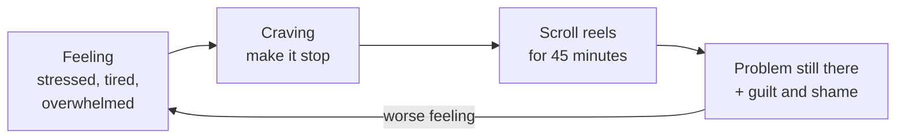

---

## 8. The science of breaks and how to rest and recover

⏱️ [42:13](https://www.youtube.com/watch?v=4Vz6L8B73i4&t=2533s) · Video chapter: “The Science of Breaks: How to Rest & Recover” · [⬆️ Contents](#contents)

[42:16](https://www.youtube.com/watch?v=4Vz6L8B73i4&t=2536s) 🧠 **Sahar:** What is it? the world's like premier science journal 2024 that actually measured the effectiveness of different kinds of breaks.

🎙️ **Raj:** Okay.

🧠 **Sahar:** One option was no break at all. You do no break. Raj, keep working. Tired. So what? Keep going. Hustle. Come on. You're young. You got it. Let's go. The next option was you take a break uh and you look outside or you go take a walk outside in nature. Okay. So you're exposed to something natural. Okay. The next break was scrolling.

🎙️ **Raj:** Yeah.

🧠 **Sahar:** Can you imagine what the results were? <mark>It showed that scrolling is pretty much the same as not taking a break.</mark>

> [!NOTE]
> 🔵 **Research note · Are phone breaks as bad as no break at all?** · *Partly accurate*
>
> We could not find any 2024 paper in the flagship journal Nature matching this. The closest real match is a 2024 study in Scientific Reports (a "Nature Portfolio" journal on nature.com, but not Nature itself) comparing no-break, resting, watching nature videos, and scrolling short videos during work breaks — and scrolling actually gave a real, measurable mood/energy boost versus no break, just a smaller one than nature videos (the only condition with full recovery). So "scrolling ≈ no break" overstates that paper's own conclusion. A well-known 2019 study is a closer partial match: phone breaks left people no faster at finishing a hard task than no break at all, but people who used phones still solved more problems correctly than people with no break — just fewer than people who got a paper or computer break. Real nature walks reliably beat urban walks for restoring attention (a classic 2008 study), and a large 2022 meta-analysis confirms breaks generally reduce fatigue and lift energy a little.
>
> **Sources:**
> - Grobelny, J., Glinka, M., & Chirkowska-Smolak, T. (2024). The impact of hedonic social media use during microbreaks on employee resources recovery. Scientific Reports, 14, 21603. [link](https://doi.org/10.1038/s41598-024-72825-x)
> - Kang, S., & Kurtzberg, T. R. (2019). Reach for your cell phone at your own risk: The cognitive costs of media choice for breaks. Journal of Behavioral Addictions, 8(3), 395–403. [link](https://doi.org/10.1556/2006.8.2019.21)
> - Berman, M. G., Jonides, J., & Kaplan, S. (2008). The cognitive benefits of interacting with nature. Psychological Science, 19(12), 1207–1212. [link](https://doi.org/10.1111/j.1467-9280.2008.02225.x)
> - Albulescu, P., Macsinga, I., Rusu, A., Sulea, C., Bodnaru, A., & Tulbure, B. T. (2022). "Give me a break!" A systematic review and meta-analysis on the efficacy of micro-breaks for increasing well-being and performance. PLOS ONE, 17(8), e0272460. [link](https://doi.org/10.1371/journal.pone.0272460)

🧠 **Sahar** *(continued)*: So instead of actually letting this brain rest and make energy for you, because again this is all chemistry up in here. This is like again biological laws. You need to learn that if this system is tired in and listen I'm a high performance like I'm all about productivity and performance. So if let's say for example <mark>treat yourself like an Olympic athlete</mark>. If an athlete is telling you I'm exhausted right then you say okay okay get off the field go sit and rest drink some water get a snack you know we tell them to like stretch you know get ready. Why? Because I need you to go back out there and keep training.

[43:37](https://www.youtube.com/watch?v=4Vz6L8B73i4&t=2617s) 🎙️ **Raj:** Yeah.

🧠 **Sahar:** If they say I'm tired, like let me open Tik Tok. That's we already know. We science has already shown that that's not a break. It doesn't replenish and increase your energy. Right? So going back to this, I would you would say, "Oh, I'm tired." I would actually want you to sit down and really dig into the feeling more. You know, are you really is it just tired? What's really going on? And like I then you need a replacement behavior. So in this previous example, you were doing the scrolling. It's this is what I meant by negative behavior, right? If you want to cut something off, you cannot just say, "Oh, next time I'm exhausted, I will not binge watch.

This is impossible. Good luck. It won't happen. It won't happen. You're going to do it because look at this. Look at how deep this network was. It's not your choice. It's going to happen automatically. You don't have a choice. Raj is not driving this car. It's automatically just driving it on. <mark>It's automatically driving it.</mark> So, you need to aggressively, that's what I meant, a cognitive pause. You need to aggressively start. Number one, you need to start where it starts, which is the feeling. It starts here. The feeling, the brain state, the cognitive state, the craving. Why do you do the behavior in the first place? We have to cut it off there and make you pause and then say, "Okay, we're going to do something else."

So that ends up being this feeling, right? That was our first step here. So instead of going towards the the actual binge watching, we're going to do something else. So let's say instead, what's a healthy behavior that you wish you did more of, too?

[45:15](https://www.youtube.com/watch?v=4Vz6L8B73i4&t=2715s) 🎙️ **Raj:** Let's say breath work.

🧠 **Sahar:** I mean, yeah, that would be nice. I love it. Yeah, sure. So, you're going to do breath work. Great. Okay.

🎙️ **Raj:** Like just 1 minute.

🧠 **Sahar:** 1 minute is amazing.

🎙️ **Raj:** 60 seconds. Close your eyes. That's it. You don't have to do anything else. You just that's it.

🧠 **Sahar:** Okay.

🎙️ **Raj:** Okay.

🧠 **Sahar:** <mark>That's going to be the new replacement behavior.</mark> Now, here's what I would tell you if you're really addicted. If after 60 seconds of closing your eyes, you still want to scroll, go for it. Makes it a lot easier. No.

🎙️ **Raj:** Yeah.

🧠 **Sahar:** But what you're doing when you do that, by the way, is let's say the closing your eyes, this is the feeling that started. This is the new behavior. Close your eyes.

🎙️ **Raj:** Mhm.

🧠 **Sahar:** Right. I draw a little eye for you here. Okay. So, you close your eyes. This is the new behavior. Instead of this going immediately to the original scrolling behavior, it's going to go here first. Okay? This is you're breaking the cycle. Instead of the energy going this way, it's now going to go this way. Even if it goes this way afterwards, we're helping. Maybe one time you go, "No, I still want to scroll." Okay? The second time, maybe you're like, "Okay, fine. Really, I'll do something else. This is you just you have to find a way to break this thing.

[46:34](https://www.youtube.com/watch?v=4Vz6L8B73i4&t=2794s) 🎙️ **Raj:** And if I break this, you're saying that after 1 minute, if I still want to do it, if I do this every time, I'll reduce.

🧠 **Sahar:** If you do it every time, I promise you're going to start not doing it. If you then you're just going to create a new one. I mean, listen, if you do it every time, then you're just going to start creating a new habit this way, right? Yeah. So, you're just saying, "Okay, before the route was this way. Now, this is a new route that I'm going to go to scrolling." Like, now you're going to be that guy that before he binge watches, he closes *(laughter)* his 60 seconds. You've just designed a new addiction. But the idea here is you're giving your brain an opportunity. It's just an opportunity to to redirect. And what we call all of this by the way is to do one thing and <mark>that thing is called emotional regulation</mark>.

🎙️ **Raj:** Interesting.

🧠 **Sahar:** That's what you're trying to do because every behavior, even people doing hard drugs, porn addiction, it's coming from an emotion. It starts here. <mark>If you can understand the emotion, you can control the behavior because you can choose it.</mark> You can design it. But that requires regulating. Regulating is hard. So what you can do is you just can create a cognitive pause and get yourself to do something tiny. Easy, not hard. Easy, easy, easy. And then you're creating a bit of a pattern interrupt and it's an opportunity for you to choose something different. So then what ends up happening is this p road becomes less traveled. Let's say this is after one month of you closing your eyes after the feeling instead of going immediately.

So now it gets skinnier. After 3 months it's even skinnier. Then this one you've been doing this, right? So this is getting stronger and stronger and this one keeps getting skinnier and this one keeps getting stronger. That's the idea. This is how you build new habits and kill bad ones that you don't want anymore.

🎙️ **Raj:** And why killing bad ones is more difficult than building a new one?

[48:44](https://www.youtube.com/watch?v=4Vz6L8B73i4&t=2924s) 🧠 **Sahar:** Starting new ones. <mark>It's difficult because you're both pruning.</mark> You're both pruning. Meaning you're trying to deactivate and and weaken a neural network or a pattern of electrical activation. And in order to do that, you should be building another one. So it's like you're doing two things. You know, if you think about it from like a business perspective, it's like um if you're trying to downsize one department and create a whole new department, it's a little easier just to say everyone else keep going. We're also just going to build a new department, new project. So, you're doing two things. You're pruning is hard because the energy wants to go that way because you let it you let it go that way over and over and over again.

And then it became that muscle became really strong. Going back to your identity, remember those stories? Yeah. It's the same thing. So, if you let yourself say, "I'm a victim. I'm a victim. I'm a victim. I'm going to stay poor forever." Blah, blah, blah. Because the system is messed up. Those people who are successful, they they were, you know, uh they they did it through tricks. They got it through luck. I'm unlucky. My family is not lucky. My We just We don't That doesn't happen for us. It doesn't happen for people from like where I'm from. Whatever it may, whatever story you're telling yourself, any one of these stories, if you let yourself say that story again, what you're doing is again you're make you're just saying that's this is what's up.

This is real. This is real. This is real. This is real. And what we said before, beliefs look for data and data informs beliefs and then that cycle becomes even stronger then becomes your whole life.

[50:12](https://www.youtube.com/watch?v=4Vz6L8B73i4&t=3012s) 🎙️ **Raj:** So when you when you get hired by these large companies to upgrade their mindset or upgrade mindset of their CEOs and their billionaires and multi-millionaire executives, right? What actual habit or like a sort of a routine you help them build so that they don't get they upgrade their mind and they don't get exhausted because you must be improving some things in their life. That's why they keep coming back to you.

> 🟡 **Key points · The science of breaks and how to rest and recover**
>
> - <mark>**Scrolling is not real rest.** She cites a study in which a scrolling break was about as good as **no break at all**, while a nature break worked. (The research note below shows the real studies are more mixed: scrolling helps a little, nature helps more.) Rest like an athlete, to refuel, not to distract yourself.</mark>
> - <mark>You cannot stop a deep habit just by promising "next time I won't". The road is so deep that it **drives itself on autopilot**. Interrupt it where it starts: the **feeling**.</mark>
> - <mark>Pick a **tiny, easy replacement**, for example **60 seconds with your eyes closed** or a minute of breathing. If you still want to scroll afterwards, go ahead. You have still made a **pattern interrupt** and a moment of choice.</mark>
> - <mark>This skill is **emotional regulation**. Over months the old road gets thinner and the new one stronger. Quitting is harder than starting because you are **pruning** an old network while **building** a new one, like shutting one department while opening another.</mark>

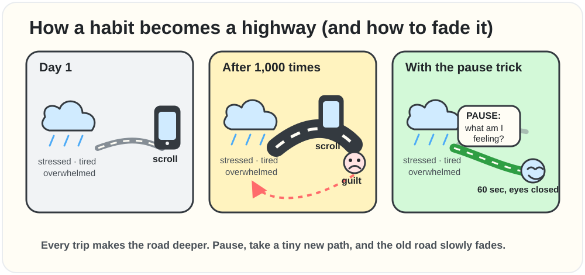

Every trip makes the road deeper. Pause, take a tiny new path, and the old road slowly fades.

**Picture it: the pause trick**

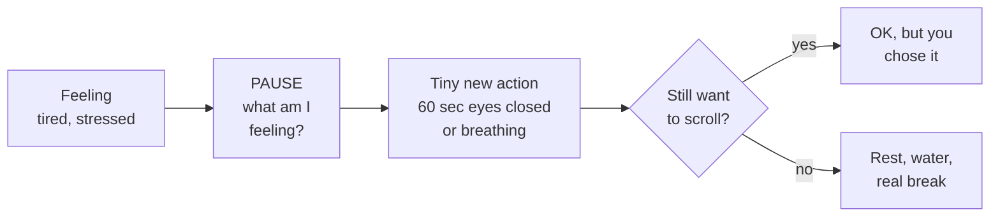

---

## 9. Digital hygiene and why your phone kills productivity

⏱️ [50:32](https://www.youtube.com/watch?v=4Vz6L8B73i4&t=3032s) · Video chapter: “Digital Hygiene: Why Your Phone Kills Productivity” · [⬆️ Contents](#contents)

[51:03](https://www.youtube.com/watch?v=4Vz6L8B73i4&t=3063s) 🧠 **Sahar:** Yeah, there's a lot of habits and a lot of strategies. It kind of depends on We can go through the list.

🎙️ **Raj:** Yeah, tell me the list. What what can an average 25year-old or 35year-old who's watching this can follow in their life which you teach the top executives?

🧠 **Sahar:** Okay. The first and I would say the most pervasive issue that I see in most people's lives right now and in places of work as it relates to productivity is what we call <mark>bad digital hygiene</mark>.

🎙️ **Raj:** Okay. What do you mean by that?

🧠 **Sahar:** So hygiene, right? It's like having clean hands and things like this. Yeah. Bad digital hygiene is having a bad relationship with your digital tools and specifically your notifications. I'll give you an example. You sit down to work. You sit down to focus on something. Where is your phone when you're doing this? Usually

[52:05](https://www.youtube.com/watch?v=4Vz6L8B73i4&t=3125s) 🎙️ **Raj:** It's on my desk like right here.

🧠 **Sahar:** Yeah.

🎙️ **Raj:** Like right now it's not here, but mostly it's

🧠 **Sahar:** Yeah. Yeah. It's right there. Actually, for this I can actually we can do a mini experiment together if you're up for it.

🎙️ **Raj:** Okay, I'm up for it.

🧠 **Sahar:** Okay, cuz there was a study done in UT Austin that I want to share with you.

🎙️ **Raj:** Okay,

🧠 **Sahar:** But we're going to pretend like you are doing you're you're in the actual study itself. You're going to be like one of the participants. Okay.

🎙️ **Raj:** Okay.

🧠 **Sahar:** All right. So, this is your phone. All right. So, in this study, everybody came into the lab. So let's say you're the in the exact same situation, right? You've just come into the lab and what we're going to do, Raj, is we're going to test your general fluid intelligence.

🎙️ **Raj:** Okay. What do you mean by that?

🧠 **Sahar:** It means your mind's ability to hold important information in mind and then get new information and compute with that information without losing the stuff that was already in your mind. Honestly, you you've been doing it this whole conversation. You're amazing at it, but that's why you're successful. So, it's an important skill. Have you noticed some people, it's hard for them to do that? They like lose track of what they were trying to remember and they can't compute the stuff. Yeah. New stuff. Okay. So, there's actually a test for this which I bet you would score really high.

[53:23](https://www.youtube.com/watch?v=4Vz6L8B73i4&t=3203s) 🎙️ **Raj:** Okay.

🧠 **Sahar:** Okay. It's a complex working memory task. And complex working memory is a phenomenal way to test for general fluid intelligence.

🎙️ **Raj:** Okay.

🧠 **Sahar:** I can give you this test later if you like uh for real. But let's say you come into the lab and I want to test that and I want to test your attention span.

🎙️ **Raj:** Okay.

🧠 **Sahar:** Okay. Now you come in and I say, "Okay, you have a phone, right?" All right, great. Go ahead and turn your phone completely off like

🎙️ **Raj:** Like airplane or just

🧠 **Sahar:** No, no, no. Full like dead. Yeah. Not DND, not airplane mode. The side and the button. None.

🎙️ **Raj:** Okay, it's off.

🧠 **Sahar:** Okay, scenario one. Your phone is going to be in another room with me. It's dead. You turned it off. You give it to me. It's going to be in the waiting room. So, I'm going to hold it. You're going to go into the testing room with a computer. You're going to sit down and you're going to hammer out all these tests. We're going to test your intelligence and all these things.

[54:26](https://www.youtube.com/watch?v=4Vz6L8B73i4&t=3266s) 🎙️ **Raj:** Okay.

🧠 **Sahar:** Option two. Scenario two. I you can keep your phone but you have to put it in your pocket.

🎙️ **Raj:** Okay.

🧠 **Sahar:** Or a bag.

🎙️ **Raj:** Okay.

🧠 **Sahar:** Now imagine now you come and you sit down by yourself in the room. Remember your phone is dead.

🎙️ **Raj:** Okay. This off.

🧠 **Sahar:** Yeah. You're not taking a text or something in the middle of the test. You sit down. You do the attention span test. You do all the different tests. Scenario three. You can take your phone out of your pocket, but this time I let you put your phone face down just like where you said it was when you were working. Okay. Face down on the side. Then you're sitting in front of the computer and you're doing all of these assessments.

🎙️ **Raj:** Okay.

🧠 **Sahar:** Okay.

🎙️ **Raj:** Yeah. Okay.

🧠 **Sahar:** In this study, and remember the phone is dead.

🎙️ **Raj:** Yeah. Yeah. Technically, nothing changes in all three scenarios. The phone's dead. You're not using it.

🧠 **Sahar:** Exactly. M

🎙️ **Raj:** It's like having this eraser nearby, right? It's just an object.

🧠 **Sahar:** In this study, we were able to see, and by the way, this is one of the most shocking studies I think I have seen in the last number of years on this topic. Okay? When the phone was visible to you in your visual field, dead but face down off to the side, <mark>scores were significantly decreased across the board</mark>.

> [!NOTE]
> 🔵 **Research note · Phone nearby drains your focus ("brain drain")** · *Partly accurate*
>
> The core study is real: Ward, Duke, Gneezy & Bos (2017, with authors from UT Austin's McCombs School) ran two experiments testing phone location (on the desk, in a pocket/bag, or in another room) and found people did worse on a working-memory test the closer their own phone was, especially if they felt attached to their phone. The "even when switched off" detail is right: in the second experiment some people powered their phones off, and on vs off made no difference; only how close the phone was mattered. More importantly, the finding hasn't held up well since: a 2022 pre-registered replication found zero difference between the phone locations at all, and the largest 2023–2024 meta-analysis (56 studies) found a real effect only for working memory, not for fluid intelligence or attention — while a separate 2023 meta-analysis did find an overall negative effect. So the science is genuinely split, not settled.
>
> **Sources:**
> - Ward, A. F., Duke, K., Gneezy, A., & Bos, M. W. (2017). Brain Drain: The Mere Presence of One's Own Smartphone Reduces Available Cognitive Capacity. Journal of the Association for Consumer Research, 2(2), 140–154. [link](https://doi.org/10.1086/691462)
> - UT News (2017). The Mere Presence of Your Smartphone Reduces Brain Power, Study Shows. The University of Texas at Austin. [link](https://news.utexas.edu/2017/06/26/the-mere-presence-of-your-smartphone-reduces-brain-power/)
> - Ruiz Pardo, A. C., & Minda, J. P. (2022). Reexamining the "brain drain" effect: A replication of Ward et al. (2017). Acta Psychologica, 230, 103717. [link](https://doi.org/10.1016/j.actpsy.2022.103717)
> - Parry, D. A. (2024). Does the Mere Presence of a Smartphone Impact Cognitive Performance? A Meta-Analysis of the "Brain Drain Effect." Media Psychology, 27(5), 737–762. [link](https://doi.org/10.1080/15213269.2023.2286647)
> - Böttger, T., Poschik, M., & Zierer, K. (2023). Does the Brain Drain Effect Really Exist? A Meta-Analysis. Behavioral Sciences, 13(9), 751. [link](https://doi.org/10.3390/bs13090751)

[55:38](https://www.youtube.com/watch?v=4Vz6L8B73i4&t=3338s) 🎙️ **Raj:** Like my attention decreased.

🧠 **Sahar:** Yes, it's the same you, right? Same Raj, same brain, different capability. And think about it's attention span. Raj, it was also general fluid intelligence. That means you're dumber.

🎙️ **Raj:** Literally, if the phone is visible, I'm not even though it's dead.

🧠 **Sahar:** Even though it's dead. Even though it's dead. This is the scary reality of how attention works in the brain. Remember the stories we tell, right? The brain is all about storytelling and narration. All the memories you have using that thing, all of the memories you have, binge watching, talking to friends, making plans, good news, bad news, drama, all these things are happening in the phone, right? For me, like I don't know if you use like Apple Pay, but I'm also like tapping. It's like my payment system. It's like

[56:49](https://www.youtube.com/watch?v=4Vz6L8B73i4&t=3409s) 🎙️ **Raj:** Everything.

🧠 **Sahar:** It's everything. Everything is in the phone. Memories. I have pictures, you know, of my dog. Like all this stuff is on there that I love, right? It's all there. And you know that. Your brain knows that. So if you can see it, it's always going to be thinking, "Oh, I'm remembering all those amazing things and I want to play."

🎙️ **Raj:** Like right now since the time we've spoken about phone, I've been anticipating

🧠 **Sahar:** Really

🎙️ **Raj:** Like a notification will come right

🧠 **Sahar:** But it's dead. It's dead. So here's my recommendation. You should have like a parking lot, a box, something there where you hide your phone. Just put it away so that you don't see it. Bam. Gone. <mark>Out of sight, out of mind.</mark> We don't need it. Right? And this is listen, I'm not saying all the time, but when you want when you want 100% of your intelligence for me, right, I run a business, right? I I do research, I do all these different things. When it's game time, again, remember, treat yourself like an Olympic athlete. If it's game time, it's go time, you're making a big important decision, you're sitting down with your team and you're having a brainstorm, get the phones out of the room because <mark>you're literally lowering the IQ of your whole team</mark>. If you let people have their phones out, the IQ of your employees, the IQ of your team is lower.

[58:08](https://www.youtube.com/watch?v=4Vz6L8B73i4&t=3488s) 🎙️ **Raj:** You're making everybody dumber just by having phone here.

🧠 **Sahar:** Just by having the phone there. And if you care about this, people like you less. There's been lots of really interesting studies that people who hold their phone or put their phone out on the table when they're talking to people and they first meet you, <mark>you seem less trustworthy, um, less capable, less intelligent</mark>, all of these different things.

> [!NOTE]
> 🔵 **Research note · Phone on the table hurts how people see you** · *Partly accurate*
>
> Real studies do show a visible phone hurts conversations: Przybylski & Weinstein (2013) found people felt less close and connected when a phone was present during a chat, especially on meaningful topics; Misra et al. (2016), watching 100 real café conversations, found phone-present talks were rated worse and less empathetic; and Vanden Abeele et al. (2016) found people who texted mid-conversation were judged as less polite and less attentive. Phubbing research (Roberts & David, 2016) shows similar harm in established relationships, but that's about ongoing couples, not first meetings. However, no study found used "less trustworthy," "less capable," or "less intelligent" as actual rating scales, and none focused specifically on first-time meetings with strangers — so those exact words look like a reasonable extrapolation rather than a directly tested finding.
>
> **Sources:**
> - Przybylski, A. K., & Weinstein, N. (2013). Can You Connect With Me Now? How the Presence of Mobile Communication Technology Influences Face-to-Face Conversation Quality. Journal of Social and Personal Relationships, 30(3), 237–246. [link](https://doi.org/10.1177/0265407512453827)
> - Misra, S., Cheng, L., Genevie, J., & Yuan, M. (2016). The iPhone Effect: The Quality of In-Person Social Interactions in the Presence of Mobile Devices. Environment and Behavior, 48(2), 275–298. [link](https://doi.org/10.1177/0013916514539755)
> - Vanden Abeele, M. M. P., Antheunis, M. L., & Schouten, A. P. (2016). The effect of mobile messaging during a conversation on impression formation and interaction quality. Computers in Human Behavior, 62, 562–569. [link](https://doi.org/10.1016/j.chb.2016.04.005)
> - Roberts, J. A., & David, M. E. (2016). "My life has become a major distraction from my cell phone": Partner phubbing and relationship satisfaction among romantic partners. Computers in Human Behavior, 54, 134–141. [link](https://doi.org/10.1016/j.chb.2015.07.058)

🧠 **Sahar** *(continued)*: Why would that be? It's because I'm really saying, listen, you're not so important that I'm going to give up the opportunity to put my attention somewhere else. somebody more important than you might call me. So, I'm going to keep it here in my hand, you know, cuz that's wherever it is. Usually, it's pee in people's hands or like, you know, some I'll like sometimes put it under my arm and carry it that way, you know, whatever. But it's on the table. Two people who have a coffee chat, right? They put it on the table and they sit down and they have their coffee. But it's literally lowering the quality of the conversation. It's lowering the quality of the connection. You know, you're not married yet, are you?

[59:11](https://www.youtube.com/watch?v=4Vz6L8B73i4&t=3551s) 🎙️ **Raj:** No.

🧠 **Sahar:** Okay. Hey, so you're going to be dating. It's also going to lower the quality of your date.

🎙️ **Raj:** No, I don't take that on the dates. *(laughter)*

🧠 **Sahar:** Like, all right, good, good, good.

🎙️ **Raj:** I've learned it on my podcast that days when I have my phone right next to me.

🧠 **Sahar:** Yeah.

🎙️ **Raj:** My attention during the conversation is much lower versus that's why I just always give it to these guys and just, you know, either out of the room or they have it somewhere I don't even care.

🧠 **Sahar:** Yeah.

🎙️ **Raj:** And it's like on airplane mode. The moment you like you entering before even you enter like 30 minutes before you enter just off like it's gone. I don't care.

🧠 **Sahar:** That's such a good habit. I'm so glad you mentioned that. Your listeners need to do that too. It's the same thing. It's the same exact thing. I would also recommend going back to your sleep because now I care about your sleep. Remember I used to coach CEOs and I know I'm like so I'm going to start like coaching you. Bring it back to your sleep. I would ask you to respect your sleep enough because it's going to impact your performance that much too for you to put your phone away 30 minutes before bed.

[1:00:12](https://www.youtube.com/watch?v=4Vz6L8B73i4&t=3612s) 🎙️ **Raj:** Okay.

🧠 **Sahar:** You said you did it 30 minutes before I arrived.

🎙️ **Raj:** Yeah, but this was Yeah,

🧠 **Sahar:** I'm not as important as your sleep. *(laughter)* Raj, your sleep is more important than me. I promise. I promise. Because if you start doing that, oh, you're going to see such a radical shift in your life and in your mindset. And do you want to know something? Okay, here's what I this I'm going to dare you to do this. Okay? And I'm going to follow up with you.

🎙️ **Raj:** Okay?

🧠 **Sahar:** I'm going to dare you to do this. <mark>30 minutes before you go to bed, have a cut off where you have to turn your phone off.</mark>

> [!NOTE]
> 🔵 **Research note · Phone-free window around bedtime** · *Mostly accurate*
>
> Reputable sleep guidance really does recommend a device-free buffer before bed — the Sleep Foundation advises roughly 30–60 minutes of no screens before sleep, citing both mental stimulation and blue light as reasons. A well-known lab study found people reading on a light-emitting e-reader before bed (versus a printed book) took longer to fall asleep, had suppressed melatonin, a delayed body clock, less REM sleep, and were less alert the next morning. A large review of many studies found screen time was linked to worse, shorter, later sleep in kids and teens in the large majority of studies reviewed. That said, no reputable source could be found specifying the exact "15 minutes," "30 minutes after waking," or "don't use your phone as an alarm" details — those seem like reasonable extensions of the general guidance rather than independently documented recommendations.
>
> **Sources:**
> - Sleep Foundation (2024). Sleep Hygiene. [link](https://www.sleepfoundation.org/sleep-hygiene)
> - Chang, A. M., Aeschbach, D., Duffy, J. F., & Czeisler, C. A. (2015). Evening use of light-emitting eReaders negatively affects sleep, circadian timing, and next-morning alertness. Proceedings of the National Academy of Sciences (PNAS), 112(4), 1232–1237. [link](https://doi.org/10.1073/pnas.1418490112)
> - Hale, L., & Guan, S. (2015). Screen time and sleep among school-aged children and adolescents: a systematic literature review. Sleep Medicine Reviews, 21, 50–58. [link](https://doi.org/10.1016/j.smrv.2014.07.007)

🧠 **Sahar** *(continued)*: And then don't turn it back on until 30 minutes after you wake up. If 30 minutes is too much, 15 minutes. 15 minutes before you go to bed off and then after you wake up just let your eyes open because people use the phone as an alarm. It's right next to them. The phone rings. They immediately grab it and then they start. They're still in bed. They're like doing this. They're just like, "Oh,

🎙️ **Raj:** That that's me. Thanks for attacking." *(laughter)* Like that's just

[1:01:15](https://www.youtube.com/watch?v=4Vz6L8B73i4&t=3675s) 🧠 **Sahar:** Got to talk about the truth. Yeah. I didn't know that. But it's this is the reality for so many people though, right? There's no no point in the shame because the shame makes it worse. Remember, it's adding an extra feeling on top of the other feeling. So that feeling in the morning, you're looking for stimulation and it's FOMO. You want to figure out what you missed while you've been sleeping.

🎙️ **Raj:** Yeah.

🧠 **Sahar:** But here, okay, here's my this is why I want you to not look at it for 15 minutes. <mark>First thing in the morning, your brain is in a very delicate and powerful state.</mark> You have an opportunity to reinforce those new beliefs that we were talking about. You have an opportunity to set your brain up for the right mindset, for the right goals, for the right priorities first thing in the morning. When you allow the rest of the world to tell you who you are, where you should be putting your attention. So, hey, there's news over here. Look at this notification. Look at this email. I need this Raj. I need you to send me the Can I see you Tuesday at 3 p.m.

Please confirm. Is that when we're me all this noise? All the noise from the outside is removing an opportunity for your own brain to tell you some amazing idea that's going to unlock something for you because peeps so many people have such amazing clarity and amazing ideas first thing in the morning. But right now across the world I think it's it's a generation of people are losing that like we're missing out. We're missing out on so many things. So the first mistake you asked me the biggest mistake that people are making is bad digital hygiene. They leave their notifications on on their computers. So they sit down on the computer and now we let's say we put the phones away at least, right?

Phone is gone cuz we learned about that. Okay. If you want to be fully focused, you want to have the best productivity, the highest level of effectiveness. You also need to make sure all your other forms of digital hygiene are locked in, dialed in. That means, and let me be clear, most of the CEOs I work with, when I sat down and I would observe them working, you know, I would show up with my clipboard and all of my, you know, observational tools and stuff and I'd be like, "Go ahead. Just I'll be over here watching." They have they immediately open a document, right? Let's say they're getting ready for the board meeting or something. They open up a document, they're looking at a deck, and then bing, what was that?

Okay. And then they go here. They have two monitors. on the other monitor they have like Slack open. Yeah. Constantly pinging like all this stuff and the phone is out and they have an Apple Watch and they're just like doing this thing and it's just like this.

[1:03:50](https://www.youtube.com/watch?v=4Vz6L8B73i4&t=3830s) 🎙️ **Raj:** Yeah.

🧠 **Sahar:** But the brain is literally a focusing machine. Every single time you switch your attention, you pay for it. It's not free.

> 🟡 **Key points · Digital hygiene and why your phone kills productivity**
>
> - <mark>The most common productivity problem she sees, even in CEOs, is **bad digital hygiene**: notifications on, the phone on the desk, Slack pinging on a second monitor, a buzzing smartwatch.</mark>
> - <mark>In the **UT Austin study** she acts out, a phone that was **switched off** but **face-down on the desk** lowered attention and fluid-intelligence scores compared with a phone in another room. Your brain knows everything you love is inside that phone.</mark>
> - <mark>Make a **phone "parking lot"** out of sight for deep work, big decisions and brainstorms. Phones on the table make the whole team think worse, and make **you** look less trustworthy and capable in conversations (and on dates).</mark>
> - <mark>Raj already does this: his phone leaves the room about 30 minutes before a recording.</mark>
> - <mark>**Her dare:** phone **off 30 minutes (or 15) before bed**, and on again only **30 minutes after waking**. The morning brain is "delicate and powerful", so use it for your own goals and ideas, not other people's notifications.</mark>

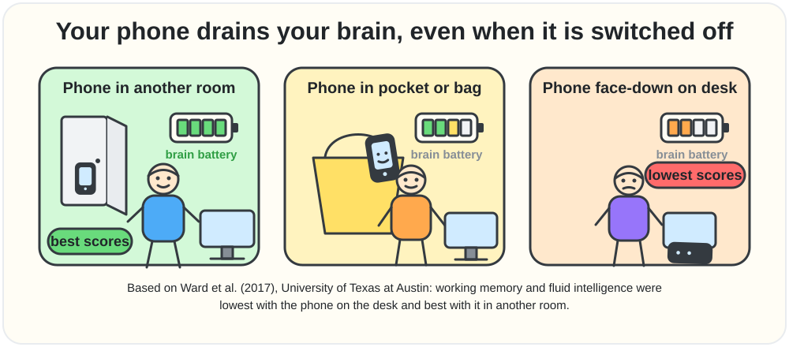

The closer and more visible the phone, the lower the scores in the study she describes.

---

## 10. Why your brain cannot multitask

⏱️ [1:03:53](https://www.youtube.com/watch?v=4Vz6L8B73i4&t=3833s) · Video chapter: “Why Your Brain Can't Multitask” · [⬆️ Contents](#contents)

[1:04:02](https://www.youtube.com/watch?v=4Vz6L8B73i4&t=3842s) 🎙️ **Raj:** What do you pay for it? How do you pay? What's the price?

🧠 **Sahar:** I'm glad you asked. <mark>You pay for it in time and you pay for it in energy.</mark> And if you don't believe me, we can test it out.

🎙️ **Raj:** Go ahead.

🧠 **Sahar:** Yeah.

🎙️ **Raj:** Tell me. Yeah.

🧠 **Sahar:** Okay. Grab a piece of paper. You have some paper and a pen. So, on this piece of paper, we're just going to draw two lines. There you go. Okay. Now, on the top line, I want you to write, I am a great multitasker, but don't start yet. Okay? And then on the bottom line, I want you to write the numbers 1 through 20.

🎙️ **Raj:** 1 through 20.

🧠 **Sahar:** 1 through 20. I want you to go as fast as you can. Okay. And then I'm going to time you. I'll hide the phone so that you're smart as possible. No excuses. Okay. Right.

🎙️ **Raj:** I'm a great multitasker. And 1 to 20.

🧠 **Sahar:** Exactly. And I want you to go as fast as you can. I'll read the times out out loud and then and then you can go for it. Okay. And then actually, how about this? I won't read them out loud. I'll you just focus.

🎙️ **Raj:** Okay.

🧠 **Sahar:** Okay. Cuz we'll have the timer going up there. I'll watch you and I'll stop the time when you finish. Okay. Get ready. Get set. Go. 17.72. Super fast. Cool. Now, turn this paper around. Awesome. Draw two more lines. You're going to do this one more time. Okay. You're going to end with the same outcome. So the output at the end is going to be I'm a great multitasker 1 through 20. But the way in which you will arrive will be very different. Okay? You're going to alternate. You're going to start at one at the at the top line. You're going to write you're going to write the letter I. You're going to drop down to the bottom line. Write the number one. Back up to the top line. Letter A. And then down to the bottom line number two. Back up to the top line

[1:06:07](https://www.youtube.com/watch?v=4Vz6L8B73i4&t=3967s) 🎙️ **Raj:** After every letter.

🧠 **Sahar:** Mhm.

🎙️ **Raj:** Okay.

🧠 **Sahar:** You're going to go back and forth until you finish both lines.

🎙️ **Raj:** Okay.

🧠 **Sahar:** Okay. Now listen. If you think, hold on, I'm going to lose time, right? Going back and forth like meaning just my hand moving, right? You can, if you want, you can draw one extra long line, but you have to still alternate. So that means you still have to write in in between I one 2 A. Okay. All right. But I just want to give you options. Get ready. Get set.

🎙️ **Raj:** Yeah.

🧠 **Sahar:** Go. You got this. This is where you guys need to overlay some fun music.

[1:07:19](https://www.youtube.com/watch?v=4Vz6L8B73i4&t=4039s) 🎙️ **Raj:** Done.

🧠 **Sahar:** 40 seconds. <mark>So, you went from 17.72 to 41.35.</mark>

> [!NOTE]
> 🔵 **Research note · The multitasking demo (write a sentence + count 1–20)** · *Mostly accurate*
>
> This exercise (write "I am a great multitasker," then count 1–20, first in order and then alternating letter/number) is a well-known training demonstration most associated with Dave Crenshaw's 2008 book "The Myth of Multitasking" (it even has a chapter called "The exercise"), and versions of it circulate widely among other trainers too — it's a teaching demo, not itself a peer-reviewed experiment, but the "takes much longer when alternating" direction matches real research. The real science behind it is solid: Rubinstein, Meyer & Evans (2001) ran task-switching experiments and found genuine time costs every time people switch tasks, growing with task complexity and unfamiliarity. The APA's own public page on "switching costs" repeats a claim that "as much as 40 percent" of someone's productive time can be lost to task switching — but this is presented as an informal estimate from researcher David Meyer, not an exact number from one specific study.
>
> **Sources:**
> - Crenshaw, D. (2008). The Myth of Multitasking: How "Doing It All" Gets Nothing Done. Jossey-Bass.
> - Rubinstein, J. S., Meyer, D. E., & Evans, J. E. (2001). Executive control of cognitive processes in task switching. Journal of Experimental Psychology: Human Perception and Performance, 27(4), 763–797. [link](https://doi.org/10.1037/0096-1523.27.4.763)
> - American Psychological Association (2006). Multitasking: Switching costs. [link](https://www.apa.org/topics/research/multitasking)

🎙️ **Raj:** More than double.

🧠 **Sahar:** More than double. So, and I have a question. We all saw, but did you ever make any mistakes?

🎙️ **Raj:** Oh, yeah. A lot. *(laughter)*

🧠 **Sahar:** Okay. So, this goes

🎙️ **Raj:** Because this time I was focused on like just Yeah. Like my brain was not able to comprehend like two things at the same time.

🧠 **Sahar:** Yeah. Well, really, your brain can't. This is the point I want to make.

🎙️ **Raj:** So, you're saying nobody can be a good multitasker?

🧠 **Sahar:** No. No. Listen, what you're there's let me and let me let's be clear. Let's define what we're talking about here. When people talk about multitasking, the way they talk about it is as if they're doing two different things with full fidelity at the same time. That's how they talk about it.

🎙️ **Raj:** Yeah.

🧠 **Sahar:** When they talk about multitasking, they're like, "Yeah, yeah, I'm doing this and I'm doing this."

[1:08:24](https://www.youtube.com/watch?v=4Vz6L8B73i4&t=4104s) 🎙️ **Raj:** Yeah.

🧠 **Sahar:** Okay. How many brains do you have?

🎙️ **Raj:** One.

🧠 **Sahar:** Yeah. Okay, that how many attention systems do you have? Like you have one of everything.

🎙️ **Raj:** Yeah.

🧠 **Sahar:** Okay. So you don't have two brains. You cannot say with my full Raj brain 100% performance I am 100% doing this and at the same time I am 100% doing this. You don't have two 100s. You have one 100. So if you want you can take your 100% like a pie chart. You can dice it up. You could say 50/50. 50% of my attention is on this, 50% on this, 8020, 7030, 6040. No matter what your split is, you're splitting your attention. It's split. So, when we talk about multitasking, the way people talk about it, they Yeah. Yeah. I have my phone here, but I'm not looking. I have my email open, but I'm focused here. When the notif comes up, no, you I see you go.

You look. Even when you're on calls with people, you're like on a Zoom call with somebody and you're look, they're looking at you and then all of a sudden you see their eyes go down and up again.

[1:09:29](https://www.youtube.com/watch?v=4Vz6L8B73i4&t=4169s) 🎙️ **Raj:** Yeah.

🧠 **Sahar:** Come, we can all see you, right? Nobody's that slick. The people think like nobody's going to notice. You know, you said, "Yeah, because you've seen other people do it. I've seen other people do it. Everyone's doing it." And they think that I can see when other people are doing it, but nobody can tell when I do it cuz I'm fast. No, we can all see. My point here is that it's not your choice. It's not your choice to pay attention or not pay attention to distractions when they come up. The way that the brain works is <mark>it's a monotasking machine, not a multitasking machine</mark>. It is designed to focus on one thing. Now, does that mean you can never do two things at once?

No, of course not. Listen, in my car, um, I listen to podcasts. I sometimes make calls. I call my mother. You know, I call my mom on on the on the my way somewhere. I have her on speaker, you know, and I'm driving. But listen, in that moment, I'm going to be honest with you because this is just as a neuroscientist, I can just tell you this is how the brain works. I am not 100% focused on the road.

[1:10:39](https://www.youtube.com/watch?v=4Vz6L8B73i4&t=4239s) 🎙️ **Raj:** Yeah.

🧠 **Sahar:** Otherwise, it's imp I'm not going to hear my mom. I don't I'm not going to listen to anything she's saying. Which, listen, that's a whole another conversation about mom's. She's like complaining on my knee, my back, my this, my that. You didn't you need to come home, blah, blah, blah, all these things. Okay, that's a different story cuz it's always the same stories. But the point here is that for sure it's not possible for me to 100% focus on the conversation and 100% focus on the road because I know where I'm going in my hometown. Honestly, it's like,

🎙️ **Raj:** Yeah, it's like an autopilot. They're just going there.

🧠 **Sahar:** Bingo. So my point is listen, it's nuance. I'm not saying Raj you can never do two. Yeah. Yeah. Sure you can. But you just have to know the math. You have to understand the biological laws. You have to know what you're doing. Be strategic about it. Be strategic about it. Now you know that if you And by the way, what you did just now Oh, yeah. What you did here, this is not multitasking because that's impossible. Again, remember multitasking the way it's defined, I you did 100% one thing and 100% another thing. That's not possible here. What you're doing and what is possible, what happens in everybody's brains, yours, mine, everyone's, is <mark>something called task switching</mark>,

[1:11:53](https://www.youtube.com/watch?v=4Vz6L8B73i4&t=4313s) 🎙️ **Raj:** Context switching essentially.

🧠 **Sahar:** Yeah, this we do all the time. But every single time you switch your attention from A to B, B to C, C to D, all of the different one thing to another, to the Apple Watch to the phone to the back to the document and back to the thing, and then what? Oh, somebody came in my office. What did you want? But every single time you switch your attention, there's a payment, a biological payment. So the brain pays for it in time. As you noticed, more than double. It's not for free. Takes more time. And time is limited. Time is money. And the second thing that it takes is energy. You're going to exhaust yourself more. And every single time, and listen, this was easy.

Whose job is this easy? You want to build an empire? You want to build a company? you want to cure cancer. Nothing is this easy. So when you're doing something hard and you really want to do good, you have to respect yourself enough to put the distractions out of sight, out of mind, notifications off, no email open, no phone next to you, no notifs available, and actually focus on the thing in front of you. And in the beginning, if you're not used to it, it's going to be difficult. It's going to be painful. Your mind's going to be all over the place, but you just need to get your muscles hard again. You need to get your muscles strong.

[1:13:06](https://www.youtube.com/watch?v=4Vz6L8B73i4&t=4386s) 🎙️ **Raj:** But what about people who are good at multitasking? Is there someone like that or is it just a myth?

🧠 **Sahar:** Do you want to know something really funny?

🎙️ **Raj:** Mhm.

🧠 **Sahar:** There was a study done at Stanford that I'll send you. So there they're smart smart kids. Young healthy brains. Do you know what I mean? Sharp. Okay. No excuses. You can't be like they're just they're dumb. No, no. We we got we got good ones. This study on multitasking asked people upfront, "Are you a good multitasker?" The people who said yes confidently, "Oh yeah, I'm great at it." <mark>They were actually worse when they tested them.</mark>

> [!NOTE]
> 🔵 **Research note · Confident "multitaskers" test worse — but which study?** · *Partly accurate*
>
> The specific finding — people who rate themselves as great multitaskers doing worse when actually tested — is real, but it comes from a University of Utah study (Sanbonmatsu et al., 2013), not Stanford. In that study, people's self-rated multitasking skill barely matched their real test performance, and the people who multitasked most in daily life (like texting while driving) scored worst on an objective test while rating themselves as most skilled. The actual Stanford study (Ophir, Nass & Wagner, 2009) tested something different: it compared heavy vs. light media-multitaskers based on a habits questionnaire (not self-rated confidence) and found heavy multitaskers were worse at filtering distractions and switching tasks — so the podcast appears to blend the two studies together. Also worth knowing: a 2017 replication attempt of the Stanford study found only weak, inconsistent support, with just 2 of 14 original comparisons holding up under stricter testing.
>
> **Sources:**
> - Sanbonmatsu, D. M., Strayer, D. L., Medeiros-Ward, N., & Watson, J. M. (2013). Who multi-tasks and why? Multi-tasking ability, perceived multi-tasking ability, impulsivity, and sensation seeking. PLOS ONE, 8(1), e54402. [link](https://doi.org/10.1371/journal.pone.0054402)
> - Ophir, E., Nass, C., & Wagner, A. D. (2009). Cognitive control in media multitaskers. Proceedings of the National Academy of Sciences, 106(37), 15583–15587. [link](https://doi.org/10.1073/pnas.0903620106)
> - Wiradhany, W., & Nieuwenstein, M. R. (2017). Cognitive control in media multitaskers: Two replication studies and a meta-analysis. Attention, Perception, & Psychophysics, 79(8), 2620–2641. [link](https://doi.org/10.3758/s13414-017-1408-4)

🧠 **Sahar** *(continued)*: That's crazy. It's like a joke. It's like science jokes, right? It's absolutely mind-boggling, but it's so fascinating.

🎙️ **Raj:** Why? Well, unknown to be, you know, this random belief they've built about themselves.

🧠 **Sahar:** It could be because if you multitask so much, by the way, you try because again, we talked about it. You're just context switching all the time. Your brain is just foggy. I don't think you see straight. I think this is the problem with most companies right now. Most people are just bouncing back and forth and they think this is normal and they just go like, "Oh, it's hard for me to focus. Maybe I have ADHD. Come on. Every 80% of the population all of a sudden has ADHD.

> [!NOTE]
> 🔵 **Research note · Distracted is not the same as ADHD**
>
> ADHD is a real neurodevelopmental condition, and it is far rarer than "80% of people": a global meta-analysis estimated about **2.6%** of adults have ADHD that persisted from childhood and about **6.8%** have symptoms of it. Phone-driven distraction can feel similar, but only a clinician can tell them apart. If focus problems are hurting your life, get a proper assessment instead of self-diagnosing either way.
>
> **Sources:**
> - Song, P., et al. (2021). The prevalence of adult attention-deficit hyperactivity disorder: A global systematic review and meta-analysis. *Journal of Global Health*. [link](https://doi.org/10.7189/jogh.11.04009)

[1:14:31](https://www.youtube.com/watch?v=4Vz6L8B73i4&t=4471s) 🎙️ **Raj:** Why everybody has started saying this? Every like it's just like 50 things because of the scrolling.

🧠 **Sahar:** That's why because our attention spans are shot. This is actually some of the re recent research I've started doing. Truly attention spans have just gotten worse and worse and worse. And the more you scroll, and it's by the way, it's not all scrolling. And I'm not just giving like, you know, your podcast a a pat on the back here. This is actually the the research supports this. <mark>There is a massive difference between long form and short form media.</mark> <mark>The short form media is truly like garbage and candy for the brain.</mark> It is it's like junk food. That's what I mean. So the how would your body feel if you fill it with junk food? Not so good. Listen, am I saying sometimes we don't have some junk food?

Oh, for sure. No problem. You know, you got to live a balanced life. You know what I mean? Life is short. Enjoy it a little bit. You know, do it's okay. But if your whole diet is junk food, if you eat junk food every day, what's going to happen in one year? Not so good. Bad things.

[1:15:38](https://www.youtube.com/watch?v=4Vz6L8B73i4&t=4538s) 🎙️ **Raj:** Yeah.

🧠 **Sahar:** So, this is this this relationship that we have with our phones, our devices, our email. This is it's not I don't want people to think I'm just talking about just Tik Tok either. People are addicted to email. They're addicted to WhatsApp. They're addicted to messaging and communicating constantly all the time 24/7. And that never allows them to come up with ideas. Hear what's going on inside of them. All of the stuff we talked about before, the self-awareness. You want to train your brain. That takes effort. That takes awareness. That takes focus. You want to build an empire. you want to build a business, you want to do all these things, that takes focus.

And when we've removed the ability to focus, this is why everybody thinks they have ADHD because they're not listening to their biology. Again, it's like the laws like the brain works. We just tested you. Everybody who's listening, you believe that Raj is super smart. Obviously, that's why you're listening. That's why he's so successful. Even you couldn't do it. You more than doubled your time and you made mistakes. So think about how you work now. When you take this to your life, when you take this to your business, everybody who's listening, right? When you think about how you work, if you work d constantly, I'm sitting down f and then I check this and I check that.

If you're doing it that way, you're going to make more mistakes and it's going to take you double the amount of time to get to your goals. You choose. I'm going to choose the way that's going to be fast for me. But this is what makes the people that are ultra successful different from everybody else. <mark>They just choose differently.</mark> They think about it. They're aware about it. Like, hold on a second. What you said, you said beautifully, I notice the days when I'm on my phone, it's harder for me to focus. So, when we're shooting, when the guest is right, I tell the guys, I turn it off and I tell the guys, get it out of here. You are in a beautiful example of a CEO that has figured it out. Everybody else can do the same for themselves.

[1:17:14](https://www.youtube.com/watch?v=4Vz6L8B73i4&t=4634s) 🎙️ **Raj:** So, you're telling me that a lot of people think that ultra successful people have better ideas, but you're telling that they don't have better ideas. They just know how to protect their attention so that they can get ideas. Is that what you're saying?

🧠 **Sahar:** They have more ideas. It's like fishing. I can tell you this. This is the science of innovation and creativity. Every, by the way, inventor will tell you this. inventors, artists, engineers, people who build, people who come up with like crazy ideas, they'll tell you for every one good idea, they had 1 million ideas. This it's a numbers game. You have to become like an idea machine. It's it's a muscle. If you're exercising your idea muscle every single day, you allow your mind to explore and wander and you give it time and space to do it. Listen, you're going to come up with a lot of stupid ideas. That's okay. You have to. It's a process, right? One day after another and then finally you're going to hit.

> 🟡 **Key points · Why your brain cannot multitask**
>
> - <mark>The brain is a **monotasking machine**. You have one brain and one attention system, so you can **split** your 100% (50/50, 80/20) but never do two things at 100% each.</mark>
> - <mark>What people call multitasking is really **task switching** (context switching). **Every switch costs time and energy.**</mark>
> - <mark>Raj's test: writing the two lines one after the other took **17.72 s**; alternating letter/number took **41.35 s**, more than double, with more mistakes.</mark>
> - <mark>Some things can run side by side on autopilot, like driving a familiar route while on a call. Just know the cost and choose deliberately.</mark>
> - <mark>A study found that people who were **most confident** about their multitasking did **worse**. Scrolling has damaged attention spans so much that many people wrongly assume they have ADHD.</mark>
> - <mark>Short-form media is **junk food / candy for the brain**, and email and WhatsApp can be just as addictive. Ultra-successful people **"just choose differently"**: they protect their focus.</mark>

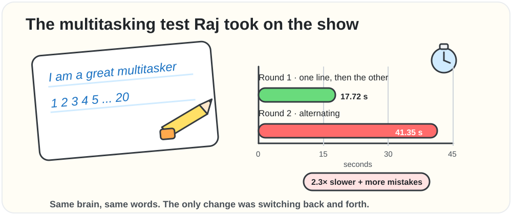

Try it yourself: time both rounds on a piece of paper.

---

## 11. Mind-wandering creativity and shower thoughts

⏱️ [1:18:42](https://www.youtube.com/watch?v=4Vz6L8B73i4&t=4722s) · Video chapter: “Mind-Wandering, Creativity & "Shower Thoughts"” · [⬆️ Contents](#contents)

[1:18:42](https://www.youtube.com/watch?v=4Vz6L8B73i4&t=4722s) 🎙️ **Raj:** So, what should I do? How how can someone become a person who gets incredible ideas all the time?

🧠 **Sahar:** Okay, you ready? This is my number one recommendation. You might not like it or you might be surprised.

🎙️ **Raj:** Okay.

🧠 **Sahar:** Be bored. <mark>be bored and do nothing</mark>

🎙️ **Raj:** And you get ideas like that.

🧠 **Sahar:** And you get ideas. Let me explain. <mark>Ideas, new ideas often come when we are mind wandering.</mark>

> [!NOTE]
> 🔵 **Research note · Is the default mode network your "idea machine"?** · *Partly accurate*
>
> The "get bored, let your mind wander" half checks out well — a 2014 study found people who first did a boring task came up with more, and better-rated, creative ideas afterward than people who didn't. But "the DMN is your idea machine" oversimplifies things: a well-known 2018 brain-scanning study of 163 people found creative ability was predicted not by the default mode network alone, but by a specific pattern connecting the default, salience, and executive-control networks together — networks that usually work against each other. The current view is more like teamwork: the DMN helps generate raw ideas while the executive network helps evaluate and refine them, rather than the DMN acting as a solo "idea machine."
>
> **Sources:**
> - Beaty, R. E., Kenett, Y. N., Christensen, A. P., Rosenberg, M. D., Benedek, M., Chen, Q., Fink, A., Qiu, J., Kwapil, T. R., Kane, M. J., & Silvia, P. J. (2018). Robust prediction of individual creative ability from brain functional connectivity. Proceedings of the National Academy of Sciences, 115(5), 1087–1092. [link](https://doi.org/10.1073/pnas.1713532115)
> - Beaty, R. E., Benedek, M., Silvia, P. J., & Schacter, D. L. (2016). Creative Cognition and Brain Network Dynamics. Trends in Cognitive Sciences, 20(2), 87–95. [link](https://doi.org/10.1016/j.tics.2015.10.004)
> - Mann, S., & Cadman, R. (2014). Does Being Bored Make Us More Creative? Creativity Research Journal, 26(2), 165–173. [link](https://doi.org/10.1080/10400419.2014.901073)

🧠 **Sahar** *(continued)*: That goes back to the neural network that I talked about earlier, the DMN, the default mode network. That's what that when that is active your brain is creating. Remember in the beginning I said it's the storyteller in the brain. It's the storytelling machine. It's the area of the brain and the a areas of the brain that are all about narration and ideas. So that's your idea machine. You need to allow the DMN to actually become active. <mark>Now the opposite of the DMN is the central executive network, the CEN.</mark> Okay. And it I mean listen to the sound of it. The central executive network. What do you think? It's like the CEO.

[1:20:04](https://www.youtube.com/watch?v=4Vz6L8B73i4&t=4804s) 🎙️ **Raj:** Yeah.

🧠 **Sahar:** What's the goal?

🎙️ **Raj:** Operator.

🧠 **Sahar:** It's the operator. Beautifully said. It's the project manager. What are we doing? What's the goal? And then anytime it's also in charge of inhibition. So inhibition is uh suppressing the things that seem distracting. Listen, I'm on my target. I got to focus on this. So if you're telling me, hey, hey, sire, what about this idea? Shh, I don't want to hear about ideas. I got to I'm doing this focus. That's your central executive network and you need it. And it's mostly frontal areas, right? Because this is where a lot of your executive functioning is is happening in the first place. So you've got all these different this neural network that's again responsible for get done, right?

Focus and do stuff. The opposite of that is the DMN. And the DMN is again all about stories, daydreaming, being bored, let your mind wander. When you daydream, that's when a bunch of ideas can finally come and float to the surface. So the first step is you have to find time and space to be bored, to be bored, to daydream, to let your mind wander. Because again, remember, it's easy to remember and understand why. What's the opposite of that? Get stuff done. What idea are you gonna have when you're like on a deadline to get done if you're busy all of the time? And then what what do people do when they're not working? What when are you what how is your brain going to shove an idea into your into your in front of you, right?

How <mark>you have to let those ideas come to you by cultivating the space for them</mark>. You have to make the space for them. So the most creative people, the most amazing innovators, by the way, they force themselves to sit down. Some people call it think time. Some one of the guests you had on the show, I think Bill Gates, um, uh, he was really famous by having a think week, I believe it was, you know, whole week he takes off. No busy work, just to think, see what ideas come. It was actually during his one of his think weeks that he decided that the internet is not a fad.

> [!NOTE]
> 🔵 **Research note · Bill Gates's "Think Weeks" and the internet memo** · *Partly accurate*
>
> Gates's "Think Week" is real: twice a year he secluded himself for about a week in a cabin, reading papers and proposals submitted by Microsoft staff, alone except for a caretaker delivering meals — documented in a well-known 2005 Wall Street Journal profile. But the claim that a Think Week specifically produced his famous May 1995 "Internet Tidal Wave" memo looks like an oversimplified, commonly-repeated story rather than a documented fact. Histories of Microsoft trace that memo instead to roughly a year of internal advocacy from employees (including reports of how internet-soaked college campuses had become), and the memo's own text explicitly says Gates wasn't "alone in seeing this" — crediting many people's work over the prior year rather than one solitary week of reading.
>
> **Sources:**
> - Guth, R. A. (2005). In Secret Hideaway, Bill Gates Ponders Microsoft's Future. The Wall Street Journal. [link](https://www.wsj.com/articles/SB111196625830690477)
> - Gates, B. (1995). The Internet Tidal Wave [internal Microsoft memo, May 26, 1995]. Full text hosted by Wired. [link](https://www.wired.com/2010/05/0526bill-gates-internet-memo/)
> - History of Microsoft. Wikipedia. [link](https://en.wikipedia.org/wiki/History_of_Microsoft)

🧠 **Sahar** *(continued)*: Can you imagine if Bill Gates didn't realize that decades ago? So these ideas come, we have to give them the space to come and that requires discipline because right now distraction is making money for these tech companies like crazy. <mark>Welcome to the distraction economy.</mark> So, it's keeping everybody stuck. It's keeping everybody stuck in their old loops. Because also, this is how the algorithm works. The algorithms that you're doom scrolling on, that you're binge watching on, the way they work is they're going to show you stuff that you like. They're going to show you more of the same. <mark>If you want to become a different version of you, you need to change your content.</mark>

Your content is actually a great example of this. a lot of other awesome podcasts that are educational, right, about like how do I become better? How do I level myself up? If you all you're do when you're binge watching, if you're all it's just bad news, this that just like whatever, you will become more of that because what you're doing is you're just

[1:23:23](https://www.youtube.com/watch?v=4Vz6L8B73i4&t=5003s) 🎙️ **Raj:** True

🧠 **Sahar:** The same stories over and over again. You want to start to become a different version of you, a better version of you, you should also change your algorithm. We call this by the way in the classes I teach changing your content diet.

🎙️ **Raj:** Yeah. And that's very important. I call it bloom scrolling.

🧠 **Sahar:** Oh, I love that.

🎙️ **Raj:** Yeah. So, it's like how you have doom scrolling. You curate your feed in a way which is bloom scrolling so that it makes you better, not actually messes up you messes up your entire system.

🧠 **Sahar:** Yeah, it's a beautiful way to put it. So, you got to give yourself think time. Even if it's bloom or doom, you got to put it away a little bit and then just give your mind and space to breathe. The next thing that's going to be important, and this is kind of fun. Have you ever have you heard of um that anecdote that people have awesome ideas in the shower?

🎙️ **Raj:** Yeah.

🧠 **Sahar:** You've heard of Have you ever had?

🎙️ **Raj:** Of course.

🧠 **Sahar:** Really?

🎙️ **Raj:** Yeah. So many times.

🧠 **Sahar:** Okay. Hey, do you know the science behind it?

🎙️ **Raj:** No.

🧠 **Sahar:** You want to learn?

🎙️ **Raj:** Yeah, of course. I want to learn all the science in the world. Tell me.

[1:24:26](https://www.youtube.com/watch?v=4Vz6L8B73i4&t=5066s) 🧠 **Sahar:** Okay. So this is the science behind shower thoughts, shower ideas that so many people have. I've had the same thing as well. So the way that the brain works is you're loading up, let's say, remember the neural networks I talked about before, right? So let's say you've got this pattern of electrical activation happening in the brain, right? These neural networks that are on different brain areas, all of this stuff. So you have this pattern of electrical activation. Let's say it looks like this, okay? Some gridlock. Let's say this is your brain thinking about a problem. So you're there and you're thinking about this problem in your head right now. What's in my brain?

🎙️ **Raj:** The problem.

🧠 **Sahar:** The problem stuck. Yeah. Where's the solution? If I want a solution to the problem, I actually have to move these networks around. I have to get different electrical activity.

🎙️ **Raj:** Yeah.

🧠 **Sahar:** To happen because my brain's occupied with this. Mhm. It's focused on the problem. So this is how you do it. This is the best way I teach all of the business leaders I work with this. <mark>You load up all of the data and the information that you need that's about the problem.</mark> You think about the problem. You understand the problem. You look at all the data related to the problem. Load it all up. <mark>Then walk away.</mark> You're going to sit there be like, "Okay." And then what do we do? What's the solution? What's the solution? I don't know. I don't know. I don't know. Get up and do something else. When you do something else, you're at least introducing a new variable.

You're at least saying, "Hey, drink some water." At least, seriously, something as small as this. Because anything you do, anything you touch, smell, drink, listen, listen to a different playlist, different music, get up and move to another room. If you're sitting at your desk and you're always working at your desk and you're like, "This is my focus. This is where I'm at." And you're just like, "This is the problem." The problem is also here. It's in your all of the associations that you've built up with that problem. Change the environment. So when people finally go on a walk or they go take a shower, they've loaded all the data there. So the the neural networks related to the problem are still active or they're recently at least active.

So then you get in the shower and you introduce new variables. Now you're not scrolling either because again the scrolling is a distraction. If you distract yourself with I got to text these people back. I got to get on WhatsApp. I gota all these things.

[1:26:50](https://www.youtube.com/watch?v=4Vz6L8B73i4&t=5210s) 🎙️ **Raj:** Yeah.

🧠 **Sahar:** You're not going to solve any problems because now you're just doing more stuff.

🎙️ **Raj:** True.

🧠 **Sahar:** You're doing more stuff. You have to not do stuff to give your brain space to say, "Wait a minute, light bulb." Because the problem was still there and active. And then you're introducing new variables, whatever they may be. Have a little sip of water. put some water on your face. Whatever it is, you got to do something different. And then your brain goes at some point, oh, I got it.

🎙️ **Raj:** And that's why you because you're mindlessly just standing in sh all of a sudden you get that because you're not focused on problem anymore.

🧠 **Sahar:** Yeah. You loosened a little bit and you introduced new data. You introduced new variables and new data. It could be on a walk. You could start cooking dinner. You know, you could go exercise, go on a run, you know, whatever, whatever you want to do, <mark>but not something so immersive that you can't keep thinking about the other thing</mark>.

> [!NOTE]
> 🔵 **Research note · Shower thoughts and creative incubation** · *Accurate*
>
> This matches the research well. In a 2012 study, people first tried a creative task, then took a break doing either an easy/undemanding task, a hard task, quiet rest, or nothing — and the easy-task group, whose minds wandered the most, improved the most on the creative task afterward. A large review of many incubation studies confirms that stepping away from a problem reliably helps, especially for creative (not purely logical) problems, and that low-effort break activities help more than high-effort ones — matching "not too immersive." One small caveat: these studies used simple lab tasks to stand in for real-life activities like showers or walks, so the everyday examples (shower, cooking, walk) are a reasonable but extrapolated translation of the findings.
>
> **Sources:**
> - Baird, B., Smallwood, J., Mrazek, M. D., Kam, J. W. Y., Franklin, M. S., & Schooler, J. W. (2012). Inspired by Distraction: Mind Wandering Facilitates Creative Incubation. Psychological Science, 23(10), 1117–1122. [link](https://doi.org/10.1177/0956797612446024)
> - Sio, U. N., & Ormerod, T. C. (2009). Does incubation enhance problem solving? A meta-analytic review. Psychological Bulletin, 135(1), 94–120. [link](https://doi.org/10.1037/a0014212)

🧠 **Sahar** *(continued)*: This is so don't like go sit down and watch a movie. Do you see what I'm saying? Unless you want to watch a movie you've seen 1,000 times. Do you know how like you can still think? Well, you now you get it. This explain See, there's neuroscience to explain all of these human experiences we have. If you're watching a rerun of an old, you know, sitcom you've seen like a million times, it's kind of soothing because you can kind of, you're not really just focused and paying attention. You're letting your mind wander a little bit.

[1:28:23](https://www.youtube.com/watch?v=4Vz6L8B73i4&t=5303s) 🎙️ **Raj:** Yeah.

🧠 **Sahar:** But when you're scrolling, it's all novel. So, it's designed by people like me, by the way, cognitive neuroscientists, people like me who are hired by these companies. <mark>We use everything we know about how to capture your attention and keep your attention to make money off of you.</mark> It's all embedded in how all of these things work.

> 🟡 **Key points · Mind-wandering creativity and shower thoughts**
>
> - <mark>Ultra-successful people have **more** ideas, not necessarily better ones. Creativity is a **numbers game**: for every good idea there are many bad ones, so become an "idea machine".</mark>
> - <mark>Her number-one tip: **be bored and do nothing.** New ideas arrive when the mind wanders, which is when the **DMN** (storyteller / idea network) is active. Its opposite is the **CEN** (central executive network), the "CEO" that focuses and shuts out distractions.</mark>
> - <mark>Make space on purpose: schedule **think time**. She tells the story of Bill Gates' **think weeks**.</mark>
> - <mark>Tech companies earn money from the **distraction economy**, and algorithms show you more of the same. To become a different person, **change your content diet**. Raj calls it **"bloom scrolling"** instead of doom scrolling.</mark>
> - <mark>**Shower-thought method:** 1) load up all the data about the problem, 2) **walk away**, 3) add new variables (water, a walk, a shower, cooking, another room, different music). Pick something **not too immersive**: no scrolling and no new movie (an old rerun is fine).</mark>

**Picture it: the shower-thought recipe**

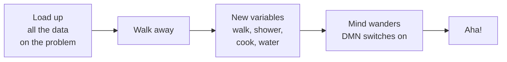

| Network | Nickname in the episode | Its job | How to switch it on |
|---|---|---|---|
| DMN, default mode network | the storyteller, the idea machine | stories, identity, daydreams, new ideas | boredom, walks, showers, doing nothing |
| CEN, central executive network | the CEO, the operator, City Hall | goals, focus, saying "shh" to distractions | one clear task, no notifications |

---

## 12. Long-form vs short-form and how content affects your brain

⏱️ [1:28:42](https://www.youtube.com/watch?v=4Vz6L8B73i4&t=5322s) · Video chapter: “Long-Form vs. Short-Form: How Content Affects Your Brain” · [⬆️ Contents](#contents)

[1:28:42](https://www.youtube.com/watch?v=4Vz6L8B73i4&t=5322s) 🎙️ **Raj:** Explain me what's happening to a person when they're consuming long- form content versus what's happening when they're consuming only short form content. Like what what's going on in the brain? Like if you have to draw parallels to long form brain and short form brain.

🧠 **Sahar:** Yeah. Well, it also depends on the content. Could I'll say that we've we've seen like negative content like the news honestly. Like I'll say something about the news briefly. News media also knows what sells and what captures attention.

🎙️ **Raj:** Yeah. That's why they do the negative stuff.

🧠 **Sahar:** Yeah. <mark>Cuz bad news, rage bait, it works.</mark>

> [!NOTE]
> 🔵 **Research note · Negativity drives news clicks** · *Accurate*
>
> A huge experiment on 105,000+ real Upworthy.com headline variants (5.7 million clicks) found that each extra negative word in a headline raised the click-through rate by about 2.3%, while positive words slightly lowered it — this was run as randomized trials, so it's genuinely causal evidence, not just a correlation. This lines up with decades of psychology showing that "bad is stronger than good": people notice, weight, and remember negative information more than positive information of the same size. All three papers checked out exactly as claimed.
>
> **Sources:**
> - Robertson, C. E., Pröllochs, N., Schwarzenegger, K., Pärnamets, P., Van Bavel, J. J., & Feuerriegel, S. (2023). Negativity drives online news consumption. Nature Human Behaviour, 7(5), 812–822. [link](https://doi.org/10.1038/s41562-023-01538-4)
> - Baumeister, R. F., Bratslavsky, E., Finkenauer, C., & Vohs, K. D. (2001). Bad Is Stronger Than Good. Review of General Psychology, 5(4), 323–370. [link](https://doi.org/10.1037/1089-2680.5.4.323)
> - Rozin, P., & Royzman, E. B. (2001). Negativity Bias, Negativity Dominance, and Contagion. Personality and Social Psychology Review, 5(4), 296–320. [link](https://doi.org/10.1207/S15327957PSPR0504_2)

🧠 **Sahar** *(continued)*: And listen, if one company starts using it, one news channel starts using it, and the other one goes, "Oh, that's well, that's not fair. They're going to hurt. The ratings are going to hurt if they don't also adapt."

🎙️ **Raj:** So now everybody's doing it. Yeah. Like since the time of like evolution, the most primitive feeling that human beings have is threat. Threat for survival. So the more you induce threat more people find it like more people get anxious and more they get anxious they want to keep consuming that content and that's why a lot of news media all around the world is just tapping on that one primitive emotion that is I'm going to make you sure that you feel keep feeling anxious and anxious and anxious and the way you feel anxious is when I tell you everything is wrong. Yeah. like no matter what you're doing is wrong. And I find out new ways to make you feel that everyone's against you.

Everything's against you. Tomorrow morning you're going to get up and things going to go down. So we just tap on this emotion since the time of evolution. And that's why there's just negative stuff all around.

[1:30:35](https://www.youtube.com/watch?v=4Vz6L8B73i4&t=5435s) 🧠 **Sahar:** Yeah.

🎙️ **Raj:** See, it's hard for us to make positive content and grow.

🧠 **Sahar:** It is. It is. It is hard. It would be easier to do it the other way. Oh, absolutely. Absolutely.

🎙️ **Raj:** If I start today, like you and I.

🧠 **Sahar:** Yeah. Yeah. Yeah.

🎙️ **Raj:** Like this could we can make this go 10x more viral if we start just making it about threats and anxieties.

🧠 **Sahar:** Totally.

🎙️ **Raj:** About the world.

🧠 **Sahar:** And it's so sad.

🎙️ **Raj:** Yeah.

🧠 **Sahar:** But it is how the world it's how the brain works. It's not you know this is another biological law. You can ignore it but other companies know it and they're using it against you. So you we should learn the laws.

🎙️ **Raj:** But that's so sad, man. Shouldn't we change it? I mean, we're trying to change it from how what what we do. We're trying to teach people how to get better.

🧠 **Sahar:** Yeah.

🎙️ **Raj:** But I mean, to each their own.

🧠 **Sahar:** Yeah. But I will say we can't change our biology in that way. Like we keep thinking for survival and threat.

[1:31:38](https://www.youtube.com/watch?v=4Vz6L8B73i4&t=5498s) 🎙️ **Raj:** We have to cuz this is an evolution. I mean, this has been like thousands of years.

🧠 **Sahar:** Yeah. What you're we're up that's going to be too hard. What you can do, though, is you can cut yourself off from things. Mhm. You know, I've met many really um high-powered executives that have had to do some pretty serious cleansing of their content because, you know, and some of them, if they're really in a dark place and their minds are just so foggy and so busy, we have to cut them off completely from the news for a little while. And you know what I tell them? the world's gonna go to whether you're looking at it or not. You're not that important. Like you're not involved in global news. I know you're, you know, fancy CEO running a company, but like

🎙️ **Raj:** Yeah.

🧠 **Sahar:** You're not like deciding on what's happening with the war.

🎙️ **Raj:** Yeah.

🧠 **Sahar:** Do you know what I mean? So instead of you every single day, 15 times a day checking all of the different updates that are coming in and it's completely fogging up your mind, it's now you can't anymore. At least until you re it's like rehabilitation until you rehab yourself back to you can hear yourself again. This is another big issue that I've seen. You know, people complain. They they say like they can't hear their own thoughts anymore. There's no internal narration. That's where all those ideas are going to come from too. It's coming from the inside. It's not coming from the outside. Of course, you can use the outside stuff to trigger some ideas, but ideas are still coming from inside.

[1:33:17](https://www.youtube.com/watch?v=4Vz6L8B73i4&t=5597s) 🎙️ **Raj:** Yeah.

🧠 **Sahar:** Yeah.

🎙️ **Raj:** <mark>People have lost their ability to actually have internal thoughts.</mark> That's so true. It's like we don't have internal thinking anymore. Very few people I meet these days who have their original way of thinking and some thoughts which there which are their own. Okay. Coming back to long form content, long form brain

🧠 **Sahar:** Versus short form brain. So people who are watching long form content <mark>have a sense of story and narration</mark> because long form think movies think a journey a long form podcast that you sink into there's highs there's lows you're learn you know there's there's uh turns that you didn't anticipate right like we didn't plan to talk about long form and short form but we arrived here you know it's it there's a whole journey that we're on so there's a sense of story and narration this is going to be critical again for that creativity and for something that we call autobiographical planning. This is all again DMN. So you're able to actually activate that more and do a lot more of your own internal planning. Right.

[1:34:27](https://www.youtube.com/watch?v=4Vz6L8B73i4&t=5667s) 🎙️ **Raj:** Okay. What is autobiographical planning?

🧠 **Sahar:** Uh <mark>autobiographical planning is essentially you talking about the story of you and planning your future</mark>.

🎙️ **Raj:** M and the one where we have to change our future by thinking positive and optimism and having a belief where I am the main character and everything nice happens with me that narration is going to come through the story and narrative.

🧠 **Sahar:** Yeah.

🎙️ **Raj:** And that's autobiographical planning.

🧠 **Sahar:** Okay. That is literally the what we talked about in the very beginning. That is the definition of autobiographical planning is you sit down and you think you make the story and you say the story of who you are going to be. But think about kids these days. They almost never do that cuz they're scrolling most of the time. So they're letting the outside

🎙️ **Raj:** I know so many old people way old 10 years older than me. They don't know about their autobiographical planning. They have no idea about their story.

[1:35:28](https://www.youtube.com/watch?v=4Vz6L8B73i4&t=5728s) 🧠 **Sahar:** So sad. But it's the autobiographical planning, by the way, <mark>is something that happens when we're bored</mark>. <mark>That's why boredom is so important.</mark> We have to find ways to force it. Force it if you need to be bored. And by the way, I'm not saying be bored for 5 hours a day. No, no, no, no.

🎙️ **Raj:** Yeah.

🧠 **Sahar:** We got to we got to get done. *(laughter)* But but a little bit Sundays are for boredom. Sundays every morning. I my personal opinion just a little bit in the morning and a little bit before bed. Pretty nice if you can manage it sometimes in the afternoon because sometimes the afternoons people have crazy ideas because they're tired. They have a little bit of a slump and when you are a little bit slumping in your energy often times your inhibition is lower so you come up with crazy ideas. You just go let's do this. You just like it's like being a little drunk. You're just like why not? Let's do it. Let's go after it. So, okay, long form, you got story and narrative because long- form content typically also does a lot of work around like character building, right?

Like for example, think of the difference between your podcasts that are many hours long where you actually really get to know the guest really like there's a sense of personalization in in here like people will learn about the person. Then you actually develop empathy.

[1:36:50](https://www.youtube.com/watch?v=4Vz6L8B73i4&t=5810s) 🎙️ **Raj:** Yeah.

🧠 **Sahar:** And by the way, there's a study for this that we can link here where uh long form media like films have actually been shown to increase empathy in people.

> [!NOTE]
> 🔵 **Research note · Films, storytelling, and empathy** · *Partly accurate*
>
> This claim overreaches. The most famous related study — that reading literary fiction improves "theory of mind" (understanding others' mental states, a piece of empathy) — is about reading books and short stories, not watching films, and other researchers who tried to repeat the experiment could not reproduce the effect. The broader theory (from psychologist Raymond Mar) is that fiction lets us mentally practice social situations, which is a reasonable idea but mostly supported by correlational, not experimental, evidence. We could not find a solid, well-replicated study showing that watching films specifically and reliably increases empathy. A claimed 2018 paper on "evolution of narrative and storytelling" could not be verified as existing; the real, closest Mar review is from 2011.
>
> **Sources:**
> - Mar, R. A., & Oatley, K. (2008). The Function of Fiction is the Abstraction and Simulation of Social Experience. Perspectives on Psychological Science, 3(3), 173–192. [link](https://doi.org/10.1111/j.1745-6924.2008.00073.x)
> - Mar, R. A. (2011). The neural bases of social cognition and story comprehension. Annual Review of Psychology, 62, 103–134. [link](https://doi.org/10.1146/annurev-psych-120709-145406)
> - Kidd, D. C., & Castano, E. (2013). Reading Literary Fiction Improves Theory of Mind. Science, 342(6156), 377–380. [link](https://doi.org/10.1126/science.1239918)
> - Panero, M. E., Weisberg, D. S., Black, J., Goldstein, T. R., Barnes, J. L., Brownell, H., & Winner, E. (2016). Does reading a single passage of literary fiction really improve theory of mind? An attempt at replication. Journal of Personality and Social Psychology, 111(5), e46–e54. [link](https://doi.org/10.1037/pspa0000064)

🎙️ **Raj:** Wow.

🧠 **Sahar:** So the power of long- form media, the power of movies, long- form podcasts that are educational, you can actually increase different things and memory. You will remember long form media.

🎙️ **Raj:** True.

> 🟡 **Key points · Long-form vs short-form and how content affects your brain**
>
> - <mark>News and rage bait use our ancient **threat** system because negativity captures attention. We cannot change that biology, but we can **cut ourselves off**. She has put stressed executives on a news "cleanse" until they could hear their own thoughts again.</mark>
> - <mark>Many people can no longer **hear their own thoughts**: there is no inner narration left, and that is where ideas come from.</mark>
> - <mark>**Long-form** content (films, long podcasts) has story and narrative. That feeds **autobiographical planning**, which means imagining and planning your own future story (a DMN job). She says it also builds **empathy** and **memory** (see the note on how strong that evidence is).</mark>
> - <mark>Autobiographical planning happens when you are **bored**. Try a little boredom in the morning and before bed. The afternoon slump helps too: lower inhibition means "crazier" ideas.</mark>

---

## 13. Why scrolling makes you forget and feel lonely

⏱️ [1:37:21](https://www.youtube.com/watch?v=4Vz6L8B73i4&t=5841s) · Video chapter: “Why Scrolling Makes You Forget & Feel Lonely” · [⬆️ Contents](#contents)

[1:37:21](https://www.youtube.com/watch?v=4Vz6L8B73i4&t=5841s) 🧠 **Sahar:** Now we go to this side here. By the way, in case in case someone right now is watching this in a short, okay, that's fine. I dare you for just the next second, <mark>try to remember three reels ago</mark>. If you're scrolling right now, if you're scrolling right now, I What was the three reels ago? What did you see? If you can't remember, I don't want you to feel shame. You're not alone. I can't remember either. *(laughter)* And it's because short form scrolling is designed for you to just it's just like crack. You're just going to move from one thing to the other. It's just full novelty. So, there's no memory. So, you have less memory, which by the way, what's another word for memory? learning.

🎙️ **Raj:** Mhm.

🧠 **Sahar:** People think they're like exposing themselves to like new ideas and you can't freaking remember it. What's your It's not You're not absorbing any of it. There's no me. <mark>If there's no memory, there's no learning.</mark>

> [!NOTE]
> 🔵 **Research note · Short-form video as "junk food" for memory and mood** · *Mostly accurate*
>
> A real 2023 lab study found that watching TikTok (but not Twitter/X or YouTube) between tasks made people worse at remembering to carry out a planned action later — a narrow type of memory called "prospective memory," not quite "you remember nothing." A big 2025 analysis pooling 71 studies and almost 100,000 people found short-form video use is linked to worse attention/self-control and to more depression, anxiety, stress and loneliness — but almost none of those studies actually tested memory directly, and the link is correlational (people who already feel worse may also scroll more). A newer 2026 review adds that it's mainly heavy, compulsive scrolling that's linked to harm — casual use showed little to no effect.
>
> **Sources:**
> - Chiossi, F., Haliburton, L., Ou, C., Butz, A. M., & Schmidt, A. (2023). Short-Form Videos Degrade Our Capacity to Retain Intentions: Effect of Context Switching On Prospective Memory. Proceedings of the 2023 CHI Conference on Human Factors in Computing Systems. [link](https://doi.org/10.1145/3544548.3580778)
> - Nguyen, L., Walters, J., Paul, S., Monreal Ijurco, S., Rainey, G. E., Parekh, N., Blair, G., & Darrah, M. (2025). Feeds, feelings, and focus: A systematic review and meta-analysis examining the cognitive and mental health correlates of short-form video use. Psychological Bulletin, 151(9), 1125–1146. [link](https://doi.org/10.1037/bul0000498)
> - Tang, D., Zhang, X., Gou, P., et al. (2026). Association Between Short-Form Video Use and Mental Health: Systematic Review and Meta-Analysis. Journal of Medical Internet Research, 28, e82503. [link](https://doi.org/10.2196/82503)

🧠 **Sahar** *(continued)*: Here, you have an opportunity to learn. By the way, not very many people know this, but um when I was growing up, um a lot of people think because I do so much research on like screen time and scrolling and technology and stuff that I like never watch. When I was little, I watched hours of TV every day, like unlimited television, no limits at all from my family.

[1:38:52](https://www.youtube.com/watch?v=4Vz6L8B73i4&t=5932s) 🎙️ **Raj:** So, didn't your brain become this mush? Yeah.

🧠 **Sahar:** Well, we didn't have short form reels. I'm a little old, you know. *(laughter)* We didn't have there were no cell phones, man. This was before that time. We had old school uh you know, I even the the first TV I had to go and change the buttons on the on the actual television. But no, my um my mom my mom and my dad uh requested that I watch television so I learn English. I was born in the United States, but my family didn't speak that much English because we had immigrated. They had immigrated. I was born here. Um, but they wanted me to learn English. So, and they couldn't teach me. So, then they said, "You have to sit. You have to sit down. TV time."

I had to sit there and I had to watch. But everything is long form. And listen, go look at an old TV show or an old movie from 20 years ago, 30 years ago, and I want you to count how many times the scene changes. cuts. And now compare it to something that came out recently. Wildly different. <mark>Our attention spans have gotten so bad.</mark>

> [!NOTE]
> 🔵 **Research note · Shrinking attention spans and faster film cuts** · *Mostly accurate*
>
> Two separate, real research threads are being blended here. Psychologist Gloria Mark's long-running workplace studies (summarized in her 2023 book) found people's average focus on one screen before switching away dropped from about 2.5 minutes in 2004 to about 47 seconds today. Separately, Cornell's James Cutting and colleagues measured hundreds of real Hollywood films from the 1930s to 2010s and found average shot length fell from roughly 10 seconds in early films to under 4 seconds after 2000 — a real, well-documented editing trend. Both facts check out, but they come from different studies (general screen behavior vs. movie editing), so pairing them as one story is a simplification even though each half is accurate.
>
> **Sources:**
> - Mark, G. (2023). Attention Span: A Groundbreaking Way to Restore Balance, Happiness and Productivity. HarperCollins. [link](https://gloriamark.com/attention-span/)
> - Mark, G., Gudith, D., & Klocke, U. (2008). The cost of interrupted work: more speed and stress. Proceedings of the SIGCHI Conference on Human Factors in Computing Systems (CHI '08), 107–110. [link](https://doi.org/10.1145/1357054.1357072)
> - Cutting, J. E., DeLong, J. E., & Nothelfer, C. E. (2010). Attention and the evolution of Hollywood film. Psychological Science, 21(3), 432–439. [link](https://doi.org/10.1177/0956797610361679)
> - Cutting, J. E., Brunick, K. L., DeLong, J. E., Iricinschi, C., & Candan, A. (2011). Quicker, faster, darker: Changes in Hollywood film over 75 years. i-Perception, 2(6), 569–576. [link](https://doi.org/10.1068/i0441aap)

🧠 **Sahar** *(continued)*: And producers know this, directors know this, editors know this, that <mark>the more you cut things up, the more it's going to capture attention</mark>.

[1:40:13](https://www.youtube.com/watch?v=4Vz6L8B73i4&t=6013s) 🎙️ **Raj:** Yeah.

🧠 **Sahar:** This is even in shows for little kids. Little kids shows are total to totally different than what they used to be.

🎙️ **Raj:** Yeah. Like I know this there's now Netflix in all of their meetings they they ask this one question to the person who's selling them the show is like <mark>is it second screen viewing or no</mark> because Netflix wants to make all their shows based on second screen not the first screen because they know they're already watching like phone.

> [!NOTE]
> 🔵 **Research note · Netflix and "second screen" writing** · *Partly accurate*
>
> This is a real, widely-reported claim, but it is contested, not a confirmed official policy. The idea traces to actress Justine Bateman telling The Hollywood Reporter in 2023 that showrunners get streamer notes saying a scene "isn't second screen enough" (i.e., viewers looking at their phones need to still follow along). Will Tavlin's 2024 n+1 essay "Casual Viewing" reported writers being told to have characters announce what they're doing so phone-distracted viewers don't get lost, and this spread through The Guardian and other outlets, with actor Matt Damon repeating a similar story in 2026. However, Netflix executives have publicly and repeatedly denied giving any such instruction, and some Netflix writers say they've never received such notes. So: a real pattern reported by named, credible people on both sides, but not a verified company-wide rule.
>
> **Sources:**
> - Tavlin, W. (2024). Casual Viewing. n+1, Issue 49. [link](https://www.nplusonemag.com/issue-49/essays/casual-viewing/)
> - Goldberg, L. (2023). TV's Top 5 Podcast: Justine Bateman on AI's Danger to Hollywood. The Hollywood Reporter. [link](https://www.hollywoodreporter.com/tv/tv-news/tvs-top-5-podcast-justine-bateman-ai-dangers-hollywood-1235540858/)
> - The Guardian (2025, Jan 17). 'Not second screen enough': is Netflix deliberately dumbing down TV so people can watch while scrolling?. [link](https://www.theguardian.com/tv-and-radio/2025/jan/17/not-second-screen-enough-is-netflix-deliberately-dumbing-down-tv-so-people-can-watch-while-scrolling)
> - Deadline (2026, March). Netflix Execs Say They Don't Ask Filmmakers To Restate The Plot. [link](https://deadline.com/2026/03/netflix-execs-dont-ask-filmmakers-to-restate-plot-1236759763/)

🎙️ **Raj** *(continued)*: So is it is it like when someone's on their phone can they still watch it and be engaged? Can you actually make them stop their phone and watch and then come back or no? Like you don't have to make like one long scene where somebody if they go to their phone they forget what was happening. So they have to make it like super

🧠 **Sahar:** Yeah.

🎙️ **Raj:** Super quick.

🧠 **Sahar:** You know how depressing that is when we think about how many billions of people right now on this planet want to become successful? Listen, you've started your own empire. Do you talk about how hard you've had to work to make that happen? How much focus it requires? Dedication. Nobody's taking that many off days. I can tell you this. I have a business. I tell people this all the time. If you want off days, go get a job.

[1:41:38](https://www.youtube.com/watch?v=4Vz6L8B73i4&t=6098s) 🎙️ **Raj:** Yeah.

🧠 **Sahar:** Because they give you time off.

🎙️ **Raj:** True.

🧠 **Sahar:** I run a lab. It's my heart and my soul is in it. I don't I'm always thinking about it. It's like my baby. Your business is your baby. There's no off. You don't become not a mother just there's no off day. It's a It's

🎙️ **Raj:** True.

🧠 **Sahar:** So if we know that's what it takes to succeed. And we right now are letting these companies train our brains in such a way that it's making it impossible even to watch a movie and focus. Think about how boring it is sometimes. Sometimes, not all the time, but to run a business and start a business, sometimes you got to do some boring It's hard, but you got to get through it. Listen, I do science. Like, you got to It's a slog. You got to analyze data. You got to be looking at stuff. You have to sit there. You have to work late at night sometimes. You're working hard. And it's not fun. It's not always like a movie. If we are training the next generation of brains in the world to be so distracted and so unfocused that they need two script I mean this is crazy.

It to me it feels like mass manipulation. The world doesn't want people thinking. It's easier to control people if they're dumb and not thinking at all. They're distracted. Depressing thought. But we go back to this. Okay. So you've got short form, there's story or in long form there's story and narrative. Here there's no memory. There's no learning. Short form scrolling has also this is there's data to support this increase in depressive symptoms. We know people are more sad. We see an increase in anxiety. <mark>The more you scroll short form reels, short form media, the more anxious you get.</mark>

🎙️ **Raj:** Really?

[1:43:37](https://www.youtube.com/watch?v=4Vz6L8B73i4&t=6217s) 🧠 **Sahar:** Yes.

🎙️ **Raj:** But what if I'm I'm just laughing and I'm watching funny reels?

🧠 **Sahar:** It's about the cuts. It's about how short it is. Don't If you want to laugh, watch a 20 minute video on YouTube. That's funny. It's literally We're just talking about long and short. We're not even talking about the content. But that jumpy back and forth, the the cuts create more, it seems, more anxiety. Now you get depressive symptoms, an increase in anxiety and an increase in loneliness. Whereas here in long form we see empathy. And empathy by the way allows you to connect more. So you'd have an increase in connection versus an increase in loneliness. So they're like opposites of each other.

🎙️ **Raj:** But what's happening in my brain which is making me lonelier if I consume short form? What's the correlation?

🧠 **Sahar:** You know, I will say this. We're not 100% sure, but I will give you my hypothesis as somebody who is studying this right now. What I believe is happening in the brain when like why is it that we are experiencing the loneliness epidemic right now? It's not just in the United States. We're seeing it pretty much across any part of the world that has embraced technology. We see this increase in loneliness. Why does it make any sense? Because think about it. You and I and your team, we were all able to connect when we were halfway across the world from each other. It's pretty cool. Yeah, technology is pretty amazing like that, you know. So, I'm not saying, oh, I'm not like anti-tech like, oh, it's terrible.

It's pretty cool. It allows people to connect from all over. It's amazing. But that means we're more connected. So, how could it be possible that we're more lonely? Well, again, let's think about the craving and then the behavior and that whole response loop we talked about before. when I am let's say for example I'm seeking connection and let me begin by saying one other important biological law there's a biological law that's very important for us to accept it's not your choice <mark>human beings are pack animals</mark> we're designed for a collective we're not designed to live like lone wolves in silos that means <mark>human connection is in need like food or like water</mark>.

> [!NOTE]
> 🔵 **Research note · Loneliness, connection, and the truck-driver brain claim** · *Partly accurate*
>
> Most of this checks out. The 2023 US Surgeon General advisory really does say lacking social connection carries a health risk "similar to that caused by smoking up to 15 cigarettes a day," a figure rooted in Holt-Lunstad's research showing strong social ties predict roughly 50% better odds of survival, while loneliness and isolation each raise mortality risk by about a quarter to a third. Real studies also link loneliness to higher dementia risk, and a real brain-imaging study found that isolating people alone for 10 hours activated hunger-like "craving" brain regions — a genuine, if short-term, lab finding, not weeks of isolation. However, despite an extensive search, no peer-reviewed study could be found showing long-haul truck drivers develop brain degeneration or dementia-like changes from social isolation — this specific detail could not be verified and appears to be invented or confused with the general loneliness research.
>
> *Long-haul truck driver "brain degeneration" claim: Could not verify — no matching peer-reviewed study found after searching PubMed/Europe PMC for truck drivers, isolation, and brain/cognitive decline.*
>
> **Sources:**
> - Office of the U.S. Surgeon General (2023). Our Epidemic of Loneliness and Isolation. U.S. Department of Health and Human Services. [link](https://www.hhs.gov/sites/default/files/surgeon-general-social-connection-advisory.pdf)
> - Holt-Lunstad, J., Smith, T. B., & Layton, J. B. (2010). Social Relationships and Mortality Risk: A Meta-analytic Review. PLOS Medicine, 7(7), e1000316. [link](https://doi.org/10.1371/journal.pmed.1000316)
> - Holt-Lunstad, J., Smith, T. B., Baker, M., Harris, T., & Stephenson, D. (2015). Loneliness and Social Isolation as Risk Factors for Mortality: A Meta-Analytic Review. Perspectives on Psychological Science, 10(2), 227–237. [link](https://doi.org/10.1177/1745691614568352)
> - Tomova, L., Wang, K. L., Thompson, T., Matthews, G. A., Takahashi, A., Tye, K. M., & Saxe, R. (2020). Acute social isolation evokes midbrain craving responses similar to hunger. Nature Neuroscience, 23(12), 1597–1605. [link](https://doi.org/10.1038/s41593-020-00742-z)
> - Lara, E., Martín-María, N., De la Torre-Luque, A., Koyanagi, A., Vancampfort, D., Izquierdo, A., & Miret, M. (2019). Does loneliness contribute to mild cognitive impairment and dementia? A systematic review and meta-analysis of longitudinal studies. Ageing Research Reviews, 52, 7–16. [link](https://doi.org/10.1016/j.arr.2019.03.002)

🧠 **Sahar** *(continued)*: You need it. You'll get sick if you don't get it. And that's been proven. Yeah. Longhaul truck drivers who don't get a lot of socializing. They have nobody to talk to for days and weeks sometimes, literally their brains start to degrade. They start to atrophy like they're experiencing almost like accelerated aging or dementia. It's so sad cuz a lot of them are young guys most of the time. Okay, going back to this uh when you are craving social connection, which is a natural need, we all do it. We all need it. So, we all have the craving. You have two options. Let's say you can either reach out to a friend, somebody you're living with, your family, you know, talk to somebody, whoever is nearby, pick up the phone and call somebody, text some at least. You know, there's like a whole from the best is like in real life, real connection.

[1:46:56](https://www.youtube.com/watch?v=4Vz6L8B73i4&t=6416s) 🎙️ **Raj:** Yeah.

🧠 **Sahar:** Live. Okay. Next best is maybe the phone or something or FaceTime or something like that. Maybe a text. But if you say, "Oh, I want to know what other people are doing." If you get on social media, listen, let's be honest, <mark>social media is not social anymore</mark>, right? When you open up Instagram, it used to be when they first started, you would see the pictures and videos that your friends would post.

🎙️ **Raj:** Yeah.

🧠 **Sahar:** It's not like that anymore.

🎙️ **Raj:** True.

🧠 **Sahar:** It's other people you don't know. It's other people you don't know. So, you are seeking social connection and then you get you go on to short form media and then you start scrolling. So, you're distracted. Sure, you're distracted, but it feels kind of good in the moment, doesn't it?

🎙️ **Raj:** Yeah.

🧠 **Sahar:** Distraction feels good. <mark>So, it's like eating candy when you're hungry.</mark> So, you're hungry. You're hungry for something real. Really? Food, but you eat candy instead. What happens when you eat candy when you're hungry?

[1:48:00](https://www.youtube.com/watch?v=4Vz6L8B73i4&t=6480s) 🎙️ **Raj:** In 1 hour, you feel more hungry.

🧠 **Sahar:** Yeah. You're you're hungry again because then you never filled yourself with nutrition, with the food your body needs. So you were, let's say, you were seeking social connection. It's like hunger. So, but instead of really seeking true connection, you instead went to short form media and you're scrolling. It's like candy. So, you're just going to be even hungrier in another hour. So, you're even So, then you were maybe a little lonely before. Now, you're even more lonely because it's never satisfying that need. It never satisfies that need. My hypothesis is that what's happening in the brain is there's first dopamine. <mark>Dopamine is the brain's primary motivation molecule.</mark>

> [!NOTE]
> 🔵 **Research note · Dopamine, oxytocin, serotonin: motivation, bonding, mood** · *Partly accurate*
>
> Each pairing has real science behind it, but the three-word summary oversimplifies things. Dopamine really is better understood as the "wanting"/motivation chemical (driving you to pursue a reward) rather than pure pleasure itself, so calling it a "motivation molecule" is a fair, research-backed choice. Oxytocin genuinely helps with social bonding and attachment, but newer research shows its effects depend heavily on context and the person — it can even increase suspicion of outsiders in some studies, so "the bonding hormone" undersells how complicated it is. Serotonin is tied to mood, but a major 2022 review found no solid evidence that low serotonin actually causes depression (the old idea behind calling it a "happy chemical"); serotonin also affects appetite, sleep, and impulse control, so its real role is much broader than just making you "feel good and content."
>
> **Sources:**
> - Berridge, K. C., & Robinson, T. E. (1998). What is the role of dopamine in reward: hedonic impact, reward learning, or incentive salience? Brain Research Reviews, 28(3), 309–369. [link](https://doi.org/10.1016/S0165-0173%2898%2900019-8)
> - Insel, T. R., & Young, L. J. (2001). The neurobiology of attachment. Nature Reviews Neuroscience, 2(2), 129–136. [link](https://doi.org/10.1038/35053579)
> - Bartz, J. A., Zaki, J., Bolger, N., & Ochsner, K. N. (2011). Social effects of oxytocin in humans: context and person matter. Trends in Cognitive Sciences, 15(7), 301–309. [link](https://doi.org/10.1016/j.tics.2011.05.002)
> - Moncrieff, J., Cooper, R. E., Stockmann, T., Amendola, S., Hengartner, M. P., & Horowitz, M. A. (2022). The serotonin theory of depression: a systematic umbrella review of the evidence. Molecular Psychiatry, 28(8), 3243–3256. [link](https://doi.org/10.1038/s41380-022-01661-0)

🧠 **Sahar** *(continued)*: So dopamine is all about motivation. You have dopamine and you have you have a desire for social connection. That's what you want. So you're motivated towards it. So in order to get this need met, what do you do? Let's say you do the there's two options. Option A, option B. We'll go two options here. One option is you go short form, you scroll. Okay, so you grab the phone versus you grab a person. We they're friends. There we go.

> 🟡 **Key points · Why scrolling makes you forget and feel lonely**
>
> - <mark>Short-form scrolling is pure novelty, so almost nothing reaches **memory**, and **no memory means no learning**. Quick test: can you remember the reel you watched three reels ago?</mark>
> - <mark>As a child she watched hours of TV to learn English (her immigrant parents could not teach her), but it was all **long-form**. Today's shows cut scenes far more often, and Raj adds that Netflix asks whether a show works as **"second screen" viewing**.</mark>
> - <mark>Success needs focus through hard and sometimes boring work. Training a generation to be constantly distracted feels to her like **"mass manipulation"**.</mark>
> - <mark>More short-form use is linked with more **depressive symptoms, anxiety and loneliness**. She thinks the fast cuts and the shortness matter, not only the content. If you want to laugh, watch a **20-minute** funny video instead.</mark>
> - <mark>Humans are **pack animals**: connection is a need like **food or water**. Social media is **not social anymore** (mostly strangers). Scrolling for connection is like **eating candy when you are hungry**: an hour later you are hungrier, meaning lonelier.</mark>

**Her whiteboard: long-form brain vs short-form brain**

| Long-form (films, long podcasts, long videos) | Short-form (reels, shorts, endless feeds) |
|---|---|
| story and narrative | constant novelty, fast cuts |
| autobiographical planning (your own story) | little memory, so little learning |
| memory and learning | more anxiety |
| empathy, then connection | more depressive symptoms and loneliness |

---

## 14. The brain chemistry behind social media addiction

⏱️ [1:48:35](https://www.youtube.com/watch?v=4Vz6L8B73i4&t=6515s) · Video chapter: “The Brain Chemistry Behind Social Media Addiction” · [⬆️ Contents](#contents)

[1:49:25](https://www.youtube.com/watch?v=4Vz6L8B73i4&t=6565s) 🧠 **Sahar:** Yay. Okay, so there's two other two other uh brain chemicals that I want to bring into the mix here. Okay, there's something called oxytocin and there's something called serotonin. Okay, so you've got oxytocin and serotonin. Oxytocin, if you've ever heard of this, this is a hormone that's the <mark>known as the bonding hormone</mark>. So this is what bonds humans together. So if your dopamine levels are high, so meaning you're motivated for what? Social connection, that means what you want is oxytocin. you're you're seeking it.

🎙️ **Raj:** Okay,

🧠 **Sahar:** This is might might be what we could say this is what's satisfying it. This would satisfy it. And also serotonin is another neuromodulator that would that <mark>makes you feel good and content</mark>.

🎙️ **Raj:** Okay,

🧠 **Sahar:** Makes you feel content and good.

🎙️ **Raj:** So bonding satisfaction.

🧠 **Sahar:** Very good. Yes.

🎙️ **Raj:** Okay.

🧠 **Sahar:** So this is really like the science of what it is that we're looking for here. I'm looking for this but really like I need these things in order to check this box. Okay. If you go to short form, do you think what are we bonding with? I don't know. Like if I get on and I see one of your reels or I see one of my own, right? Where we both have short form media. I'm not bonding with this person. I don't even know them.

[1:50:42](https://www.youtube.com/watch?v=4Vz6L8B73i4&t=6642s) 🎙️ **Raj:** True.

🧠 **Sahar:** So, I'm not getting any oxytocin contentment. I'm not getting because I already told you it increases anxiety, right? And depressive symptoms. So, it's leaving the person more sad. So, while they're doing it, they don't notice because while you're eating the candy, come on, man. It tastes good.

🎙️ **Raj:** Yeah, *(laughter)*

🧠 **Sahar:** We all think it tastes good. It's delicious. But afterwards is when you feel bad. It's afterwards where you're like, "Oh my god, I ate too much and I now I feel like crap. It is It wasn't nutritious." Now, if you actually seek real social connection, then you get the oxytocin. You get the serotonin. So, you actually get to check the box. So, you had the dopamine, you were motivated, you sought social connection, you got social connection. Good.

🎙️ **Raj:** But that doesn't happen.

🧠 **Sahar:** Not if you go this way. If you're if let's say for example dopamine goes high cuz you're hungry or you're thirsty. Like right now you and I have water. I go I I am thirsty. So I have this need. Dopamine goes up. That's motivation. Motivation so I can recruit my motor cortex and everything else to go and grab the water to drink from it. If I drink from it, then I satisfy the need. I got a little bit of hydration, so I feel better. Now, if I had the same loop, but I never get the water. I I don't know, go eat a cracker or something like this, then I might feel even worse than when I started.

[1:52:09](https://www.youtube.com/watch?v=4Vz6L8B73i4&t=6729s) 🎙️ **Raj:** Yeah. The need's never satisfied. Well, this is how we look when we

🧠 **Sahar:** Oh, *(laughter)* yeah. I did. I told you before. I've I've always had a sweet tooth. So listen, I no shame in the game. I've always loved sweets.

🎙️ **Raj:** Yeah. So this is this is how we look when we are going for this candy. So this is what's happening.

🧠 **Sahar:** Yeah. Yeah. *(laughter)* Pretty much. I hope that you know I I I tell my students this all the time that um I'm passionate about a lot of this stuff because I'm not better than anybody else. I struggle with it myself. I've been addicted to scroll. I've struggled with addiction to many different things in my life.

🎙️ **Raj:** Mhm.

🧠 **Sahar:** Many things in my life. I've had to break addictions. I'm not above this. I studied this stuff. All of this stuff. <mark>I even studied addiction and I still became addicted.</mark> Like nothing can prevent this. Like you just need the awareness, the discipline, the desire for better. You have to just do the hard work, right? It's and listen, maybe it's like the the question you asked before about the billionaire's brain. It's like, are they just born different? Maybe some some people are probably lucky enough where they don't have a lot of this addiction stuff, you know? I was not one of those people. I love chocolate. I love sweets. I would eat dessert all day if I could.

So, I have to create systems in my life in order to create balance. It doesn't come naturally. <mark>You have to be systems minded</mark>, aware, systems minded. You got to have the discipline. Um, I think that's the only way around it.

> 🟡 **Key points · The brain chemistry behind social media addiction**
>
> - <mark>Her **hypothesis** for the loneliness epidemic: **dopamine** creates the *want* (motivation) for connection. Real connection then gives **oxytocin** (bonding) and **serotonin** (contentment), and the need is met.</mark>
> - <mark>Scrolling gives distraction but **no bonding and no contentment**, so the need is never met and you feel even lonelier. It is like being thirsty and eating a cracker instead of drinking water.</mark>
> - <mark>She has struggled with addiction herself even while studying it. Her fix is **awareness, discipline and systems**, not willpower alone.</mark>

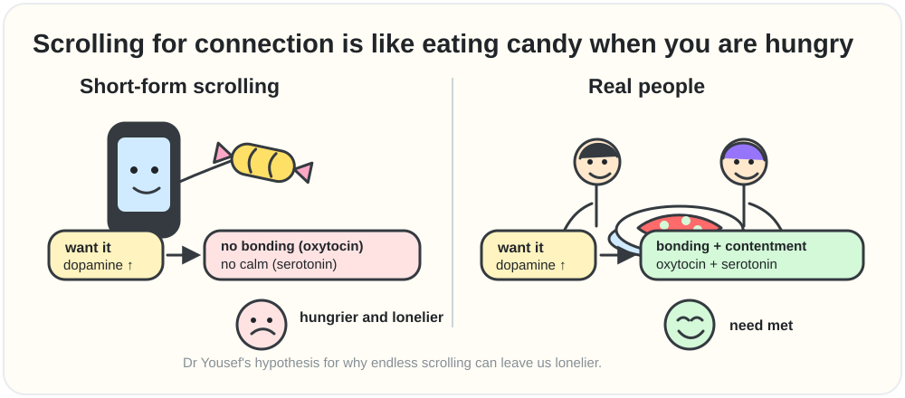

Scrolling gives the want (dopamine) without the bonding (oxytocin) or the calm (serotonin).

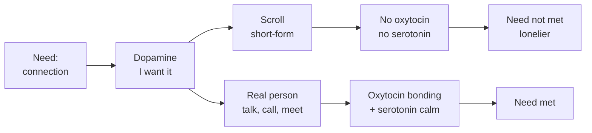

---

## 15. Brain map 101 with CEN DMN amygdala and hippocampus

⏱️ [1:53:45](https://www.youtube.com/watch?v=4Vz6L8B73i4&t=6825s) · Video chapter: “Brain Map 101: CEN, DMN, Amygdala & Hippocampus” · [⬆️ Contents](#contents)

[1:53:45](https://www.youtube.com/watch?v=4Vz6L8B73i4&t=6825s) 🎙️ **Raj:** So, we're going to do, what are we going to do? I'm going to show you a city map.

🧠 **Sahar:** Okay.

🎙️ **Raj:** Okay. Explain me how my brain works as if it was a city.

🧠 **Sahar:** So nice looking, huh? Okay. All right. Where shall I begin for you? So, not that this is what the brain actually looks like, right? It's not perfectly accurate in terms of locations, but I what I think is really beautiful about this particular setup you have here is you have so many of the different brain areas and the neural networks that I think are the most important for performance. They're the most relevant. You know what I mean? We don't nobody not every single person needs to go get a PhD in neuroscience. You know what I mean? This is like tell me the stuff I need to know.

🎙️ **Raj:** Yeah. The meaty stuff.

🧠 **Sahar:** The meaty stuff. Yeah. Okay. So, let's use actually an example because we're here to learn about getting done and being productive. I have a goal. I want to meet my goals, right? How do I do that?

🎙️ **Raj:** Yeah. How do I become this person who ends up achieving all the goals?

[1:54:47](https://www.youtube.com/watch?v=4Vz6L8B73i4&t=6887s) 🧠 **Sahar:** Yes. Yes. Okay. Let's say what does that look like for you by the way? But you want to achieve your goals. A lot of it is like stuff on the computer.

🎙️ **Raj:** Yeah. Right. You sit down and you're reading, you're writing, researching, coming up with questions, thinking a lot. Yeah.

🧠 **Sahar:** Beautiful. And it's on the computer, right? In your office

🎙️ **Raj:** Or wherever somewhere. Okay.

🧠 **Sahar:** So, in order for that to happen, a few things. One, the default mode network that we talked about before here <mark>called beautifully story studios</mark>, right? It's where all the stories are made. This is the story making machine.

🎙️ **Raj:** So, the story about myself that hey, I want to be this podcaster and this and that. It's here.

🧠 **Sahar:** Beautiful. Yes. and how you're going to get there too. Like it's going to happen. I need to do research blah blah blah. So this story network is sending information and that information is going into city hall. <mark>This is your CEN, your central executive network, the CEO</mark>, the very front section of the brain. And this is going, okay, Raj wants to be the number one podcast in the world. Okay, you want to build that. That's what we're that's the goal. That's what we're going towards. Then your CEN, this sort of frontal parietal area that's going to be focused on how you do that goal achievement, goal directed attention, it's going to try to quiet everything else down and just stay focused on whatever it is you're doing.

So let's say you're doing research. So you're on your computer and you're doing research on it on the next thing, right? You have meaning. This is where the meaning is coming from. Why? Why am I doing it? It's coming from the story. Then you have city hall that the CEO that's actually going towards the thing making it happen. Okay. Then you have a really important place here. It's another neural network. It's not just a place. It's a network. The dorsal attention network. The DAN. <mark>The DAN is like the watchtower looking.</mark> I don't know if you've seen Lord of the Rings.

[1:56:47](https://www.youtube.com/watch?v=4Vz6L8B73i4&t=7007s) 🎙️ **Raj:** No.

🧠 **Sahar:** No. It's the Eye of Sauron. Okay. For those that have seen it, this is the Watchtower. The DAN is looking look and it's pointing a spotlight, you know. So, it's like a like a flashlight or a spotlight of your attention on whatever it is that it needs to focus on. Whatever it is that and this is the tricky part. It says it needs to focus on. Who's telling it where to shine the light?

🎙️ **Raj:** The city hall.

🧠 **Sahar:** Sure. The city hall can do that. You know who else might in the middle? Not this one necessarily. the alarm tower. If there's an emergency and this one says, "Hey, oh my god, panic," then the DAN will say, "Raj, stop focusing on your Google doc. We have there's emergencies happening. Go look at this." Or, for example, the dispatch center salience network. This is like emergency calls, your satellite system. Something's happening. I don't know what it is. Maybe it's not an emergency. Maybe it's not an alarm. <mark>That's your amygdala.</mark>

> [!NOTE]
> 🔵 **Research note · The real networks behind the city map**
>
> The map is a simplification, and she says so. In brain research the **dorsal attention network** handles attention you aim on purpose, while a separate stimulus-driven system catches sudden, important things, much like the "dispatch center". In Vinod Menon's **triple network model**, the **salience network** acts as a switch between the inward-looking DMN and the task-focused CEN. So every buzz can flip you out of "focus mode".
>
> **Sources:**
> - Corbetta, M., & Shulman, G. L. (2002). Control of goal-directed and stimulus-driven attention in the brain. *Nature Reviews Neuroscience*. [link](https://doi.org/10.1038/nrn755)
> - Menon, V. (2011). Large-scale brain networks and psychopathology: A unifying triple network model. *Trends in Cognitive Sciences*. [link](https://doi.org/10.1016/j.tics.2011.08.003)

🧠 **Sahar** *(continued)*: It's a walnut- sized area deep inside of the center of the brain. And that brain area is the brain's alarm system every time there's some sort of emergency. Okay, so that's the alarm tower. You've got this amazing team. Okay, that is either going to help you meet your goals or it's going to make it potentially more difficult. But it depends on how you set yourself up for success. So going back to the example, you sit down and you have a goal.

[1:58:21](https://www.youtube.com/watch?v=4Vz6L8B73i4&t=7101s) 🎙️ **Raj:** H

🧠 **Sahar:** You have that's your meaning.

🎙️ **Raj:** Okay,

🧠 **Sahar:** Your CEO, your CEN, but it's your CEO. Let's say that's going to start focusing.

🎙️ **Raj:** Okay.

🧠 **Sahar:** Okay. Your DAN says, "Got it. No problem. Let's focus on the computer. Let's focus on the research." So your DAN, the watchtower goes, it's focusing on the work. As long as you keep focusing and as long as nothing distracts you or interrupts you, then maybe as long as you can, you will keep focusing.

🎙️ **Raj:** This is my tension.

🧠 **Sahar:** Yeah. But what's the usual setup? Remember when we talked about your phone and where you keep it?

🎙️ **Raj:** It's like here there's one notification, another there are five tabs opening, two people talking, and then I have to be everywhere and then I have to message

🧠 **Sahar:** Probably scroll a little in between. That's what always happens. So now you've got every time the notification comes in, salience network goes, "Hey, look over here. What's over there? Oh, what's that?" And then when 911, this dispatch center, the salience network says, "Look over here." The watchtower goes, "What do you want me to look at?" So it looks at something else. So this area, the salience network is what is the external essentially distraction. It is it is telling you where to orient your attention. <mark>So that's why you need to keep your digital hygiene clean.</mark> You need to have good digital hygiene when you're sitting down to work. Otherwise, you're setting yourself up for failure instead of success.

[1:59:51](https://www.youtube.com/watch?v=4Vz6L8B73i4&t=7191s) 🎙️ **Raj:** So to shut this down,

🧠 **Sahar:** You have to shut that down. Well, it's not shut it down. You can't shut it down. It's there to keep you alive. <mark>You have to clean your environment and control your environment so that you set this whole system up for success.</mark> This is you can't shut this down. The brain is going to do its thing. These are the biological laws. Remember like gravity, you can't fight this thing. This is the brain.

🎙️ **Raj:** Okay. But then I want to clean my environment in a way so that it it doesn't get triggered.

🧠 **Sahar:** Yeah.

🎙️ **Raj:** Okay.

🧠 **Sahar:** Think about, you know, um a lot of people have young kids, right? Imagine if you have a kid and they get go to school and then they come back with a bad grade and they really studied hard, you know, and then they're like so sad about it. You find out that the teacher let them all be on their phones talk. There was like a party. They're playing music. Like all these things were happening. People were chitchatting with each other. People were coming in and out while they were sitting down and taking their exam. All the parents would go crazy. They would be like, "This is not fair. this is not how you run a classroom. This is not how you give an exam.

And then they would pretty much, you know, say like we demand a redo. You have to redo it. But how do you sit down and work? You're a leader like I am. I run a team, right? When our teams sit down to actually get work done, how what's their environment like? Is it built for focus or is it built for distraction? So this is this is all of these amazing different brain areas are there to keep you alive. They're there for a purpose for sure.

[2:01:30](https://www.youtube.com/watch?v=4Vz6L8B73i4&t=7290s) 🎙️ **Raj:** But what are these two?

🧠 **Sahar:** Oh, hippocampus. It's library and archive. This is just your memories. And your memories by the way are very very close typically to the amygdala. So your hippocampus and the amygdala are rather close. This is an important I would say maybe an important note. Your amygdala is the seat of a lot of fear, right? Fear and anxiety, negative affect. Your hippocampus is the seat of a great deal of memory. <mark>Things that are negative and scary are more memorable.</mark>

> [!NOTE]
> 🔵 **Research note · Amygdala + hippocampus: why scary/emotional memories stick** · *Accurate*
>
> This matches real neuroscience closely. The amygdala (handling fear/alarm) sits right next to the hippocampus (memory) in the brain, and the two talk to each other directly: research shows the amygdala helps "stamp in" memories more strongly when an experience is emotionally arousing, partly through stress hormones. Separately, classic memory experiments show that splitting your attention while learning something hurts memory formation a lot, but splitting attention while trying to recall it later hurts much less — supporting the idea that you mainly need attention at the moment of learning, not the moment of remembering.
>
> **Sources:**
> - McGaugh, J. L. (2004). The Amygdala Modulates the Consolidation of Memories of Emotionally Arousing Experiences. Annual Review of Neuroscience, 27, 1–28. [link](https://doi.org/10.1146/annurev.neuro.27.070203.144157)
> - Phelps, E. A. (2004). Human emotion and memory: interactions of the amygdala and hippocampal complex. Current Opinion in Neurobiology, 14(2), 198–202. [link](https://doi.org/10.1016/j.conb.2004.03.015)
> - Craik, F. I. M., Govoni, R., Naveh-Benjamin, M., & Anderson, N. D. (1996). The Effects of Divided Attention on Encoding and Retrieval Processes in Human Memory. Journal of Experimental Psychology: General, 125(2), 159–180. [link](https://doi.org/10.1037/0096-3445.125.2.159)

🧠 **Sahar** *(continued)*: So, and this is actually true technically for all emotion. If you can heighten your emotions, you will remember the situation better. If you can increase, for example, even your anxiety about whether you'll forget it or not. If you're afraid of forgetting something, you're less likely to forget.

[2:02:33](https://www.youtube.com/watch?v=4Vz6L8B73i4&t=7353s) 🎙️ **Raj:** So, how do I improve my memory then of the positive things?

🧠 **Sahar:** M in general improving your memory and this is actually a a I think kind of a fun fact that's a little bit um counterintuitive. If you want to strengthen your memory, open the aperture of your attention if you <mark>you can only remember what you're attending to</mark>, right? You can't remember something that you weren't paying attention to.

🎙️ **Raj:** Yeah.

🧠 **Sahar:** <mark>So if you can heighten and sharpen your focus and your attention, then your memory will get better.</mark> It's like the funnel, right? The attention is what you're paying attention to. All the stuff that's getting in. So if you want more stuff to get in, focus on your attention if you want to remember more stuff, right? Things h you have to come in in order to go down into memory.

🎙️ **Raj:** Yeah. But

🧠 **Sahar:** That's pretty much the end of the brain city map.

🎙️ **Raj:** One thing that I keep failing at is waking up super early. And I've tried so many times. Some like I I've somehow what do you say? Somehow trained myself to get up at like 7:30 8:00 a.m. But I'm still not able to do the 5:00 a.m. club. Like I've tried really hard.

🧠 **Sahar:** Why do you want to do the 5 a.m. club?

> 🟡 **Key points · Brain map 101 with CEN DMN amygdala and hippocampus**
>
> - <mark>The brain as a city: **Story Studios = DMN** (meaning, the "why"). **City Hall = CEN** (the CEO: goal-directed attention that quiets everything else). **Watchtower = DAN**, the dorsal attention network (the spotlight). **Dispatch Center = salience network** (the satellite system: "look over here!"). **Alarm Tower = amygdala** (emergencies). **Library & Archive = hippocampus** (memories).</mark>
> - <mark>Every notification makes the dispatch center pull the spotlight away from your goal. You **cannot switch these systems off** because they keep you alive, so **control your environment** instead, the way a fair exam room would.</mark>
> - <mark>The amygdala sits next to the hippocampus, so **scary and emotional moments are remembered best**.</mark>
> - <mark>**Memory tip:** you can only remember what you paid attention to. Sharpen your attention and your memory improves.</mark>

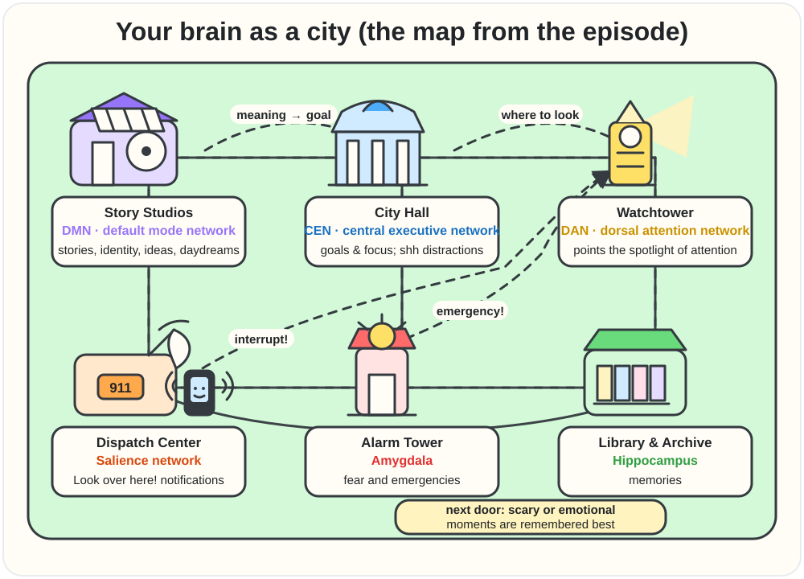

The city map from the episode, redrawn.

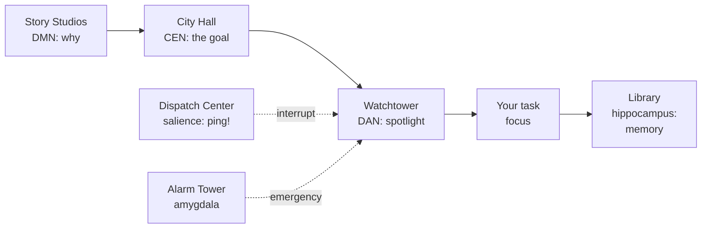

---

## 16. The truth about the 5 AM club and your body clock

⏱️ [2:03:33](https://www.youtube.com/watch?v=4Vz6L8B73i4&t=7413s) · Video chapter: “The Truth About the "5 AM Club" & Your Body Clock” · [⬆️ Contents](#contents)

[2:04:02](https://www.youtube.com/watch?v=4Vz6L8B73i4&t=7442s) 🎙️ **Raj:** Is it like you become better, your energy gets better, you focus better, all of a sudden your life turns around. This whole hype around 5:00 a.m. club, early to rise, early to bed, all that. Isn't it like that?

🧠 **Sahar:** It's For some people, yeah, for some people, but not for everybody. The most important is the foundation, the principle, the biological law and the principle is that you need to be getting enough high quality sleep. <mark>Shoot for 7 hours minimum.</mark> That should be the goal. So if you're getting enough sleep, that's the most important. This is the foundation. Doesn't really matter what time you wake up, right? this myth uh this is truly like people get off on this idea that um you know we have the saying the early bird gets the worm right we have all of these sayings because waking up late and staying up late has been historically associated with being lazy with sloth doesn't have to be that way I'm actually really proud of so many I would say modern-day leaders that are actually coming out of the closet of being night owls of being PM shifted Um, Sundar, the CEO of Google, has come out and and admitted that he does some of his best thinking at like 10:00 p.m.

> [!NOTE]
> 🔵 **Research note · Sundar Pichai as a night-owl thinker** · *Could not verify*
>
> No credible interview, profile, or reputable news article could be found where Sundar Pichai says he does his best thinking around 10pm or describes himself as a night owl. Standard biographical coverage (Wikipedia, Britannica, business press profiles) covers his career but not this specific detail about his sleep schedule. It's possible this is true but simply not traceable to any public, citable source — so it's treated as unverified rather than false.
>
> *Could not verify — searched multiple search engines and phrasings (e.g. "Sundar Pichai night owl," "Sundar Pichai best thinking 10pm," "Sundar Pichai sleep schedule/daily routine") and found no matching interview, article, or quote.*

[2:05:20](https://www.youtube.com/watch?v=4Vz6L8B73i4&t=7520s) 🎙️ **Raj:** I didn't know what did he say

🧠 **Sahar:** That he does his best thinking at like late at night and some days he like, you know, after like dinner, blah blah blah, he like likes to really like that's his sometimes his really high quality focus time. That's like that's some of the because he's PM shifted. Mhm. Now, I know that we gave you to do it, a biological chronotype assessment as well, but I want to first talk about chronotypes in general. So, this whole idea of being in the 5 a.m. club and all of this stuff, this comes from society and it's honestly BS. We don't need it.

🎙️ **Raj:** Why do you call it 5 a.m. club porn? Like 5 a.m. porn? What is

🧠 **Sahar:** It's okay? There's this there's this whole I don't even know what to call it. There's like it's like a club of people, okay, that believe that and they they love doing this as a habit. And you know what? Listen, if it works for you, do it. I think it's great. I know lots of people that wake up at 5:00 in the morning. And listen, I'm not getting up super late either. I think it's great, but the most important thing is to listen to your body. I call it 5 a.m. club porn because there's so many blogs and books and other podcasts, tweets. Uh you see all of these different like just articles and all of this content about people. It's like if you want to be the most successful version of yourself, you need to wake up at 4:30 in the morning and then you need to do 25 push-ups and then you need to drink a tall glass of lemon water with cayenne in it and then you need to do a cold plunge and then you need to do this and then you need to what a sauna then this and that and it's like oh my god what are we doing?

Like if listen, if you are not getting at least 7 hours of high quality sleep, what's the point of you waking up at 5, right? Because of this like idea that we're all like addicted to that like see it's like I call it porn because it seems like such a great idea, but it's not. It's only a good idea like if you've got all the other things like lined up truly like it's this thing that people are obsessed with. So, they're talking about it and writing about it, and it's like, look, this one CEO woke up at 5:00 and he does all this before 7:00 a.m. and that's why he's successful. And it's just not true. That's not why he's successful. It's one of his strategies.

But some other CEOs do some of their best work from 8:00 p.m. to midnight. <mark>It doesn't matter which time it is. It matters which time it is for you.</mark> And each person is a little bit different. In 2017, the Nobel Prize in Medicine went to three researchers who discovered that human beings do not share one circadian rhythm.

> [!NOTE]
> 🔵 **Research note · 2017 Nobel Prize and "three chronotypes"** · *Inaccurate*
>
> The 2017 Nobel Prize in Physiology or Medicine did go to Jeffrey C. Hall, Michael Rosbash, and Michael W. Young, but the official citation — confirmed directly on nobelprize.org — is "for their discoveries of molecular mechanisms controlling the circadian rhythm." Their actual discovery was how a gene in fruit flies (and later shown in humans) makes a protein that builds up at night and breaks down during the day, creating a self-resetting 24-hour clock inside cells. The prize documentation says nothing about "three chronotypes" or "humans don't share one circadian rhythm" — that part misrepresents the award. Genetic influence on individual chronotype (morning vs. evening preference) is a real, separate field of research, including a 2019 study of nearly 700,000 people finding hundreds of gene regions linked to being a "morning person."
>
> **Sources:**
> - The Nobel Assembly at Karolinska Institutet (2017). The 2017 Nobel Prize in Physiology or Medicine — Press Release. NobelPrize.org. [link](https://www.nobelprize.org/prizes/medicine/2017/press-release/)
> - Jones, S. E., Lane, J. M., Wood, A. R., et al. (2019). Genome-wide association analyses of chronotype in 697,828 individuals provides insights into circadian rhythms. Nature Communications, 10, 343. [link](https://doi.org/10.1038/s41467-018-08259-7)
> - Patke, A., Murphy, P. J., Onat, O. E., et al. (2017). Mutation of the Human Circadian Clock Gene CRY1 in Familial Delayed Sleep Phase Disorder. Cell, 169(2), 203–215.e13. [link](https://doi.org/10.1016/j.cell.2017.03.027)

🧠 **Sahar** *(continued)*: So, circadian rhythms are the biological sort of clock that we have that that that tells us when that we have high energy, low energy, so on and so forth. Peaks and troughs of energy throughout the course of the day. We thought that all humans generally speaking, we wake up with the sun, right?

[2:08:22](https://www.youtube.com/watch?v=4Vz6L8B73i4&t=7702s) 🎙️ **Raj:** Yeah. And

🧠 **Sahar:** Creatures of light, we wake up with the sun and we go to bed at night.

🎙️ **Raj:** Yeah.

🧠 **Sahar:** Story is a little more complicated. Welcome science to science, right? It's like a little more complicated than we thought. In 2017, the Nobel Prize in medicine went to these three researchers who discovered we don't share one circadian rhythm. We at least have three genetic what are called chronotypes. Now your chronotype is the <mark>your genetic optimum of when you feel the most energized</mark> when you feel the most uh motivated. It's even for physical f fitness it makes a big difference. Ideal times you should wake up go to sleep so on and so forth. Okay. Now the three major chronotypes are am shifted which are the folks that wake up naturally hormonally pretty early in the morning. biphasic which is in the middle it stands for the Latin two phases or two peaks

🎙️ **Raj:** Okay

🧠 **Sahar:** And the third PM shifted the AM shifted people they linearly decrease in energy over the course of the day now these individuals usually by even early evening are struggling a little bit right and their bodies will naturally wake them up how do you know your AM shifted versus the second type by phasic if you wake up super early in the morning. No matter what, even if you go to bed late, your body will wake you up. Can you imagine? Like, you go to bed at like 2 3:00 in the morning. For some people, it doesn't matter. Their body's going to wake them up at 5:00. I know. You're like, "Not me." No,

[2:10:00](https://www.youtube.com/watch?v=4Vz6L8B73i4&t=7800s) 🎙️ **Raj:** I can sleep at 10:00 and still not wake up at *(laughter)* 5.

🧠 **Sahar:** Good for you. Wow. Really? You're a good You can You can do that.

🎙️ **Raj:** Yeah. Yeah, I can sleep very long. As long as Alarm doesn't hit it, I I don't get up. Rarely, I get up.

🧠 **Sahar:** That's a blessing. Congratulate. Seriously.

🎙️ **Raj:** Yeah. Either I can't sleep or if I sleep then

🧠 **Sahar:** You're sleeping. It's such a It's a gift by the way. It's such a blessing. It truly I sometimes I'm like I have to I have systems for it but I am PM shifted which means naturally I could if left to my own devices I would be up until like 2 3:00 in the morning.

🎙️ **Raj:** Mhm.

🧠 **Sahar:** Easily.

🎙️ **Raj:** Same. like by 4 I'm like now I'm ready maybe to go to bed.

🧠 **Sahar:** Yeah, but this is not functional. *(laughter)* If I'm going to bed at 4, then I probably wouldn't wake up and I have like blackout curtains and an eye mask and all of this stuff to help keep me asleep and then I'm not waking up until way late in the morning. And you know, you get this. You run a business. I run a business. Like this is not possible. Okay, so I got to get up. So that means I have to create systems. So I go to bed usually around like 11:00 by midnight. I'm asleep. This is my

[2:11:10](https://www.youtube.com/watch?v=4Vz6L8B73i4&t=7870s) 🎙️ **Raj:** Okay. That's good. That's not bad.

🧠 **Sahar:** No. And you can do that. So, I'm telling you genetically, biologically, my body wants to go to bed in the 2 to 4 a.m. range. <mark>I'm able to shift it back at least 3 hours through behavioral adjustments.</mark> Those behavioral adjustments I can outline with you because Do you want to share your results?

🎙️ **Raj:** Yeah. So, you gave me this whole uh questionnaire to fill.

> 🟡 **Key points · The truth about the 5 AM club and your body clock**
>
> - <mark>The foundation is not your wake-up time; it is **enough high-quality sleep**. **Shoot for 7 hours minimum.**</mark>
> - <mark>**"5 AM club porn"**: routines like waking at 4:30, 25 push-ups, lemon water with cayenne, a cold plunge… They only help if they fit **your** biology. Some leaders do their best thinking late at night; she names Google's Sundar Pichai.</mark>
> - <mark>Your **chronotype** is your genetic "best time" for energy, alertness and sleep. She describes three: **AM-shifted, biphasic, PM-shifted**.</mark>
> - <mark>AM-shifted people wake early no matter what and lose energy steadily through the day.</mark>
> - <mark>She is PM-shifted (her body would sleep at 2–4 AM) but moved her bedtime **about 3 hours earlier** with behaviour systems, and is asleep by midnight.</mark>

---

## 17. Chronotypes and finding your peak performance hours

⏱️ [2:11:32](https://www.youtube.com/watch?v=4Vz6L8B73i4&t=7892s) · Video chapter: “Chronotypes: Finding Your Peak Performance Hours” · [⬆️ Contents](#contents)

[2:11:36](https://www.youtube.com/watch?v=4Vz6L8B73i4&t=7896s) 🧠 **Sahar:** Mhm.

🎙️ **Raj:** To find out can we do something like so I filled that question and it took me like 3 4 minutes it didn't take me long can we do that for people as well can you give me some link so that a lot of people who want to find out what are they what's their natural type of sleeping and waking up and what is the hour where they feel the most energetic versus when they feel really sloppy if they want to find out can we have some link of this this test to something

🧠 **Sahar:** Yes yeah we our lab has um it's it's www.mychronotype.com and we can absolutely give give folks access to it so they don't have to pay for it but to get the assessment done the same assessment you did.

🎙️ **Raj:** Perfect. Done. So we're going to we're going to go through my results.

🧠 **Sahar:** Okay.

🎙️ **Raj:** And then we'll put out a link in the description for anyone who wants to actually go test it. Okay. So this is what the report was.

🧠 **Sahar:** Yes. Let's look at it. So here's an outline first of just the three types, right? the three different types we talked about AM shifted biphasic and PM shifted and anybody else who's watching if you also take the assessment you're going to get a report as well a PDF report that's going to go over all of this information so these are the three main chronotypes now as you can see here in the center we have population distributions the population distribution here shows that <mark>the majority of people in the world are biphasic</mark>

[2:13:00](https://www.youtube.com/watch?v=4Vz6L8B73i4&t=7980s) 🎙️ **Raj:** Even they are not like 5 a.m. type

🧠 **Sahar:** No *(laughter)* so that's why I say it's stupid this 5 a.m. club for everybody like, "Oh, if you want to be the most successful version of yourself, you got to wake up at 5." No, you don't. No, you don't. This is great for like a quarter of the human population that naturally they prefer to go to bed early and wake up early. Amazing. If that's you, enjoy.

🎙️ **Raj:** Brilliant. Yeah.

🧠 **Sahar:** Brilliant. Good for you.

🎙️ **Raj:** Don't force that on me.

🧠 **Sahar:** Yeah. Go work in finance. Everybody's waking up at 5. Great. Awesome. *(laughter)* Awesome. The majority of the human population is biphasic. Also research from my lab shows by the way <mark>PM shifted is actually closer to 10% of the human population</mark>.

> [!NOTE]
> 🔵 **Research note · AM/PM/"biphasic" chronotype percentages** · *Partly accurate*
>
> The general shape is right — most chronotype research agrees a minority of people are strongly morning-oriented, a minority are strongly evening-oriented, and most people sit somewhere in between, matching the standard "morning type / intermediate type / evening type" split used by scientists. However, "biphasic" is not a standard chronotype category in the research literature — the usual middle group is just called "intermediate," and "biphasic" more properly describes the well-documented early-afternoon alertness dip most people feel (shown to come from the body clock plus hours spent awake, not mainly from lunch/digestion). Chronotype is also better described as a continuous spectrum (like a bell curve) than as three neat buckets, and no peer-reviewed source could be found giving an exact "10–15%" figure for evening types — that specific number looks like it comes from the guest's own lab data rather than a widely published population statistic.
>
> **Sources:**
> - Adan, A., Archer, S. N., Hidalgo, M. P., Di Milia, L., Natale, V., & Randler, C. (2012). Circadian Typology: A Comprehensive Review. Chronobiology International, 29(9), 1153–1175. [link](https://doi.org/10.3109/07420528.2012.719971)
> - Roenneberg, T., Wirz-Justice, A., & Merrow, M. (2003). Life between Clocks: Daily Temporal Patterns of Human Chronotypes. Journal of Biological Rhythms, 18(1), 80–90. [link](https://doi.org/10.1177/0748730402239679)
> - Monk, T. H. (2005). The Post-Lunch Dip in Performance. Clinics in Sports Medicine, 24(2), e15–e23. [link](https://doi.org/10.1016/j.csm.2004.12.002)

🧠 **Sahar** *(continued)*: So super minority. So the biphasic energy curve biphasic stands for the Latin two phases or two peaks. So that means these individuals have a midm morning peak. So not first thing in the morning. So they need like 45 minutes maybe an hour to kind of ramp up. but they're going to peak in their cortisol levels, their epinephrine, all of this amazing hormones that keep you focused and alert and awake and excited. They're going to get there. Give it an hour. So, if you wake up in the morning and you're like, "Okay, but then within 45 minutes you're like, I feel amazing, but in an hour you feel amazing, probably you're biphasic."

[2:14:14](https://www.youtube.com/watch?v=4Vz6L8B73i4&t=8054s) 🎙️ **Raj:** Okay,

🧠 **Sahar:** Now these individuals, that's their first peak in the morning. second and then they come down for an super afternoon dip. Super afternoon dip. Like they're crashing. They're these folks crash harder than anybody else. So they could really take a nap, you know, in the middle of the day. But if they listen to their body, maybe they take a break, maybe they do a workout, maybe they do some other stuff, they take a little bit of a break. After that, they get a second wind of

🎙️ **Raj:** Focus again.

🧠 **Sahar:** Yeah. A second peak. So sometimes it's early evening, sometimes it's later evening, sometimes it's late afternoon. You know, it really depends when you wake up. But you will have another peak if you're biphasic, if you play your cards right, you this is what I mean by leverage your biology because these people if they don't take a proper break midday and they don't listen to their body, that second peak will be less peaky. They won't take advantage of it. Got it? So this whole 9 to5, it doesn't really serve. It's not the way this is designed. You should be you should learn what your chronotype is so you can take advantage of your peak performance hours. <mark>2 to three hours every single day your brain is at its best.</mark>

[2:15:26](https://www.youtube.com/watch?v=4Vz6L8B73i4&t=8126s) 🎙️ **Raj:** Is it you know what I know somebody I'm not allowed to take their names but super successful multi-billionaire lives on an island bunch of things right? He did some tests with his performance coaches and all over all all those things right and he says that he sleeps 4 hours then functions then sleep 4 hours he doesn't sleep at he doesn't sleep like 8 hours a stretch will he come in by phasic

🧠 **Sahar:** No that's that's an old school tactic called like split sleep listen it's hard on the brain and the body that's not how our brains and our bodies are designed Matthew Walker who's also at UC Berkeley one of the world's most, you know, renowned sleep psychologists in his book, all of his research. Yeah, exact, you know, it y literally it spells out, all of the sleep research spells out pretty clearly that <mark>we need sustained contiguous hours of sleep</mark>.

> [!NOTE]
> 🔵 **Research note · Sleep minimums, split sleep, and bedtime timing** · *Partly accurate*
>
> "7 hours minimum" is correct — the official joint statement from the American Academy of Sleep Medicine and Sleep Research Society recommends adults get 7 or more hours nightly, and this is also what the CDC recommends. The claim that split sleep is simply "not how we're designed" oversimplifies things though: historian Roger Ekirch's research argues segmented "first sleep/second sleep" (with an awake period between) was the normal pattern before artificial lighting, and a real 1992 lab study found that long, dark winter-like nights naturally split people's sleep into two bouts — so segmented sleep isn't unnatural, it's more that today's shorter, artificially-lit nights favor one solid block. On bedtime, a large UK Biobank study of 100,000+ people found falling asleep between 10–11pm was linked to the lowest heart-disease risk — but this is an observational study (it shows a pattern, not proof that a later bedtime itself causes harm), and the real mechanism is that deep, restorative sleep happens mostly in your first sleep cycles regardless of the clock, so consistently losing those early cycles (late bedtime or early alarm) is what hurts sleep quality.
>
> **Sources:**
> - Watson, N. F., Badr, M. S., Belenky, G., et al. (2015). Recommended Amount of Sleep for a Healthy Adult: A Joint Consensus Statement of the American Academy of Sleep Medicine and Sleep Research Society. Journal of Clinical Sleep Medicine, 11(6), 591–592. [link](https://doi.org/10.5664/jcsm.4758)
> - Ekirch, A. R. (2001). Sleep We Have Lost: Pre-Industrial Slumber in the British Isles. The American Historical Review, 106(2), 343–386. [link](https://doi.org/10.2307/2651611)
> - Wehr, T. A. (1992). In short photoperiods, human sleep is biphasic. Journal of Sleep Research, 1(2), 103–107. [link](https://doi.org/10.1111/j.1365-2869.1992.tb00019.x)
> - Nikbakhtian, S., Reed, A. B., Obika, B. D., Morelli, D., Cunningham, A. C., Aral, M., & Plans, D. (2021). Accelerometer-derived sleep onset timing and cardiovascular disease incidence: a UK Biobank cohort study. European Heart Journal – Digital Health, 2(4), 658–666. [link](https://doi.org/10.1093/ehjdh/ztab088)

🧠 **Sahar** *(continued)*: You even get some higher quality benefits if you go to bed before midnight. Not really sure why. Kind of sucks for the PM shifted people, but it is what it is. So science would definitely disagree with that strategy for sure. Now, if it's working for performance, you know, fine, but it's it's not going to work for his health. It's going to be a sacrifice. You know, it would be like I've also met people that drink like five cups of coffee a day and they're just like, okay, but you're doing something not so great for yourself long at some point there will be consequences.

[2:16:58](https://www.youtube.com/watch?v=4Vz6L8B73i4&t=8218s) 🎙️ **Raj:** Yeah. Oh,

🧠 **Sahar:** Good. So okay you've got biphasic people as mentioned majority of the human population and then you have the tired the lonely the few now really 10 to 15% of the human population is PM shifted PM shifted people prefer to go to bed later and wake up later biologically

🎙️ **Raj:** That's me

🧠 **Sahar:** It is you you are PM shifted it is your chronotype we were able to actually test this and see that your chronotype is PM shifted. Now, every chronotype has a peak, a dip, and a recovery period. Okay. Now, for a PM shifted person, and maybe for this so that you can see it too, we do it this way. Okay. So, for a PM shifted person, all right, if we take the hours, let's say, of like 9:00 a.m. to to to 1:00 a.m. that you see here on the x-axis, you've got creative work ideally being done in the morning. This might be when you have some of your best ideas. Why? Because you're probably a little tired of the mornings, aren't you?

[2:18:08](https://www.youtube.com/watch?v=4Vz6L8B73i4&t=8288s) 🎙️ **Raj:** Yeah, I'm very tired in the morning.

🧠 **Sahar:** Because when you're tired, you're more likely to allow yourself to activate that DMN and be bored. You can just kind of sit back, give yourself a few minutes, let your mind wander, journal a little bit, brainstorm, just expose yourself to like really interesting, good content, and see what comes up, see what ideas you might have. When we are a little bit lower in energy levels, you're less inhibited. So, you're going to come up with a few more ideas.

🎙️ **Raj:** So, I should do my reading and like just thinking work during this time.

🧠 **Sahar:** You could experiment with it. At least try it. It's possible you've already trained yourself enough to like be able to still get a lot of really like to activate that central executive network, that CEN to get stuff done really early in the morning. But probably, and you'll tell me if this is true, that you likely hit your peak in the evening for sure.

[2:19:08](https://www.youtube.com/watch?v=4Vz6L8B73i4&t=8348s) 🎙️ **Raj:** Yeah. That means I'm like, "Go, go, go, go during the night."

🧠 **Sahar:** Really?

🎙️ **Raj:** Yeah.

🧠 **Sahar:** That's when you should be doing your focused work. You got to get done. You got to be doing that stuff at night. That evening range is when people, and by the way, I'm PM shifted, too. Women who are PM shifted are even more the minority of the human population. There's very few of us. So, but PM shifted in general, we're both minorities in the human population. So, this is we need to be taking advantage of this time. And listen, not every day because I don't know about you, but if I stay up super late working, it's going to ruin my work day and all of this stuff. I have stuff to do during the day. I have meetings sometimes at 8:00 in the morning.

So, like I can't do this often, but sometimes I give myself the gift of allowing myself to work in the evenings and then when I have time to sleep in the next day, it works really well. I can take advantage of it and get more done. So, that's what I recommend people do is really um

🎙️ **Raj:** And what do I do in the dip?

🧠 **Sahar:** Oh, administrative work. Stuff that is less important for you. We all have administrative work. Even if you outsource most of it, we still have some administrative work like less important work

[2:20:18](https://www.youtube.com/watch?v=4Vz6L8B73i4&t=8418s) 🎙️ **Raj:** Like checking emails and

🧠 **Sahar:** Yeah. Take your calls then.

🎙️ **Raj:** Send message then.

🧠 **Sahar:** Yeah. Send all the messages, take your calls then and get that stuff done. You have some shopping to do, do it then. Get a workout in. <mark>If you work out here during your dip, your peak will be even peakier.</mark> You're going to feel amazing. So many people wait until after work to go work out.

🎙️ **Raj:** Yeah. I do it in the morning.

🧠 **Sahar:** That's great. Especially for a PM shifted person. I have recommended to a lot of um CEOs that uh are A.M. shifted for them to not work out in the morning.

🎙️ **Raj:** Why?

🧠 **Sahar:** Because they wake up at 5 5:00 a.m. club porn, right? They wake up at 5:00 a.m. and their their brain is already on, man. It's like what your brain is like at night time. They're ready. They're fire.

🎙️ **Raj:** So, I should work out in the morning, not at night.

🧠 **Sahar:** For you, I would say for me, too. Yeah. because I'm not listen I'm not solving the world's biggest problems in the morning anyway I'm like drinking my coffee I'm like all right I'm like very meditative I'm very relaxed soft you know then later in the day I'm like all right let's go let's let's hit it so yeah I would my recommendation is everyone should figure out what their type is and strategically design their day when they can listen we all have meetings and responsibilities but at least know what your type is so that if you get an opportunity to protect a few hours in that peak performance window that for you is the evening. For most other people, it's going to be midm morning. That's the majority. Some people it's early morning. Protect that time.

[2:21:53](https://www.youtube.com/watch?v=4Vz6L8B73i4&t=8513s) 🎙️ **Raj:** But I'm going to be anxious till 6:00 p.m. If I don't do like the the minute I wake up and if I'm not like getting all the stuff done.

🧠 **Sahar:** Yeah.

🎙️ **Raj:** The whole day I'm going to spend an anxiety of what am I missing out if I'm not doing the work. I won't be able to think and brainstorm and read and like I won't be able to wander.

🧠 **Sahar:** How about if you wander tried wandering for you schedule it and you time yourself. You say I'm going to give myself one hour to brainstorm to see if I can come up with how many good ideas for the business and for the podcast.

🎙️ **Raj:** Does it does like scheduling wandering works?

🧠 **Sahar:** Mhm.

🎙️ **Raj:** Really?

🧠 **Sahar:** Yeah. We call it

🎙️ **Raj:** Shouldn't it be like just it should be what do you call

🧠 **Sahar:** Think time?

🎙️ **Raj:** Yeah, but then shouldn't think time be just out of nowhere random.

🧠 **Sahar:** Then it's not disciplined. *(laughter)* Then what what if you never do it? We're busy people. <mark>I think if you really care about something, you should schedule it.</mark>

🎙️ **Raj:** Got it. Interesting. Let me try this and then I'll tell you the results if I'm able to actually fix it or not.

[2:23:01](https://www.youtube.com/watch?v=4Vz6L8B73i4&t=8581s) 🧠 **Sahar:** I love it.

🎙️ **Raj:** Here's one thing very interesting. You talk a lot about burnout,

> 🟡 **Key points · Chronotypes and finding your peak performance hours**
>
> - <mark>**Biphasic (most people):** about 45–60 minutes to warm up, a **mid-morning peak**, a hard **afternoon crash**, then a **second wind** later, but only if they take a real midday break.</mark>
> - <mark>**PM-shifted** (her lab puts it at about 10–15% of people; Raj and Sahar are both PM-shifted): mornings for **creative work** and ideas (being a bit tired lowers inhibition), the dip for **admin, calls, messages, shopping and workouts**, and evenings for **focused deep work**.</mark>
> - <mark>**AM-shifted:** do not spend your sharpest morning hours on a workout.</mark>
> - <mark>Everyone gets roughly **2–3 peak hours a day**. Learn your type and **protect that window**.</mark>
> - <mark>Split sleep (4 h + 4 h) is hard on the brain and body; the science favours **one long, unbroken block**.</mark>
> - <mark>Even think time and mind-wandering can be **scheduled**: "if you really care about something, you should schedule it."</mark>
> - <mark>Her lab's free test: [mychronotype.com](https://www.mychronotype.com) (code **FIGURINGOUT**, from the video description).</mark>

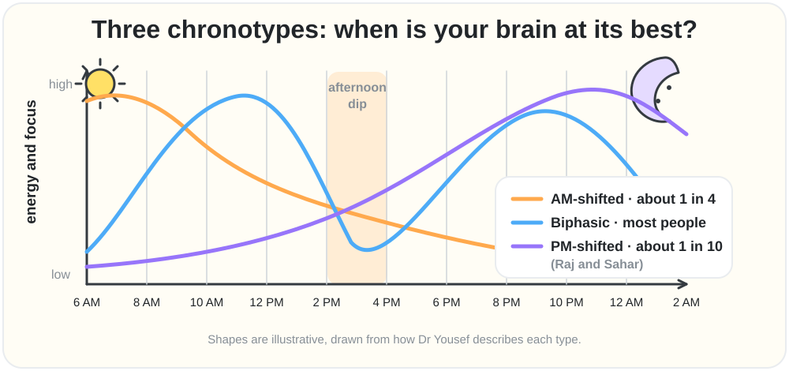

Illustrative energy curves for the three chronotypes she describes.

**Her suggested day plan, by chronotype**

| Chronotype | Deep, focused work | Admin, calls, workout | Creative thinking |
|---|---|---|---|
| AM-shifted | early morning | afternoon | evening (lower energy) |
| Biphasic | mid-morning, then the second peak | the afternoon dip | around the dip |
| PM-shifted | evening | the afternoon dip | morning |

---

## 18. Burnout vs stress and how to complete the stress cycle

⏱️ [2:23:03](https://www.youtube.com/watch?v=4Vz6L8B73i4&t=8583s) · Video chapter: “Burnout vs. Stress: How to Complete the Stress Cycle” · [⬆️ Contents](#contents)

[2:23:07](https://www.youtube.com/watch?v=4Vz6L8B73i4&t=8587s) 🎙️ **Raj:** Right? How is burnout different than anxiety or stress? Is it different? Isn't it like when you're when you're stressed all the time, when you're anxious all the time, you eventually burn out?

🧠 **Sahar:** This is such an important question. And the answer is no. They're not the same thing. But yes, if you keep stressing over and over and over again, at some point it is likely you'll burn out. It depends on how you are experiencing that stress. So let me let me put it this way. Humans are designed we're designed to experience stress. We're we're made for it. I know people like usually these days like hate the word stress. It's like a naughty word. They're like everything is about anti-stress and lowering your stress and all this stuff. Listen, stress just means like stress hormones. It just means focus, alertness, motivation. Like it's a lots of good stuff.

Like stress is not just a bad thing. You need it. <mark>If you removed all the cortisol, for example, in your body, you would be in a coma.</mark> Truly, you'd be in a coma. So, you need cortisol. It's not a bad thing. It's a good thing. So, what is bad though? And and as I mentioned, the human is designed for experiencing stress cycles. What is a stress cycle? Stress cycle is the cycle of that cortisol going up and what goes up must come down. So stress goes up, stress comes down. So we're designed for experiencing these stress cycles. Get stressed, get stressed, get stressed, okay? And it's done. Get stressed about something and deal with it. And it's done.

It's over. You can experience this dozens of times all day. Get stressed, complete the stress cycle. What does modern life look like for so many people? They wake up in the morning, the alarm goes off, they grab their phone because that's the alarm. Then they start scrolling and looking at an email and messages that have come in, WhatsApp. They're just checking all the different things. Sending them yes, confirmed, thumbs up, heart, blah, blah, blah, blah. Yes, you all of these things already. checking the news immediately before you've even had the opportunity to listen right to that internal voice. Where are my priorities? What are my goals?

Who am I? What's the story? Where is the mindset? Do any kind of work and training on yourself? You've launched yourself onto this roller coaster ride that you didn't anticipate. And now, unfortunately, in my opinion, you've started that stress response. But what happens once you start that way? Usually people keep going until they start work and then they start work and then they're in their first meeting and then the next meeting and then more emails and then more calls and then this thing and then when does it ending? It just keeps going and going and going. When are you completing the stress cycle? Remember what we said before. We're designed for stress cycles. Stress goes up, stress comes down. Stress goes up, stress comes down.

[2:26:16](https://www.youtube.com/watch?v=4Vz6L8B73i4&t=8776s) 🎙️ **Raj:** It's not coming down.

🧠 **Sahar:** It's never coming down. <mark>Stress doesn't kill. Never completing the stress cycle kills.</mark>

> [!NOTE]
> 🔵 **Research note · "Completing the stress cycle" and cortisol** · *Partly accurate*
>
> This blends a popular self-help idea with real biology. "Completing the stress cycle" is the central idea of Emily and Amelia Nagoski's 2019 book "Burnout," which argues the body needs to physically discharge stress (through exercise, breathing, affection, crying, etc.), not just remove the stressful thing — a genuinely influential idea, but a popular-psychology framework rather than a proven clinical law. It connects loosely to real science: Bruce McEwen's classic 1998 paper describes how repeatedly triggering stress hormones like cortisol ("allostatic load") wears the body down over time — though that's about too much chronic cortisol, not "incomplete cycles" specifically. Separately, it's true that cortisol is essential for life: severe cortisol deficiency (Addison's disease/adrenal insufficiency) can trigger an "adrenal crisis," a medical emergency that can cause shock, loss of consciousness, and death if untreated — so "without cortisol you'd be in a coma" is a fair dramatization of real medicine, but it answers a different question (too little cortisol) than the stress-cycle idea (too much chronic stress).
>
> **Sources:**
> - Nagoski, E., & Nagoski, A. (2019). Burnout: The Secret to Unlocking the Stress Cycle. Ballantine Books.
> - McEwen, B. S. (1998). Protective and damaging effects of stress mediators. New England Journal of Medicine, 338(3), 171–179. [link](https://doi.org/10.1056/NEJM199801153380307)
> - National Institute of Diabetes and Digestive and Kidney Diseases (NIDDK) (n.d.). Adrenal Insufficiency & Addison's Disease. National Institutes of Health. [link](https://www.niddk.nih.gov/health-information/endocrine-diseases/adrenal-insufficiency-addisons-disease)

🧠 **Sahar** *(continued)*: So if you never complete these stress cycles, it just keeps going up up up and then you just pass out and go to sleep and then you wake up the next morning and you just keep doing this and you're on this roller coaster ride with yourself. Eventually, yes, you'll experience burnout. Your adrenals like will finally give out and you'll be like, "Okay, I'm done. I'm done giving you cortisol." Isn't how mostly everybody's living these days? Yeah. And that's why, Listen, can you imagine going back and talking to your grandfather and saying, "I'm burned out at your age." Why is it that all of a sudden everybody's burning out? I met a a kid, a guy, 22 and a half, just graduated college, just started working.

It had been the first quarter. I have a and I don't I met the kid, but my friend is the one who's supervising the kid. He's like, "This guy is already saying he's burned out." Like clinically, he's like, "I need to go to the doctor. I'm burned out." And I'm just like, "You just started. You're burn I'm burned out. *(laughter)* Like, how could you possibly be burned out? How is that even feasible?" But like right now, everyone everyone is saying that they're experiencing this burnout. Well, first of all, I don't think they are. <mark>Clinical burnout is super serious.</mark>

> [!NOTE]
> 🔵 **Research note · Burnout as a distinct, serious syndrome** · *Accurate*
>
> Confirmed directly on who.int: as of 28 May 2019, the WHO's ICD-11 includes burnout as an "occupational phenomenon," explicitly stating it is "not classified as a medical condition." It is defined as resulting from "chronic workplace stress that has not been successfully managed" and has three dimensions: energy depletion/exhaustion, increased mental distance or cynicism about one's job, and reduced professional efficacy. Leading burnout researchers Maslach and Leiter confirm burnout is its own distinct, work-specific syndrome with its own research base, separate from everyday stress, anxiety, or depression — even though it can overlap with mental health struggles.
>
> **Sources:**
> - World Health Organization (2019, May 28). Burn-out an "occupational phenomenon": International Classification of Diseases. [link](https://www.who.int/news/item/28-05-2019-burn-out-an-occupational-phenomenon-international-classification-of-diseases)
> - Maslach, C., & Leiter, M. P. (2016). Understanding the burnout experience: recent research and its implications for psychiatry. World Psychiatry, 15(2), 103–111. [link](https://doi.org/10.1002/wps.20311)

🧠 **Sahar** *(continued)*: When people are stressed and they're anxious, sometimes they call that burnout. That's not the same thing. You can be stressed. It's not going to kill you. Chronic stress that never closes out for a very long time can have detrimental effects for your health for sure. <mark>So, the goal is close out your stress cycles.</mark> And there's a framework that I teach in my classes and in my lab called <mark>the 3M framework for preventing burnout</mark>.

> 🟡 **Key points · Burnout vs stress and how to complete the stress cycle**
>
> - <mark>**Stress is not the enemy.** Stress hormones mean focus, alertness and motivation. Without cortisol you would not function at all. We are built for **stress cycles**: stress goes up, then comes back down.</mark>
> - <mark>A typical modern day never lets it come down: **phone alarm → emails, WhatsApp, news → meetings → more messages →** collapse into bed → repeat.</mark>
> - <mark>**"Stress doesn't kill. Never completing the stress cycle kills."** If the cycle never closes for long enough, you can burn out.</mark>
> - <mark>Being stressed or anxious is **not** the same as **clinical burnout**, which is serious. Many people who say "burned out" mean stressed.</mark>

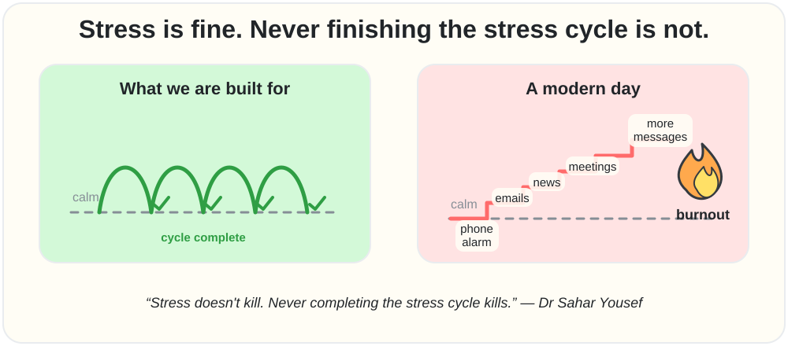

Close the loop: let stress come back down, many times a day.

---

## 19. The 3M framework of micro meso and macro breaks

⏱️ [2:28:03](https://www.youtube.com/watch?v=4Vz6L8B73i4&t=8883s) · Video chapter: “The 3M Framework: Micro, Meso & Macro Breaks” · [⬆️ Contents](#contents)

[2:28:16](https://www.youtube.com/watch?v=4Vz6L8B73i4&t=8896s) 🎙️ **Raj:** What is it?

🧠 **Sahar:** It's three different kinds of breaks. Breaks that everyone should be taking in order to actually prevent burnout from happening even if you work really hard. This is again made for super peak performers. We developed this framework and we've tested it and it works. Three different kinds of breaks. Micro breaks. This is every single day for a matter of minutes. You need to be taking a break every day for a few minutes. You can do that, right? Every week, 2 to 4 hours. Focus on the two. If the four is too much, 2 hours. And then every month, half day to a full day. You can focus on the half if you like. Half day off. When you put it that way, it doesn't sound that scary, right?

Like, come on. What are you talking about? Few minutes every day. I do that. Yeah. The distinction is, and this is what's critical. In order for all three of these kinds of breaks to actually be effective, biologically effective, for you to actually prevent burnout, you have to employ something that we call <mark>complete psychological detachment</mark>.

[2:29:31](https://www.youtube.com/watch?v=4Vz6L8B73i4&t=8971s) 🎙️ **Raj:** What do you mean by that?

🧠 **Sahar:** Glad you asked. <mark>You need to be the mental equivalent of off the grid.</mark>

> [!NOTE]
> 🔵 **Research note · The 3M recovery framework (micro/meso/macro breaks)** · *Accurate*
>
> The specific "micro/meso/macro" labels appear to be Dr. Yousef's own packaging, but the recovery science behind it is well supported. Sonnentag and Fritz's widely-used questionnaire identifies psychological detachment (mentally switching off from work) as a key ingredient of real recovery, alongside relaxation, mastery, and control. Sonnentag's follow-up review confirms people who mentally detach from work during off-hours report better well-being and less exhaustion, without being any less engaged when back at work. A 2022 meta-analysis of micro-breaks found real, modest benefits for feeling more energized and less fatigued, but the effect on actual task performance was weaker and inconsistent overall — so the well-being benefit of breaks is solid, while claims that breaks directly boost performance should be stated more cautiously. Picking a new, absorbing, active hobby fits logically with the detachment research, since an activity demanding enough to hold your attention leaves less room to keep thinking about work.
>
> **Sources:**
> - Sonnentag, S., & Fritz, C. (2007). The Recovery Experience Questionnaire: Development and validation of a measure for assessing recuperation and unwinding from work. Journal of Occupational Health Psychology, 12(3), 204–221. [link](https://doi.org/10.1037/1076-8998.12.3.204)
> - Sonnentag, S. (2012). Psychological Detachment From Work During Leisure Time: The Benefits of Mentally Disengaging From Work. Current Directions in Psychological Science, 21(2), 114–118. [link](https://doi.org/10.1177/0963721411434979)
> - Albulescu, P., Macsinga, I., Rusu, A., Sulea, C., Bodnaru, A., & Tulbure, B. T. (2022). "Give me a break!" A systematic review and meta-analysis on the efficacy of micro-breaks for increasing well-being and performance. PLOS ONE, 17(8), e0272460. [link](https://doi.org/10.1371/journal.pone.0272460)

🧠 **Sahar** *(continued)*: Complete psychological detachment means you're not thinking about all of the stuff that's stressing you out. You're not thinking about your deadlines. You're not thinking about necessarily if you have kids, your family, whatever the people that is that you're responsible for. You are just mentally off. Your mind is not on all of the things. That's really hard, isn't it? So, what do you So, what do you do in the breaks then? Well, ideally you're just resting, but that's too hard, I think, for people. When they're resting, they're thinking about stuff.

🎙️ **Raj:** Exactly.

🧠 **Sahar:** Yeah. So, my recommendation is to do something. <mark>Do something active that is challenging enough.</mark> Active enough so that it's impossible for you to do that thing and be thinking about all of your stuff at the same time.

🎙️ **Raj:** Like playing something,

🧠 **Sahar:** Like hosting a podcast, right? Like you you can't tune out. We have to stay here. Otherwise, we're *(laughter)*

[2:30:33](https://www.youtube.com/watch?v=4Vz6L8B73i4&t=9033s) 🎙️ **Raj:** Yeah. I don't know what to ask then next.

🧠 **Sahar:** Exactly. We're just going to be like, "Okay, thank you for saying that. It's going to be *(laughter)* super awkward. You're going to host the most awkward podcast in the history of time." Right. You're just going to be like, "Oh, the host keeps like daydreaming and forgetting what he's doing and where he is." Right? Or like if I started daydreaming, you're going to ask me a question like, "What was the question?" Right? It's not. We have to. We're engaged right now in something that is cognitively challenging and engaging. So right now for me and you, it's impossible for me to be worried about all the other stuff. I know you have work later tonight. So do I.

🎙️ **Raj:** Okay.

🧠 **Sahar:** Like this won't consider this won't be a break for me, right? Because

🎙️ **Raj:** It's work, right?

🧠 **Sahar:** It's work.

🎙️ **Raj:** Oh, it's work.

🧠 **Sahar:** I'm not I'm not like stressing about anything at all in this particular moment. But before and after, I will.

🎙️ **Raj:** Yes. So this is for these 4 hours. I'm just going to be like I don't care about the world at all.

🧠 **Sahar:** Well, then in that case, I would oddly maybe consider this a break for you because you're in flow at least.

[2:31:34](https://www.youtube.com/watch?v=4Vz6L8B73i4&t=9094s) 🎙️ **Raj:** Absolutely.

🧠 **Sahar:** Your DAN, that that right that watchtower

🎙️ **Raj:** It's here.

🧠 **Sahar:** It's we're not letting anything else take us away. So I would actually imagine for for you and actually for me too, we're both in flow. So, for this few hours, I've allowed myself to stop worrying about everything else and just be here present in this conversation with you. Now, for most other people, they're not hosting a podcast or not on a podcast. Okay? So, what can you do? If you're going to do a workout to de-stress, do a workout that is different, hard enough, novel. If a lot of people I know go on runs, don't go on the same run every single day because you're going to go on autopilot and just tune out. You're going to be like on the run and you know exactly where you're going every single time.

So it's going to be too easy if you do the same exact workout every single time. <mark>So change it up, mix it up, make it novel</mark> so that your brain goes, "Oh, hold on a second. Where are we? What are we doing?" And when it does that, you can't think about anything else. You have to be present. I like to cook. I love food, so I like to cook. Okay. So, when I'm cooking, if I make the same recipes that I've made hundreds of times, I can be worrying and thinking while I'm chopping my vegetables, doing all the things, right? Easy. But if I do something I've never done before, new crazy recipe, totally different, and now I have to focus. I have to put the baggage down.

My watchtower needs to be right here. I can't be anywhere else. That's what I want people to find. The mental equivalent of off the grid. This thing is quieted down and you're focused on something else, immersed. <mark>Pick up a hobby.</mark> Like force yourself. Seriously, force yourself. I'll tell you why hobbies are really important. Like active hobbies that are new and challenging, like you're learning a new skill. Learned how to play the harmonica. I'm learning by that, by the way. Maybe next time I see I'll bring a harmonica. Um or for example, whatever. Hacky sack. something silly juggling. You could learn how to juggle. You could pick a hobby for yourself and say, "I'm going to dedicate force myself even."

Seriously, you don't actually have to be interested. It could be by force for burnout. You could be like, "Listen, I'm just a high performance junkie and but I'm worried about burnout." Okay, then you have to force yourself to have some other hobby cuz that's a part of your peak performance.

[2:34:02](https://www.youtube.com/watch?v=4Vz6L8B73i4&t=9242s) 🎙️ **Raj:** Interesting.

🧠 **Sahar:** You force yourself to have the hobby and then you immerse yourself in it because it's hard. So if I want to learn how to play the guitar, it's going to take all of my energy and mind in that moment. I get a YouTube, you know, like video playing and the guy's like teaching me what to do and I'm like doing the things. I'm not thinking about anything else. I have to be right there. So that's those are my recommendations. Every day for a few minutes, you have to go mentally.

🎙️ **Raj:** What do you mean by few? 15 20.

🧠 **Sahar:** Sure. It's it's this is different for every person. So I can't give but I would say at least 10.

🎙️ **Raj:** Okay. 10 minutes even.

🧠 **Sahar:** So 10 minutes a day.

🎙️ **Raj:** Yeah.

🧠 **Sahar:** Then 2 hours a week.

🎙️ **Raj:** Mhm. Okay.

🧠 **Sahar:** And half day a month.

🎙️ **Raj:** And what do you call them? 3M. Why do you call it 3M framework?

🧠 **Sahar:** Micro, meso, and macro breaks. Easy to remember. <mark>Micro break, meso break, and a macro break.</mark> Three different kinds of breaks.

🎙️ **Raj:** You did a research right recently about people who were stressed, anxious, lonely, depressed, and then you did something about them in 9 weeks.

> 🟡 **Key points · The 3M framework of micro meso and macro breaks**
>
> - <mark>Three kinds of breaks, tested in her lab with high performers: **Micro**: every day, a few minutes (at least ~10). **Meso**: every week, 2–4 hours. **Macro**: every month, half a day to a full day.</mark>
> - <mark>They only work with **complete psychological detachment**, the **mental equivalent of being off the grid**: no thinking about deadlines, work or the people you are responsible for.</mark>
> - <mark>Pure rest easily turns into worrying, so **do something active and challenging enough that you cannot think about work**: change your workout or running route, cook a brand-new recipe, learn a new skill (harmonica, juggling, guitar). Being in **flow**, like Raj during a podcast, also counts.</mark>

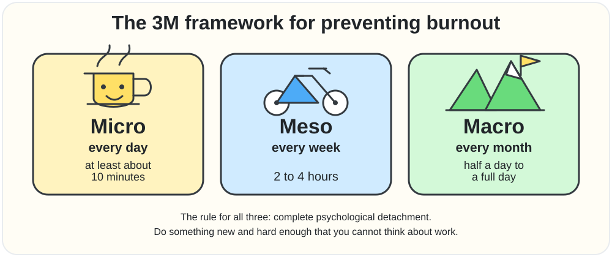

Micro, meso, macro: small breaks often, bigger breaks regularly.

---

## 20. Her 9-week study on reversing loneliness and attention loss

⏱️ [2:35:00](https://www.youtube.com/watch?v=4Vz6L8B73i4&t=9300s) · Video chapter: “Her 9-Week Study: Reversing Loneliness & Attention Loss” · [⬆️ Contents](#contents)

[2:35:14](https://www.youtube.com/watch?v=4Vz6L8B73i4&t=9314s) 🧠 **Sahar:** Yes.

🎙️ **Raj:** And then you saw miraculous results. What was it?

🧠 **Sahar:** This is currently unpublished. So, you're like the first to hear about this right now. I was literally looking at this data last night. It's kind of um amazing. I don't know how to describe it. I'm very excited.

🎙️ **Raj:** Okay.

🧠 **Sahar:** Yeah.

🎙️ **Raj:** What is it?

🧠 **Sahar:** Okay. I started teaching a class at UC Berkeley for undergraduates, so for younger people called mind machine and meaning. <mark>This class is a living experiment.</mark> Meaning instead of just learning about things in the class, I'm asking the students to change their behavior. New habits. We're breaking habits and building new ones. So, we're actually going through behavior change and neuroplasticity while the class is happening.

🎙️ **Raj:** Fascinating.

🧠 **Sahar:** Hard work.

🎙️ **Raj:** Okay.

🧠 **Sahar:** Class of 450.

🎙️ **Raj:** And you're actually making them go through neuroplasticity.

🧠 **Sahar:** Yeah.

🎙️ **Raj:** Each one of them. It'll be different for each one of them.

[2:36:14](https://www.youtube.com/watch?v=4Vz6L8B73i4&t=9374s) 🧠 **Sahar:** Yeah.

🎙️ **Raj:** Okay. What is it?

🧠 **Sahar:** And we're tracking it all. We're doing research on the students. So, we actually asked the students at the beginning of the class, sign up for science. Let's do this. come into the lab and we're going to test your attention span. We're going to test your complex working memory. We're going to test your loneliness. We're going to test your meaning and life satisfaction. We're going to test your depression, your anxiety, your stress levels. We're going to test all these things. Then we're going to go through a <mark>9week digital detox</mark>. You're going to change your relationship with scrolling. Oh, the binging, the short form media. I tell them the same thing we talked about today.

Long form could be fine. We had, you know, for homework one week everyone had to watch a movie without a second screen. That's homework in my class. This week you have to watch a movie minimum 90 minutes. They could also watch your podcast.

[2:37:17](https://www.youtube.com/watch?v=4Vz6L8B73i4&t=9437s) 🎙️ **Raj:** What a privileged class you are in. *(laughter)*

🧠 **Sahar:** Well, we're we're but we're doing the hard work. I'm telling you because it's become hard. It's like we were talking about before, right, with Netflix. You're telling me for younger kids it's harder to watch a movie.

🎙️ **Raj:** Yeah.

🧠 **Sahar:** They can't sit through a 90minute movie. No. Even if it's a good movie to to me at least. I'm like this is crazy. I'm like completely like engrossed in the thing. But it's not their fault. It's because this the short form is so it's the candy. Imagine if you're addicted to candy and what you're saying is by the way do you have like a delicious favorite meal?

🎙️ **Raj:** Yeah. So many.

🧠 **Sahar:** What? Like give me like one example. pick up any

🎙️ **Raj:** Like I said mapo tofu I love a lot *(laughter)*

🧠 **Sahar:** So good so good okay like a good one like okay so that has a lot of nutrition like it's going to fill you up right the tofu is also lots of protein and it's it's good stuff right if you were addicted to candy and it's not your fault right because it's in your p the candy's always in your pocket for some reason and it's always in your hand and you get hungry you're supposed to you're eating now you're addicted to candy do you think people who are addicted to junk food and candy like mapo tofu.

[2:38:25](https://www.youtube.com/watch?v=4Vz6L8B73i4&t=9505s) 🎙️ **Raj:** Not at all.

🧠 **Sahar:** No,

🎙️ **Raj:** Even I will.

🧠 **Sahar:** Oh, no. Exact. There you go. So that's why so the movie is totally hard work for them. So we have them go through this 9 week digital detox. We have them change their relationship with scrolling. We have them put limits on how much they can scroll. We have them do it in such a way that if they go over the limit, it's going to send a text message to one of their friends. And I find out too. We all find out. So it like keeps them it's social accountability, right? And because remember if you take away your coping mechanism for stress because for most people they're scrolling because they're stressed out and it's become a coping mechanism. They're numbing.

If you take that away from them, they're going to feel even worse. They're going to have to sit with those negative feelings and it feels really, really bad. <mark>So we also brought in a therapist to teach them emotional regulation</mark>, healthier emotional regulation techniques and strategies. Then we also had other people who have been through serious digital addiction come and tell their stories. That's what was happening in class. They were getting the inspiration. What did you call the highquality content? Bloom.

[2:39:38](https://www.youtube.com/watch?v=4Vz6L8B73i4&t=9578s) 🎙️ **Raj:** Bloom scrolling.

🧠 **Sahar:** Yeah. Bloom scrolling. We were we taught them about the content diet and we said you need to make your doom scrolling into bloom scrolling ch following all of these accounts that don't teach you anything. They don't challenge you. They don't expose you to new ideas. Now I want you to actually go in and think about like find new accounts. Talk to each other. Do research which accounts are going to actually level you up and and all whatever in in everybody's different you know. Some of the students are really into like art. Some of them are into they want to start a business. They're all over the place, right? For you in your niche. Go find the bloom.

Seek the bloom. Then we're also making sure that they in general have less screen time. And we are replacing the digital connection with real in-person connection. We threw a party, huge party, food, games, the whole thing. Live music. We people went on hikes. We set up the students on blind dates.

[2:40:40](https://www.youtube.com/watch?v=4Vz6L8B73i4&t=9640s) 🎙️ **Raj:** What kind of class is this? *(laughter)*

🧠 **Sahar:** The best class actually. That was a lot of hard work. The class is a study. It's research. I want to see and I know we can do this. But now I have the data to back it up. that people, especially young people, do not have to be as isolated and lonely, as depressed and anxious, and their attention spans do not need to be as shot as they are. <mark>Neuroplasticity is real.</mark> Neuroplasticity is real. That means that whatever we did, we did something to make this happen. You can undo it. It's like muscles, right? I can eat and never move and something's going to happen for sure to my body or I can force myself to eat good food and exercise and then other things are going to happen to my body.

🎙️ **Raj:** But what were the results like what what happened then? Like you at the beginning of the class you got their attention and like you tested bunch of things then you did all of this made it fun.

[2:41:44](https://www.youtube.com/watch?v=4Vz6L8B73i4&t=9704s) 🧠 **Sahar:** Yes.

🎙️ **Raj:** What happened then?

🧠 **Sahar:** It was also hard. They a lot of tears by the way had a lot of students crying. It was really difficult because it's it's an addiction. Everyone is going through withdrawal together. If I have 450 people, we are all experiencing withdrawal together at the same time. We're just trying to make it better by injecting connection and play. We I forced everybody for the final project. You have to pick up a hobby and work on it throughout the semester, you know. So, this was this was what we did.

🎙️ **Raj:** And for 9 weeks, they were not allowed to touch their phones.

🧠 **Sahar:** No, no, no, no. They all had their phones. M they just scrolled a little bit less. Specifically, also short form media. That was what I said. Social media and the scrolling. We're going to doom scroll a little less. Watch a movie. Watch long YouTube videos. Watch other stuff, you know. And and by the way, they still scrolled. They just scrolled a little less.

🎙️ **Raj:** So if someone was doing for 2 hours, they did it for like 30 minutes.

🧠 **Sahar:** Exactly. Some of them were doing it for 6 hours and then they brought it down to like two.

🎙️ **Raj:** Okay. Awesome. Okay. Then what happened after 9 weeks?

🧠 **Sahar:** <mark>Scores showed significantly less lonely, significantly less depressed, significantly less anxious.</mark> <mark>Their attention spans went up significantly.</mark>

> [!NOTE]
> 🔵 **Research note · Cutting social media in real experiments** · *Accurate*
>
> Real published experiments back up the general pattern described (less scrolling → better mood/focus), which is useful context since her own 450-student, 9-week study is unpublished and can't be independently checked. A 2018 experiment had college students cut Facebook/Instagram/Snapchat to 10 minutes a day for three weeks and found less loneliness and depression versus a control group. A landmark 2020 study paid people to deactivate Facebook for four weeks and found it improved well-being (though people also felt less informed about news). Most recently, a 2025 two-week trial that blocked mobile internet (not calls/texts) found improvements in attention, mental health and well-being (91% of participants improved on at least one of these measures), partly explained by more in-person socializing, exercise and time outdoors — all three are genuine randomized experiments, not just surveys.
>
> **Sources:**
> - Hunt, M. G., Marx, R., Lipson, C., & Young, J. (2018). No More FOMO: Limiting Social Media Decreases Loneliness and Depression. Journal of Social and Clinical Psychology, 37(10), 751–768. [link](https://doi.org/10.1521/jscp.2018.37.10.751)
> - Allcott, H., Braghieri, L., Eichmeyer, S., & Gentzkow, M. (2020). The Welfare Effects of Social Media. American Economic Review, 110(3), 629–676. [link](https://doi.org/10.1257/aer.20190658)
> - Castelo, N., Kushlev, K., Ward, A. F., Esterman, M., & Reiner, P. B. (2025). Blocking mobile internet on smartphones improves sustained attention, mental health, and subjective well-being. PNAS Nexus, 4(2), pgaf017. [link](https://doi.org/10.1093/pnasnexus/pgaf017)

🧠 **Sahar** *(continued)*: Their complex working memory, which is a proxy for general fluid intelligence, significantly increased. It's it's almost unbelievable when I look at the results myself. I didn't think it was going to be this good. To be honest *(laughter)* with you, I knew I knew my intuition told me as a scientist who's been working with people about this topic for a long time that we were going to see some benefits. I didn't realize we were going to see this many benefits so fast. And by the way, they came in at the beginning of the semester when everybody was just came back from break and they were all feeling good. And when I had them do the after test after, you know, 9 weeks, they were in the middle of midterms.

So they were all super stressed out. Seriously. And even though they were during midterms, the results were still that uplifting and inspiring.

> 🟡 **Key points · Her 9-week study on reversing loneliness and attention loss**
>
> - <mark>Her UC Berkeley class **"Mind, Machine and Meaning"** (about **450 students**) is a **living experiment**: students change their habits while being studied.</mark>
> - <mark>Tests before and after: attention span, complex working memory, loneliness, meaning and life satisfaction, depression, anxiety and stress.</mark>
> - <mark>The **9-week plan**: limits on short-form scrolling (phones kept, just less scrolling, e.g. **2 h → 30 min** or **6 h → 2 h**). Going over the limit **texts a friend** (social accountability). A **therapist** taught emotional regulation, people who beat digital addiction told their stories, feeds were rebuilt with better content ("bloom scrolling"), homework was a **90-minute movie with no second screen**, there was real-life connection (a party, hikes, even blind dates), and a **new hobby** was the final project.</mark>
> - <mark>Results (**not yet published**): significantly **less lonely, depressed and anxious**; **attention span and complex working memory** (a stand-in for fluid intelligence) went **up**, even though the second test fell during stressful midterms.</mark>

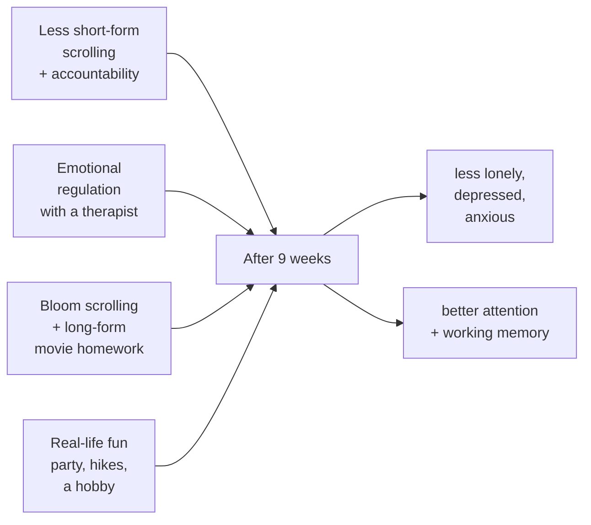

---

## 21. Can cognitive results be faked

⏱️ [2:43:45](https://www.youtube.com/watch?v=4Vz6L8B73i4&t=9825s) · Video chapter: “Can Cognitive Results Be Faked? Proving It's Not Bias” · [⬆️ Contents](#contents)

[2:43:45](https://www.youtube.com/watch?v=4Vz6L8B73i4&t=9825s) 🎙️ **Raj:** But wouldn't their results be some somewhat biased as well? Because like because I've gone through such thing 9 weeks, I'm just going to take all the good things in a survey, right?

🧠 **Sahar:** Well, you can't really gify your attention span. That's a digital assessment. <mark>Those those cognitive assessments you can't really game.</mark>

> [!NOTE]
> 🔵 **Research note · How to read an unpublished result**
>
> Objective tests do help, but a few questions are worth asking when the study is published: Was there a **control group** that did not do the detox? Taking the same cognitive test twice usually raises scores a little on its own (the **practice effect**). And students who chose to take part may differ from those who did not. Published experiments point the same way (see the note in chapter 20), so the direction is plausible; the size of the effect is what to check.
>
> **Sources:**
> - Calamia, M., Markon, K., & Tranel, D. (2012). Scoring higher the second time around: Meta-analyses of practice effects in neuropsychological assessment. *The Clinical Neuropsychologist*. [link](https://doi.org/10.1080/13854046.2012.680913)

🧠 **Sahar** *(continued)*: Sure, I guess you could like lie for some reason.

🎙️ **Raj:** Yeah, let's say I can say I'm less lonely, whatever.

🧠 **Sahar:** Sure, it is possible to lie, but this is this is But why would you? It's all anonymous. There's no benefit. If anything, the the the thing that I was worried students would do, especially during midterms, is just answer so fast that they're not even paying attention to the answers. They're just like, cuz it's anonymous. I you know I don't want to make them feel like you know they have to answer a certain way because you're right then as a professor they're gonna be like oh I need to say these things.

🎙️ **Raj:** Yeah. But then attention span like through the device you found out like it just improved.

🧠 **Sahar:** We have a test of attention that we do. It's a cognitive assessment. Um these are things I can test you on too. If you ever want you come to my lab at Berkeley and we'll get you fully tested.

[2:44:50](https://www.youtube.com/watch?v=4Vz6L8B73i4&t=9890s) 🎙️ **Raj:** Okay.

🧠 **Sahar:** Complex working memory, visual memory, attention span, the whole thing. Okay. But you sit down and these are digital assessments that you do. So there's no I'm not asking you anything. I'm actually testing it. Can you focus on this boring thing? And how long can you go before you make a mistake and miss something? And their scores improved in 9 weeks even though they were more stressed because it's now exam time.

🎙️ **Raj:** So just you're really making short form level.

🧠 **Sahar:** I'm making it candy and I have a sweet tooth like you do. I still eat candy, but eat them up with tofu first, you know? Like, don't fill up on the candy. I I I scroll. Be the first to admit on your show. I'm going to tell the world, the anti-crolling lady, I scroll, but I have limits on it. You know, like and I ask yourself the question, <mark>how much time is it worth it for you to give of your life, your precious life to scrolling every day</mark>. I'm not saying don't do it. <mark>10 minutes is good.</mark> Maybe 10 minutes of scrolling. And I'm not even saying that's all of your media. If you want to sit down and watch good quality YouTube videos for like, I don't know, 20, 30 minutes, like learn something, right?

You could do, okay, I I want to do at least half an hour of that. I want to like I have these accounts I'm following. Bloom, you know, I want to bloom scroll a little bit on these and then but like long form content that's actually challenging your mind that you remember you're learning something. You can pause the video and go look something up. These kinds of things as opposed to the doom.

[2:46:36](https://www.youtube.com/watch?v=4Vz6L8B73i4&t=9996s) 🎙️ **Raj:** Interesting. I I heard the moment you were saying how much of the time you're going to do this. I'm I'm hearing how much of the time you're going to invest in becoming dumb, in becoming lonelier, in becoming less empathetic, in becoming in ma in in making your memory worse. All of these things at the same time. Here's the last thing I ask everybody is when were you the most powerless or anxious in your life.

🧠 **Sahar:** I would say for me <mark>when I was struggling with addiction I felt powerless</mark>. And man, it felt like um a cruel joke from the universe. I study addiction. I study neuroplasticity. I study this stuff. And somehow I got tricked. You know, it's not really a trick. It's biology. It's science. But it's humbling. Um, and I think it's an important message because people need to know that everybody, we're all human, everybody's susceptible. <mark>It's about the choices we make.</mark> It's about awareness and being intentional about how you spend your time, and also what you do with your life, what you choose to ingest, what you choose to think. <mark>Be careful about what you expose your mind to.</mark>

🎙️ **Raj:** What were you addicted to?

> 🟡 **Key points · Can cognitive results be faked**
>
> - <mark>The surveys were anonymous, and attention and working memory were measured with **digital cognitive tests** that are hard to fake. You cannot "decide" to have a longer attention span.</mark>
> - <mark>She still scrolls ("the anti-scrolling lady, I scroll"), but with **limits**. Her suggestion: about **10 minutes of short-form a day**, plus some good long-form (20–30 minutes of videos you learn from, can pause, and can look things up from).</mark>
> - <mark>Raj's reframe: time spent scrolling is time **invested** in becoming lonelier, less empathetic and more forgetful.</mark>

---

## 22. When she felt the most powerless

⏱️ [2:47:00](https://www.youtube.com/watch?v=4Vz6L8B73i4&t=10020s) · Video chapter: “When Did She Feel the Most Powerless?” · [⬆️ Contents](#contents)

[2:48:23](https://www.youtube.com/watch?v=4Vz6L8B73i4&t=10103s) 🧠 **Sahar:** I've been addicted to a great number of things in my life. I have been addicted to uh I've I've smoked, I've drank, I've done uh scrolling, uh sugar, you name it. Um it it has been my life's most You know what's interesting? I love the word you used, powerless. From what felt like the most powerless moment in my life, it gave rise to the most powerful feelings I've ever had in my entire life. <mark>I feel unstoppable and so powerful because of overcoming addiction.</mark> So it was an opportunity.

🎙️ **Raj:** So now when you feel powerless again, what's your personal framework to become powerful?

🧠 **Sahar:** Well, this one is going to maybe sound even a little bit spiritual. I have a few beliefs. One of my beliefs is that the universe and the world is not how it seems. that a great amount of my reality is a construct of my own mind, which means I can influence the world and my life through what's happening in here. So, I protect this thing. I protect it by not letting bad stuff in. I audit what it's doing and what it's thinking. And if I'm ever feeling powerless, I remind myself that I am God. I am all powerful. I create everything in my life because you can. You truly can. You can create your own reality, your consciousness. Like literally truly my conscious experience.

If I close my eyes right now, and so do you. You can dream a reality inside of your mind. Now you might say, "But but that's not real. It's in your mind." But when something is truly real in your mind, it's real for you. So much research has also shown us that when you rehearse something and you visualize it, you daydream, you daydream about it, that <mark>the brain can barely tell the difference between daydreaming about X and actually doing X</mark>.

> [!NOTE]
> 🔵 **Research note · Rehearse the path, not only the finish line**
>
> Mental rehearsal does use many of the same brain areas as doing the real thing, and mental practice improves performance, but by less than real practice. Pure "I already made it" fantasies can even lower effort. See the research note in [chapter 5](#5-how-to-rewire-your-identity-and-change-your-beliefs): picture the goal, the obstacles, and your if-then plan.

[2:50:46](https://www.youtube.com/watch?v=4Vz6L8B73i4&t=10246s) 🎙️ **Raj:** True.

🧠 **Sahar:** So if you're ever feeling powerless, you go into a daydream where you are the most powerful person in the world. Go into that daydream because then all of a sudden you're going to start to feel more powerful again.

🎙️ **Raj:** Nice. Here is the last question which is we always ask people about cost of ambition right? So what's the cost? What's the cost you have personally paid to become the person who you are today? What's the cost of becoming this top level scientist, researcher, businesswoman running 50 things at the same time and researching and probably telling the world about something that they don't believe in? What's the cost of all of this?

> 🟡 **Key points · When she felt the most powerless**
>
> - <mark>Her most powerless time was **addiction** (smoking, drinking, scrolling, sugar), even while she was studying addiction and neuroplasticity. **Everyone is susceptible**; what matters is awareness and intentional choices about what you let into your mind.</mark>
> - <mark>Beating it gave her the **most powerful feeling** of her life.</mark>
> - <mark>Her personal framework: much of reality is **constructed by your own mind**, so protect it, audit what it thinks, and when you feel powerless, **daydream a powerful version of yourself**.</mark>

---

## 23. The cost she paid to become Sahar Yousef

⏱️ [2:51:01](https://www.youtube.com/watch?v=4Vz6L8B73i4&t=10261s) · Video chapter: “The Cost She Paid to Become Sahar Yousef” · [⬆️ Contents](#contents)

[2:51:33](https://www.youtube.com/watch?v=4Vz6L8B73i4&t=10293s) 🧠 **Sahar:** My family and friends know the cost because they see it. <mark>There is always a cost.</mark> So, I'm so glad you asked people this question. I have been relentless and very focused in my life on building what I want to build and doing what I want to do. It doesn't allow for a lot of space for distraction. But the thing is, I've also sacrificed a lot of fun. I've sacrificed personal travel, vacations, leisure, um, scrolling. I avoided getting social media, by the way, just until recently. Completely avoided it. I have um given up friendships. I've lost friendships. <mark>I've lost a lot of very important relationships in my life because of my hyperfocus on prioritizing work.</mark>

Um addictions, as I've mentioned before, that all comes out of this relentless ambition and relentless drive towards performance. And um yeah, I've I've nearly lost my life and given my life. I will say that in the pursuit of my goals and that amount of sacrifice, I can't say I regret it because even though regretful things have happened because of it, I'm happy with where I'm at today. Not just from a success metric perspective, but I learned and now I can teach and I've corrected and <mark>now I prioritize the people in my life, the most important people</mark>. I'm like extremely community oriented and there's people around my loved ones are around me all the time and I'm around them and it's completely shifted what I sacrificed and the the negative side effects I would say what I lost um I've learned from it which is all we can do right

[2:53:46](https://www.youtube.com/watch?v=4Vz6L8B73i4&t=10426s) 🎙️ **Raj:** Thank you for sharing that thank you so much for spending time with us and teaching us about brain and productivity and cognitive things. We have missed one very important topic. We need to do that next time which are the 10 laws. We will do that. How can a human being become a superhuman? We will go through it and we will do that next podcast. So thank you so much.

🧠 **Sahar:** Thank you

🎙️ **Raj:** And to many more podcasts together

🧠 **Sahar:** To many more podcast together.

🎙️ **Raj:** Cheers. Done.

🧠 **Sahar:** Cheers.

> 🟡 **Key points · The cost she paid to become Sahar Yousef**
>
> - <mark>Relentless focus cost her fun, personal travel, holidays, **friendships and important relationships**. Her addictions came from the same drive, and she says she nearly lost her life.</mark>
> - <mark>She does not regret it because she **learned** from it. Now she **puts people and community first**.</mark>
> - <mark>Next time: her **"10 laws" of becoming superhuman** (a future episode).</mark>

---

## 24. Behind the scenes

⏱️ [2:54:17](https://www.youtube.com/watch?v=4Vz6L8B73i4&t=10457s) · Video chapter: “BTS” · [⬆️ Contents](#contents)

*Off-camera small talk after the recording.*

[2:54:17](https://www.youtube.com/watch?v=4Vz6L8B73i4&t=10457s) 🧠 **Sahar:** How are you? Pleasure. Nice to meet you. No, we're here just for purely for work. Don't care about fun at least for next two, three years.

🎙️ **Raj:** Really?

🧠 **Sahar:** Oh, yes.

🎙️ **Raj:** Are you sure?

🧠 **Sahar:** Oh, how absolutely. Just whatever makes more sense in terms of impact maximization, you know.

🎙️ **Raj:** Thank you for watching this episode till the end. We would love to know what you liked or disliked about this episode and which guests you would like to see on the show. Let us know in the comments. Your feedback help us improve and make every episode a little better. I'll see you next time. Until then, keep figuring out.

---

## 25. Outro

⏱️ [2:54:38](https://www.youtube.com/watch?v=4Vz6L8B73i4&t=10478s) · Video chapter: “Outro” · [⬆️ Contents](#contents)

*Raj signs off.*

---

## Try it this week

Small experiments from the episode. Tick them off as you go.

- [ ] Write one identity sentence: "I am the type of person who … because …" and read it every morning.
- [ ] Write one if-then plan for tonight: "When my 11 PM alarm rings, I will brush my teeth."
- [ ] The next time you reach for reels, pause and name the feeling, then close your eyes for 60 seconds.
- [ ] Do one focus block with the phone in another room and every notification off.
- [ ] Retake the paper test: "I am a great multitasker" + 1 to 20, straight, then alternating. Time both.
- [ ] Take a 20-minute walk or shower with no phone after loading up a problem, and note any idea.
- [ ] Watch a 90-minute movie with no second screen.
- [ ] Phone off 15–30 minutes before bed and for the first 15–30 minutes after waking.
- [ ] Take the chronotype test and protect your 2–3 peak hours for your hardest work.
- [ ] Plan one micro break (daily), one meso break (weekly) and one macro break (monthly) doing something new.

## References

Every source used in the 🔵 research notes, in the order they first appear.

- Maguire, E. A., et al. (2000). Navigation-related structural change in the hippocampi of taxi drivers. *PNAS*. [link](https://doi.org/10.1073/pnas.070039597)
- Draganski, B., et al. (2004). Neuroplasticity: Changes in grey matter induced by training. *Nature*. [link](https://doi.org/10.1038/427311a)
- Simons, D. J., et al. (2016). Do "brain-training" programs work? *Psychological Science in the Public Interest*. [link](https://doi.org/10.1177/1529100616661983)
- Bandura, A. (1977). Self-efficacy: Toward a unifying theory of behavioral change. *Psychological Review*. [link](https://doi.org/10.1037/0033-295X.84.2.191)
- Sisk, V. F., et al. (2018). To what extent and under which circumstances are growth mind-sets important to academic achievement? Two meta-analyses. *Psychological Science*. [link](https://doi.org/10.1177/0956797617739704)
- Yeager, D. S., et al. (2019). A national experiment reveals where a growth mindset improves achievement. *Nature*. [link](https://doi.org/10.1038/s41586-019-1466-y)
- Wegner, D. M., Schneider, D. J., Carter, S. R., & White, T. L. (1987). Paradoxical effects of thought suppression. *Journal of Personality and Social Psychology*. [link](https://doi.org/10.1037/0022-3514.53.1.5)
- Raichle, M. E., MacLeod, A. M., Snyder, A. Z., Powers, W. J., Gusnard, D. A., & Shulman, G. L. (2001). A default mode of brain function. Proceedings of the National Academy of Sciences, 98(2), 676–682. [link](https://doi.org/10.1073/pnas.98.2.676)
- Fox, M. D., Snyder, A. Z., Vincent, J. L., Corbetta, M., Van Essen, D. C., & Raichle, M. E. (2005). The human brain is intrinsically organized into dynamic, anticorrelated functional networks. Proceedings of the National Academy of Sciences, 102(27), 9673–9678. [link](https://doi.org/10.1073/pnas.0504136102)
- Buckner, R. L., Andrews-Hanna, J. R., & Schacter, D. L. (2008). The Brain's Default Network: Anatomy, Function, and Relevance to Disease. Annals of the New York Academy of Sciences, 1124(1), 1–38. [link](https://doi.org/10.1196/annals.1440.011)
- Menon, V. (2011). Large-scale brain networks and psychopathology: a unifying triple network model. Trends in Cognitive Sciences, 15(10), 483–506. [link](https://doi.org/10.1016/j.tics.2011.08.003)
- Wiseman, R. (2003). The Luck Factor. Skeptical Inquirer, 27(3) [May/June 2003] — popular-science magazine summary of his book "The Luck Factor" (Miramax Books, 2003), not a peer-reviewed article. [link](http://web.archive.org/web/20090709203800/http://www.richardwiseman.com/resources/The_Luck_Factor.pdf)
- Nickerson, R. S. (1998). Confirmation bias: A ubiquitous phenomenon in many guises. Review of General Psychology, 2(2), 175–220. [link](https://doi.org/10.1037/1089-2680.2.2.175)
- Oettingen, G., & Mayer, D. (2002). The motivating function of thinking about the future: Expectations versus fantasies. Journal of Personality and Social Psychology, 83(5), 1198–1212. [link](https://doi.org/10.1037/0022-3514.83.5.1198)
- Kappes, A., & Oettingen, G. (2011). Positive fantasies about idealized futures sap energy. Journal of Experimental Social Psychology, 47(4), 719–729. [link](https://doi.org/10.1016/j.jesp.2011.02.003)
- Pascual-Leone, A., Nguyet, D., Cohen, L. G., Brasil-Neto, J. P., Cammarota, A., & Hallett, M. (1995). Modulation of muscle responses evoked by transcranial magnetic stimulation during the acquisition of new fine motor skills. Journal of Neurophysiology, 74(3), 1037–1045. [link](https://doi.org/10.1152/jn.1995.74.3.1037)
- Driskell, J. E., Copper, C., & Moran, A. (1994). Does mental practice enhance performance? Journal of Applied Psychology, 79(4), 481–492. [link](https://doi.org/10.1037/0021-9010.79.4.481)
- Gollwitzer, P. M. (1999). Implementation intentions: Strong effects of simple plans. American Psychologist, 54(7), 493–503. [link](https://doi.org/10.1037/0003-066X.54.7.493)
- Gollwitzer, P. M., & Sheeran, P. (2006). Implementation intentions and goal achievement: A meta-analysis of effects and processes. Advances in Experimental Social Psychology, 38, 69–119. [link](https://doi.org/10.1016/S0065-2601%2806%2938002-1)
- Fogg, B. J. (2019). Tiny Habits: The Small Changes That Change Everything. Houghton Mifflin Harcourt.
- Clear, J. (2018). Atomic Habits: Tiny Changes, Remarkable Results. Avery.
- Lally, P., van Jaarsveld, C. H. M., Potts, H. W. W., & Wardle, J. (2010). How are habits formed: Modelling habit formation in the real world. European Journal of Social Psychology, 40(6), 998–1009. [link](https://doi.org/10.1002/ejsp.674)
- American Psychiatric Association. What Is Addiction?. [link](https://www.psychiatry.org/patients-families/addiction/what-is-addiction)
- Wood, W., & Neal, D. T. (2007). A new look at habits and the habit-goal interface. Psychological Review, 114(4), 843–863. [link](https://doi.org/10.1037/0033-295X.114.4.843)
- Wood, W., & Rünger, D. (2016). Psychology of Habit. Annual Review of Psychology, 67, 289–314. [link](https://doi.org/10.1146/annurev-psych-122414-033417)
- Everitt, B. J., & Robbins, T. W. (2005). Neural systems of reinforcement for drug addiction: from actions to habits to compulsion. Nature Neuroscience, 8(11), 1481–1489. [link](https://doi.org/10.1038/nn1579)
- Grobelny, J., Glinka, M., & Chirkowska-Smolak, T. (2024). The impact of hedonic social media use during microbreaks on employee resources recovery. Scientific Reports, 14, 21603. [link](https://doi.org/10.1038/s41598-024-72825-x)
- Kang, S., & Kurtzberg, T. R. (2019). Reach for your cell phone at your own risk: The cognitive costs of media choice for breaks. Journal of Behavioral Addictions, 8(3), 395–403. [link](https://doi.org/10.1556/2006.8.2019.21)
- Berman, M. G., Jonides, J., & Kaplan, S. (2008). The cognitive benefits of interacting with nature. Psychological Science, 19(12), 1207–1212. [link](https://doi.org/10.1111/j.1467-9280.2008.02225.x)
- Albulescu, P., Macsinga, I., Rusu, A., Sulea, C., Bodnaru, A., & Tulbure, B. T. (2022). "Give me a break!" A systematic review and meta-analysis on the efficacy of micro-breaks for increasing well-being and performance. PLOS ONE, 17(8), e0272460. [link](https://doi.org/10.1371/journal.pone.0272460)
- Ward, A. F., Duke, K., Gneezy, A., & Bos, M. W. (2017). Brain Drain: The Mere Presence of One's Own Smartphone Reduces Available Cognitive Capacity. Journal of the Association for Consumer Research, 2(2), 140–154. [link](https://doi.org/10.1086/691462)
- UT News (2017). The Mere Presence of Your Smartphone Reduces Brain Power, Study Shows. The University of Texas at Austin. [link](https://news.utexas.edu/2017/06/26/the-mere-presence-of-your-smartphone-reduces-brain-power/)
- Ruiz Pardo, A. C., & Minda, J. P. (2022). Reexamining the "brain drain" effect: A replication of Ward et al. (2017). Acta Psychologica, 230, 103717. [link](https://doi.org/10.1016/j.actpsy.2022.103717)
- Parry, D. A. (2024). Does the Mere Presence of a Smartphone Impact Cognitive Performance? A Meta-Analysis of the "Brain Drain Effect." Media Psychology, 27(5), 737–762. [link](https://doi.org/10.1080/15213269.2023.2286647)
- Böttger, T., Poschik, M., & Zierer, K. (2023). Does the Brain Drain Effect Really Exist? A Meta-Analysis. Behavioral Sciences, 13(9), 751. [link](https://doi.org/10.3390/bs13090751)
- Przybylski, A. K., & Weinstein, N. (2013). Can You Connect With Me Now? How the Presence of Mobile Communication Technology Influences Face-to-Face Conversation Quality. Journal of Social and Personal Relationships, 30(3), 237–246. [link](https://doi.org/10.1177/0265407512453827)
- Misra, S., Cheng, L., Genevie, J., & Yuan, M. (2016). The iPhone Effect: The Quality of In-Person Social Interactions in the Presence of Mobile Devices. Environment and Behavior, 48(2), 275–298. [link](https://doi.org/10.1177/0013916514539755)
- Vanden Abeele, M. M. P., Antheunis, M. L., & Schouten, A. P. (2016). The effect of mobile messaging during a conversation on impression formation and interaction quality. Computers in Human Behavior, 62, 562–569. [link](https://doi.org/10.1016/j.chb.2016.04.005)
- Roberts, J. A., & David, M. E. (2016). "My life has become a major distraction from my cell phone": Partner phubbing and relationship satisfaction among romantic partners. Computers in Human Behavior, 54, 134–141. [link](https://doi.org/10.1016/j.chb.2015.07.058)
- Sleep Foundation (2024). Sleep Hygiene. [link](https://www.sleepfoundation.org/sleep-hygiene)
- Chang, A. M., Aeschbach, D., Duffy, J. F., & Czeisler, C. A. (2015). Evening use of light-emitting eReaders negatively affects sleep, circadian timing, and next-morning alertness. Proceedings of the National Academy of Sciences (PNAS), 112(4), 1232–1237. [link](https://doi.org/10.1073/pnas.1418490112)
- Hale, L., & Guan, S. (2015). Screen time and sleep among school-aged children and adolescents: a systematic literature review. Sleep Medicine Reviews, 21, 50–58. [link](https://doi.org/10.1016/j.smrv.2014.07.007)
- Crenshaw, D. (2008). The Myth of Multitasking: How "Doing It All" Gets Nothing Done. Jossey-Bass.
- Rubinstein, J. S., Meyer, D. E., & Evans, J. E. (2001). Executive control of cognitive processes in task switching. Journal of Experimental Psychology: Human Perception and Performance, 27(4), 763–797. [link](https://doi.org/10.1037/0096-1523.27.4.763)
- American Psychological Association (2006). Multitasking: Switching costs. [link](https://www.apa.org/topics/research/multitasking)
- Sanbonmatsu, D. M., Strayer, D. L., Medeiros-Ward, N., & Watson, J. M. (2013). Who multi-tasks and why? Multi-tasking ability, perceived multi-tasking ability, impulsivity, and sensation seeking. PLOS ONE, 8(1), e54402. [link](https://doi.org/10.1371/journal.pone.0054402)
- Ophir, E., Nass, C., & Wagner, A. D. (2009). Cognitive control in media multitaskers. Proceedings of the National Academy of Sciences, 106(37), 15583–15587. [link](https://doi.org/10.1073/pnas.0903620106)
- Wiradhany, W., & Nieuwenstein, M. R. (2017). Cognitive control in media multitaskers: Two replication studies and a meta-analysis. Attention, Perception, & Psychophysics, 79(8), 2620–2641. [link](https://doi.org/10.3758/s13414-017-1408-4)
- Song, P., et al. (2021). The prevalence of adult attention-deficit hyperactivity disorder: A global systematic review and meta-analysis. *Journal of Global Health*. [link](https://doi.org/10.7189/jogh.11.04009)
- Beaty, R. E., Kenett, Y. N., Christensen, A. P., Rosenberg, M. D., Benedek, M., Chen, Q., Fink, A., Qiu, J., Kwapil, T. R., Kane, M. J., & Silvia, P. J. (2018). Robust prediction of individual creative ability from brain functional connectivity. Proceedings of the National Academy of Sciences, 115(5), 1087–1092. [link](https://doi.org/10.1073/pnas.1713532115)
- Beaty, R. E., Benedek, M., Silvia, P. J., & Schacter, D. L. (2016). Creative Cognition and Brain Network Dynamics. Trends in Cognitive Sciences, 20(2), 87–95. [link](https://doi.org/10.1016/j.tics.2015.10.004)
- Mann, S., & Cadman, R. (2014). Does Being Bored Make Us More Creative? Creativity Research Journal, 26(2), 165–173. [link](https://doi.org/10.1080/10400419.2014.901073)
- Guth, R. A. (2005). In Secret Hideaway, Bill Gates Ponders Microsoft's Future. The Wall Street Journal. [link](https://www.wsj.com/articles/SB111196625830690477)
- Gates, B. (1995). The Internet Tidal Wave [internal Microsoft memo, May 26, 1995]. Full text hosted by Wired. [link](https://www.wired.com/2010/05/0526bill-gates-internet-memo/)
- History of Microsoft. Wikipedia. [link](https://en.wikipedia.org/wiki/History_of_Microsoft)
- Baird, B., Smallwood, J., Mrazek, M. D., Kam, J. W. Y., Franklin, M. S., & Schooler, J. W. (2012). Inspired by Distraction: Mind Wandering Facilitates Creative Incubation. Psychological Science, 23(10), 1117–1122. [link](https://doi.org/10.1177/0956797612446024)
- Sio, U. N., & Ormerod, T. C. (2009). Does incubation enhance problem solving? A meta-analytic review. Psychological Bulletin, 135(1), 94–120. [link](https://doi.org/10.1037/a0014212)
- Robertson, C. E., Pröllochs, N., Schwarzenegger, K., Pärnamets, P., Van Bavel, J. J., & Feuerriegel, S. (2023). Negativity drives online news consumption. Nature Human Behaviour, 7(5), 812–822. [link](https://doi.org/10.1038/s41562-023-01538-4)
- Baumeister, R. F., Bratslavsky, E., Finkenauer, C., & Vohs, K. D. (2001). Bad Is Stronger Than Good. Review of General Psychology, 5(4), 323–370. [link](https://doi.org/10.1037/1089-2680.5.4.323)
- Rozin, P., & Royzman, E. B. (2001). Negativity Bias, Negativity Dominance, and Contagion. Personality and Social Psychology Review, 5(4), 296–320. [link](https://doi.org/10.1207/S15327957PSPR0504_2)
- Mar, R. A., & Oatley, K. (2008). The Function of Fiction is the Abstraction and Simulation of Social Experience. Perspectives on Psychological Science, 3(3), 173–192. [link](https://doi.org/10.1111/j.1745-6924.2008.00073.x)
- Mar, R. A. (2011). The neural bases of social cognition and story comprehension. Annual Review of Psychology, 62, 103–134. [link](https://doi.org/10.1146/annurev-psych-120709-145406)
- Kidd, D. C., & Castano, E. (2013). Reading Literary Fiction Improves Theory of Mind. Science, 342(6156), 377–380. [link](https://doi.org/10.1126/science.1239918)
- Panero, M. E., Weisberg, D. S., Black, J., Goldstein, T. R., Barnes, J. L., Brownell, H., & Winner, E. (2016). Does reading a single passage of literary fiction really improve theory of mind? An attempt at replication. Journal of Personality and Social Psychology, 111(5), e46–e54. [link](https://doi.org/10.1037/pspa0000064)
- Chiossi, F., Haliburton, L., Ou, C., Butz, A. M., & Schmidt, A. (2023). Short-Form Videos Degrade Our Capacity to Retain Intentions: Effect of Context Switching On Prospective Memory. Proceedings of the 2023 CHI Conference on Human Factors in Computing Systems. [link](https://doi.org/10.1145/3544548.3580778)
- Nguyen, L., Walters, J., Paul, S., Monreal Ijurco, S., Rainey, G. E., Parekh, N., Blair, G., & Darrah, M. (2025). Feeds, feelings, and focus: A systematic review and meta-analysis examining the cognitive and mental health correlates of short-form video use. Psychological Bulletin, 151(9), 1125–1146. [link](https://doi.org/10.1037/bul0000498)
- Tang, D., Zhang, X., Gou, P., et al. (2026). Association Between Short-Form Video Use and Mental Health: Systematic Review and Meta-Analysis. Journal of Medical Internet Research, 28, e82503. [link](https://doi.org/10.2196/82503)
- Mark, G. (2023). Attention Span: A Groundbreaking Way to Restore Balance, Happiness and Productivity. HarperCollins. [link](https://gloriamark.com/attention-span/)
- Mark, G., Gudith, D., & Klocke, U. (2008). The cost of interrupted work: more speed and stress. Proceedings of the SIGCHI Conference on Human Factors in Computing Systems (CHI '08), 107–110. [link](https://doi.org/10.1145/1357054.1357072)
- Cutting, J. E., DeLong, J. E., & Nothelfer, C. E. (2010). Attention and the evolution of Hollywood film. Psychological Science, 21(3), 432–439. [link](https://doi.org/10.1177/0956797610361679)
- Cutting, J. E., Brunick, K. L., DeLong, J. E., Iricinschi, C., & Candan, A. (2011). Quicker, faster, darker: Changes in Hollywood film over 75 years. i-Perception, 2(6), 569–576. [link](https://doi.org/10.1068/i0441aap)
- Tavlin, W. (2024). Casual Viewing. n+1, Issue 49. [link](https://www.nplusonemag.com/issue-49/essays/casual-viewing/)
- Goldberg, L. (2023). TV's Top 5 Podcast: Justine Bateman on AI's Danger to Hollywood. The Hollywood Reporter. [link](https://www.hollywoodreporter.com/tv/tv-news/tvs-top-5-podcast-justine-bateman-ai-dangers-hollywood-1235540858/)
- The Guardian (2025, Jan 17). 'Not second screen enough': is Netflix deliberately dumbing down TV so people can watch while scrolling?. [link](https://www.theguardian.com/tv-and-radio/2025/jan/17/not-second-screen-enough-is-netflix-deliberately-dumbing-down-tv-so-people-can-watch-while-scrolling)
- Deadline (2026, March). Netflix Execs Say They Don't Ask Filmmakers To Restate The Plot. [link](https://deadline.com/2026/03/netflix-execs-dont-ask-filmmakers-to-restate-plot-1236759763/)
- Office of the U.S. Surgeon General (2023). Our Epidemic of Loneliness and Isolation. U.S. Department of Health and Human Services. [link](https://www.hhs.gov/sites/default/files/surgeon-general-social-connection-advisory.pdf)
- Holt-Lunstad, J., Smith, T. B., & Layton, J. B. (2010). Social Relationships and Mortality Risk: A Meta-analytic Review. PLOS Medicine, 7(7), e1000316. [link](https://doi.org/10.1371/journal.pmed.1000316)
- Holt-Lunstad, J., Smith, T. B., Baker, M., Harris, T., & Stephenson, D. (2015). Loneliness and Social Isolation as Risk Factors for Mortality: A Meta-Analytic Review. Perspectives on Psychological Science, 10(2), 227–237. [link](https://doi.org/10.1177/1745691614568352)
- Tomova, L., Wang, K. L., Thompson, T., Matthews, G. A., Takahashi, A., Tye, K. M., & Saxe, R. (2020). Acute social isolation evokes midbrain craving responses similar to hunger. Nature Neuroscience, 23(12), 1597–1605. [link](https://doi.org/10.1038/s41593-020-00742-z)
- Lara, E., Martín-María, N., De la Torre-Luque, A., Koyanagi, A., Vancampfort, D., Izquierdo, A., & Miret, M. (2019). Does loneliness contribute to mild cognitive impairment and dementia? A systematic review and meta-analysis of longitudinal studies. Ageing Research Reviews, 52, 7–16. [link](https://doi.org/10.1016/j.arr.2019.03.002)
- Berridge, K. C., & Robinson, T. E. (1998). What is the role of dopamine in reward: hedonic impact, reward learning, or incentive salience? Brain Research Reviews, 28(3), 309–369. [link](https://doi.org/10.1016/S0165-0173%2898%2900019-8)
- Insel, T. R., & Young, L. J. (2001). The neurobiology of attachment. Nature Reviews Neuroscience, 2(2), 129–136. [link](https://doi.org/10.1038/35053579)
- Bartz, J. A., Zaki, J., Bolger, N., & Ochsner, K. N. (2011). Social effects of oxytocin in humans: context and person matter. Trends in Cognitive Sciences, 15(7), 301–309. [link](https://doi.org/10.1016/j.tics.2011.05.002)
- Moncrieff, J., Cooper, R. E., Stockmann, T., Amendola, S., Hengartner, M. P., & Horowitz, M. A. (2022). The serotonin theory of depression: a systematic umbrella review of the evidence. Molecular Psychiatry, 28(8), 3243–3256. [link](https://doi.org/10.1038/s41380-022-01661-0)
- Corbetta, M., & Shulman, G. L. (2002). Control of goal-directed and stimulus-driven attention in the brain. *Nature Reviews Neuroscience*. [link](https://doi.org/10.1038/nrn755)
- McGaugh, J. L. (2004). The Amygdala Modulates the Consolidation of Memories of Emotionally Arousing Experiences. Annual Review of Neuroscience, 27, 1–28. [link](https://doi.org/10.1146/annurev.neuro.27.070203.144157)
- Phelps, E. A. (2004). Human emotion and memory: interactions of the amygdala and hippocampal complex. Current Opinion in Neurobiology, 14(2), 198–202. [link](https://doi.org/10.1016/j.conb.2004.03.015)
- Craik, F. I. M., Govoni, R., Naveh-Benjamin, M., & Anderson, N. D. (1996). The Effects of Divided Attention on Encoding and Retrieval Processes in Human Memory. Journal of Experimental Psychology: General, 125(2), 159–180. [link](https://doi.org/10.1037/0096-3445.125.2.159)
- The Nobel Assembly at Karolinska Institutet (2017). The 2017 Nobel Prize in Physiology or Medicine — Press Release. NobelPrize.org. [link](https://www.nobelprize.org/prizes/medicine/2017/press-release/)
- Jones, S. E., Lane, J. M., Wood, A. R., et al. (2019). Genome-wide association analyses of chronotype in 697,828 individuals provides insights into circadian rhythms. Nature Communications, 10, 343. [link](https://doi.org/10.1038/s41467-018-08259-7)
- Patke, A., Murphy, P. J., Onat, O. E., et al. (2017). Mutation of the Human Circadian Clock Gene CRY1 in Familial Delayed Sleep Phase Disorder. Cell, 169(2), 203–215.e13. [link](https://doi.org/10.1016/j.cell.2017.03.027)
- Adan, A., Archer, S. N., Hidalgo, M. P., Di Milia, L., Natale, V., & Randler, C. (2012). Circadian Typology: A Comprehensive Review. Chronobiology International, 29(9), 1153–1175. [link](https://doi.org/10.3109/07420528.2012.719971)
- Roenneberg, T., Wirz-Justice, A., & Merrow, M. (2003). Life between Clocks: Daily Temporal Patterns of Human Chronotypes. Journal of Biological Rhythms, 18(1), 80–90. [link](https://doi.org/10.1177/0748730402239679)
- Monk, T. H. (2005). The Post-Lunch Dip in Performance. Clinics in Sports Medicine, 24(2), e15–e23. [link](https://doi.org/10.1016/j.csm.2004.12.002)
- Watson, N. F., Badr, M. S., Belenky, G., et al. (2015). Recommended Amount of Sleep for a Healthy Adult: A Joint Consensus Statement of the American Academy of Sleep Medicine and Sleep Research Society. Journal of Clinical Sleep Medicine, 11(6), 591–592. [link](https://doi.org/10.5664/jcsm.4758)
- Ekirch, A. R. (2001). Sleep We Have Lost: Pre-Industrial Slumber in the British Isles. The American Historical Review, 106(2), 343–386. [link](https://doi.org/10.2307/2651611)
- Wehr, T. A. (1992). In short photoperiods, human sleep is biphasic. Journal of Sleep Research, 1(2), 103–107. [link](https://doi.org/10.1111/j.1365-2869.1992.tb00019.x)
- Nikbakhtian, S., Reed, A. B., Obika, B. D., Morelli, D., Cunningham, A. C., Aral, M., & Plans, D. (2021). Accelerometer-derived sleep onset timing and cardiovascular disease incidence: a UK Biobank cohort study. European Heart Journal – Digital Health, 2(4), 658–666. [link](https://doi.org/10.1093/ehjdh/ztab088)
- Nagoski, E., & Nagoski, A. (2019). Burnout: The Secret to Unlocking the Stress Cycle. Ballantine Books.
- McEwen, B. S. (1998). Protective and damaging effects of stress mediators. New England Journal of Medicine, 338(3), 171–179. [link](https://doi.org/10.1056/NEJM199801153380307)
- National Institute of Diabetes and Digestive and Kidney Diseases (NIDDK) (n.d.). Adrenal Insufficiency & Addison's Disease. National Institutes of Health. [link](https://www.niddk.nih.gov/health-information/endocrine-diseases/adrenal-insufficiency-addisons-disease)
- World Health Organization (2019, May 28). Burn-out an "occupational phenomenon": International Classification of Diseases. [link](https://www.who.int/news/item/28-05-2019-burn-out-an-occupational-phenomenon-international-classification-of-diseases)
- Maslach, C., & Leiter, M. P. (2016). Understanding the burnout experience: recent research and its implications for psychiatry. World Psychiatry, 15(2), 103–111. [link](https://doi.org/10.1002/wps.20311)
- Sonnentag, S., & Fritz, C. (2007). The Recovery Experience Questionnaire: Development and validation of a measure for assessing recuperation and unwinding from work. Journal of Occupational Health Psychology, 12(3), 204–221. [link](https://doi.org/10.1037/1076-8998.12.3.204)
- Sonnentag, S. (2012). Psychological Detachment From Work During Leisure Time: The Benefits of Mentally Disengaging From Work. Current Directions in Psychological Science, 21(2), 114–118. [link](https://doi.org/10.1177/0963721411434979)
- Hunt, M. G., Marx, R., Lipson, C., & Young, J. (2018). No More FOMO: Limiting Social Media Decreases Loneliness and Depression. Journal of Social and Clinical Psychology, 37(10), 751–768. [link](https://doi.org/10.1521/jscp.2018.37.10.751)
- Allcott, H., Braghieri, L., Eichmeyer, S., & Gentzkow, M. (2020). The Welfare Effects of Social Media. American Economic Review, 110(3), 629–676. [link](https://doi.org/10.1257/aer.20190658)
- Castelo, N., Kushlev, K., Ward, A. F., Esterman, M., & Reiner, P. B. (2025). Blocking mobile internet on smartphones improves sustained attention, mental health, and subjective well-being. PNAS Nexus, 4(2), pgaf017. [link](https://doi.org/10.1093/pnasnexus/pgaf017)
- Calamia, M., Markon, K., & Tranel, D. (2012). Scoring higher the second time around: Meta-analyses of practice effects in neuropsychological assessment. *The Clinical Neuropsychologist*. [link](https://doi.org/10.1080/13854046.2012.680913)

## About this transcript

- **Source:** the video's English auto-generated captions on YouTube. The words are kept as spoken, including
  filler words and half-finished sentences.
- **Cleaned lightly:** noise tags such as `[music]` were removed, `[laughter]` is shown as *(laughter)*, the first
  letter of each turn is capitalised, and obvious caption misspellings of names and terms were fixed
  (for example amygdala, biphasic, salience, Gollwitzer, chronotype, DAN, meso, mychronotype.com).
- **Speaker names** were worked out from the context of the conversation, so a few very short replies
  ("Yeah", "Okay") may be given to the wrong person.
- **Research notes** are mine, not the speakers'. They were checked against the linked sources, but they are
  short summaries, not medical advice.
- The 🟡 key points and 🔵 notes are my summary; the conversation itself is the video.

Made from the YouTube video <a href="https://www.youtube.com/watch?v=4Vz6L8B73i4">https://www.youtube.com/watch?v=4Vz6L8B73i4</a> for personal learning.

